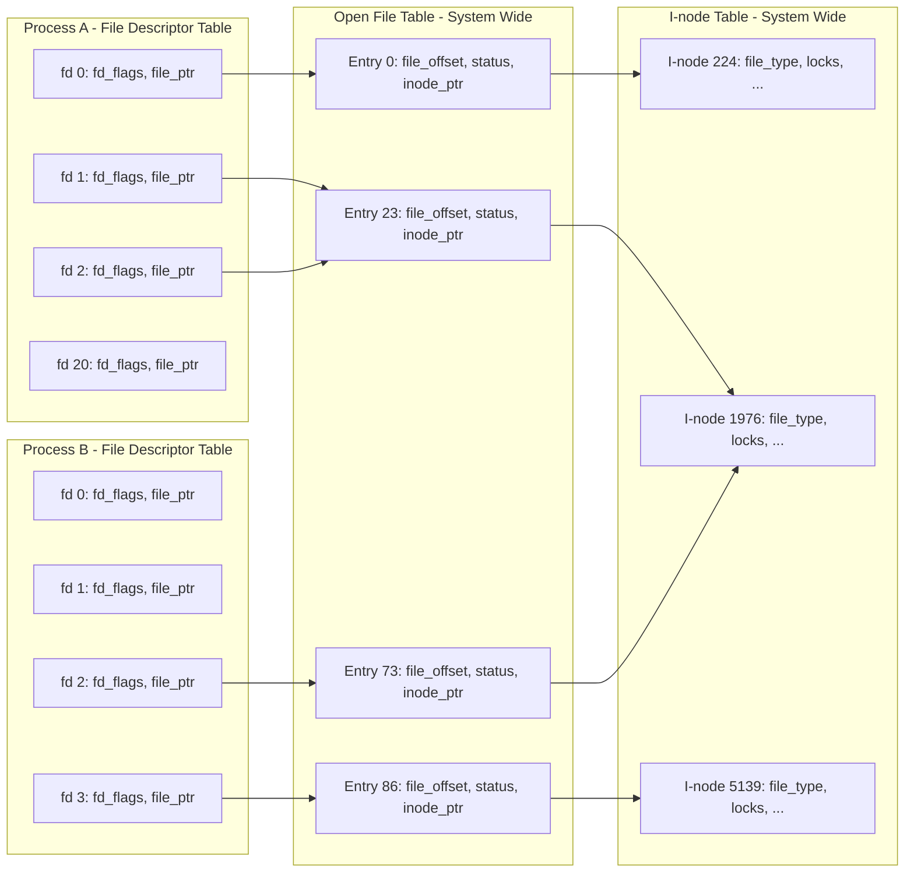

## Chương 5
# <span id="page-68-0"></span>**FILE I/O: CÁC CHI TIẾT BỔ SUNG**

Trong chương này, chúng ta mở rộng thảo luận về file I/O đã bắt đầu ở chương trước.

Tiếp tục thảo luận về system call open(), chúng ta giải thích khái niệm atomicity — quan niệm rằng các hành động được thực hiện bởi một system call được thực thi như một bước đơn lẻ không thể bị gián đoạn. Đây là yêu cầu cần thiết cho việc hoạt động đúng đắn của nhiều system call.

Chúng ta giới thiệu một system call liên quan đến file khác là fcntl() đa năng, và trình bày một trong các cách sử dụng của nó: lấy và đặt open file status flag.

Tiếp theo, chúng ta xem xét các cấu trúc dữ liệu của kernel được dùng để biểu diễn file descriptor và open file. Hiểu được mối quan hệ giữa các cấu trúc này sẽ làm rõ một số điểm tinh tế của file I/O được thảo luận trong các chương tiếp theo. Dựa trên mô hình này, chúng ta sau đó giải thích cách nhân bản file descriptor.

Sau đó chúng ta xem xét một số system call cung cấp chức năng đọc và ghi mở rộng. Các system call này cho phép chúng ta thực hiện I/O tại một vị trí cụ thể trong file mà không thay đổi file offset, và truyền dữ liệu đến và từ nhiều buffer trong một chương trình.

Chúng ta giới thiệu ngắn gọn khái niệm nonblocking I/O, và mô tả một số extension được cung cấp để hỗ trợ I/O trên các file rất lớn.

Vì temporary file được sử dụng bởi nhiều system program, chúng ta cũng sẽ xem xét một số library function cho phép chúng ta tạo và sử dụng temporary file với tên duy nhất được tạo ngẫu nhiên.

## <span id="page-69-2"></span>**5.1 Atomicity và Race Condition**

<span id="page-69-0"></span>Atomicity là một khái niệm mà chúng ta sẽ gặp nhiều lần khi thảo luận về hoạt động của system call. Tất cả các system call đều được thực thi atomically. Điều này có nghĩa là kernel đảm bảo rằng tất cả các bước trong một system call được hoàn thành như một thao tác đơn lẻ, không bị gián đoạn bởi một process hay thread khác.

Atomicity là điều cần thiết cho việc hoàn thành thành công một số thao tác. Đặc biệt, nó cho phép chúng ta tránh được race condition (đôi khi còn gọi là race hazard). Race condition là tình huống trong đó kết quả do hai process (hoặc thread) hoạt động trên tài nguyên dùng chung tạo ra phụ thuộc theo một cách bất ngờ vào thứ tự tương đối mà các process này giành được quyền truy cập CPU.

Trong vài trang tiếp theo, chúng ta xem xét hai tình huống liên quan đến file I/O xảy ra race condition, và trình bày cách các điều kiện này được loại bỏ thông qua việc sử dụng các flag của open() đảm bảo tính atomicity của các thao tác file liên quan.

Chúng ta sẽ quay lại chủ đề race condition khi mô tả sigsuspend() trong Mục 22.9 và fork() trong Mục 24.4.

## **Tạo file độc quyền**

Trong Mục [4.3.1,](#page-53-0) chúng ta đã lưu ý rằng việc chỉ định O\_EXCL kết hợp với O\_CREAT khiến open() trả về lỗi nếu file đã tồn tại. Điều này cung cấp cho một process một cách để đảm bảo rằng nó là người tạo ra file. Việc kiểm tra sự tồn tại trước đó của file và việc tạo file được thực hiện atomically. Để hiểu tại sao điều này quan trọng, hãy xem xét đoạn code trong [Listing 5-1](#page-69-1), mà chúng ta có thể phải dùng đến trong trường hợp thiếu flag O\_EXCL. (Trong đoạn code này, chúng ta hiển thị process ID được trả về bởi system call getpid(), giúp chúng ta phân biệt kết quả đầu ra của hai lần chạy khác nhau của chương trình này.)

<span id="page-69-1"></span>**Listing 5-1:** Code không đúng để mở file độc quyền

```
–––––––––––––––––––––––––––––––––––––––––––– from fileio/bad_exclusive_open.c
fd = open(argv[1], O_WRONLY); /* Open 1: check if file exists */
 if (fd != -1) { /* Open succeeded */
 printf("[PID %ld] File \"%s\" already exists\n",
 (long) getpid(), argv[1]);
 close(fd);
 } else {
 if (errno != ENOENT) { /* Failed for unexpected reason */
 errExit("open");
 } else {
 /* WINDOW FOR FAILURE */
 fd = open(argv[1], O_WRONLY | O_CREAT, S_IRUSR | S_IWUSR);
 if (fd == -1)
 errExit("open");
 printf("[PID %ld] Created file \"%s\" exclusively\n",
 (long) getpid(), argv[1]); /* MAY NOT BE TRUE! */
 }
 }
–––––––––––––––––––––––––––––––––––––––––––– from fileio/bad_exclusive_open.c
```

Ngoài việc sử dụng dài dòng với hai lần gọi open(), đoạn code trong [Listing 5-1](#page-69-1) còn chứa một bug. Giả sử rằng khi process của chúng ta gọi open() lần đầu tiên, file chưa tồn tại, nhưng đến thời điểm open() lần thứ hai, một process khác đã tạo ra file đó. Điều này có thể xảy ra nếu kernel scheduler quyết định rằng time slice của process đã hết và trao quyền điều khiển cho process khác, như được minh họa trong [Hình 5-1,](#page-70-0) hoặc nếu hai process đang chạy cùng lúc trên hệ thống multiprocessor. [Hình 5-1](#page-70-0) mô tả trường hợp hai process đều đang thực thi đoạn code trong [Listing 5-1.](#page-69-1) Trong kịch bản này, process A sẽ kết luận sai rằng nó đã tạo ra file, vì open() lần thứ hai thành công bất kể file có tồn tại hay không.

Mặc dù khả năng process tin nhầm rằng nó là người tạo file là tương đối nhỏ, nhưng khả năng xảy ra vẫn khiến đoạn code này không đáng tin cậy. Thực tế là kết quả của các thao tác này phụ thuộc vào thứ tự scheduling của hai process có nghĩa là đây là một race condition.

```txt
Process A                                    Process B
    |                                            |
    |                                            |
    v                                            |
┌─────────────────────┐                         |
│ open(..., O_WRONLY) │                         |
└─────────────────────┘                         |
    |                                            |
    | open() fails                               |
    |                                            |
    |  time slice            ||    time slice    |
    |  expires               ||    begins        |
    |                        ||                  |
    ├────────────────────────||──────────────────┤
    :                                            v
    :                                    ┌─────────────────────┐
    :                                    │ open(..., O_WRONLY) │
    :                                    └─────────────────────┘
    :                                            |
    :                                            | open() fails
    :                                            |
    :                                            v
    :                                    ┌──────────────────────┐
    :                                    │ open(..., O_WRONLY   │
    :                                    │      | O_CREAT, ...) │
    :                                    └──────────────────────┘
    :                                            |
    :                                            | open() succeeds,
    :                                            | file created
    :                                            |
    :  time slice            ||    time slice    |
    :  begins                ||    ends          |
    :                        ||                  |
    ├────────────────────────||──────────────────┤
    v                                            :
┌──────────────────────┐                        :
│ open(..., O_WRONLY   │                        :
│      | O_CREAT, ...) │                        :
└──────────────────────┘                        :
    |                                            :
    | open() succeeds                            :
    v                                            :


Chú thích:
───►  Đang thực thi trên CPU
- - ►  Đang chờ CPU
```

<span id="page-70-0"></span>**Hình 5-1:** Thất bại khi tạo file độc quyền

Để chứng minh rằng thực sự có vấn đề với đoạn code này, chúng ta có thể thay thế dòng comment WINDOW FOR FAILURE trong [Listing 5-1](#page-69-1) bằng một đoạn code tạo ra độ trễ dài một cách nhân tạo giữa việc kiểm tra sự tồn tại file và việc tạo file:

```
printf("[PID %ld] File \"%s\" doesn't exist yet\n", (long) getpid(), argv[1]);
if (argc > 2) { /* Delay between check and create */
 sleep(5); /* Suspend execution for 5 seconds */
 printf("[PID %ld] Done sleeping\n", (long) getpid());
}
```

Hàm thư viện sleep() tạm dừng thực thi của một process trong một số giây nhất định. Chúng ta thảo luận về hàm này trong Mục 23.4.

Nếu chúng ta chạy hai instance đồng thời của chương trình trong [Listing 5-1](#page-69-1), ta thấy rằng cả hai đều tuyên bố đã tạo file một cách độc quyền:

```
$ ./bad_exclusive_open tfile sleep &
[PID 3317] File "tfile" doesn't exist yet
[1] 3317
$ ./bad_exclusive_open tfile
[PID 3318] File "tfile" doesn't exist yet
[PID 3318] Created file "tfile" exclusively
$ [PID 3317] Done sleeping
[PID 3317] Created file "tfile" exclusively Not true
```

Ở dòng áp cuối của kết quả đầu ra trên, chúng ta thấy shell prompt xen lẫn với kết quả đầu ra từ instance đầu tiên của chương trình test.

Cả hai process đều tuyên bố đã tạo ra file vì đoạn code của process đầu tiên bị gián đoạn giữa bước kiểm tra sự tồn tại và bước tạo file. Việc sử dụng một lần gọi open() duy nhất chỉ định cả flag O\_CREAT lẫn O\_EXCL sẽ ngăn chặn khả năng này bằng cách đảm bảo rằng bước kiểm tra và bước tạo được thực hiện như một thao tác atomic (tức là không thể bị gián đoạn) duy nhất.

### **Append dữ liệu vào file**

Ví dụ thứ hai về sự cần thiết của atomicity là khi chúng ta có nhiều process đang append dữ liệu vào cùng một file (ví dụ: một log file toàn cục). Cho mục đích này, chúng ta có thể xem xét sử dụng đoạn code như sau trong mỗi writer của mình:

```
if (lseek(fd, 0, SEEK_END) == -1)
 errExit("lseek");
if (write(fd, buf, len) != len)
 fatal("Partial/failed write");
```

Tuy nhiên, đoạn code này mắc phải cùng một khiếm khuyết như ví dụ trước. Nếu process đầu tiên thực thi code bị gián đoạn giữa các lần gọi lseek() và write() bởi một process thứ hai làm điều tương tự, thì cả hai process sẽ đặt file offset của chúng đến cùng một vị trí trước khi ghi, và khi process đầu tiên được reschedule, nó sẽ ghi đè lên dữ liệu đã được ghi bởi process thứ hai. Một lần nữa, đây là một race condition vì kết quả phụ thuộc vào thứ tự scheduling của hai process.

Để tránh vấn đề này, cần đảm bảo rằng thao tác seek đến byte tiếp theo qua cuối file và thao tác ghi xảy ra atomically. Đây chính là điều mà việc mở file với flag O\_APPEND đảm bảo.

> Một số file system (ví dụ: NFS) không hỗ trợ O\_APPEND. Trong trường hợp này, kernel sẽ quay lại chuỗi lời gọi non-atomic như trên, với khả năng file bị hỏng như vừa mô tả.

# **5.2 Các thao tác điều khiển file: fcntl()**

System call fcntl() thực hiện một loạt các thao tác điều khiển trên một open file descriptor.

```
#include <fcntl.h>
int fcntl(int fd, int cmd, ...);
                             Return on success depends on cmd, or –1 on error
```

Tham số cmd có thể chỉ định một loạt các thao tác. Chúng ta xem xét một số trong số chúng trong các mục tiếp theo, và trì hoãn việc xem xét các thao tác khác đến các chương sau.

Như được chỉ ra bởi dấu chấm lửng, tham số thứ ba của fcntl() có thể có các kiểu khác nhau, hoặc có thể được bỏ qua. Kernel sử dụng giá trị của tham số cmd để xác định kiểu dữ liệu (nếu có) mong đợi cho tham số này.

# <span id="page-72-1"></span>**5.3 Open File Status Flag**

<span id="page-72-0"></span>Một công dụng của fcntl() là lấy lại hoặc sửa đổi access mode và open file status flag của một file đang mở. (Đây là các giá trị được đặt bởi tham số flags được chỉ định trong lời gọi open().) Để lấy lại các cài đặt này, chúng ta chỉ định cmd là F\_GETFL:

```
int flags, accessMode;
flags = fcntl(fd, F_GETFL); /* Third argument is not required */
if (flags == -1)
 errExit("fcntl");
```

Sau đoạn code trên, chúng ta có thể kiểm tra xem file có được mở để ghi synchronized hay không như sau:

```
if (flags & O_SYNC)
 printf("writes are synchronized\n");
```

SUSv3 yêu cầu rằng chỉ các status flag được chỉ định trong quá trình open() hoặc fcntl() F\_SETFL sau đó mới được đặt trên một open file. Tuy nhiên, Linux có một ngoại lệ: nếu một ứng dụng được biên dịch sử dụng một trong các kỹ thuật được mô tả trong [Mục 5.10](#page-83-1) để mở large file, thì O\_LARGEFILE sẽ luôn được đặt trong các flag được lấy lại bởi F\_GETFL.

Việc kiểm tra access mode của file phức tạp hơn một chút, vì các hằng số O\_RDONLY (0), O\_WRONLY (1) và O\_RDWR (2) không tương ứng với các bit đơn lẻ trong open file status flag. Do đó, để thực hiện kiểm tra này, chúng ta mask giá trị flags với hằng số O\_ACCMODE, rồi kiểm tra đẳng thức với một trong các hằng số:

```
accessMode = flags & O_ACCMODE;
if (accessMode == O_WRONLY || accessMode == O_RDWR)
 printf("file is writable\n");
```

Chúng ta có thể sử dụng lệnh F\_SETFL của fcntl() để sửa đổi một số open file status flag. Các flag có thể được sửa đổi là O\_APPEND, O\_NONBLOCK, O\_NOATIME, O\_ASYNC và O\_DIRECT. Các nỗ lực sửa đổi các flag khác sẽ bị bỏ qua. (Một số phiên bản UNIX khác cho phép fcntl() sửa đổi các flag khác, chẳng hạn như O\_SYNC.)

Việc sử dụng fcntl() để sửa đổi open file status flag đặc biệt hữu ích trong các trường hợp sau:

- File không được mở bởi chương trình đang gọi, vì vậy nó không có quyền kiểm soát các flag được dùng trong lời gọi open() (ví dụ: file có thể là một trong ba standard descriptor được mở trước khi chương trình bắt đầu).
- File descriptor được lấy từ một system call khác ngoài open(). Ví dụ về các system call như vậy là pipe(), tạo pipe và trả về hai file descriptor tham chiếu đến hai đầu của pipe, và socket(), tạo socket và trả về file descriptor tham chiếu đến socket.

Để sửa đổi open file status flag, chúng ta dùng fcntl() để lấy lại một bản sao của các flag hiện tại, sau đó sửa đổi các bit muốn thay đổi, và cuối cùng thực hiện một lần gọi fcntl() tiếp theo để cập nhật các flag. Vì vậy, để bật flag O\_APPEND, chúng ta sẽ viết như sau:

```
int flags;
flags = fcntl(fd, F_GETFL);
if (flags == -1)
 errExit("fcntl");
flags |= O_APPEND;
if (fcntl(fd, F_SETFL, flags) == -1)
 errExit("fcntl");
```

# **5.4 Mối quan hệ giữa File Descriptor và Open File**

<span id="page-73-0"></span>Cho đến nay, có vẻ như có mối quan hệ một-một giữa file descriptor và open file. Tuy nhiên, điều này không đúng. Có thể — và hữu ích — có nhiều descriptor tham chiếu đến cùng một open file. Các file descriptor này có thể được mở trong cùng một process hoặc trong các process khác nhau.

Để hiểu điều đang xảy ra, chúng ta cần xem xét ba cấu trúc dữ liệu do kernel duy trì:

- bảng file descriptor theo từng process;
- bảng toàn hệ thống của các open file description; và
- bảng i-node của file system.

Đối với mỗi process, kernel duy trì một bảng open file descriptor. Mỗi entry trong bảng này ghi lại thông tin về một file descriptor duy nhất, bao gồm:

- một tập flag kiểm soát hoạt động của file descriptor (chỉ có một flag như vậy, là close-on-exec flag, được mô tả trong Mục 27.4); và
- một tham chiếu đến open file description.

Kernel duy trì một bảng toàn hệ thống của tất cả các open file description. (Bảng này đôi khi được gọi là open file table, và các entry của nó đôi khi được gọi là open file handle.) Một open file description lưu trữ tất cả thông tin liên quan đến một file đang mở, bao gồm:

- file offset hiện tại (được cập nhật bởi read() và write(), hoặc được sửa đổi tường minh bằng lseek());
- status flag được chỉ định khi mở file (tức là tham số flags của open());
- access mode của file (read-only, write-only hoặc read-write, như được chỉ định trong open());
- các cài đặt liên quan đến signal-driven I/O (Mục 63.3); và
- một tham chiếu đến i-node object cho file này.

Mỗi file system có một bảng i-node cho tất cả các file nằm trong file system đó. Cấu trúc i-node, và file system nói chung, được thảo luận chi tiết hơn trong Chương 14. Hiện tại, chúng ta lưu ý rằng i-node cho mỗi file bao gồm các thông tin sau:

- loại file (ví dụ: regular file, socket hay FIFO) và permission;
- một pointer đến danh sách các lock được giữ trên file này; và
- nhiều thuộc tính của file, bao gồm kích thước và timestamp liên quan đến các loại thao tác file khác nhau.

Ở đây, chúng ta đang bỏ qua sự phân biệt giữa biểu diễn trên disk và trong memory của một i-node. I-node trên disk ghi lại các thuộc tính bền vững của file, chẳng hạn như loại, permission và timestamp. Khi một file được truy cập, một bản sao in-memory của i-node được tạo ra, và phiên bản i-node này ghi lại số lượng open file description đang tham chiếu đến i-node và major/minor ID của device mà i-node được sao chép từ đó. I-node in-memory cũng ghi lại các thuộc tính tạm thời liên kết với file khi nó đang mở, chẳng hạn như file lock.

[Hình 5-2](#page-74-0) minh họa mối quan hệ giữa file descriptor, open file description và i-node. Trong sơ đồ này, hai process có một số open file descriptor.



<span id="page-74-0"></span>**Hình 5-2:** Mối quan hệ giữa file descriptor, open file description và i-node

Trong process A, descriptor 1 và 20 đều tham chiếu đến cùng một open file description (được gắn nhãn 23). Tình huống này có thể phát sinh do kết quả của một lời gọi dup(), dup2() hay fcntl() (xem [Mục 5.5\)](#page-75-1).

Descriptor 2 của process A và descriptor 2 của process B tham chiếu đến một open file description duy nhất (73). Kịch bản này có thể xảy ra sau một lời gọi fork() (tức là process A là parent của process B, hoặc ngược lại), hoặc nếu một process truyền một open descriptor cho process khác bằng cách sử dụng UNIX domain socket (Mục 61.13.3).

Cuối cùng, chúng ta thấy rằng descriptor 0 của process A và descriptor 3 của process B tham chiếu đến các open file description khác nhau, nhưng các description đó tham chiếu đến cùng một i-node table entry (1976) — nói cách khác, đến cùng một file. Điều này xảy ra vì mỗi process đã độc lập gọi open() cho cùng một file. Một tình huống tương tự có thể xảy ra nếu một process mở cùng một file hai lần.

Chúng ta có thể rút ra một số hệ quả từ thảo luận trên:

- Hai file descriptor khác nhau tham chiếu đến cùng một open file description sẽ chia sẻ một giá trị file offset. Do đó, nếu file offset được thay đổi thông qua một file descriptor (do kết quả của các lời gọi read(), write() hay lseek()), sự thay đổi này sẽ hiển thị thông qua file descriptor kia. Điều này áp dụng cho cả trường hợp hai file descriptor thuộc cùng một process lẫn khi chúng thuộc các process khác nhau.
- Các quy tắc phạm vi tương tự áp dụng khi lấy lại và thay đổi open file status flag (ví dụ: O\_APPEND, O\_NONBLOCK và O\_ASYNC) bằng cách sử dụng các thao tác fcntl() F\_GETFL và F\_SETFL.
- Ngược lại, file descriptor flag (tức là close-on-exec flag) là riêng tư của process và file descriptor. Việc sửa đổi các flag này không ảnh hưởng đến các file descriptor khác trong cùng process hay process khác.

## <span id="page-75-1"></span>**5.5 Nhân bản File Descriptor**

<span id="page-75-0"></span>Khi sử dụng cú pháp I/O redirection 2>&1 của (Bourne shell), chúng ta thông báo cho shell rằng chúng ta muốn standard error (file descriptor 2) được chuyển hướng đến cùng nơi mà standard output (file descriptor 1) đang được gửi đến. Do đó, lệnh sau đây sẽ (vì shell đánh giá các I/O direction từ trái sang phải) gửi cả standard output lẫn standard error đến file results.log:

#### \$ **./myscript > results.log 2>&1**

Shell thực hiện chuyển hướng standard error bằng cách nhân bản file descriptor 2 để nó tham chiếu đến cùng một open file description như file descriptor 1 (tương tự như descriptor 1 và 20 của process A tham chiếu đến cùng một open file description trong [Hình 5-2\)](#page-74-0). Hiệu ứng này có thể đạt được bằng cách sử dụng các system call dup() và dup2().

Lưu ý rằng việc shell đơn giản mở file results.log hai lần là không đủ: một lần trên descriptor 1 và một lần trên descriptor 2. Một lý do là hai file descriptor sẽ không chia sẻ cùng một file offset pointer, và do đó có thể ghi đè lên kết quả đầu ra của nhau. Một lý do khác là file có thể không phải là disk file. Hãy xem xét lệnh sau, gửi standard error xuống cùng một pipe như standard output:

#### \$ **./myscript 2>&1 | less**

System call dup() nhận oldfd, một open file descriptor, và trả về một descriptor mới tham chiếu đến cùng một open file description. Descriptor mới được đảm bảo là file descriptor chưa được dùng có số nhỏ nhất.

```
#include <unistd.h>
int dup(int oldfd);
                          Returns (new) file descriptor on success, or –1 on error
```

Giả sử chúng ta thực hiện lời gọi sau:

```
newfd = dup(1);
```

Giả sử tình huống bình thường là shell đã mở file descriptor 0, 1 và 2 thay cho chương trình, và không có descriptor nào khác đang được sử dụng, dup() sẽ tạo bản sao của descriptor 1 sử dụng file 3.

Nếu chúng ta muốn bản sao là descriptor 2, chúng ta có thể dùng kỹ thuật sau:

```
close(2); /* Frees file descriptor 2 */
newfd = dup(1); /* Should reuse file descriptor 2 */
```

Đoạn code này chỉ hoạt động nếu descriptor 0 đang được mở. Để làm cho đoạn code trên đơn giản hơn, và để đảm bảo chúng ta luôn nhận được file descriptor mình muốn, chúng ta có thể dùng dup2().

```
#include <unistd.h>
int dup2(int oldfd, int newfd);
                         Returns (new) file descriptor on success, or –1 on error
```

System call dup2() tạo một bản sao của file descriptor được cung cấp trong oldfd sử dụng số descriptor được cung cấp trong newfd. Nếu file descriptor được chỉ định trong newfd đang mở, dup2() đóng nó trước. (Mọi lỗi xảy ra trong quá trình đóng này đều bị bỏ qua lặng lẽ; thực hành lập trình an toàn hơn là tường minh close() newfd nếu nó đang mở trước khi gọi dup2().)

Chúng ta có thể đơn giản hóa các lời gọi close() và dup() trước đó thành:

```
dup2(1, 2);
```

Một lời gọi dup2() thành công trả về số của descriptor bản sao (tức là giá trị được truyền vào newfd).

Nếu oldfd không phải là một file descriptor hợp lệ, thì dup2() thất bại với lỗi EBADF và newfd không bị đóng. Nếu oldfd là file descriptor hợp lệ, và oldfd và newfd có cùng giá trị, thì dup2() không làm gì cả — newfd không bị đóng, và dup2() trả về newfd như kết quả hàm.

Một interface bổ sung cung cấp thêm sự linh hoạt để nhân bản file descriptor là thao tác F\_DUPFD của fcntl():

```
newfd = fcntl(oldfd, F_DUPFD, startfd);
```

Lời gọi này tạo một bản sao của oldfd bằng cách sử dụng file descriptor chưa được dùng thấp nhất lớn hơn hoặc bằng startfd. Điều này hữu ích nếu chúng ta muốn đảm bảo rằng descriptor mới (newfd) nằm trong một phạm vi giá trị nhất định. Các lời gọi dup() và dup2() luôn có thể được viết lại thành các lời gọi close() và fcntl(), mặc dù các lời gọi trước đây ngắn gọn hơn. (Lưu ý thêm rằng một số mã lỗi errno được trả về bởi dup2() và fcntl() có sự khác nhau, như được mô tả trong trang manual.)

Từ [Hình 5-2](#page-74-0), chúng ta có thể thấy rằng các file descriptor bản sao chia sẻ cùng giá trị file offset và status flag trong open file description chung của chúng. Tuy nhiên, file descriptor mới có tập file descriptor flag riêng của mình, và close-on-exec flag (FD\_CLOEXEC) của nó luôn được tắt. Các interface mà chúng ta mô tả tiếp theo cho phép kiểm soát tường minh close-on-exec flag của file descriptor mới.

System call dup3() thực hiện cùng nhiệm vụ như dup2(), nhưng thêm một tham số bổ sung, flags, là một bit mask sửa đổi hành vi của system call.

```
#define _GNU_SOURCE
#include <unistd.h>
int dup3(int oldfd, int newfd, int flags);
                          Returns (new) file descriptor on success, or –1 on error
```

Hiện tại, dup3() hỗ trợ một flag, O\_CLOEXEC, khiến kernel bật close-on-exec flag (FD\_CLOEXEC) cho file descriptor mới. Flag này hữu ích vì cùng lý do như flag O\_CLOEXEC của open() được mô tả trong [Mục 4.3.1.](#page-53-0)

System call dup3() mới xuất hiện trong Linux 2.6.27, và là Linux-specific.

Từ Linux 2.6.24, Linux cũng hỗ trợ thêm một thao tác fcntl() để nhân bản file descriptor: F\_DUPFD\_CLOEXEC. Flag này làm điều tương tự như F\_DUPFD, nhưng ngoài ra còn đặt close-on-exec flag (FD\_CLOEXEC) cho file descriptor mới. Thao tác này cũng hữu ích vì cùng lý do như flag O\_CLOEXEC của open(). F\_DUPFD\_CLOEXEC không được quy định trong SUSv3, nhưng được quy định trong SUSv4.

# **5.6 File I/O tại Offset Được Chỉ Định: pread() và pwrite()**

Các system call pread() và pwrite() hoạt động giống như read() và write(), ngoại trừ file I/O được thực hiện tại vị trí được chỉ định bởi offset, thay vì tại file offset hiện tại. File offset không bị thay đổi bởi các lời gọi này.

```
#include <unistd.h>
ssize_t pread(int fd, void *buf, size_t count, off_t offset);
                        Returns number of bytes read, 0 on EOF, or –1 on error
ssize_t pwrite(int fd, const void *buf, size_t count, off_t offset);
                                Returns number of bytes written, or –1 on error
```

Gọi pread() tương đương với việc thực hiện atomically các lời gọi sau:

```
off_t orig;
orig = lseek(fd, 0, SEEK_CUR); /* Save current offset */
lseek(fd, offset, SEEK_SET);
s = read(fd, buf, len);
lseek(fd, orig, SEEK_SET); /* Restore original file offset */
```

Đối với cả pread() lẫn pwrite(), file được tham chiếu bởi fd phải có thể seekable (tức là một file descriptor mà trên đó được phép gọi lseek()).

Các system call này có thể đặc biệt hữu ích trong các ứng dụng multithreaded. Như chúng ta sẽ thấy trong Chương 29, tất cả các thread trong một process chia sẻ cùng một bảng file descriptor. Điều này có nghĩa là file offset cho mỗi open file là toàn cục cho tất cả các thread. Khi sử dụng pread() hay pwrite(), nhiều thread có thể đồng thời thực hiện I/O trên cùng một file descriptor mà không bị ảnh hưởng bởi các thay đổi được thực hiện đối với file offset bởi các thread khác. Nếu chúng ta cố gắng dùng lseek() cộng với read() (hay write()) thay thế, thì chúng ta sẽ tạo ra một race condition tương tự như cái chúng ta đã mô tả khi thảo luận về flag O\_APPEND trong [Mục 5.1](#page-69-2). (Các system call pread() và pwrite() tương tự cũng có thể hữu ích để tránh race condition trong các ứng dụng có nhiều process có file descriptor tham chiếu đến cùng một open file description.)

> Nếu chúng ta liên tục thực hiện các lời gọi lseek() theo sau là file I/O, thì các system call pread() và pwrite() cũng có thể mang lại lợi thế về hiệu suất trong một số trường hợp. Lý do là chi phí của một lời gọi system call pread() (hay pwrite()) đơn lẻ thấp hơn chi phí của hai system call: lseek() và read() (hay write()). Tuy nhiên, chi phí của system call thường bị lu mờ bởi thời gian cần thiết để thực sự thực hiện I/O.

# **5.7 Scatter-Gather I/O: readv() và writev()**

Các system call readv() và writev() thực hiện scatter-gather I/O.

```
#include <sys/uio.h>
ssize_t readv(int fd, const struct iovec *iov, int iovcnt);
                        Returns number of bytes read, 0 on EOF, or –1 on error
ssize_t writev(int fd, const struct iovec *iov, int iovcnt);
                                Returns number of bytes written, or –1 on error
```

Thay vì chấp nhận một buffer dữ liệu duy nhất để đọc hoặc ghi, các hàm này truyền nhiều buffer dữ liệu trong một system call duy nhất. Tập buffer cần truyền được định nghĩa bởi mảng iov. Số nguyên count chỉ định số phần tử trong iov. Mỗi phần tử của iov là một structure có dạng sau:

```
struct iovec {
 void *iov_base; /* Start address of buffer */
 size_t iov_len; /* Number of bytes to transfer to/from buffer */
};
```

SUSv3 cho phép một phiên bản cài đặt đặt giới hạn cho số lượng phần tử trong iov. Một phiên bản cài đặt có thể quảng bá giới hạn của mình bằng cách định nghĩa IOV\_MAX trong `<limits.h>` hoặc vào lúc chạy qua giá trị trả về của lời gọi sysconf(\_SC\_IOV\_MAX). (Chúng ta mô tả sysconf() trong Mục 11.2.) SUSv3 yêu cầu giới hạn này ít nhất là 16. Trên Linux, IOV\_MAX được định nghĩa là 1024, tương ứng với giới hạn của kernel đối với kích thước của vector này (được định nghĩa bởi hằng số kernel UIO\_MAXIOV).

Tuy nhiên, các wrapper function của glibc cho readv() và writev() lặng lẽ thực hiện một số công việc bổ sung. Nếu system call thất bại vì iovcnt quá lớn, thì wrapper function sẽ tạm thời cấp phát một buffer đơn lẻ đủ lớn để giữ tất cả các item được mô tả bởi iov và thực hiện một lời gọi read() hay write() (xem thảo luận bên dưới về cách writev() có thể được cài đặt theo nghĩa của write()).

Hình 5-3 cho thấy ví dụ về mối quan hệ giữa các tham số iov và iovcnt, và các buffer mà chúng tham chiếu đến.

```text 
iowcnt          iov
  ┌───┐    ┌────────────────────┐              ┌──────────┐
  │ 3 │    │ iov_base           │─────────────>│  buffer0 │
  └───┘    │ iov_len = len0     │<─────len0────┤          │
       [0] └────────────────────┘              └──────────┘
           ┌────────────────────┐              ┌──────────┐
           │ iov_base           │─────────────>│  buffer1 │
           │ iov_len = len1     │<─────len1────┤          │
       [1] └────────────────────┘              └──────────┘
           ┌────────────────────┐              ┌──────────────────┐
           │ iov_base           │─────────────>│     buffer2      │
           │ iov_len = len2     │<─────len2────┤                  │
       [2] └────────────────────┘              └──────────────────┘
```

**Hình 5-3:** Ví dụ về mảng iovec và các buffer liên quan

#### **Scatter input**

System call readv() thực hiện scatter input: nó đọc một chuỗi byte liên tiếp từ file được tham chiếu bởi file descriptor fd và đặt ("scatter") các byte này vào các buffer được chỉ định bởi iov. Mỗi buffer, bắt đầu từ buffer được định nghĩa bởi iov[0], được điền đầy hoàn toàn trước khi readv() tiến đến buffer tiếp theo.

Một thuộc tính quan trọng của readv() là nó hoàn thành atomically; tức là, từ góc độ của process đang gọi, kernel thực hiện một lần truyền dữ liệu đơn lẻ giữa file được tham chiếu bởi fd và user memory. Điều này có nghĩa là, ví dụ, khi đọc từ file, chúng ta có thể chắc chắn rằng phạm vi byte được đọc là liên tiếp, ngay cả khi một process khác (hay thread) chia sẻ cùng file offset cố gắng thao tác offset vào cùng thời điểm với lời gọi readv().

Khi hoàn thành thành công, readv() trả về số byte đã đọc, hoặc 0 nếu gặp end-of-file. Caller phải kiểm tra giá trị này để xác minh liệu tất cả các byte được yêu cầu đã được đọc hay chưa. Nếu dữ liệu không đủ, thì chỉ một số buffer có thể đã được điền, và buffer cuối cùng trong số đó có thể chỉ được điền một phần.

[Listing 5-2](#page-80-0) minh họa cách sử dụng readv().

Việc sử dụng tiền tố t\_ theo sau là tên hàm làm tên chương trình ví dụ (ví dụ: t\_readv.c trong Listing [5-2\)](#page-80-0) là cách của chúng ta để chỉ ra rằng chương trình chủ yếu minh họa cách sử dụng một system call hay library function duy nhất.

```
–––––––––––––––––––––––––––––––––––––––––––––––––––––––––– fileio/t_readv.c
#include <sys/stat.h>
#include <sys/uio.h>
#include <fcntl.h>
#include "tlpi_hdr.h"
int
main(int argc, char *argv[])
{
 int fd;
 struct iovec iov[3];
 struct stat myStruct; /* First buffer */
 int x; /* Second buffer */
#define STR_SIZE 100
 char str[STR_SIZE]; /* Third buffer */
 ssize_t numRead, totRequired;
 if (argc != 2 || strcmp(argv[1], "--help") == 0)
 usageErr("%s file\n", argv[0]);
 fd = open(argv[1], O_RDONLY);
 if (fd == -1)
 errExit("open");
 totRequired = 0;
 iov[0].iov_base = &myStruct;
 iov[0].iov_len = sizeof(struct stat);
 totRequired += iov[0].iov_len;
 iov[1].iov_base = &x;
 iov[1].iov_len = sizeof(x);
 totRequired += iov[1].iov_len;
 iov[2].iov_base = str;
 iov[2].iov_len = STR_SIZE;
 totRequired += iov[2].iov_len;
 numRead = readv(fd, iov, 3);
 if (numRead == -1)
 errExit("readv");
 if (numRead < totRequired)
 printf("Read fewer bytes than requested\n");
 printf("total bytes requested: %ld; bytes read: %ld\n",
 (long) totRequired, (long) numRead);
 exit(EXIT_SUCCESS);
}
–––––––––––––––––––––––––––––––––––––––––––––––––––––––––– fileio/t_readv.c
```

#### **Gather output**

System call writev() thực hiện gather output. Nó nối ("gather") dữ liệu từ tất cả các buffer được chỉ định bởi iov và ghi chúng như một chuỗi byte liên tiếp vào file được tham chiếu bởi file descriptor fd. Các buffer được gather theo thứ tự mảng, bắt đầu từ buffer được định nghĩa bởi iov[0].

Giống như readv(), writev() hoàn thành atomically, với tất cả dữ liệu được truyền trong một thao tác duy nhất từ user memory đến file được tham chiếu bởi fd. Do đó, khi ghi vào regular file, chúng ta có thể chắc chắn rằng tất cả dữ liệu được yêu cầu được ghi liên tiếp vào file, thay vì bị xen kẽ với các lần ghi bởi các process khác (hay thread).

Như với write(), partial write là có thể xảy ra. Do đó, chúng ta phải kiểm tra giá trị trả về từ writev() để xem liệu tất cả các byte được yêu cầu có được ghi hay không.

Ưu điểm chính của readv() và writev() là sự tiện lợi và tốc độ. Ví dụ, chúng ta có thể thay thế một lời gọi writev() bằng một trong:

- đoạn code cấp phát một buffer đơn lớn, sao chép dữ liệu cần ghi từ các vị trí khác trong address space của process vào buffer đó, rồi gọi write() để xuất buffer; hoặc
- một loạt các lời gọi write() xuất các buffer riêng lẻ.

Tùy chọn đầu tiên, mặc dù tương đương về mặt ngữ nghĩa với việc sử dụng writev(), lại gây ra sự bất tiện (và kém hiệu quả) của việc cấp phát buffer và sao chép dữ liệu trong user space.

Tùy chọn thứ hai không tương đương về ngữ nghĩa với một lời gọi writev() duy nhất, vì các lời gọi write() không được thực hiện atomically. Hơn nữa, thực hiện một lần gọi system call writev() duy nhất rẻ hơn so với thực hiện nhiều lời gọi write() (tham khảo thảo luận về system call trong [Mục 3.1\)](#page-22-0).

## **Thực hiện scatter-gather I/O tại offset được chỉ định**

Linux 2.6.30 bổ sung hai system call mới kết hợp chức năng scatter-gather I/O với khả năng thực hiện I/O tại một offset được chỉ định: preadv() và pwritev(). Các system call này là phi chuẩn, nhưng cũng có sẵn trên các BSD hiện đại.

```
#define _BSD_SOURCE
#include <sys/uio.h>
ssize_t preadv(int fd, const struct iovec *iov, int iovcnt, off_t offset);
                        Returns number of bytes read, 0 on EOF, or –1 on error
ssize_t pwritev(int fd, const struct iovec *iov, int iovcnt, off_t offset);
                                Returns number of bytes written, or –1 on error
```

Các system call preadv() và pwritev() thực hiện cùng nhiệm vụ như readv() và writev(), nhưng thực hiện I/O tại vị trí file được chỉ định bởi offset (giống như pread() và pwrite()).

Các system call này hữu ích cho các ứng dụng (ví dụ: ứng dụng multithreaded) muốn kết hợp lợi ích của scatter-gather I/O với khả năng thực hiện I/O tại một vị trí độc lập với file offset hiện tại.

# **5.8 Truncate File: truncate() và ftruncate()**

Các system call truncate() và ftruncate() đặt kích thước của file thành giá trị được chỉ định bởi length.

```
#include <unistd.h>
int truncate(const char *pathname, off_t length);
int ftruncate(int fd, off_t length);
                                         Both return 0 on success, or –1 on error
```

Nếu file dài hơn length, dữ liệu dư thừa bị mất. Nếu file hiện tại ngắn hơn length, nó được mở rộng bằng cách padding với một chuỗi null byte hoặc một hole.

Sự khác biệt giữa hai system call nằm ở cách file được chỉ định. Với truncate(), file, phải có thể truy cập và ghi được, được chỉ định là một pathname string. Nếu pathname là symbolic link, nó sẽ được dereferenced. System call ftruncate() nhận một descriptor cho file đã được mở để ghi. Nó không thay đổi file offset của file.

Nếu tham số length của ftruncate() vượt quá kích thước file hiện tại, SUSv3 cho phép hai hành vi có thể: file được mở rộng (như trên Linux) hoặc system call trả về lỗi. Các hệ thống tuân thủ XSI phải áp dụng hành vi trước. SUSv3 yêu cầu truncate() luôn mở rộng file nếu length lớn hơn kích thước file hiện tại.

> System call truncate() là duy nhất ở chỗ nó là system call duy nhất có thể thay đổi nội dung của file mà không cần trước tiên lấy descriptor cho file qua open() (hay bằng cách khác).

# **5.9 Nonblocking I/O**

<span id="page-82-0"></span>Việc chỉ định flag O\_NONBLOCK khi mở file phục vụ hai mục đích:

- Nếu file không thể mở ngay lập tức, thì open() trả về lỗi thay vì blocking. Một trường hợp mà open() có thể block là với FIFO (Mục 44.7).
- Sau khi mở thành công, các thao tác I/O tiếp theo cũng là nonblocking. Nếu một I/O system call không thể hoàn thành ngay lập tức, thì hoặc là partial data transfer được thực hiện hoặc system call thất bại với một trong các lỗi EAGAIN hay EWOULDBLOCK. Lỗi nào được trả về phụ thuộc vào system call. Trên Linux, cũng như trên nhiều phiên bản UNIX, hai hằng số lỗi này là đồng nghĩa.

Nonblocking mode có thể được sử dụng với device (ví dụ: terminal và pseudoterminal), pipe, FIFO và socket. (Vì file descriptor cho pipe và socket không được lấy bằng open(), chúng ta phải bật flag này bằng thao tác fcntl() F\_SETFL được mô tả trong [Mục 5.3](#page-72-1).)

O\_NONBLOCK thường bị bỏ qua đối với regular file, vì kernel buffer cache đảm bảo rằng I/O trên regular file không bị block, như được mô tả trong Mục 13.1. Tuy nhiên, O\_NONBLOCK có tác dụng đối với regular file khi mandatory file locking được áp dụng (Mục 55.4).

Chúng ta đề cập thêm về nonblocking I/O trong Mục 44.9 và Chương 63.

Theo truyền thống, các phiên bản dẫn xuất từ System V cung cấp flag O\_NDELAY, với ngữ nghĩa tương tự O\_NONBLOCK. Sự khác biệt chính là một nonblocking write() trên System V trả về 0 nếu write() không thể hoàn thành hoặc nếu không có input nào để đáp ứng read(). Hành vi này gây rắc rối cho read() vì nó không thể phân biệt được với điều kiện end-of-file, và vì vậy chuẩn POSIX.1 đầu tiên đã giới thiệu O\_NONBLOCK. Một số phiên bản UNIX vẫn tiếp tục cung cấp flag O\_NDELAY với ngữ nghĩa cũ. Trên Linux, hằng số O\_NDELAY được định nghĩa, nhưng là đồng nghĩa với O\_NONBLOCK.

## <span id="page-83-1"></span>**5.10 I/O trên Large File**

<span id="page-83-0"></span>Kiểu dữ liệu off\_t dùng để giữ file offset thường được cài đặt là một signed long integer. (Kiểu dữ liệu có dấu là bắt buộc vì giá trị –1 được dùng để biểu diễn điều kiện lỗi.) Trên các kiến trúc 32-bit (chẳng hạn như x86-32), điều này sẽ giới hạn kích thước file ở mức 2³¹–1 byte (tức là 2 GB).

Tuy nhiên, dung lượng ổ đĩa từ lâu đã vượt quá giới hạn này, và do đó nảy sinh nhu cầu để các phiên bản UNIX 32-bit xử lý các file lớn hơn kích thước này. Vì đây là vấn đề chung của nhiều phiên bản cài đặt, một tập đoàn các nhà cung cấp UNIX đã hợp tác trong Large File Summit (LFS), để nâng cao đặc tả SUSv2 với chức năng bổ sung cần thiết để truy cập large file. Chúng ta phác thảo các cải tiến LFS trong mục này. (Đặc tả LFS hoàn chỉnh, được hoàn thiện vào năm 1996, có thể tìm thấy tại http://opengroup.org/platform/lfs.html.)

Linux đã cung cấp hỗ trợ LFS trên hệ thống 32-bit từ kernel 2.4 (glibc 2.2 trở lên cũng được yêu cầu). Ngoài ra, file system tương ứng cũng phải hỗ trợ large file. Hầu hết các native Linux file system đều cung cấp hỗ trợ này, nhưng một số nonnative file system thì không (ví dụ đáng chú ý là VFAT của Microsoft và NFSv2, cả hai đều áp đặt giới hạn cứng 2 GB, bất kể có sử dụng LFS extension hay không).

> Vì long integer sử dụng 64 bit trên kiến trúc 64-bit (ví dụ: Alpha, IA-64), các kiến trúc này nhìn chung không gặp phải các hạn chế mà các cải tiến LFS được thiết kế để giải quyết. Tuy nhiên, các chi tiết cài đặt của một số native Linux file system có nghĩa là kích thước tối đa lý thuyết của file có thể nhỏ hơn 2⁶³–1, ngay cả trên hệ thống 64-bit. Trong hầu hết các trường hợp, các giới hạn này cao hơn nhiều so với kích thước đĩa hiện tại, vì vậy chúng không áp đặt giới hạn thực tế về kích thước file.

Chúng ta có thể viết ứng dụng yêu cầu chức năng LFS theo một trong hai cách:

- Sử dụng API LFS chuyển tiếp thay thế. API này được LFS thiết kế là một "transitional extension" cho Single UNIX Specification. Vì vậy, API này không bắt buộc phải có trên các hệ thống tuân thủ SUSv2 hay SUSv3, nhưng nhiều hệ thống tuân thủ vẫn cung cấp nó. Phương pháp này hiện đã lỗi thời.
- Định nghĩa macro \_FILE\_OFFSET\_BITS với giá trị 64 khi biên dịch chương trình. Đây là phương pháp được ưu tiên, vì nó cho phép các ứng dụng tuân thủ có được chức năng LFS mà không cần thay đổi bất kỳ source code nào.

## **Transitional LFS API**

Để sử dụng transitional LFS API, chúng ta phải định nghĩa feature test macro \_LARGEFILE64\_SOURCE khi biên dịch chương trình, hoặc trên command line, hoặc trong source file trước khi include bất kỳ header file nào. API này cung cấp các hàm có khả năng xử lý file size và offset 64-bit. Các hàm này có cùng tên với các đối tác 32-bit của chúng, nhưng có hậu tố 64 được thêm vào tên hàm. Trong số các hàm này có fopen64(), open64(), lseek64(), truncate64(), stat64(), mmap64() và setrlimit64(). (Chúng ta đã mô tả một số đối tác 32-bit của các hàm này; các hàm khác được mô tả trong các chương sau.)

Để truy cập một large file, chúng ta chỉ cần sử dụng phiên bản 64-bit của hàm. Ví dụ, để mở một large file, chúng ta có thể viết:

```
fd = open64(name, O_CREAT | O_RDWR, mode);
if (fd == -1)
 errExit("open");
```

Gọi open64() tương đương với việc chỉ định flag O\_LARGEFILE khi gọi open(). Các nỗ lực mở file lớn hơn 2 GB bằng cách gọi open() mà không có flag này sẽ trả về lỗi.

Ngoài các hàm nêu trên, transitional LFS API còn thêm một số kiểu dữ liệu mới, bao gồm:

- struct stat64: tương tự cấu trúc stat (Mục 15.1) nhưng cho phép file size lớn.
- off64\_t: kiểu 64-bit để biểu diễn file offset.

Kiểu dữ liệu off64\_t được dùng với (trong số những thứ khác) hàm lseek64(), như được hiển thị trong Listing 5-3. Chương trình này nhận hai đối số command-line: tên file cần mở và giá trị số nguyên chỉ định file offset. Chương trình mở file được chỉ định, seek đến file offset đã cho, rồi ghi một chuỗi. Phiên shell sau đây minh họa cách sử dụng chương trình để seek đến một offset rất lớn trong file (lớn hơn 10 GB) rồi ghi một số byte:

```
$ ./large_file x 10111222333
$ ls -l x Check size of resulting file
-rw------- 1 mtk users 10111222337 Mar 4 13:34 x
```

**Listing 5-3:** Truy cập large file

–––––––––––––––––––––––––––––––––––––––––––––––––––––– **fileio/large\_file.c**

```
#define _LARGEFILE64_SOURCE
#include <sys/stat.h>
#include <fcntl.h>
#include "tlpi_hdr.h"
int
main(int argc, char *argv[])
{
 int fd;
 off64_t off;
 if (argc != 3 || strcmp(argv[1], "--help") == 0)
 usageErr("%s pathname offset\n", argv[0]);
 fd = open64(argv[1], O_RDWR | O_CREAT, S_IRUSR | S_IWUSR);
 if (fd == -1)
 errExit("open64");
 off = atoll(argv[2]);
 if (lseek64(fd, off, SEEK_SET) == -1)
 errExit("lseek64");
 if (write(fd, "test", 4) == -1)
 errExit("write");
 exit(EXIT_SUCCESS);
}
–––––––––––––––––––––––––––––––––––––––––––––––––––––– fileio/large_file.c
```

#### **Macro \_FILE\_OFFSET\_BITS**

Phương pháp được khuyến nghị để có được chức năng LFS là định nghĩa macro \_FILE\_OFFSET\_BITS với giá trị 64 khi biên dịch chương trình. Một cách để làm điều này là thông qua tùy chọn command-line của trình biên dịch C:

```
$ cc -D_FILE_OFFSET_BITS=64 prog.c
```

Ngoài ra, chúng ta có thể định nghĩa macro này trong C source trước khi include bất kỳ header file nào:

```
#define _FILE_OFFSET_BITS 64
```

Điều này tự động chuyển đổi tất cả các hàm và kiểu dữ liệu 32-bit liên quan sang các đối tác 64-bit của chúng. Vì vậy, ví dụ, các lời gọi open() thực chất được chuyển đổi thành các lời gọi open64(), và kiểu dữ liệu off\_t được định nghĩa là dài 64 bit. Nói cách khác, chúng ta có thể biên dịch lại một chương trình hiện có để xử lý large file mà không cần thực hiện bất kỳ thay đổi nào đối với source code.

Việc sử dụng \_FILE\_OFFSET\_BITS rõ ràng đơn giản hơn so với việc sử dụng transitional LFS API, nhưng phương pháp này phụ thuộc vào các ứng dụng được viết gọn gàng (ví dụ: sử dụng off\_t một cách chính xác để khai báo các biến giữ file offset, thay vì sử dụng native C integer type).

Macro \_FILE\_OFFSET\_BITS không bắt buộc theo đặc tả LFS, đặc tả chỉ đề cập đến macro này như một phương pháp tùy chọn để chỉ định kích thước của kiểu dữ liệu off\_t. Một số phiên bản UNIX dùng feature test macro khác để có được chức năng này.

> Nếu chúng ta cố gắng truy cập một large file bằng các hàm 32-bit (tức là từ chương trình được biên dịch mà không đặt \_FILE\_OFFSET\_BITS thành 64), thì chúng ta có thể gặp lỗi EOVERFLOW. Ví dụ, lỗi này có thể xảy ra nếu chúng ta cố gắng dùng phiên bản 32-bit của stat() (Mục 15.1) để lấy thông tin về file có kích thước vượt quá 2 GB.

## **Truyền giá trị off\_t cho printf()**

Một vấn đề mà các LFS extension không giải quyết cho chúng ta là cách truyền giá trị off\_t cho các lời gọi printf(). Trong [Mục 3.6.2](#page-42-0), chúng ta đã lưu ý rằng phương pháp portable để hiển thị các giá trị của một trong các predefined system data type (ví dụ: pid\_t hay uid\_t) là cast giá trị đó thành long, và sử dụng printf() specifier %ld. Tuy nhiên, nếu chúng ta đang dùng LFS extension, thì điều này thường không đủ cho kiểu dữ liệu off\_t, vì nó có thể được định nghĩa là kiểu lớn hơn long, thường là long long. Do đó, để hiển thị giá trị của kiểu off\_t, chúng ta cast nó thành long long và sử dụng printf() specifier %lld, như trong ví dụ sau:

```
#define _FILE_OFFSET_BITS 64
off_t offset; /* Will be 64 bits, the size of 'long long' */
/* Other code assigning a value to 'offset' */
printf("offset=%lld\n", (long long) offset);
```

Nhận xét tương tự cũng áp dụng cho kiểu dữ liệu blkcnt\_t liên quan, được dùng trong cấu trúc stat (được mô tả trong Mục 15.1).

> Nếu chúng ta đang truyền đối số hàm có kiểu off\_t hay stat giữa các module được biên dịch riêng biệt, thì chúng ta cần đảm bảo rằng cả hai module đều sử dụng cùng kích thước cho các kiểu này (tức là cả hai được biên dịch với \_FILE\_OFFSET\_BITS được đặt thành 64 hoặc cả hai được biên dịch mà không có cài đặt này).

# **5.11 Thư mục /dev/fd**

Đối với mỗi process, kernel cung cấp thư mục ảo đặc biệt /dev/fd. Thư mục này chứa các tên file có dạng /dev/fd/n, trong đó n là một số tương ứng với một trong các open file descriptor của process. Vì vậy, ví dụ, /dev/fd/0 là standard input của process. (Tính năng /dev/fd không được quy định bởi SUSv3, nhưng một số phiên bản UNIX khác cung cấp tính năng này.)

Mở một trong các file trong thư mục /dev/fd tương đương với việc nhân bản file descriptor tương ứng. Vì vậy, các câu lệnh sau là tương đương:

```
fd = open("/dev/fd/1", O_WRONLY);
fd = dup(1); /* Duplicate standard output */
```

Tham số flags của lời gọi open() được diễn giải, vì vậy chúng ta nên cẩn thận chỉ định cùng access mode như được dùng bởi descriptor ban đầu. Việc chỉ định các flag khác, chẳng hạn như O\_CREAT, là vô nghĩa (và bị bỏ qua) trong ngữ cảnh này.

> /dev/fd thực ra là một symbolic link đến thư mục /proc/self/fd dành riêng cho Linux. Thư mục sau là trường hợp đặc biệt của các thư mục /proc/PID/fd dành riêng cho Linux, mỗi thư mục chứa các symbolic link tương ứng với tất cả các file đang được giữ mở bởi một process.

Các file trong thư mục /dev/fd hiếm khi được sử dụng trong chương trình. Cách sử dụng phổ biến nhất của chúng là trong shell. Nhiều lệnh ở user-level nhận các đối số tên file, và đôi khi chúng ta muốn đặt chúng vào một pipeline và muốn một trong các đối số là standard input hay output thay thế. Vì mục đích này, một số chương trình (ví dụ: diff, ed, tar và comm) đã phát triển thói quen dùng một đối số bao gồm một dấu gạch ngang đơn (-) để có nghĩa là "sử dụng standard input hay output (tùy trường hợp) cho đối số tên file này." Vì vậy, để so sánh danh sách file từ ls với danh sách file đã xây dựng trước đó, chúng ta có thể viết:

#### \$ **ls | diff - oldfilelist**

Phương pháp này có nhiều vấn đề. Thứ nhất, nó yêu cầu mỗi chương trình phải diễn giải cụ thể ký tự dấu gạch ngang, và nhiều chương trình không thực hiện diễn giải như vậy; chúng được viết để chỉ hoạt động với các đối số tên file, và chúng không có phương tiện để chỉ định standard input hay output là các file cần làm việc. Thứ hai, một số chương trình thay vào đó diễn giải một dấu gạch ngang đơn là dấu phân cách đánh dấu kết thúc của command-line option.

Việc sử dụng /dev/fd giải quyết những khó khăn này, cho phép chỉ định standard input, output và error như các đối số tên file cho bất kỳ chương trình nào yêu cầu chúng. Vì vậy, chúng ta có thể viết lệnh shell trước đó như sau:

#### \$ **ls | diff /dev/fd/0 oldfilelist**

Để tiện lợi, các tên /dev/stdin, /dev/stdout và /dev/stderr được cung cấp dưới dạng symbolic link đến, lần lượt, /dev/fd/0, /dev/fd/1 và /dev/fd/2.

## **5.12 Tạo Temporary File**

Một số chương trình cần tạo temporary file chỉ được sử dụng trong khi chương trình đang chạy, và các file này nên được xóa khi chương trình kết thúc. Ví dụ, nhiều trình biên dịch tạo temporary file trong quá trình biên dịch. Thư viện GNU C cung cấp một loạt library function cho mục đích này. (Sự đa dạng này, một phần, là hệ quả của việc kế thừa từ nhiều phiên bản UNIX khác nhau.) Ở đây, chúng ta mô tả hai trong số các hàm này: mkstemp() và tmpfile().

Hàm mkstemp() tạo một tên file duy nhất dựa trên template được cung cấp bởi caller và mở file, trả về một file descriptor có thể được sử dụng với các I/O system call.

```
#include <stdlib.h>
int mkstemp(char *template);
                                Returns file descriptor on success, or –1 on error
```

Tham số template có dạng một pathname trong đó 6 ký tự cuối cùng phải là XXXXXX. Sáu ký tự này được thay thế bằng một chuỗi làm cho tên file là duy nhất, và chuỗi được sửa đổi này được trả về thông qua tham số template. Vì template bị sửa đổi, nó phải được chỉ định là một character array, thay vì là một string constant.

Hàm mkstemp() tạo file với quyền đọc và ghi cho owner của file (và không có quyền gì cho người dùng khác), và mở nó với flag O\_EXCL, đảm bảo rằng caller có quyền truy cập độc quyền vào file.

Thông thường, một temporary file được unlink (xóa) ngay sau khi nó được mở, sử dụng system call unlink() (Mục 18.3). Vì vậy, chúng ta có thể dùng mkstemp() như sau:

```
int fd;
char template[] = "/tmp/somestringXXXXXX";
fd = mkstemp(template);
if (fd == -1)
 errExit("mkstemp");
printf("Generated filename was: %s\n", template);
unlink(template); /* Name disappears immediately, but the file
 is removed only after close() */
/* Use file I/O system calls - read(), write(), and so on */
if (close(fd) == -1)
 errExit("close");
```

Các hàm tmpnam(), tempnam() và mktemp() cũng có thể được dùng để tạo tên file duy nhất. Tuy nhiên, các hàm này nên tránh dùng vì chúng có thể tạo ra lỗ hổng bảo mật trong ứng dụng. Xem các trang manual để biết thêm chi tiết về các hàm này.

Hàm tmpfile() tạo một temporary file có tên duy nhất được mở để đọc và ghi. (File được mở với flag O\_EXCL để bảo vệ trước khả năng không chắc rằng một process khác đã tạo file với cùng tên.)

```
#include <stdio.h>
FILE *tmpfile(void);
                                 Returns file pointer on success, or NULL on error
```

Khi thành công, tmpfile() trả về một file stream có thể được dùng với các stdio library function. Temporary file được tự động xóa khi nó được đóng. Để làm điều này, tmpfile() thực hiện một lời gọi nội bộ đến unlink() để xóa tên file ngay sau khi mở file.

# **5.13 Tóm tắt**

Trong chương này, chúng ta đã giới thiệu khái niệm atomicity, rất quan trọng cho việc hoạt động đúng đắn của một số system call. Đặc biệt, flag O\_EXCL của open() cho phép caller đảm bảo rằng nó là người tạo ra file, và flag O\_APPEND của open() đảm bảo rằng nhiều process append dữ liệu vào cùng một file sẽ không ghi đè lên kết quả đầu ra của nhau.

System call fcntl() thực hiện nhiều thao tác điều khiển file khác nhau, bao gồm thay đổi open file status flag và nhân bản file descriptor. Nhân bản file descriptor cũng có thể thực hiện bằng dup() và dup2().

Chúng ta đã xem xét mối quan hệ giữa file descriptor, open file description và i-node của file, và lưu ý rằng thông tin khác nhau được liên kết với mỗi trong số ba đối tượng này. Các file descriptor bản sao tham chiếu đến cùng một open file description, và do đó chia sẻ open file status flag và file offset.

Chúng ta đã mô tả một số system call mở rộng chức năng của các system call read() và write() thông thường. Các system call pread() và pwrite() thực hiện I/O tại một vị trí file được chỉ định mà không thay đổi file offset. Các lời gọi readv() và writev() thực hiện scatter-gather I/O. Các lời gọi preadv() và pwritev() kết hợp chức năng scatter-gather I/O với khả năng thực hiện I/O tại một vị trí file được chỉ định.

Các system call truncate() và ftruncate() có thể được dùng để giảm kích thước file, loại bỏ các byte dư thừa, hoặc để tăng kích thước, padding với một file hole được điền bằng giá trị không.

Chúng ta đã giới thiệu ngắn gọn khái niệm nonblocking I/O, và chúng ta sẽ quay lại nó trong các chương sau.

Đặc tả LFS định nghĩa một tập extension cho phép các process chạy trên hệ thống 32-bit thực hiện các thao tác trên các file có kích thước quá lớn để biểu diễn trong 32 bit.

Các file được đánh số trong thư mục ảo /dev/fd cho phép một process truy cập các open file của chính mình thông qua số file descriptor, điều này có thể đặc biệt hữu ích trong shell command.

Các hàm mkstemp() và tmpfile() cho phép ứng dụng tạo temporary file.

# **5.14 Bài tập**

- **5-1.** Sửa đổi chương trình trong Listing 5-3 để sử dụng các standard file I/O system call (open() và lseek()) và kiểu dữ liệu off\_t. Biên dịch chương trình với macro \_FILE\_OFFSET\_BITS được đặt thành 64, và kiểm tra nó để chứng minh rằng large file có thể được tạo thành công.
- **5-2.** Viết chương trình mở một file hiện có để ghi với flag O\_APPEND, sau đó seek về đầu file trước khi ghi một số dữ liệu. Dữ liệu xuất hiện ở đâu trong file? Tại sao?
- **5-3.** Bài tập này được thiết kế để minh họa tại sao atomicity được đảm bảo bởi việc mở file với flag O\_APPEND là cần thiết. Viết chương trình nhận tối đa ba đối số command-line:

#### \$ **atomic\_append** *filename num-bytes* [*x*]

File này nên mở filename được chỉ định (tạo nó nếu cần) và append num-bytes byte vào file bằng cách sử dụng write() để ghi một byte mỗi lần. Theo mặc định, chương trình nên mở file với flag O\_APPEND, nhưng nếu đối số command-line thứ ba (x) được cung cấp, thì flag O\_APPEND nên được bỏ qua, và thay vào đó chương trình nên thực hiện lời gọi lseek(fd, 0, SEEK\_END) trước mỗi write(). Chạy hai instance của chương trình này cùng lúc mà không có đối số x để ghi 1 triệu byte vào cùng một file:

```
$ atomic_append f1 1000000 & atomic_append f1 1000000
```

Lặp lại các bước tương tự, ghi vào một file khác, nhưng lần này chỉ định đối số x:

```
$ atomic_append f2 1000000 x & atomic_append f2 1000000 x
```

Liệt kê kích thước của các file f1 và f2 bằng ls –l và giải thích sự khác biệt.

- **5-4.** Cài đặt dup() và dup2() bằng fcntl() và, khi cần, close(). (Bạn có thể bỏ qua thực tế là dup2() và fcntl() trả về các giá trị errno khác nhau cho một số trường hợp lỗi.) Đối với dup2(), hãy nhớ xử lý trường hợp đặc biệt khi oldfd bằng newfd. Trong trường hợp này, bạn nên kiểm tra xem oldfd có hợp lệ không, điều này có thể được thực hiện bằng cách, ví dụ, kiểm tra xem fcntl(oldfd, F\_GETFL) có thành công không. Nếu oldfd không hợp lệ, thì hàm nên trả về –1 với errno được đặt thành EBADF.
- **5-5.** Viết chương trình để xác minh rằng các file descriptor bản sao chia sẻ giá trị file offset và open file status flag.
- **5-6.** Sau mỗi lời gọi write() trong đoạn code sau, hãy giải thích nội dung của file đầu ra sẽ là gì, và tại sao:

```
fd1 = open(file, O_RDWR | O_CREAT | O_TRUNC, S_IRUSR | S_IWUSR);
fd2 = dup(fd1);
fd3 = open(file, O_RDWR);
write(fd1, "Hello,", 6);
write(fd2, "world", 6);
lseek(fd2, 0, SEEK_SET);
write(fd1, "HELLO,", 6);
write(fd3, "Gidday", 6);
```

**5-7.** Cài đặt readv() và writev() bằng read(), write() và các hàm thích hợp từ gói malloc (Mục 7.1.2).
