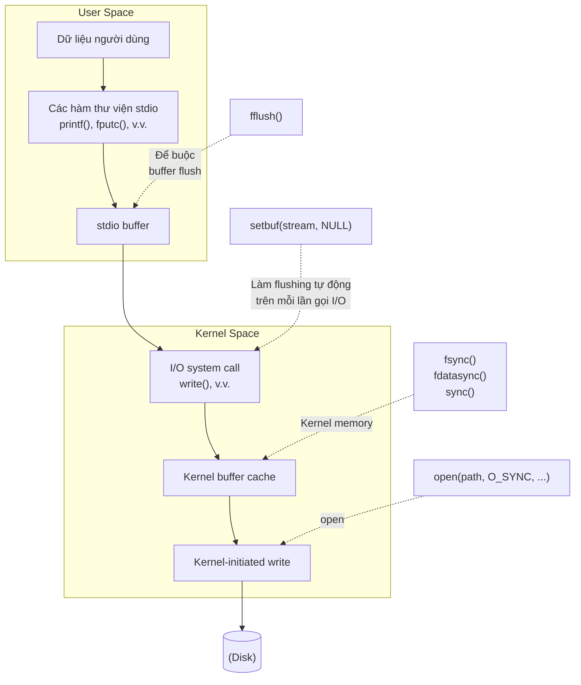

## Chương 13
# <span id="page-0-0"></span>**BUFFERING FILE I/O**

Vì lợi ích về tốc độ và hiệu quả, các I/O system call (tức là kernel) và các hàm I/O của thư viện C chuẩn (tức là các hàm stdio) đều buffer dữ liệu khi thao tác trên các disk file. Trong chương này, chúng ta mô tả cả hai loại buffering và xem xét cách chúng ảnh hưởng đến hiệu suất ứng dụng. Chúng ta cũng xem xét các kỹ thuật khác nhau để tác động và vô hiệu hóa cả hai loại buffering, đồng thời xem xét một kỹ thuật gọi là direct I/O, hữu ích để bypass kernel buffering trong một số trường hợp nhất định.

# **13.1 Kernel Buffering của File I/O: Buffer Cache**

<span id="page-0-1"></span>Khi làm việc với disk file, các system call read() và write() không trực tiếp khởi tạo truy cập disk. Thay vào đó, chúng đơn giản sao chép dữ liệu giữa một buffer trong user space và một buffer trong kernel buffer cache. Ví dụ, lời gọi sau truyền 3 byte dữ liệu từ buffer trong user-space memory đến buffer trong kernel space:

```
write(fd, "abc", 3);
```

Tại thời điểm này, write() trả về. Tại một thời điểm sau đó, kernel ghi (flush) buffer của mình ra disk. (Do đó, chúng ta nói rằng system call không được synchronize với thao tác disk.) Nếu trong thời gian chờ đó, một process khác cố gắng đọc các byte này của file, thì kernel tự động cung cấp dữ liệu từ buffer cache, thay vì từ (nội dung cũ của) file trên disk.

Tương tự, với input, kernel đọc dữ liệu từ disk và lưu vào kernel buffer. Các lời gọi read() lấy dữ liệu từ buffer này cho đến khi nó cạn, lúc đó kernel đọc segment tiếp theo của file vào buffer cache. (Đây là cách giải thích đơn giản hóa; đối với sequential file access, kernel thường thực hiện read-ahead để cố gắng đảm bảo rằng các block tiếp theo của file được đọc vào buffer cache trước khi process đọc cần đến chúng. Chúng ta đề cập thêm về read-ahead trong Mục [13.5](#page-11-0).)

Mục tiêu của thiết kế này là cho phép read() và write() hoạt động nhanh, vì chúng không cần chờ thao tác (chậm) trên disk. Thiết kế này cũng hiệu quả, vì nó giảm số lần truyền dữ liệu với disk mà kernel phải thực hiện.

Linux kernel không áp đặt giới hạn trên cố định cho kích thước của buffer cache. Kernel sẽ cấp phát nhiều buffer cache page tùy theo nhu cầu, chỉ bị giới hạn bởi lượng physical memory có sẵn và nhu cầu về physical memory cho các mục đích khác (ví dụ: lưu giữ các text và data page cần thiết cho các process đang chạy). Nếu memory có sẵn khan hiếm, kernel sẽ flush một số modified buffer cache page ra disk để giải phóng các page đó để tái sử dụng.

> Nói chính xác hơn, từ kernel 2.4 trở đi, Linux không còn duy trì một buffer cache riêng biệt nữa. Thay vào đó, các file I/O buffer được bao gồm trong page cache, cái mà, chẳng hạn, cũng chứa các page từ memory-mapped file. Tuy nhiên, trong thảo luận ở phần chính, chúng ta sử dụng thuật ngữ buffer cache, vì thuật ngữ đó phổ biến trong lịch sử các phiên bản UNIX.

### **Ảnh hưởng của kích thước buffer đến hiệu suất I/O system call**

Kernel thực hiện cùng số lần truy cập disk, bất kể chúng ta thực hiện 1000 lần ghi một byte hay một lần ghi 1000 byte. Tuy nhiên, cách sau thích hơn, vì nó chỉ cần một system call, trong khi cách trước cần 1000 system call. Mặc dù nhanh hơn nhiều so với thao tác disk, các system call vẫn tốn một lượng thời gian đáng kể, vì kernel phải trap lời gọi, kiểm tra tính hợp lệ của đối số system call, và truyền dữ liệu giữa user space và kernel space (tham khảo Mục 3.1 để biết thêm chi tiết).

Tác động của việc thực hiện file I/O bằng các kích thước buffer khác nhau có thể thấy bằng cách chạy chương trình trong Listing 4-1 (trang 71) với các giá trị BUF\_SIZE khác nhau. (Hằng số BUF\_SIZE chỉ định số byte được truyền bởi mỗi lời gọi read() và write().) Bảng 13-1 cho thấy thời gian chương trình này cần để sao chép một file 100 triệu byte trên Linux ext2 file system bằng cách sử dụng các giá trị BUF\_SIZE khác nhau. Lưu ý các điểm sau liên quan đến thông tin trong bảng này:

- Các cột Elapsed và Total CPU time có nghĩa hiển nhiên. Các cột User CPU và System CPU cho thấy sự phân chia của Total CPU time thành, lần lượt, thời gian dành cho việc thực thi code trong user mode và thời gian dành cho việc thực thi kernel code (tức là system call).
- Các bài test trong bảng được thực hiện bằng một vanilla 2.6.30 kernel trên ext2 file system với block size 4096 byte.

Khi chúng ta nói về vanilla kernel, chúng ta có nghĩa là một mainline kernel chưa được patch. Điều này trái ngược với các kernel được cung cấp bởi hầu hết các nhà phân phối, thường bao gồm nhiều patch khác nhau để sửa lỗi hoặc thêm tính năng.

Mỗi hàng cho thấy giá trị trung bình của 20 lần chạy với kích thước buffer đã cho. Trong các bài test này, cũng như trong các bài test khác được trình bày sau trong chương này, file system được unmount và remount giữa mỗi lần thực thi chương trình để đảm bảo rằng buffer cache cho file system trống. Việc tính thời gian được thực hiện bằng lệnh time của shell.

**Bảng 13-1:** Thời gian cần để sao chép file 100 triệu byte

|          | Thời gian (giây) |           |          |            |
|----------|------------------|-----------|----------|------------|
| BUF_SIZE | Elapsed          | Total CPU | User CPU | System CPU |
| 1        | 107.43           | 107.32    | 8.20     | 99.12      |
| 2        | 54.16            | 53.89     | 4.13     | 49.76      |
| 4        | 31.72            | 30.96     | 2.30     | 28.66      |
| 8        | 15.59            | 14.34     | 1.08     | 13.26      |
| 16       | 7.50             | 7.14      | 0.51     | 6.63       |
| 32       | 3.76             | 3.68      | 0.26     | 3.41       |
| 64       | 2.19             | 2.04      | 0.13     | 1.91       |
| 128      | 2.16             | 1.59      | 0.11     | 1.48       |
| 256      | 2.06             | 1.75      | 0.10     | 1.65       |
| 512      | 2.06             | 1.03      | 0.05     | 0.98       |
| 1024     | 2.05             | 0.65      | 0.02     | 0.63       |
| 4096     | 2.05             | 0.38      | 0.01     | 0.38       |
| 16384    | 2.05             | 0.34      | 0.00     | 0.33       |
| 65536    | 2.06             | 0.32      | 0.00     | 0.32       |

Vì tổng lượng dữ liệu được truyền (và do đó số thao tác disk) là như nhau với các kích thước buffer khác nhau, những gì Bảng 13-1 minh họa là overhead của việc thực hiện các lời gọi read() và write(). Với kích thước buffer là 1 byte, 100 triệu lời gọi được thực hiện đến read() và write(). Với kích thước buffer là 4096 byte, số lần gọi mỗi system call giảm xuống khoảng 24.000, và hiệu suất gần tối ưu đạt được. Ngoài điểm này, không có cải thiện hiệu suất đáng kể, vì chi phí thực hiện các system call read() và write() trở nên không đáng kể so với thời gian cần thiết để sao chép dữ liệu giữa user space và kernel space, và để thực hiện disk I/O thực sự.

> Các hàng cuối cùng của Bảng 13-1 cho phép chúng ta ước tính sơ bộ thời gian cần thiết để truyền dữ liệu giữa user space và kernel space, và cho file I/O. Vì số lượng system call trong các trường hợp này tương đối nhỏ, sự đóng góp của chúng vào elapsed time và CPU time là không đáng kể. Do đó, chúng ta có thể nói rằng System CPU time về cơ bản đang đo thời gian để truyền dữ liệu giữa user space và kernel space. Giá trị Elapsed time cho chúng ta ước tính thời gian cần thiết để truyền dữ liệu đến và từ disk. (Như chúng ta sẽ thấy sau đây, đây chủ yếu là thời gian cần cho việc đọc disk.)

Tóm lại, nếu chúng ta đang truyền lượng lớn dữ liệu đến hoặc từ file, thì bằng cách buffer dữ liệu trong các block lớn, và do đó thực hiện ít system call hơn, chúng ta có thể cải thiện đáng kể hiệu suất I/O.

Dữ liệu trong Bảng 13-1 đo lường nhiều yếu tố: thời gian thực hiện các system call read() và write(), thời gian truyền dữ liệu giữa các buffer trong kernel space và user space, và thời gian truyền dữ liệu giữa kernel buffer và disk. Hãy xem xét yếu tố cuối cùng này thêm. Rõ ràng, việc truyền nội dung của input file vào buffer cache là không thể tránh khỏi. Tuy nhiên, chúng ta đã thấy rằng write() trả về ngay lập tức sau khi truyền dữ liệu từ user space đến kernel buffer cache. Vì kích thước RAM trên hệ thống test (4 GB) vượt xa kích thước file được sao chép (100 MB), chúng ta có thể giả định rằng vào thời điểm chương trình hoàn thành, output file thực sự chưa được ghi vào disk. Do đó, như một thí nghiệm bổ sung, chúng ta đã chạy một chương trình chỉ đơn giản ghi dữ liệu tùy ý vào file bằng cách sử dụng các kích thước write() buffer khác nhau. Kết quả được hiển thị trong Bảng 13-2.

Một lần nữa, dữ liệu trong Bảng 13-2 được lấy từ kernel 2.6.30, trên ext2 file system với block size 4096 byte, và mỗi hàng cho thấy giá trị trung bình của 20 lần chạy. Chúng ta không trình bày chương trình test (filebuff/write\_bytes.c), nhưng nó có sẵn trong phân phối source code của cuốn sách này.

**Bảng 13-2:** Thời gian cần để ghi file 100 triệu byte

|          | Thời gian (giây) |           |          |            |
|----------|------------------|-----------|----------|------------|
| BUF_SIZE | Elapsed          | Total CPU | User CPU | System CPU |
| 1        | 72.13            | 72.11     | 5.00     | 67.11      |
| 2        | 36.19            | 36.17     | 2.47     | 33.70      |
| 4        | 20.01            | 19.99     | 1.26     | 18.73      |
| 8        | 9.35             | 9.32      | 0.62     | 8.70       |
| 16       | 4.70             | 4.68      | 0.31     | 4.37       |
| 32       | 2.39             | 2.39      | 0.16     | 2.23       |
| 64       | 1.24             | 1.24      | 0.07     | 1.16       |
| 128      | 0.67             | 0.67      | 0.04     | 0.63       |
| 256      | 0.38             | 0.38      | 0.02     | 0.36       |
| 512      | 0.24             | 0.24      | 0.01     | 0.23       |
| 1024     | 0.17             | 0.17      | 0.01     | 0.16       |
| 4096     | 0.11             | 0.11      | 0.00     | 0.11       |
| 16384    | 0.10             | 0.10      | 0.00     | 0.10       |
| 65536    | 0.09             | 0.09      | 0.00     | 0.09       |

Bảng 13-2 chỉ cho thấy chi phí để thực hiện các system call write() và truyền dữ liệu từ user space đến kernel buffer cache bằng cách sử dụng các kích thước write() buffer khác nhau. Với các kích thước buffer lớn hơn, chúng ta thấy sự khác biệt đáng kể so với dữ liệu trong Bảng 13-1. Ví dụ, với kích thước buffer 65.536 byte, elapsed time trong Bảng 13-1 là 2,06 giây, trong khi trong Bảng 13-2 là 0,09 giây. Đó là vì trong trường hợp sau không có disk I/O thực sự được thực hiện. Nói cách khác, phần lớn thời gian cần thiết cho các trường hợp buffer lớn trong Bảng 13-1 là do việc đọc disk.

Như chúng ta sẽ thấy trong Mục [13.3,](#page-6-0) khi chúng ta buộc các thao tác output block cho đến khi dữ liệu được truyền đến disk, thời gian cho các lời gọi write() tăng đáng kể.

Cuối cùng, đáng lưu ý rằng thông tin trong Bảng 13-2 (và sau đó là [Bảng 13-3](#page-9-0)) chỉ là một dạng benchmark (ngây thơ) cho một file system. Hơn nữa, kết quả có thể cho thấy một số biến động giữa các file system. Các file system có thể được đo bằng nhiều tiêu chí khác, chẳng hạn như hiệu suất dưới tải multiuser nặng, tốc độ tạo và xóa file, thời gian cần để tìm kiếm file trong thư mục lớn, không gian cần thiết để lưu trữ file nhỏ, hoặc duy trì tính toàn vẹn của file trong trường hợp hệ thống bị crash. Khi hiệu suất của I/O hoặc các thao tác file-system khác là quan trọng, không có gì thay thế được benchmark đặc thù cho ứng dụng trên nền tảng mục tiêu.

# **13.2 Buffering trong Thư viện stdio**

Việc buffer dữ liệu thành các block lớn để giảm system call chính xác là những gì các hàm I/O của thư viện C (ví dụ: fprintf(), fscanf(), fgets(), fputs(), fputc(), fgetc()) thực hiện khi thao tác trên disk file. Vì vậy, việc sử dụng thư viện stdio giải phóng chúng ta khỏi nhiệm vụ buffer dữ liệu cho output với write() hay input qua read().

### **Đặt buffering mode của stdio stream**

Hàm setvbuf() kiểm soát dạng buffering được sử dụng bởi thư viện stdio.

```
#include <stdio.h>
int setvbuf(FILE *stream, char *buf, int mode, size_t size);
                                      Returns 0 on success, or nonzero on error
```

Tham số stream xác định file stream mà buffering của nó sẽ được sửa đổi. Sau khi stream đã được mở, lời gọi setvbuf() phải được thực hiện trước khi gọi bất kỳ hàm stdio nào khác trên stream. Lời gọi setvbuf() ảnh hưởng đến hành vi của tất cả các thao tác stdio tiếp theo trên stream được chỉ định.

> Các stream được sử dụng bởi thư viện stdio không nên nhầm lẫn với tiện ích STREAMS của System V. Tiện ích System V STREAMS không được cài đặt trong mainline Linux kernel.

Các tham số buf và size chỉ định buffer được sử dụng cho stream. Các tham số này có thể được chỉ định theo hai cách:

- Nếu buf khác NULL, thì nó trỏ đến một khối memory có kích thước size byte sẽ được dùng làm buffer cho stream. Vì buffer được trỏ đến bởi buf sau đó được thư viện stdio sử dụng, nó nên được cấp phát static hoặc được cấp phát động trên heap (bằng malloc() hoặc tương tự). Không nên cấp phát nó như một biến cục bộ trên stack, vì sẽ xảy ra hỗn loạn khi hàm đó trả về và stack frame của nó bị thu hồi.
- Nếu buf là NULL, thì thư viện stdio tự động cấp phát một buffer để sử dụng với stream (trừ khi chúng ta chọn unbuffered I/O, như mô tả bên dưới). SUSv3 cho phép, nhưng không yêu cầu, một phiên bản cài đặt sử dụng size để xác định kích thước cho buffer này. Trong phiên bản cài đặt của glibc, size bị bỏ qua trong trường hợp này.

Tham số mode chỉ định loại buffering và có một trong các giá trị sau:

**\_IONBF**

Không buffer I/O. Mỗi lời gọi thư viện stdio dẫn đến một system call write() hay read() ngay lập tức. Các tham số buf và size bị bỏ qua, và có thể được chỉ định là NULL và 0, tương ứng. Đây là chế độ mặc định cho stderr, để đảm bảo rằng kết quả đầu ra lỗi xuất hiện ngay lập tức.

**\_IOLBF**

Sử dụng line-buffered I/O. Flag này là mặc định cho stream tham chiếu đến terminal device. Đối với output stream, dữ liệu được buffer cho đến khi ký tự newline được xuất ra (trừ khi buffer đầy trước). Đối với input stream, dữ liệu được đọc từng dòng một.

**\_IOFBF**

Sử dụng fully buffered I/O. Dữ liệu được đọc hoặc ghi (qua các lời gọi read() hay write()) theo đơn vị bằng kích thước của buffer. Chế độ này là mặc định cho stream tham chiếu đến disk file.

Đoạn code sau minh họa cách sử dụng setvbuf():

```
#define BUF_SIZE 1024
static char buf[BUF_SIZE];
if (setvbuf(stdout, buf, _IOFBF, BUF_SIZE) != 0)
 errExit("setvbuf");
```

Lưu ý rằng setvbuf() trả về giá trị khác không (không nhất thiết là –1) khi có lỗi.

Hàm setbuf() được xây dựng trên setvbuf(), và thực hiện nhiệm vụ tương tự.

```
#include <stdio.h>
void setbuf(FILE *stream, char *buf);
```

Ngoài việc không trả về kết quả hàm, lời gọi setbuf(fp, buf) tương đương với:

```
setvbuf(fp, buf, (buf != NULL) ? _IOFBF: _IONBF, BUFSIZ);
```

Tham số buf được chỉ định là NULL để không buffer, hoặc là pointer đến buffer được cấp phát bởi caller có kích thước BUFSIZ byte. (BUFSIZ được định nghĩa trong `<stdio.h>`. Trong phiên bản cài đặt của glibc, hằng số này có giá trị 8192, là giá trị điển hình.)

Hàm setbuffer() tương tự như setbuf(), nhưng cho phép caller chỉ định kích thước của buf.

```
#define _BSD_SOURCE
#include <stdio.h>
void setbuffer(FILE *stream, char *buf, size_t size);
```

Lời gọi setbuffer(fp, buf, size) tương đương với:

```
setvbuf(fp, buf, (buf != NULL) ? _IOFBF : _IONBF, size);
```

Hàm setbuffer() không được quy định trong SUSv3, nhưng có sẵn trên hầu hết các phiên bản UNIX.

### **Flush một stdio buffer**

Bất kể buffering mode hiện tại, bất cứ lúc nào, chúng ta có thể buộc dữ liệu trong stdio output stream được ghi (tức là flush đến kernel buffer qua write()) bằng cách sử dụng library function fflush(). Hàm này flush output buffer cho stream được chỉ định.

```
#include <stdio.h>
int fflush(FILE *stream);
                                               Returns 0 on success, EOF on error
```

Nếu stream là NULL, fflush() flush tất cả các stdio buffer.

Hàm fflush() cũng có thể được áp dụng cho input stream. Điều này khiến bất kỳ buffered input nào bị loại bỏ. (Buffer sẽ được nạp lại khi chương trình tiếp theo cố gắng đọc từ stream.)

Một stdio buffer được tự động flush khi stream tương ứng được đóng.

Trong nhiều phiên bản cài đặt của thư viện C, bao gồm cả glibc, nếu stdin và stdout tham chiếu đến terminal, thì một fflush(stdout) ngầm được thực hiện bất cứ khi nào input được đọc từ stdin. Điều này có tác dụng flush bất kỳ prompt nào được ghi vào stdout không bao gồm ký tự newline kết thúc (ví dụ: printf("Date: ")). Tuy nhiên, hành vi này không được quy định trong SUSv3 hay C99 và không được cài đặt trong tất cả các thư viện C. Các chương trình portable nên sử dụng các lời gọi fflush(stdout) tường minh để đảm bảo rằng các prompt như vậy được hiển thị.

> Chuẩn C99 đặt ra hai yêu cầu nếu một stream được mở cho cả input lẫn output. Thứ nhất, một thao tác output không thể được theo sau trực tiếp bởi một thao tác input mà không có lời gọi fflush() hoặc một trong các hàm định vị file (fseek(), fsetpos() hay rewind()) xen vào. Thứ hai, một thao tác input không thể được theo sau trực tiếp bởi thao tác output mà không có lời gọi xen vào của một trong các hàm định vị file, trừ khi thao tác input gặp end-of-file.

# <span id="page-6-0"></span>**13.3 Kiểm soát Kernel Buffering của File I/O**

<span id="page-6-1"></span>Có thể buộc flush các kernel buffer cho output file. Đôi khi, điều này là cần thiết nếu ứng dụng (ví dụ: một database journaling process) phải đảm bảo rằng output thực sự đã được ghi vào disk (hay ít nhất là vào hardware cache của disk) trước khi tiếp tục.

Trước khi mô tả các system call được sử dụng để kiểm soát kernel buffering, sẽ hữu ích khi xem xét một vài định nghĩa liên quan từ SUSv3.

### **Synchronized I/O data integrity và synchronized I/O file integrity**

SUSv3 định nghĩa thuật ngữ synchronized I/O completion là "một thao tác I/O đã được chuyển thành công [đến disk] hoặc được chẩn đoán là không thành công."

SUSv3 định nghĩa hai loại synchronized I/O completion khác nhau. Sự khác biệt giữa các loại liên quan đến metadata ("dữ liệu về dữ liệu") mô tả file, mà kernel lưu trữ cùng với dữ liệu cho một file. Chúng ta xem xét file metadata chi tiết khi chúng ta xem xét các file i-node trong Mục [14.4,](#page-23-0) nhưng hiện tại, chỉ cần lưu ý rằng file metadata bao gồm thông tin như owner và group của file; file permission; kích thước file; số lượng (hard) link đến file; timestamp chỉ ra thời điểm truy cập file lần cuối, sửa đổi file lần cuối và thay đổi metadata lần cuối; và các file data block pointer.

Loại synchronized I/O completion đầu tiên được SUSv3 định nghĩa là synchronized I/O data integrity completion. Điều này liên quan đến việc đảm bảo rằng một lần cập nhật dữ liệu file truyền đủ thông tin để cho phép việc lấy lại dữ liệu đó sau này tiến hành được.

- Đối với thao tác đọc, điều này có nghĩa là dữ liệu file được yêu cầu đã được truyền (từ disk) đến process. Nếu có bất kỳ thao tác ghi nào đang chờ xử lý ảnh hưởng đến dữ liệu được yêu cầu, những thao tác này được truyền đến disk trước khi thực hiện đọc.
- Đối với thao tác ghi, điều này có nghĩa là dữ liệu được chỉ định trong yêu cầu ghi đã được truyền (đến disk) và tất cả file metadata cần thiết để lấy lại dữ liệu đó cũng đã được truyền. Điểm mấu chốt cần lưu ý ở đây là không phải tất cả các thuộc tính file metadata bị sửa đổi đều cần được truyền để cho phép lấy lại dữ liệu file. Ví dụ về thuộc tính file metadata bị sửa đổi cần được truyền là kích thước file (nếu thao tác ghi mở rộng file). Ngược lại, các file timestamp bị sửa đổi sẽ không cần được truyền đến disk trước khi một lần lấy lại dữ liệu tiếp theo có thể tiến hành.

Loại synchronized I/O completion khác được SUSv3 định nghĩa là synchronized I/O file integrity completion, đây là tập siêu của synchronized I/O data integrity completion. Sự khác biệt với mode hoàn thành I/O này là trong quá trình cập nhật file, tất cả file metadata được cập nhật đều được truyền đến disk, ngay cả khi nó không cần thiết cho thao tác đọc dữ liệu file tiếp theo.

### **Các system call để kiểm soát kernel buffering của file I/O**

System call fsync() khiến dữ liệu được buffer và tất cả metadata liên quan đến open file descriptor fd được flush đến disk. Việc gọi fsync() buộc file đạt trạng thái synchronized I/O file integrity completion.

```
#include <unistd.h>
int fsync(int fd);
                                              Returns 0 on success, or –1 on error
```

Một lời gọi fsync() chỉ trả về sau khi quá trình truyền đến disk device (hay ít nhất là bộ nhớ cache của nó) đã hoàn thành.

System call fdatasync() hoạt động tương tự như fsync(), nhưng chỉ buộc file đạt trạng thái synchronized I/O data integrity completion.

```
#include <unistd.h>
int fdatasync(int fd);
                                             Returns 0 on success, or –1 on error
```

Việc sử dụng fdatasync() có khả năng giảm số thao tác disk từ hai cần thiết bởi fsync() xuống còn một. Ví dụ, nếu dữ liệu file đã thay đổi, nhưng kích thước file chưa thay đổi, thì việc gọi fdatasync() chỉ buộc dữ liệu được cập nhật. (Chúng ta đã lưu ý ở trên rằng các thay đổi đối với các thuộc tính file metadata như timestamp sửa đổi lần cuối không cần được truyền để hoàn thành synchronized I/O data.) Ngược lại, gọi fsync() cũng sẽ buộc metadata được truyền đến disk.

Việc giảm số thao tác disk I/O theo cách này hữu ích cho một số ứng dụng trong đó hiệu suất là quan trọng và việc duy trì chính xác một số metadata nhất định (như timestamp) là không cần thiết. Điều này có thể tạo ra sự khác biệt hiệu suất đáng kể cho các ứng dụng đang thực hiện nhiều lần cập nhật file: vì dữ liệu file và metadata thường nằm ở các phần khác nhau của disk, việc cập nhật cả hai sẽ yêu cầu các thao tác seek lặp đi lặp lại tiến và lùi trên disk.

Trong Linux 2.2 và trước đó, fdatasync() được cài đặt như một lời gọi đến fsync(), và do đó không có lợi ích hiệu suất nào.

> Bắt đầu với kernel 2.6.17, Linux cung cấp system call phi chuẩn sync\_file\_range(), cho phép kiểm soát chính xác hơn fdatasync() khi flush dữ liệu file. Caller có thể chỉ định vùng file cần flush và chỉ định các flag kiểm soát liệu system call có block trên các lần ghi disk hay không. Xem trang manual sync\_file\_range(2) để biết thêm chi tiết.

System call sync() khiến tất cả kernel buffer chứa thông tin file được cập nhật (tức là data block, pointer block, metadata, v.v.) được flush ra disk.

```
#include <unistd.h>
void sync(void);
```

Trong phiên bản cài đặt Linux, sync() chỉ trả về sau khi tất cả dữ liệu đã được truyền đến disk device (hay ít nhất là bộ nhớ cache của nó). Tuy nhiên, SUSv3 cho phép một phiên bản cài đặt của sync() đơn giản là lên lịch I/O transfer và trả về trước khi nó hoàn thành.

> Một kernel thread chạy thường xuyên đảm bảo rằng các modified kernel buffer được flush ra disk nếu chúng không được đồng bộ tường minh trong vòng 30 giây. Điều này được thực hiện để đảm bảo rằng các buffer không ở trạng thái unsynchronized với disk file tương ứng (và do đó dễ bị mất trong trường hợp hệ thống crash) trong thời gian dài. Trong Linux 2.6, nhiệm vụ này được thực hiện bởi pdflush kernel thread. (Trong Linux 2.4, nó được thực hiện bởi kupdated kernel thread.)

> File /proc/sys/vm/dirty\_expire\_centisecs chỉ định tuổi (tính bằng phần trăm giây) mà một dirty buffer phải đạt đến trước khi nó được flush bởi pdflush. Các file bổ sung trong cùng thư mục kiểm soát các khía cạnh khác của hoạt động của pdflush.

### **Làm cho tất cả các lần ghi synchronous: O\_SYNC**

Việc chỉ định flag O\_SYNC khi gọi open() làm cho tất cả các output tiếp theo synchronous:

```
fd = open(pathname, O_WRONLY | O_SYNC);
```

Sau lời gọi open() này, mỗi write() vào file tự động flush dữ liệu file và metadata ra disk (tức là các lần ghi được thực hiện theo synchronized I/O file integrity completion).

> Các hệ thống BSD cũ hơn dùng flag O\_FSYNC để cung cấp chức năng O\_SYNC. Trong glibc, O\_FSYNC được định nghĩa là synonym của O\_SYNC.

### **Ảnh hưởng đến hiệu suất của O\_SYNC**

Việc sử dụng flag O\_SYNC (hoặc thường xuyên gọi fsync(), fdatasync() hay sync()) có thể ảnh hưởng mạnh đến hiệu suất. [Bảng 13-3](#page-9-0) cho thấy thời gian cần thiết để ghi 1 triệu byte vào file mới được tạo (trên ext2 file system) với nhiều kích thước buffer khác nhau có và không có O\_SYNC. Kết quả được thu thập (sử dụng chương trình filebuff/write\_bytes.c được cung cấp trong phân phối source code của cuốn sách này) bằng cách sử dụng vanilla 2.6.30 kernel và ext2 file system với block size 4096 byte. Mỗi hàng cho thấy giá trị trung bình của 20 lần chạy với kích thước buffer đã cho.

Như có thể thấy từ bảng, O\_SYNC tăng elapsed time lên rất nhiều — trong trường hợp buffer 1 byte, tăng hơn 1000 lần. Lưu ý cũng sự khác biệt lớn giữa elapsed time và CPU time cho các lần ghi có O\_SYNC. Đây là hệ quả của việc chương trình bị block trong khi mỗi buffer thực sự được truyền đến disk.

Kết quả trong [Bảng 13-3](#page-9-0) bỏ qua một yếu tố bổ sung ảnh hưởng đến hiệu suất khi sử dụng O\_SYNC. Các ổ đĩa hiện đại có bộ nhớ cache nội bộ lớn, và theo mặc định, O\_SYNC chỉ khiến dữ liệu được truyền đến cache. Nếu chúng ta vô hiệu hóa caching trên ổ đĩa (bằng lệnh hdparm –W0), thì ảnh hưởng đến hiệu suất của O\_SYNC sẽ còn cực đoan hơn. Trong trường hợp 1 byte, elapsed time tăng từ 1030 giây lên khoảng 16.000 giây. Trong trường hợp 4096 byte, elapsed time tăng từ 0,34 giây lên 4 giây.

Tóm lại, nếu chúng ta cần buộc flush kernel buffer, chúng ta nên xem xét liệu có thể thiết kế ứng dụng để sử dụng kích thước write() buffer lớn hoặc sử dụng các lời gọi đến fsync() hay fdatasync() một cách có chọn lọc theo thời gian, thay vì sử dụng flag O\_SYNC khi mở file.

|          |                |           | Thời gian cần thiết (giây) |             |
|----------|----------------|-----------|---------------------------|-------------|
| BUF_SIZE | Không O\_SYNC  |           |                           | Có O\_SYNC  |
|          | Elapsed        | Total CPU | Elapsed                   | Total CPU   |
| 1        | 0.73           | 0.73      | 1030                      | 98.8        |
| 16       | 0.05           | 0.05      | 65.0                      | 0.40        |
| 256      | 0.02           | 0.02      | 4.07                      | 0.03        |
| 4096     | 0.01           | 0.01      | 0.34                      | 0.03        |

<span id="page-9-0"></span>**Bảng 13-3:** Ảnh hưởng của flag O\_SYNC đến tốc độ ghi 1 triệu byte

### **Các flag O\_DSYNC và O\_RSYNC**

SUSv3 quy định thêm hai open file status flag liên quan đến synchronized I/O: O\_DSYNC và O\_RSYNC.

Flag O\_DSYNC khiến các lần ghi được thực hiện theo yêu cầu của synchronized I/O data integrity completion (như fdatasync()). Điều này trái ngược với O\_SYNC, khiến các lần ghi được thực hiện theo yêu cầu của synchronized I/O file integrity completion (như fsync()).

Flag O\_RSYNC được chỉ định kết hợp với O\_SYNC hay O\_DSYNC, và mở rộng hành vi ghi của các flag này cho các thao tác đọc. Việc chỉ định cả O\_RSYNC lẫn O\_DSYNC khi mở file có nghĩa là tất cả các lần đọc tiếp theo đều được hoàn thành theo yêu cầu của synchronized I/O data integrity (tức là trước khi thực hiện đọc, tất cả các lần ghi file đang chờ xử lý đều được hoàn thành như thể được thực hiện với O\_DSYNC). Việc chỉ định cả O\_RSYNC lẫn O\_SYNC khi mở file có nghĩa là tất cả các lần đọc tiếp theo đều được hoàn thành theo yêu cầu của synchronized I/O file integrity (tức là trước khi thực hiện đọc, tất cả các lần ghi file đang chờ xử lý đều được hoàn thành như thể được thực hiện với O\_SYNC).

Trước kernel 2.6.33, các flag O\_DSYNC và O\_RSYNC không được cài đặt trên Linux, và các header của glibc đã định nghĩa các hằng số này giống như O\_SYNC. (Điều này thực ra không đúng trong trường hợp O\_RSYNC, vì O\_SYNC không cung cấp bất kỳ chức năng nào cho các thao tác đọc.)

Bắt đầu từ kernel 2.6.33, Linux cài đặt O\_DSYNC, và việc cài đặt O\_RSYNC có thể được thêm vào trong một bản phát hành kernel trong tương lai.

> Trước kernel 2.6.33, Linux không cài đặt đầy đủ ngữ nghĩa O\_SYNC. Thay vào đó, O\_SYNC được cài đặt như O\_DSYNC. Để duy trì hành vi nhất quán cho các ứng dụng được xây dựng cho các kernel cũ hơn, các ứng dụng được liên kết với các phiên bản cũ hơn của thư viện GNU C tiếp tục cung cấp ngữ nghĩa O\_DSYNC cho O\_SYNC, ngay cả trên Linux 2.6.33 và mới hơn.

# **13.4 Tóm tắt về I/O Buffering**

Hình 13-1 cung cấp tổng quan về buffering được sử dụng (cho output file) bởi thư viện stdio và kernel, cùng với các cơ chế để kiểm soát từng loại buffering. Di chuyển xuống dưới qua phần giữa của sơ đồ này, chúng ta thấy việc truyền dữ liệu người dùng bởi các hàm thư viện stdio đến stdio buffer, được duy trì trong user memory space. Khi buffer này được lấp đầy, thư viện stdio gọi system call write(), truyền dữ liệu vào kernel buffer cache (được duy trì trong kernel memory). Cuối cùng, kernel khởi tạo một thao tác disk để truyền dữ liệu đến disk.

Phía trái của Hình 13-1 cho thấy các lời gọi có thể được sử dụng bất cứ lúc nào để tường minh buộc flush một trong hai buffer. Phía phải cho thấy các lời gọi có thể được sử dụng để làm cho việc flush tự động, bằng cách vô hiệu hóa buffering trong thư viện stdio hoặc bằng cách làm cho các file output system call synchronous, để mỗi write() được flush ngay lập tức đến disk.



**Hình 13-1:** Tóm tắt I/O buffering

# <span id="page-11-0"></span>**13.5 Thông báo cho Kernel về các I/O Pattern**

System call *posix\_fadvise()* cho phép process thông báo cho kernel về pattern truy cập file data có khả năng xảy ra của mình.

```
#define _XOPEN_SOURCE 600
#include <fcntl.h>
int posix_fadvise(int fd, off_t offset, off_t len, int advice);
```

Kernel có thể (nhưng không bắt buộc) sử dụng thông tin được cung cấp bởi *posix\_fadvise()* để tối ưu hóa việc sử dụng buffer cache, từ đó cải thiện hiệu suất I/O cho process và cho toàn hệ thống. Việc gọi *posix\_fadvise()* không có tác dụng nào đến ngữ nghĩa của chương trình.

Tham số *fd* là file descriptor xác định file mà chúng ta muốn thông báo cho kernel về các access pattern của nó. Các tham số *offset* và *len* xác định vùng của file mà lời khuyên đang được đưa ra: *offset* chỉ định offset bắt đầu của vùng, và *len* chỉ định kích thước của vùng tính bằng byte. Giá trị *len* bằng 0 có nghĩa là tất cả các byte từ offset đến cuối file. (Trong các kernel trước 2.6.6, len bằng 0 được diễn giải nghĩa đen là không byte.)

Tham số advice chỉ định pattern truy cập dự kiến của process cho file. Nó được chỉ định là một trong các giá trị sau:

#### POSIX\_FADV\_NORMAL

Process không có lời khuyên đặc biệt nào về access pattern. Đây là hành vi mặc định nếu không có lời khuyên nào được đưa ra cho file. Trên Linux, thao tác này đặt cửa sổ read-ahead của file về kích thước mặc định (128 kB).

#### POSIX\_FADV\_SEQUENTIAL

Process dự kiến đọc dữ liệu tuần tự từ offset thấp hơn đến offset cao hơn. Trên Linux, thao tác này đặt cửa sổ read-ahead của file gấp đôi kích thước mặc định.

#### POSIX\_FADV\_RANDOM

Process dự kiến truy cập dữ liệu theo thứ tự ngẫu nhiên. Trên Linux, tùy chọn này vô hiệu hóa file read-ahead.

#### POSIX\_FADV\_WILLNEED

Process dự kiến truy cập vùng file được chỉ định trong tương lai gần. Kernel thực hiện read-ahead để populate buffer cache với dữ liệu file trong phạm vi được chỉ định bởi offset và len. Các lời gọi read() tiếp theo trên file sẽ không block trên disk I/O; thay vào đó, chúng chỉ đơn giản lấy dữ liệu từ buffer cache. Kernel không đưa ra đảm bảo nào về thời gian dữ liệu được lấy từ file sẽ còn ở lại trong buffer cache. Nếu các process khác hoặc các hoạt động kernel đặt yêu cầu đủ mạnh lên memory, thì các page cuối cùng sẽ được tái sử dụng. Nói cách khác, nếu memory pressure cao, thì chúng ta nên đảm bảo rằng thời gian trôi qua giữa lời gọi posix\_fadvise() và lời gọi read() tiếp theo là ngắn. (System call readahead() dành riêng cho Linux cung cấp chức năng tương đương với thao tác POSIX\_FADV\_WILLNEED.)

#### POSIX\_FADV\_DONTNEED

Process dự kiến không truy cập vùng file được chỉ định trong tương lai gần. Điều này thông báo cho kernel rằng nó có thể giải phóng các cache page tương ứng (nếu có). Trên Linux, thao tác này được thực hiện theo hai bước. Đầu tiên, nếu thiết bị bên dưới hiện không bị tắc nghẽn bởi một loạt các thao tác ghi đang được xếp hàng đợi, kernel sẽ flush bất kỳ modified page nào trong vùng được chỉ định. Thứ hai, kernel cố gắng giải phóng bất kỳ cache page nào cho vùng đó. Đối với các modified page trong vùng, bước thứ hai này sẽ chỉ thành công nếu các page đã được ghi vào thiết bị bên dưới trong bước đầu tiên — tức là nếu write queue của thiết bị không bị tắc nghẽn. Vì tắc nghẽn trên thiết bị không thể được kiểm soát bởi ứng dụng, một cách thay thế để đảm bảo rằng các cache page có thể được giải phóng là thực hiện thao tác POSIX\_FADV\_DONTNEED trước một lời gọi sync() hoặc fdatasync() chỉ định fd.

#### POSIX\_FADV\_NOREUSE

Process dự kiến truy cập dữ liệu trong vùng file được chỉ định một lần, và sau đó không tái sử dụng nó. Gợi ý này cho kernel biết rằng nó có thể giải phóng các page sau khi chúng đã được truy cập một lần. Trên Linux, thao tác này hiện tại không có hiệu lực.

<span id="page-13-0"></span>Đặc tả posix\_fadvise() là mới trong SUSv3, và không phải tất cả các phiên bản UNIX đều hỗ trợ interface này. Linux cung cấp posix\_fadvise() từ kernel 2.6.

# **13.6 Bypass Buffer Cache: Direct I/O**

Bắt đầu với kernel 2.4, Linux cho phép ứng dụng bypass buffer cache khi thực hiện disk I/O, từ đó truyền dữ liệu trực tiếp từ user space đến file hoặc disk device. Điều này đôi khi được gọi là direct I/O hoặc raw I/O.

> Các chi tiết được mô tả ở đây là Linux-specific và không được chuẩn hóa bởi SUSv3. Tuy nhiên, hầu hết các phiên bản UNIX đều cung cấp một số dạng direct I/O access đến device và file.

Direct I/O đôi khi bị hiểu nhầm là phương tiện để đạt được hiệu suất I/O nhanh. Tuy nhiên, đối với hầu hết các ứng dụng, việc sử dụng direct I/O có thể làm giảm đáng kể hiệu suất. Điều này là vì kernel áp dụng nhiều tối ưu hóa để cải thiện hiệu suất I/O được thực hiện qua buffer cache, bao gồm thực hiện sequential read-ahead, thực hiện I/O theo cluster của disk block và cho phép các process truy cập cùng file chia sẻ buffer trong cache. Tất cả các tối ưu hóa này đều bị mất khi chúng ta sử dụng direct I/O. Direct I/O chỉ dành cho các ứng dụng có yêu cầu I/O đặc biệt. Ví dụ, các database system thực hiện caching và tối ưu hóa I/O riêng của chúng không cần kernel tốn CPU time và memory để thực hiện các nhiệm vụ tương tự.

Chúng ta có thể thực hiện direct I/O trên một file riêng lẻ hoặc trên một block device (ví dụ: ổ đĩa). Để làm điều này, chúng ta chỉ định flag O\_DIRECT khi mở file hoặc device bằng open().

Flag O\_DIRECT có hiệu lực từ kernel 2.4.10. Không phải tất cả Linux file system và phiên bản kernel đều hỗ trợ việc sử dụng flag này. Hầu hết native file system hỗ trợ O\_DIRECT, nhưng nhiều non-UNIX file system (ví dụ: VFAT) thì không. Có thể cần thiết phải test file system liên quan (nếu file system không hỗ trợ O\_DIRECT, thì open() thất bại với lỗi EINVAL) hoặc đọc kernel source code để kiểm tra hỗ trợ này.

> Nếu một file được mở với O\_DIRECT bởi một process, và được mở bình thường (tức là sử dụng buffer cache) bởi process khác, thì không có sự nhất quán giữa nội dung của buffer cache và dữ liệu được đọc hoặc ghi qua direct I/O. Nên tránh những kịch bản như vậy.

> Trang manual raw(8) mô tả một kỹ thuật cũ hơn (hiện đã deprecated) để có được raw access đến một disk device.

### **Hạn chế về alignment cho direct I/O**

Vì direct I/O (trên cả disk device lẫn file) liên quan đến việc truy cập trực tiếp đến disk, chúng ta phải tuân thủ một số hạn chế khi thực hiện I/O:

- Data buffer được truyền phải được align trên một memory boundary là bội số của block size.
- File hoặc device offset mà việc truyền dữ liệu bắt đầu phải là bội số của block size.
- Độ dài của dữ liệu cần truyền phải là bội số của block size.

Việc không tuân thủ bất kỳ hạn chế nào trong số này dẫn đến lỗi EINVAL. Trong danh sách trên, block size có nghĩa là physical block size của device (thường là 512 byte).

> Khi thực hiện direct I/O, Linux 2.4 bị hạn chế hơn Linux 2.6: alignment, length và offset phải là bội số của logical block size của file system bên dưới. (Các logical block size điển hình của file system là 1024, 2048 hoặc 4096 byte.)

### **Chương trình ví dụ**

Listing 13-1 cung cấp một ví dụ đơn giản về việc sử dụng O\_DIRECT khi mở file để đọc. Chương trình này nhận tối đa bốn đối số command-line chỉ định, theo thứ tự, file cần đọc, số byte cần đọc từ file, offset mà chương trình nên seek đến trước khi đọc từ file, và alignment của data buffer được truyền cho read(). Hai đối số cuối là tùy chọn, và mặc định là offset 0 và 4096 byte, tương ứng. Đây là một số ví dụ về những gì chúng ta thấy khi chạy chương trình này:

```
$ ./direct_read /test/x 512    Đọc 512 byte tại offset 0
Read 512 bytes                 Thành công
$ ./direct_read /test/x 256
ERROR [EINVAL Invalid argument] read  Length không phải bội số của 512
$ ./direct_read /test/x 512 1
ERROR [EINVAL Invalid argument] read  Offset không phải bội số của 512
$ ./direct_read /test/x 4096 8192 512
Read 4096 bytes                Thành công
$ ./direct_read /test/x 4096 512 256
ERROR [EINVAL Invalid argument] read  Alignment không phải bội số của 512
```

Chương trình trong Listing 13-1 sử dụng hàm memalign() để cấp phát một khối memory được align trên bội số của đối số đầu tiên của nó. Chúng ta mô tả memalign() trong Mục 7.1.4.

**Listing 13-1:** Sử dụng O\_DIRECT để bypass buffer cache

```
–––––––––––––––––––––––––––––––––––––––––––––––––––– filebuff/direct_read.c
#define _GNU_SOURCE /* Obtain O_DIRECT definition from <fcntl.h> */
#include <fcntl.h>
#include <malloc.h>
#include "tlpi_hdr.h"
int
main(int argc, char *argv[])
{
 int fd;
 ssize_t numRead;
 size_t length, alignment;
 off_t offset;
 void *buf;
 if (argc < 3 || strcmp(argv[1], "--help") == 0)
 usageErr("%s file length [offset [alignment]]\n", argv[0]);
 length = getLong(argv[2], GN_ANY_BASE, "length");
 offset = (argc > 3) ? getLong(argv[3], GN_ANY_BASE, "offset") : 0;
 alignment = (argc > 4) ? getLong(argv[4], GN_ANY_BASE, "alignment") : 4096;
 fd = open(argv[1], O_RDONLY | O_DIRECT);
 if (fd == -1)
 errExit("open");
 /* memalign() allocates a block of memory aligned on an address that
 is a multiple of its first argument. The following expression
 ensures that 'buf' is aligned on a non-power-of-two multiple of
 'alignment'. We do this to ensure that if, for example, we ask
 for a 256-byte aligned buffer, then we don't accidentally get
 a buffer that is also aligned on a 512-byte boundary.
 The '(char *)' cast is needed to allow pointer arithmetic (which
 is not possible on the 'void *' returned by memalign()). */
 buf = (char *) memalign(alignment * 2, length + alignment) + alignment;
 if (buf == NULL)
 errExit("memalign");
 if (lseek(fd, offset, SEEK_SET) == -1)
 errExit("lseek");
 numRead = read(fd, buf, length);
 if (numRead == -1)
 errExit("read");
 printf("Read %ld bytes\n", (long) numRead);
 exit(EXIT_SUCCESS);
}
–––––––––––––––––––––––––––––––––––––––––––––––––––– filebuff/direct_read.c
```

# **13.7 Kết hợp Library Function và System Call cho File I/O**

Có thể kết hợp việc sử dụng system call và các hàm thư viện C chuẩn để thực hiện I/O trên cùng một file. Các hàm fileno() và fdopen() hỗ trợ chúng ta với nhiệm vụ này.

```
#include <stdio.h>
int fileno(FILE *stream);
                                Returns file descriptor on success, or –1 on error
FILE *fdopen(int fd, const char *mode);
                           Returns (new) file pointer on success, or NULL on error
```

Cho một stream, fileno() trả về file descriptor tương ứng (tức là file descriptor mà thư viện stdio đã mở cho stream này). File descriptor này sau đó có thể được sử dụng theo cách thông thường với các I/O system call như read(), write(), dup() và fcntl().

Hàm fdopen() là ngược lại của fileno(). Cho một file descriptor, nó tạo ra một stream tương ứng sử dụng descriptor này cho I/O của mình. Tham số mode giống như của fopen(); ví dụ: r để đọc, w để ghi, hoặc a để append. Nếu tham số này không nhất quán với access mode của file descriptor fd, thì fdopen() thất bại.

Hàm fdopen() đặc biệt hữu ích cho các descriptor tham chiếu đến các file khác ngoài regular file. Như chúng ta sẽ thấy trong các chương sau, các system call để tạo socket và pipe luôn trả về file descriptor. Để sử dụng thư viện stdio với các loại file này, chúng ta phải dùng fdopen() để tạo một file stream tương ứng.

Khi sử dụng các hàm thư viện stdio kết hợp với I/O system call để thực hiện I/O trên disk file, chúng ta phải lưu ý đến các vấn đề buffering. Các I/O system call truyền dữ liệu trực tiếp đến kernel buffer cache, trong khi thư viện stdio chờ cho đến khi stdio buffer trong user space đầy trước khi gọi write() để truyền buffer đó đến kernel buffer cache. Hãy xem xét đoạn code sau được dùng để ghi ra standard output:

```
printf("To man the world is twofold, ");
write(STDOUT_FILENO, "in accordance with his twofold attitude.\n", 41);
```

Trong trường hợp thông thường, kết quả đầu ra của printf() thường xuất hiện sau kết quả đầu ra của write(), do đó đoạn code này tạo ra kết quả đầu ra sau:

```
in accordance with his twofold attitude.
To man the world is twofold,
```

Khi xen lẫn các I/O system call và hàm stdio, việc sử dụng có chọn lọc fflush() có thể cần thiết để tránh vấn đề này. Chúng ta cũng có thể sử dụng setvbuf() hay setbuf() để vô hiệu hóa buffering, nhưng làm như vậy có thể ảnh hưởng đến hiệu suất I/O của ứng dụng, vì mỗi thao tác output sau đó sẽ dẫn đến việc thực thi một system call write().

> SUSv3 quy định khá chi tiết các yêu cầu để ứng dụng có thể kết hợp việc sử dụng I/O system call và hàm stdio. Xem phần có tiêu đề Interaction of File Descriptors and Standard I/O Streams trong chương General Information của tập System Interfaces (XSH) để biết chi tiết.

# **13.8 Tóm tắt**

Việc buffer dữ liệu input và output được thực hiện bởi kernel, và cũng bởi thư viện stdio. Trong một số trường hợp, chúng ta có thể muốn ngăn chặn buffering, nhưng chúng ta cần nhận thức được tác động của điều này đến hiệu suất ứng dụng. Nhiều system call và library function có thể được sử dụng để kiểm soát kernel và stdio buffering, và để thực hiện flush buffer một lần.

Một process có thể sử dụng posix\_fadvise() để thông báo cho kernel về pattern truy cập dữ liệu có khả năng xảy ra từ một file được chỉ định. Kernel có thể sử dụng thông tin này để tối ưu hóa việc sử dụng buffer cache, từ đó cải thiện hiệu suất I/O.

Flag O\_DIRECT dành riêng cho Linux cho phép các ứng dụng chuyên biệt bypass buffer cache.

Các hàm fileno() và fdopen() hỗ trợ chúng ta với nhiệm vụ kết hợp system call và hàm thư viện C chuẩn để thực hiện I/O trên cùng một file. Cho một stream, fileno() trả về file descriptor tương ứng; fdopen() thực hiện thao tác ngược lại, tạo một stream mới sử dụng một open file descriptor được chỉ định.

### **Tài liệu tham khảo thêm**

[Bach, 1986] mô tả cài đặt và ưu điểm của buffer cache trên System V. [Goodheart & Cox, 1994] và [Vahalia, 1996] cũng mô tả cơ sở lý luận và cài đặt của System V buffer cache. Thông tin liên quan thêm dành riêng cho Linux có thể tìm thấy trong [Bovet & Cesati, 2005] và [Love, 2010].

# **13.9 Bài tập**

- **13-1.** Sử dụng lệnh time tích hợp của shell, thử tính thời gian hoạt động của chương trình trong Listing 4-1 (copy.c) trên hệ thống của bạn.
  - a) Thử nghiệm với các kích thước file và buffer khác nhau. Bạn có thể đặt kích thước buffer bằng tùy chọn –DBUF\_SIZE=nbytes khi biên dịch chương trình.
  - b) Sửa đổi system call open() để bao gồm flag O\_SYNC. Điều này tạo ra sự khác biệt bao nhiêu về tốc độ với các kích thước buffer khác nhau?
  - c) Hãy thực hiện các bài test timing này trên nhiều file system (ví dụ: ext3, XFS, Btrfs và JFS). Kết quả có tương tự nhau không? Xu hướng có giống nhau khi đi từ kích thước buffer nhỏ đến lớn không?
- **13-2.** Tính thời gian hoạt động của chương trình filebuff/write\_bytes.c (được cung cấp trong phân phối source code của cuốn sách này) với các kích thước buffer và file system khác nhau.
- **13-3.** Hiệu ứng của các câu lệnh sau là gì?

```
fflush(fp);
fsync(fileno(fp));
```

**13-4.** Giải thích tại sao kết quả đầu ra của đoạn code sau khác nhau tùy thuộc vào việc standard output được chuyển hướng đến terminal hay đến disk file.

```
printf("If I had more time, \n");
write(STDOUT_FILENO, "I would have written you a shorter letter.\n", 43);
```

**13-5.** Lệnh tail [ –n num ] file in num dòng cuối cùng (mặc định là mười dòng) của file được đặt tên. Hãy cài đặt lệnh này bằng các I/O system call (lseek(), read(), write(), v.v.). Hãy lưu ý đến các vấn đề buffering được mô tả trong chương này để làm cho cài đặt hiệu quả.
