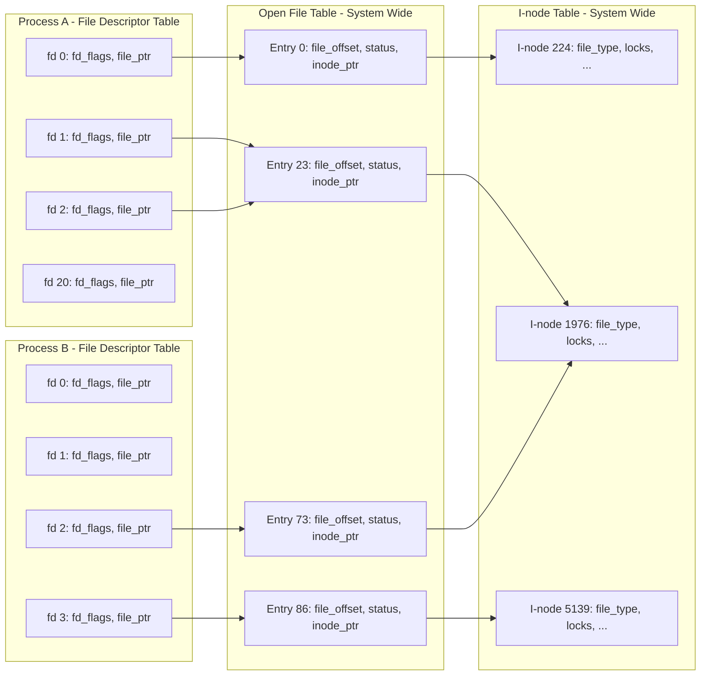

## Chương 5
# <span id="page-68-0"></span>**FILE I/O: CHI TIẾT NÂNG CAO**

Trong chương này, chúng ta tiếp tục cuộc thảo luận về file I/O mà đã bắt đầu trong chương trước.

Tiếp tục thảo luận về system call `open()`, chúng ta giải thích khái niệm atomicity—ý tưởng rằng các hành động được thực hiện bởi một system call được thực thi như một bước duy nhất không thể bị gián đoạn. Đây là yêu cầu cần thiết cho hoạt động chính xác của nhiều system call.

Chúng ta giới thiệu một system call khác liên quan đến file, `fcntl()` đa mục đích, và chỉ ra một trong những cách sử dụng của nó: lấy và thiết lập các cờ trạng thái file mở.

Tiếp theo, chúng ta xem xét các cấu trúc dữ liệu kernel được sử dụng để biểu diễn file descriptor và file mở. Hiểu rõ mối quan hệ giữa các cấu trúc này sẽ làm sáng tỏ một số điểm tinh tế của file I/O được thảo luận trong các chương sau. Dựa trên mô hình này, chúng ta sau đó giải thích cách trùng lặp file descriptor.

Sau đó, chúng ta xem xét một số system call cung cấp chức năng đọc và ghi mở rộng. Những system call này cho phép chúng ta thực hiện I/O tại một vị trí cụ thể trong file mà không thay đổi file offset, và chuyển dữ liệu đến và từ nhiều buffer trong một chương trình.

Chúng ta sơ lược giới thiệu khái niệm nonblocking I/O, và mô tả một số tiện ích mở rộng để hỗ trợ I/O trên file rất lớn.

Vì các file tạm thời được sử dụng bởi nhiều chương trình hệ thống, chúng ta cũng sẽ xem xét một số hàm thư viện cho phép chúng ta tạo và sử dụng các file tạm thời với tên duy nhất được tạo ngẫu nhiên.

## <span id="page-69-2"></span>**5.1 Atomicity và Race Conditions**

<span id="page-69-0"></span>Atomicity là một khái niệm mà chúng ta sẽ gặp lặp đi lặp lại khi thảo luận về hoạt động của system call. Tất cả các system call đều được thực thi một cách atomic. Theo nghĩa này, kernel đảm bảo rằng tất cả các bước trong một system call được hoàn thành như một hoạt động duy nhất, mà không bị gián đoạn bởi một process hoặc thread khác.

Atomicity là cần thiết để hoàn thành thành công một số hoạt động. Đặc biệt, nó cho phép chúng ta tránh được race condition (đôi khi được gọi là race hazard). Race condition là một tình huống mà kết quả được tạo ra bởi hai process (hoặc thread) hoạt động trên các tài nguyên được chia sẻ phụ thuộc theo cách bất ngờ vào thứ tự tương đối mà các process có được quyền truy cập CPU(s).

Trong vài trang tiếp theo, chúng ta xem xét hai tình huống liên quan đến file I/O nơi xảy ra race condition, và chỉ ra cách các điều kiện này được loại bỏ thông qua việc sử dụng các cờ `open()` đảm bảo atomicity của các hoạt động file liên quan.

Chúng ta sẽ quay lại chủ đề race condition khi mô tả `sigsuspend()` trong Section 22.9 và `fork()` trong Section 24.4.

## **Tạo file độc quyền**

Trong Section [4.3.1,](#page-53-0) chúng ta lưu ý rằng chỉ định `O_EXCL` kết hợp với `O_CREAT` khiến `open()` trả về lỗi nếu file đã tồn tại. Điều này cung cấp một cách để một process đảm bảo rằng nó là người tạo file. Việc kiểm tra sự tồn tại trước đó của file và tạo file được thực hiện một cách atomic. Để xem tại sao điều này lại quan trọng, hãy xem xét mã được hiển thị trong [Listing 5-1](#page-69-1), mà chúng ta có thể sử dụng trong trường hợp không có cờ `O_EXCL`. (Trong mã này, chúng ta hiển thị ID process được trả về bởi system call `getpid()`, điều này cho phép chúng ta phân biệt đầu ra của hai lần chạy khác nhau của chương trình này.)

<span id="page-69-1"></span>**Listing 5-1:** Mã không chính xác để mở file độc quyền

```
–––––––––––––––––––––––––––––––––––––––––––– from fileio/bad_exclusive_open.c
fd = open(argv[1], O_WRONLY); /* Open 1: check if file exists */
 if (fd != -1) { /* Open succeeded */
 printf("[PID %ld] File \"%s\" already exists\n",
 (long) getpid(), argv[1]);
 close(fd);
 } else {
 if (errno != ENOENT) { /* Failed for unexpected reason */
 errExit("open");
 } else {
 /* WINDOW FOR FAILURE */
 fd = open(argv[1], O_WRONLY | O_CREAT, S_IRUSR | S_IWUSR);
 if (fd == -1)
 errExit("open");
 printf("[PID %ld] Created file \"%s\" exclusively\n",
 (long) getpid(), argv[1]); /* MAY NOT BE TRUE! */
 }
 }
–––––––––––––––––––––––––––––––––––––––––––– from fileio/bad_exclusive_open.c
```

Ngoài việc sử dụng dài dòng hai lần gọi `open()`, mã trong [Listing 5-1](#page-69-1) cũng chứa một lỗi. Giả sử rằng khi process của chúng ta gọi `open()` lần đầu tiên, file không tồn tại, nhưng vào lúc `open()` lần thứ hai, một số process khác đã tạo file. Điều này có thể xảy ra nếu kernel scheduler quyết định rằng time slice của process đã hết và chuyển quyền điều khiển cho một process khác, như được hiển thị trong [Figure 5-1,](#page-70-0) hoặc nếu hai process đang chạy cùng một lúc trên một hệ thống multiprocessor. [Figure 5-1](#page-70-0) minh họa trường hợp nơi hai process đều đang thực thi mã được hiển thị trong [Listing 5-1.](#page-69-1) Trong kịch bản này, process A sẽ sai lầm kết luận rằng nó đã tạo file, vì lệnh gọi `open()` thứ hai thành công cho dù file có tồn tại hay không.

Mặc dù khả năng process sai lầm tin rằng nó là người tạo file tương đối nhỏ, nhưng khả năng nó có thể xảy ra vẫn làm cho mã này không đáng tin cậy. Thực tế là kết quả của các hoạt động này phụ thuộc vào thứ tự lập lịch của hai process có nghĩa là đây là một race condition.

```txt
Process A                                    Process B
    |                                            |
    |                                            |
    v                                            |
┌─────────────────────┐                         |
│ open(..., O_WRONLY) │                         |
└─────────────────────┘                         |
    |                                            |
    | open() fails                               |
    |                                            |
    |  time slice            ||    time slice    |
    |  expires               ||    begins        |
    |                        ||                  |
    ├────────────────────────||──────────────────┤
    :                                            v
    :                                    ┌─────────────────────┐
    :                                    │ open(..., O_WRONLY) │
    :                                    └─────────────────────┘
    :                                            |
    :                                            | open() fails
    :                                            |
    :                                            v
    :                                    ┌──────────────────────┐
    :                                    │ open(..., O_WRONLY   │
    :                                    │      | O_CREAT, ...) │
    :                                    └──────────────────────┘
    :                                            |
    :                                            | open() succeeds,
    :                                            | file created
    :                                            |
    :  time slice            ||    time slice    |
    :  begins                ||    ends          |
    :                        ||                  |
    ├────────────────────────||──────────────────┤
    v                                            :
┌──────────────────────┐                        :
│ open(..., O_WRONLY   │                        :
│      | O_CREAT, ...) │                        :
└──────────────────────┘                        :
    |                                            :
    | open() succeeds                            :
    v                                            :


Key:
───►  Executing on CPU
- - ►  Waiting for CPU
```

<span id="page-70-0"></span>**Figure 5-1:** Thất bại khi tạo file độc quyền

Để chứng minh rằng thực sự có vấn đề với mã này, chúng ta có thể thay thế dòng được bình luận WINDOW FOR FAILURE trong [Listing 5-1](#page-69-1) bằng một đoạn mã tạo ra một độ trễ dài nhân tạo giữa kiểm tra sự tồn tại file và tạo file:

```
printf("[PID %ld] File \"%s\" doesn't exist yet\n", (long) getpid(), argv[1]);
if (argc > 2) { /* Delay between check and create */
 sleep(5); /* Suspend execution for 5 seconds */
 printf("[PID %ld] Done sleeping\n", (long) getpid());
}
```

Hàm thư viện `sleep()` tạm dừng thực thi một process trong một số giây xác định. Chúng ta thảo luận về hàm này trong Section 23.4.

Nếu chúng ta chạy hai instance đồng thời của chương trình trong [Listing 5-1](#page-69-1), chúng ta thấy rằng cả hai đều tuyên bố rằng chúng đã tạo file độc quyền:

```
$ ./bad_exclusive_open tfile sleep &
[PID 3317] File "tfile" doesn't exist yet
[1] 3317
$ ./bad_exclusive_open tfile
[PID 3318] File "tfile" doesn't exist yet
[PID 3318] Created file "tfile" exclusively
$ [PID 3317] Done sleeping
[PID 3317] Created file "tfile" exclusively Not true
```

Ở dòng gần cuối của đầu ra trên, chúng ta thấy shell prompt hỗn hợp với đầu ra từ instance đầu tiên của chương trình kiểm tra.

Cả hai process đều tuyên bố đã tạo file vì mã của process đầu tiên đã bị gián đoạn giữa kiểm tra sự tồn tại và tạo file. Sử dụng một lệnh gọi `open()` duy nhất chỉ định các cờ `O_CREAT` và `O_EXCL` ngăn chặn khả năng này bằng cách đảm bảo rằng các bước kiểm tra và tạo được thực hiện như một hoạt động atomic (tức là không thể bị gián đoạn).

### **Thêm dữ liệu vào file**

Một ví dụ thứ hai về nhu cầu atomicity là khi chúng ta có nhiều process thêm dữ liệu vào cùng một file (ví dụ, một file log toàn cục). Cho mục đích này, chúng ta có thể xem xét sử dụng một đoạn mã như sau trong mỗi writer của chúng ta:

```
if (lseek(fd, 0, SEEK_END) == -1)
 errExit("lseek");
if (write(fd, buf, len) != len)
 fatal("Partial/failed write");
```

Tuy nhiên, mã này có cùng khuyết điểm với ví dụ trước. Nếu process đầu tiên thực thi mã bị gián đoạn giữa các lệnh gọi `lseek()` và `write()` bởi process thứ hai thực hiện điều tương tự, thì cả hai process sẽ đặt file offset của chúng ở cùng một vị trí trước khi ghi, và khi process đầu tiên được lên lịch lại, nó sẽ ghi đè dữ liệu đã được ghi bởi process thứ hai. Lại nữa, đây là một race condition vì kết quả phụ thuộc vào thứ tự lập lịch của hai process.

Tránh vấn đề này đòi hỏi rằng việc tìm kiếm đến byte tiếp theo sau cuối cùng của file và hoạt động ghi phải xảy ra một cách atomic. Đây chính là điều mà việc mở file với cờ `O_APPEND` đảm bảo.

> Một số file system (ví dụ, NFS) không hỗ trợ `O_APPEND`. Trong trường hợp này, kernel quay lại chuỗi các lệnh gọi không atomic được hiển thị ở trên, với khả năng tương ứng là file corruption như vừa mô tả.

# **5.2 File Control Operations: fcntl()**

System call `fcntl()` thực hiện một loạt các hoạt động điều khiển trên một file descriptor mở.

```
#include <fcntl.h>
int fcntl(int fd, int cmd, ...);
                             Return on success depends on cmd, or –1 on error
```

Đối số `cmd` có thể chỉ định một loạt các hoạt động. Chúng ta xem xét một số trong số chúng trong các phần sau, và trì hoãn xem xét các hoạt động khác cho đến các chương sau.

Như được chỉ ra bởi dấu ba chấm, đối số thứ ba của `fcntl()` có thể có các kiểu dữ liệu khác nhau, hoặc nó có thể bị bỏ qua. Kernel sử dụng giá trị của đối số `cmd` để xác định kiểu dữ liệu (nếu có) để mong đợi cho đối số này.

# <span id="page-72-1"></span>**5.3 Open File Status Flags**

<span id="page-72-0"></span>Một cách sử dụng `fcntl()` là lấy hoặc sửa đổi chế độ truy cập và các cờ trạng thái file mở của một file mở. (Đây là các giá trị được đặt bởi đối số flags được chỉ định trong lệnh gọi `open()`.) Để lấy các cài đặt này, chúng ta chỉ định `cmd` là `F_GETFL`:

```
int flags, accessMode;
flags = fcntl(fd, F_GETFL); /* Third argument is not required */
if (flags == -1)
 errExit("fcntl");
```

Sau đoạn mã trên, chúng ta có thể kiểm tra xem file có được mở cho synchronized write hay không như sau:

```
if (flags & O_SYNC)
 printf("writes are synchronized\n");
```

SUSv3 yêu cầu rằng chỉ các cờ trạng thái được chỉ định trong một lệnh gọi `open()` hoặc một lệnh gọi `fcntl()` `F_SETFL` sau đó mới được đặt trên một file mở. Tuy nhiên, Linux lệch khỏi điều này ở một khía cạnh: nếu một ứng dụng được biên dịch bằng một trong các kỹ thuật được mô tả trong [Section 5.10](#page-83-1) để mở các file lớn, thì `O_LARGEFILE` sẽ luôn được đặt trong các cờ được lấy bởi `F_GETFL`.

Kiểm tra chế độ truy cập của file phức tạp hơn một chút, vì các hằng số `O_RDONLY` (0), `O_WRONLY` (1), và `O_RDWR` (2) không tương ứng với các bit đơn lẻ trong các cờ trạng thái file mở. Do đó, để thực hiện kiểm tra này, chúng ta che phủ giá trị flags với hằng số `O_ACCMODE`, và sau đó kiểm tra bằng nhau với một trong các hằng số:

```
accessMode = flags & O_ACCMODE;
if (accessMode == O_WRONLY || accessMode == O_RDWR)
 printf("file is writable\n");
```

Chúng ta có thể sử dụng lệnh `fcntl()` `F_SETFL` để sửa đổi một số cờ trạng thái file mở. Các cờ có thể được sửa đổi là `O_APPEND`, `O_NONBLOCK`, `O_NOATIME`, `O_ASYNC`, và `O_DIRECT`. Các nỗ lực sửa đổi các cờ khác bị bỏ qua. (Một số triển khai UNIX khác cho phép `fcntl()` sửa đổi các cờ khác, chẳng hạn như `O_SYNC`.)

Sử dụng `fcntl()` để sửa đổi các cờ trạng thái file mở đặc biệt hữu ích trong các trường hợp sau:

-  File không được mở bởi chương trình gọi, vì vậy nó không có quyền kiểm soát các cờ được sử dụng trong lệnh gọi `open()` (ví dụ, file có thể là một trong ba descriptor tiêu chuẩn được mở trước khi chương trình bắt đầu).
-  File descriptor được lấy từ một system call khác ngoài `open()`. Các ví dụ về các system call như vậy là `pipe()`, tạo một pipe và trả về hai file descriptor tham chiếu đến hai đầu của pipe, và `socket()`, tạo một socket và trả về một file descriptor tham chiếu đến socket.

Để sửa đổi các cờ trạng thái file mở, chúng ta sử dụng `fcntl()` để lấy một bản sao của các cờ hiện tại, sau đó sửa đổi các bit chúng ta muốn thay đổi, và cuối cùng thực hiện một lệnh gọi `fcntl()` khác để cập nhật các cờ. Như vậy, để bật cờ `O_APPEND`, chúng ta sẽ viết như sau:

```
int flags;
flags = fcntl(fd, F_GETFL);
if (flags == -1)
 errExit("fcntl");
flags |= O_APPEND;
if (fcntl(fd, F_SETFL, flags) == -1)
 errExit("fcntl");
```

# **5.4 Relationship Between File Descriptors and Open Files**

<span id="page-73-0"></span>Cho đến bây giờ, có vẻ như có một tương ứng một-một giữa file descriptor và file mở. Tuy nhiên, điều này không phải là trường hợp. Có thể và hữu ích—để có nhiều descriptor tham chiếu đến cùng một file mở. Những file descriptor này có thể được mở trong cùng một process hoặc trong các process khác nhau.

Để hiểu điều gì đang xảy ra, chúng ta cần xem xét ba cấu trúc dữ liệu được duy trì bởi kernel:

-  bảng file descriptor theo process;
-  bảng toàn hệ thống của các file description mở; và
-  bảng i-node của file system.

Đối với mỗi process, kernel duy trì một bảng các file descriptor mở. Mỗi mục trong bảng này ghi lại thông tin về một file descriptor duy nhất, bao gồm:

-  một tập hợp các cờ kiểm soát hoạt động của file descriptor (chỉ có một cờ như vậy, cờ close-on-exec, mà chúng ta mô tả trong Section 27.4); và
-  một tham chiếu đến file description mở.

Kernel duy trì một bảng toàn hệ thống của tất cả các file description mở. (Bảng này đôi khi được gọi là open file table, và các mục của nó đôi khi được gọi là open file handle.) Một file description mở lưu trữ tất cả thông tin liên quan đến một file mở, bao gồm:

 file offset hiện tại (như được cập nhật bởi `read()` và `write()`, hoặc được sửa đổi một cách tường minh bằng cách sử dụng `lseek()`);

-  status flag được chỉ định khi mở file (tức là đối số flags cho `open()`);
-  chế độ truy cập file (chỉ đọc, chỉ ghi, hoặc đọc-ghi, như được chỉ định trong `open()`);
-  các cài đặt liên quan đến signal-driven I/O (Section 63.3); và
-  một tham chiếu đến đối tượng i-node cho file này.

Mỗi file system có một bảng i-node cho tất cả các file cư trú trong file system. Cấu trúc i-node, và các file system nói chung, được thảo luận chi tiết hơn trong Chapter 14. Bây giờ, chúng ta lưu ý rằng i-node cho mỗi file bao gồm thông tin sau:

-  kiểu file (ví dụ, regular file, socket, hoặc FIFO) và quyền;
-  một con trỏ đến danh sách các lock được giữ trên file này; và
-  các thuộc tính khác nhau của file, bao gồm kích thước và timestamp liên quan đến các loại hoạt động file khác nhau.

Ở đây, chúng ta đang bỏ qua sự phân biệt giữa các biểu diễn on-disk và in-memory của i-node. I-node on-disk ghi lại các thuộc tính bền vững của file, chẳng hạn như loại, quyền và timestamp của nó. Khi một file được truy cập, một bản sao in-memory của i-node được tạo, và phiên bản i-node này ghi lại một số lượng các file description mở tham chiếu đến i-node và ID chính và phụ của thiết bị từ đó i-node được sao chép. I-node in-memory cũng ghi lại các thuộc tính thoáng qua được liên kết với một file khi nó được mở, chẳng hạn như file lock.

[Figure 5-2](#page-74-0) minh họa mối quan hệ giữa file descriptor, file description mở, và i-node. Trong sơ đồ này, hai process có một số file descriptor mở.



<span id="page-74-0"></span>**Figure 5-2:** Mối quan hệ giữa file descriptor, file description mở, và i-node

Trong process A, descriptor 1 và 20 đều tham chiếu đến cùng một file description mở (được gắn nhãn 23). Tình huống này có thể phát sinh từ kết quả của một lệnh gọi `dup()`, `dup2()`, hoặc `fcntl()` (xem [Section 5.5\)](#page-75-1).

Descriptor 2 của process A và descriptor 2 của process B tham chiếu đến một file description mở duy nhất (73). Kịch bản này có thể xảy ra sau một lệnh gọi `fork()` (tức là process A là process cha của process B, hoặc ngược lại), hoặc nếu một process truyền một descriptor mở cho một process khác bằng cách sử dụng UNIX domain socket (Section 61.13.3).

Cuối cùng, chúng ta thấy rằng descriptor 0 của process A và descriptor 3 của process B tham chiếu đến các file description mở khác nhau, nhưng các description này tham chiếu đến cùng một mục nhập bảng i-node (1976)—nói cách khác, đến cùng một file. Điều này xảy ra vì mỗi process độc lập gọi `open()` cho cùng một file. Một tình huống tương tự có thể xảy ra nếu một process duy nhất mở cùng một file hai lần.

Chúng ta có thể rút ra một số hàm ý từ cuộc thảo luận trước:

-  Hai file descriptor khác nhau tham chiếu đến cùng một file description mở chia sẻ giá trị file offset. Do đó, nếu file offset bị thay đổi thông qua một file descriptor (do kết quả của các lệnh gọi `read()`, `write()`, hoặc `lseek()`), thay đổi này có thể nhìn thấy được thông qua file descriptor khác. Điều này áp dụng cả khi hai file descriptor thuộc cùng một process và khi chúng thuộc các process khác nhau.
-  Các quy tắc phạm vi tương tự áp dụng khi lấy và thay đổi các cờ trạng thái file mở (ví dụ, `O_APPEND`, `O_NONBLOCK`, và `O_ASYNC`) bằng cách sử dụng các hoạt động `fcntl()` `F_GETFL` và `F_SETFL`.
-  Ngược lại, các cờ file descriptor (tức là cờ close-on-exec) là riêng tư với process và file descriptor. Sửa đổi các cờ này không ảnh hưởng đến các file descriptor khác trong cùng một process hoặc một process khác nhau.

## <span id="page-75-1"></span>**5.5 Duplicating File Descriptors**

<span id="page-75-0"></span>Sử dụng cú pháp I/O redirection của shell (Bourne shell) `2>&1` thông báo cho shell rằng chúng ta muốn có standard error (file descriptor 2) được chuyển hướng đến cùng một nơi mà standard output (file descriptor 1) đang được gửi. Như vậy, lệnh sau sẽ (vì shell đánh giá I/O direction từ trái sang phải) gửi cả standard output và standard error đến file results.log:

#### \$ **./myscript > results.log 2>&1**

Shell đạt được chuyển hướng standard error bằng cách trùng lặp file descriptor 2 để nó tham chiếu đến cùng một file description mở như file descriptor 1 (theo cách tương tự như descriptor 1 và 20 của process A tham chiếu đến cùng một file description mở trong [Figure 5-2\)](#page-74-0)). Hiệu ứng này có thể được đạt được bằng cách sử dụng các system call `dup()` và `dup2()`.

Lưu ý rằng không đủ cho shell chỉ đơn giản mở file results.log hai lần: một lần trên descriptor 1 và một lần trên descriptor 2. Một lý do cho điều này là hai file descriptor sẽ không chia sẻ con trỏ file offset, và do đó có thể kết thúc bằng cách ghi đè đầu ra của nhau. Một lý do khác là file có thể không phải là disk file. Hãy xem xét lệnh sau, gửi standard error xuống cùng một pipe như standard output:

#### \$ **./myscript 2>&1 | less**

Lệnh gọi `dup()` lấy `oldfd`, một file descriptor mở, và trả về một descriptor mới tham chiếu đến cùng một file description mở. Descriptor mới được đảm bảo là file descriptor chưa sử dụng thấp nhất.

```
#include <unistd.h>
int dup(int oldfd);
                          Returns (new) file descriptor on success, or –1 on error
```

Giả sử chúng ta thực hiện lệnh gọi sau:

```
newfd = dup(1);
```

Giả sử tình huống bình thường nơi shell đã mở file descriptor 0, 1, và 2 nhân danh chương trình, và không có descriptor khác đang được sử dụng, `dup()` sẽ tạo bản sao của descriptor 1 bằng cách sử dụng file 3.

Nếu chúng ta muốn bản sao là descriptor 2, chúng ta có thể sử dụng kỹ thuật sau:

```
close(2); /* Frees file descriptor 2 */
newfd = dup(1); /* Should reuse file descriptor 2 */
```

Mã này chỉ hoạt động nếu descriptor 0 được mở. Để làm cho mã trên đơn giản hơn, và để đảm bảo chúng ta luôn nhận được file descriptor mà chúng ta muốn, chúng ta có thể sử dụng `dup2()`.

```
#include <unistd.h>
int dup2(int oldfd, int newfd);
                         Returns (new) file descriptor on success, or –1 on error
```

System call `dup2()` tạo một bản sao của file descriptor được cung cấp trong `oldfd` bằng cách sử dụng số descriptor được cung cấp trong `newfd`. Nếu file descriptor được chỉ định trong `newfd` đã được mở, `dup2()` đầu tiên đóng nó. (Bất kỳ lỗi nào xảy ra trong quá trình đóng này đều bị bỏ qua một cách im lặng; thực hành lập trình an toàn hơn là rõ ràng `close()` `newfd` nếu nó được mở trước lệnh gọi `dup2()`.)

Chúng ta có thể đơn giản hóa các lệnh gọi `close()` và `dup()` trước đó thành:

```
dup2(1, 2);
```

Một lệnh gọi `dup2()` thành công trả về số của descriptor trùng lặp (tức là giá trị được truyền trong `newfd`).

Nếu `oldfd` không phải là một file descriptor hợp lệ, thì `dup2()` thất bại với lỗi `EBADF` và `newfd` không được đóng. Nếu `oldfd` là một file descriptor hợp lệ, và `oldfd` và `newfd` có cùng giá trị, thì `dup2()` không làm gì—`newfd` không được đóng, và `dup2()` trả về `newfd` làm kết quả hàm của nó.

Một giao diện khác cung cấp một số tính linh hoạt thêm cho việc trùng lặp file descriptor là hoạt động `fcntl()` `F_DUPFD`:

```
newfd = fcntl(oldfd, F_DUPFD, startfd);
```

Lệnh gọi này tạo một bản sao của `oldfd` bằng cách sử dụng file descriptor chưa sử dụng thấp nhất lớn hơn hoặc bằng `startfd`. Điều này hữu ích nếu chúng ta muốn đảm bảo rằng descriptor mới (newfd) nằm trong một phạm vi giá trị nhất định. Các lệnh gọi `dup()` và `dup2()` luôn có thể được viết lại thành các lệnh gọi `close()` và `fcntl()`, mặc dù các lệnh gọi trước đó là ngắn gọn hơn. (Lưu ý cũng rằng một số mã lỗi `errno` được trả về bởi `dup2()` và `fcntl()` khác nhau, như được mô tả trong manual page.)

Từ [Figure 5-2](#page-74-0), chúng ta có thể thấy rằng các file descriptor trùng lặp chia sẻ cùng một giá trị file offset và status flag trong file description mở được chia sẻ của chúng. Tuy nhiên, file descriptor mới có một bộ cờ file descriptor riêng của nó, và cờ close-on-exec của nó (`FD_CLOEXEC`) luôn được tắt. Các giao diện mà chúng ta mô tả tiếp theo cho phép kiểm soát tường minh đối với cờ close-on-exec của file descriptor mới.

System call `dup3()` thực hiện cùng một nhiệm vụ như `dup2()`, nhưng thêm một đối số bổ sung, `flags`, đó là một bit mask sửa đổi hành vi của system call.

```
#define _GNU_SOURCE
#include <unistd.h>
int dup3(int oldfd, int newfd, int flags);
                          Returns (new) file descriptor on success, or –1 on error
```

Hiện tại, `dup3()` hỗ trợ một cờ, `O_CLOEXEC`, khiến kernel bật cờ close-on-exec (`FD_CLOEXEC`) cho file descriptor mới. Cờ này hữu ích vì những lý do tương tự như cờ `open()` `O_CLOEXEC` được mô tả trong [Section 4.3.1.](#page-53-0)

System call `dup3()` là mới trong Linux 2.6.27, và là Linux-specific.

Từ Linux 2.6.24, Linux cũng hỗ trợ một hoạt động `fcntl()` bổ sung để trùng lặp file descriptor: `F_DUPFD_CLOEXEC`. Cờ này làm tương tự như `F_DUPFD`, nhưng cũng đặt cờ close-on-exec (`FD_CLOEXEC`) cho file descriptor mới. Lại nữa, hoạt động này hữu ích vì những lý do tương tự như cờ `open()` `O_CLOEXEC`. `F_DUPFD_CLOEXEC` không được chỉ định trong SUSv3, nhưng được chỉ định trong SUSv4.

# **5.6 File I/O at a Specified Offset: pread() and pwrite()**

System call `pread()` và `pwrite()` hoạt động giống như `read()` và `write()`, ngoại trừ file I/O được thực hiện tại vị trí được chỉ định bởi `offset`, thay vì tại file offset hiện tại. File offset được để không thay đổi bởi các lệnh gọi này.

```
#include <unistd.h>
ssize_t pread(int fd, void *buf, size_t count, off_t offset);
                        Returns number of bytes read, 0 on EOF, or –1 on error
ssize_t pwrite(int fd, const void *buf, size_t count, off_t offset);
                                Returns number of bytes written, or –1 on error
```

Gọi `pread()` tương đương với việc thực hiện một cách atomic các lệnh gọi sau:

```
off_t orig;
orig = lseek(fd, 0, SEEK_CUR); /* Save current offset */
lseek(fd, offset, SEEK_SET);
s = read(fd, buf, len);
lseek(fd, orig, SEEK_SET); /* Restore original file offset */
```

Đối với cả `pread()` và `pwrite()`, file được tham chiếu bởi `fd` phải được seekable (tức là một file descriptor mà trên đó có thể gọi `lseek()`).

Những system call này có thể đặc biệt hữu ích trong các ứng dụng multithreaded. Như chúng ta sẽ thấy trong Chapter 29, tất cả các thread trong một process chia sẻ cùng một bảng file descriptor. Điều này có nghĩa rằng file offset cho mỗi file mở là toàn cục với tất cả các thread. Sử dụng `pread()` hoặc `pwrite()`, nhiều thread có thể đồng thời thực hiện I/O trên cùng một file descriptor mà không bị ảnh hưởng bởi các thay đổi được thực hiện đối với file offset bởi các thread khác. Nếu chúng ta cố gắng sử dụng `lseek()` cộng với `read()` (hoặc `write()`) thay vào đó, chúng ta sẽ tạo ra một race condition tương tự như race condition mà chúng ta mô tả khi thảo luận về cờ `O_APPEND` trong [Section 5.1](#page-69-2). (System call `pread()` và `pwrite()` cũng có thể hữu ích tương tự để tránh race condition trong các ứng dụng nơi nhiều process có các file descriptor tham chiếu đến cùng một file description mở.)

> Nếu chúng ta liên tục thực hiện các lệnh gọi `lseek()` theo sau là file I/O, thì system call `pread()` và `pwrite()` cũng có thể mang lại lợi thế về hiệu suất trong một số trường hợp. Điều này là vì chi phí của một system call `pread()` (hoặc `pwrite()`) duy nhất ít hơn chi phí của hai system call: `lseek()` và `read()` (hoặc `write()`). Tuy nhiên, chi phí của system call thường bị lu mờ bởi thời gian cần thiết để thực sự thực hiện I/O.

# **5.7 Scatter-Gather I/O: readv() and writev()**

System call `readv()` và `writev()` thực hiện scatter-gather I/O.

```
#include <sys/uio.h>
ssize_t readv(int fd, const struct iovec *iov, int iovcnt);
                        Returns number of bytes read, 0 on EOF, or –1 on error
ssize_t writev(int fd, const struct iovec *iov, int iovcnt);
                                Returns number of bytes written, or –1 on error
```

Thay vì chấp nhận một buffer dữ liệu duy nhất để được đọc hoặc ghi, những hàm này chuyển nhiều buffer dữ liệu trong một system call duy nhất. Tập hợp các buffer được chuyển được xác định bởi mảng `iov`. Số lượng nguyên chỉ định số lượng các phần tử trong `iov`. Mỗi phần tử của `iov` là một cấu trúc có dạng sau:

```
struct iovec {
 void *iov_base; /* Start address of buffer */
 size_t iov_len; /* Number of bytes to transfer to/from buffer */
};
```

SUSv3 cho phép một triển khai đặt một giới hạn trên số lượng các phần tử trong `iov`. Một triển khai có thể quảng cáo giới hạn của nó bằng cách xác định `IOV_MAX` trong <limits.h> hoặc tại thời gian chạy thông qua kết quả trả về từ lệnh gọi `sysconf(_SC_IOV_MAX)`. (Chúng ta mô tả `sysconf()` trong Section 11.2.) SUSv3 yêu cầu rằng giới hạn này ít nhất là 16. Trên Linux, `IOV_MAX` được xác định là 1024, tương ứng với giới hạn của kernel trên kích thước của vector này (được xác định bởi hằng số kernel `UIO_MAXIOV`).

Tuy nhiên, các hàm wrapper glibc cho `readv()` và `writev()` im lặng làm một số công việc thêm. Nếu system call thất bại vì `iovcnt` quá lớn, thì hàm wrapper tạm thời cấp phát một buffer duy nhất đủ lớn để giữ tất cả các mục được mô tả bởi `iov` và thực hiện một lệnh gọi `read()` hoặc `write()` (xem phần thảo luận bên dưới về cách có thể triển khai `writev()` theo `write()`).

Figure 5-3 hiển thị một ví dụ về mối quan hệ giữa các đối số `iov` và `iovcnt`, và các buffer mà chúng tham chiếu đến.

```text 
iowcnt          iov
  ┌───┐    ┌────────────────────┐              ┌──────────┐
  │ 3 │    │ iov_base           │─────────────>│  buffer0 │
  └───┘    │ iov_len = len0     │<─────len0────┤          │
       [0] └────────────────────┘              └──────────┘
           ┌────────────────────┐              ┌──────────┐
           │ iov_base           │─────────────>│  buffer1 │
           │ iov_len = len1     │<─────len1────┤          │
       [1] └────────────────────┘              └──────────┘
           ┌────────────────────┐              ┌──────────────────┐
           │ iov_base           │─────────────>│     buffer2      │
           │ iov_len = len2     │<─────len2────┤                  │
       [2] └────────────────────┘              └──────────────────┘
```

**Figure 5-3:** Ví dụ về mảng iovec và các buffer liên kết

#### **Scatter input**

System call `readv()` thực hiện scatter input: nó đọc một chuỗi byte liên tục từ file được tham chiếu bởi file descriptor `fd` và đặt ("scatter") các byte này vào các buffer được chỉ định bởi `iov`. Mỗi buffer, bắt đầu với buffer được xác định bởi `iov[0]`, được hoàn toàn điền trước khi `readv()` tiến hành đến buffer tiếp theo.

Một thuộc tính quan trọng của `readv()` là nó hoàn thành một cách atomic; tức là, từ quan điểm của process gọi, kernel thực hiện một chuyển dữ liệu duy nhất giữa file được tham chiếu bởi `fd` và user memory. Điều này có nghĩa, ví dụ, rằng khi đọc từ một file, chúng ta có thể chắc chắn rằng phạm vi byte được đọc là liên tục, ngay cả khi một process khác (hoặc thread) chia sẻ cùng một file offset cố gắng thao tác offset cùng lúc với lệnh gọi `readv()`.

Khi hoàn thành thành công, `readv()` trả về số lượng byte được đọc, hoặc 0 nếu gặp end-of-file. Người gọi phải xem xét số lượng này để xác minh xem tất cả các byte được yêu cầu có được đọc hay không. Nếu dữ liệu không đủ, thì chỉ một số buffer có thể được điền, và các buffer cuối cùng có thể chỉ được điền một phần.

[Listing 5-2](#page-80-0) chứng minh cách sử dụng `readv()`.

Sử dụng tiền tố `t_` theo sau là tên hàm làm tên của một chương trình ví dụ (ví dụ, `t_readv.c` trong Listing [5-2\)](#page-80-0) là cách của chúng ta chỉ ra rằng chương trình chủ yếu chứng minh cách sử dụng một system call hoặc hàm thư viện duy nhất.

```
–––––––––––––––––––––––––––––––––––––––––––––––––––––––––– fileio/t_readv.c
#include <sys/stat.h>
#include <sys/uio.h>
#include <fcntl.h>
#include "tlpi_hdr.h"
int
main(int argc, char *argv[])
{
 int fd;
 struct iovec iov[3];
 struct stat myStruct; /* First buffer */
 int x; /* Second buffer */
#define STR_SIZE 100
 char str[STR_SIZE]; /* Third buffer */
 ssize_t numRead, totRequired;
 if (argc != 2 || strcmp(argv[1], "--help") == 0)
 usageErr("%s file\n", argv[0]);
 fd = open(argv[1], O_RDONLY);
 if (fd == -1)
 errExit("open");
 totRequired = 0;
 iov[0].iov_base = &myStruct;
 iov[0].iov_len = sizeof(struct stat);
 totRequired += iov[0].iov_len;
 iov[1].iov_base = &x;
 iov[1].iov_len = sizeof(x);
 totRequired += iov[1].iov_len;
 iov[2].iov_base = str;
 iov[2].iov_len = STR_SIZE;
 totRequired += iov[2].iov_len;
 numRead = readv(fd, iov, 3);
 if (numRead == -1)
 errExit("readv");
 if (numRead < totRequired)
 printf("Read fewer bytes than requested\n");
 printf("total bytes requested: %ld; bytes read: %ld\n",
 (long) totRequired, (long) numRead);
 exit(EXIT_SUCCESS);
}
–––––––––––––––––––––––––––––––––––––––––––––––––––––––––– fileio/t_readv.c
```

#### **Gather output**

System call `writev()` thực hiện gather output. Nó kết hợp ("gather") dữ liệu từ tất cả các buffer được chỉ định bởi `iov` và ghi chúng dưới dạng một chuỗi byte liên tục đến file được tham chiếu bởi file descriptor `fd`. Các buffer được kết hợp theo thứ tự mảng, bắt đầu với buffer được xác định bởi `iov[0]`.

Giống như `readv()`, `writev()` hoàn thành một cách atomic, với tất cả dữ liệu được chuyển trong một hoạt động duy nhất từ user memory đến file được tham chiếu bởi `fd`. Như vậy, khi ghi vào một regular file, chúng ta có thể chắc chắn rằng tất cả dữ liệu được yêu cầu được ghi liên tục đến file, thay vì được xen kẽ với các ghi bởi các process khác (hoặc thread).

Giống như `write()`, một partial write là có thể. Do đó, chúng ta phải kiểm tra giá trị trả về từ `writev()` để xem tất cả các byte được yêu cầu có được ghi hay không.

Những lợi thế chính của `readv()` và `writev()` là tiện lợi và tốc độ. Ví dụ, chúng ta có thể thay thế một lệnh gọi `writev()` bằng:

-  mã cấp phát một buffer lớn duy nhất, sao chép dữ liệu được ghi từ các vị trí khác trong không gian địa chỉ của process vào buffer đó, và sau đó gọi `write()` để xuất buffer; hoặc
-  một loạt các lệnh gọi `write()` xuất các buffer riêng lẻ.

Tùy chọn đầu tiên, mặc dù về mặt ngữ nghĩa tương đương với việc sử dụng `writev()`, để chúng ta với sự bất tiện (và thiếu hiệu quả) của việc cấp phát buffer và sao chép dữ liệu trong user space.

Tùy chọn thứ hai không tương đương về mặt ngữ nghĩa với một lệnh gọi duy nhất `writev()`, vì các lệnh gọi `write()` không được thực hiện một cách atomic. Hơn nữa, thực hiện một system call `writev()` duy nhất rẻ hơn so với thực hiện nhiều lệnh gọi `write()` (xem lại cuộc thảo luận về system call trong [Section 3.1\)](#page-22-0)).

## **Performing scatter-gather I/O at a specified offset**

Linux 2.6.30 thêm hai system call mới kết hợp chức năng scatter-gather I/O với khả năng thực hiện I/O tại một offset được chỉ định: `preadv()` và `pwritev()`. Những system call này là nonstandard, nhưng cũng có sẵn trên các BSD hiện đại.

```
#define _BSD_SOURCE
#include <sys/uio.h>
ssize_t preadv(int fd, const struct iovec *iov, int iovcnt, off_t offset);
                        Returns number of bytes read, 0 on EOF, or –1 on error
ssize_t pwritev(int fd, const struct iovec *iov, int iovcnt, off_t offset);
                                Returns number of bytes written, or –1 on error
```

System call `preadv()` và `pwritev()` thực hiện cùng một nhiệm vụ như `readv()` và `writev()`, nhưng thực hiện I/O tại vị trí file được chỉ định bởi `offset` (giống như `pread()` và `pwrite()`).

Những system call này hữu ích cho các ứng dụng (ví dụ, các ứng dụng multithreaded) muốn kết hợp những lợi thế của scatter-gather I/O với khả năng thực hiện I/O tại một vị trí độc lập với file offset hiện tại.

# **5.8 Truncating a File: truncate() and ftruncate()**

System call `truncate()` và `ftruncate()` đặt kích thước của một file thành giá trị được chỉ định bởi `length`.

```
#include <unistd.h>
int truncate(const char *pathname, off_t length);
int ftruncate(int fd, off_t length);
                                         Both return 0 on success, or –1 on error
```

Nếu file dài hơn `length`, dữ liệu thừa sẽ bị mất. Nếu file hiện tại ngắn hơn `length`, nó sẽ được mở rộng bằng cách đệm bằng một chuỗi null byte hoặc một hole.

Sự khác biệt giữa hai system call nằm trong cách file được chỉ định. Với `truncate()`, file, phải có thể truy cập và ghi được, được chỉ định dưới dạng chuỗi pathname. Nếu `pathname` là một symbolic link, nó được dereferenced. System call `ftruncate()` lấy một descriptor cho một file được mở để ghi. Nó không thay đổi file offset cho file.

Nếu đối số `length` của `ftruncate()` vượt quá kích thước file hiện tại, SUSv3 cho phép hai hành vi có thể: hoặc file được mở rộng (như trên Linux) hoặc system call trả về lỗi. Các hệ thống tuân thủ XSI phải áp dụng hành vi trước. SUSv3 yêu cầu rằng `truncate()` luôn mở rộng file nếu `length` lớn hơn kích thước file hiện tại.

> System call `truncate()` là duy nhất ở chỗ nó là system call duy nhất có thể thay đổi nội dung của file mà không cần lấy trước descriptor cho file thông qua `open()` (hoặc bằng một số phương tiện khác).

# **5.9 Nonblocking I/O**

<span id="page-82-0"></span>Chỉ định cờ `O_NONBLOCK` khi mở file phục vụ hai mục đích:

-  Nếu file không thể được mở ngay lập tức, thì `open()` trả về lỗi thay vì blocking. Một trường hợp mà `open()` có thể blocking là với FIFO (Section 44.7).
-  Sau một `open()` thành công, các hoạt động I/O sau này cũng là nonblocking. Nếu một system call I/O không thể hoàn thành ngay lập tức, thì hoặc một chuyển dữ liệu một phần được thực hiện hoặc system call thất bại với một trong những lỗi `EAGAIN` hoặc `EWOULDBLOCK`. Lỗi nào được trả về phụ thuộc vào system call. Trên Linux, như trên nhiều triển khai UNIX, hai hằng số lỗi này là đồng nghĩa.

Chế độ nonblocking có thể được sử dụng với các thiết bị (ví dụ, terminal và pseudoterminal), pipe, FIFO, và socket. (Vì file descriptor cho pipe và socket không được lấy bằng cách sử dụng `open()`, chúng ta phải bật cờ này bằng cách sử dụng hoạt động `fcntl()` `F_SETFL` được mô tả trong [Section 5.3](#page-72-1).)

`O_NONBLOCK` thường bị bỏ qua cho các regular file, vì kernel buffer cache đảm bảo rằng I/O trên các regular file không blocking, như được mô tả trong Section 13.1. Tuy nhiên, `O_NONBLOCK` có hiệu lực đối với các regular file khi mandatory file locking được sử dụng (Section 55.4).

Chúng ta nói thêm về nonblocking I/O trong Section 44.9 và trong Chapter 63.

Về mặt lịch sử, các triển khai được phát sinh từ System V cung cấp cờ `O_NDELAY`, với ngữ nghĩa tương tự như `O_NONBLOCK`. Sự khác biệt chính là một `write()` nonblocking trên System V trả về 0 nếu một `write()` không thể được hoàn thành hoặc nếu không có đầu vào nào có sẵn để thỏa mãn một `read()`. Hành vi này có vấn đề đối với `read()` vì nó không thể phân biệt được với một điều kiện end-of-file, và do đó tiêu chuẩn POSIX.1 đầu tiên giới thiệu `O_NONBLOCK`. Một số triển khai UNIX tiếp tục cung cấp cờ `O_NDELAY` với ngữ nghĩa cũ. Trên Linux, hằng số `O_NDELAY` được xác định, nhưng nó là đồng nghĩa với `O_NONBLOCK`.

## <span id="page-83-1"></span>**5.10 I/O on Large Files**

<span id="page-83-0"></span>Kiểu dữ liệu `off_t` được sử dụng để giữ file offset thường được triển khai dưới dạng một signed long integer. (Một kiểu dữ liệu signed được yêu cầu vì giá trị –1 được sử dụng để biểu diễn các điều kiện lỗi.) Trên các kiến trúc 32-bit (chẳng hạn như x86-32), điều này sẽ giới hạn kích thước của file là 2^31–1 byte (tức là 2 GB).

Tuy nhiên, dung lượng của các ổ đĩa đã vượt quá giới hạn này từ lâu, và do đó nhu cầu nảy sinh cho các triển khai UNIX 32-bit để xử lý các file lớn hơn kích thước này. Vì đây là một vấn đề phổ biến cho nhiều triển khai, một liên minh của các nhà cung cấp UNIX hợp tác trong Summit File Lớn (LFS), để nâng cao đặc tả SUSv2 với các chức năng bổ sung cần thiết để truy cập các file lớn. Chúng ta phác thảo các nâng cao LFS trong phần này. (Đặc tả LFS hoàn toàn, hoàn thành năm 1996, có thể được tìm thấy tại http://opengroup.org/platform/lfs.html.)

Linux đã cung cấp hỗ trợ LFS trên các hệ thống 32-bit kể từ kernel 2.4 (glibc 2.2 hoặc sau đó cũng được yêu cầu). Ngoài ra, file system tương ứng cũng phải hỗ trợ các file lớn. Hầu hết các file system Linux native cung cấp hỗ trợ này, nhưng một số file system nonnative không (các ví dụ đáng chú ý là VFAT của Microsoft và NFSv2, cả hai đều áp đặt giới hạn cứng là 2 GB, bất kể có sử dụng các tiện ích mở rộng LFS hay không).

> Vì các long integer sử dụng 64 bit trên các kiến trúc 64-bit (ví dụ, Alpha, IA-64), các kiến trúc này thường không chịu các giới hạn mà các nâng cao LFS được thiết kế để giải quyết. Tuy nhiên, chi tiết triển khai của một số file system Linux native có nghĩa rằng kích thước file lý thuyết tối đa có thể nhỏ hơn 2^63–1, thậm chí trên các hệ thống 64-bit. Trong hầu hết các trường hợp, các giới hạn này cao hơn nhiều so với kích thước đĩa hiện tại, vì vậy chúng không áp đặt một giới hạn thực tế đối với kích thước file.

Chúng ta có thể viết các ứng dụng yêu cầu chức năng LFS theo một trong hai cách:

-  Sử dụng một API thay thế hỗ trợ các file lớn. API này được thiết kế bởi LFS làm "transitional extension" đối với Đặc tả Single UNIX. Như vậy, API này không được yêu cầu để có mặt trên các hệ thống tuân thủ SUSv2 hoặc SUSv3, nhưng nhiều hệ thống tuân thủ cung cấp nó. Phương pháp tiếp cận này hiện nay đã lỗi thời.
-  Xác định macro `_FILE_OFFSET_BITS` với giá trị 64 khi biên dịch các chương trình của chúng ta. Đây là phương pháp ưa thích, vì nó cho phép các ứng dụng tuân thủ để có được chức năng LFS mà không cần thực hiện bất kỳ thay đổi mã nguồn nào.

## **The transitional LFS API**

Để sử dụng LFS API transitional, chúng ta phải xác định macro tính năng test `_LARGEFILE64_SOURCE` khi biên dịch chương trình của chúng ta, hoặc trên dòng lệnh, hoặc trong tệp nguồn trước khi bao gồm bất kỳ tệp header nào. API này cung cấp các hàm có khả năng xử lý kích thước file 64-bit và offset. Những hàm này có cùng tên với các đối tác 32-bit của chúng, nhưng có hậu tố 64 được thêm vào tên hàm. Trong số các hàm này là `fopen64()`, `open64()`, `lseek64()`, `truncate64()`, `stat64()`, `mmap64()`, và `setrlimit64()`. (Chúng ta đã mô tả một số đối tác 32-bit của những hàm này; các hàm khác được mô tả trong các chương sau.)

Để truy cập một file lớn, chúng ta đơn giản sử dụng phiên bản 64-bit của hàm. Ví dụ, để mở một file lớn, chúng ta có thể viết:

```
fd = open64(name, O_CREAT | O_RDWR, mode);
if (fd == -1)
 errExit("open");
```

Gọi `open64()` tương đương với việc chỉ định cờ `O_LARGEFILE` khi gọi `open()`. Các nỗ lực mở một file lớn hơn 2 GB bằng cách gọi `open()` mà không có cờ này trả về lỗi.

Ngoài các hàm nói trên, LFS API transitional thêm một số kiểu dữ liệu mới, bao gồm:

-  `struct stat64`: một analog của cấu trúc stat (Section 15.1) cho phép kích thước file lớn.
-  `off64_t`: một kiểu 64-bit để biểu diễn các file offset.

Kiểu dữ liệu `off64_t` được sử dụng với (trong số những người khác) hàm `lseek64()`, như được hiển thị trong Listing 5-3. Chương trình này lấy hai đối số dòng lệnh: tên của một file được mở và một giá trị số nguyên chỉ định một file offset. Chương trình mở file được chỉ định, tìm kiếm đến file offset được cung cấp, và sau đó viết một chuỗi. Phiên bản shell sau chứng minh cách sử dụng chương trình để tìm kiếm đến một offset rất lớn trong file (lớn hơn 10 GB) và sau đó viết một số byte:

```
$ ./large_file x 10111222333
$ ls -l x Check size of resulting file
-rw------- 1 mtk users 10111222337 Mar 4 13:34 x
```

**Listing 5-3:** Truy cập các file lớn

––––––––––––––––––––––––––––––––––––––––––––––––––––––– **fileio/large\_file.c**

```
#define _LARGEFILE64_SOURCE
#include <sys/stat.h>
#include <fcntl.h>
#include "tlpi_hdr.h"
int
main(int argc, char *argv[])
{
 int fd;
 off64_t off;
```

```
 if (argc != 3 || strcmp(argv[1], "--help") == 0)
 usageErr("%s pathname offset\n", argv[0]);
 fd = open64(argv[1], O_RDWR | O_CREAT, S_IRUSR | S_IWUSR);
 if (fd == -1)
 errExit("open64");
 off = atoll(argv[2]);
 if (lseek64(fd, off, SEEK_SET) == -1)
 errExit("lseek64");
 if (write(fd, "test", 4) == -1)
 errExit("write");
 exit(EXIT_SUCCESS);
}
––––––––––––––––––––––––––––––––––––––––––––––––––––––– fileio/large_file.c
```

#### **The \_FILE\_OFFSET\_BITS macro**

Phương pháp được đề xuất để có được chức năng LFS là xác định macro `_FILE_OFFSET_BITS` với giá trị 64 khi biên dịch một chương trình. Một cách để làm này là thông qua một tùy chọn dòng lệnh cho trình biên dịch C:

```
$ cc -D_FILE_OFFSET_BITS=64 prog.c
```

Ngoài ra, chúng ta có thể xác định macro này trong nguồn C trước khi bao gồm bất kỳ tệp header nào:

```
#define _FILE_OFFSET_BITS 64
```

Điều này tự động chuyển đổi tất cả các hàm 32-bit có liên quan và các kiểu dữ liệu thành các đối tác 64-bit của chúng. Như vậy, ví dụ, các lệnh gọi `open()` thực sự được chuyển đổi thành các lệnh gọi `open64()`, và kiểu dữ liệu `off_t` được xác định để có độ dài 64 bit. Nói cách khác, chúng ta có thể biên dịch lại một chương trình hiện tại để xử lý các file lớn mà không cần phải thực hiện bất kỳ thay đổi nào đối với mã nguồn.

Sử dụng `_FILE_OFFSET_BITS` rõ ràng đơn giản hơn so với sử dụng LFS API transitional, nhưng phương pháp tiếp cận này dựa trên các ứng dụng được viết một cách sạch sẽ (ví dụ, sử dụng chính xác `off_t` để khai báo các biến giữ file offset, thay vì sử dụng kiểu integer C native).

Macro `_FILE_OFFSET_BITS` không được yêu cầu bởi đặc tả LFS, điều này chỉ đề cập đến macro này như một phương pháp tùy chọn để chỉ định kích thước của kiểu dữ liệu `off_t`. Một số triển khai UNIX sử dụng một macro tính năng test khác để có được chức năng này.

> Nếu chúng ta cố gắng truy cập một file lớn bằng cách sử dụng các hàm 32-bit (tức là từ một chương trình được biên dịch mà không cần đặt `_FILE_OFFSET_BITS` thành 64), thì chúng ta có thể gặp lỗi `EOVERFLOW`. Ví dụ, lỗi này có thể xảy ra nếu chúng ta cố gắng sử dụng phiên bản 32-bit của `stat()` (Section 15.1) để lấy thông tin về một file có kích thước vượt quá 2 GB.

## **Passing off\_t values to printf()**

Một vấn đề mà các tiện ích mở rộng LFS không giải quyết cho chúng ta là cách truyền các giá trị `off_t` đến các lệnh gọi `printf()`. Trong [Section 3.6.2](#page-42-0), chúng ta lưu ý rằng phương pháp di động để hiển thị giá trị của một trong các kiểu dữ liệu hệ thống được xác định trước (ví dụ, `pid_t` hoặc `uid_t`) là ép kiểu giá trị đó thành long, và sử dụng trình chỉ định `printf()` `%ld`. Tuy nhiên, nếu chúng ta sử dụng các tiện ích mở rộng LFS, thì điều này thường không đủ đối với kiểu dữ liệu `off_t`, vì nó có thể được xác định là một kiểu lớn hơn long, thường là long long. Do đó, để hiển thị một giá trị của kiểu `off_t`, chúng ta ép kiểu nó thành long long và sử dụng trình chỉ định `printf()` `%lld`, như sau:

```
#define _FILE_OFFSET_BITS 64
off_t offset; /* Will be 64 bits, the size of 'long long' */
/* Other code assigning a value to 'offset' */
printf("offset=%lld\n", (long long) offset);
```

Các nhận xét tương tự cũng áp dụng cho kiểu dữ liệu `blkcnt_t` liên quan, được sử dụng trong cấu trúc stat (được mô tả trong Section 15.1).

> Nếu chúng ta truyền các đối số hàm của các kiểu `off_t` hoặc stat giữa các mô-đun được biên dịch riêng biệt, thì chúng ta cần đảm bảo rằng cả hai mô-đun sử dụng cùng một kích thước cho các kiểu này (tức là cả hai được biên dịch với `_FILE_OFFSET_BITS` được đặt thành 64 hoặc cả hai được biên dịch mà không có cài đặt này).

# **5.11 The /dev/fd Directory**

Đối với mỗi process, kernel cung cấp thư mục ảo đặc biệt `/dev/fd`. Thư mục này chứa tên file có dạng `/dev/fd/n`, trong đó `n` là một số tương ứng với một trong các file descriptor mở cho process. Như vậy, ví dụ, `/dev/fd/0` là standard input cho process. (Tính năng `/dev/fd` không được chỉ định bởi SUSv3, nhưng một số triển khai UNIX khác cung cấp tính năng này.)

Mở một trong các file trong thư mục `/dev/fd` tương đương với việc trùng lặp file descriptor tương ứng. Như vậy, các câu sau là tương đương:

```
fd = open("/dev/fd/1", O_WRONLY);
fd = dup(1); /* Duplicate standard output */
```

Đối số flags của lệnh gọi `open()` được giải thích, vì vậy chúng ta nên cẩn thận để chỉ định cùng chế độ truy cập được sử dụng bởi descriptor gốc. Chỉ định các cờ khác, chẳng hạn như `O_CREAT`, không có ý nghĩa (và bị bỏ qua) trong bối cảnh này.

> `/dev/fd` thực sự là một symbolic link đến thư mục `/proc/self/fd` dành riêng cho Linux. Thư mục cuối cùng là một trường hợp đặc biệt của các thư mục `/proc/PID/fd` dành riêng cho Linux, mỗi thư mục chứa các symbolic link tương ứng với tất cả các file được giữ mở bởi một process.

Các file trong thư mục `/dev/fd` hiếm khi được sử dụng trong các chương trình. Cách sử dụng phổ biến nhất của chúng là trong shell. Nhiều lệnh cấp độ người dùng lấy các đối số tên file, và đôi khi chúng ta muốn đặt chúng trong một pipeline và có một trong các đối số là standard input hoặc output thay vào đó. Cho mục đích này, một số chương trình (ví dụ, diff, ed, tar, và comm) đã phát triển hack của việc sử dụng một đối số gồm một dấu gạch ngang duy nhất (-) có nghĩa là "sử dụng standard input hoặc output (như thích hợp) cho đối số tên file này." Như vậy, để so sánh danh sách file từ `ls` với danh sách file được xây dựng trước đó, chúng ta có thể viết:

#### \$ **ls | diff - oldfilelist**

Phương pháp tiếp cận này có các vấn đề khác nhau. Đầu tiên, nó yêu cầu giải thích cụ thể của ký tự dấu gạch ngang từ phía mỗi chương trình, và nhiều chương trình không thực hiện giải thích như vậy; chúng được viết để chỉ hoạt động với các đối số tên file, và chúng không có phương tiện để chỉ định standard input hoặc output như các file mà chúng có để làm việc. Thứ hai, một số chương trình thay vào đó giải thích một dấu gạch ngang duy nhất như một dấu phân cách đánh dấu kết thúc các tùy chọn dòng lệnh.

Sử dụng `/dev/fd` loại bỏ những khó khăn này, cho phép chỉ định standard input, output, và error như các đối số tên file cho bất kỳ chương trình nào yêu cầu chúng. Như vậy, chúng ta có thể viết lệnh shell trước đó như:

#### \$ **ls | diff /dev/fd/0 oldfilelist**

Như một sự tiện lợi, các tên `/dev/stdin`, `/dev/stdout`, và `/dev/stderr` được cung cấp làm symbolic link đến, tương ứng, `/dev/fd/0`, `/dev/fd/1`, và `/dev/fd/2`.

## **5.12 Creating Temporary Files**

Một số chương trình cần tạo các file tạm thời chỉ được sử dụng trong khi chương trình đang chạy, và những file này nên được xóa khi chương trình kết thúc. Ví dụ, nhiều trình biên dịch tạo các file tạm thời trong quá trình biên dịch. Thư viện C glibc cung cấp một loạt các hàm thư viện cho mục đích này. (Sự đa dạng này, một phần, là kết quả của kế thừa từ các triển khai UNIX khác.) Ở đây, chúng ta mô tả hai trong số những hàm này: `mkstemp()` và `tmpfile()`.

Hàm `mkstemp()` tạo ra một tên file duy nhất dựa trên một template được cung cấp bởi người gọi và mở file, trả về một file descriptor có thể được sử dụng với các system call I/O.

```
#include <stdlib.h>
int mkstemp(char *template);
                                Returns file descriptor on success, or –1 on error
```

Đối số `template` lấy dạng của một pathname trong đó 6 ký tự cuối cùng phải là XXXXXX. Những 6 ký tự này được thay thế bằng một chuỗi làm cho tên file duy nhất, và chuỗi được sửa đổi này được trả về thông qua đối số `template`. Vì `template` bị sửa đổi, nó phải được chỉ định dưới dạng mảng ký tự, thay vì như một hằng số chuỗi.

Hàm `mkstemp()` tạo file với quyền đọc và ghi cho chủ sở hữu file (và không có quyền cho những người dùng khác), và mở nó với cờ `O_EXCL`, đảm bảo rằng người gọi có quyền truy cập độc quyền đến file.

Thông thường, một file tạm thời được unlink (xóa) ngay sau khi nó được mở, bằng cách sử dụng system call `unlink()` (Section 18.3). Như vậy, chúng ta có thể sử dụng `mkstemp()` như sau:

```
int fd;
char template[] = "/tmp/somestringXXXXXX";
fd = mkstemp(template);
if (fd == -1)
 errExit("mkstemp");
printf("Generated filename was: %s\n", template);
unlink(template); /* Name disappears immediately, but the file
 is removed only after close() */
/* Use file I/O system calls - read(), write(), and so on */
if (close(fd) == -1)
 errExit("close");
```

Các hàm `tmpnam()`, `tempnam()`, và `mktemp()` cũng có thể được sử dụng để tạo ra các tên file duy nhất. Tuy nhiên, những hàm này nên được tránh vì chúng có thể tạo ra các lỗ hổng bảo mật trong một ứng dụng. Xem manual page để có thêm chi tiết về những hàm này.

Hàm `tmpfile()` tạo một file tạm thời được đặt tên duy nhất được mở để đọc và ghi. (File được mở với cờ `O_EXCL` để bảo vệ chống lại khả năng không thể xảy ra rằng một process khác đã tạo một file có cùng tên.)

```
#include <stdio.h>
FILE *tmpfile(void);
                                 Returns file pointer on success, or NULL on error
```

Khi thành công, `tmpfile()` trả về một file stream có thể được sử dụng với các hàm thư viện stdio. File tạm thời được tự động xóa khi nó được đóng. Để làm điều này, `tmpfile()` thực hiện một lệnh gọi nội bộ đến `unlink()` để xóa tên file ngay sau khi mở file.

# **5.13 Summary**

Trong quá trình chương này, chúng ta giới thiệu khái niệm atomicity, đó là rất quan trọng đối với hoạt động chính xác của một số system call. Đặc biệt, cờ `open()` `O_EXCL` cho phép người gọi đảm bảo rằng nó là người tạo file, và cờ `open()` `O_APPEND` đảm bảo rằng nhiều process thêm dữ liệu vào cùng một file không ghi đè lên đầu ra của nhau.

System call `fcntl()` thực hiện một loạt các hoạt động điều khiển file, bao gồm thay đổi các cờ trạng thái file mở và trùng lặp các file descriptor. Trùng lặp file descriptor cũng có thể được thực hiện bằng cách sử dụng `dup()` và `dup2()`.

Chúng ta xem xét mối quan hệ giữa file descriptor, file description mở, và file i-node, và lưu ý rằng thông tin khác nhau được liên kết với mỗi ba đối tượng này. Các file descriptor trùng lặp tham chiếu đến cùng một file description mở, và do đó chia sẻ các cờ trạng thái file mở và file offset.

Chúng ta mô tả một số system call mở rộng chức năng của các system call `read()` và `write()` thông thường. System call `pread()` và `pwrite()` thực hiện I/O tại một vị trí file được chỉ định mà không thay đổi file offset. Các lệnh gọi `readv()` và `writev()` thực hiện scatter-gather I/O. Các lệnh gọi `preadv()` và `pwritev()` kết hợp chức năng scatter-gather I/O với khả năng thực hiện I/O tại một vị trí file được chỉ định.

System call `truncate()` và `ftruncate()` có thể được sử dụng để giảm kích thước của file, loại bỏ các byte thừa, hoặc để tăng kích thước, đệm bằng một file hole được điền bằng không.

Chúng ta sơ lược giới thiệu khái niệm nonblocking I/O, và chúng ta sẽ quay lại nó trong các chương sau.

Đặc tả LFS xác định một tập hợp các tiện ích mở rộng cho phép các process chạy trên các hệ thống 32-bit để thực hiện các hoạt động trên các file có kích thước quá lớn để được biểu diễn trong 32 bit.

Các file được đánh số trong thư mục ảo `/dev/fd` cho phép một process truy cập các file mở của nó thông qua các số file descriptor, điều này có thể đặc biệt hữu ích trong các lệnh shell.

Các hàm `mkstemp()` và `tmpfile()` cho phép một ứng dụng tạo các file tạm thời.

# **5.14 Exercises**

- **5-1.** Sửa đổi chương trình trong Listing 5-3 để sử dụng các system call file I/O tiêu chuẩn (`open()` và `lseek()`) và kiểu dữ liệu `off_t`. Biên dịch chương trình với macro `_FILE_OFFSET_BITS` được đặt thành 64, và kiểm tra nó để chỉ ra rằng một file lớn có thể được tạo thành công.
- **5-2.** Viết một chương trình mở một file hiện tại để ghi với cờ `O_APPEND`, và sau đó tìm kiếm đến đầu file trước khi ghi một số dữ liệu. Dữ liệu xuất hiện ở đâu trong file? Tại sao?
- **5-3.** Bài tập này được thiết kế để chứng minh tại sao atomicity được đảm bảo bởi việc mở file với cờ `O_APPEND` là cần thiết. Viết một chương trình lấy tối đa ba đối số dòng lệnh:

#### \$ **atomic\_append** *filename num-bytes* [*x*]

File này nên mở tên file được chỉ định (tạo nó nếu cần thiết) và thêm num-bytes byte vào file bằng cách sử dụng `write()` để ghi một byte tại một thời điểm. Theo mặc định, chương trình nên mở file với cờ `O_APPEND`, nhưng nếu một đối số dòng lệnh thứ ba (x) được cung cấp, thì cờ `O_APPEND` sẽ bị bỏ qua, và thay vào đó chương trình nên thực hiện một lệnh gọi `lseek(fd, 0, SEEK_END)` trước mỗi `write()`. Chạy hai instance của chương trình này cùng một lúc mà không có đối số x để ghi 1 triệu byte đến cùng một file:

```
$ atomic_append f1 1000000 & atomic_append f1 1000000
```

Lặp lại cùng các bước, ghi vào một file khác, nhưng lần này chỉ định đối số x:

```
$ atomic_append f2 1000000 x & atomic_append f2 1000000 x
```

Liệt kê kích thước của các file f1 và f2 bằng `ls –l` và giải thích sự khác biệt.

- **5-4.** Triển khai `dup()` và `dup2()` sử dụng `fcntl()` và, khi cần thiết, `close()`. (Bạn có thể bỏ qua thực tế là `dup2()` và `fcntl()` trả về các giá trị `errno` khác nhau cho một số trường hợp lỗi.) Đối với `dup2()`, hãy nhớ để xử lý trường hợp đặc biệt nơi `oldfd` bằng `newfd`. Trong trường hợp này, bạn nên kiểm tra xem `oldfd` có hợp lệ không, điều này có thể được thực hiện bằng, ví dụ, kiểm tra xem `fcntl(oldfd, F_GETFL)` có thành công không. Nếu `oldfd` không hợp lệ, thì hàm nên trả về –1 với `errno` được đặt thành `EBADF`.
- **5-5.** Viết một chương trình để xác minh rằng các file descriptor trùng lặp chia sẻ một giá trị file offset và các cờ trạng thái file mở.
- **5-6.** Sau mỗi lệnh gọi `write()` trong mã sau, giải thích nội dung của tệp đầu ra sẽ như thế nào, và tại sao:

```
fd1 = open(file, O_RDWR | O_CREAT | O_TRUNC, S_IRUSR | S_IWUSR);
fd2 = dup(fd1);
fd3 = open(file, O_RDWR);
write(fd1, "Hello,", 6);
write(fd2, "world", 6);
lseek(fd2, 0, SEEK_SET);
write(fd1, "HELLO,", 6);
write(fd3, "Gidday", 6);
```

**5-7.** Triển khai `readv()` và `writev()` sử dụng `read()`, `write()`, và các hàm thích hợp từ gói malloc (Section 7.1.2).
