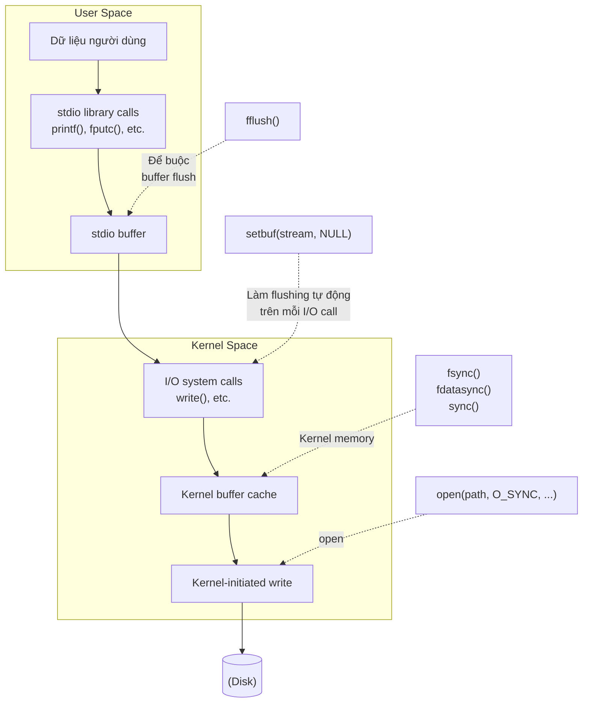

## Chương 13
# <span id="page-0-0"></span>**BUFFERING VÀ FILE I/O**

Với mục đích tăng tốc độ và hiệu suất, các system call I/O (tức là kernel) và các hàm I/O của thư viện C chuẩn (tức là các hàm stdio) đều thực hiện buffering dữ liệu khi làm việc với các file trên disk. Trong chương này, chúng ta sẽ mô tả cả hai loại buffering này và xem xét cách chúng ảnh hưởng đến hiệu suất ứng dụng. Chúng ta cũng sẽ xem xét các kỹ thuật khác nhau để kiểm soát và vô hiệu hóa cả hai loại buffering, cũng như một kỹ thuật được gọi là direct I/O, rất hữu ích trong việc bypass kernel buffering trong những trường hợp nhất định.

# **13.1 Kernel Buffering của File I/O: Buffer Cache**

<span id="page-0-1"></span>Khi làm việc với các file trên disk, các system call `read()` và `write()` không trực tiếp khởi tạo truy cập disk. Thay vào đó, chúng chỉ sao chép dữ liệu giữa một buffer trong user-space và một buffer trong kernel buffer cache. Ví dụ, lệnh gọi sau chuyển 3 byte dữ liệu từ một buffer trong user-space memory đến một buffer trong kernel space:

```
write(fd, "abc", 3);
```

Tại thời điểm này, `write()` trả về. Ở một thời điểm nào đó sau đó, kernel sẽ ghi (flush) buffer của nó vào disk. (Vì vậy, chúng ta nói rằng system call không được đồng bộ hóa với hoạt động disk.) Nếu trong thời gian chờ đó, một process khác cố gắng đọc các byte này từ file, thì kernel sẽ tự động cấp dữ liệu từ buffer cache, thay vì từ (các nội dung lỗi thời của) file.

Tương ứng với input, kernel sẽ đọc dữ liệu từ disk và lưu trữ nó trong một kernel buffer. Các lệnh gọi `read()` sẽ lấy dữ liệu từ buffer này cho đến khi nó được sử dụng hết, tại thời điểm đó kernel sẽ đọc đoạn tiếp theo của file vào buffer cache. (Đây là một đơn giản hóa; để truy cập file tuần tự, kernel thường thực hiện read-ahead để cố gắng đảm bảo rằng các block tiếp theo của file được đọc vào buffer cache trước khi process đọc yêu cầu chúng. Chúng ta sẽ nói thêm về readahead trong Phần [13.5](#page-11-0).)

Mục đích của thiết kế này là cho phép `read()` và `write()` diễn ra nhanh chóng, vì chúng không cần phải chờ một hoạt động disk (chậm). Thiết kế này cũng hiệu quả, vì nó giảm số lượng disk transfer mà kernel phải thực hiện.

Kernel Linux không áp đặt giới hạn cố định trên cùng kích thước của buffer cache. Kernel sẽ cấp phát bao nhiêu buffer cache page cần thiết, được giới hạn chỉ bởi lượng physical memory có sẵn và các yêu cầu về physical memory cho các mục đích khác (ví dụ: giữ các text và data page được yêu cầu bởi các process đang chạy). Nếu bộ nhớ có sẵn không đủ, thì kernel sẽ flush một số trang buffer cache đã sửa đổi vào disk, để giải phóng các trang đó để tái sử dụng.

> Nói chính xác hơn, từ kernel 2.4 trở đi, Linux không còn duy trì một buffer cache riêng biệt. Thay vào đó, các file I/O buffer được bao gồm trong page cache, nó cũng chứa các trang từ các file được ánh xạ bộ nhớ. Tuy nhiên, trong phần thảo luận trong văn bản chính, chúng ta sử dụng thuật ngữ buffer cache, vì thuật ngữ đó phổ biến về mặt lịch sử trên các triển khai UNIX.

### **Ảnh hưởng của kích thước buffer đến hiệu suất system call I/O**

Kernel thực hiện cùng số lượng disk access, bất kể chúng ta thực hiện 1000 writes của một single byte hay một single write của 1000 bytes. Tuy nhiên, cái sau được ưu tiên hơn, vì nó chỉ yêu cầu một single system call, trong khi cái trước yêu cầu 1000 system call. Mặc dù nhanh hơn nhiều so với các hoạt động disk, system call vẫn tốn một lượng thời gian đáng kể, vì kernel phải trap lệnh gọi, kiểm tra tính hợp lệ của các đối số system call, và chuyển dữ liệu giữa user space và kernel space (tham khảo Phần 3.1 để biết thêm chi tiết).

Tác động của việc thực hiện file I/O bằng các kích thước buffer khác nhau có thể được nhìn thấy bằng cách chạy chương trình trong Listing 4-1 (trên trang 71) với các giá trị BUF\_SIZE khác nhau. (Hằng số BUF\_SIZE chỉ định có bao nhiêu byte được chuyển bởi mỗi lệnh gọi `read()` và `write()`.) Bảng 13-1 cho thấy thời gian mà chương trình này yêu cầu để sao chép một file có 100 triệu byte trên Linux ext2 file system bằng cách sử dụng các giá trị BUF\_SIZE khác nhau. Lưu ý những điểm sau liên quan đến thông tin trong bảng này:

-  Các cột Elapsed và Total CPU time có ý nghĩa rõ ràng. Các cột User CPU và System CPU cho thấy một sự phân tích của Total CPU time thành, tương ứng, thời gian dành để thực thi mã ở user mode và thời gian dành để thực thi mã kernel (tức là system call).
-  Các bài kiểm tra được hiển thị trong bảng được thực hiện bằng cách sử dụng một vanilla 2.6.30 kernel trên ext2 file system với kích thước block 4096 byte.

Khi chúng ta nói về một vanilla kernel, chúng ta có nghĩa là một mainline kernel không được vá. Điều này ngược lại với các kernel được cung cấp bởi hầu hết các nhà phân phối, thường bao gồm các bản vá khác nhau để sửa lỗi hoặc thêm tính năng.

 Mỗi hàng cho thấy trung bình của 20 lần chạy cho kích thước buffer nhất định. Trong các bài kiểm tra này, cũng như trong các bài kiểm tra khác được hiển thị sau trong chương này, file system được unmount và remount giữa mỗi lần thực thi chương trình để đảm bảo rằng buffer cache cho file system là trống. Timing được thực hiện bằng cách sử dụng lệnh shell time.

**Bảng 13-1:** Thời gian cần thiết để nhân đôi một file có 100 triệu byte

|          | Thời gian (giây) |           |          |            |  |  |
|----------|----------------|-----------|----------|------------|--|--|
| BUF_SIZE | Elapsed        | Total CPU | User CPU | System CPU |  |  |
| 1        | 107.43         | 107.32    | 8.20     | 99.12      |  |  |
| 2        | 54.16          | 53.89     | 4.13     | 49.76      |  |  |
| 4        | 31.72          | 30.96     | 2.30     | 28.66      |  |  |
| 8        | 15.59          | 14.34     | 1.08     | 13.26      |  |  |
| 16       | 7.50           | 7.14      | 0.51     | 6.63       |  |  |
| 32       | 3.76           | 3.68      | 0.26     | 3.41       |  |  |
| 64       | 2.19           | 2.04      | 0.13     | 1.91       |  |  |
| 128      | 2.16           | 1.59      | 0.11     | 1.48       |  |  |
| 256      | 2.06           | 1.75      | 0.10     | 1.65       |  |  |
| 512      | 2.06           | 1.03      | 0.05     | 0.98       |  |  |
| 1024     | 2.05           | 0.65      | 0.02     | 0.63       |  |  |
| 4096     | 2.05           | 0.38      | 0.01     | 0.38       |  |  |
| 16384    | 2.05           | 0.34      | 0.00     | 0.33       |  |  |
| 65536    | 2.06           | 0.32      | 0.00     | 0.32       |  |  |

Vì tổng lượng dữ liệu được chuyển (và do đó số lượng disk operation) là như nhau cho các kích thước buffer khác nhau, những gì Bảng 13-1 minh họa là overhead của việc tạo các lệnh gọi `read()` và `write()`. Với kích thước buffer là 1 byte, 100 triệu lệnh gọi được tạo đến `read()` và `write()`. Với kích thước buffer là 4096 byte, số lần gọi của mỗi system call giảm xuống còn khoảng 24.000, và hiệu suất gần như tối ưu được đạt được. Vượt quá điểm này, không có cải thiện hiệu suất đáng kể, bởi vì chi phí tạo các system call `read()` và `write()` trở nên không đáng kể so với thời gian cần thiết để sao chép dữ liệu giữa user space và kernel space, cũng như để thực hiện actual disk I/O.

> Các hàng cuối cùng của Bảng 13-1 cho phép chúng ta ước tính thô các thời gian cần thiết để chuyển dữ liệu giữa user space và kernel space, và cho file I/O. Vì số lượng system call trong các trường hợp này là tương đối nhỏ, đóng góp của chúng cho elapsed và CPU time là không đáng kể. Do đó, chúng ta có thể nói rằng System CPU time về cơ bản đang đo lường thời gian cho chuyển dữ liệu giữa user space và kernel space. Giá trị Elapsed time cho chúng ta ước tính về thời gian cần thiết cho chuyển dữ liệu đến và từ disk. (Như chúng ta sẽ thấy ngay bây giờ, đây chủ yếu là thời gian cần thiết cho disk read.)

Tóm lại, nếu chúng ta đang chuyển một lượng dữ liệu lớn đến hoặc từ một file, thì bằng cách buffering dữ liệu trong các khối lớn, và do đó thực hiện ít hơn các system call, chúng ta có thể cải thiện đáng kể hiệu suất I/O.

Dữ liệu trong Bảng 13-1 đo lường một loạt các yếu tố: thời gian thực hiện các system call `read()` và `write()`, thời gian chuyển dữ liệu giữa các buffer ở kernel space và user space, và thời gian chuyển dữ liệu giữa kernel buffer và disk. Hãy xem xét thêm yếu tố cuối cùng này. Rõ ràng, chuyển nội dung của input file vào buffer cache là không thể tránh khỏi. Tuy nhiên, chúng ta đã thấy rằng `write()` trả về ngay sau khi chuyển dữ liệu từ user space đến kernel buffer cache. Vì kích thước RAM trên hệ thống kiểm tra (4 GB) vượt xa kích thước của file đang được sao chép (100 MB), chúng ta có thể giả định rằng khi chương trình hoàn thành, output file chưa được ghi vào disk. Do đó, như một thí nghiệm tiếp theo, chúng ta đã chạy một chương trình đơn giản ghi dữ liệu tùy ý vào một file bằng cách sử dụng các kích thước buffer `write()` khác nhau. Kết quả được hiển thị trong Bảng 13-2.

Một lần nữa, dữ liệu được hiển thị trong Bảng 13-2 được lấy từ kernel 2.6.30, trên ext2 file system với kích thước block 4096 byte, và mỗi hàng cho thấy trung bình của 20 lần chạy. Chúng ta không hiển thị chương trình kiểm tra (filebuff/write\_bytes.c), nhưng nó có sẵn trong bản phân phối mã nguồn cho cuốn sách này.

|  | Bảng 13-2: Thời gian cần thiết để ghi một file có 100 triệu byte |  |  |
|--|----------------------------------------------------------------|--|--|
|--|----------------------------------------------------------------|--|--|

|          | Thời gian (giây) |           |          |            |  |  |
|----------|----------------|-----------|----------|------------|--|--|
| BUF_SIZE | Elapsed        | Total CPU | User CPU | System CPU |  |  |
| 1        | 72.13          | 72.11     | 5.00     | 67.11      |  |  |
| 2        | 36.19          | 36.17     | 2.47     | 33.70      |  |  |
| 4        | 20.01          | 19.99     | 1.26     | 18.73      |  |  |
| 8        | 9.35           | 9.32      | 0.62     | 8.70       |  |  |
| 16       | 4.70           | 4.68      | 0.31     | 4.37       |  |  |
| 32       | 2.39           | 2.39      | 0.16     | 2.23       |  |  |
| 64       | 1.24           | 1.24      | 0.07     | 1.16       |  |  |
| 128      | 0.67           | 0.67      | 0.04     | 0.63       |  |  |
| 256      | 0.38           | 0.38      | 0.02     | 0.36       |  |  |
| 512      | 0.24           | 0.24      | 0.01     | 0.23       |  |  |
| 1024     | 0.17           | 0.17      | 0.01     | 0.16       |  |  |
| 4096     | 0.11           | 0.11      | 0.00     | 0.11       |  |  |
| 16384    | 0.10           | 0.10      | 0.00     | 0.10       |  |  |
| 65536    | 0.09           | 0.09      | 0.00     | 0.09       |  |  |

Bảng 13-2 cho thấy các chi phí chỉ để tạo các system call `write()` và chuyển dữ liệu từ user space đến kernel buffer cache bằng cách sử dụng các kích thước buffer `write()` khác nhau. Đối với kích thước buffer lớn hơn, chúng ta thấy các khác biệt đáng kể so với dữ liệu được hiển thị trong Bảng 13-1. Ví dụ, đối với kích thước buffer 65.536 byte, elapsed time trong Bảng 13-1 là 2.06 giây, trong khi trong Bảng 13-2 nó là 0.09 giây. Điều này là vì không có actual disk I/O nào được thực hiện trong trường hợp sau. Nói cách khác, phần lớn thời gian cần thiết cho các trường hợp buffer lớn trong Bảng 13-1 là do disk read.

Như chúng ta sẽ thấy trong Phần [13.3,](#page-6-0) khi chúng ta buộc các output operation phải chặn cho đến khi dữ liệu được chuyển đến disk, thời gian cho các lệnh gọi `write()` sẽ tăng đáng kể.

Cuối cùng, cần lưu ý rằng thông tin trong Bảng 13-2 (và sau đó, trong [Bảng 13-3](#page-9-0)) chỉ đại diện cho một hình thức (ngây thơ) của benchmark cho một file system. Hơn nữa, kết quả có thể sẽ thay đổi trên các file system. File system có thể được đo lường theo các tiêu chí khác nhau, chẳng hạn như hiệu suất dưới tải đa người dùng nặng, tốc độ tạo và xóa file, thời gian cần thiết để tìm kiếm một file trong một thư mục lớn, không gian cần thiết để lưu trữ các file nhỏ, hoặc duy trì tính toàn vẹn file trong trường hợp xảy ra system crash. Nếu hiệu suất của I/O hoặc các hoạt động file-system khác là quan trọng, không có sự thay thế nào cho các benchmark cụ thể ứng dụng trên nền tảng đích.

# **13.2 Buffering trong Thư viện stdio**

Buffering của dữ liệu thành các khối lớn để giảm system call chính xác là những gì được thực hiện bởi các hàm I/O thư viện C (ví dụ: `fprintf()`, `fscanf()`, `fgets()`, `fputs()`, `fputc()`, `fgetc()`) khi làm việc với các file trên disk. Do đó, sử dụng thư viện stdio giải phóng chúng ta khỏi tác vụ buffering dữ liệu cho output bằng `write()` hoặc input qua `read()`.

### **Thiết lập chế độ buffering của một stdio stream**

Hàm `setvbuf()` kiểm soát hình thức buffering được sử dụng bởi thư viện stdio.

```
#include <stdio.h>
int setvbuf(FILE *stream, char *buf, int mode, size_t size);
                                      Trả về 0 nếu thành công, hoặc nonzero khi gặp lỗi
```

Đối số stream xác định file stream mà buffering sẽ được sửa đổi. Sau khi stream được mở, lệnh gọi `setvbuf()` phải được tạo trước khi gọi bất kỳ hàm stdio nào khác trên stream. Lệnh gọi `setvbuf()` ảnh hưởng đến hành vi của tất cả các hoạt động stdio tiếp theo trên stream được chỉ định.

> Các stream được sử dụng bởi thư viện stdio không nên nhầm lẫn với STREAMS facility của System V. Cơ sở STREAMS của System V không được triển khai trong mainline Linux kernel.

Các đối số buf và size chỉ định buffer được sử dụng cho stream. Các đối số này có thể được chỉ định theo hai cách:

-  Nếu buf không phải là NULL, thì nó trỏ đến một khối bộ nhớ có kích thước size byte được sử dụng làm buffer cho stream. Vì buffer được trỏ đến bởi buf sau đó được sử dụng bởi thư viện stdio, nó phải được phân bổ tĩnh hoặc được phân bổ động trên heap (bằng `malloc()` hoặc tương tự). Nó không nên được phân bổ làm một local function variable trên stack, vì sẽ xảy ra chaos khi function đó trả về và stack frame của nó được deallocate.
-  Nếu buf là NULL, thì thư viện stdio sẽ tự động phân bổ một buffer để sử dụng với stream (trừ khi chúng ta chọn unbuffered I/O, như được mô tả bên dưới). SUSv3 cho phép, nhưng không yêu cầu, một triển khai để sử dụng size để xác định kích thước cho buffer này. Trong triển khai glibc, size bị bỏ qua trong trường hợp này.

Đối số mode chỉ định loại buffering và có một trong những giá trị sau: \_IONBF

Đừng buffer I/O. Mỗi lệnh gọi thư viện stdio dẫn đến một lệnh gọi `write()` hoặc `read()` system call ngay lập tức. Các đối số buf và size bị bỏ qua, và có thể được chỉ định là NULL và 0, tương ứng. Đây là mặc định cho stderr, để output lỗi được đảm bảo xuất hiện ngay lập tức.

\_IOLBF

Sử dụng line-buffered I/O. Flag này là mặc định cho các stream tham chiếu đến các thiết bị terminal. Đối với output stream, dữ liệu được buffer cho đến khi một ký tự newline được output (trừ khi buffer đầy tiên). Đối với input stream, dữ liệu được đọc theo từng dòng.

\_IOFBF

Sử dụng fully buffered I/O. Dữ liệu được đọc hoặc ghi (thông qua các lệnh gọi `read()` hoặc `write()`) trong các đơn vị bằng kích thước của buffer. Chế độ này là mặc định cho các stream tham chiếu đến các file trên disk.

Đoạn mã sau đây minh họa việc sử dụng `setvbuf()`:

```
#define BUF_SIZE 1024
static char buf[BUF_SIZE];
if (setvbuf(stdout, buf, _IOFBF, BUF_SIZE) != 0)
 errExit("setvbuf");
```

Lưu ý rằng `setvbuf()` trả về một giá trị nonzero (không nhất thiết là –1) khi gặp lỗi.

Hàm `setbuf()` được xây dựng dựa trên `setvbuf()`, và thực hiện một tác vụ tương tự.

```
#include <stdio.h>
void setbuf(FILE *stream, char *buf);
```

Ngoại trừ thực tế là nó không trả về kết quả hàm, lệnh gọi `setbuf(fp, buf)` tương đương với:

```
setvbuf(fp, buf, (buf != NULL) ? _IOFBF: _IONBF, BUFSIZ);
```

Đối số buf được chỉ định là NULL, để không buffer, hoặc là một con trỏ đến một buffer do caller phân bổ có kích thước BUFSIZ byte. (BUFSIZ được định nghĩa trong <stdio.h>. Trong triển khai glibc, hằng số này có giá trị 8192, rất điển hình.)

Hàm `setbuffer()` tương tự như `setbuf()`, nhưng cho phép người gọi chỉ định kích thước của buf.

```
#define _BSD_SOURCE
#include <stdio.h>
void setbuffer(FILE *stream, char *buf, size_t size);
```

Lệnh gọi `setbuffer(fp, buf, size)` tương đương với những điều sau đây:

```
setvbuf(fp, buf, (buf != NULL) ? _IOFBF : _IONBF, size);
```

Hàm `setbuffer()` không được chỉ định trong SUSv3, nhưng có sẵn trên hầu hết các triển khai UNIX.

### **Flushing một stdio buffer**

Bất kể chế độ buffering hiện tại, bất cứ lúc nào, chúng ta có thể buộc dữ liệu trong một stdio output stream được ghi (tức là flush đến một kernel buffer thông qua `write()`) bằng cách sử dụng hàm thư viện `fflush()`. Hàm này flush output buffer cho stream được chỉ định.

```
#include <stdio.h>
int fflush(FILE *stream);
                                               Trả về 0 nếu thành công, EOF khi gặp lỗi
```

Nếu stream là NULL, `fflush()` sẽ flush tất cả các stdio buffer.

Hàm `fflush()` cũng có thể được áp dụng cho một input stream. Điều này gây ra bất kỳ buffered input nào bị loại bỏ. (Buffer sẽ được điền lại khi chương trình tiếp theo cố gắng đọc từ stream.)

Một stdio buffer được tự động flush khi stream tương ứng được đóng.

Trong nhiều triển khai C library, bao gồm cả glibc, nếu stdin và stdout tham chiếu đến một terminal, thì một implicit `fflush(stdout)` được thực hiện bất cứ khi nào input được đọc từ stdin. Điều này có tác dụng flush bất kỳ prompts nào được ghi vào stdout mà không bao gồm ký tự terminating newline (ví dụ: `printf("Date: ")`). Tuy nhiên, hành vi này không được chỉ định trong SUSv3 hoặc C99 và không được triển khai trong tất cả các C libraries. Các chương trình portable nên sử dụng các lệnh gọi `fflush(stdout)` rõ ràng để đảm bảo rằng các prompts như vậy được hiển thị.

> Tiêu chuẩn C99 đặt ra hai yêu cầu nếu một stream được mở cho cả input và output. Đầu tiên, một output operation không thể được trực tiếp theo sau bởi một input operation mà không có một lệnh gọi can thiệp đến `fflush()` hoặc một trong các hàm file-positioning (`fseek()`, `fsetpos()`, hoặc `rewind()`). Thứ hai, một input operation không thể được trực tiếp theo sau bởi một output operation mà không có một lệnh gọi can thiệp đến một trong các hàm file-positioning, trừ khi input operation gặp end-of-file.

# <span id="page-6-0"></span>**13.3 Kiểm soát Kernel Buffering của File I/O**

<span id="page-6-1"></span>Có thể buộc flush của kernel buffer cho các file output. Đôi khi, điều này là cần thiết nếu một ứng dụng (ví dụ: một process journaling cơ sở dữ liệu) phải đảm bảo rằng output thực sự được ghi vào disk (hoặc ít nhất đến hardware cache của disk) trước khi tiếp tục.

Trước khi chúng ta mô tả các system call được sử dụng để kiểm soát kernel buffering, sẽ rất hữu ích nếu xem xét một vài định nghĩa liên quan từ SUSv3.

### **Synchronized I/O data integrity và synchronized I/O file integrity**

SUSv3 định nghĩa thuật ngữ synchronized I/O completion có nghĩa là "một I/O operation đã được chuyển thành công [đến disk] hoặc được chẩn đoán là không thành công."

SUSv3 định nghĩa hai loại khác nhau của synchronized I/O completion. Sự khác biệt giữa các loại liên quan đến metadata ("dữ liệu về dữ liệu") mô tả file, mà kernel lưu trữ cùng với dữ liệu cho một file. Chúng ta xem xét file metadata chi tiết khi chúng ta xem xét file i-node trong Phần [14.4,](#page-23-0) nhưng bây giờ, nó đủ để lưu ý rằng file metadata bao gồm thông tin như file owner và group; file permissions; file size; số lượng (hard) link đến file; timestamp chỉ ra thời gian truy cập file cuối cùng, modification file cuối cùng, và metadata change cuối cùng; và file data block pointer.

Loại đầu tiên của synchronized I/O completion được định nghĩa bởi SUSv3 là synchronized I/O data integrity completion. Điều này liên quan đến việc đảm bảo rằng một file data update chuyển đủ thông tin để cho phép một lần lấy lại dữ liệu đó sau đó tiến hành.

-  Đối với một read operation, điều này có nghĩa rằng dữ liệu file được yêu cầu đã được chuyển (từ disk) đến process. Nếu có bất kỳ pending write operation nào ảnh hưởng đến dữ liệu được yêu cầu, chúng được chuyển đến disk trước khi thực hiện read.
-  Đối với một write operation, điều này có nghĩa rằng dữ liệu được chỉ định trong write request đã được chuyển (đến disk) và tất cả file metadata được yêu cầu để lấy lại dữ liệu đó cũng đã được chuyển. Điểm chính cần lưu ý ở đây là không phải tất cả các modified file metadata attribute cần phải được chuyển để cho phép dữ liệu file được lấy lại. Một ví dụ về một modified file metadata attribute mà sẽ cần phải được chuyển là file size (nếu write operation mở rộng file). Ngược lại, modified file timestamp sẽ không cần phải được chuyển đến disk trước khi một data retrieval tiếp theo có thể tiến hành.

Loại khác của synchronized I/O completion được định nghĩa bởi SUSv3 là synchronized I/O file integrity completion, đó là một superset của synchronized I/O data integrity completion. Sự khác biệt với chế độ I/O completion này là trong một file update, tất cả updated file metadata được chuyển đến disk, ngay cả khi nó không cần thiết cho hoạt động của một read tiếp theo của file data.

### **System call để kiểm soát kernel buffering của file I/O**

System call `fsync()` gây ra buffered data và tất cả metadata liên quan đến open file descriptor fd được flush đến disk. Gọi `fsync()` buộc file vào synchronized I/O file integrity completion state.

```
#include <unistd.h>
int fsync(int fd);
                                              Trả về 0 nếu thành công, hoặc –1 khi gặp lỗi
```

Một lệnh gọi `fsync()` chỉ trả về sau khi chuyển đến disk device (hoặc ít nhất là cache của nó) đã hoàn thành.

System call `fdatasync()` hoạt động tương tự như `fsync()`, nhưng chỉ buộc file vào synchronized I/O data integrity completion state.

```
#include <unistd.h>
int fdatasync(int fd);
                                             Trả về 0 nếu thành công, hoặc –1 khi gặp lỗi
```

Sử dụng `fdatasync()` có khả năng giảm số lượng disk operation từ hai được yêu cầu bởi `fsync()` xuống một. Ví dụ, nếu file data đã thay đổi, nhưng file size không, thì gọi `fdatasync()` chỉ buộc dữ liệu được cập nhật. (Chúng ta đã lưu ý ở trên rằng các thay đổi đối với file metadata attribute như timestamp cuối cùng modified không cần phải được chuyển để synchronized I/O data completion.) Ngược lại, gọi `fsync()` cũng sẽ buộc metadata được chuyển đến disk.

Giảm số lượng disk I/O operation theo cách này rất hữu ích cho các ứng dụng nhất định trong đó hiệu suất quan trọng và duy trì chính xác một số metadata (chẳng hạn như timestamp) không phải là thiết yếu. Điều này có thể tạo ra sự khác biệt hiệu suất đáng kể cho các ứng dụng đang tạo ra nhiều file update: vì file data và metadata thường nằm ở các phần khác nhau của disk, cập nhật cả hai sẽ yêu cầu các hoạt động seek lặp lại qua lại trên disk.

Trong Linux 2.2 và trước đó, `fdatasync()` được triển khai như một lệnh gọi đến `fsync()`, và do đó không mang lợi nhuận hiệu suất.

> Bắt đầu với kernel 2.6.17, Linux cung cấp system call không chuẩn `sync\_file\_range()`, cho phép kiểm soát chính xác hơn `fdatasync()` khi flush file data. Người gọi có thể chỉ định file region được flush, và chỉ định flag kiểm soát xem system call có chặn trên disk write hay không. Xem manual page `sync\_file\_range(2)` để biết thêm chi tiết.

System call `sync()` gây ra tất cả kernel buffer chứa updated file information (tức là data block, pointer block, metadata, vv) được flush đến disk.

```
#include <unistd.h>
void sync(void);
```

Trong triển khai Linux, `sync()` chỉ trả về sau khi tất cả dữ liệu đã được chuyển đến disk device (hoặc ít nhất là cache của nó). Tuy nhiên, SUSv3 cho phép một triển khai của `sync()` để đơn giản lên lịch I/O transfer và trả về trước khi nó đã hoàn thành.

> Một permanently running kernel thread đảm bảo rằng modified kernel buffer được flush đến disk nếu chúng không được đồng bộ hóa rõ ràng trong vòng 30 giây. Điều này được thực hiện để đảm bảo rằng buffer không còn unsynchronized với file disk tương ứng (và do đó dễ bị mất trong trường hợp xảy ra system crash) trong những khoảng thời gian dài. Trong Linux 2.6, tác vụ này được thực hiện bởi pdflush kernel thread. (Trong Linux 2.4, nó được thực hiện bởi kupdated kernel thread.)

> File `/proc/sys/vm/dirty\_expire\_centisecs` chỉ định tuổi (tính bằng phần trăm giây) mà một dirty buffer phải đạt được trước khi nó được flush bởi pdflush. Các file bổ sung trong cùng thư mục kiểm soát các khía cạnh khác của hoạt động của pdflush.

### **Làm cho tất cả write đồng bộ: O\_SYNC**

Chỉ định flag O\_SYNC khi gọi `open()` làm cho tất cả output tiếp theo là đồng bộ:

```
fd = open(pathname, O_WRONLY | O_SYNC);
```

Sau lệnh gọi `open()` này, mỗi `write()` đến file tự động flush file data và metadata đến disk (tức là write được thực hiện theo synchronized I/O file integrity completion).

> Các hệ thống BSD cũ sử dụng flag O\_FSYNC để cung cấp chức năng O\_SYNC. Trong glibc, O\_FSYNC được định nghĩa là một từ đồng nghĩa cho O\_SYNC.

### **Tác động hiệu suất của O\_SYNC**

Sử dụng flag O\_SYNC (hoặc tạo các lệnh gọi thường xuyên đến `fsync()`, `fdatasync()`, hoặc `sync()`) có thể mạnh mẽ ảnh hưởng đến hiệu suất. [Bảng 13-3](#page-9-0) cho thấy thời gian cần thiết để ghi 1 triệu byte vào một file mới tạo (trên một ext2 file system) cho một loạt các kích thước buffer với và không có O\_SYNC. Kết quả được lấy (sử dụng chương trình filebuff/write\_bytes.c được cung cấp trong bản phân phối mã nguồn cho cuốn sách này) bằng cách sử dụng một vanilla 2.6.30 kernel và một ext2 file system có kích thước block 4096 byte. Mỗi hàng cho thấy trung bình của 20 lần chạy cho kích thước buffer nhất định.

Như có thể thấy từ bảng, O\_SYNC tăng elapsed time to lớn — trong trường hợp 1-byte buffer, bởi một yếu tố hơn 1000. Cũng lưu ý các khác biệt lớn giữa elapsed và CPU time cho write với O\_SYNC. Đây là hệ quả của chương trình được chặn trong khi mỗi buffer thực sự được chuyển đến disk.

Kết quả được hiển thị trong [Bảng 13-3](#page-9-0) bỏ qua một yếu tố tiếp theo ảnh hưởng đến hiệu suất khi sử dụng O\_SYNC. Các ổ đĩa hiện đại có cache nội bộ lớn, và theo mặc định, O\_SYNC chỉ gây ra dữ liệu được chuyển đến cache. Nếu chúng ta vô hiệu hóa cache trên disk (bằng cách sử dụng lệnh `hdparm –W0`), thì tác động hiệu suất của O\_SYNC trở nên thậm chí còn cực đoan hơn. Trong trường hợp 1-byte, elapsed time tăng từ 1030 giây lên khoảng 16.000 giây. Trong trường hợp 4096-byte, elapsed time tăng từ 0.34 giây lên 4 giây.

Tóm lại, nếu chúng ta cần buộc flush của kernel buffer, chúng ta nên xem xét liệu chúng ta có thể thiết kế ứng dụng của mình để sử dụng large write buffer size hay tạo các lệnh gọi judicious đến `fsync()` hoặc `fdatasync()`, thay vì sử dụng flag O\_SYNC khi mở file.

|          |                |           | Thời gian cần thiết (giây) |             |
|----------|----------------|-----------|-------------------------|-------------|
| BUF_SIZE | Không O_SYNC   |           |                         | Với O_SYNC |
|          | Elapsed        | Total CPU | Elapsed                 | Total CPU   |
| 1        | 0.73           | 0.73      | 1030                    | 98.8        |
| 16       | 0.05           | 0.05      | 65.0                    | 0.40        |
| 256      | 0.02           | 0.02      | 4.07                    | 0.03        |

4096 0.01 0.01 0.34 0.03

<span id="page-9-0"></span>**Bảng 13-3:** Tác động của flag O\_SYNC đối với tốc độ ghi 1 triệu byte

### **Các flag O\_DSYNC và O\_RSYNC**

SUSv3 chỉ định hai trong các open file status flag liên quan đến synchronized I/O: O\_DSYNC và O\_RSYNC.

Flag O\_DSYNC gây ra write được thực hiện theo các yêu cầu của synchronized I/O data integrity completion (giống như `fdatasync()`). Điều này ngược lại với O\_SYNC, gây ra write được thực hiện theo các yêu cầu của synchronized I/O file integrity completion (giống như `fsync()`).

Flag O\_RSYNC được chỉ định kết hợp với O\_SYNC hoặc O\_DSYNC, và mở rộng write behavior của các flag này cho read operation. Chỉ định cả O\_RSYNC và O\_DSYNC khi mở một file có nghĩa rằng tất cả các read tiếp theo được hoàn thành theo các yêu cầu của synchronized I/O data integrity (tức là trước khi thực hiện read, tất cả pending file write được hoàn thành như thể được thực hiện với O\_DSYNC). Chỉ định cả O\_RSYNC và O\_SYNC khi mở một file có nghĩa rằng tất cả các read tiếp theo được hoàn thành theo các yêu cầu của synchronized I/O file integrity (tức là trước khi thực hiện read, tất cả pending file write được hoàn thành như thể được thực hiện với O\_SYNC).

Trước kernel 2.6.33, các flag O\_DSYNC và O\_RSYNC không được triển khai trên Linux, và glibc header định nghĩa các hằng số này là giống như O\_SYNC. (Điều này không thực sự chính xác trong trường hợp O\_RSYNC, vì O\_SYNC không cung cấp bất kỳ chức năng nào cho read operation.)

Bắt đầu với kernel 2.6.33, Linux triển khai O\_DSYNC, và một triển khai của O\_RSYNC có khả năng được thêm vào trong một kernel release trong tương lai.

> Trước kernel 2.6.33, Linux không hoàn toàn triển khai O\_SYNC semantics. Thay vào đó, O\_SYNC được triển khai như O\_DSYNC. Để duy trì hành vi nhất quán cho các ứng dụng được xây dựng cho kernel cũ hơn, các ứng dụng được liên kết với các phiên bản cũ hơn của GNU C library tiếp tục cung cấp O\_DSYNC semantics cho O\_SYNC, ngay cả trên Linux 2.6.33 và sau đó.

# **13.4 Tóm tắt I/O Buffering**

Hình 13-1 cung cấp một tổng quan về buffering được sử dụng (cho output file) bởi thư viện stdio và kernel, cùng với các cơ chế để kiểm soát mỗi loại buffering. Di chuyển xuống dưới qua giữa sơ đồ này, chúng ta thấy chuyển dữ liệu người dùng bởi các hàm thư viện stdio đến stdio buffer, được duy trì trong user memory space. Khi buffer này được điền, thư viện stdio gọi system call `write()`, chuyển dữ liệu vào kernel buffer cache (được duy trì trong kernel memory). Cuối cùng, kernel khởi tạo một hoạt động disk để chuyển dữ liệu đến disk.

Phía bên trái của Hình 13-1 cho thấy các lệnh gọi có thể được sử dụng bất cứ lúc nào để buộc một flush của bất kỳ buffer nào. Phía bên phải cho thấy các lệnh gọi có thể được sử dụng để làm cho flush tự động, bằng cách vô hiệu hóa buffering trong thư viện stdio hoặc bằng cách làm cho file output system call đồng bộ, để mỗi `write()` được ngay lập tức flush đến disk.



Hình 13-1: Tóm tắt I/O buffering

# <span id="page-11-0"></span>13.5 Tư vấn Kernel Về I/O Pattern

System call `posix\_fadvise()` cho phép một process thông báo cho kernel về mô hình có khả năng của nó để truy cập file data.

```
#define _XOPEN_SOURCE 600
#include <fcntl.h>
int posix_fadvise(int fd, off_t offset, off_t len, int advice);
```

Kernel có thể (nhưng không bắt buộc) sử dụng thông tin được cung cấp bởi `posix\_fadvise()` để tối ưu hóa việc sử dụng buffer cache, từ đó cải thiện hiệu suất I/O cho process và cho hệ thống nói chung. Gọi `posix\_fadvise()` không có tác dụng đối với semantics của một chương trình.

Đối số fd là một file descriptor xác định file mà chúng ta muốn thông báo cho kernel về các mô hình truy cập của nó. Các đối số offset và len xác định vùng file mà advice đang được cung cấp: offset chỉ định offset bắt đầu của vùng, và len chỉ định kích thước của vùng tính bằng byte. Một giá trị len là 0 có nghĩa là tất cả byte từ offset thông qua kết thúc file. (Trong kernel trước 2.6.6, len là 0 được diễn giải theo nghĩa đen là zero byte.)

Đối số advice chỉ thị mô hình truy cập dự kiến của process cho file. Nó được chỉ định là một trong những điều sau:

#### POSIX\_FADV\_NORMAL

Process không có special advice nào để cung cấp về mô hình truy cập. Đây là hành vi mặc định nếu không có advice nào được cung cấp cho file. Trên Linux, hoạt động này đặt file read-ahead window thành kích thước mặc định (128 kB).

#### POSIX\_FADV\_SEQUENTIAL

Process dự kiến sẽ đọc dữ liệu tuần tự từ lower offset đến higher offset. Trên Linux, hoạt động này đặt file read-ahead window thành gấp đôi kích thước mặc định.

#### POSIX\_FADV\_RANDOM

Process dự kiến sẽ truy cập dữ liệu theo thứ tự ngẫu nhiên. Trên Linux, tùy chọn này vô hiệu hóa file read-ahead.

#### POSIX\_FADV\_WILLNEED

Process dự kiến sẽ truy cập file region được chỉ định trong tương lai gần. Kernel thực hiện read-ahead để điền buffer cache với file data trong khoảng được chỉ định bởi offset và len. Các lệnh gọi `read()` tiếp theo trên file không chặn trên disk I/O; thay vào đó, chúng chỉ đơn giản lấy dữ liệu từ buffer cache. Kernel không cung cấp bảo đảm về dữ liệu được lấy từ file sẽ còn lại resident trong buffer cache bao lâu. Nếu các process khác hoặc các hoạt động kernel đặt một nhu cầu đủ mạnh mẽ trên bộ nhớ, thì các trang sẽ cuối cùng được tái sử dụng. Nói cách khác, nếu memory pressure cao, thì chúng ta nên đảm bảo rằng elapsed time giữa lệnh gọi `posix\_fadvise()` và các lệnh gọi `read()` tiếp theo là ngắn. (System call `readahead()` cụ thể của Linux cung cấp chức năng tương đương với hoạt động POSIX\_FADV\_WILLNEED.)

#### POSIX\_FADV\_DONTNEED

Process dự kiến sẽ không truy cập file region được chỉ định trong tương lai gần. Điều này tư vấn cho kernel rằng nó có thể giải phóng các cache page tương ứng (nếu có). Trên Linux, hoạt động này được thực hiện theo hai bước. Trước tiên, nếu underlying device hiện không bị tắc bởi một loạt các hoạt động write được xếp hàng, kernel sẽ flush bất kỳ modified page nào trong vùng được chỉ định. Thứ hai, kernel cố gắng giải phóng bất kỳ cache page nào cho vùng. Đối với các modified page trong vùng, bước thứ hai này sẽ chỉ thành công nếu các trang đã được ghi vào underlying device trong bước thứ nhất — tức là, nếu write queue của device không bị tắc. Vì tắc trên device không thể được kiểm soát bởi ứng dụng, một cách thay thế để đảm bảo rằng cache page có thể được giải phóng là precede hoạt động POSIX\_FADV\_DONTNEED bằng một lệnh gọi `sync()` hoặc `fdatasync()` chỉ định fd.

#### POSIX\_FADV\_NOREUSE

Process dự kiến sẽ truy cập dữ liệu trong file region được chỉ định một lần, và sau đó sẽ không tái sử dụng nó. Hint này nói cho kernel rằng nó có thể giải phóng các trang sau khi chúng được truy cập một lần. Trên Linux, hoạt động này hiện không có tác dụng.

<span id="page-13-0"></span>Đặc tả của `posix\_fadvise()` là mới trong SUSv3, và không phải tất cả các triển khai UNIX đều hỗ trợ interface này. Linux cung cấp `posix\_fadvise()` từ kernel 2.6.

# **13.6 Bypass Buffer Cache: Direct I/O**

Bắt đầu với kernel 2.4, Linux cho phép một ứng dụng bypass buffer cache khi thực hiện disk I/O, do đó chuyển dữ liệu trực tiếp từ user space đến một file hoặc disk device. Điều này đôi khi được gọi là direct I/O hoặc raw I/O.

> Các chi tiết được mô tả ở đây là cụ thể của Linux và không được tiêu chuẩn hóa bởi SUSv3. Tuy nhiên, hầu hết các triển khai UNIX cung cấp một số hình thức direct I/O access đến device và file.

Direct I/O đôi khi bị hiểu lầm là một phương tiện để có được hiệu suất I/O nhanh. Tuy nhiên, đối với hầu hết các ứng dụng, sử dụng direct I/O có thể làm giảm đáng kể hiệu suất. Điều này là vì kernel áp dụng một số tối ưu hóa để cải thiện hiệu suất của I/O được thực hiện thông qua buffer cache, bao gồm thực hiện sequential read-ahead, thực hiện I/O trong các cluster của disk block, và cho phép các process truy cập cùng một file để chia sẻ buffer trong cache. Tất cả các tối ưu hóa này bị mất khi chúng ta sử dụng direct I/O. Direct I/O chỉ được dự định cho các ứng dụng có yêu cầu I/O chuyên biệt. Ví dụ, các hệ thống cơ sở dữ liệu thực hiện caching và I/O optimization của riêng chúng không cần kernel tiêu CPU time và bộ nhớ để thực hiện các tác vụ tương tự.

Chúng ta có thể thực hiện direct I/O trên một file hoặc một block device cá nhân (ví dụ: một disk). Để làm điều này, chúng ta chỉ định flag O\_DIRECT khi mở file hoặc device bằng `open()`.

Flag O\_DIRECT có hiệu lực từ kernel 2.4.10. Không phải tất cả các Linux file system và kernel version đều hỗ trợ việc sử dụng flag này. Hầu hết các native file system hỗ trợ O\_DIRECT, nhưng nhiều non-UNIX file system (ví dụ: VFAT) thì không. Có thể cần phải kiểm tra file system được đề cập (nếu một file system không hỗ trợ O\_DIRECT, thì `open()` thất bại với lỗi EINVAL) hoặc đọc mã nguồn kernel để kiểm tra hỗ trợ này.

> Nếu một file được mở bằng O\_DIRECT bởi một process, và được mở bình thường (tức là, để buffer cache được sử dụng) bởi một process khác, thì không có coherency giữa nội dung của buffer cache và dữ liệu được đọc hoặc ghi thông qua direct I/O. Các kịch bản như vậy nên được tránh.

> Manual page `raw(8)` mô tả một kỹ thuật cũ hơn (hiện đã lỗi thời) để có được raw access đến một disk device.

### **Các giới hạn alignment cho direct I/O**

Vì direct I/O (trên cả disk device và file) liên quan đến truy cập trực tiếp đến disk, chúng ta phải tuân thủ một số giới hạn khi thực hiện I/O:

-  Data buffer được chuyển phải được căn chỉnh trên một memory boundary là bội số của block size.
-  File hoặc device offset mà chuyển dữ liệu bắt đầu phải là bội số của block size.
-  Độ dài của dữ liệu được chuyển phải là bội số của block size.

Không tuân thủ bất kỳ giới hạn nào trong các giới hạn này dẫn đến lỗi EINVAL. Trong danh sách trên, block size có nghĩa là physical block size của device (thường là 512 byte).

> Khi thực hiện direct I/O, Linux 2.4 có nhiều hạn chế hơn Linux 2.6: alignment, length, và offset phải là bội số của logical block size của underlying file system. (Các logical block size típ của file system là 1024, 2048, hoặc 4096 byte.)

### **Chương trình ví dụ**

Listing 13-1 cung cấp một ví dụ đơn giản về việc sử dụng O\_DIRECT khi mở một file để đọc. Chương trình này nhận tối đa bốn đối số dòng lệnh chỉ định, theo thứ tự, file được đọc, số byte được đọc từ file, offset mà chương trình nên tìm kiếm trước khi đọc từ file, và alignment của data buffer được truyền đến `read()`. Hai đối số cuối cùng là tùy chọn, và mặc định là offset 0 và 4096 byte, tương ứng. Dưới đây là một số ví dụ về những gì chúng ta thấy khi chúng ta chạy chương trình này:

```
$ ./direct_read /test/x 512 Read 512 bytes at offset 0
Read 512 bytes Succeeds
$ ./direct_read /test/x 256
ERROR [EINVAL Invalid argument] read Length is not a multiple of 512
$ ./direct_read /test/x 512 1
ERROR [EINVAL Invalid argument] read Offset is not a multiple of 512
$ ./direct_read /test/x 4096 8192 512
Read 4096 bytes Succeeds
$ ./direct_read /test/x 4096 512 256
ERROR [EINVAL Invalid argument] read Alignment is not a multiple of 512
```

Chương trình trong Listing 13-1 sử dụng hàm `memalign()` để phân bổ một khối bộ nhớ căn chỉnh trên bội số của đối số đầu tiên của nó. Chúng ta mô tả `memalign()` trong Phần 7.1.4.

**Listing 13-1:** Sử dụng O\_DIRECT để bypass buffer cache

```
–––––––––––––––––––––––––––––––––––––––––––––––––––– filebuff/direct_read.c
#define _GNU_SOURCE /* Obtain O_DIRECT definition from <fcntl.h> */
#include <fcntl.h>
#include <malloc.h>
#include "tlpi_hdr.h"
int
main(int argc, char *argv[])
{
 int fd;
 ssize_t numRead;
 size_t length, alignment;
 off_t offset;
 void *buf;
 if (argc < 3 || strcmp(argv[1], "--help") == 0)
 usageErr("%s file length [offset [alignment]]\n", argv[0]);
```

```
 length = getLong(argv[2], GN_ANY_BASE, "length");
 offset = (argc > 3) ? getLong(argv[3], GN_ANY_BASE, "offset") : 0;
 alignment = (argc > 4) ? getLong(argv[4], GN_ANY_BASE, "alignment") : 4096;
 fd = open(argv[1], O_RDONLY | O_DIRECT);
 if (fd == -1)
 errExit("open");
 /* memalign() allocates a block of memory aligned on an address that
 is a multiple of its first argument. The following expression
 ensures that 'buf' is aligned on a non-power-of-two multiple of
 'alignment'. We do this to ensure that if, for example, we ask
 for a 256-byte aligned buffer, then we don't accidentally get
 a buffer that is also aligned on a 512-byte boundary.
 The '(char *)' cast is needed to allow pointer arithmetic (which
 is not possible on the 'void *' returned by memalign()). */
 buf = (char *) memalign(alignment * 2, length + alignment) + alignment;
 if (buf == NULL)
 errExit("memalign");
 if (lseek(fd, offset, SEEK_SET) == -1)
 errExit("lseek");
 numRead = read(fd, buf, length);
 if (numRead == -1)
 errExit("read");
 printf("Read %ld bytes\n", (long) numRead);
 exit(EXIT_SUCCESS);
}
–––––––––––––––––––––––––––––––––––––––––––––––––––– filebuff/direct_read.c
```

# **13.7 Trộn Library Functions và System Call cho File I/O**

Có thể trộn việc sử dụng system call và các hàm thư viện C chuẩn để thực hiện I/O trên cùng một file. Các hàm `fileno()` và `fdopen()` hỗ trợ chúng ta với tác vụ này.

```
#include <stdio.h>
int fileno(FILE *stream);
                                Trả về file descriptor nếu thành công, hoặc –1 khi gặp lỗi
FILE *fdopen(int fd, const char *mode);
                           Trả về (new) file pointer nếu thành công, hoặc NULL khi gặp lỗi
```

Cho một stream, `fileno()` trả về file descriptor tương ứng (tức là cái mà thư viện stdio đã mở cho stream này). File descriptor này có thể sau đó được sử dụng theo cách bình thường với I/O system call như `read()`, `write()`, `dup()`, và `fcntl()`.

Hàm `fdopen()` là ngược lại của `fileno()`. Cho một file descriptor, nó tạo một stream tương ứng sử dụng descriptor này cho I/O của nó. Đối số mode giống như đối với `fopen()`; ví dụ: r để đọc, w để ghi, hoặc a để nối thêm. Nếu đối số này không nhất quán với access mode của file descriptor fd, thì `fdopen()` thất bại.

Hàm `fdopen()` đặc biệt hữu ích cho các descriptor tham chiếu đến các file khác hơn là các file thông thường. Như chúng ta sẽ thấy ở các chương sau, các system call để tạo socket và pipe luôn trả về các file descriptor. Để sử dụng thư viện stdio với các loại file này, chúng ta phải sử dụng `fdopen()` để tạo một file stream tương ứng.

Khi sử dụng các hàm thư viện stdio kết hợp với I/O system call để thực hiện I/O trên disk file, chúng ta phải ghi nhớ các vấn đề buffering. I/O system call chuyển dữ liệu trực tiếp đến kernel buffer cache, trong khi thư viện stdio chờ cho đến khi user-space buffer của stream được điền trước khi gọi `write()` để chuyển buffer đó đến kernel buffer cache. Hãy xem xét đoạn mã sau được sử dụng để ghi đến standard output:

```
printf("To man the world is twofold, ");
write(STDOUT_FILENO, "in accordance with his twofold attitude.\n", 41);
```

Trong trường hợp bình thường, output của `printf()` thường xuất hiện sau output của `write()`, để đoạn mã này tạo ra output sau:

```
in accordance with his twofold attitude.
To man the world is twofold,
```

Khi trộn I/O system call và hàm stdio, việc sử dụng judicious của `fflush()` có thể được yêu cầu để tránh vấn đề này. Chúng ta cũng có thể sử dụng `setvbuf()` hoặc `setbuf()` để vô hiệu hóa buffering, nhưng làm như vậy có thể ảnh hưởng đến hiệu suất I/O cho ứng dụng, vì mỗi output operation sẽ dẫn đến thực hiện một system call `write()`.

> SUSv3 đi vào chiều dài chỉ định các yêu cầu cho một ứng dụng để có thể trộn việc sử dụng I/O system call và hàm stdio. Xem phần có tiêu đề Interaction of File Descriptor và Standard I/O Stream dưới chương General Information trong System Interface (XSH) volume để biết chi tiết.

# **13.8 Tóm tắt**

Buffering của dữ liệu input và output được thực hiện bởi kernel, cũng như bởi thư viện stdio. Trong một số trường hợp, chúng ta có thể muốn ngăn chặn buffering, nhưng chúng ta cần phải nhận thức được tác động này có đối với hiệu suất ứng dụng. Các system call và hàm thư viện khác nhau có thể được sử dụng để kiểm soát kernel và stdio buffering và để thực hiện một lần buffer flush.

Một process có thể sử dụng `posix\_fadvise()` để tư vấn cho kernel về mô hình có khả năng của nó để truy cập dữ liệu từ một file được chỉ định. Kernel có thể sử dụng thông tin này để tối ưu hóa việc sử dụng buffer cache, do đó cải thiện hiệu suất I/O.

Flag O\_DIRECT cụ thể của Linux cho phép các ứng dụng chuyên biệt bypass buffer cache.

Các hàm `fileno()` và `fdopen()` hỗ trợ chúng ta với tác vụ trộn system call và hàm thư viện C chuẩn để thực hiện I/O trên cùng một file. Cho một stream, `fileno()` trả về file descriptor tương ứng; `fdopen()` thực hiện hoạt động ngược lại, tạo một stream mới sử dụng một specified open file descriptor.

### **Thông tin thêm**

[Bach, 1986] mô tả việc triển khai và lợi thế của buffer cache trên System V. [Goodheart & Cox, 1994] và [Vahalia, 1996] cũng mô tả lý do và triển khai của System V buffer cache. Thông tin liên quan cụ thể của Linux có thể được tìm thấy trong [Bovet & Cesati, 2005] và [Love, 2010].

# **13.9 Bài tập**

- **13-1.** Sử dụng lệnh time built-in của shell, hãy thử timing hoạt động của chương trình trong Listing 4-1 (copy.c) trên hệ thống của bạn.
  - a) Thử với các file và buffer size khác nhau. Bạn có thể đặt buffer size bằng cách sử dụng tùy chọn –DBUF\_SIZE=nbytes khi biên dịch chương trình.
  - b) Sửa đổi system call `open()` để bao gồm flag O\_SYNC. Điều này tạo ra khác biệt bao nhiêu đối với tốc độ cho các buffer size khác nhau?
  - c) Hãy thử thực hiện các bài kiểm tra timing này trên một loạt file system (ví dụ: ext3, XFS, Btrfs, và JFS). Kết quả có tương tự nhau không? Các xu hướng có giống nhau khi đi từ small đến large buffer size không?
- **13-2.** Time hoạt động của chương trình filebuff/write\_bytes.c (được cung cấp trong bản phân phối mã nguồn cho cuốn sách này) cho các buffer size và file system khác nhau.
- **13-3.** Hiệu ứng của các statement sau đây là gì?

```
fflush(fp);
fsync(fileno(fp));
```

**13-4.** Giải thích tại sao output của đoạn mã sau khác nhau tùy thuộc vào liệu standard output được chuyển hướng đến một terminal hay một disk file.

```
printf("If I had more time, \n");
write(STDOUT_FILENO, "I would have written you a shorter letter.\n", 43);
```

**13-5.** Lệnh `tail [ –n num ] file` in ra num dòng cuối cùng (mười theo mặc định) của file được đặt tên. Triển khai lệnh này bằng cách sử dụng I/O system call (`lseek()`, `read()`, `write()`, vv). Hãy ghi nhớ các vấn đề buffering được mô tả trong chương này, để làm cho triển khai hiệu quả.
