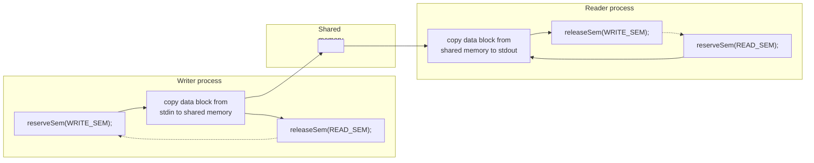

## Chương 48
# SHARED MEMORY SYSTEM V

Chương này mô tả shared memory của System V. Shared memory cho phép hai hoặc nhiều process chia sẻ cùng một vùng (thường được gọi là segment) bộ nhớ vật lý. Vì một shared memory segment trở thành một phần của vùng nhớ user-space của process, không cần sự can thiệp của kernel cho IPC. Tất cả những gì cần thiết là một process sao chép dữ liệu vào shared memory; dữ liệu đó ngay lập tức có thể truy cập được bởi tất cả các process khác chia sẻ cùng segment. Điều này cung cấp IPC nhanh so với các kỹ thuật như pipe hoặc message queue, trong đó process gửi sao chép dữ liệu từ buffer trong user space vào bộ nhớ kernel và process nhận sao chép theo chiều ngược lại. (Mỗi process cũng phải chịu chi phí overhead của một system call để thực hiện thao tác sao chép.)

Mặt khác, thực tế là IPC sử dụng shared memory không được kernel kiểm soát có nghĩa là thông thường cần một số phương pháp đồng bộ hóa để các process không truy cập đồng thời vào shared memory (ví dụ: hai process thực hiện cập nhật đồng thời, hoặc một process lấy dữ liệu từ shared memory trong khi process khác đang cập nhật nó). System V semaphore là phương pháp tự nhiên cho việc đồng bộ hóa như vậy. Các phương pháp khác, như POSIX semaphore (Chương 53) và file lock (Chương 55), cũng có thể dùng được.

> Trong thuật ngữ `mmap()`, một vùng bộ nhớ được ánh xạ tại một địa chỉ, trong khi trong thuật ngữ System V, một shared memory segment được gắn kết tại một địa chỉ. Các thuật ngữ này tương đương nhau; sự khác biệt về thuật ngữ là hệ quả từ nguồn gốc riêng biệt của hai API này.

## **48.1 Tổng quan**

Để sử dụng một shared memory segment, chúng ta thường thực hiện các bước sau:

-  Gọi `shmget()` để tạo một shared memory segment mới hoặc lấy định danh của một segment hiện có (nghĩa là segment được tạo bởi process khác). Lời gọi này trả về một shared memory identifier để sử dụng trong các lời gọi sau.
-  Sử dụng `shmat()` để gắn kết shared memory segment; nghĩa là làm cho segment trở thành một phần của virtual memory của process đang gọi.
-  Tại thời điểm này, shared memory segment có thể được xử lý giống như bất kỳ bộ nhớ nào khác có sẵn cho chương trình. Để tham chiếu đến shared memory, chương trình sử dụng giá trị `addr` được trả về bởi lời gọi `shmat()`, đó là một pointer đến đầu của shared memory segment trong virtual address space của process.
-  Gọi `shmdt()` để tháo gỡ shared memory segment. Sau lời gọi này, process không còn có thể tham chiếu đến shared memory. Bước này là tùy chọn và tự động xảy ra khi process kết thúc.
-  Gọi `shmctl()` để xóa shared memory segment. Segment sẽ chỉ bị hủy sau khi tất cả các process hiện đang gắn kết đã tháo gỡ nó. Chỉ một process cần thực hiện bước này.

## **48.2 Tạo hoặc Mở một Shared Memory Segment**

System call `shmget()` tạo một shared memory segment mới hoặc lấy định danh của một segment hiện có. Nội dung của một shared memory segment mới được khởi tạo bằng 0.

```
#include <sys/types.h> /* For portability */
#include <sys/shm.h>
int shmget(key_t key, size_t size, int shmflg);
          Returns shared memory segment identifier on success, or –1 on error
```

Đối số `key` là một key được tạo bằng một trong các phương pháp mô tả trong Mục 45.2 (nghĩa là thường là giá trị `IPC_PRIVATE` hoặc một key được trả về bởi `ftok()`).

Khi chúng ta sử dụng `shmget()` để tạo một shared memory segment mới, `size` chỉ định một số nguyên dương chỉ ra kích thước mong muốn của segment, tính bằng byte. Kernel phân bổ shared memory theo bội số của kích thước page của hệ thống, vì vậy `size` thực tế được làm tròn lên đến bội số tiếp theo của kích thước page của hệ thống. Nếu chúng ta đang sử dụng `shmget()` để lấy định danh của một segment hiện có, thì `size` không có ảnh hưởng gì đến segment, nhưng nó phải nhỏ hơn hoặc bằng kích thước của segment.

Đối số `shmflg` thực hiện cùng nhiệm vụ như với các lời gọi IPC get khác, chỉ định quyền (Bảng 15-4, trang 295) được đặt trên một shared memory segment mới hoặc được kiểm tra đối với một segment hiện có. Ngoài ra, không hoặc nhiều flag sau có thể được OR (`|`) vào `shmflg` để kiểm soát hoạt động của `shmget()`:

`IPC_CREAT`

Nếu không có segment nào với key được chỉ định tồn tại, hãy tạo một segment mới.

`IPC_EXCL`

Nếu `IPC_CREAT` cũng được chỉ định, và một segment với key được chỉ định đã tồn tại, hãy thất bại với lỗi `EEXIST`.

Các flag trên được mô tả chi tiết hơn trong Mục 45.1. Ngoài ra, Linux cho phép các flag không chuẩn sau:

```
SHM_HUGETLB (since Linux 2.6)
```

Một process có đặc quyền (`CAP_IPC_LOCK`) có thể sử dụng flag này để tạo một shared memory segment sử dụng huge page. Huge page là một tính năng được cung cấp bởi nhiều kiến trúc phần cứng hiện đại để quản lý bộ nhớ bằng cách sử dụng kích thước page rất lớn. (Ví dụ, x86-32 cho phép page 4-MB như một giải pháp thay thế cho page 4-kB.) Trên các hệ thống có lượng bộ nhớ lớn, và nơi các ứng dụng yêu cầu các khối bộ nhớ lớn, việc sử dụng huge page làm giảm số lượng mục nhập cần thiết trong translation look-aside buffer (TLB) của đơn vị quản lý bộ nhớ phần cứng. Điều này có lợi vì các mục nhập trong TLB thường là tài nguyên khan hiếm. Xem file nguồn kernel `Documentation/vm/hugetlbpage.txt` để biết thêm thông tin.

```
SHM_NORESERVE (since Linux 2.6.15)
```

Flag này phục vụ cùng mục đích cho `shmget()` như flag `MAP_NORESERVE` phục vụ cho `mmap()`. Xem Mục 49.9.

Khi thành công, `shmget()` trả về định danh cho shared memory segment mới hoặc hiện có.

# **48.3 Sử dụng Shared Memory**

System call `shmat()` gắn kết shared memory segment được xác định bởi `shmid` vào virtual address space của process đang gọi.

```
#include <sys/types.h> /* For portability */
#include <sys/shm.h>
void *shmat(int shmid, const void *shmaddr, int shmflg);
               Returns address at which shared memory is attached on success,
                                                        or (void *) –1 on error
```

Đối số `shmaddr` và việc thiết lập bit `SHM_RND` trong đối số bit-mask `shmflg` kiểm soát cách segment được gắn kết:

-  Nếu `shmaddr` là `NULL`, thì segment được gắn kết tại một địa chỉ phù hợp được chọn bởi kernel. Đây là phương pháp được ưu tiên để gắn kết một segment.
-  Nếu `shmaddr` không phải là `NULL`, và `SHM_RND` không được thiết lập, thì segment được gắn kết tại địa chỉ được chỉ định bởi `shmaddr`, phải là bội số của kích thước page của hệ thống (nếu không sẽ xảy ra lỗi `EINVAL`).
-  Nếu `shmaddr` không phải là `NULL`, và `SHM_RND` được thiết lập, thì segment được ánh xạ tại địa chỉ được cung cấp trong `shmaddr`, được làm tròn xuống bội số gần nhất của hằng số `SHMLBA` (shared memory low boundary address). Hằng số này bằng một bội số nào đó của kích thước page của hệ thống. Việc gắn kết một segment tại một địa chỉ là bội số của `SHMLBA` là cần thiết trên một số kiến trúc để cải thiện hiệu suất CPU cache và ngăn chặn khả năng các lần gắn kết khác nhau của cùng một segment có các view không nhất quán trong CPU cache.

> Trên kiến trúc x86, `SHMLBA` giống như kích thước page của hệ thống, phản ánh thực tế là sự không nhất quán về cache như vậy không thể xảy ra trên các kiến trúc đó.

Việc chỉ định giá trị không phải `NULL` cho `shmaddr` (nghĩa là tùy chọn thứ hai hoặc thứ ba được liệt kê ở trên) không được khuyến nghị, vì các lý do sau:

-  Nó làm giảm tính portability của ứng dụng. Một địa chỉ hợp lệ trên một cài đặt UNIX có thể không hợp lệ trên cài đặt khác.
-  Một lần thử gắn kết một shared memory segment tại một địa chỉ cụ thể sẽ thất bại nếu địa chỉ đó đã được sử dụng. Điều này có thể xảy ra nếu, ví dụ, ứng dụng (có thể bên trong một library function) đã gắn kết một segment khác hoặc tạo một memory mapping tại địa chỉ đó.

Là kết quả hàm của nó, `shmat()` trả về địa chỉ mà shared memory segment được gắn kết. Giá trị này có thể được xử lý như một con trỏ C bình thường; segment trông giống như bất kỳ phần nào khác của virtual memory của process. Thông thường, chúng ta gán giá trị trả về từ `shmat()` cho một pointer đến một cấu trúc do lập trình viên định nghĩa, để áp đặt cấu trúc đó lên segment (xem, ví dụ, Listing 48-2).

Để gắn kết một shared memory segment cho quyền truy cập chỉ đọc, chúng ta chỉ định flag `SHM_RDONLY` trong `shmflg`. Các lần thử cập nhật nội dung của một segment chỉ đọc dẫn đến segmentation fault (signal `SIGSEGV`). Nếu `SHM_RDONLY` không được chỉ định, bộ nhớ có thể được đọc và sửa đổi.

Để gắn kết một shared memory segment, một process cần có quyền đọc và ghi trên segment, trừ khi `SHM_RDONLY` được chỉ định, trong trường hợp đó chỉ cần quyền đọc.

> Có thể gắn kết cùng một shared memory segment nhiều lần trong một process, và thậm chí có thể làm cho một lần gắn kết chỉ đọc trong khi lần gắn kết khác đọc-ghi. Nội dung của bộ nhớ tại mỗi điểm gắn kết là như nhau, vì các mục nhập khác nhau của page table virtual memory của process đang tham chiếu đến cùng các page vật lý trong bộ nhớ.

Một giá trị cuối cùng có thể được chỉ định trong `shmflg` là `SHM_REMAP`. Trong trường hợp này, `shmaddr` phải không phải `NULL`. Flag này yêu cầu lời gọi `shmat()` thay thế bất kỳ shared memory attachment hoặc memory mapping hiện có nào trong phạm vi bắt đầu tại `shmaddr` và tiếp tục trong độ dài của shared memory segment. Thông thường, nếu chúng ta cố gắng gắn kết một shared memory segment tại một phạm vi địa chỉ đang được sử dụng, lỗi `EINVAL` sẽ xảy ra. `SHM_REMAP` là một phần mở rộng không chuẩn của Linux.

Bảng 48-1 tóm tắt các hằng số có thể được OR vào đối số `shmflg` của `shmat()`.

Khi một process không còn cần truy cập vào một shared memory segment, nó có thể gọi `shmdt()` để tháo gỡ segment khỏi virtual address space của nó. Đối số `shmaddr` xác định segment cần tháo gỡ. Nó phải là một giá trị được trả về bởi một lời gọi trước đó đến `shmat()`.

```
#include <sys/types.h> /* For portability */
#include <sys/shm.h>
int shmdt(const void *shmaddr);
                                           Returns 0 on success, or –1 on error
```

Việc tháo gỡ một shared memory segment không giống như việc xóa nó. Việc xóa được thực hiện bằng thao tác `IPC_RMID` của `shmctl()`, như mô tả trong Mục 48.7.

Một child được tạo bởi `fork()` kế thừa các shared memory segment đã gắn kết của parent. Do đó, shared memory cung cấp một phương pháp IPC dễ dàng giữa parent và child.

Trong quá trình `exec()`, tất cả các shared memory segment đã gắn kết sẽ bị tháo gỡ. Các shared memory segment cũng tự động bị tháo gỡ khi process kết thúc.

| Bảng 48-1: Giá trị bit-mask shmflg cho shmat() |  |  |
|------------------------------------------------|--|--|
|------------------------------------------------|--|--|

| Giá trị    | Mô tả                                          |
|------------|------------------------------------------------|
| `SHM_RDONLY` | Gắn kết segment chỉ đọc                      |
| `SHM_REMAP`  | Thay thế bất kỳ mapping hiện có tại shmaddr  |
| `SHM_RND`    | Làm tròn shmaddr xuống bội số của SHMLBA byte |

# **48.4 Ví dụ: Truyền Dữ liệu qua Shared Memory**

Chúng ta sẽ xem xét một ứng dụng ví dụ sử dụng System V shared memory và semaphore. Ứng dụng bao gồm hai chương trình: writer và reader. Writer đọc các khối dữ liệu từ standard input và sao chép ("ghi") chúng vào một shared memory segment. Reader sao chép ("đọc") các khối dữ liệu từ shared memory segment ra standard output. Về hiệu quả, các chương trình xử lý shared memory giống như một pipe.

Hai chương trình sử dụng một cặp System V semaphore trong một binary semaphore protocol (các hàm `initSemAvailable()`, `initSemInUse()`, `reserveSem()` và `releaseSem()` được định nghĩa trong Mục 47.9) để đảm bảo rằng:

-  chỉ một process truy cập shared memory segment tại một thời điểm; và
-  các process luân phiên trong việc truy cập segment (nghĩa là writer ghi một số dữ liệu, sau đó reader đọc dữ liệu, sau đó writer ghi lại, v.v.).

Hình 48-1 cung cấp tổng quan về việc sử dụng hai semaphore này. Lưu ý rằng writer khởi tạo hai semaphore sao cho nó là chương trình đầu tiên trong hai chương trình có thể truy cập vào shared memory segment; nghĩa là semaphore của writer ban đầu có sẵn, và semaphore của reader ban đầu đang được sử dụng.

Mã nguồn cho ứng dụng bao gồm ba file. File đầu tiên trong số này, Listing 48-1, là một header file được chia sẻ bởi các chương trình reader và writer. Header này định nghĩa cấu trúc `shmseg` mà chúng ta sử dụng để khai báo các pointer đến shared memory segment. Làm điều này cho phép chúng ta áp đặt một cấu trúc lên các byte của shared memory segment.



**Hình 48-1:** Sử dụng semaphore để đảm bảo quyền truy cập độc quyền, luân phiên vào shared memory

**Listing 48-1:** Header file cho svshm\_xfr\_writer.c và svshm\_xfr\_reader.c

```
–––––––––––––––––––––––––––––––––––––––––––––––––––––––– svshm/svshm_xfr.h
#include <sys/types.h>
#include <sys/stat.h>
#include <sys/sem.h>
#include <sys/shm.h>
#include "binary_sems.h" /* Declares our binary semaphore functions */
#include "tlpi_hdr.h"
#define SHM_KEY 0x1234 /* Key for shared memory segment */
#define SEM_KEY 0x5678 /* Key for semaphore set */
#define OBJ_PERMS (S_IRUSR | S_IWUSR | S_IRGRP | S_IWGRP)
 /* Permissions for our IPC objects */
#define WRITE_SEM 0 /* Writer has access to shared memory */
#define READ_SEM 1 /* Reader has access to shared memory */
#ifndef BUF_SIZE /* Allow "cc -D" to override definition */
#define BUF_SIZE 1024 /* Size of transfer buffer */
#endif
struct shmseg { /* Defines structure of shared memory segment */
 int cnt; /* Number of bytes used in 'buf' */
 char buf[BUF_SIZE]; /* Data being transferred */
};
–––––––––––––––––––––––––––––––––––––––––––––––––––––––– svshm/svshm_xfr.h
```

Listing 48-2 là chương trình writer. Chương trình này thực hiện các bước sau:

 Tạo một tập hợp chứa hai semaphore được sử dụng bởi chương trình writer và reader để đảm bảo rằng chúng luân phiên trong việc truy cập vào shared memory segment q. Các semaphore được khởi tạo sao cho writer có quyền truy cập đầu tiên vào shared memory segment. Vì writer tạo semaphore set, nó phải được khởi động trước reader.

-  Tạo shared memory segment và gắn kết nó vào virtual address space của writer tại một địa chỉ được chọn bởi hệ thống w.
-  Bước vào một vòng lặp truyền dữ liệu từ standard input đến shared memory segment e. Các bước sau được thực hiện trong mỗi lần lặp:
  - Dự trữ (giảm) semaphore của writer r.
  - Đọc dữ liệu từ standard input vào shared memory segment t.
  - Giải phóng (tăng) semaphore của reader y.
-  Vòng lặp kết thúc khi không còn dữ liệu nào từ standard input u. Trong lần cuối qua vòng lặp, writer chỉ ra cho reader biết rằng không còn dữ liệu nữa bằng cách truyền một khối dữ liệu có độ dài 0 (`shmp->cnt` là 0).
-  Sau khi thoát khỏi vòng lặp, writer một lần nữa dự trữ semaphore của mình, để biết rằng reader đã hoàn thành lần truy cập cuối cùng vào shared memory i. Writer sau đó xóa shared memory segment và semaphore set o.

Listing 48-3 là chương trình reader. Nó truyền các khối dữ liệu từ shared memory segment ra standard output. Reader thực hiện các bước sau:

-  Lấy các ID của semaphore set và shared memory segment được tạo bởi chương trình writer q.
-  Gắn kết shared memory segment cho quyền truy cập chỉ đọc w.
-  Bước vào một vòng lặp truyền dữ liệu từ shared memory segment e. Các bước sau được thực hiện trong mỗi lần lặp:
  - Dự trữ (giảm) semaphore của reader r.
  - Kiểm tra xem `shmp->cnt` có bằng 0 không; nếu vậy, thoát khỏi vòng lặp này t.
  - Ghi khối dữ liệu trong shared memory segment ra standard output y.
  - Giải phóng (tăng) semaphore của writer u.
-  Sau khi thoát khỏi vòng lặp, tháo gỡ shared memory segment i và giải phóng semaphore của writer o, để chương trình writer có thể xóa các đối tượng IPC.

**Listing 48-2:** Truyền các khối dữ liệu từ stdin đến một shared memory segment System V

```
–––––––––––––––––––––––––––––––––––––––––––––––– svshm/svshm_xfr_writer.c
  #include "semun.h" /* Definition of semun union */
  #include "svshm_xfr.h"
  int
  main(int argc, char *argv[])
  {
   int semid, shmid, bytes, xfrs;
   struct shmseg *shmp;
   union semun dummy;
q semid = semget(SEM_KEY, 2, IPC_CREAT | OBJ_PERMS);
   if (semid == -1)
   errExit("semget");
```

```
 if (initSemAvailable(semid, WRITE_SEM) == -1)
   errExit("initSemAvailable");
   if (initSemInUse(semid, READ_SEM) == -1)
   errExit("initSemInUse");
w shmid = shmget(SHM_KEY, sizeof(struct shmseg), IPC_CREAT | OBJ_PERMS);
   if (shmid == -1)
   errExit("shmget");
   shmp = shmat(shmid, NULL, 0);
   if (shmp == (void *) -1)
   errExit("shmat");
   /* Transfer blocks of data from stdin to shared memory */
e for (xfrs = 0, bytes = 0; ; xfrs++, bytes += shmp->cnt) {
r if (reserveSem(semid, WRITE_SEM) == -1) /* Wait for our turn */
   errExit("reserveSem");
t shmp->cnt = read(STDIN_FILENO, shmp->buf, BUF_SIZE);
   if (shmp->cnt == -1)
   errExit("read");
y if (releaseSem(semid, READ_SEM) == -1) /* Give reader a turn */
   errExit("releaseSem");
   /* Have we reached EOF? We test this after giving the reader
   a turn so that it can see the 0 value in shmp->cnt. */
u if (shmp->cnt == 0)
   break;
   }
   /* Wait until reader has let us have one more turn. We then know
   reader has finished, and so we can delete the IPC objects. */
i if (reserveSem(semid, WRITE_SEM) == -1)
   errExit("reserveSem");
o if (semctl(semid, 0, IPC_RMID, dummy) == -1)
   errExit("semctl");
   if (shmdt(shmp) == -1)
   errExit("shmdt");
   if (shmctl(shmid, IPC_RMID, 0) == -1)
   errExit("shmctl");
   fprintf(stderr, "Sent %d bytes (%d xfrs)\n", bytes, xfrs);
   exit(EXIT_SUCCESS);
  }
  –––––––––––––––––––––––––––––––––––––––––––––––––– svshm/svshm_xfr_writer.c
```

**Listing 48-3:** Truyền các khối dữ liệu từ shared memory segment System V ra stdout

```
–––––––––––––––––––––––––––––––––––––––––––––––––– svshm/svshm_xfr_reader.c
  #include "svshm_xfr.h"
  int
  main(int argc, char *argv[])
  {
   int semid, shmid, xfrs, bytes;
   struct shmseg *shmp;
   /* Get IDs for semaphore set and shared memory created by writer */
q semid = semget(SEM_KEY, 0, 0);
   if (semid == -1)
   errExit("semget");
   shmid = shmget(SHM_KEY, 0, 0);
   if (shmid == -1)
   errExit("shmget");
w shmp = shmat(shmid, NULL, SHM_RDONLY);
   if (shmp == (void *) -1)
   errExit("shmat");
   /* Transfer blocks of data from shared memory to stdout */
e for (xfrs = 0, bytes = 0; ; xfrs++) {
r if (reserveSem(semid, READ_SEM) == -1) /* Wait for our turn */
   errExit("reserveSem");
t if (shmp->cnt == 0) /* Writer encountered EOF */
   break;
   bytes += shmp->cnt;
y if (write(STDOUT_FILENO, shmp->buf, shmp->cnt) != shmp->cnt)
   fatal("partial/failed write");
u if (releaseSem(semid, WRITE_SEM) == -1) /* Give writer a turn */
   errExit("releaseSem");
   }
i if (shmdt(shmp) == -1)
   errExit("shmdt");
   /* Give writer one more turn, so it can clean up */
o if (releaseSem(semid, WRITE_SEM) == -1)
   errExit("releaseSem");
   fprintf(stderr, "Received %d bytes (%d xfrs)\n", bytes, xfrs);
   exit(EXIT_SUCCESS);
  }
  –––––––––––––––––––––––––––––––––––––––––––––––––– svshm/svshm_xfr_reader.c
```

Shell session sau đây minh họa việc sử dụng các chương trình trong Listing 48-2 và Listing 46-9. Chúng ta gọi writer, sử dụng file `/etc/services` làm đầu vào, và sau đó gọi reader, chuyển hướng đầu ra của nó đến một file khác:

```
$ wc -c /etc/services Display size of test file
764360 /etc/services
$ ./svshm_xfr_writer < /etc/services &
[1] 9403
$ ./svshm_xfr_reader > out.txt
Received 764360 bytes (747 xfrs) Message from reader
Sent 764360 bytes (747 xfrs) Message from writer
[1]+ Done ./svshm_xfr_writer < /etc/services
$ diff /etc/services out.txt
$
```

Lệnh `diff` không tạo ra đầu ra, cho thấy rằng file đầu ra được tạo bởi reader có cùng nội dung với file đầu vào được sử dụng bởi writer.

# **48.5 Vị trí của Shared Memory trong Virtual Memory**

Trong Mục 6.3, chúng ta đã xem xét bố cục của các phần khác nhau của một process trong virtual memory. Sẽ hữu ích khi xem lại chủ đề này trong bối cảnh gắn kết các shared memory segment của System V. Nếu chúng ta theo phương pháp được khuyến nghị là cho phép kernel chọn nơi gắn kết một shared memory segment, thì (trên kiến trúc x86-32) bố cục bộ nhớ sẽ xuất hiện như trong Hình 48-2, với segment được gắn kết trong không gian chưa được phân bổ giữa heap đang phát triển lên trên và stack đang phát triển xuống dưới. Để dành không gian cho việc phát triển heap và stack, các shared memory segment được gắn kết bắt đầu tại địa chỉ ảo `0x40000000`. Các mapped mapping (Chương 49) và shared library (Chương 41 và 42) cũng được đặt trong khu vực này. (Có một số biến thể trong vị trí mặc định mà shared memory mapping và memory segment được đặt, tùy thuộc vào phiên bản kernel và cài đặt của resource limit `RLIMIT_STACK` của process.)

> Địa chỉ `0x40000000` được định nghĩa là hằng số kernel `TASK_UNMAPPED_BASE`. Có thể thay đổi địa chỉ này bằng cách định nghĩa hằng số này với một giá trị khác và rebuild kernel.

> Một shared memory segment (hoặc memory mapping) có thể được đặt tại một địa chỉ dưới `TASK_UNMAPPED_BASE`, nếu chúng ta sử dụng phương pháp không được khuyến nghị là chỉ định rõ ràng một địa chỉ khi gọi `shmat()` (hoặc `mmap()`).

Sử dụng file `/proc/PID/maps` dành riêng cho Linux, chúng ta có thể xem vị trí của các shared memory segment và shared library được ánh xạ bởi một chương trình, như chúng ta minh họa trong shell session bên dưới.

> Bắt đầu với kernel 2.6.14, Linux cũng cung cấp file `/proc/PID/smaps`, cung cấp thêm thông tin về mức tiêu thụ bộ nhớ của mỗi mapping của process. Để biết thêm chi tiết, xem trang man `proc(5)`.

#### Địa chỉ virtual memory (hệ thập lục phân)

```text
Virtual memory address
    (hexadecimal)
                        ┌─────────────────────────────┐
    0xC0000000          │      argc, environ          │
                        ├─────────────────────────────┤
                        │          Stack              │
                        ├ ─ ─ ─ ─ ─ ─ ─ ─ ─ ─ ─ ─ ─ --┤◄── Top of
                        │            │                │    stack
                        │            ▼                │
                        │                             │
                        ├ ─ ─ ─ ─ ─ ─ ─ ─ ─ ─ ─ ─ ─ --┤
                        │                             │
                        │   Shared memory, memory     │
                        │   mappings, and shared      │
                        │   libraries placed here     │
                        │                             │
    0x40000000          ├─────────────────────────────┤
TASK_UNMAPPED_BASE      │                             │
                        │ Reserved for heap expansion │
        ▲               │                             │
        │               │            ▲                │
        │               ├ ─ ─ ─ ─ ─ ─│─ ─ ─ ─ ─ ─ ─ --┤◄── Program
        │               │                             │    break
Increasing virtual      │          Heap               │
addresses               ├─────────────────────────────┤
        │               │ Uninitialized data (bss)    │
        │               ├─────────────────────────────┤
        │               │    Initialized data         │
                        ├─────────────────────────────┤
    0x08048000          │   Text (program code)       │
                        ├─────────────────────────────┤
    0x00000000          │                             │
                        └─────────────────────────────┘
```

**Hình 48-2:** Vị trí của shared memory, memory mapping và shared library (x86-32)

Trong shell session dưới đây, chúng ta sử dụng ba chương trình không được hiển thị trong chương này, nhưng được cung cấp trong thư mục `svshm` trong phân phối mã nguồn của cuốn sách. Các chương trình này thực hiện các nhiệm vụ sau:

-  Chương trình `svshm_create.c` tạo một shared memory segment. Chương trình này nhận các tùy chọn dòng lệnh giống như các chương trình tương ứng mà chúng ta cung cấp cho message queue (Listing 46-1, trang 938) và semaphore, nhưng bao gồm một đối số bổ sung chỉ định kích thước của segment.
-  Chương trình `svshm_attach.c` gắn kết các shared memory segment được xác định bởi các đối số dòng lệnh của nó. Mỗi đối số trong số này là một cặp số được phân tách bằng dấu hai chấm bao gồm một shared memory identifier và một địa chỉ gắn kết. Chỉ định 0 cho địa chỉ gắn kết có nghĩa là hệ thống nên chọn địa chỉ. Chương trình hiển thị địa chỉ mà bộ nhớ thực sự được gắn kết. Để cung cấp thông tin, chương trình cũng hiển thị giá trị của hằng số `SHMLBA` và process ID của process đang chạy chương trình.
-  Chương trình `svshm_rm.c` xóa các shared memory segment được xác định bởi các đối số dòng lệnh của nó.

Chúng ta bắt đầu shell session bằng cách tạo hai shared memory segment (100 kB và 3200 kB về kích thước):

```
$ ./svshm_create -p 102400
9633796
$ ./svshm_create -p 3276800
9666565
$ ./svshm_create -p 102400
1015817
$ ./svshm_create -p 3276800
1048586
```

Sau đó chúng ta khởi động một chương trình gắn kết hai segment này tại các địa chỉ được chọn bởi kernel:

```
$ ./svshm_attach 9633796:0 9666565:0
SHMLBA = 4096 (0x1000), PID = 9903
1: 9633796:0 ==> 0xb7f0d000
2: 9666565:0 ==> 0xb7bed000
Sleeping 5 seconds
```

Đầu ra ở trên cho thấy các địa chỉ mà các segment được gắn kết. Trước khi chương trình hoàn thành việc ngủ, chúng ta tạm dừng nó, và sau đó kiểm tra nội dung của file `/proc/PID/maps` tương ứng:

```
Type Control-Z to suspend program
[1]+ Stopped ./svshm_attach 9633796:0 9666565:0
$ cat /proc/9903/maps
```

Đầu ra được tạo ra bởi lệnh `cat` được hiển thị trong Listing 48-4.

**Listing 48-4:** Ví dụ về nội dung của /proc/PID/maps

```
$ cat /proc/9903/maps
q 08048000-0804a000 r-xp 00000000 08:05 5526989 /home/mtk/svshm_attach
  0804a000-0804b000 r--p 00001000 08:05 5526989 /home/mtk/svshm_attach
  0804b000-0804c000 rw-p 00002000 08:05 5526989 /home/mtk/svshm_attach
w b7bed000-b7f0d000 rw-s 00000000 00:09 9666565 /SYSV00000000 (deleted)
  b7f0d000-b7f26000 rw-s 00000000 00:09 9633796 /SYSV00000000 (deleted)
  b7f26000-b7f27000 rw-p b7f26000 00:00 0
e b7f27000-b8064000 r-xp 00000000 08:06 122031 /lib/libc-2.8.so
  b8064000-b8066000 r--p 0013d000 08:06 122031 /lib/libc-2.8.so
  b8066000-b8067000 rw-p 0013f000 08:06 122031 /lib/libc-2.8.so
  b8067000-b806b000 rw-p b8067000 00:00 0
  b8082000-b8083000 rw-p b8082000 00:00 0
r b8083000-b809e000 r-xp 00000000 08:06 122125 /lib/ld-2.8.so
  b809e000-b809f000 r--p 0001a000 08:06 122125 /lib/ld-2.8.so
  b809f000-b80a0000 rw-p 0001b000 08:06 122125 /lib/ld-2.8.so
t bfd8a000-bfda0000 rw-p bffea000 00:00 0 [stack]
y ffffe000-fffff000 r-xp 00000000 00:00 0 [vdso]
```

Trong đầu ra từ `/proc/PID/maps` được hiển thị trong Listing 48-4, chúng ta có thể thấy những điều sau:

-  Ba dòng cho chương trình chính, `shm_attach`. Các dòng này tương ứng với text segment và data segment của chương trình q. Dòng thứ hai trong số này dành cho một page chỉ đọc chứa các string constant được sử dụng bởi chương trình.
-  Hai dòng cho các attached System V shared memory segment w.
-  Các dòng tương ứng với các segment cho hai shared library. Một trong số đó là thư viện C chuẩn (`libc-version.so`) e. Cái còn lại là dynamic linker (`ld-version.so`), mà chúng ta mô tả trong Mục 41.4.3 r.
-  Một dòng được gắn nhãn `[stack]`. Dòng này tương ứng với process stack t.
-  Một dòng chứa tag `[vdso]` y. Đây là một mục cho linux-gate virtual dynamic shared object (DSO). Mục này chỉ xuất hiện trong các kernel từ 2.6.12. Xem http://www.trilithium.com/johan/2005/08/linux-gate/ để biết thêm thông tin về mục này.

Các cột sau được hiển thị trong mỗi dòng của `/proc/PID/maps`, theo thứ tự từ trái sang phải:

- 1. Một cặp số được phân tách bằng dấu gạch ngang chỉ ra phạm vi địa chỉ ảo (theo hệ thập lục phân) mà memory segment được ánh xạ. Số thứ hai trong số này là địa chỉ của byte tiếp theo sau phần cuối của segment.
- 2. Bảo vệ và flag cho memory segment này. Ba chữ cái đầu tiên chỉ ra sự bảo vệ của segment: đọc (r), ghi (w) và thực thi (x). Một dấu gạch ngang (-) thay thế bất kỳ chữ cái nào trong số này chỉ ra rằng bảo vệ tương ứng bị vô hiệu hóa. Chữ cái cuối cùng chỉ ra mapping flag cho memory segment; nó là private (p) hoặc shared (s). Để giải thích các flag này, xem mô tả về các flag `MAP_PRIVATE` và `MAP_SHARED` trong Mục 49.2. (Một System V shared memory segment luôn được đánh dấu là shared.)
- 3. Offset thập lục phân (tính bằng byte) của segment trong file được ánh xạ tương ứng. Ý nghĩa của đây và hai cột tiếp theo sẽ trở nên rõ ràng hơn khi chúng ta mô tả system call `mmap()` trong Chương 49. Đối với một System V shared memory segment, offset luôn là 0.
- 4. Số thiết bị (ID major và minor) của thiết bị trên đó file được ánh xạ tương ứng nằm.
- 5. Số i-node của file được ánh xạ, hoặc, đối với System V shared memory segment, identifier của segment.
- 6. Tên file hoặc tag nhận dạng khác được liên kết với memory segment này. Đối với một System V shared memory segment, đây bao gồm chuỗi `SYSV` được nối với key `shmget()` của segment (được biểu thị theo hệ thập lục phân). Trong ví dụ này, `SYSV` được theo sau bởi các số 0 vì chúng ta đã tạo các segment bằng cách sử dụng key `IPC_PRIVATE` (có giá trị 0). Chuỗi `(deleted)` xuất hiện sau trường `SYSV` đối với một System V shared memory segment là một hiện tượng phụ của việc triển khai shared memory segment. Các segment như vậy được tạo dưới dạng các file được ánh xạ trong một file system tmpfs vô hình (Mục 14.10), và sau đó được unlink. Các anonymous memory mapping được chia sẻ được triển khai theo cách tương tự. (Chúng ta mô tả các file được ánh xạ và shared anonymous memory mapping trong Chương 49.)

## **48.6 Lưu trữ Pointer trong Shared Memory**

Mỗi process có thể sử dụng các shared library và memory mapping khác nhau, và có thể gắn kết các tập hợp shared memory segment khác nhau. Do đó, nếu chúng ta theo thực hành được khuyến nghị là cho phép kernel chọn nơi gắn kết một shared memory segment, segment có thể được gắn kết tại một địa chỉ khác nhau trong mỗi process. Vì lý do này, khi lưu trữ các tham chiếu bên trong một shared memory segment trỏ đến các địa chỉ khác trong segment, chúng ta nên sử dụng offset (tương đối), thay vì pointer (tuyệt đối).

Ví dụ, giả sử chúng ta có một shared memory segment có địa chỉ bắt đầu được trỏ đến bởi `baseaddr` (nghĩa là `baseaddr` là giá trị được trả về bởi `shmat()`). Hơn nữa, tại vị trí được trỏ đến bởi `p`, chúng ta muốn lưu trữ một pointer đến cùng vị trí như được trỏ đến bởi `target`, như được hiển thị trong Hình 48-3. Loại thao tác này sẽ điển hình nếu chúng ta đang xây dựng một danh sách liên kết hoặc một cây nhị phân trong segment. Thành ngữ C thông thường để thiết lập `*p` sẽ là:

```text
*p = target;          /* Place pointer in *p (WRONG!) */

Shared memory segment
              ┌─────────┐
              │         │
target ──────>│         │◄─┐
              │         │  │
              │         │  │
              │         │  │
p ───────────>│         │──┘
              │         │
              │         │
baseaddr ────>└─────────┘
```

**Hình 48-3:** Sử dụng pointer trong một shared memory segment

Vấn đề với đoạn code này là vị trí được trỏ đến bởi `target` có thể nằm ở một địa chỉ ảo khác khi shared memory segment được gắn kết trong một process khác, điều đó có nghĩa là giá trị được lưu trữ tại `*p` vô nghĩa trong process đó. Phương pháp đúng là lưu trữ một offset tại `*p`, như sau:

```
*p = (target - baseaddr); /* Place offset in *p */
```

Khi dereferencing các pointer như vậy, chúng ta đảo ngược bước trên:

```
target = baseaddr + *p; /* Interpret offset */
```

Ở đây, chúng ta giả định rằng trong mỗi process, `baseaddr` trỏ đến đầu của shared memory segment (nghĩa là nó là giá trị được trả về bởi `shmat()` trong mỗi process). Với giả định này, một giá trị offset được diễn giải đúng, bất kể shared memory segment được gắn kết ở đâu trong virtual address space của process.

Ngoài ra, nếu chúng ta đang liên kết một tập hợp các cấu trúc có kích thước cố định, chúng ta có thể cast shared memory segment (hoặc một phần của nó) dưới dạng mảng, và sau đó sử dụng các số chỉ mục làm "pointer" tham chiếu từ cấu trúc này sang cấu trúc khác.

# **48.7 Các Thao tác Kiểm soát Shared Memory**

System call `shmctl()` thực hiện một loạt các thao tác kiểm soát trên shared memory segment được xác định bởi `shmid`.

```
#include <sys/types.h> /* For portability */
#include <sys/shm.h>
int shmctl(int shmid, int cmd, struct shmid_ds *buf);
                                           Returns 0 on success, or –1 on error
```

Đối số `cmd` chỉ định thao tác kiểm soát cần thực hiện. Đối số `buf` được yêu cầu bởi các thao tác `IPC_STAT` và `IPC_SET` (được mô tả dưới đây), và nên được chỉ định là `NULL` cho các thao tác còn lại.

Trong phần còn lại của mục này, chúng ta mô tả các thao tác khác nhau có thể được chỉ định cho `cmd`.

## **Các thao tác kiểm soát chung**

Các thao tác sau giống như đối với các loại đối tượng IPC System V khác. Chi tiết thêm về các thao tác này, bao gồm các đặc quyền và quyền cần thiết bởi process đang gọi, được mô tả trong Mục 45.3.

`IPC_RMID`

Đánh dấu shared memory segment và cấu trúc dữ liệu `shmid_ds` liên quan của nó để xóa. Nếu không có process nào hiện đang gắn kết segment, việc xóa diễn ra ngay lập tức; nếu không, segment sẽ bị xóa sau khi tất cả các process đã tháo gỡ nó (nghĩa là khi giá trị của trường `shm_nattch` trong cấu trúc dữ liệu `shmid_ds` giảm xuống còn 0). Trong một số ứng dụng, chúng ta có thể đảm bảo rằng một shared memory segment được dọn dẹp gọn gàng khi ứng dụng kết thúc bằng cách đánh dấu nó để xóa ngay lập tức sau khi tất cả các process đã gắn kết nó vào virtual address space của chúng bằng `shmat()`. Điều này tương tự như việc unlink một file sau khi chúng ta đã mở nó.

Trên Linux, nếu một shared segment đã được đánh dấu để xóa bằng `IPC_RMID`, nhưng chưa bị xóa vì một số process vẫn còn gắn kết nó, thì một process khác có thể gắn kết segment đó. Tuy nhiên, hành vi này không portable: hầu hết các cài đặt UNIX ngăn chặn các lần gắn kết mới đến một segment được đánh dấu để xóa. (SUSv3 im lặng về hành vi nào nên xảy ra trong tình huống này.) Một số ứng dụng Linux đã phụ thuộc vào hành vi này, đó là lý do tại sao Linux không được thay đổi để khớp với các cài đặt UNIX khác.

`IPC_STAT`

Đặt một bản sao của cấu trúc dữ liệu `shmid_ds` liên quan với shared memory segment này vào buffer được trỏ đến bởi `buf`. (Chúng ta mô tả cấu trúc dữ liệu này trong Mục 48.8.)

`IPC_SET`

Cập nhật các trường được chọn của cấu trúc dữ liệu `shmid_ds` liên quan với shared memory segment này bằng cách sử dụng các giá trị trong buffer được trỏ đến bởi `buf`.

## **Khóa và mở khóa shared memory**

Một shared memory segment có thể được khóa vào RAM, để nó không bao giờ bị swap out. Điều này cung cấp một lợi ích về hiệu suất, vì, một khi mỗi page của segment đã có mặt trong bộ nhớ, một ứng dụng được đảm bảo không bao giờ bị trì hoãn bởi một page fault khi nó truy cập page. Có hai thao tác khóa `shmctl()`:

-  Thao tác `SHM_LOCK` khóa một shared memory segment vào bộ nhớ.
-  Thao tác `SHM_UNLOCK` mở khóa shared memory segment, cho phép nó được swap out.

Các thao tác này không được chỉ định bởi SUSv3, và chúng không được cung cấp trên tất cả các cài đặt UNIX.

Trong các phiên bản Linux trước 2.6.10, chỉ các process có đặc quyền (`CAP_IPC_LOCK`) mới có thể khóa một shared memory segment vào bộ nhớ. Kể từ Linux 2.6.10, một process không có đặc quyền có thể khóa và mở khóa một shared memory segment nếu effective user ID của nó khớp với user ID của chủ sở hữu hoặc người tạo segment và (trong trường hợp `SHM_LOCK`) process có resource limit `RLIMIT_MEMLOCK` đủ cao. Xem Mục 50.2 để biết chi tiết.

Việc khóa một shared memory segment không đảm bảo rằng tất cả các page của segment có mặt trong bộ nhớ khi hoàn thành lời gọi `shmctl()`. Thay vào đó, các page không có mặt được khóa riêng lẻ chỉ khi chúng được đưa vào bộ nhớ bởi các tham chiếu tiếp theo của các process đã gắn kết shared memory segment. Một khi được đưa vào, các page đó giữ nguyên trong bộ nhớ cho đến khi bị mở khóa sau đó, ngay cả khi tất cả các process tháo gỡ segment. (Nói cách khác, thao tác `SHM_LOCK` thiết lập một thuộc tính của shared memory segment, chứ không phải là một thuộc tính của process đang gọi.)

> Với "được đưa vào bộ nhớ", chúng ta có nghĩa là khi process tham chiếu đến page không có mặt trong bộ nhớ, một page fault xảy ra. Tại thời điểm này, nếu page nằm trong swap area, thì nó được tải lại vào bộ nhớ. Nếu page đang được tham chiếu lần đầu tiên, không có page nào tương ứng trong swap file. Do đó, kernel phân bổ một page mới của bộ nhớ vật lý và điều chỉnh các page table của process cũng như các cấu trúc dữ liệu bookkeeping cho shared memory segment.

Một phương pháp thay thế để khóa bộ nhớ, với ngữ nghĩa hơi khác, là sử dụng `mlock()`, mà chúng ta mô tả trong Mục 50.2.

# **48.8 Cấu trúc Dữ liệu Liên kết với Shared Memory**

Mỗi shared memory segment có một cấu trúc dữ liệu `shmid_ds` liên quan có dạng sau:

```
struct shmid_ds {
 struct ipc_perm shm_perm; /* Ownership and permissions */
 size_t shm_segsz; /* Size of segment in bytes */
 time_t shm_atime; /* Time of last shmat() */
 time_t shm_dtime; /* Time of last shmdt() */
 time_t shm_ctime; /* Time of last change */
 pid_t shm_cpid; /* PID of creator */
 pid_t shm_lpid; /* PID of last shmat() / shmdt() */
 shmatt_t shm_nattch; /* Number of currently attached processes */
};
```

SUSv3 yêu cầu tất cả các trường được hiển thị ở đây. Một số cài đặt UNIX khác bao gồm các trường không chuẩn bổ sung trong cấu trúc `shmid_ds`.

Các trường của cấu trúc `shmid_ds` được cập nhật ngầm bởi các system call shared memory khác nhau, và một số trường con nhất định của trường `shm_perm` có thể được cập nhật rõ ràng bằng cách sử dụng thao tác `IPC_SET` của `shmctl()`. Chi tiết như sau:

#### shm\_perm

Khi shared memory segment được tạo, các trường của substructure này được khởi tạo như mô tả trong Mục 45.3. Các trường con `uid`, `gid` và (9 bit thấp hơn của) `mode` có thể được cập nhật thông qua `IPC_SET`. Cũng như các permission bit thông thường, trường `shm_perm.mode` giữ hai flag bit-mask chỉ đọc. Cái đầu tiên trong số này, `SHM_DEST` (destroy), cho biết liệu segment có được đánh dấu để xóa (thông qua thao tác `IPC_RMID` của `shmctl()`) khi tất cả các process đã tháo gỡ nó khỏi địa chỉ space của chúng. Flag khác, `SHM_LOCKED`, cho biết liệu segment có bị khóa vào bộ nhớ vật lý (thông qua thao tác `SHM_LOCK` của `shmctl()`). Cả hai flag này đều không được chuẩn hóa trong SUSv3, và các tương đương chỉ xuất hiện trên một số ít cài đặt UNIX khác, trong một số trường hợp với tên khác.

#### shm\_segsz

Khi tạo shared memory segment, trường này được thiết lập theo kích thước được yêu cầu của segment tính bằng byte (nghĩa là theo giá trị của đối số `size` được chỉ định trong lời gọi đến `shmget()`). Như đã lưu ý trong Mục 48.2, shared memory được phân bổ theo đơn vị page, vì vậy kích thước thực tế của segment có thể lớn hơn giá trị này.

#### shm\_atime

Trường này được thiết lập bằng 0 khi shared memory segment được tạo, và được thiết lập theo thời gian hiện tại bất cứ khi nào một process gắn kết segment (`shmat()`). Trường này và các trường timestamp khác trong cấu trúc `shmid_ds` được gõ là `time_t`, và lưu trữ thời gian tính bằng giây kể từ Epoch.

#### shm\_dtime

Trường này được thiết lập bằng 0 khi shared memory segment được tạo, và được thiết lập theo thời gian hiện tại bất cứ khi nào một process tháo gỡ segment (`shmdt()`).

#### shm\_ctime

Trường này được thiết lập theo thời gian hiện tại khi segment được tạo, và trên mỗi thao tác `IPC_SET` thành công.

#### shm\_cpid

Trường này được thiết lập theo process ID của process đã tạo segment bằng `shmget()`.

#### shm\_lpid

Trường này được thiết lập bằng 0 khi shared memory segment được tạo, và sau đó được thiết lập theo process ID của process đang gọi trên mỗi lần `shmat()` hoặc `shmdt()` thành công.

`shm_nattch`

Trường này đếm số lượng process hiện đang có segment được gắn kết. Nó được khởi tạo bằng 0 khi segment được tạo, và sau đó được tăng lên bởi mỗi `shmat()` thành công và giảm đi bởi mỗi `shmdt()` thành công. Kiểu dữ liệu `shmatt_t` được sử dụng để định nghĩa trường này là một kiểu số nguyên không dấu mà SUSv3 yêu cầu phải có kích thước ít nhất là `unsigned short`. (Trên Linux, kiểu này được định nghĩa là `unsigned long`.)

# **48.9 Giới hạn Shared Memory**

Hầu hết các cài đặt UNIX áp đặt các giới hạn khác nhau trên System V shared memory. Dưới đây là danh sách các giới hạn shared memory của Linux. System call bị ảnh hưởng bởi giới hạn và lỗi xảy ra nếu đạt đến giới hạn được ghi trong ngoặc đơn.

`SHMMNI`

Đây là giới hạn trên toàn hệ thống về số lượng shared memory identifier (nói cách khác, shared memory segment) có thể được tạo. (`shmget()`, `ENOSPC`)

`SHMMIN`

Đây là kích thước tối thiểu (tính bằng byte) của một shared memory segment. Giới hạn này được định nghĩa với giá trị 1 (giá trị này không thể thay đổi). Tuy nhiên, giới hạn thực tế là kích thước page của hệ thống. (`shmget()`, `EINVAL`)

`SHMMAX`

Đây là kích thước tối đa (tính bằng byte) của một shared memory segment. Giới hạn thực tế trên cho `SHMMAX` phụ thuộc vào RAM có sẵn và swap space. (`shmget()`, `EINVAL`)

`SHMALL`

Đây là giới hạn trên toàn hệ thống về tổng số page của shared memory. Hầu hết các cài đặt UNIX khác không cung cấp giới hạn này. Giới hạn thực tế trên cho `SHMALL` phụ thuộc vào RAM có sẵn và swap space. (`shmget()`, `ENOSPC`)

Một số cài đặt UNIX khác cũng áp đặt giới hạn sau (không được triển khai trên Linux):

`SHMSEG`

Đây là giới hạn trên mỗi process về số lượng shared memory segment được gắn kết.

Khi khởi động hệ thống, các giới hạn shared memory được thiết lập theo các giá trị mặc định. (Các giá trị mặc định này có thể thay đổi giữa các phiên bản kernel, và một số kernel của các nhà phân phối đặt các giá trị mặc định khác so với những kernel vanilla.) Trên Linux, một số giới hạn có thể được xem hoặc thay đổi thông qua các file trong file system `/proc`. Bảng 48-2 liệt kê file `/proc` tương ứng với mỗi giới hạn. Ví dụ, đây là các giới hạn mặc định mà chúng ta thấy cho Linux 2.6.31 trên một hệ thống x86-32:

\$ **cd /proc/sys/kernel** \$ **cat shmmni** 4096

```
$ cat shmmax
33554432
$ cat shmall
2097152
```

Thao tác `IPC_INFO` của `shmctl()` dành riêng cho Linux lấy một cấu trúc kiểu `shminfo`, chứa các giá trị của các giới hạn shared memory khác nhau:

```
struct shminfo buf;
shmctl(0, IPC_INFO, (struct shmid_ds *) &buf);
```

Một thao tác liên quan dành riêng cho Linux, `SHM_INFO`, lấy một cấu trúc kiểu `shm_info` chứa thông tin về các tài nguyên thực tế được sử dụng cho các đối tượng shared memory. Một ví dụ về việc sử dụng `SHM_INFO` được cung cấp trong file `svshm/svshm_info.c` trong phân phối mã nguồn của cuốn sách.

Chi tiết về `IPC_INFO`, `SHM_INFO` và các cấu trúc `shminfo` và `shm_info` có thể tìm thấy trong trang man `shmctl(2)`.

| Giới hạn | Giá trị trần (x86-32)       | File tương ứng<br>trong /proc/sys/kernel |
|----------|-----------------------------|------------------------------------------|
| `SHMMNI` | 32768 (IPCMNI)              | shmmni                                   |
| `SHMMAX` | Phụ thuộc vào bộ nhớ có sẵn | shmmax                                   |
| `SHMALL` | Phụ thuộc vào bộ nhớ có sẵn | shmall                                   |

**Bảng 48-2:** Giới hạn shared memory System V

# **48.10 Tóm tắt**

Shared memory cho phép hai hoặc nhiều process chia sẻ cùng các page bộ nhớ. Không cần sự can thiệp của kernel để trao đổi dữ liệu qua shared memory. Sau khi một process đã sao chép dữ liệu vào một shared memory segment, dữ liệu đó ngay lập tức hiển thị với các process khác. Shared memory cung cấp IPC nhanh, mặc dù ưu thế về tốc độ này bị bù đắp một phần bởi thực tế là thông thường chúng ta phải sử dụng một số loại kỹ thuật đồng bộ hóa, chẳng hạn như System V semaphore, để đồng bộ hóa quyền truy cập vào shared memory.

Phương pháp được khuyến nghị khi gắn kết một shared memory segment là cho phép kernel chọn địa chỉ mà segment được gắn kết trong virtual address space của process. Điều này có nghĩa là segment có thể nằm ở các địa chỉ ảo khác nhau trong các process khác nhau. Vì lý do này, bất kỳ tham chiếu nào đến các địa chỉ trong segment nên được duy trì dưới dạng offset tương đối, thay vì pointer tuyệt đối.

### **Thông tin thêm**

Sơ đồ quản lý bộ nhớ Linux và một số chi tiết về việc triển khai shared memory được mô tả trong [Bovet & Cesati, 2005].

## **48.11 Bài tập**

- **48-1.** Thay thế việc sử dụng binary semaphore trong Listing 48-2 (svshm\_xfr\_writer.c) và Listing 48-3 (svshm\_xfr\_reader.c) bằng việc sử dụng event flag (Bài tập 47-5).
- **48-2.** Giải thích tại sao chương trình trong Listing 48-3 báo cáo số byte được truyền không chính xác nếu vòng lặp `for` được sửa đổi như sau:

```
for (xfrs = 0, bytes = 0; shmp->cnt != 0; xfrs++, bytes += shmp->cnt) {
 reserveSem(semid, READ_SEM); /* Wait for our turn */
 if (write(STDOUT_FILENO, shmp->buf, shmp->cnt) != shmp->cnt)
 fatal("write");
 releaseSem(semid, WRITE_SEM); /* Give writer a turn */
}
```

- **48-3.** Thử biên dịch các chương trình trong Listing 48-2 (svshm\_xfr\_writer.c) và Listing 48-3 (svshm\_xfr\_reader.c) với một loạt các kích thước khác nhau (được xác định bởi hằng số `BUF_SIZE`) cho buffer được sử dụng để trao đổi dữ liệu giữa hai chương trình. Đo thời gian thực thi của `svshm_xfr_reader.c` cho mỗi kích thước buffer.
- **48-4.** Viết một chương trình hiển thị nội dung của cấu trúc dữ liệu `shmid_ds` (Mục 48.8) liên kết với một shared memory segment. Identifier của segment nên được chỉ định như một đối số dòng lệnh. (Xem chương trình trong Listing 47-3, trang 973, thực hiện nhiệm vụ tương tự cho System V semaphore.)
- **48-5.** Viết một directory service sử dụng một shared memory segment để publish các cặp name-value. Bạn cần cung cấp một API cho phép các caller tạo một tên mới, sửa đổi một tên hiện có, xóa một tên hiện có và lấy giá trị liên kết với một tên. Sử dụng semaphore để đảm bảo rằng một process thực hiện cập nhật vào shared memory segment có quyền truy cập độc quyền vào segment.
- **48-6.** Viết một chương trình (tương tự như chương trình trong Listing 46-6, trang 953) sử dụng các thao tác `SHM_INFO` và `SHM_STAT` của `shmctl()` để lấy và hiển thị danh sách tất cả các shared memory segment trên hệ thống.
