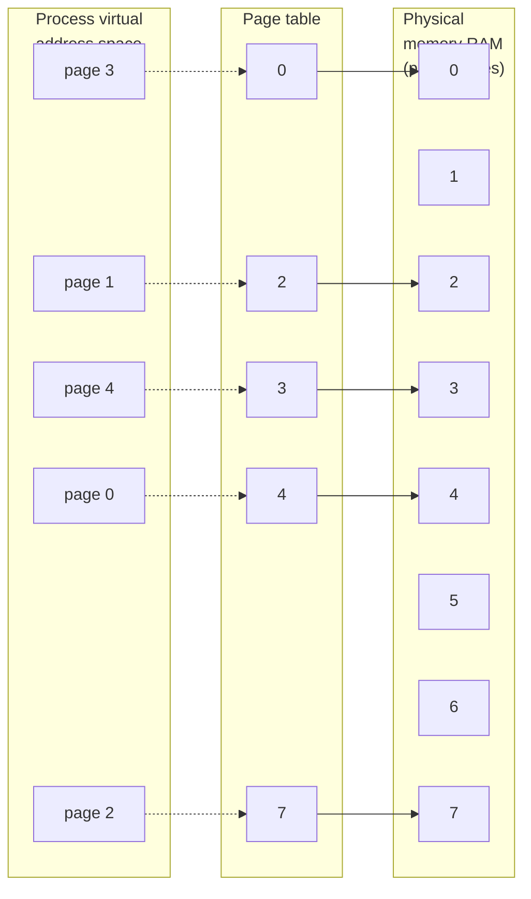

## Chương 6
# **PROCESS**

Trong chương này, chúng ta xem xét cấu trúc của một process, đặc biệt chú ý đến bố cục và nội dung của virtual memory trong một process. Chúng ta cũng khám phá một số thuộc tính của process. Trong các chương sau, chúng ta xem xét thêm các thuộc tính của process (ví dụ: thông tin xác thực process trong Chương 9, và mức độ ưu tiên cũng như lịch trình của process trong Chương 35). Trong các Chương 24 đến 27, chúng ta xem xét cách các process được tạo ra, cách chúng kết thúc, và cách chúng có thể được yêu cầu thực thi các chương trình mới.

## **6.1 Process và Program**

Một process là một instance của một chương trình đang được thực thi. Trong phần này, chúng ta mở rộng định nghĩa này và làm rõ sự khác biệt giữa một program và một process.

Một program là một file chứa nhiều thông tin mô tả cách tạo ra một process tại thời điểm chạy. Thông tin này bao gồm:

 Nhận dạng định dạng nhị phân: Mỗi file program bao gồm thông tin meta mô tả định dạng của file thực thi. Điều này cho phép kernel diễn giải phần thông tin còn lại trong file. Theo lịch sử, hai định dạng được sử dụng rộng rãi cho các file thực thi UNIX là định dạng a.out ("assembler output") gốc và định dạng COFF (Common Object File Format) phức tạp hơn ra đời sau. Ngày nay, hầu hết các implementation UNIX (bao gồm Linux) sử dụng Executable and Linking Format (ELF), cung cấp nhiều ưu điểm hơn so với các định dạng cũ hơn.

-  Các lệnh ngôn ngữ máy: Những lệnh này mã hóa thuật toán của chương trình.
-  Địa chỉ điểm vào chương trình: Xác định vị trí của lệnh mà tại đó việc thực thi chương trình sẽ bắt đầu.
-  Dữ liệu: File program chứa các giá trị dùng để khởi tạo các biến và cũng chứa các hằng số literal được sử dụng bởi chương trình (ví dụ: chuỗi ký tự).
-  Bảng symbol và relocation: Mô tả vị trí và tên của các hàm và biến trong chương trình. Các bảng này được sử dụng cho nhiều mục đích, bao gồm debug và phân giải symbol tại thời điểm chạy (dynamic linking).
-  Thông tin shared-library và dynamic-linking: File program bao gồm các trường liệt kê các shared library mà chương trình cần sử dụng tại thời điểm chạy và đường dẫn của dynamic linker dùng để tải các library này.
-  Thông tin khác: File program chứa nhiều thông tin khác mô tả cách tạo ra một process.

Một program có thể được dùng để tạo ra nhiều process, hay ngược lại, nhiều process có thể đang chạy cùng một program.

Chúng ta có thể diễn đạt lại định nghĩa về process đã nêu ở đầu phần này như sau: một process là một thực thể trừu tượng, được định nghĩa bởi kernel, mà các tài nguyên hệ thống được cấp phát để thực thi một chương trình.

Từ góc độ của kernel, một process bao gồm user-space memory chứa mã nguồn chương trình và các biến được sử dụng bởi mã đó, cùng với một loạt cấu trúc dữ liệu kernel duy trì thông tin về trạng thái của process. Thông tin được ghi lại trong các cấu trúc dữ liệu kernel bao gồm các số định danh (ID) khác nhau liên quan đến process, bảng virtual memory, bảng open file descriptor, thông tin liên quan đến việc chuyển giao và xử lý signal, mức sử dụng tài nguyên và giới hạn của process, thư mục làm việc hiện tại, và nhiều thông tin khác.

# **6.2 Process ID và Parent Process ID**

Mỗi process có một process ID (PID), là một số nguyên dương xác định duy nhất process trên hệ thống. Process ID được sử dụng và trả về bởi nhiều system call. Ví dụ, system call `kill()` (Phần 20.5) cho phép người gọi gửi signal đến một process với process ID cụ thể. Process ID cũng hữu ích nếu chúng ta cần xây dựng một định danh là duy nhất cho một process. Một ví dụ phổ biến là sử dụng process ID như một phần của tên file duy nhất cho một process.

System call `getpid()` trả về process ID của process gọi.

```
#include <unistd.h>
pid_t getpid(void);
                                  Luôn trả về thành công process ID của người gọi
```

Kiểu dữ liệu `pid_t` được dùng cho giá trị trả về của `getpid()` là một kiểu số nguyên được SUSv3 chỉ định cho mục đích lưu trữ process ID.

Ngoại trừ một vài process hệ thống như init (process ID 1), không có mối quan hệ cố định nào giữa một program và process ID của process được tạo ra để chạy program đó.

Kernel Linux giới hạn process ID ở mức nhỏ hơn hoặc bằng 32.767. Khi một process mới được tạo, nó được gán process ID tuần tự tiếp theo có sẵn. Mỗi khi đạt giới hạn 32.767, kernel đặt lại bộ đếm process ID để process ID được gán bắt đầu từ các giá trị số nguyên nhỏ.

> Khi đã đạt 32.767, bộ đếm process ID được đặt lại về 300, thay vì 1. Điều này là do nhiều process ID số nhỏ đang được sử dụng vĩnh viễn bởi các process hệ thống và daemon, và do đó sẽ tốn thời gian để tìm kiếm một process ID chưa được sử dụng trong phạm vi này.

> Trong Linux 2.4 và trước đó, giới hạn process ID là 32.767 được định nghĩa bởi hằng số kernel `PID_MAX`. Với Linux 2.6, mọi thứ thay đổi. Trong khi giới hạn mặc định cho process ID vẫn là 32.767, giới hạn này có thể điều chỉnh thông qua giá trị trong file Linux-specific `/proc/sys/kernel/pid_max` (bằng process ID tối đa cộng thêm 1). Trên các nền tảng 32-bit, giá trị tối đa cho file này là 32.768, nhưng trên các nền tảng 64-bit, nó có thể được điều chỉnh đến bất kỳ giá trị nào lên đến 2^22 (khoảng 4 triệu), giúp có thể chứa số lượng process rất lớn.

Mỗi process có một parent — process đã tạo ra nó. Một process có thể tìm ra process ID của parent bằng cách sử dụng system call `getppid()`.

```
#include <unistd.h>
pid_t getppid(void);
                        Luôn trả về thành công process ID của parent của người gọi
```

Thực tế, thuộc tính parent process ID của mỗi process thể hiện mối quan hệ dạng cây của tất cả các process trên hệ thống. Parent của mỗi process có parent riêng của nó, cứ thế cho đến khi trở về process 1, init, tổ tiên của tất cả các process. ("Cây gia đình" này có thể được xem bằng lệnh `pstree(1)`.)

Nếu một child process trở thành mồ côi vì parent "sinh ra" nó kết thúc, thì child đó được init nhận làm cha, và các lần gọi `getppid()` tiếp theo trong child sẽ trả về 1 (xem Phần 26.2).

Parent của bất kỳ process nào có thể được tìm thấy bằng cách xem trường Ppid được cung cấp trong file Linux-specific `/proc/PID/status`.

## **6.3 Bố cục Bộ nhớ của một Process**

Bộ nhớ được cấp phát cho mỗi process gồm nhiều phần, thường được gọi là các segment. Các segment này như sau:

 Text segment chứa các lệnh ngôn ngữ máy của chương trình được chạy bởi process. Text segment được đặt là chỉ đọc để process không vô tình sửa đổi lệnh của chính nó thông qua một giá trị pointer sai. Vì nhiều process có thể đang chạy cùng một chương trình, text segment được đặt là có thể chia sẻ để một bản sao duy nhất của mã chương trình có thể được ánh xạ vào không gian địa chỉ ảo của tất cả các process.

-  Initialized data segment chứa các biến global và static được khởi tạo rõ ràng. Các giá trị của các biến này được đọc từ file thực thi khi chương trình được tải vào bộ nhớ.
-  Uninitialized data segment chứa các biến global và static không được khởi tạo rõ ràng. Trước khi bắt đầu chương trình, hệ thống khởi tạo tất cả bộ nhớ trong segment này về 0. Vì lý do lịch sử, segment này thường được gọi là bss segment, một tên xuất phát từ một mnemonic của assembler cũ có nghĩa là "block started by symbol". Lý do chính để đặt các biến global và static được khởi tạo vào một segment riêng biệt với các biến không được khởi tạo là, khi một chương trình được lưu trữ trên đĩa, không cần thiết phải cấp phát không gian cho dữ liệu không được khởi tạo. Thay vào đó, file thực thi chỉ cần ghi lại vị trí và kích thước cần thiết cho uninitialized data segment, và không gian này được cấp phát bởi program loader tại thời điểm chạy.
-  Stack là một segment tăng trưởng và thu hẹp động chứa các stack frame. Một stack frame được cấp phát cho mỗi hàm hiện đang được gọi. Một frame lưu trữ các biến cục bộ của hàm (được gọi là automatic variables), các đối số, và giá trị trả về. Stack frame được thảo luận chi tiết hơn trong Phần 6.5.
-  Heap là một vùng từ đó bộ nhớ (cho các biến) có thể được cấp phát động tại thời điểm chạy. Điểm cuối trên cùng của heap được gọi là program break.

Ít phổ biến hơn nhưng mô tả chính xác hơn là các nhãn cho initialized và uninitialized data segment là user-initialized data segment và zero-initialized data segment.

Lệnh `size(1)` hiển thị kích thước của các segment text, initialized data, và uninitialized data (bss) của một file thực thi nhị phân.

> Thuật ngữ segment như được sử dụng trong văn bản chính không nên bị nhầm lẫn với hardware segmentation được sử dụng trên một số kiến trúc phần cứng như x86-32. Thay vào đó, các segment là những phân chia logic của virtual memory của process trên các hệ thống UNIX. Đôi khi, thuật ngữ section được dùng thay vì segment, vì section nhất quán hơn với thuật ngữ được sử dụng trong đặc tả ELF cho các định dạng file thực thi hiện nay.

> Ở nhiều nơi trong cuốn sách này, chúng ta lưu ý rằng một library function trả về một pointer đến bộ nhớ được cấp phát tĩnh. Ý nghĩa của điều này là bộ nhớ được cấp phát trong initialized hoặc uninitialized data segment. Điều quan trọng cần nhận thức là các trường hợp một library function trả về thông tin qua bộ nhớ được cấp phát tĩnh, vì bộ nhớ đó tồn tại độc lập với lần gọi hàm và bộ nhớ có thể bị ghi đè bởi các lần gọi tiếp theo đến cùng một hàm (hoặc trong một số trường hợp, bởi các lần gọi tiếp theo đến các hàm liên quan). Tác động của việc sử dụng bộ nhớ được cấp phát tĩnh là làm cho hàm không thể tái nhập. Chúng ta sẽ nói thêm về reentrancy trong các Phần 21.1.2 và 31.1.

Listing 6-1 hiển thị các loại biến C khác nhau cùng với các nhận xét cho biết trong segment nào mỗi biến nằm. Các nhận xét này giả định một compiler không tối ưu hóa và một application binary interface trong đó tất cả các đối số được truyền trên stack. Trong thực tế, một compiler tối ưu hóa có thể cấp phát các biến được sử dụng thường xuyên trong các thanh ghi, hoặc tối ưu hóa một biến đến mức nó không còn tồn tại. Hơn nữa, một số ABI yêu cầu các đối số hàm và kết quả hàm được truyền qua các thanh ghi, thay vì trên stack. Tuy nhiên, ví dụ này dùng để minh họa việc ánh xạ giữa các biến C và các segment của một process.

**Listing 6-1:** Vị trí của các biến chương trình trong các segment bộ nhớ của process

––––––––––––––––––––––––––––––––––––––––––––––––––––––– **proc/mem\_segments.c** #include <stdio.h> #include <stdlib.h> char globBuf[65536]; /\* Uninitialized data segment \*/ int primes[] = { 2, 3, 5, 7 }; /\* Initialized data segment \*/ static int square(int x) /\* Allocated in frame for square() \*/ { int result; /\* Allocated in frame for square() \*/ result = x \* x; return result; /\* Return value passed via register \*/ } static void doCalc(int val) /\* Allocated in frame for doCalc() \*/ { printf("The square of %d is %d\n", val, square(val)); if (val < 1000) { int t; /\* Allocated in frame for doCalc() \*/ t = val \* val \* val; printf("The cube of %d is %d\n", val, t); } } int main(int argc, char \*argv[]) /\* Allocated in frame for main() \*/ { static int key = 9973; /\* Initialized data segment \*/ static char mbuf[10240000]; /\* Uninitialized data segment \*/ char \*p; /\* Allocated in frame for main() \*/ p = malloc(1024); /\* Points to memory in heap segment \*/ doCalc(key); exit(EXIT\_SUCCESS); }

––––––––––––––––––––––––––––––––––––––––––––––––––––––– **proc/mem\_segments.c**

Một application binary interface (ABI) là một tập hợp các quy tắc chỉ định cách một file thực thi nhị phân nên trao đổi thông tin với một số dịch vụ (ví dụ: kernel hoặc một library) tại thời điểm chạy. Trong số những thứ khác, một ABI chỉ định thanh ghi và vị trí stack nào được dùng để trao đổi thông tin này, và ý nghĩa gắn liền với các giá trị được trao đổi. Sau khi được biên dịch cho một ABI cụ thể, một file thực thi nhị phân phải có khả năng chạy trên bất kỳ hệ thống nào cung cấp cùng ABI. Điều này trái ngược với API chuẩn hóa (như SUSv3), đảm bảo tính di động chỉ cho các ứng dụng được biên dịch từ mã nguồn.

Mặc dù không được quy định trong SUSv3, môi trường chương trình C trên hầu hết các implementation UNIX (bao gồm Linux) cung cấp ba symbol global: `etext`, `edata`, và `end`. Các symbol này có thể được sử dụng từ bên trong một chương trình để lấy địa chỉ của byte tiếp theo qua, tương ứng, cuối text của chương trình, cuối initialized data segment, và cuối uninitialized data segment. Để sử dụng các symbol này, chúng ta phải khai báo chúng một cách rõ ràng, như sau:

```
extern char etext, edata, end;
 /* Ví dụ, &etext cho địa chỉ của cuối
 text chương trình / đầu initialized data */
```

Hình 6-1 hiển thị bố cục của các segment bộ nhớ khác nhau trên kiến trúc x86-32. Không gian được đánh nhãn argv, environ ở đầu sơ đồ này chứa các đối số dòng lệnh của chương trình (có sẵn trong C thông qua đối số argv của hàm `main()`) và danh sách môi trường của process (sẽ được thảo luận sớm thôi). Các địa chỉ thập lục phân được hiển thị trong sơ đồ có thể thay đổi, tùy thuộc vào cấu hình kernel và các tùy chọn liên kết chương trình. Các vùng tô xám đại diện cho các phạm vi không hợp lệ trong không gian địa chỉ ảo của process; nghĩa là, các vùng mà page table chưa được tạo (xem phần thảo luận tiếp theo về quản lý virtual memory).

Chúng ta xem xét lại chủ đề về bố cục bộ nhớ của process chi tiết hơn một chút trong Phần 48.5, nơi chúng ta xem xét vị trí của shared memory và shared library trong virtual memory của process.

## **6.4 Quản lý Virtual Memory**

Phần thảo luận trước về bố cục bộ nhớ của process đã bỏ qua thực tế rằng chúng ta đang nói về bố cục trong virtual memory. Vì hiểu về virtual memory hữu ích sau này khi chúng ta xem xét các chủ đề như system call `fork()`, shared memory, và các file được ánh xạ, chúng ta bây giờ xem xét một số chi tiết.

Giống như hầu hết các kernel hiện đại, Linux sử dụng một kỹ thuật gọi là quản lý virtual memory. Mục đích của kỹ thuật này là sử dụng hiệu quả cả CPU và RAM (physical memory) bằng cách khai thác một đặc tính điển hình của hầu hết các chương trình: locality of reference. Hầu hết các chương trình thể hiện hai loại locality:

-  Spatial locality là xu hướng của một chương trình tham chiếu các địa chỉ bộ nhớ gần với những địa chỉ được truy cập gần đây (vì việc xử lý tuần tự các lệnh, và đôi khi, xử lý tuần tự các cấu trúc dữ liệu).
-  Temporal locality là xu hướng của một chương trình truy cập cùng các địa chỉ bộ nhớ trong tương lai gần mà nó đã truy cập trong quá khứ gần đây (vì các vòng lặp).

```text
Virtual memory address
    (hexadecimal)
                        ┌─────────────────────────────────┐
                        │          Kernel                 │  /proc/kallsyms
                        │  (mapped into process           │  provides addresses of
                        │   virtual memory, but not       │◄─kernel symbols in this
                        │   accessible to program)        │  region (/proc/ksyms in
    0xC0000000          ├─────────────────────────────────┤  kernel 2.4 and earlier)
                        │       argc, environ             │
                        ├─────────────────────────────────┤
                        │          Stack                  │
                        │     (grows downwards)           │
    Top of      ───────>├ ─ ─ ─ ─ ─ ─ ─ ─ ─ ─ ─ ─ ─ ─ ─ --┤
    stack               │             │                   │
                        │             ▼                   │
                        │                                 │
                        │    (unallocated memory)         │
                        │                                 │
                        │             ▲                   │
                        │             │                   │
    Program     ───────>├ ─ ─ ─ ─ ─ ─ ─ ─ ─ ─ ─ ─ ─ ─ ─ --┤
    break               │          Heap                   │
        ▲               │     (grows upwards)             │
        │               ├─────────────────────────────────┤◄─── &end
        │               │  Uninitialized data (bss)       │
        │               ├─────────────────────────────────┤◄─── &edata
Increasing virtual      │     Initialized data            │
addresses               ├─────────────────────────────────┤◄─── &etext
        │               │    Text (program code)          │
        │               │                                 │
                        ├─────────────────────────────────┤
    0x08048000          │                                 │
                        │                                 │
    0x00000000          └─────────────────────────────────┘
```

**Hình 6-1:** Bố cục bộ nhớ điển hình của một process trên Linux/x86-32

Kết quả của locality of reference là có thể thực thi một chương trình trong khi chỉ duy trì một phần không gian địa chỉ của nó trong RAM.

Một sơ đồ virtual memory chia bộ nhớ được sử dụng bởi mỗi chương trình thành các đơn vị nhỏ, kích thước cố định gọi là page. Tương ứng, RAM được chia thành một loạt page frame cùng kích thước. Tại bất kỳ thời điểm nào, chỉ một số page của chương trình cần có mặt trong các page frame physical memory; các page này tạo thành cái gọi là resident set. Các bản sao của các page không được sử dụng của chương trình được duy trì trong swap area — một khu vực đĩa được dành riêng để bổ sung RAM của máy tính — và được tải vào physical memory chỉ khi cần. Khi một process tham chiếu đến một page không hiện có trong physical memory, một page fault xảy ra, tại đó kernel tạm dừng thực thi process trong khi page được tải từ đĩa vào bộ nhớ.

> Trên x86-32, các page có kích thước 4096 byte. Một số implementation Linux khác sử dụng kích thước page lớn hơn. Ví dụ, Alpha sử dụng kích thước page 8192 byte, và IA-64 có kích thước page biến, với mặc định thông thường là 16.384 byte. Một chương trình có thể xác định kích thước page virtual memory hệ thống bằng cách gọi `sysconf(_SC_PAGESIZE)`, như mô tả trong Phần 11.2.



**Hình 6-2:** Tổng quan về virtual memory

Để hỗ trợ tổ chức này, kernel duy trì một page table cho mỗi process (Hình 6-2). Page table mô tả vị trí của mỗi page trong không gian địa chỉ ảo của process (tập hợp tất cả các virtual memory page có sẵn cho process). Mỗi mục trong page table chỉ ra vị trí của một virtual page trong RAM hoặc cho biết rằng nó hiện đang nằm trên đĩa.

Không phải tất cả các phạm vi địa chỉ trong không gian địa chỉ ảo của process đều yêu cầu các mục page-table. Thông thường, các phạm vi lớn của không gian địa chỉ ảo tiềm năng không được sử dụng, vì vậy không cần thiết phải duy trì các mục page-table tương ứng. Nếu một process cố gắng truy cập một địa chỉ không có mục page-table tương ứng, nó sẽ nhận được signal `SIGSEGV`.

Phạm vi địa chỉ ảo hợp lệ của một process có thể thay đổi trong suốt vòng đời của nó, khi kernel cấp phát và giải phóng các page (và các mục page-table) cho process. Điều này có thể xảy ra trong các tình huống sau:

-  khi stack tăng xuống dưới các giới hạn đã đạt trước đó;
-  khi bộ nhớ được cấp phát hoặc giải phóng trên heap, bằng cách nâng program break sử dụng `brk()`, `sbrk()`, hoặc họ hàm `malloc` (Chương 7);
-  khi các vùng System V shared memory được gắn kết bằng `shmat()` và tách ra bằng `shmdt()` (Chương 48); và
-  khi các memory mapping được tạo bằng `mmap()` và bỏ ánh xạ bằng `munmap()` (Chương 49).

Việc triển khai virtual memory yêu cầu hỗ trợ phần cứng dưới dạng paged memory management unit (PMMU). PMMU dịch mỗi tham chiếu địa chỉ virtual memory thành địa chỉ physical memory tương ứng và thông báo cho kernel về một page fault khi một địa chỉ virtual memory cụ thể tương ứng với một page không có mặt trong RAM.

Quản lý virtual memory tách biệt không gian địa chỉ ảo của process khỏi không gian địa chỉ vật lý của RAM. Điều này cung cấp nhiều lợi thế:

-  Các process được cách ly với nhau và với kernel, để một process không thể đọc hoặc sửa đổi bộ nhớ của process khác hay kernel. Điều này được thực hiện bằng cách có các mục page-table cho mỗi process trỏ đến các tập hợp các page vật lý riêng biệt trong RAM (hoặc trong swap area).
-  Khi thích hợp, hai hoặc nhiều process có thể chia sẻ bộ nhớ. Kernel làm cho điều này có thể bằng cách có các mục page-table trong các process khác nhau tham chiếu đến cùng các page RAM. Chia sẻ bộ nhớ xảy ra trong hai tình huống phổ biến:
  - Nhiều process thực thi cùng một chương trình có thể chia sẻ một bản sao (chỉ đọc) duy nhất của mã chương trình. Loại chia sẻ này được thực hiện ngầm khi nhiều chương trình thực thi cùng một file chương trình (hoặc tải cùng một shared library).
  - Các process có thể sử dụng các system call `shmget()` và `mmap()` để yêu cầu chia sẻ vùng bộ nhớ một cách rõ ràng với các process khác. Điều này được thực hiện cho mục đích giao tiếp liên process.
-  Việc triển khai các sơ đồ bảo vệ bộ nhớ được tạo điều kiện; nghĩa là, các mục page-table có thể được đánh dấu để chỉ ra rằng nội dung của page tương ứng có thể đọc, ghi, thực thi, hoặc một số kết hợp của các bảo vệ này. Khi nhiều process chia sẻ các page RAM, có thể chỉ định rằng mỗi process có các bảo vệ khác nhau trên bộ nhớ; ví dụ, một process có thể có quyền truy cập chỉ đọc vào một page, trong khi process khác có quyền truy cập đọc-ghi.
-  Các lập trình viên và các công cụ như trình biên dịch và trình liên kết không cần quan tâm đến bố cục vật lý của chương trình trong RAM.
-  Vì chỉ một phần của chương trình cần nằm trong bộ nhớ, chương trình tải và chạy nhanh hơn. Hơn nữa, dấu chân bộ nhớ (tức là kích thước ảo) của một process có thể vượt quá dung lượng RAM.

Một lợi thế cuối cùng của quản lý virtual memory là vì mỗi process sử dụng ít RAM hơn, nhiều process có thể đồng thời được giữ trong RAM. Điều này thường dẫn đến việc sử dụng CPU tốt hơn, vì nó tăng khả năng rằng, tại bất kỳ thời điểm nào, có ít nhất một process mà CPU có thể thực thi.

# **6.5 Stack và Stack Frame**

Stack tăng trưởng và thu hẹp tuyến tính khi các hàm được gọi và trả về. Đối với Linux trên kiến trúc x86-32 (và trên hầu hết các implementation Linux và UNIX khác), stack nằm ở đầu trên của bộ nhớ và tăng xuống dưới (về phía heap). Một thanh ghi mục đích đặc biệt, stack pointer, theo dõi đỉnh hiện tại của stack. Mỗi khi một hàm được gọi, một frame bổ sung được cấp phát trên stack, và frame này bị loại bỏ khi hàm trả về.

> Mặc dù stack tăng xuống dưới, chúng ta vẫn gọi đầu đang tăng của stack là đỉnh, vì theo nghĩa trừu tượng, đó là những gì nó là. Hướng tăng trưởng thực tế của stack là một chi tiết implementation (phần cứng). Một implementation Linux, HP PA-RISC, sử dụng stack tăng lên trên.

Theo nghĩa virtual memory, stack segment tăng kích thước khi các stack frame được cấp phát, nhưng trên hầu hết các implementation, nó sẽ không giảm kích thước sau khi các frame này được giải phóng (bộ nhớ chỉ được tái sử dụng khi các stack frame mới được cấp phát). Khi chúng ta nói về stack segment tăng trưởng và thu hẹp, chúng ta đang xem xét mọi thứ từ góc độ logic của các frame được thêm vào và xóa khỏi stack.

Đôi khi, thuật ngữ user stack được sử dụng để phân biệt stack mà chúng ta mô tả ở đây với kernel stack. Kernel stack là một vùng bộ nhớ per-process được duy trì trong kernel memory được sử dụng như stack cho việc thực thi các hàm được gọi nội bộ trong quá trình thực thi một system call. (Kernel không thể sử dụng user stack cho mục đích này vì nó nằm trong user memory không được bảo vệ.)

Mỗi (user) stack frame chứa thông tin sau:

-  Đối số hàm và biến cục bộ: Trong C, chúng được gọi là automatic variables, vì chúng được tạo tự động khi một hàm được gọi. Các biến này cũng tự động biến mất khi hàm trả về (vì stack frame biến mất), và điều này tạo nên sự khác biệt ngữ nghĩa chính giữa automatic và static (và global) variables: loại sau có sự tồn tại vĩnh viễn độc lập với việc thực thi các hàm.
-  Thông tin liên kết gọi: Mỗi hàm sử dụng một số thanh ghi CPU nhất định, chẳng hạn như program counter, trỏ đến lệnh ngôn ngữ máy tiếp theo sẽ được thực thi. Mỗi lần một hàm gọi hàm khác, một bản sao của các thanh ghi này được lưu trong stack frame của hàm được gọi để khi hàm trả về, các giá trị thanh ghi thích hợp có thể được khôi phục cho hàm gọi.

Vì các hàm có thể gọi lẫn nhau, có thể có nhiều frame trên stack. (Nếu một hàm gọi đệ quy chính nó, sẽ có nhiều frame trên stack cho hàm đó.) Tham chiếu đến Listing 6-1, trong quá trình thực thi hàm `square()`, stack sẽ chứa các frame như được hiển thị trong Hình 6-3.

```text
    ┌ ─ ─ ─ ─ ─ ─ ─ ─ ─ ─ ─ ─ ─ ┐
    │ Frames for C run-time     │
    │   startup functions       │
    ├───────────────────────────┤
    │   Frame for main()        │
    ├───────────────────────────┤
    │   Frame for doCalc()      │
    ├───────────────────────────┤
    │   Frame for square()      │◄── stack pointer
    └───────────────────────────┘
                │
                │  Direction of
                │  stack growth
                ▼
```
**Hình 6-3:** Ví dụ về process stack

## **6.6 Đối số Dòng lệnh (argc, argv)**

Mỗi chương trình C phải có một hàm gọi là `main()`, đây là điểm bắt đầu thực thi chương trình. Khi chương trình được thực thi, các đối số dòng lệnh (các từ riêng biệt được phân tích bởi shell) được cung cấp thông qua hai đối số cho hàm `main()`. Đối số đầu tiên, `int argc`, cho biết có bao nhiêu đối số dòng lệnh. Đối số thứ hai, `char *argv[]`, là một mảng các pointer đến các đối số dòng lệnh, mỗi cái là một chuỗi ký tự kết thúc bằng null. Chuỗi đầu tiên trong số này, trong `argv[0]`, theo quy ước là tên của chính chương trình. Danh sách các pointer trong `argv` được kết thúc bởi một NULL pointer (tức là `argv[argc]` là NULL).

Thực tế là `argv[0]` chứa tên dùng để gọi chương trình có thể được sử dụng để thực hiện một thủ thuật hữu ích. Chúng ta có thể tạo nhiều liên kết đến (tức là, nhiều tên cho) cùng một chương trình, và sau đó để chương trình nhìn vào `argv[0]` và thực hiện các hành động khác nhau tùy thuộc vào tên được sử dụng để gọi nó. Một ví dụ về kỹ thuật này được cung cấp bởi các lệnh `gzip(1)`, `gunzip(1)`, và `zcat(1)`, tất cả đều là các liên kết đến cùng một file thực thi.

Hình 6-4 hiển thị một ví dụ về các cấu trúc dữ liệu liên quan đến `argc` và `argv` khi thực thi chương trình trong Listing 6-2. Trong sơ đồ này, chúng ta hiển thị các byte null kết thúc ở cuối mỗi chuỗi bằng ký hiệu C `\0`.

```text
argc  ┌───┐
      │ 3 │
      └───┘

argv  ┌───┐
      │   │─────> 0  ┌───┬───┬───┬───┬───┬─────┬──────┐
      └───┘          │   │──>│ n │ e │ c │ h │ o │ \0 │
                     └───┴───┴───┴───┴───┴───┴────────┘
                  1  ┌───┬───┬───┬───┬───┬───────┬────┐
                     │   │──>│ h │ e │ l │ l │ o │ \0 │
                     └───┴───┴───┴───┴───┴───┴────────┘
                  2  ┌───┬───┬───┬───┬───┬────┬───────┐
                     │   │──>│ w │ o │ r │ l │ d │ \0 │
                     └───┴───┴───┴───┴───┴───┴────────┘
                  3  ┌──────┐
                     │ NULL │
                     └──────┘
```

**Hình 6-4:** Các giá trị của argc và argv cho lệnh necho hello world

Chương trình trong Listing 6-2 echo các đối số dòng lệnh của nó, mỗi dòng output một cái, preceded by a string showing which element of argv is being displayed.

**Listing 6-2:** Echo các đối số dòng lệnh

```
––––––––––––––––––––––––––––––––––––––––––––––––––––––––––––– proc/necho.c
#include "tlpi_hdr.h"
int
main(int argc, char *argv[])
{
 int j;
 for (j = 0; j < argc; j++)
 printf("argv[%d] = %s\n", j, argv[j]);
 exit(EXIT_SUCCESS);
}
––––––––––––––––––––––––––––––––––––––––––––––––––––––––––––– proc/necho.c
```

Vì danh sách `argv` được kết thúc bởi giá trị NULL, chúng ta có thể thay thế viết phần thân của chương trình trong Listing 6-2 như sau, để output chỉ các đối số dòng lệnh mỗi dòng một cái:

```
char **p;
for (p = argv; *p != NULL; p++)
 puts(*p);
```

Một hạn chế của cơ chế argc/argv là những biến này chỉ có sẵn như các đối số cho `main()`. Để cung cấp các đối số dòng lệnh một cách di động trong các hàm khác, chúng ta phải truyền argv như một đối số cho các hàm đó hoặc thiết lập một biến global trỏ đến argv.

Có một số phương pháp không di động để truy cập một phần hoặc toàn bộ thông tin này từ bất kỳ đâu trong chương trình:

-  Các đối số dòng lệnh của bất kỳ process nào có thể được đọc thông qua file Linux-specific `/proc/PID/cmdline`, với mỗi đối số được kết thúc bằng một byte null. (Một chương trình có thể truy cập các đối số dòng lệnh của chính nó thông qua `/proc/self/cmdline`.)
-  Thư viện GNU C cung cấp hai biến global có thể được sử dụng ở bất kỳ đâu trong chương trình để lấy tên được sử dụng để gọi chương trình (tức là đối số dòng lệnh đầu tiên). Biến đầu tiên trong số này, `program_invocation_name`, cung cấp đường dẫn đầy đủ được sử dụng để gọi chương trình. Biến thứ hai, `program_invocation_short_name`, cung cấp phiên bản của tên này với bất kỳ tiền tố thư mục nào bị tước bỏ (tức là thành phần basename của pathname). Khai báo cho hai biến này có thể được lấy từ `<errno.h>` bằng cách định nghĩa macro `_GNU_SOURCE`.

Như được hiển thị trong Hình 6-1, các mảng argv và environ, cũng như các chuỗi mà chúng ban đầu trỏ đến, nằm trong một vùng bộ nhớ liên tục duy nhất ngay trên process stack. (Chúng ta mô tả `environ`, chứa danh sách môi trường của chương trình, trong phần tiếp theo.) Có một giới hạn trên tổng số byte có thể được lưu trữ trong vùng này. SUSv3 quy định việc sử dụng hằng số `ARG_MAX` (được định nghĩa trong `<limits.h>`) hoặc gọi `sysconf(_SC_ARG_MAX)` để xác định giới hạn này. SUSv3 yêu cầu `ARG_MAX` phải ít nhất là `_POSIX_ARG_MAX` (4096) byte. Hầu hết các implementation UNIX cho phép một giới hạn cao hơn đáng kể so với điều này.

> Trên Linux, `ARG_MAX` theo lịch sử được cố định ở 32 page (tức là 131.072 byte trên Linux/x86-32), và bao gồm không gian cho các byte overhead. Bắt đầu với kernel 2.6.23, giới hạn về tổng không gian được sử dụng cho argv và environ có thể được kiểm soát thông qua giới hạn tài nguyên `RLIMIT_STACK`, và một giới hạn lớn hơn nhiều được cho phép cho argv và environ. Giới hạn được tính là một phần tư của giới hạn mềm `RLIMIT_STACK` có hiệu lực tại thời điểm gọi `execve()`. Để biết thêm chi tiết, xem trang man `execve(2)`.

Nhiều chương trình (bao gồm một số ví dụ trong cuốn sách này) phân tích các tùy chọn dòng lệnh (tức là các đối số bắt đầu bằng dấu gạch ngang) bằng cách sử dụng library function `getopt()`. Chúng ta mô tả `getopt()` trong Phụ lục B.

## **6.7 Danh sách Môi trường**

Mỗi process có một mảng các chuỗi liên quan được gọi là environment list, hay đơn giản là environment. Mỗi chuỗi trong số này là một định nghĩa có dạng name=value. Do đó, environment đại diện cho một tập hợp các cặp name-value có thể được sử dụng để giữ thông tin tùy ý. Các tên trong danh sách được gọi là environment variable.

Khi một process mới được tạo, nó kế thừa một bản sao của môi trường của parent. Đây là một hình thức giao tiếp liên process đơn giản nhưng thường được sử dụng — environment cung cấp một cách để chuyển thông tin từ một parent process đến (các) child của nó. Vì child nhận một bản sao môi trường của parent tại thời điểm nó được tạo, sự truyền thông tin này là một chiều và chỉ một lần. Sau khi child process được tạo, một trong hai process có thể thay đổi môi trường của chính nó, và những thay đổi này không được nhìn thấy bởi process kia.

Một cách sử dụng phổ biến của environment variable là trong shell. Bằng cách đặt giá trị vào môi trường của chính nó, shell có thể đảm bảo rằng những giá trị này được truyền cho các process mà nó tạo ra để thực thi các lệnh của người dùng. Ví dụ, environment variable `SHELL` được đặt thành pathname của chính chương trình shell. Nhiều chương trình diễn giải biến này như tên của shell sẽ được thực thi nếu chương trình cần thực thi một shell.

Một số library function cho phép hành vi của chúng được sửa đổi bằng cách đặt environment variable. Điều này cho phép người dùng kiểm soát hành vi của một ứng dụng sử dụng hàm mà không cần thay đổi mã của ứng dụng hoặc liên kết lại nó với library tương ứng.

Trong hầu hết các shell, một giá trị có thể được thêm vào môi trường bằng lệnh `export`:

\$ **SHELL=/bin/bash** Tạo một shell variable

\$ **export SHELL** Đặt biến vào môi trường của shell process

Trong bash và Korn shell, điều này có thể được viết tắt thành:

#### \$ **export SHELL=/bin/bash**

Trong C shell, lệnh `setenv` được sử dụng thay thế:

#### % **setenv SHELL /bin/bash**

Các lệnh trên thêm vĩnh viễn một giá trị vào môi trường của shell, và môi trường này sau đó được kế thừa bởi tất cả các child process mà shell tạo ra. Tại bất kỳ thời điểm nào, một environment variable có thể được xóa bằng lệnh `unset` (`unsetenv` trong C shell).

Trong Bourne shell và các dẫn xuất của nó (ví dụ: bash và Korn shell), cú pháp sau có thể được sử dụng để thêm giá trị vào môi trường được sử dụng để thực thi một chương trình đơn, mà không ảnh hưởng đến parent shell (và các lệnh tiếp theo):

#### \$ *NAME=value program*

Điều này thêm một định nghĩa vào môi trường chỉ của child process thực thi chương trình được đặt tên. Nếu muốn, nhiều phép gán (được phân tách bằng khoảng trắng) có thể đứng trước tên chương trình.

Lệnh `env` chạy một chương trình sử dụng một bản sao đã được sửa đổi của danh sách môi trường của shell. Danh sách môi trường có thể được sửa đổi để thêm và xóa các định nghĩa khỏi danh sách được sao chép từ shell.

Lệnh `printenv` hiển thị danh sách môi trường hiện tại. Dưới đây là một ví dụ về output của nó:

```
$ printenv
LOGNAME=mtk
SHELL=/bin/bash
HOME=/home/mtk
PATH=/usr/local/bin:/usr/bin:/bin:.
TERM=xterm
```

Từ output trên, chúng ta có thể thấy rằng danh sách môi trường không được sắp xếp; thứ tự của các chuỗi trong danh sách đơn giản là cách sắp xếp thuận tiện nhất cho implementation.

Danh sách môi trường của bất kỳ process nào có thể được kiểm tra thông qua file Linux-specific `/proc/PID/environ`, với mỗi cặp NAME=value được kết thúc bằng một byte null.

## **Truy cập môi trường từ một chương trình**

Trong một chương trình C, danh sách môi trường có thể được truy cập bằng cách sử dụng biến global `char **environ`. (Mã khởi động C run-time định nghĩa biến này và gán vị trí của danh sách môi trường cho nó.) Giống như `argv`, `environ` trỏ đến một danh sách kết thúc bằng NULL của các pointer đến các chuỗi kết thúc bằng null. Hình 6-5 hiển thị các cấu trúc dữ liệu danh sách môi trường khi chúng xuất hiện đối với môi trường được hiển thị bởi lệnh `printenv` ở trên.

```text
environ
┌───┐
│   │───> ┌───┬───> LOGNAME=mtk\0
└───┘     │   │
          │   ├───> SHELL=/bin/bash\0
          │   │
          │   ├───> HOME=/home/mtk\0
          │   │
          │   ├───> PATH=/usr/local/bin:/usr/bin:/bin:..\0
          │   │
          │   └───> TERM=xterm\0
          │
          └──────┐
                 │
              ┌──────┐
              │ NULL │
              └──────┘
```

**Hình 6-5:** Ví dụ về cấu trúc dữ liệu danh sách môi trường của process

Chương trình trong Listing 6-3 truy cập `environ` để liệt kê tất cả các giá trị trong môi trường của process. Chương trình này cho ra cùng output với lệnh `printenv`.

**Listing 6-3:** Hiển thị môi trường process

```
–––––––––––––––––––––––––––––––––––––––––––––––––––––––– proc/display_env.c
#include "tlpi_hdr.h"
extern char **environ;
int
main(int argc, char *argv[])
{
 char **ep;
 for (ep = environ; *ep != NULL; ep++)
 puts(*ep);
 exit(EXIT_SUCCESS);
}
–––––––––––––––––––––––––––––––––––––––––––––––––––––––– proc/display_env.c
```

Một phương pháp thay thế để truy cập danh sách môi trường là khai báo đối số thứ ba cho hàm `main()`:

```
int main(int argc, char *argv[], char *envp[])
```

Đối số này có thể được xử lý theo cách tương tự như `environ`, với sự khác biệt là phạm vi của nó chỉ giới hạn ở `main()`. Mặc dù tính năng này được triển khai rộng rãi trên các hệ thống UNIX, việc sử dụng nó nên được tránh vì, ngoài giới hạn phạm vi, nó không được chỉ định trong SUSv3.

Hàm `getenv()` lấy các giá trị riêng lẻ từ môi trường process.

```
#include <stdlib.h>
char *getenv(const char *name);
                     Trả về pointer đến chuỗi (value), hoặc NULL nếu không có biến như vậy
```

Khi được cung cấp tên của một environment variable, `getenv()` trả về một pointer đến chuỗi value tương ứng. Do đó, trong trường hợp môi trường ví dụ của chúng ta được hiển thị trước đó, `/bin/bash` sẽ được trả về nếu `SHELL` được chỉ định là đối số `name`. Nếu không có environment variable nào với tên được chỉ định tồn tại, thì `getenv()` trả về NULL.

Lưu ý các vấn đề về tính di động sau khi sử dụng `getenv()`:

 SUSv3 quy định rằng một ứng dụng không nên sửa đổi chuỗi được trả về bởi `getenv()`. Điều này là vì (trong hầu hết các implementation) chuỗi này thực sự là một phần của môi trường (tức là phần value của chuỗi name=value). Nếu chúng ta cần thay đổi giá trị của một environment variable, thì chúng ta có thể sử dụng các hàm `setenv()` hoặc `putenv()`.

 SUSv3 cho phép một implementation của `getenv()` trả về kết quả của nó bằng cách sử dụng một buffer được cấp phát tĩnh có thể bị ghi đè bởi các lần gọi tiếp theo đến `getenv()`, `setenv()`, `putenv()`, hoặc `unsetenv()`. Mặc dù implementation glibc của `getenv()` không sử dụng buffer tĩnh theo cách này, một chương trình di động cần bảo tồn chuỗi được trả về bởi một lần gọi `getenv()` phải sao chép nó đến một vị trí khác trước khi thực hiện lần gọi tiếp theo đến một trong những hàm này.

### **Sửa đổi môi trường**

Đôi khi, hữu ích cho một process để sửa đổi môi trường của nó. Một lý do là để thực hiện một thay đổi có thể nhìn thấy trong tất cả các child process được tạo tiếp theo bởi process đó. Một khả năng khác là chúng ta muốn đặt một biến có thể nhìn thấy với một chương trình mới được tải vào bộ nhớ của process này. Theo nghĩa này, môi trường không chỉ là một hình thức giao tiếp liên process, mà còn là một phương pháp giao tiếp liên chương trình.

Hàm `putenv()` thêm một biến mới vào môi trường của process đang gọi hoặc sửa đổi giá trị của một biến hiện có.

```
#include <stdlib.h>
int putenv(char *string);
                                       Trả về 0 khi thành công, hoặc khác 0 khi có lỗi
```

Đối số `string` là một pointer đến một chuỗi có dạng name=value. Sau lần gọi `putenv()`, chuỗi này là một phần của môi trường. Nói cách khác, thay vì nhân đôi chuỗi được trỏ bởi `string`, một trong các phần tử của `environ` sẽ được đặt để trỏ đến cùng vị trí như `string`. Do đó, nếu chúng ta sau đó sửa đổi các byte được trỏ bởi `string`, thì thay đổi đó sẽ ảnh hưởng đến môi trường process. Vì lý do này, `string` không nên là một automatic variable (tức là một mảng ký tự được cấp phát trên stack), vì vùng bộ nhớ này có thể bị ghi đè khi hàm định nghĩa biến trả về.

Lưu ý rằng `putenv()` trả về một giá trị khác 0 khi có lỗi, thay vì –1.

Hàm `setenv()` là một giải pháp thay thế cho `putenv()` để thêm một biến vào môi trường.

```
#include <stdlib.h>
int setenv(const char *name, const char *value, int overwrite);
                                            Trả về 0 khi thành công, hoặc –1 khi có lỗi
```

Hàm `setenv()` tạo một environment variable mới bằng cách cấp phát một buffer bộ nhớ cho một chuỗi có dạng name=value, và sao chép các chuỗi được trỏ bởi `name` và `value` vào buffer đó. Lưu ý rằng chúng ta không cần (thực ra là không được) cung cấp dấu bằng ở cuối `name` hoặc đầu `value`, vì `setenv()` thêm ký tự này khi nó thêm định nghĩa mới vào môi trường.

Hàm `setenv()` không thay đổi môi trường nếu biến được xác định bởi `name` đã tồn tại và `overwrite` có giá trị 0. Nếu `overwrite` khác 0, môi trường luôn được thay đổi.

Thực tế là `setenv()` sao chép các đối số của nó có nghĩa là, không giống như với `putenv()`, chúng ta có thể sửa đổi nội dung của các chuỗi được trỏ bởi `name` và `value` mà không ảnh hưởng đến môi trường.

Hàm `unsetenv()` xóa biến được xác định bởi `name` khỏi môi trường.

```
#include <stdlib.h>
int unsetenv(const char *name);
                                             Trả về 0 khi thành công, hoặc –1 khi có lỗi
```

Như với `setenv()`, `name` không nên bao gồm dấu bằng.

Cả `setenv()` và `unsetenv()` đều có nguồn gốc từ BSD, và ít phổ biến hơn `putenv()`. Mặc dù không được định nghĩa trong tiêu chuẩn POSIX.1 gốc hoặc trong SUSv2, chúng được bao gồm trong SUSv3.

Đôi khi, hữu ích để xóa toàn bộ môi trường, và sau đó tái tạo nó với các giá trị đã chọn. Chúng ta có thể xóa môi trường bằng cách gán NULL cho `environ`:

```
environ = NULL;
```

Đây chính xác là bước được thực hiện bởi library function `clearenv()`.

```
#define _BSD_SOURCE /* Or: #define _SVID_SOURCE */
#include <stdlib.h>
int clearenv(void)
                                  Trả về 0 khi thành công, hoặc khác 0 khi có lỗi
```

Trong một số trường hợp, việc sử dụng `setenv()` và `clearenv()` có thể dẫn đến memory leak trong một chương trình. Chúng ta đã lưu ý ở trên rằng `setenv()` cấp phát một buffer bộ nhớ sau đó trở thành một phần của môi trường. Khi chúng ta gọi `clearenv()`, nó không giải phóng buffer này. Một chương trình liên tục sử dụng hai hàm này sẽ dần dần rò rỉ bộ nhớ. Trong thực tế, điều này khó có thể là vấn đề, vì một chương trình thường chỉ gọi `clearenv()` một lần khi khởi động, để xóa tất cả các mục khỏi môi trường mà nó kế thừa từ chương trình trước.

#### **Chương trình ví dụ**

Listing 6-4 minh họa việc sử dụng tất cả các hàm được thảo luận trong phần này. Sau khi xóa sạch môi trường, chương trình này thêm bất kỳ định nghĩa môi trường nào được cung cấp dưới dạng đối số dòng lệnh. Sau đó, nó: thêm định nghĩa cho một biến gọi là `GREET`, nếu biến đó chưa tồn tại trong môi trường; xóa bất kỳ định nghĩa nào cho một biến tên `BYE`; và cuối cùng in danh sách môi trường hiện tại. Dưới đây là một ví dụ về output được tạo ra khi chương trình được chạy:

```
$ ./modify_env "GREET=Guten Tag" SHELL=/bin/bash BYE=Ciao
GREET=Guten Tag
SHELL=/bin/bash
$ ./modify_env SHELL=/bin/sh BYE=byebye
SHELL=/bin/sh
GREET=Hello world
```

```
––––––––––––––––––––––––––––––––––––––––––––––––––––––––– proc/modify_env.c
#define _GNU_SOURCE /* To get various declarations from <stdlib.h> */
#include <stdlib.h>
#include "tlpi_hdr.h"
extern char **environ;
int
main(int argc, char *argv[])
{
 int j;
 char **ep;
 clearenv(); /* Erase entire environment */
 for (j = 1; j < argc; j++)
 if (putenv(argv[j]) != 0)
 errExit("putenv: %s", argv[j]);
 if (setenv("GREET", "Hello world", 0) == -1)
 errExit("setenv");
 unsetenv("BYE");
 for (ep = environ; *ep != NULL; ep++)
 puts(*ep);
 exit(EXIT_SUCCESS);
}
––––––––––––––––––––––––––––––––––––––––––––––––––––––––– proc/modify_env.c
```

# **6.8 Thực hiện Nonlocal Goto: setjmp() và longjmp()**

Các library function `setjmp()` và `longjmp()` được sử dụng để thực hiện một nonlocal goto. Thuật ngữ nonlocal đề cập đến thực tế rằng đích của goto là một vị trí đâu đó bên ngoài hàm đang thực thi hiện tại.

Giống như nhiều ngôn ngữ lập trình, C bao gồm câu lệnh `goto`, được mở ra cho việc lạm dụng vô tận trong việc làm cho các chương trình khó đọc và bảo trì, và đôi khi hữu ích để làm cho một chương trình đơn giản hơn, nhanh hơn, hoặc cả hai.

Một hạn chế của `goto` trong C là không thể nhảy ra khỏi hàm hiện tại vào một hàm khác. Tuy nhiên, chức năng như vậy đôi khi có thể hữu ích. Hãy xem xét kịch bản phổ biến sau trong xử lý lỗi: trong một lần gọi hàm lồng sâu, chúng ta gặp một lỗi cần được xử lý bằng cách bỏ qua nhiệm vụ hiện tại, trả về qua nhiều lần gọi hàm, và sau đó tiếp tục thực thi trong một hàm cao hơn nhiều (có thể là `main()`). Để làm điều này, chúng ta có thể để mỗi hàm trả về một giá trị trạng thái được kiểm tra và xử lý thích hợp bởi hàm gọi nó. Điều này hoàn toàn hợp lệ, và trong nhiều trường hợp, là phương pháp mong muốn để xử lý loại kịch bản này. Tuy nhiên, trong một số trường hợp, việc code sẽ đơn giản hơn nếu chúng ta có thể nhảy từ giữa lần gọi hàm lồng nhau trở lại một trong các hàm đã gọi nó. Đây là chức năng mà `setjmp()` và `longjmp()` cung cấp.

```
#include <setjmp.h>
int setjmp(jmp_buf env);
                         Trả về 0 trong lần gọi ban đầu, khác 0 khi trả về qua longjmp()
void longjmp(jmp_buf env, int val);
```

Gọi `setjmp()` thiết lập một đích cho một lần nhảy sau này được thực hiện bởi `longjmp()`. Đích này chính xác là điểm trong chương trình nơi lần gọi `setjmp()` xảy ra. Từ quan điểm lập trình, sau `longjmp()`, trông chính xác như thể chúng ta vừa trở về từ lần gọi `setjmp()` lần thứ hai. Cách chúng ta phân biệt "lần trả về" thứ hai với lần trả về ban đầu là bằng giá trị số nguyên được trả về bởi `setjmp()`. Lần `setjmp()` ban đầu trả về 0, trong khi "lần trả về giả" sau này cung cấp bất kỳ giá trị nào được chỉ định trong đối số `val` của lần gọi `longjmp()`. Bằng cách sử dụng các giá trị `val` khác nhau, chúng ta có thể phân biệt các lần nhảy đến cùng một đích từ các điểm khác nhau trong chương trình.

Chỉ định đối số `val` cho `longjmp()` là 0 sẽ, nếu không được kiểm tra, khiến lần trả về giả từ `setjmp()` trông như thể là lần trả về ban đầu. Vì lý do này, nếu `val` được chỉ định là 0, `longjmp()` thực sự sử dụng giá trị 1.

Đối số `env` được sử dụng bởi cả hai hàm cung cấp keo kết nối cho phép lần nhảy được thực hiện. Lần gọi `setjmp()` lưu thông tin khác nhau về môi trường process hiện tại vào `env`. Điều này cho phép lần gọi `longjmp()`, phải chỉ định cùng biến `env`, thực hiện lần trả về giả. Vì các lần gọi `setjmp()` và `longjmp()` ở trong các hàm khác nhau (nếu không, chúng ta có thể sử dụng `goto` đơn giản), `env` được khai báo global, hoặc ít phổ biến hơn, được truyền như một đối số hàm.

Cùng với các thông tin khác, `env` lưu trữ một bản sao của thanh ghi program counter (trỏ đến lệnh ngôn ngữ máy đang thực thi hiện tại) và thanh ghi stack pointer (đánh dấu đỉnh của stack) tại thời điểm gọi `setjmp()`. Thông tin này cho phép lần gọi `longjmp()` tiếp theo thực hiện hai bước chính:

-  Tước bỏ các stack frame cho tất cả các hàm can thiệp trên stack giữa hàm gọi `longjmp()` và hàm trước đó đã gọi `setjmp()`. Quy trình này đôi khi được gọi là "unwinding the stack", và được thực hiện bằng cách đặt lại thanh ghi stack pointer về giá trị được lưu trong đối số `env`.
-  Đặt lại thanh ghi program counter để chương trình tiếp tục thực thi từ vị trí của lần gọi `setjmp()` ban đầu. Một lần nữa, điều này được thực hiện bằng cách sử dụng giá trị được lưu trong `env`.

#### **Chương trình ví dụ**

Listing 6-5 minh họa việc sử dụng `setjmp()` và `longjmp()`. Chương trình này thiết lập một đích nhảy với lần gọi ban đầu đến `setjmp()`. `switch` tiếp theo (về giá trị được trả về bởi `setjmp()`) là phương tiện để phát hiện xem chúng ta vừa hoàn thành lần trả về ban đầu từ `setjmp()` hay đã quay lại sau một `longjmp()`. Trong trường hợp trả về 0, nghĩa là chúng ta vừa thực hiện `setjmp()` ban đầu, chúng ta gọi `f1()`, lần gọi này ngay lập tức gọi `longjmp()` hoặc tiếp tục gọi `f2()`, tùy thuộc vào giá trị của `argc`. Nếu `f2()` được đạt đến, nó thực hiện một `longjmp()` ngay lập tức. Một `longjmp()` từ một trong hai hàm đưa chúng ta trở lại điểm của lần gọi `setjmp()`. Chúng ta sử dụng các đối số `val` khác nhau trong hai lần gọi `longjmp()`, để câu lệnh `switch` trong `main()` có thể xác định hàm mà lần nhảy xảy ra và in một thông báo phù hợp.

```
–––––––––––––––––––––––––––––––––––––––––––––––––––––––––––– proc/longjmp.c
#include <setjmp.h>
#include "tlpi_hdr.h"
static jmp_buf env;
static void
f2(void)
{
 longjmp(env, 2);
}
static void
f1(int argc)
{
 if (argc == 1)
 longjmp(env, 1);
 f2();
}
int
main(int argc, char *argv[])
{
 switch (setjmp(env)) {
 case 0: /* This is the return after the initial setjmp() */
 printf("Calling f1() after initial setjmp()\n");
 f1(argc); /* Never returns... */
 break; /* ... but this is good form */
 case 1:
 printf("We jumped back from f1()\n");
 break;
 case 2:
 printf("We jumped back from f2()\n");
 break;
 }
 exit(EXIT_SUCCESS);
}
––––––––––––––––––––––––––––––––––––––––––––––––––––––––––– proc/longjmp.c
```

## **Hạn chế khi sử dụng setjmp()**

SUSv3 và C99 chỉ định rằng một lần gọi `setjmp()` chỉ có thể xuất hiện trong các ngữ cảnh sau:

-  như toàn bộ biểu thức kiểm soát của một câu lệnh lựa chọn hoặc vòng lặp (if, switch, while, v.v.);
-  như toán hạng của một toán tử `!` (not) đơn nguyên, trong đó biểu thức kết quả là toàn bộ biểu thức kiểm soát của một câu lệnh lựa chọn hoặc vòng lặp;
-  như một phần của phép so sánh (==, !=, <, v.v.), trong đó toán hạng kia là một biểu thức hằng số nguyên và biểu thức kết quả là toàn bộ biểu thức kiểm soát của một câu lệnh lựa chọn hoặc vòng lặp; hoặc
-  như một lần gọi hàm độc lập không được nhúng vào một biểu thức lớn hơn.

Lưu ý rằng câu lệnh gán C không xuất hiện trong danh sách trên. Một câu lệnh có dạng sau không tuân thủ tiêu chuẩn:

```
s = setjmp(env); /* WRONG! */
```

Những hạn chế này được chỉ định vì một implementation của `setjmp()` như một hàm thông thường không thể được đảm bảo có đủ thông tin để có thể lưu các giá trị của tất cả các thanh ghi và vị trí stack tạm thời được sử dụng trong một biểu thức bao quanh để chúng có thể được khôi phục chính xác sau một `longjmp()`.

## **Lạm dụng longjmp()**

Nếu buffer `env` được khai báo global cho tất cả các hàm (điều này là điển hình), thì có thể thực hiện chuỗi bước sau:

- 1. Gọi một hàm `x()` sử dụng `setjmp()` để thiết lập một đích nhảy trong biến global `env`.
- 2. Trả về từ hàm `x()`.
- 3. Gọi một hàm `y()` thực hiện `longjmp()` sử dụng `env`.

Đây là một lỗi nghiêm trọng. Chúng ta không thể thực hiện `longjmp()` vào một hàm đã trả về rồi. Xem xét những gì `longjmp()` cố gắng làm với stack — nó cố gắng unwind stack trở lại một frame không còn tồn tại — dẫn chúng ta nhận ra rằng hỗn loạn sẽ xảy ra. Nếu chúng ta may mắn, chương trình của chúng ta sẽ đơn giản là crash.

> SUSv3 nói rằng nếu `longjmp()` được gọi từ bên trong một signal handler lồng nhau (tức là, một handler được gọi trong khi handler cho một signal khác đang thực thi), thì hành vi của chương trình là undefined.

#### **Vấn đề với compiler tối ưu hóa**

Các compiler tối ưu hóa có thể sắp xếp lại thứ tự của các lệnh trong một chương trình và lưu trữ một số biến trong các thanh ghi CPU, thay vì RAM. Các tối ưu hóa như vậy thường dựa vào luồng kiểm soát tại thời điểm chạy phản ánh cấu trúc từ vựng của chương trình. Vì các thao tác nhảy được thực hiện qua `setjmp()` và `longjmp()` được thiết lập và thực thi tại thời điểm chạy, và không được phản ánh trong cấu trúc từ vựng của chương trình, một trình tối ưu hóa không thể tính đến chúng khi thực hiện nhiệm vụ của nó. Hơn nữa, ngữ nghĩa của một số implementation ABI yêu cầu `longjmp()` khôi phục các bản sao của các thanh ghi CPU được lưu bởi lần gọi `setjmp()` trước đó. Điều này có nghĩa là các biến đã được tối ưu hóa có thể kết thúc với các giá trị không chính xác do kết quả của một thao tác `longjmp()`. Chúng ta có thể thấy một ví dụ về điều này bằng cách kiểm tra hành vi của chương trình trong Listing 6-6.

**Listing 6-6:** Minh họa sự tương tác giữa tối ưu hóa compiler và longjmp()

```
–––––––––––––––––––––––––––––––––––––––––––––––––––––––– proc/setjmp_vars.c
#include <stdio.h>
#include <stdlib.h>
#include <setjmp.h>
static jmp_buf env;
static void
doJump(int nvar, int rvar, int vvar)
{
 printf("Inside doJump(): nvar=%d rvar=%d vvar=%d\n", nvar, rvar, vvar);
 longjmp(env, 1);
}
int
main(int argc, char *argv[])
{
 int nvar;
 register int rvar; /* Allocated in register if possible */
 volatile int vvar; /* See text */
 nvar = 111;
 rvar = 222;
 vvar = 333;
 if (setjmp(env) == 0) { /* Code executed after setjmp() */
 nvar = 777;
 rvar = 888;
 vvar = 999;
 doJump(nvar, rvar, vvar);
 } else { /* Code executed after longjmp() */
 printf("After longjmp(): nvar=%d rvar=%d vvar=%d\n", nvar, rvar, vvar);
 }
 exit(EXIT_SUCCESS);
}
–––––––––––––––––––––––––––––––––––––––––––––––––––––––– proc/setjmp_vars.c
```

Khi biên dịch chương trình trong Listing 6-6 bình thường, chúng ta thấy output như mong đợi:

```
$ cc -o setjmp_vars setjmp_vars.c
$ ./setjmp_vars
Inside doJump(): nvar=777 rvar=888 vvar=999
After longjmp(): nvar=777 rvar=888 vvar=999
```

Tuy nhiên, khi biên dịch với tối ưu hóa, chúng ta có được các kết quả bất ngờ sau:

```
$ cc -O -o setjmp_vars setjmp_vars.c
$ ./setjmp_vars
Inside doJump(): nvar=777 rvar=888 vvar=999
After longjmp(): nvar=111 rvar=222 vvar=999
```

Ở đây, chúng ta thấy rằng sau `longjmp()`, `nvar` và `rvar` đã được đặt lại về các giá trị của chúng tại thời điểm gọi `setjmp()`. Điều này đã xảy ra vì việc tổ chức lại mã được thực hiện bởi trình tối ưu hóa đã bị nhầm lẫn do `longjmp()`. Bất kỳ biến cục bộ nào là ứng viên cho tối ưu hóa đều có thể bị ảnh hưởng bởi loại vấn đề này; điều này thường có nghĩa là các biến pointer và các biến của bất kỳ kiểu đơn giản nào như `char`, `int`, `float`, và `long`.

Chúng ta có thể ngăn việc tổ chức lại mã như vậy bằng cách khai báo các biến là `volatile`, cho biết cho trình tối ưu hóa không tối ưu hóa chúng. Trong output của chương trình trước, chúng ta thấy rằng biến `vvar`, được khai báo `volatile`, được xử lý chính xác, ngay cả khi chúng ta biên dịch với tối ưu hóa.

Vì các compiler khác nhau thực hiện các loại tối ưu hóa khác nhau, các chương trình di động nên sử dụng từ khóa `volatile` với tất cả các biến cục bộ của các kiểu đã đề cập trong hàm gọi `setjmp()`.

#### **Tránh setjmp() và longjmp() khi có thể**

Nếu các câu lệnh `goto` có khả năng làm cho một chương trình khó đọc, thì các nonlocal goto có thể làm mọi thứ tệ hơn đến một bậc, vì chúng có thể chuyển điều khiển giữa bất kỳ hai hàm nào trong một chương trình. Vì lý do này, `setjmp()` và `longjmp()` nên được sử dụng một cách tiết kiệm. Thường xứng đáng bỏ thêm công sức trong thiết kế và code để đưa ra một chương trình tránh sử dụng chúng, vì chương trình sẽ dễ đọc hơn và có thể di động hơn.

## **6.9 Tóm tắt**

Mỗi process có một process ID duy nhất và duy trì một bản ghi về process ID của parent. Virtual memory của một process được chia logic thành một số segment: text, data (được khởi tạo và không được khởi tạo), stack, và heap.

Stack bao gồm một loạt các frame, với một frame mới được thêm khi một hàm được gọi và bị xóa khi hàm trả về. Mỗi frame chứa các biến cục bộ, đối số hàm, và thông tin liên kết gọi cho một lần gọi hàm duy nhất.

Các đối số dòng lệnh được cung cấp khi một chương trình được gọi được cung cấp thông qua các đối số `argc` và `argv` cho `main()`. Theo quy ước, `argv[0]` chứa tên được sử dụng để gọi chương trình.

Mỗi process nhận một bản sao của danh sách môi trường của parent, một tập hợp các cặp name-value. Biến global `environ` và các library function khác nhau cho phép một process truy cập và sửa đổi các biến trong danh sách môi trường của nó.

Các hàm `setjmp()` và `longjmp()` cung cấp một cách để thực hiện một nonlocal goto từ một hàm sang hàm khác (unwinding the stack). Để tránh các vấn đề với tối ưu hóa compiler, chúng ta có thể cần khai báo các biến với modifier `volatile` khi sử dụng các hàm này. Các nonlocal goto có thể làm cho một chương trình khó đọc và bảo trì, và nên được tránh bất cứ khi nào có thể.

## **Thông tin thêm**

[Tanenbaum, 2007] và [Vahalia, 1996] mô tả quản lý virtual memory chi tiết. Các thuật toán và mã quản lý bộ nhớ kernel Linux được mô tả chi tiết trong [Gorman, 2004].

## **6.10 Bài tập**

- **6-1.** Biên dịch chương trình trong Listing 6-1 (mem\_segments.c), và liệt kê kích thước của nó bằng `ls –l`. Mặc dù chương trình chứa một mảng (`mbuf`) có kích thước khoảng 10 MB, file thực thi nhỏ hơn nhiều so với điều này. Tại sao vậy?
- **6-2.** Viết một chương trình để xem điều gì xảy ra nếu chúng ta cố gắng `longjmp()` vào một hàm đã trả về rồi.
- **6-3.** Implement `setenv()` và `unsetenv()` sử dụng `getenv()`, `putenv()`, và, khi cần thiết, mã trực tiếp sửa đổi `environ`. Phiên bản `unsetenv()` của bạn nên kiểm tra xem có nhiều định nghĩa của một environment variable không, và xóa tất cả chúng (đây là những gì phiên bản glibc của `unsetenv()` làm).
