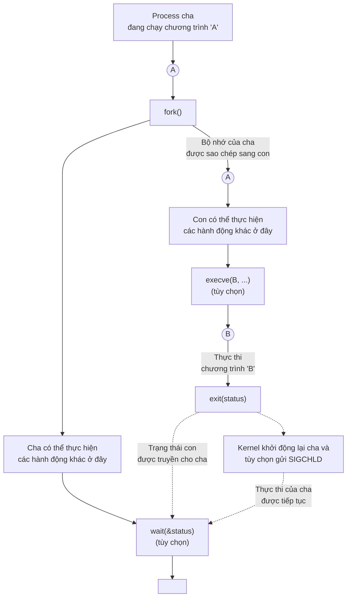
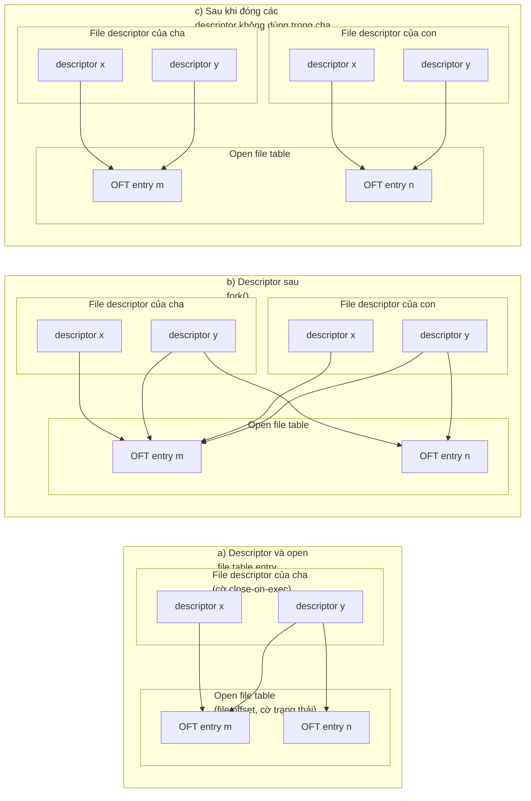
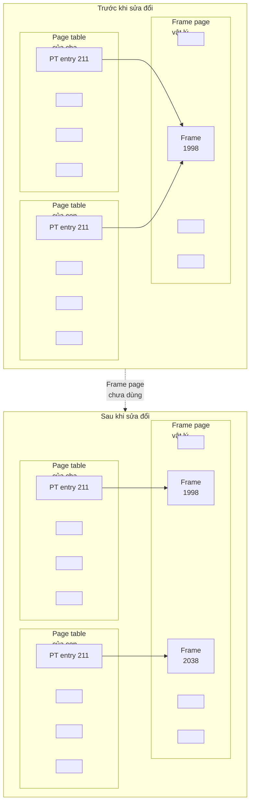

## Chương 24
# Tạo Process

Trong chương này và ba chương tiếp theo, chúng ta xem xét cách một process được tạo ra và kết thúc, cũng như cách một process có thể thực thi một chương trình mới. Chương này đề cập đến việc tạo process. Tuy nhiên, trước khi đi vào chủ đề đó, chúng ta trình bày tổng quan ngắn về các system call chính được đề cập trong bốn chương này.

## **24.1 Tổng Quan Về fork(), exit(), wait() và execve()**

Chủ đề chính của chương này và vài chương tiếp theo là các system call `fork()`, `exit()`, `wait()` và `execve()`. Mỗi system call này có các biến thể mà chúng ta cũng sẽ xem xét. Hiện tại, chúng ta cung cấp tổng quan về bốn system call này và cách chúng thường được dùng cùng nhau.

- System call `fork()` cho phép một process, gọi là process cha, tạo ra một process mới, gọi là process con. Điều này được thực hiện bằng cách tạo process con mới như một bản sao (gần như hoàn toàn) của process cha: process con nhận được các bản sao của stack, data, heap và text segment của process cha (Mục 6.3). Thuật ngữ fork (phân nhánh) xuất phát từ thực tế là chúng ta có thể hình dung process cha như đang phân chia để tạo ra hai bản sao của chính nó.
- Library function `exit(status)` kết thúc một process, làm cho tất cả tài nguyên (bộ nhớ, file descriptor đang mở, v.v.) được process sử dụng sẵn sàng để kernel tái cấp phát sau đó. Tham số `status` là một số nguyên xác định trạng thái kết thúc của process. Sử dụng system call `wait()`, process cha có thể truy xuất trạng thái này.

Library function `exit()` được xây dựng trên đỉnh của system call `_exit()`. Trong Chương 25, chúng ta giải thích sự khác biệt giữa hai giao diện này. Trong thời gian này, chúng ta chỉ lưu ý rằng, sau một `fork()`, thông thường chỉ một trong process cha và con kết thúc bằng cách gọi `exit()`; process kia nên kết thúc bằng cách dùng `_exit()`.

- System call `wait(&status)` có hai mục đích. Thứ nhất, nếu chưa có process con nào của process này kết thúc bằng cách gọi `exit()`, thì `wait()` tạm dừng quá trình thực thi của process cho đến khi một trong các process con của nó kết thúc. Thứ hai, trạng thái kết thúc của process con được trả về trong tham số `status` của `wait()`.
- System call `execve(pathname, argv, envp)` nạp một chương trình mới (`pathname`, với danh sách tham số `argv` và danh sách môi trường `envp`) vào bộ nhớ của process. Text program hiện có bị loại bỏ, và các stack, data và heap segment được tạo mới cho chương trình mới. Thao tác này thường được gọi là "exec một chương trình mới". Sau này, chúng ta sẽ thấy rằng có nhiều library function được xây dựng trên đỉnh của `execve()`, mỗi cái cung cấp một biến thể hữu ích trong giao diện lập trình. Khi chúng ta không quan tâm đến các biến thể giao diện này, chúng ta theo quy ước phổ biến là gọi các cuộc gọi này một cách chung chung là `exec()`, nhưng lưu ý rằng không có system call hoặc library function nào có tên này.

Một số hệ điều hành khác kết hợp chức năng của `fork()` và `exec()` thành một thao tác duy nhất—gọi là spawn—tạo ra process mới rồi thực thi một chương trình được chỉ định. So với đó, cách tiếp cận của UNIX thường đơn giản và thanh lịch hơn. Tách biệt hai bước này làm cho API đơn giản hơn (system call `fork()` không có tham số) và cho phép chương trình có mức độ linh hoạt cao trong các hành động nó thực hiện giữa hai bước. Hơn nữa, việc thực hiện `fork()` mà không có `exec()` tiếp theo thường rất hữu ích.

> SUSv3 quy định hàm `posix_spawn()` tùy chọn, kết hợp tác động của `fork()` và `exec()`. Hàm này, và một số API liên quan được quy định bởi SUSv3, được cài đặt trên Linux trong glibc. SUSv3 quy định `posix_spawn()` để cho phép viết các ứng dụng di động cho các kiến trúc phần cứng không cung cấp cơ sở swap hoặc memory-management unit (điển hình ở nhiều hệ thống nhúng). Trên các kiến trúc như vậy, `fork()` truyền thống khó hoặc không thể cài đặt.

Hình 24-1 cung cấp tổng quan về cách `fork()`, `exit()`, `wait()` và `execve()` thường được dùng cùng nhau. (Sơ đồ này phác thảo các bước mà shell thực hiện khi thực thi một lệnh: shell liên tục thực thi một vòng lặp đọc lệnh, thực hiện xử lý khác nhau trên lệnh đó, rồi fork một process con để exec lệnh.)

Việc sử dụng `execve()` được hiển thị trong sơ đồ này là tùy chọn. Đôi khi, thay vào đó, hữu ích hơn khi để process con tiếp tục thực thi cùng chương trình với process cha. Trong cả hai trường hợp, quá trình thực thi của process con cuối cùng được kết thúc bởi cuộc gọi đến `exit()` (hoặc bởi việc gửi signal), tạo ra trạng thái kết thúc mà process cha có thể thu được qua `wait()`.

Cuộc gọi `wait()` cũng là tùy chọn. Process cha có thể đơn giản bỏ qua con của nó và tiếp tục thực thi. Tuy nhiên, chúng ta sẽ thấy sau này rằng việc sử dụng `wait()` thường được mong muốn và thường được dùng trong handler cho signal `SIGCHLD`, signal mà kernel tạo ra cho process cha khi một trong các process con của nó kết thúc. (Theo mặc định, `SIGCHLD` bị bỏ qua, đó là lý do tại sao chúng ta gắn nhãn nó là được gửi tùy chọn trong sơ đồ.)



**Hình 24-1:** Tổng quan về cách sử dụng fork(), exit(), wait() và execve()

## **24.2 Tạo Process Mới: fork()**

Trong nhiều ứng dụng, việc tạo nhiều process có thể là cách hữu ích để phân chia tác vụ. Ví dụ, process máy chủ mạng có thể lắng nghe các yêu cầu client đến và tạo process con mới để xử lý từng yêu cầu; trong khi đó, process máy chủ tiếp tục lắng nghe các kết nối client tiếp theo. Việc phân chia tác vụ theo cách này thường làm cho thiết kế ứng dụng đơn giản hơn. Nó cũng cho phép đồng thời hóa cao hơn (tức là có thể xử lý nhiều tác vụ hoặc yêu cầu hơn cùng một lúc).

System call `fork()` tạo ra một process mới—process con—là bản sao gần như hoàn toàn của process gọi—process cha.

```
#include <unistd.h>
pid_t fork(void);
                In parent: returns process ID of child on success, or –1 on error;
                                    in successfully created child: always returns 0
```

Điểm mấu chốt để hiểu `fork()` là nhận ra rằng sau khi nó hoàn thành công việc của mình, hai process tồn tại, và trong mỗi process, quá trình thực thi tiếp tục từ điểm mà `fork()` trả về.

Hai process đang thực thi cùng một program text, nhưng chúng có các bản sao riêng của stack, data và heap segment. Stack, data và heap segment của process con ban đầu là các bản sao chính xác của các phần tương ứng trong bộ nhớ của process cha. Sau khi `fork()`, mỗi process có thể sửa đổi các biến trong stack, data và heap segment của nó mà không ảnh hưởng đến process kia.

Trong code của chương trình, chúng ta có thể phân biệt hai process thông qua giá trị được trả về từ `fork()`. Đối với process cha, `fork()` trả về process ID của process con mới được tạo. Điều này hữu ích vì process cha có thể tạo, và do đó cần theo dõi, nhiều process con (thông qua `wait()` hoặc một trong các hàm tương tự của nó). Đối với process con, `fork()` trả về 0. Nếu cần thiết, process con có thể lấy process ID của chính nó bằng `getpid()`, và process ID của process cha bằng `getppid()`.

Nếu không thể tạo process mới, `fork()` trả về –1. Các lý do thất bại có thể là giới hạn tài nguyên (`RLIMIT_NPROC`, được mô tả trong Mục 36.3) về số lượng process được phép cho user ID (thực) này đã bị vượt quá hoặc giới hạn toàn hệ thống về số lượng process có thể được tạo đã đạt đến.

Thành ngữ sau đây đôi khi được dùng khi gọi `fork()`:

```
pid_t childPid; /* Used in parent after successful fork()
 to record PID of child */
switch (childPid = fork()) {
case -1: /* fork() failed */
 /* Handle error */
case 0: /* Child of successful fork() comes here */
 /* Perform actions specific to child */
default: /* Parent comes here after successful fork() */
 /* Perform actions specific to parent */
}
```

Điều quan trọng cần nhận ra là sau một `fork()`, không xác định được process nào trong hai process sẽ được lên lịch tiếp theo để sử dụng CPU. Trong các chương trình được viết kém, tính không xác định này có thể dẫn đến lỗi được gọi là race condition, mà chúng ta mô tả thêm trong Mục 24.4.

Listing 24-1 minh họa cách sử dụng `fork()`. Chương trình này tạo một process con sửa đổi các bản sao của biến toàn cục và biến tự động mà nó kế thừa trong quá trình `fork()`.

Việc sử dụng `sleep()` (trong code được thực thi bởi process cha) trong chương trình này cho phép process con được lên lịch cho CPU trước process cha, để con có thể hoàn thành công việc và kết thúc trước khi cha tiếp tục thực thi. Sử dụng `sleep()` theo cách này không phải là phương pháp chắc chắn để đảm bảo kết quả này; chúng ta xem xét phương pháp tốt hơn trong Mục 24.5.

Khi chúng ta chạy chương trình trong Listing 24-1, chúng ta thấy đầu ra sau:

```
$ ./t_fork
PID=28557 (child) idata=333 istack=666
PID=28556 (parent) idata=111 istack=222
```

Đầu ra trên minh họa rằng process con nhận được bản sao riêng của stack và data segment tại thời điểm `fork()`, và nó có thể sửa đổi các biến trong các segment này mà không ảnh hưởng đến process cha.

**Listing 24-1:** Sử dụng fork()

```
–––––––––––––––––––––––––––––––––––––––––––––––––––––––– procexec/t_fork.c
#include "tlpi_hdr.h"
static int idata = 111; /* Allocated in data segment */
int
main(int argc, char *argv[])
{
 int istack = 222; /* Allocated in stack segment */
 pid_t childPid;
 switch (childPid = fork()) {
 case -1:
 errExit("fork");
 case 0:
 idata *= 3;
 istack *= 3;
 break;
 default:
 sleep(3); /* Give child a chance to execute */
 break;
 }
 /* Both parent and child come here */
 printf("PID=%ld %s idata=%d istack=%d\n", (long) getpid(),
 (childPid == 0) ? "(child) " : "(parent)", idata, istack);
 exit(EXIT_SUCCESS);
}
–––––––––––––––––––––––––––––––––––––––––––––––––––––––– procexec/t_fork.c
```

## **24.2.1 Chia Sẻ File Giữa Process Cha Và Con**

Khi `fork()` được thực hiện, process con nhận được các bản sao của tất cả file descriptor của process cha. Các bản sao này được tạo theo cách của `dup()`, có nghĩa là các descriptor tương ứng trong cha và con đều tham chiếu đến cùng một open file description. Như chúng ta đã thấy trong Mục 5.4, open file description chứa file offset hiện tại (được sửa đổi bởi `read()`, `write()` và `lseek()`) và các cờ trạng thái file đang mở (được đặt bởi `open()` và thay đổi bởi thao tác `fcntl()` `F_SETFL`). Do đó, các thuộc tính này của một file đang mở được chia sẻ giữa cha và con. Ví dụ, nếu process con cập nhật file offset, thay đổi này có thể thấy qua descriptor tương ứng trong process cha.

Thực tế là các thuộc tính này được chia sẻ bởi process cha và con sau một `fork()` được minh họa bởi chương trình trong Listing 24-2. Chương trình này mở một file tạm thời bằng `mkstemp()`, rồi gọi `fork()` để tạo process con. Process con thay đổi file offset và các cờ trạng thái file đang mở của file tạm thời, rồi thoát. Process cha sau đó truy xuất file offset và cờ để xác minh rằng nó có thể thấy các thay đổi được thực hiện bởi process con. Khi chạy chương trình, chúng ta thấy:

```
$ ./fork_file_sharing
File offset before fork(): 0
O_APPEND flag before fork() is: off
Child has exited
File offset in parent: 1000
O_APPEND flag in parent is: on
```

Để giải thích tại sao chúng ta ép kiểu giá trị trả về từ `lseek()` thành `long long` trong Listing 24-2, xem Mục 5.10.

**Listing 24-2:** Chia sẻ file offset và cờ trạng thái file đang mở giữa cha và con

```
––––––––––––––––––––––––––––––––––––––––––––––– procexec/fork_file_sharing.c
#include <sys/stat.h>
#include <fcntl.h>
#include <sys/wait.h>
#include "tlpi_hdr.h"
int
main(int argc, char *argv[])
{
 int fd, flags;
   char template[] = "/tmp/testXXXXXX";
 setbuf(stdout, NULL); /* Disable buffering of stdout */
 fd = mkstemp(template);
 if (fd == -1)
 errExit("mkstemp");
 printf("File offset before fork(): %lld\n",
 (long long) lseek(fd, 0, SEEK_CUR));
 flags = fcntl(fd, F_GETFL);
 if (flags == -1)
 errExit("fcntl - F_GETFL");
 printf("O_APPEND flag before fork() is: %s\n",
 (flags & O_APPEND) ? "on" : "off");
```

```
 switch (fork()) {
 case -1:
 errExit("fork");
 case 0: /* Child: change file offset and status flags */
 if (lseek(fd, 1000, SEEK_SET) == -1)
 errExit("lseek");
 flags = fcntl(fd, F_GETFL); /* Fetch current flags */
 if (flags == -1)
 errExit("fcntl - F_GETFL");
 flags |= O_APPEND; /* Turn O_APPEND on */
 if (fcntl(fd, F_SETFL, flags) == -1)
 errExit("fcntl - F_SETFL");
 _exit(EXIT_SUCCESS);
 default: /* Parent: can see file changes made by child */
 if (wait(NULL) == -1)
 errExit("wait"); /* Wait for child exit */
 printf("Child has exited\n");
 printf("File offset in parent: %lld\n",
 (long long) lseek(fd, 0, SEEK_CUR));
 flags = fcntl(fd, F_GETFL);
 if (flags == -1)
 errExit("fcntl - F_GETFL");
 printf("O_APPEND flag in parent is: %s\n",
 (flags & O_APPEND) ? "on" : "off");
 exit(EXIT_SUCCESS);
 }
}
```

––––––––––––––––––––––––––––––––––––––––––––––– **procexec/fork\_file\_sharing.c**

Việc chia sẻ các thuộc tính file đang mở giữa process cha và con thường hữu ích. Ví dụ, nếu cả cha và con đều đang ghi vào một file, việc chia sẻ file offset đảm bảo rằng hai process không ghi đè lên đầu ra của nhau. Tuy nhiên, điều đó không ngăn đầu ra của hai process bị xen kẽ ngẫu nhiên. Nếu điều đó không mong muốn, thì cần có một số hình thức đồng bộ hóa process. Ví dụ, process cha có thể dùng system call `wait()` để tạm dừng cho đến khi process con thoát. Đây là điều mà shell thực hiện, để nó chỉ in dấu nhắc sau khi process con thực thi lệnh đã kết thúc (trừ khi người dùng chạy lệnh trong nền bằng cách đặt ký tự `&` ở cuối lệnh).

Nếu việc chia sẻ file descriptor theo cách này không cần thiết, thì ứng dụng nên được thiết kế sao cho, sau một `fork()`, cha và con sử dụng các file descriptor khác nhau, với mỗi process đóng các descriptor không dùng đến (tức là những descriptor được dùng bởi process kia) ngay sau khi fork. (Nếu một trong các process thực hiện `exec()`, cờ close-on-exec được mô tả trong Mục 27.4 cũng có thể hữu ích.) Các bước này được hiển thị trong Hình 24-2.



**Hình 24-2:** Nhân đôi file descriptor trong fork(), và đóng các descriptor không dùng

## **24.2.2 Ngữ Nghĩa Bộ Nhớ Của fork()**

Về mặt khái niệm, chúng ta có thể coi `fork()` là tạo ra các bản sao của các text, data, heap và stack segment của process cha. (Thực ra, trong một số cài đặt UNIX ban đầu, việc nhân đôi như vậy được thực hiện theo nghĩa đen: một image process mới được tạo bằng cách sao chép bộ nhớ của process cha vào swap space, và image đã được swap đó trở thành process con trong khi cha giữ bộ nhớ của chính nó.) Tuy nhiên, thực tế thực hiện sao chép đơn giản các page bộ nhớ ảo của cha vào process con mới sẽ lãng phí vì một số lý do—một trong số đó là `fork()` thường được theo sau bởi một `exec()` ngay lập tức, thay thế text của process bằng một chương trình mới và khởi tạo lại các data, heap và stack segment của process. Hầu hết các cài đặt UNIX hiện đại, bao gồm Linux, sử dụng hai kỹ thuật để tránh việc sao chép lãng phí như vậy:

- Kernel đánh dấu text segment của mỗi process là chỉ đọc, để process không thể sửa đổi code của chính nó. Điều này có nghĩa là cha và con có thể chia sẻ cùng một text segment. System call `fork()` tạo text segment cho process con bằng cách xây dựng một tập hợp các mục page-table cho từng process tham chiếu đến các frame page bộ nhớ ảo tương tự đã được process cha sử dụng.
- Đối với các page trong data, heap và stack segment của process cha, kernel sử dụng kỹ thuật được gọi là copy-on-write. (Cài đặt copy-on-write được mô tả trong [Bach, 1986] và [Bovet & Cesati, 2005].) Ban đầu, kernel thiết lập để các mục page-table cho các segment này tham chiếu đến cùng các page bộ nhớ vật lý như các mục page-table tương ứng trong process cha, và chính các page đó được đánh dấu là chỉ đọc. Sau `fork()`, kernel bẫy bất kỳ nỗ lực nào của cha hoặc con để sửa đổi một trong các page này, và tạo bản sao của page sắp bị sửa đổi. Bản sao page mới này được gán cho process gây ra lỗi, và mục page-table tương ứng cho process con được điều chỉnh phù hợp. Từ đây trở đi, cha và con mỗi bên có thể sửa đổi bản sao riêng của page, mà không làm thay đổi hiển thị với process kia. Hình 24-3 minh họa kỹ thuật copy-on-write.



**Hình 24-3:** Page table trước và sau khi sửa đổi page copy-on-write được chia sẻ

#### **Kiểm soát memory footprint của process**

Chúng ta có thể kết hợp việc sử dụng `fork()` và `wait()` để kiểm soát memory footprint của process. Memory footprint của process là phạm vi các page bộ nhớ ảo được process sử dụng, bị ảnh hưởng bởi các yếu tố như việc điều chỉnh stack khi các hàm được gọi và trả về, các cuộc gọi đến `exec()`, và đặc biệt liên quan đến thảo luận này, việc sửa đổi heap do các cuộc gọi đến `malloc()` và `free()`.

Giả sử chúng ta bao bọc một cuộc gọi đến hàm nào đó, `func()`, bằng cách dùng `fork()` và `wait()` theo cách được hiển thị trong Listing 24-3. Sau khi thực thi đoạn code này, chúng ta biết rằng memory footprint của process cha không thay đổi so với điểm trước khi `func()` được gọi, vì tất cả các thay đổi có thể xảy ra đã xảy ra trong process con. Điều này có thể hữu ích vì các lý do sau:

- Nếu chúng ta biết rằng `func()` gây ra rò rỉ bộ nhớ hoặc phân mảnh heap quá mức, kỹ thuật này loại bỏ vấn đề. (Chúng ta có thể không thể xử lý các vấn đề này nếu chúng ta không có quyền truy cập vào mã nguồn của `func()`.)
- Giả sử chúng ta có một thuật toán thực hiện cấp phát bộ nhớ trong khi phân tích cây (ví dụ, chương trình trò chơi phân tích một loạt các nước đi có thể và phản hồi của chúng). Chúng ta có thể code chương trình như vậy để thực hiện các cuộc gọi đến `free()` để giải phóng tất cả bộ nhớ đã được cấp phát. Tuy nhiên, trong một số trường hợp, đơn giản hơn là dùng kỹ thuật chúng ta mô tả ở đây để cho phép chúng ta lùi lại, để lại người gọi (process cha) với memory footprint ban đầu không thay đổi.

Trong cài đặt được hiển thị trong Listing 24-3, kết quả của `func()` phải được biểu thị trong 8 bit mà `exit()` truyền từ process con đang kết thúc đến process cha đang gọi `wait()`. Tuy nhiên, chúng ta có thể dùng một file, pipe, hoặc một số kỹ thuật interprocess communication khác để cho phép `func()` trả về kết quả lớn hơn.

**Listing 24-3:** Gọi hàm mà không thay đổi memory footprint của process

```
–––––––––––––––––––––––––––––––––––––––––––––––––– fromprocexec/footprint.c
 pid_t childPid;
 int status;
 childPid = fork();
 if (childPid == -1)
 errExit("fork");
 if (childPid == 0) /* Child calls func() and */
 exit(func(arg)); /* uses return value as exit status */
 /* Parent waits for child to terminate. It can determine the
 result of func() by inspecting 'status'. */
 if (wait(&status) == -1)
 errExit("wait");
–––––––––––––––––––––––––––––––––––––––––––––––––– fromprocexec/footprint.c
```

# **24.3 System Call vfork()**

Các cài đặt BSD ban đầu nằm trong số những cài đặt trong đó `fork()` thực hiện sao chép theo nghĩa đen data, heap và stack của process cha. Như đã đề cập trước đó, điều này lãng phí, đặc biệt nếu `fork()` được theo sau bởi `exec()` ngay lập tức. Vì lý do này, các phiên bản BSD sau đã giới thiệu system call `vfork()`, hiệu quả hơn nhiều so với `fork()` của BSD, mặc dù nó hoạt động với ngữ nghĩa hơi khác (thực ra là khá kỳ lạ). Các cài đặt UNIX hiện đại dùng copy-on-write để cài đặt `fork()` hiệu quả hơn nhiều so với các cài đặt `fork()` cũ, do đó phần lớn loại bỏ nhu cầu về `vfork()`. Tuy nhiên, Linux (như nhiều cài đặt UNIX khác) cung cấp system call `vfork()` với ngữ nghĩa BSD cho các chương trình yêu cầu fork nhanh nhất có thể. Tuy nhiên, vì ngữ nghĩa bất thường của `vfork()` có thể dẫn đến một số lỗi chương trình tinh tế, việc sử dụng nó thường nên tránh, trừ trong các trường hợp hiếm hoi mà nó mang lại lợi ích hiệu suất đáng kể.

Giống như `fork()`, `vfork()` được process gọi sử dụng để tạo process con mới. Tuy nhiên, `vfork()` được thiết kế rõ ràng để dùng trong các chương trình mà con thực hiện cuộc gọi `exec()` ngay lập tức.

```
#include <unistd.h>
pid_t vfork(void);
                In parent: returns process ID of child on success, or –1 on error;
                                    in successfully created child: always returns 0
```

Hai tính năng phân biệt system call `vfork()` với `fork()` và làm cho nó hiệu quả hơn:

- Không có sự nhân đôi các page bộ nhớ ảo hoặc page table cho process con. Thay vào đó, process con chia sẻ bộ nhớ của process cha cho đến khi nó thực hiện `exec()` thành công hoặc gọi `_exit()` để kết thúc.
- Quá trình thực thi của process cha bị tạm dừng cho đến khi process con thực hiện `exec()` hoặc `_exit()`.

Những điểm này có một số hệ quả quan trọng. Vì process con đang sử dụng bộ nhớ của process cha, bất kỳ thay đổi nào được thực hiện bởi process con đối với các data, heap hoặc stack segment sẽ hiển thị với process cha sau khi nó tiếp tục. Hơn nữa, nếu process con thực hiện lệnh return hàm giữa `vfork()` và `exec()` hoặc `_exit()` sau đó, điều này cũng sẽ ảnh hưởng đến process cha. Điều này tương tự với ví dụ được mô tả trong Mục 6.8 về việc cố `longjmp()` vào một hàm mà lệnh return đã được thực hiện. Sự hỗn loạn tương tự—thường là segmentation fault (`SIGSEGV`)—có khả năng xảy ra.

Có một vài thứ mà process con có thể làm giữa `vfork()` và `exec()` mà không ảnh hưởng đến process cha. Trong số đó có các thao tác trên file descriptor đang mở (nhưng không phải các stdio file stream). Vì file descriptor table cho mỗi process được duy trì trong kernel space (Mục 5.4) và được nhân đôi trong `vfork()`, process con có thể thực hiện các thao tác file descriptor mà không ảnh hưởng đến process cha.

> SUSv3 nói rằng hành vi của chương trình không xác định nếu nó: a) sửa đổi bất kỳ dữ liệu nào khác ngoài biến kiểu `pid_t` được dùng để lưu trữ giá trị trả về của `vfork()`; b) return từ hàm mà `vfork()` được gọi; hoặc c) gọi bất kỳ hàm nào khác trước khi thành công gọi `_exit()` hoặc thực hiện `exec()`.

> Khi chúng ta xem xét system call `clone()` trong Mục 28.2, chúng ta sẽ thấy rằng process con được tạo bằng `fork()` hoặc `vfork()` cũng nhận được các bản sao riêng của một vài thuộc tính process khác.

Ngữ nghĩa của `vfork()` có nghĩa là sau khi gọi, process con được đảm bảo được lên lịch cho CPU trước process cha. Trong Mục 24.2, chúng ta đã lưu ý rằng đây không phải là đảm bảo của `fork()`, sau đó có thể lên lịch cha hoặc con trước.

Listing 24-4 cho thấy cách sử dụng `vfork()`, minh họa cả hai tính năng ngữ nghĩa phân biệt nó với `fork()`: process con chia sẻ bộ nhớ của process cha, và process cha bị tạm dừng cho đến khi process con kết thúc hoặc gọi `exec()`. Khi chúng ta chạy chương trình này, chúng ta thấy đầu ra sau:

```
$ ./t_vfork
Child executing Even though child slept, parent was not scheduled
Parent executing
istack=666
```

**Listing 24-4:** Sử dụng vfork()

Từ dòng cuối cùng của đầu ra, chúng ta có thể thấy rằng thay đổi được thực hiện bởi process con đối với biến `istack` được thực hiện trên biến của process cha.

```
–––––––––––––––––––––––––––––––––––––––––––––––––––––––– procexec/t_vfork.c
#include "tlpi_hdr.h"
int
main(int argc, char *argv[])
{
 int istack = 222;
 switch (vfork()) {
 case -1:
 errExit("vfork");
```

 case 0: /\* Child executes first, in parent's memory space \*/ sleep(3); /\* Even if we sleep for a while, parent still is not scheduled \*/

istack \*= 3; /\* This change will be seen by parent \*/

write(STDOUT\_FILENO, "Child executing\n", 16);

 \_exit(EXIT\_SUCCESS); default: /\* Parent is blocked until child exits \*/ write(STDOUT\_FILENO, "Parent executing\n", 17); printf("istack=%d\n", istack); exit(EXIT\_SUCCESS); } }

Trừ khi tốc độ thực sự là yếu tố quan trọng, các chương trình mới nên tránh sử dụng `vfork()` thay cho `fork()`. Đó là vì khi `fork()` được cài đặt dùng ngữ nghĩa copy-on-write (như trên hầu hết các cài đặt UNIX hiện đại), nó tiếp cận tốc độ của `vfork()`, và chúng ta tránh được các hành vi kỳ lạ liên quan đến `vfork()` được mô tả ở trên. (Chúng ta hiển thị một số so sánh tốc độ giữa `fork()` và `vfork()` trong Mục 28.3.)

–––––––––––––––––––––––––––––––––––––––––––––––––––––––– **procexec/t\_vfork.c**

SUSv3 đánh dấu `vfork()` là lỗi thời, và SUSv4 đi xa hơn, loại bỏ quy định của `vfork()`. SUSv3 để nhiều chi tiết về hoạt động của `vfork()` không được quy định, cho phép khả năng nó được cài đặt như là cuộc gọi đến `fork()`. Khi được cài đặt theo cách này, ngữ nghĩa BSD cho `vfork()` không được bảo tồn. Một số hệ thống UNIX thực sự cài đặt `vfork()` như là cuộc gọi đến `fork()`, và Linux cũng đã làm vậy trong kernel 2.0 và trước đó.

Khi được sử dụng, `vfork()` thường nên được theo sau ngay lập tức bởi cuộc gọi đến `exec()`. Nếu cuộc gọi `exec()` thất bại, process con nên kết thúc bằng cách dùng `_exit()`. (Process con của `vfork()` không nên kết thúc bằng cách gọi `exit()`, vì điều đó sẽ khiến stdio buffer của process cha bị flush và đóng. Chúng ta đi vào chi tiết hơn về điểm này trong Mục 25.4.)

Các cách sử dụng khác của `vfork()`—đặc biệt là những cách dựa trên ngữ nghĩa bất thường của nó cho việc chia sẻ bộ nhớ và lên lịch process—có khả năng khiến chương trình không di động, đặc biệt là với các cài đặt mà `vfork()` được cài đặt đơn giản như là cuộc gọi đến `fork()`.

## **24.4 Race Condition Sau fork()**

Sau một `fork()`, không xác định được process nào—cha hay con—có quyền truy cập CPU tiếp theo. (Trên hệ thống đa bộ xử lý, cả hai có thể đồng thời có quyền truy cập CPU.) Các ứng dụng ngầm hoặc rõ ràng dựa vào một thứ tự thực thi cụ thể để đạt được kết quả chính xác dễ bị lỗi do race condition, mà chúng ta đã mô tả trong Mục 5.1. Các lỗi như vậy có thể khó tìm, vì sự xuất hiện của chúng phụ thuộc vào các quyết định lên lịch mà kernel đưa ra theo tải hệ thống.

Chúng ta có thể dùng chương trình trong Listing 24-5 để minh họa tính không xác định này. Chương trình này lặp, dùng `fork()` để tạo nhiều process con. Sau mỗi `fork()`, cả cha và con đều in một thông điệp chứa giá trị bộ đếm vòng lặp và chuỗi cho biết đó là process cha hay con. Ví dụ, nếu chúng ta yêu cầu chương trình chỉ tạo một process con, chúng ta có thể thấy:

```
$ ./fork_whos_on_first 1
0 parent
0 child
```

Chúng ta có thể dùng chương trình này để tạo số lượng lớn process con, rồi phân tích đầu ra để xem liệu cha hay con có in thông điệp của nó trước mỗi lần. Phân tích kết quả khi dùng chương trình này để tạo 1 triệu process con trên hệ thống Linux/x86-32 2.2.19 cho thấy rằng process cha in thông điệp của nó trước trong tất cả trừ 332 trường hợp (tức là trong 99,97% trường hợp).

> Kết quả từ việc chạy chương trình trong Listing 24-5 được phân tích bằng script `procexec/fork_whos_on_first.count.awk`, được cung cấp trong bản phân phối mã nguồn cho cuốn sách này.

Từ các kết quả này, chúng ta có thể suy ra rằng, trên Linux 2.2.19, quá trình thực thi luôn tiếp tục với process cha sau một `fork()`. Lý do mà process con đôi khi in thông điệp của nó trước là vì trong 0,03% trường hợp, time slice CPU của process cha hết trước khi nó có thời gian in thông điệp. Nói cách khác, nếu ví dụ này đại diện cho một trường hợp mà chúng ta đang dựa vào cha luôn được lên lịch trước sau `fork()`, thì mọi thứ thường diễn ra đúng, nhưng một lần trong mỗi 3000 lần, mọi thứ sẽ sai. Tất nhiên, nếu ứng dụng kỳ vọng rằng process cha có thể thực hiện một phần công việc lớn hơn trước khi process con được lên lịch, khả năng mọi thứ sai sẽ lớn hơn. Cố gắng gỡ lỗi các lỗi như vậy trong một chương trình phức tạp có thể khó khăn.

**Listing 24-5:** Cha và con tranh để viết thông điệp sau fork()

```
–––––––––––––––––––––––––––––––––––––––––––––– procexec/fork_whos_on_first.c
#include <sys/wait.h>
#include "tlpi_hdr.h"
int
main(int argc, char *argv[])
{
 int numChildren, j;
 pid_t childPid;
 if (argc > 1 && strcmp(argv[1], "--help") == 0)
 usageErr("%s [num-children]\n", argv[0]);
 numChildren = (argc > 1) ? getInt(argv[1], GN_GT_0, "num-children") : 1;
 setbuf(stdout, NULL); /* Make stdout unbuffered */
 for (j = 0; j < numChildren; j++) {
 switch (childPid = fork()) {
 case -1:
 errExit("fork");
 case 0:
 printf("%d child\n", j);
 _exit(EXIT_SUCCESS);
 default:
 printf("%d parent\n", j);
 wait(NULL); /* Wait for child to terminate */
 break;
 }
 }
 exit(EXIT_SUCCESS);
}
–––––––––––––––––––––––––––––––––––––––––––––– procexec/fork_whos_on_first.c
```

Mặc dù Linux 2.2.19 luôn tiếp tục thực thi với process cha sau một `fork()`, chúng ta không thể dựa vào điều này xảy ra trên các cài đặt UNIX khác, hoặc thậm chí trên các phiên bản khác nhau của kernel Linux. Trong suốt loạt kernel 2.4 ổn định, các thử nghiệm đã được thực hiện ngắn gọn với bản vá "child first after fork()", hoàn toàn đảo ngược kết quả thu được từ 2.2.19. Mặc dù thay đổi này sau đó bị loại bỏ khỏi loạt kernel 2.4, nó đã được chấp nhận sau đó trong Linux 2.6. Do đó, các chương trình giả định hành vi 2.2.19 sẽ bị hỏng bởi kernel 2.6.

Một số thí nghiệm gần đây hơn đã đảo ngược đánh giá của các nhà phát triển kernel về việc tốt hơn là chạy process con hay cha trước sau `fork()`, và kể từ Linux 2.6.32, một lần nữa là cha được chạy trước mặc định sau `fork()`. Mặc định này có thể được thay đổi bằng cách gán giá trị khác 0 cho file `/proc/sys/kernel/sched_child_runs_first` đặc thù của Linux.

Để thấy lập luận cho hành vi "children first after fork()", hãy xem xét điều gì xảy ra với ngữ nghĩa copy-on-write khi process con của một `fork()` thực hiện `exec()` ngay lập tức. Trong trường hợp này, khi cha tiếp tục sau `fork()` để sửa đổi các data và stack page, kernel nhân đôi các page sắp bị sửa đổi cho process con. Vì process con thực hiện `exec()` ngay khi nó được lên lịch để chạy, việc nhân đôi này bị lãng phí. Theo lập luận này, tốt hơn là lên lịch process con trước, để khi cha được lên lịch tiếp theo, không cần sao chép page nào. Sử dụng chương trình trong Listing 24-5 để tạo 1 triệu process con trên một hệ thống Linux/x86-32 bận đang chạy kernel 2.6.30 cho thấy rằng trong 99,98% trường hợp, process con hiển thị thông điệp của nó trước. (Tỷ lệ chính xác phụ thuộc vào các yếu tố như tải hệ thống.) Kiểm tra chương trình này trên các cài đặt UNIX khác cho thấy sự biến đổi rộng trong các quy tắc chi phối process nào chạy trước sau `fork()`.

Lập luận để chuyển trở lại "parent first after fork()" trong Linux 2.6.32 dựa trên quan sát rằng, sau một `fork()`, trạng thái của cha đã hoạt động trong CPU và thông tin quản lý bộ nhớ của nó đã được lưu trong translation look-aside buffer (TLB) của hardware memory management unit. Do đó, chạy process cha trước sẽ dẫn đến hiệu suất tốt hơn. Điều này được xác minh một cách không chính thức bằng cách đo thời gian cần thiết để build kernel trong hai hành vi.

Kết luận, đáng lưu ý rằng sự khác biệt về hiệu suất giữa hai hành vi khá nhỏ, và sẽ không ảnh hưởng đến hầu hết các ứng dụng.

Từ thảo luận trên, rõ ràng là chúng ta không thể giả định một thứ tự thực thi cụ thể cho cha và con sau một `fork()`. Nếu chúng ta cần đảm bảo một thứ tự cụ thể, chúng ta phải sử dụng một số kỹ thuật đồng bộ hóa. Chúng ta mô tả một số kỹ thuật đồng bộ hóa trong các chương sau, bao gồm semaphore, file lock và gửi thông điệp giữa các process bằng pipe. Một phương pháp khác, mà chúng ta mô tả tiếp theo, là sử dụng signal.

## **24.5 Tránh Race Condition Bằng Cách Đồng Bộ Hóa Với Signal**

Sau một `fork()`, nếu một trong hai process cần chờ process kia hoàn thành một hành động, thì process đang hoạt động có thể gửi signal sau khi hoàn thành hành động đó; process kia chờ signal.

Listing 24-6 minh họa kỹ thuật này. Trong chương trình này, chúng ta giả sử rằng đó là process cha phải chờ process con thực hiện một hành động nào đó. Các cuộc gọi liên quan đến signal trong cha và con có thể được hoán đổi nếu con phải chờ cha. Thậm chí có thể để cả cha và con tín hiệu lẫn nhau nhiều lần để phối hợp hành động của chúng, mặc dù trong thực tế, việc phối hợp như vậy có nhiều khả năng được thực hiện bằng semaphore, file lock hoặc truyền thông điệp.

> [Stevens & Rago, 2005] gợi ý đóng gói các bước đồng bộ hóa như vậy (block signal, gửi signal, bắt signal) thành một tập hợp các hàm chuẩn cho đồng bộ hóa process. Ưu điểm của việc đóng gói như vậy là chúng ta có thể sau đó thay thế việc sử dụng signal bằng cơ chế IPC khác, nếu mong muốn.

Lưu ý rằng chúng ta block signal đồng bộ hóa (`SIGUSR1`) trước cuộc gọi `fork()` trong Listing 24-6. Nếu process cha cố block signal sau `fork()`, nó vẫn dễ bị tổn thương trước chính race condition mà chúng ta đang cố tránh. (Trong chương trình này, chúng ta giả sử rằng trạng thái signal mask trong process con là không liên quan; nếu cần thiết, chúng ta có thể unblock `SIGUSR1` trong process con sau `fork()`.)

Phiên shell log sau đây cho thấy điều gì xảy ra khi chúng ta chạy chương trình trong Listing 24-6:

```
$ ./fork_sig_sync
[17:59:02 5173] Child started - doing some work
[17:59:02 5172] Parent about to wait for signal
[17:59:04 5173] Child about to signal parent
[17:59:04 5172] Parent got signal
```

**Listing 24-6:** Sử dụng signal để đồng bộ hóa hành động của process

```
–––––––––––––––––––––––––––––––––––––––––––––––––– procexec/fork_sig_sync.c
#include <signal.h>
#include "curr_time.h" /* Declaration of currTime() */
#include "tlpi_hdr.h"
#define SYNC_SIG SIGUSR1 /* Synchronization signal */
static void /* Signal handler - does nothing but return */
handler(int sig)
{
}
int
main(int argc, char *argv[])
{
 pid_t childPid;
 sigset_t blockMask, origMask, emptyMask;
 struct sigaction sa;
 setbuf(stdout, NULL); /* Disable buffering of stdout */
 sigemptyset(&blockMask);
 sigaddset(&blockMask, SYNC_SIG); /* Block signal */
 if (sigprocmask(SIG_BLOCK, &blockMask, &origMask) == -1)
 errExit("sigprocmask");
 sigemptyset(&sa.sa_mask);
 sa.sa_flags = SA_RESTART;
 sa.sa_handler = handler;
 if (sigaction(SYNC_SIG, &sa, NULL) == -1)
 errExit("sigaction");
 switch (childPid = fork()) {
 case -1:
 errExit("fork");
 case 0: /* Child */
 /* Child does some required action here... */
```

```
 printf("[%s %ld] Child started - doing some work\n",
 currTime("%T"), (long) getpid());
 sleep(2); /* Simulate time spent doing some work */
 /* And then signals parent that it's done */
 printf("[%s %ld] Child about to signal parent\n",
 currTime("%T"), (long) getpid());
 if (kill(getppid(), SYNC_SIG) == -1)
 errExit("kill");
 /* Now child can do other things... */
 _exit(EXIT_SUCCESS);
 default: /* Parent */
 /* Parent may do some work here, and then waits for child to
 complete the required action */
 printf("[%s %ld] Parent about to wait for signal\n",
 currTime("%T"), (long) getpid());
 sigemptyset(&emptyMask);
 if (sigsuspend(&emptyMask) == -1 && errno != EINTR)
 errExit("sigsuspend");
 printf("[%s %ld] Parent got signal\n", currTime("%T"), (long) getpid());
 /* If required, return signal mask to its original state */
 if (sigprocmask(SIG_SETMASK, &origMask, NULL) == -1)
 errExit("sigprocmask");
 /* Parent carries on to do other things... */
 exit(EXIT_SUCCESS);
 }
}
–––––––––––––––––––––––––––––––––––––––––––––––––– procexec/fork_sig_sync.c
```

## **24.6 Tóm Tắt**

System call `fork()` tạo process mới (process con) bằng cách tạo bản sao gần như hoàn toàn của process gọi (process cha). System call `vfork()` là phiên bản hiệu quả hơn của `fork()`, nhưng thường tốt nhất là tránh do ngữ nghĩa bất thường của nó, theo đó process con sử dụng bộ nhớ của process cha cho đến khi nó thực hiện `exec()` hoặc kết thúc; trong thời gian này, quá trình thực thi của process cha bị tạm dừng.

Sau một cuộc gọi `fork()`, chúng ta không thể dựa vào thứ tự mà cha và con được lên lịch tiếp theo để sử dụng CPU. Các chương trình đưa ra giả định về thứ tự thực thi dễ bị lỗi được gọi là race condition. Vì sự xuất hiện của các lỗi như vậy phụ thuộc vào các yếu tố bên ngoài như tải hệ thống, chúng có thể khó tìm và gỡ lỗi.

#### **Tài liệu tham khảo thêm**

[Bach, 1986] và [Goodheart & Cox, 1994] cung cấp chi tiết về cài đặt của `fork()`, `execve()`, `wait()` và `exit()` trên các hệ thống UNIX. [Bovet & Cesati, 2005] và [Love, 2010] cung cấp chi tiết cài đặt đặc thù của Linux về việc tạo và kết thúc process.

## **24.7 Bài Tập**

**24-1.** Sau khi chương trình thực thi loạt các cuộc gọi `fork()` sau, sẽ có bao nhiêu process mới được tạo ra (giả sử không có cuộc gọi nào thất bại)?

```
fork();
fork();
fork();
```

- **24-2.** Viết chương trình để minh họa rằng sau một `vfork()`, process con có thể đóng file descriptor (ví dụ: descriptor 0) mà không ảnh hưởng đến file descriptor tương ứng trong process cha.
- **24-3.** Giả sử chúng ta có thể sửa đổi mã nguồn chương trình, làm thế nào để có được core dump của process tại một thời điểm nhất định, trong khi để process tiếp tục thực thi?
- **24-4.** Thử nghiệm với chương trình trong Listing 24-5 (`fork_whos_on_first.c`) trên các cài đặt UNIX khác để xác định cách các cài đặt này lên lịch cha và con sau một `fork()`.
- **24-5.** Giả sử trong chương trình trong Listing 24-6, process con cũng cần chờ cha hoàn thành một số hành động. Những thay đổi nào đối với chương trình sẽ cần thiết để thực thi điều này?
