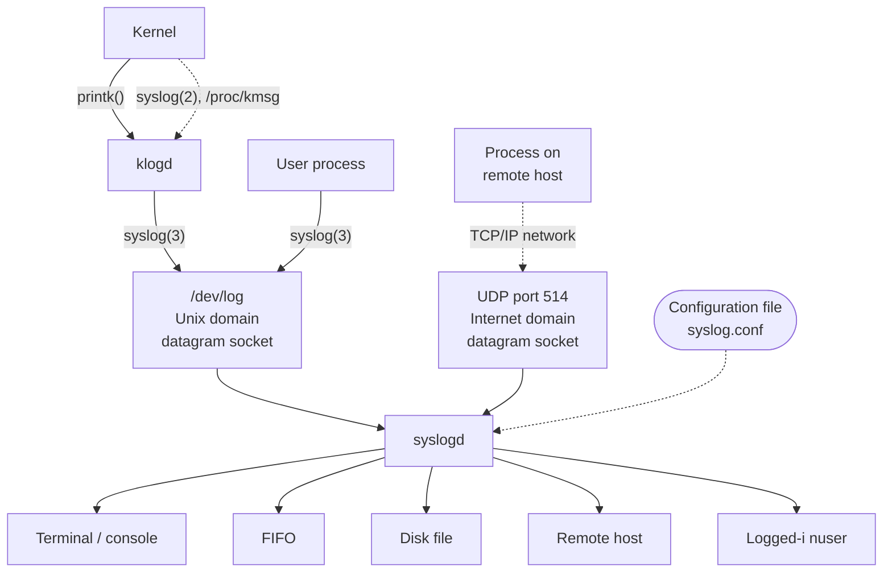

## Chương 37
# **DAEMON**

Chương này xem xét các đặc điểm của daemon process và trình bày các bước cần thiết để biến một process thành daemon. Chúng ta cũng xem xét cách ghi nhật ký thông điệp từ một daemon bằng cách sử dụng tiện ích syslog.

## **37.1 Tổng Quan**

Một daemon là một process có các đặc điểm sau:

-  Nó có tuổi thọ dài. Thông thường, daemon được tạo ra khi hệ thống khởi động và chạy cho đến khi hệ thống tắt.
-  Nó chạy trong background và không có controlling terminal. Việc không có controlling terminal đảm bảo rằng kernel không bao giờ tự động tạo bất kỳ signal liên quan đến job-control hoặc terminal nào (như `SIGINT`, `SIGTSTP`, và `SIGHUP`) cho daemon.

Các daemon được viết để thực hiện các nhiệm vụ cụ thể, như được minh họa bởi các ví dụ sau:

-  `cron`: một daemon thực thi các lệnh vào thời gian đã lên lịch.
-  `sshd`: daemon secure shell, cho phép đăng nhập từ các host từ xa bằng giao thức truyền thông an toàn.
-  `httpd`: daemon HTTP server (Apache), phục vụ các trang web.
-  `inetd`: daemon Internet superserver (được mô tả trong Mục 60.5), lắng nghe các kết nối mạng đến trên các cổng TCP/IP được chỉ định và khởi chạy các chương trình server thích hợp để xử lý các kết nối này.

Nhiều daemon tiêu chuẩn chạy dưới dạng privileged process (tức là, effective user ID là 0), và do đó nên được lập trình theo các hướng dẫn được cung cấp trong Chương [38.](#page-50-0)

Theo quy ước (không được áp dụng rộng rãi), các daemon có tên kết thúc bằng chữ `d`.

> Trên Linux, một số daemon được chạy dưới dạng kernel thread. Code của các daemon như vậy là một phần của kernel, và chúng thường được tạo ra trong quá trình khởi động hệ thống. Khi được liệt kê bằng `ps(1)`, tên của các daemon này được bao quanh bởi dấu ngoặc vuông (`[]`). Một ví dụ về kernel thread là `pdflush`, định kỳ flush các dirty page (ví dụ: các page từ buffer cache) ra đĩa.

### **37.2 Tạo Daemon**

Để trở thành daemon, một chương trình thực hiện các bước sau:

- 1. Thực hiện `fork()`, sau đó process cha thoát và process con tiếp tục. (Kết quả là, daemon trở thành con của init process.) Bước này được thực hiện vì hai lý do:
  - Giả sử daemon được khởi chạy từ command line, việc kết thúc của process cha được shell nhận thấy, sau đó shell hiển thị dấu nhắc khác và để process con tiếp tục trong background.
  - Process con được đảm bảo không phải là process group leader, vì nó đã kế thừa process group ID từ process cha và đã có được process ID riêng, khác với process group ID được kế thừa. Điều này là cần thiết để có thể thực hiện thành công bước tiếp theo.
- 2. Process con gọi `setsid()` (Mục 34.3) để bắt đầu một session mới và giải phóng bản thân khỏi bất kỳ liên kết nào với controlling terminal.
- 3. Nếu daemon không bao giờ mở bất kỳ terminal device nào sau đó, thì chúng ta không cần lo lắng về việc daemon lấy lại controlling terminal. Nếu daemon có thể mở một terminal device sau này, thì chúng ta phải thực hiện các bước để đảm bảo rằng device đó không trở thành controlling terminal. Chúng ta có thể làm điều này theo hai cách:
  - Chỉ định cờ `O_NOCTTY` trên bất kỳ lệnh `open()` nào có thể áp dụng cho terminal device.
  - Alternatively, và đơn giản hơn, thực hiện `fork()` thứ hai sau lời gọi `setsid()`, và một lần nữa để process cha thoát và process con (hoặc cháu) tiếp tục. Điều này đảm bảo rằng process con không phải là session leader, và do đó, theo quy ước System V cho việc lấy controlling terminal (mà Linux theo), process không bao giờ có thể lấy lại controlling terminal (Mục 34.4).

Trên các implementation theo quy ước BSD, một process chỉ có thể lấy controlling terminal thông qua thao tác `ioctl()` `TIOCSCTTY` rõ ràng, và vì vậy `fork()` thứ hai này không có tác dụng gì đối với việc lấy controlling terminal, nhưng `fork()` thừa cũng không gây hại gì.

- 4. Xóa process umask (Mục 15.4.6), để đảm bảo rằng khi daemon tạo file và thư mục, chúng có quyền được yêu cầu.
- 5. Thay đổi thư mục làm việc hiện tại của process, thường là thư mục gốc (`/`). Điều này cần thiết vì daemon thường chạy cho đến khi tắt hệ thống; nếu thư mục làm việc hiện tại của daemon nằm trên một file system khác với file system chứa `/`, thì file system đó không thể được unmount (Mục 14.8.2). Alternatively, daemon có thể thay đổi thư mục làm việc của nó đến một vị trí nơi nó thực hiện công việc hoặc một vị trí được định nghĩa trong file cấu hình của nó, miễn là chúng ta biết rằng file system chứa thư mục này không bao giờ cần được unmount. Ví dụ, `cron` đặt mình trong `/var/spool/cron`.
- 6. Đóng tất cả các file descriptor đang mở mà daemon đã kế thừa từ process cha. (Daemon có thể cần giữ một số file descriptor được kế thừa mở, vì vậy bước này là tùy chọn hoặc có thể thay đổi.) Điều này được thực hiện vì nhiều lý do. Vì daemon đã mất controlling terminal và đang chạy trong background, daemon không cần giữ file descriptor 0, 1, và 2 mở nếu chúng tham chiếu đến terminal. Hơn nữa, chúng ta không thể unmount bất kỳ file system nào mà daemon tồn tại lâu dài đang giữ file mở. Và, như thường lệ, chúng ta nên đóng các file descriptor đang mở không sử dụng vì file descriptor là tài nguyên hữu hạn.

Một số implementation UNIX (ví dụ: Solaris 9 và một số phiên bản BSD gần đây) cung cấp một hàm có tên `closefrom(n)` (hoặc tương tự), đóng tất cả các file descriptor lớn hơn hoặc bằng n. Hàm này không có sẵn trên Linux.

- 7. Sau khi đóng file descriptor 0, 1, và 2, một daemon thường mở `/dev/null` và sử dụng `dup2()` (hoặc tương tự) để làm cho tất cả các descriptor đó tham chiếu đến device này. Điều này được thực hiện vì hai lý do:
  - Nó đảm bảo rằng nếu daemon gọi các hàm thư viện thực hiện I/O trên các descriptor này, những hàm đó sẽ không thất bại bất ngờ.
  - Nó ngăn khả năng daemon sau này mở một file bằng descriptor 1 hoặc 2, sau đó bị ghi vào — và do đó bị hỏng — bởi một hàm thư viện mong đợi xử lý các descriptor này là standard output và standard error.

`/dev/null` là một virtual device luôn loại bỏ dữ liệu được ghi vào nó. Khi chúng ta muốn loại bỏ standard output hoặc error của một lệnh shell, chúng ta có thể redirect nó đến file này. Việc đọc từ device này luôn trả về end-of-file.

Bây giờ chúng ta trình bày implementation của một hàm, `becomeDaemon()`, thực hiện các bước được mô tả ở trên để biến caller thành daemon.

```
#include <syslog.h>
int becomeDaemon(int flags);
                                             Trả về 0 nếu thành công, hoặc –1 nếu có lỗi
```

Hàm `becomeDaemon()` nhận một đối số bit-mask, `flags`, cho phép caller có thể ức chế một số bước một cách có chọn lọc, như được mô tả trong các chú thích trong file header tại [Listing 37-1](#page-37-0).

```
––––––––––––––––––––––––––––––––––––––––––––––––––– daemons/become_daemon.h
#ifndef BECOME_DAEMON_H /* Prevent double inclusion */
#define BECOME_DAEMON_H
/* Bit-mask values for 'flags' argument of becomeDaemon() */
#define BD_NO_CHDIR 01 /* Don't chdir("/") */
#define BD_NO_CLOSE_FILES 02 /* Don't close all open files */
#define BD_NO_REOPEN_STD_FDS 04 /* Don't reopen stdin, stdout, and
 stderr to /dev/null */
#define BD_NO_UMASK0 010 /* Don't do a umask(0) */
#define BD_MAX_CLOSE 8192 /* Maximum file descriptors to close if
 sysconf(_SC_OPEN_MAX) is indeterminate */
int becomeDaemon(int flags);
#endif
––––––––––––––––––––––––––––––––––––––––––––––––––– daemons/become_daemon.h
```

Implementation của hàm `becomeDaemon()` được trình bày trong [Listing 37-2.](#page-37-1)

GNU C library cung cấp một hàm phi tiêu chuẩn, `daemon()`, biến caller thành daemon. Hàm `daemon()` của glibc không có đối số tương đương với đối số `flags` của hàm `becomeDaemon()` của chúng ta.

<span id="page-37-1"></span>**Listing 37-2:** Tạo daemon process

```
––––––––––––––––––––––––––––––––––––––––––––––––––– daemons/become_daemon.c
#include <sys/stat.h>
#include <fcntl.h>
#include "become_daemon.h"
#include "tlpi_hdr.h"
int /* Returns 0 on success, -1 on error */
becomeDaemon(int flags)
{
 int maxfd, fd;
 switch (fork()) { /* Become background process */
 case -1: return -1;
 case 0: break; /* Child falls through... */
 default: _exit(EXIT_SUCCESS); /* while parent terminates */
 }
 if (setsid() == -1) /* Become leader of new session */
 return -1;
 switch (fork()) { /* Ensure we are not session leader */
 case -1: return -1;
 case 0: break;
 default: _exit(EXIT_SUCCESS);
 }
```

```
 if (!(flags & BD_NO_UMASK0))
 umask(0); /* Clear file mode creation mask */
 if (!(flags & BD_NO_CHDIR))
 chdir("/"); /* Change to root directory */
 if (!(flags & BD_NO_CLOSE_FILES)) { /* Close all open files */
 maxfd = sysconf(_SC_OPEN_MAX);
 if (maxfd == -1) /* Limit is indeterminate... */
 maxfd = BD_MAX_CLOSE; /* so take a guess */
 for (fd = 0; fd < maxfd; fd++)
 close(fd);
 }
 if (!(flags & BD_NO_REOPEN_STD_FDS)) {
 close(STDIN_FILENO); /* Reopen standard fd's to /dev/null */
 fd = open("/dev/null", O_RDWR);
 if (fd != STDIN_FILENO) /* 'fd' should be 0 */
 return -1;
 if (dup2(STDIN_FILENO, STDOUT_FILENO) != STDOUT_FILENO)
 return -1;
 if (dup2(STDIN_FILENO, STDERR_FILENO) != STDERR_FILENO)
 return -1;
 }
 return 0;
}
––––––––––––––––––––––––––––––––––––––––––––––––––– daemons/become_daemon.c
```

Nếu chúng ta viết một chương trình thực hiện lời gọi `becomeDaemon(0)` và sau đó sleep một lúc, chúng ta có thể sử dụng `ps(1)` để xem xét một số thuộc tính của process kết quả:

```
$ ./test_become_daemon
$ ps -C test_become_daemon -o "pid ppid pgid sid tty command"
 PID PPID PGID SID TT COMMAND
24731 1 24730 24730 ? ./test_become_daemon
```

Chúng ta không trình bày source code cho `daemons/test_become_daemon.c`, vì nó rất đơn giản, nhưng chương trình được cung cấp trong bản phân phối source code của cuốn sách này.

Trong output của `ps`, dấu `?` dưới tiêu đề `TT` cho thấy rằng process không có controlling terminal. Từ thực tế là process ID không giống với session ID (SID), chúng ta cũng có thể thấy rằng process không phải là leader của session của nó, và do đó sẽ không lấy lại controlling terminal nếu nó mở một terminal device. Đây là những gì cần có cho một daemon.

## **37.3 Hướng Dẫn Viết Daemon**

Như đã lưu ý trước đây, daemon thường chỉ kết thúc khi hệ thống tắt. Nhiều daemon tiêu chuẩn được dừng lại bởi các script ứng dụng cụ thể được thực thi trong quá trình tắt hệ thống. Những daemon không bị kết thúc theo cách này sẽ nhận được signal `SIGTERM`, mà init process gửi đến tất cả các process con của nó trong quá trình tắt hệ thống. Theo mặc định, `SIGTERM` kết thúc một process. Nếu daemon cần thực hiện bất kỳ dọn dẹp nào trước khi kết thúc, nó nên làm điều đó bằng cách thiết lập một handler cho signal này. Handler này phải được thiết kế để thực hiện quá trình dọn dẹp như vậy một cách nhanh chóng, vì init tiếp theo signal `SIGTERM` bằng signal `SIGKILL` sau 5 giây. (Điều này không có nghĩa là daemon có thể thực hiện 5 giây công việc CPU; init phát tín hiệu đến tất cả các process trên hệ thống cùng một lúc, và tất cả chúng có thể đang cố gắng dọn dẹp trong 5 giây đó.)

Vì daemon có tuổi thọ dài, chúng ta phải đặc biệt cẩn thận với các memory leak (Mục 7.1.3) và file descriptor leak (khi ứng dụng không đóng tất cả các file descriptor mà nó mở) có thể xảy ra. Nếu những lỗi như vậy ảnh hưởng đến daemon, cách khắc phục duy nhất là kill nó và khởi động lại sau khi (sửa lỗi).

Nhiều daemon cần đảm bảo rằng chỉ có một instance của daemon đang hoạt động tại một thời điểm. Ví dụ, không hợp lý khi có hai bản sao của `cron` daemon cùng cố gắng thực thi các công việc đã lên lịch. Trong Mục 55.6, chúng ta xem xét một kỹ thuật để đạt được điều này.

# **37.4 Sử Dụng SIGHUP để Khởi Tạo Lại Daemon**

Thực tế là nhiều daemon nên chạy liên tục đặt ra một vài rào cản lập trình:

-  Thông thường, daemon đọc các tham số hoạt động từ một file cấu hình liên quan khi khởi động. Đôi khi, mong muốn thay đổi các tham số này "on the fly", mà không cần dừng và khởi động lại daemon.
-  Một số daemon tạo ra các file log. Nếu daemon không bao giờ đóng file log, thì nó có thể tăng trưởng vô hạn, cuối cùng làm tắc nghẽn file system. (Trong Mục 18.3, chúng ta lưu ý rằng ngay cả khi chúng ta xóa tên cuối cùng của một file, file vẫn tiếp tục tồn tại miễn là bất kỳ process nào đang mở nó.) Những gì chúng ta cần là một cách để nói với daemon đóng file log và mở file mới, để chúng ta có thể rotate log file khi cần.

Giải pháp cho cả hai vấn đề này là để daemon thiết lập một handler cho `SIGHUP`, và thực hiện các bước cần thiết khi nhận được signal này. Trong Mục 34.4, chúng ta lưu ý rằng `SIGHUP` được tạo ra cho controlling process khi ngắt kết nối controlling terminal. Vì daemon không có controlling terminal, kernel không bao giờ tạo signal này cho daemon. Do đó, các daemon có thể sử dụng `SIGHUP` cho mục đích được mô tả ở đây.

> Chương trình `logrotate` có thể được sử dụng để tự động hóa việc xoay vòng file log của daemon. Xem trang manual `logrotate(8)` để biết chi tiết.

[Listing 37-3](#page-41-0) cung cấp một ví dụ về cách daemon có thể sử dụng `SIGHUP`. Chương trình này thiết lập một handler cho `SIGHUP` w, trở thành daemon e, mở file log r, và đọc file cấu hình của nó t. Handler `SIGHUP` q chỉ đặt một biến cờ toàn cục, `hupReceived`, được kiểm tra bởi chương trình chính. Chương trình chính nằm trong một vòng lặp, in một thông điệp ra file log mỗi 15 giây i. Các lời gọi `sleep()` y trong vòng lặp này nhằm mô phỏng một số loại xử lý được thực hiện bởi một ứng dụng thực sự. Sau mỗi lần trả về từ `sleep()` trong vòng lặp này, chương trình kiểm tra xem `hupReceived` có được đặt u hay không; nếu có, nó mở lại file log, đọc lại file cấu hình, và xóa cờ `hupReceived`.

Để ngắn gọn, các hàm `logOpen()`, `logClose()`, `logMessage()`, và `readConfigFile()` bị bỏ qua khỏi [Listing 37-3,](#page-41-0) nhưng được cung cấp với bản phân phối source code của cuốn sách này. Ba hàm đầu tiên làm những gì chúng ta mong đợi từ tên của chúng. Hàm `readConfigFile()` đơn giản đọc một dòng từ file cấu hình và echo nó vào file log.

> Một số daemon sử dụng phương pháp thay thế để khởi tạo lại chính chúng khi nhận được `SIGHUP`: chúng đóng tất cả các file và sau đó khởi động lại chính mình bằng `exec()`.

Sau đây là một ví dụ về những gì chúng ta có thể thấy khi chạy chương trình trong [Listing 37-3](#page-41-0). Chúng ta bắt đầu bằng cách tạo một file cấu hình giả và sau đó khởi chạy daemon:

```
$ echo START > /tmp/ds.conf
$ ./daemon_SIGHUP
$ cat /tmp/ds.log View log file
2011-01-17 11:18:34: Opened log file
2011-01-17 11:18:34: Read config file: START
```

Bây giờ chúng ta sửa đổi file cấu hình và đổi tên file log trước khi gửi `SIGHUP` cho daemon:

```
$ echo CHANGED > /tmp/ds.conf
$ date +'%F %X'; mv /tmp/ds.log /tmp/old_ds.log
2011-01-17 11:19:03 AM
$ date +'%F %X'; killall -HUP daemon_SIGHUP
2011-01-17 11:19:23 AM
$ ls /tmp/*ds.log Log file was reopened
/tmp/ds.log /tmp/old_ds.log
$ cat /tmp/old_ds.log View old log file
2011-01-17 11:18:34: Opened log file
2011-01-17 11:18:34: Read config file: START
2011-01-17 11:18:49: Main: 1
2011-01-17 11:19:04: Main: 2
2011-01-17 11:19:19: Main: 3
2011-01-17 11:19:23: Closing log file
```

Output của `ls` cho thấy chúng ta có cả file log cũ lẫn mới. Khi chúng ta sử dụng `cat` để xem nội dung của file log cũ, chúng ta thấy rằng ngay cả sau khi lệnh `mv` được dùng để đổi tên file, daemon vẫn tiếp tục ghi nhật ký thông điệp ở đó. Tại thời điểm này, chúng ta có thể xóa file log cũ nếu chúng ta không còn cần nó nữa. Khi chúng ta xem file log mới, chúng ta thấy rằng file cấu hình đã được đọc lại:

```
$ cat /tmp/ds.log
2011-01-17 11:19:23: Opened log file
2011-01-17 11:19:23: Read config file: CHANGED
2011-01-17 11:19:34: Main: 4
$ killall daemon_SIGHUP Kill our daemon
```

Lưu ý rằng file log và cấu hình của daemon thường được đặt trong các thư mục tiêu chuẩn, không phải trong thư mục `/tmp`, như được thực hiện trong chương trình trong [Listing 37-3.](#page-41-0) Theo quy ước, file cấu hình được đặt trong `/etc` hoặc một trong các thư mục con của nó, trong khi file log thường được đặt trong `/var/log`. Các chương trình daemon thường cung cấp các tùy chọn command-line để chỉ định các vị trí thay thế thay vì mặc định.

<span id="page-41-0"></span>**Listing 37-3:** Sử dụng SIGHUP để khởi tạo lại daemon

```
––––––––––––––––––––––––––––––––––––––––––––––––––– daemons/daemon_SIGHUP.c
  #include <sys/stat.h>
  #include <signal.h>
  #include "become_daemon.h"
  #include "tlpi_hdr.h"
  static const char *LOG_FILE = "/tmp/ds.log";
  static const char *CONFIG_FILE = "/tmp/ds.conf";
  /* Definitions of logMessage(), logOpen(), logClose(), and
   readConfigFile() are omitted from this listing */
  static volatile sig_atomic_t hupReceived = 0;
   /* Set nonzero on receipt of SIGHUP */
   from
  static void
  sighupHandler(int sig)
  {
q hupReceived = 1;
  }
  int
  main(int argc, char *argv[])
  {
   const int SLEEP_TIME = 15; /* Time to sleep between messages */
   int count = 0; /* Number of completed SLEEP_TIME intervals */
   int unslept; /* Time remaining in sleep interval */
   struct sigaction sa;
   sigemptyset(&sa.sa_mask);
   sa.sa_flags = SA_RESTART;
   sa.sa_handler = sighupHandler;
w if (sigaction(SIGHUP, &sa, NULL) == -1)
   errExit("sigaction");
e if (becomeDaemon(0) == -1)
   errExit("becomeDaemon");
r logOpen(LOG_FILE);
t readConfigFile(CONFIG_FILE);
   unslept = SLEEP_TIME;
   for (;;) {
y unslept = sleep(unslept); /* Returns > 0 if interrupted */
u if (hupReceived) { /* If we got SIGHUP... */
   logClose();
```

```
 logOpen(LOG_FILE);
   readConfigFile(CONFIG_FILE);
   hupReceived = 0; /* Get ready for next SIGHUP */
   }
   if (unslept == 0) { /* On completed interval */
   count++;
i logMessage("Main: %d", count);
   unslept = SLEEP_TIME; /* Reset interval */
   }
   }
  }
  ––––––––––––––––––––––––––––––––––––––––––––––––––– daemons/daemon_SIGHUP.c
```

# **37.5 Ghi Nhật Ký Thông Điệp và Lỗi Bằng syslog**

Khi viết daemon, một vấn đề chúng ta gặp phải là cách hiển thị thông báo lỗi. Vì daemon chạy trong background, chúng ta không thể hiển thị thông điệp trên terminal liên quan, như chúng ta thường làm với các chương trình khác. Một alternative có thể là ghi thông điệp vào file log dành riêng cho ứng dụng, như được thực hiện trong chương trình trong [Listing 37-3.](#page-41-0) Vấn đề chính với cách tiếp cận này là một quản trị viên hệ thống khó có thể quản lý nhiều file log ứng dụng và theo dõi tất cả chúng để tìm thông báo lỗi. Tiện ích syslog được thiết kế để giải quyết vấn đề này.

### **37.5.1 Tổng Quan**

Tiện ích syslog cung cấp một cơ sở ghi nhật ký tập trung, duy nhất có thể được sử dụng để ghi nhật ký thông điệp bởi tất cả các ứng dụng trên hệ thống. Tổng quan về tiện ích này được cung cấp trong [Hình 37-1.](#page-42-0)



<span id="page-42-0"></span>**Hình 37-1:** Tổng quan về system logging

Tiện ích syslog có hai thành phần chính: daemon `syslogd` và hàm thư viện `syslog(3)`.

Daemon System Log, `syslogd`, chấp nhận thông điệp log từ hai nguồn khác nhau: một Unix domain socket, `/dev/log`, chứa các thông điệp được tạo ra cục bộ, và (nếu được bật) một Internet domain socket (UDP port 514), chứa các thông điệp được gửi qua mạng TCP/IP. (Trên một số implementation UNIX khác, socket syslog được đặt tại `/var/run/log`.)

Mỗi thông điệp được xử lý bởi `syslogd` có một số thuộc tính, bao gồm facility, chỉ định loại chương trình tạo thông điệp, và level, chỉ định mức độ nghiêm trọng (priority) của thông điệp. Daemon `syslogd` kiểm tra facility và level của mỗi thông điệp, và sau đó chuyển nó đến bất kỳ một số đích có thể theo quy định của file cấu hình liên quan, `/etc/syslog.conf`. Các đích có thể bao gồm một terminal hoặc virtual console, một disk file, một FIFO, một hoặc nhiều (hoặc tất cả) người dùng đã đăng nhập, hoặc một process (thường là daemon `syslogd` khác) trên hệ thống khác được kết nối qua mạng TCP/IP. (Gửi thông điệp đến một process trên hệ thống khác hữu ích để giảm overhead quản lý bằng cách hợp nhất thông điệp từ nhiều hệ thống đến một vị trí duy nhất.) Một thông điệp duy nhất có thể được gửi đến nhiều đích (hoặc không có đích nào), và các thông điệp với các kết hợp facility và level khác nhau có thể được nhắm đến các đích khác nhau hoặc các instance khác nhau của các đích (tức là các console khác nhau, các disk file khác nhau, v.v.).

> Gửi thông điệp syslog đến hệ thống khác qua mạng TCP/IP cũng có thể giúp phát hiện các cuộc tấn công hệ thống. Các cuộc tấn công thường để lại dấu vết trong system log, nhưng kẻ tấn công thường cố gắng che giấu hoạt động của mình bằng cách xóa các bản ghi log. Với remote logging, kẻ tấn công sẽ cần phải xâm nhập vào một hệ thống khác để làm điều đó.

Hàm thư viện `syslog(3)` có thể được sử dụng bởi bất kỳ process nào để ghi nhật ký một thông điệp. Hàm này, mà chúng ta mô tả chi tiết trong giây lát, sử dụng các đối số được cung cấp để xây dựng một thông điệp theo định dạng chuẩn sau đó được đặt trên socket `/dev/log` để `syslogd` đọc.

Một nguồn thay thế của các thông điệp được đặt trên `/dev/log` là daemon Kernel Log, `klogd`, thu thập các thông điệp log kernel (được tạo ra bởi kernel bằng hàm `printk()` của nó). Các thông điệp này được thu thập bằng cách sử dụng một trong hai interface đặc thù của Linux tương đương — file `/proc/kmsg` và system call `syslog(2)` — và sau đó được đặt trên `/dev/log` bằng cách sử dụng hàm thư viện `syslog(3)`.

> Mặc dù `syslog(2)` và `syslog(3)` có cùng tên, chúng thực hiện các nhiệm vụ khá khác nhau. Một interface cho `syslog(2)` được cung cấp trong glibc dưới tên `klogctl()`. Trừ khi được chỉ định rõ ràng khác, khi chúng ta tham chiếu đến `syslog()` trong phần này, chúng ta có nghĩa là `syslog(3)`.

Tiện ích syslog ban đầu xuất hiện trong 4.2BSD, nhưng hiện nay được cung cấp trên hầu hết các implementation UNIX. SUSv3 đã chuẩn hóa `syslog(3)` và các hàm liên quan, nhưng để ngỏ implementation và hoạt động của `syslogd`, cũng như định dạng của file `syslog.conf`, không được chỉ định. Linux implementation của `syslogd` khác với tiện ích BSD gốc ở chỗ cho phép một số phần mở rộng cho các quy tắc xử lý thông điệp có thể được chỉ định trong `syslog.conf`.

### **37.5.2 syslog API**

syslog API bao gồm ba hàm chính:

-  Hàm `openlog()` thiết lập các cài đặt mặc định áp dụng cho các lời gọi `syslog()` tiếp theo. Việc sử dụng `openlog()` là tùy chọn. Nếu nó bị bỏ qua, một kết nối đến tiện ích ghi nhật ký được thiết lập với các cài đặt mặc định vào lần đầu tiên `syslog()` được gọi.
-  Hàm `syslog()` ghi nhật ký một thông điệp.
-  Hàm `closelog()` được gọi sau khi chúng ta đã ghi nhật ký thông điệp xong, để hủy thiết lập kết nối với log.

Không có hàm nào trong số này trả về giá trị trạng thái. Một phần, điều này là vì system logging luôn nên có sẵn (quản trị viên hệ thống sẽ sớm nhận thấy nếu nó không hoạt động). Hơn nữa, nếu xảy ra lỗi với system logging, thường không có nhiều điều ứng dụng có thể làm một cách hữu ích để báo cáo nó.

> GNU C library cũng cung cấp hàm `void vsyslog(int priority, const char *format, va_list args)`. Hàm này thực hiện cùng nhiệm vụ như `syslog()`, nhưng nhận một danh sách đối số đã được xử lý trước bởi `stdarg(3)` API. (Vì vậy, `vsyslog()` với `syslog()` giống như `vprintf()` với `printf()`.) SUSv3 không chỉ định `vsyslog()`, và nó không có sẵn trên tất cả các implementation UNIX.

### **Thiết lập kết nối đến system log**

Hàm `openlog()` tùy chọn thiết lập một kết nối đến tiện ích system log và đặt các giá trị mặc định áp dụng cho các lời gọi `syslog()` tiếp theo.

```
#include <syslog.h>
void openlog(const char *ident, int log_options, int facility);
```

Đối số `ident` là một pointer đến một chuỗi được bao gồm trong mỗi thông điệp được ghi bởi `syslog()`; thông thường, tên chương trình được chỉ định cho đối số này. Lưu ý rằng `openlog()` chỉ sao chép giá trị của pointer này. Miễn là nó tiếp tục gọi `syslog()`, ứng dụng nên đảm bảo rằng chuỗi được tham chiếu không bị thay đổi sau này.

> Nếu `ident` được chỉ định là `NULL`, thì, giống như một số implementation khác, implementation syslog của glibc tự động sử dụng tên chương trình làm giá trị `ident`. Tuy nhiên, tính năng này không được SUSv3 yêu cầu, và không được cung cấp trên một số implementation. Các ứng dụng portable nên tránh phụ thuộc vào nó.

Đối số `log_options` cho `openlog()` là một bit mask được tạo bằng cách OR các hằng số sau:

```
LOG_CONS
```

Nếu có lỗi khi gửi đến system logger, thì ghi thông điệp vào system console (`/dev/console`).

#### LOG\_NDELAY

Mở kết nối đến hệ thống ghi nhật ký (tức là underlying Unix domain socket, `/dev/log`) ngay lập tức. Theo mặc định (`LOG_ODELAY`), kết nối chỉ được mở khi (và nếu) thông điệp đầu tiên được ghi nhật ký với `syslog()`. Cờ `O_NDELAY` hữu ích trong các chương trình cần kiểm soát chính xác khi nào file descriptor cho `/dev/log` được cấp phát. Một ví dụ về yêu cầu như vậy là trong một chương trình gọi `chroot()`. Sau một lời gọi `chroot()`, pathname `/dev/log` sẽ không còn hiển thị nữa, và vì vậy một lời gọi `openlog()` chỉ định `LOG_NDELAY` phải được thực hiện trước `chroot()`. Daemon `tftpd` (Trivial File Transfer) là một ví dụ về chương trình sử dụng `LOG_NDELAY` cho mục đích này.

#### LOG\_NOWAIT

Không `wait()` cho bất kỳ process con nào có thể đã được tạo ra để ghi nhật ký thông điệp. Trên các implementation tạo process con để ghi nhật ký thông điệp, `LOG_NOWAIT` là cần thiết nếu caller cũng đang tạo và chờ đợi các process con, để `syslog()` không cố gắng chờ một process con đã được caller reap. Trên Linux, `LOG_NOWAIT` không có tác dụng, vì không có process con nào được tạo ra khi ghi nhật ký một thông điệp.

#### LOG\_ODELAY

Cờ này là ngược lại của `LOG_NDELAY` — kết nối đến hệ thống ghi nhật ký bị trì hoãn cho đến khi thông điệp đầu tiên được ghi nhật ký. Đây là mặc định và không cần phải chỉ định.

#### LOG\_PERROR

Ghi thông điệp ra standard error cũng như ra system log. Thông thường, các daemon process đóng standard error hoặc redirect nó đến `/dev/null`, trong trường hợp đó, `LOG_PERROR` không hữu ích.

#### LOG\_PID

Ghi nhật ký process ID của caller cùng với mỗi thông điệp. Sử dụng `LOG_PID` trong một server tạo nhiều process con cho phép chúng ta phân biệt process nào đã ghi nhật ký một thông điệp cụ thể.

Tất cả các hằng số trên được chỉ định trong SUSv3, ngoại trừ `LOG_PERROR`, xuất hiện trên nhiều (nhưng không phải tất cả) các implementation UNIX khác.

Đối số `facility` cho `openlog()` chỉ định giá trị facility mặc định được sử dụng trong các lời gọi `syslog()` tiếp theo. Các giá trị có thể cho đối số này được liệt kê trong Bảng 37-1.

Phần lớn các giá trị facility trong Bảng 37-1 xuất hiện trong SUSv3, như được chỉ ra bởi cột SUSv3 của bảng. Ngoại lệ là `LOG_AUTHPRIV` và `LOG_FTP`, chỉ xuất hiện trên một vài implementation UNIX khác, và `LOG_SYSLOG`, xuất hiện trên hầu hết các implementation. Giá trị `LOG_AUTHPRIV` hữu ích để ghi nhật ký thông điệp chứa mật khẩu hoặc thông tin nhạy cảm khác đến một vị trí khác với `LOG_AUTH`.

Giá trị facility `LOG_KERN` được sử dụng cho các thông điệp kernel. Các thông điệp log cho facility này không thể được tạo ra từ các chương trình user-space. Hằng số `LOG_KERN` có giá trị 0. Nếu nó được sử dụng trong một lời gọi `syslog()`, thì 0 dịch thành "sử dụng mức mặc định."

**Bảng 37-1:** Các giá trị `facility` cho `openlog()` và đối số `priority` của `syslog()`

| Giá trị      | Mô tả                                                    | SUSv3 |
|--------------|----------------------------------------------------------|-------|
| LOG_AUTH     | Thông điệp bảo mật và ủy quyền (ví dụ: su)              | •     |
| LOG_AUTHPRIV | Thông điệp bảo mật và ủy quyền riêng tư                 |       |
| LOG_CRON     | Thông điệp từ các daemon cron và at                      | •     |
| LOG_DAEMON   | Thông điệp từ các system daemon khác                     | •     |
| LOG_FTP      | Thông điệp từ ftp daemon (ftpd)                          |       |
| LOG_KERN     | Thông điệp kernel (không thể được tạo từ user process)   | •     |
| LOG_LOCAL0   | Dành cho sử dụng cục bộ (cũng LOG_LOCAL1 đến LOG_LOCAL7) | •     |
| LOG_LPR      | Thông điệp từ line printer system (lpr, lpd, lpc)        | •     |
| LOG_MAIL     | Thông điệp từ mail system                                | •     |
| LOG_NEWS     | Thông điệp liên quan đến Usenet network news             | •     |
| LOG_SYSLOG   | Thông điệp nội bộ từ daemon syslogd                      |       |
| LOG_USER     | Thông điệp được tạo bởi user process (mặc định)         | •     |
| LOG_UUCP     | Thông điệp từ UUCP system                                | •     |

#### **Ghi nhật ký một thông điệp**

Để ghi một thông điệp log, chúng ta gọi `syslog()`.

```
#include <syslog.h>
void syslog(int priority, const char *format, ...);
```

Đối số `priority` được tạo bằng cách OR một giá trị facility với một giá trị level. Facility chỉ ra danh mục chung của ứng dụng đang ghi nhật ký thông điệp, và được chỉ định là một trong các giá trị được liệt kê trong Bảng 37-1. Nếu bỏ qua, facility mặc định là giá trị được chỉ định trong lời gọi `openlog()` trước, hoặc `LOG_USER` nếu lời gọi đó bị bỏ qua. Giá trị level chỉ ra mức độ nghiêm trọng của thông điệp, và được chỉ định là một trong các giá trị trong [Bảng 37-2.](#page-46-0) Tất cả các giá trị level được liệt kê trong bảng này xuất hiện trong SUSv3.

<span id="page-46-0"></span>**Bảng 37-2:** Các giá trị `level` cho đối số `priority` của `syslog()` (từ mức nghiêm trọng cao nhất đến thấp nhất)

| Giá trị     | Mô tả                                                                |
|-------------|----------------------------------------------------------------------|
| LOG_EMERG   | Điều kiện khẩn cấp hoặc panic (hệ thống không thể sử dụng được)     |
| LOG_ALERT   | Điều kiện yêu cầu hành động ngay lập tức (ví dụ: database hệ thống bị hỏng) |
| LOG_CRIT    | Điều kiện nghiêm trọng (ví dụ: lỗi trên disk device)               |
| LOG_ERR     | Điều kiện lỗi chung                                                  |
| LOG_WARNING | Thông điệp cảnh báo                                                  |
| LOG_NOTICE  | Điều kiện bình thường có thể cần xử lý đặc biệt                     |
| LOG_INFO    | Thông điệp thông tin                                                 |
| LOG_DEBUG   | Thông điệp debug                                                     |

Các đối số còn lại cho `syslog()` là một format string và các đối số tương ứng theo cách của `printf()`. Một điểm khác biệt so với `printf()` là format string không cần bao gồm ký tự newline ở cuối. Ngoài ra, format string có thể bao gồm chuỗi 2 ký tự `%m`, được thay thế bằng chuỗi lỗi tương ứng với giá trị hiện tại của `errno` (tức là tương đương với `strerror(errno)`).

Code sau đây minh họa cách sử dụng `openlog()` và `syslog()`:

```
openlog(argv[0], LOG_PID | LOG_CONS | LOG_NOWAIT, LOG_LOCALO);
syslog(LOG_ERROR, "Bad argument: %s", argv[1]);
syslog(LOG_USER | LOG_INFO, "Exiting");
```

Vì không có facility nào được chỉ định trong lời gọi `syslog()` đầu tiên, mặc định được chỉ định bởi `openlog()` (`LOG_LOCAL0`) được sử dụng. Trong lời gọi `syslog()` thứ hai, việc chỉ định rõ ràng `LOG_USER` ghi đè giá trị mặc định được thiết lập bởi `openlog()`.

> Từ shell, chúng ta có thể sử dụng lệnh `logger(1)` để thêm các mục vào system log. Lệnh này cho phép chỉ định level (priority) và ident (tag) được liên kết với các thông điệp được ghi nhật ký. Để biết thêm chi tiết, xem trang manual `logger(1)`. Lệnh `logger` được (yếu ớt) chỉ định trong SUSv3, và một phiên bản của lệnh này được cung cấp trên hầu hết các implementation UNIX.

Đây là lỗi khi sử dụng `syslog()` để ghi một chuỗi do người dùng cung cấp theo cách sau:

```
syslog(priority, user_supplied_string);
```

Vấn đề với code này là nó khiến ứng dụng bị tấn công format-string. Nếu chuỗi do người dùng cung cấp chứa các format specifier (ví dụ: `%s`), thì kết quả không thể đoán trước và, từ quan điểm bảo mật, có thể nguy hiểm. (Nhận xét tương tự áp dụng cho việc sử dụng hàm `printf()` thông thường.) Thay vào đó, chúng ta nên viết lại lời gọi trên như sau:

```
syslog(priority, "%s", user_supplied_string);
```

### **Đóng log**

Khi chúng ta đã ghi nhật ký xong, chúng ta có thể gọi `closelog()` để giải phóng file descriptor được sử dụng cho socket `/dev/log`.

```
#include <syslog.h>
void closelog(void);
```

Vì daemon thường giữ kết nối mở đến system log liên tục, thường bỏ qua việc gọi `closelog()`.

### **Lọc thông điệp log**

Hàm `setlogmask()` đặt một mask lọc các thông điệp được ghi bởi `syslog()`.

```
#include <syslog.h>
int setlogmask(int mask_priority);
                                              Trả về log priority mask trước đó
```

Bất kỳ thông điệp nào có level không được bao gồm trong cài đặt mask hiện tại sẽ bị loại bỏ. Giá trị mask mặc định cho phép tất cả các mức độ nghiêm trọng được ghi nhật ký.

Macro `LOG_MASK()` (được định nghĩa trong `<syslog.h>`) chuyển đổi các giá trị level của [Bảng 37-2](#page-46-0) thành các giá trị bit phù hợp để truyền cho `setlogmask()`. Ví dụ, để loại bỏ tất cả thông điệp trừ những thông điệp có priority `LOG_ERR` trở lên, chúng ta sẽ thực hiện lời gọi sau:

```
setlogmask(LOG_MASK(LOG_EMERG) | LOG_MASK(LOG_ALERT) |
 LOG_MASK(LOG_CRIT) | LOG_MASK(LOG_ERR));
```

Macro `LOG_MASK()` được chỉ định bởi SUSv3. Hầu hết các implementation UNIX (bao gồm cả Linux) cũng cung cấp macro `LOG_UPTO()` không được chỉ định, tạo ra bit mask lọc tất cả thông điệp ở một mức nhất định và cao hơn. Sử dụng macro này, chúng ta có thể đơn giản hóa lời gọi `setlogmask()` trước thành như sau:

```
setlogmask(LOG_UPTO(LOG_ERR));
```

### **37.5.3 File /etc/syslog.conf**

File cấu hình `/etc/syslog.conf` kiểm soát hoạt động của daemon `syslogd`. File này bao gồm các quy tắc và chú thích (bắt đầu bằng ký tự `#`). Các quy tắc có dạng chung như sau:

```
facility.level action
```

Cùng nhau, facility và level được gọi là selector, vì chúng chọn các thông điệp mà quy tắc áp dụng. Các trường này là chuỗi tương ứng với các giá trị được liệt kê trong Bảng 37-1 và [Bảng 37-2.](#page-46-0) Action chỉ định nơi gửi các thông điệp khớp với selector này. Khoảng trắng phân tách selector và phần action của một quy tắc. Sau đây là ví dụ về các quy tắc:

```
*.err /dev/tty10
auth.notice root
*.debug;mail.none;news.none -/var/log/messages
```

Quy tắc đầu tiên nói rằng các thông điệp từ tất cả các facility (`*`) với level `err` (`LOG_ERR`) hoặc cao hơn nên được gửi đến console device `/dev/tty10`. Quy tắc thứ hai nói rằng các thông điệp authorization facility (`LOG_AUTH`) với level `notice` (`LOG_NOTICE`) hoặc cao hơn nên được gửi đến bất kỳ console hoặc terminal nào mà root đang đăng nhập. Quy tắc cụ thể này sẽ cho phép người dùng root đã đăng nhập ngay lập tức thấy các thông điệp về các nỗ lực `su` thất bại, ví dụ.

Quy tắc cuối cùng minh họa một số tính năng nâng cao hơn của cú pháp quy tắc. Một quy tắc có thể chứa nhiều selector được phân tách bằng dấu chấm phẩy. Selector đầu tiên chỉ định tất cả thông điệp, sử dụng ký tự đại diện `*` cho facility và `debug` cho level, có nghĩa là tất cả thông điệp ở level `debug` (mức thấp nhất) và cao hơn. (Trên Linux, cũng như trên một số implementation UNIX khác, có thể chỉ định level là `*`, với ý nghĩa giống như `debug`. Tuy nhiên, tính năng này không có sẵn trên tất cả các implementation syslog.) Thông thường, một quy tắc chứa nhiều selector khớp với các thông điệp tương ứng với bất kỳ selector nào, nhưng việc chỉ định level là `none` có tác dụng loại trừ tất cả thông điệp thuộc facility tương ứng. Vì vậy, quy tắc này gửi tất cả thông điệp ngoại trừ những thông điệp cho các facility `mail` và `news` đến file `/var/log/messages`. Dấu gạch ngang (`-`) đứng trước tên file này chỉ định rằng một lần sync đến đĩa không xảy ra trên mỗi lần ghi vào file (tham khảo Mục 13.3). Điều này có nghĩa là các lần ghi nhanh hơn, nhưng một số dữ liệu có thể bị mất nếu hệ thống gặp sự cố ngay sau khi ghi.

Bất cứ khi nào chúng ta thay đổi file `syslog.conf`, chúng ta phải yêu cầu daemon khởi tạo lại chính nó từ file này theo cách thông thường:

\$ **killall -HUP syslogd** Gửi SIGHUP đến syslogd

Các tính năng khác của cú pháp quy tắc `syslog.conf` cho phép các quy tắc mạnh mẽ hơn nhiều so với những gì chúng ta đã trình bày. Chi tiết đầy đủ được cung cấp trong trang manual `syslog.conf(5)`.

## **37.6 Tóm Tắt**

Daemon là một process tồn tại lâu dài không có controlling terminal (tức là chạy trong background). Các daemon thực hiện các nhiệm vụ cụ thể, chẳng hạn như cung cấp tiện ích đăng nhập mạng hoặc phục vụ các trang web. Để trở thành daemon, một chương trình thực hiện một chuỗi bước tiêu chuẩn, bao gồm các lời gọi đến `fork()` và `setsid()`.

Khi thích hợp, các daemon nên xử lý đúng cách khi nhận được các signal `SIGTERM` và `SIGHUP`. Signal `SIGTERM` nên dẫn đến việc tắt có trật tự của daemon, trong khi signal `SIGHUP` cung cấp một cách để kích hoạt daemon tự khởi tạo lại bằng cách đọc lại file cấu hình của nó và mở lại bất kỳ file log nào mà nó đang sử dụng.

Tiện ích syslog cung cấp một cách thuận tiện cho các daemon (và các ứng dụng khác) để ghi nhật ký thông báo lỗi và các thông điệp khác đến một vị trí trung tâm. Các thông điệp này được xử lý bởi daemon `syslogd`, phân phối lại các thông điệp theo quy định của file cấu hình `syslogd.conf`. Các thông điệp có thể được phân phối lại đến một số mục tiêu, bao gồm terminal, disk file, người dùng đã đăng nhập, và thông qua mạng TCP/IP, đến các process khác trên các host từ xa (thường là các daemon `syslogd` khác).

#### **Thông tin thêm**

Có lẽ nguồn thông tin tốt nhất về viết daemon là source code của nhiều daemon hiện có.

### **37.7 Bài Tập**

**37-1.** Viết một chương trình (tương tự như `logger(1)`) sử dụng `syslog(3)` để ghi các thông điệp tùy ý vào file system log. Cũng như việc chấp nhận một đối số command-line duy nhất chứa thông điệp cần được ghi nhật ký, chương trình nên cho phép một tùy chọn để chỉ định level của thông điệp.
