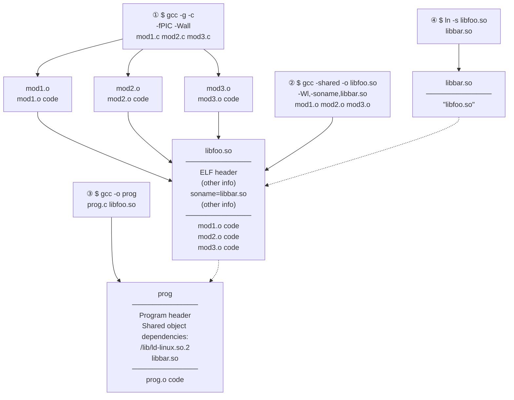
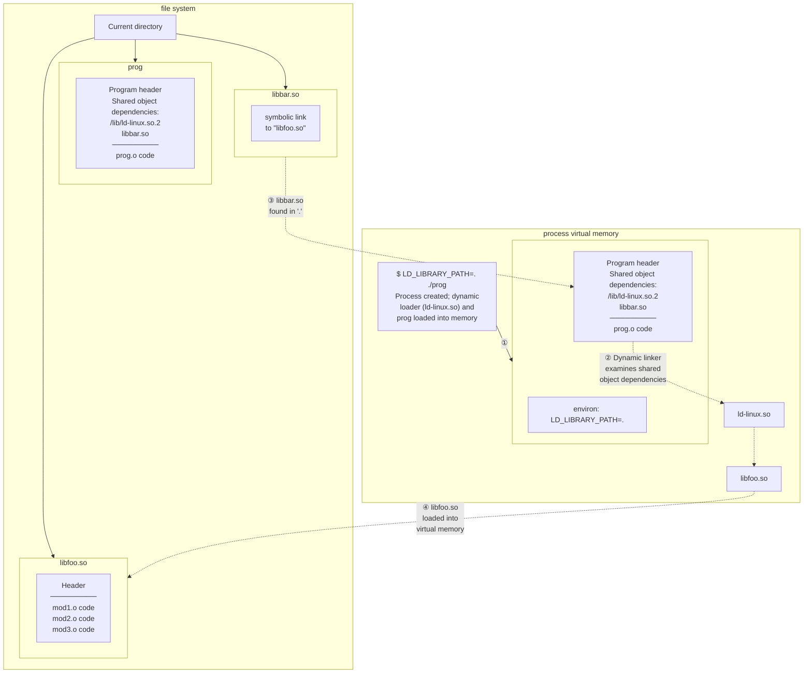

## Chương 41
# **KIẾN THỨC CƠ BẢN VỀ SHARED LIBRARY**

Shared library là kỹ thuật đặt các hàm thư viện vào một đơn vị duy nhất có thể được chia sẻ bởi nhiều process vào thời điểm chạy. Kỹ thuật này có thể tiết kiệm cả dung lượng đĩa lẫn RAM. Chương này đề cập đến những kiến thức cơ bản về shared library. Chương tiếp theo đề cập đến một số tính năng nâng cao của shared library.

### **41.1 Object Library**

Một cách để xây dựng một chương trình là đơn giản biên dịch từng file nguồn của nó để tạo ra các object file tương ứng, rồi liên kết tất cả các object file này lại với nhau để tạo ra chương trình thực thi, như sau:

```
$ cc -g -c prog.c mod1.c mod2.c mod3.c
$ cc -g -o prog_nolib prog.o mod1.o mod2.o mod3.o
```

Việc liên kết thực ra được thực hiện bởi chương trình linker riêng biệt, `ld`. Khi chúng ta liên kết một chương trình bằng lệnh `cc` (hoặc `gcc`), trình biên dịch gọi `ld` ở phía sau. Trên Linux, linker nên luôn được gọi gián tiếp thông qua `gcc`, vì `gcc` đảm bảo rằng `ld` được gọi với các tùy chọn đúng và liên kết chương trình với các file thư viện đúng.

Tuy nhiên, trong nhiều trường hợp, chúng ta có thể có các file nguồn được sử dụng bởi nhiều chương trình. Như một bước đầu tiên để tiết kiệm công việc, chúng ta có thể biên dịch các file nguồn này chỉ một lần, và sau đó liên kết chúng vào các file thực thi khác nhau khi cần thiết. Mặc dù kỹ thuật này tiết kiệm thời gian biên dịch, nó vẫn có nhược điểm là chúng ta phải liệt kê tất cả các object file trong giai đoạn liên kết. Hơn nữa, các thư mục của chúng ta có thể bị lộn xộn một cách bất tiện với một số lượng lớn các object file.

Để khắc phục những vấn đề này, chúng ta có thể nhóm một tập hợp các object file thành một đơn vị duy nhất, được gọi là object library. Object library có hai loại: static và shared. Shared library là loại object library hiện đại hơn và cung cấp một số ưu điểm so với static library, như chúng ta mô tả trong Mục [41.3].

### **Lưu ý bên lề: bao gồm thông tin debugger khi biên dịch chương trình**

Trong lệnh `cc` được hiển thị ở trên, chúng ta đã sử dụng tùy chọn `–g` để bao gồm thông tin debug trong chương trình được biên dịch. Nhìn chung, đó là ý tưởng tốt để luôn tạo các chương trình và thư viện cho phép debug. (Trước đây, thông tin debug đôi khi bị bỏ qua để file thực thi kết quả sử dụng ít dung lượng đĩa và RAM hơn, nhưng ngày nay đĩa và RAM đều rẻ.)

Ngoài ra, trên một số kiến trúc, chẳng hạn như x86-32, tùy chọn `–fomit–frame–pointer` không nên được chỉ định vì điều này làm cho việc debug trở nên không thể. (Trên một số kiến trúc, chẳng hạn như x86-64, tùy chọn này được bật theo mặc định vì nó không ngăn việc debug.) Vì lý do tương tự, các file thực thi và thư viện không nên bị loại bỏ thông tin debug bằng `strip(1)`.

# **41.2 Static Library**

Trước khi bắt đầu thảo luận về shared library, chúng ta bắt đầu với mô tả ngắn gọn về static library để làm rõ sự khác biệt và ưu điểm của shared library.

Static library, còn được gọi là archive, là loại thư viện đầu tiên được cung cấp trên các hệ thống UNIX. Chúng cung cấp các lợi ích sau:

- Chúng ta có thể đặt một tập hợp các object file thường được sử dụng vào một file thư viện duy nhất mà sau đó có thể được sử dụng để build nhiều file thực thi, mà không cần phải biên dịch lại các file nguồn gốc khi build từng ứng dụng.
- Các lệnh liên kết trở nên đơn giản hơn. Thay vì liệt kê một chuỗi dài các object file trên dòng lệnh liên kết, chúng ta chỉ cần chỉ định tên của static library. Linker biết cách tìm kiếm trong static library và trích xuất các object được yêu cầu bởi file thực thi.

### **Tạo và duy trì một static library**

Thực chất, một static library chỉ đơn giản là một file chứa các bản sao của tất cả các object file được thêm vào nó. Archive cũng ghi lại các thuộc tính khác nhau của mỗi object file thành phần, bao gồm quyền truy cập file, user ID và group ID dạng số, và thời gian sửa đổi lần cuối. Theo quy ước, static library có tên theo dạng `libname.a`.

Một static library được tạo và duy trì bằng lệnh `ar(1)`, có dạng chung như sau:

\$ **ar** *options archive object-file*...

Đối số `options` bao gồm một chuỗi các chữ cái, một trong số đó là mã thao tác, trong khi các chữ cái còn lại là bộ sửa đổi ảnh hưởng đến cách thao tác được thực hiện. Một số mã thao tác thường được sử dụng như sau:

 `r` (replace): Chèn một object file vào archive, thay thế bất kỳ object file trước đó có cùng tên. Đây là phương pháp tiêu chuẩn để tạo và cập nhật archive. Vì vậy, chúng ta có thể build một archive bằng các lệnh sau:

```
$ cc -g -c mod1.c mod2.c mod3.c
$ ar r libdemo.a mod1.o mod2.o mod3.o
$ rm mod1.o mod2.o mod3.o
```

Như được hiển thị ở trên, sau khi build thư viện, chúng ta có thể xóa các object file gốc nếu muốn, vì chúng không còn được yêu cầu nữa.

 `t` (table of contents): Hiển thị mục lục của archive. Theo mặc định, điều này chỉ liệt kê tên của các object file trong archive. Bằng cách thêm bộ sửa đổi `v` (verbose), chúng ta sẽ thấy thêm tất cả các thuộc tính khác được ghi trong archive cho mỗi object file, như trong ví dụ sau:

```
$ ar tv libdemo.a
rw-r--r-- 1000/100 1001016 Nov 15 12:26 2009 mod1.o
rw-r--r-- 1000/100 406668 Nov 15 12:21 2009 mod2.o
rw-r--r-- 1000/100 46672 Nov 15 12:21 2009 mod3.o
```

Các thuộc tính bổ sung mà chúng ta thấy cho mỗi object, từ trái sang phải, là quyền truy cập của nó khi được thêm vào archive, user ID và group ID của nó, kích thước của nó và ngày giờ khi nó được sửa đổi lần cuối.

 `d` (delete): Xóa một module có tên khỏi archive, như trong ví dụ này:

```
$ ar d libdemo.a mod3.o
```

#### **Sử dụng static library**

Chúng ta có thể liên kết một chương trình với static library theo hai cách. Cách đầu tiên là đặt tên static library như một phần của lệnh liên kết, như sau:

```
$ cc -g -c prog.c
$ cc -g -o prog prog.o libdemo.a
```

Ngoài ra, chúng ta có thể đặt thư viện vào một trong các thư mục tiêu chuẩn mà linker tìm kiếm (ví dụ: `/usr/lib`), và sau đó chỉ định tên thư viện (tức là tên file của thư viện không có tiền tố `lib` và hậu tố `.a`) bằng tùy chọn `–l`:

```
$ cc -g -o prog prog.o -ldemo
```

Nếu thư viện nằm trong một thư mục thường không được linker tìm kiếm, chúng ta có thể chỉ định rằng linker nên tìm kiếm thêm thư mục này bằng tùy chọn `–L`:

```
$ cc -g -o prog prog.o -Lmylibdir -ldemo
```

Mặc dù một static library có thể chứa nhiều object module, linker chỉ bao gồm những module mà chương trình yêu cầu.

Sau khi liên kết chương trình, chúng ta có thể chạy nó theo cách thông thường:

\$ **./prog** Called mod1-x1 Called mod2-x2

# **41.3 Tổng quan về Shared Library**

Khi một chương trình được build bằng cách liên kết với static library (hoặc, không sử dụng thư viện nào), file thực thi kết quả bao gồm các bản sao của tất cả các object file được liên kết vào chương trình. Vì vậy, khi nhiều file thực thi khác nhau sử dụng cùng các object module, mỗi file thực thi có bản sao riêng của các object module. Sự dư thừa mã này có một số nhược điểm:

- Dung lượng đĩa bị lãng phí khi lưu trữ nhiều bản sao của cùng các object module. Sự lãng phí đó có thể đáng kể.
- Nếu nhiều chương trình khác nhau sử dụng cùng các module đang chạy cùng một lúc, thì mỗi chương trình giữ các bản sao riêng của các object module trong virtual memory, do đó làm tăng tổng nhu cầu virtual memory của hệ thống.
- Nếu cần thay đổi (có thể là bản vá bảo mật hoặc sửa lỗi) một object module trong static library, thì tất cả các file thực thi sử dụng module đó phải được liên kết lại để kết hợp thay đổi. Nhược điểm này càng được khuếch đại bởi thực tế là quản trị viên hệ thống cần biết ứng dụng nào đã được liên kết với thư viện.

Shared library được thiết kế để giải quyết những thiếu sót này. Ý tưởng chính của shared library là một bản sao duy nhất của các object module được chia sẻ bởi tất cả các chương trình yêu cầu các module. Các object module không được sao chép vào file thực thi được liên kết; thay vào đó, một bản sao duy nhất của thư viện được nạp vào bộ nhớ vào thời điểm chạy, khi chương trình đầu tiên yêu cầu các module từ shared library được khởi động. Khi các chương trình khác sử dụng cùng shared library được thực thi sau đó, chúng sử dụng bản sao của thư viện đã được nạp vào bộ nhớ. Việc sử dụng shared library có nghĩa là các chương trình thực thi yêu cầu ít dung lượng hơn trên đĩa và (khi chạy) trong virtual memory.

> Mặc dù mã của shared library được chia sẻ giữa nhiều process, các biến của nó thì không. Mỗi process sử dụng thư viện có bản sao riêng của các biến global và static được định nghĩa trong thư viện.

Shared library cung cấp các ưu điểm tiếp theo sau:

- Vì tổng kích thước chương trình nhỏ hơn, trong một số trường hợp, các chương trình có thể được nạp vào bộ nhớ và bắt đầu nhanh hơn. Điều này chỉ đúng với các shared library lớn đã được sử dụng bởi chương trình khác. Chương trình đầu tiên nạp một shared library thực sự sẽ mất nhiều thời gian hơn để bắt đầu, vì shared library phải được tìm thấy và nạp vào bộ nhớ.
- Vì các object module không được sao chép vào các file thực thi, mà được duy trì tập trung trong shared library, nên có thể (tùy thuộc vào các giới hạn được mô tả trong Mục [41.8]) thực hiện các thay đổi đối với các object module mà không yêu cầu các chương trình phải được liên kết lại để thấy các thay đổi. Những thay đổi như vậy có thể được thực hiện ngay cả khi các chương trình đang chạy đang sử dụng phiên bản hiện có của shared library.

Chi phí chính của chức năng bổ sung này là:

- Shared library phức tạp hơn static library, cả ở cấp độ khái niệm, lẫn ở cấp độ thực tế của việc tạo shared library và build các chương trình sử dụng chúng.
- Shared library phải được biên dịch để sử dụng position-independent code (được mô tả trong Mục 41.4.2), có chi phí hiệu suất trên hầu hết các kiến trúc vì nó yêu cầu sử dụng thêm một register ([Hubička, 2003]).
- Symbol relocation phải được thực hiện vào thời điểm chạy. Trong quá trình symbol relocation, các tham chiếu đến mỗi symbol (một biến hoặc hàm) trong shared library cần được sửa đổi để tương ứng với vị trí thực tế vào thời điểm chạy mà symbol được đặt trong virtual memory. Do quá trình relocation này, một chương trình sử dụng shared library có thể mất nhiều thời gian thực thi hơn một chút so với chương trình tương đương được liên kết tĩnh.

Một cách sử dụng khác của shared library là làm khối xây dựng trong *Java Native Interface* (JNI), cho phép mã Java trực tiếp truy cập các tính năng của hệ điều hành cơ bản bằng cách gọi các hàm C trong shared library. Để biết thêm thông tin, xem [Liang, 1999] và [Rochkind, 2004].

### 41.4 Tạo và Sử dụng Shared Library — Lần Đầu Tiếp Cận

Để bắt đầu hiểu cách shared library hoạt động, chúng ta xem trình tự bước tối thiểu cần thiết để build và sử dụng shared library. Hiện tại, chúng ta sẽ bỏ qua quy ước thường được sử dụng để đặt tên cho các file shared library. Quy ước này, được mô tả trong Mục 41.6, cho phép các chương trình tự động nạp phiên bản cập nhật nhất của các thư viện chúng yêu cầu, và cũng cho phép nhiều phiên bản không tương thích (được gọi là *major version*) của thư viện cùng tồn tại hòa bình.

Trong chương này, chúng ta chỉ quan tâm đến shared library theo định dạng Executable and Linking Format (ELF), vì ELF là định dạng được sử dụng cho các file thực thi và shared library trong các phiên bản Linux hiện đại, cũng như trong nhiều triển khai UNIX khác.

ELF thay thế các định dạng cũ hơn *a.out* và *COFF*.

### 41.4.1 Tạo Shared Library

Để build một phiên bản shared của static library chúng ta đã tạo trước đó, chúng ta thực hiện các bước sau:

```
$ gcc -g -c -fPIC -Wall mod1.c mod2.c mod3.c
$ gcc -g -shared -o libfoo.so mod1.o mod2.o mod3.o
```

Lệnh đầu tiên trong số này tạo ra ba object module sẽ được đưa vào thư viện. (Chúng ta giải thích tùy chọn *cc -fPIC* trong phần tiếp theo.) Lệnh *cc -shared* tạo ra shared library chứa ba object module.

Theo quy ước, shared library có tiền tố `lib` và hậu tố `.so` (viết tắt của *shared object*).

Trong các ví dụ của chúng ta, chúng ta sử dụng lệnh `gcc`, thay vì lệnh `cc` tương đương, để nhấn mạnh rằng các tùy chọn dòng lệnh chúng ta đang sử dụng để tạo shared library phụ thuộc vào trình biên dịch. Sử dụng trình biên dịch C khác trên triển khai UNIX khác có thể yêu cầu các tùy chọn khác.

Lưu ý rằng có thể biên dịch các file nguồn và tạo shared library trong một lệnh duy nhất:

```
$ gcc -g -fPIC -Wall mod1.c mod2.c mod3.c -shared -o libfoo.so
```

Tuy nhiên, để phân biệt rõ ràng các bước biên dịch và build thư viện, chúng ta sẽ viết hai lệnh này thành các lệnh riêng biệt trong các ví dụ được hiển thị trong chương này.

Không giống như static library, không thể thêm hoặc xóa các object module riêng lẻ từ shared library đã được build trước đó. Như với các file thực thi thông thường, các object file trong shared library không còn duy trì danh tính riêng biệt.

### **41.4.2 Position-Independent Code**

Tùy chọn `cc –fPIC` chỉ định rằng trình biên dịch nên tạo position-independent code. Điều này thay đổi cách trình biên dịch tạo mã cho các thao tác như truy cập các biến global, static và external; truy cập các hằng số chuỗi; và lấy địa chỉ của các hàm. Những thay đổi này cho phép mã được đặt ở bất kỳ địa chỉ virtual nào vào thời điểm chạy. Điều này cần thiết cho shared library, vì không có cách nào để biết vào thời điểm liên kết mã shared library sẽ được đặt ở đâu trong bộ nhớ. (Vị trí bộ nhớ vào thời điểm chạy của shared library phụ thuộc vào các yếu tố khác nhau, chẳng hạn như lượng bộ nhớ đã được sử dụng bởi chương trình đang nạp thư viện và những shared library nào khác mà chương trình đã nạp.)

Trên Linux/x86-32, có thể tạo shared library bằng các module được biên dịch mà không có tùy chọn `–fPIC`. Tuy nhiên, làm vậy mất đi một số lợi ích của shared library, vì các trang của text chương trình chứa các tham chiếu bộ nhớ phụ thuộc vào vị trí không được chia sẻ giữa các process. Trên một số kiến trúc, không thể build shared library mà không có tùy chọn `–fPIC`.

Để xác định xem một object file hiện tại đã được biên dịch với tùy chọn `–fPIC` hay chưa, chúng ta có thể kiểm tra sự có mặt của tên `_GLOBAL_OFFSET_TABLE_` trong symbol table của object file, sử dụng một trong các lệnh sau:

```
$ nm mod1.o | grep _GLOBAL_OFFSET_TABLE_
$ readelf -s mod1.o | grep _GLOBAL_OFFSET_TABLE_
```

Ngược lại, nếu một trong các lệnh tương đương sau đây tạo ra bất kỳ đầu ra nào, thì shared library được chỉ định bao gồm ít nhất một object module không được biên dịch với `–fPIC`:

```
$ objdump --all-headers libfoo.so | grep TEXTREL
$ readelf -d libfoo.so | grep TEXTREL
```

Chuỗi `TEXTREL` chỉ ra sự có mặt của một object module có text segment chứa một tham chiếu yêu cầu relocation vào thời điểm chạy.

Chúng ta sẽ nói thêm về các lệnh `nm`, `readelf` và `objdump` trong Mục [41.5].

### **41.4.3 Sử dụng Shared Library**

Để sử dụng shared library, hai bước phải xảy ra mà không được yêu cầu đối với các chương trình sử dụng static library:

- Vì file thực thi không còn chứa các bản sao của các object file mà nó yêu cầu, nó phải có một số cơ chế để xác định shared library mà nó cần vào thời điểm chạy. Điều này được thực hiện bằng cách nhúng tên của shared library vào trong file thực thi trong giai đoạn liên kết. (Trong thuật ngữ ELF, dependency thư viện được ghi trong một thẻ `DT_NEEDED` trong file thực thi.) Danh sách tất cả các dependency shared library của chương trình được gọi là dynamic dependency list.
- Vào thời điểm chạy, phải có một số cơ chế để giải quyết tên thư viện được nhúng — tức là, để tìm file shared library tương ứng với tên được chỉ định trong file thực thi — và sau đó nạp thư viện vào bộ nhớ nếu nó chưa có.

Việc nhúng tên của thư viện vào file thực thi xảy ra tự động khi chúng ta liên kết chương trình với shared library:

```
$ gcc -g -Wall -o prog prog.c libfoo.so
```

Nếu bây giờ chúng ta cố gắng chạy chương trình, chúng ta sẽ nhận được thông báo lỗi sau:

```
$ ./prog
./prog: error in loading shared libraries: libfoo.so: cannot
open shared object file: No such file or directory
```

Điều này đưa chúng ta đến bước thứ hai cần thiết: dynamic linking, là nhiệm vụ giải quyết tên thư viện được nhúng vào thời điểm chạy. Nhiệm vụ này được thực hiện bởi dynamic linker (còn được gọi là dynamic linking loader hoặc run-time linker). Dynamic linker chính nó là shared library, có tên `/lib/ld-linux.so.2`, được sử dụng bởi mọi file thực thi ELF sử dụng shared library.

> Pathname `/lib/ld-linux.so.2` thường là symbolic link trỏ đến file thực thi dynamic linker. File này có tên `ld-version.so`, trong đó `version` là phiên bản glibc được cài đặt trên hệ thống — ví dụ `ld-2.11.so`. Pathname của dynamic linker khác trên một số kiến trúc. Ví dụ, trên IA-64, symbolic link dynamic linker được đặt tên là `/lib/ld-linux-ia64.so.2`.

Dynamic linker kiểm tra danh sách shared library được yêu cầu bởi một chương trình và sử dụng một tập hợp các quy tắc được xác định trước để tìm các file thư viện trong file system. Một số quy tắc này chỉ định một tập hợp các thư mục tiêu chuẩn mà shared library thường nằm trong đó. Ví dụ, nhiều shared library nằm trong `/lib` và `/usr/lib`. Thông báo lỗi ở trên xảy ra vì thư viện của chúng ta nằm trong thư mục làm việc hiện tại, không phải là một phần của danh sách tiêu chuẩn được tìm kiếm bởi dynamic linker.

> Một số kiến trúc (ví dụ: zSeries, PowerPC64 và x86-64) hỗ trợ thực thi cả chương trình 32-bit và 64-bit. Trên các hệ thống đó, các thư viện 32-bit nằm trong các thư mục con `*/lib`, và các thư viện 64-bit nằm trong các thư mục con `*/lib64`.

### **Biến môi trường LD\_LIBRARY\_PATH**

Một cách thông báo cho dynamic linker rằng shared library nằm trong một thư mục không tiêu chuẩn là chỉ định thư mục đó như một phần của danh sách thư mục được phân tách bằng dấu hai chấm trong biến môi trường `LD_LIBRARY_PATH`. (Dấu chấm phẩy cũng có thể được sử dụng để phân tách các thư mục, trong trường hợp đó danh sách phải được đặt trong dấu ngoặc kép để ngăn shell diễn giải dấu chấm phẩy.) Nếu `LD_LIBRARY_PATH` được định nghĩa, thì dynamic linker tìm kiếm shared library trong các thư mục nó liệt kê trước khi tìm trong các thư mục thư viện tiêu chuẩn. (Sau đó, chúng ta sẽ thấy rằng một ứng dụng sản xuất không bao giờ nên dựa vào `LD_LIBRARY_PATH`, nhưng hiện tại, biến này cung cấp cho chúng ta một cách đơn giản để bắt đầu với shared library.) Vì vậy, chúng ta có thể chạy chương trình bằng lệnh sau:

```
$ LD_LIBRARY_PATH=. ./prog
Called mod1-x1
Called mod2-x2
```

Cú pháp shell (bash, Korn và Bourne) được sử dụng trong lệnh trên tạo ra một định nghĩa biến môi trường trong process thực thi `prog`. Định nghĩa này cho dynamic linker biết cần tìm kiếm shared library trong `.`, thư mục làm việc hiện tại.

> Đặc tả thư mục rỗng trong danh sách `LD_LIBRARY_PATH` (ví dụ: đặc tả ở giữa trong `dirx::diry`) tương đương với `.`, thư mục làm việc hiện tại (nhưng lưu ý rằng việc đặt `LD_LIBRARY_PATH` thành chuỗi rỗng không đạt được cùng kết quả). Chúng ta tránh cách sử dụng này (SUSv3 không khuyến khích cách sử dụng tương ứng trong biến môi trường `PATH`).

### **So sánh static linking và dynamic linking**

Thông thường, thuật ngữ linking được sử dụng để mô tả việc sử dụng linker, `ld`, để kết hợp một hoặc nhiều object file được biên dịch thành một file thực thi duy nhất. Đôi khi, thuật ngữ static linking được sử dụng để phân biệt bước này với dynamic linking, là việc nạp shared library được sử dụng bởi file thực thi vào thời điểm chạy. (Static linking đôi khi cũng được gọi là link editing, và static linker như `ld` đôi khi được gọi là link editor.) Mọi chương trình — bao gồm cả những chương trình sử dụng shared library — đều trải qua giai đoạn static-linking. Vào thời điểm chạy, một chương trình sử dụng shared library cũng trải qua dynamic linking.

### **41.4.4 Soname của Shared Library**

Trong ví dụ trình bày cho đến nay, tên được nhúng vào file thực thi và được dynamic linker tìm kiếm vào thời điểm chạy là tên thực tế của file shared library. Điều này được gọi là real name của thư viện. Tuy nhiên, có thể — thực tế, thường gặp hơn — tạo shared library với một loại alias, gọi là soname (thẻ `DT_SONAME` trong thuật ngữ ELF).

Nếu shared library có soname, thì trong quá trình static linking, soname được nhúng vào file thực thi thay vì real name, và sau đó được dynamic linker sử dụng khi tìm kiếm thư viện vào thời điểm chạy. Mục đích của soname là cung cấp một mức độ chuyển hướng cho phép một file thực thi sử dụng, vào thời điểm chạy, một phiên bản của shared library khác (nhưng tương thích) với thư viện mà nó đã được liên kết.

Trong Mục [41.6], chúng ta sẽ xem xét các quy ước được sử dụng cho real name và soname của shared library. Hiện tại, chúng ta trình bày một ví dụ đơn giản để minh họa các nguyên tắc.

Bước đầu tiên khi sử dụng soname là chỉ định nó khi shared library được tạo:

```
$ gcc -g -c -fPIC -Wall mod1.c mod2.c mod3.c
$ gcc -g -shared -Wl,-soname,libbar.so -o libfoo.so mod1.o mod2.o mod3.o
```

Tùy chọn `–Wl,–soname,libbar.so` là hướng dẫn cho linker để đánh dấu shared library `libfoo.so` với soname `libbar.so`.

Nếu chúng ta muốn xác định soname của shared library hiện tại, chúng ta có thể sử dụng một trong các lệnh sau:

```
$ objdump -p libfoo.so | grep SONAME
 SONAME libbar.so
$ readelf -d libfoo.so | grep SONAME
 0x0000000e (SONAME) Library soname: [libbar.so]
```

Sau khi đã tạo shared library với soname, chúng ta tạo file thực thi như thông thường:

```
$ gcc -g -Wall -o prog prog.c libfoo.so
```

Tuy nhiên, lần này, linker phát hiện rằng thư viện `libfoo.so` chứa soname `libbar.so` và nhúng tên sau vào file thực thi.

Bây giờ khi chúng ta cố gắng chạy chương trình, đây là những gì chúng ta thấy:

```
$ LD_LIBRARY_PATH=. ./prog
prog: error in loading shared libraries: libbar.so: cannot open
shared object file: No such file or directory
```

Vấn đề ở đây là dynamic linker không thể tìm thấy bất cứ thứ gì có tên `libbar.so`. Khi sử dụng soname, một bước tiếp theo được yêu cầu: chúng ta phải tạo symbolic link từ soname đến real name của thư viện. Symbolic link này phải được tạo trong một trong các thư mục được dynamic linker tìm kiếm. Vì vậy, chúng ta có thể chạy chương trình của mình như sau:

```
$ ln -s libfoo.so libbar.so Create soname symbolic link in current directory
$ LD_LIBRARY_PATH=. ./prog
Called mod1-x1
Called mod2-x2
```

Hình 41-1 hiển thị các bước biên dịch và liên kết liên quan đến việc tạo shared library với soname được nhúng, liên kết chương trình với shared library đó và tạo soname symbolic link cần thiết để chạy chương trình.



**Hình 41-1:** Tạo shared library và liên kết chương trình với nó

Hình 41-2 hiển thị các bước xảy ra khi chương trình được tạo trong Hình 41-1 được nạp vào bộ nhớ để chuẩn bị thực thi.

Để tìm hiểu shared library nào một process hiện đang sử dụng, chúng ta có thể liệt kê nội dung của file `/proc/PID/maps` dành riêng cho Linux tương ứng (Mục 48.5).



**Hình 41-2:** Thực thi một chương trình nạp shared library

### **41.5 Các Công cụ Hữu ích khi Làm việc với Shared Library**

Trong mục này, chúng ta mô tả ngắn gọn một vài công cụ hữu ích để phân tích shared library, file thực thi và các file object (.o) được biên dịch.

#### **Lệnh ldd**

Lệnh `ldd(1)` (list dynamic dependencies) hiển thị các shared library mà một chương trình (hoặc shared library) cần để chạy. Đây là một ví dụ:

```
$ ldd prog
 libdemo.so.1 => /usr/lib/libdemo.so.1 (0x40019000)
 libc.so.6 => /lib/tls/libc.so.6 (0x4017b000)
 /lib/ld-linux.so.2 => /lib/ld-linux.so.2 (0x40000000)
```

Lệnh `ldd` giải quyết từng tham chiếu thư viện (sử dụng cùng các quy ước tìm kiếm như dynamic linker) và hiển thị kết quả theo dạng sau:

```
library-name => resolves-to-path
```

Đối với hầu hết các file thực thi ELF, `ldd` sẽ liệt kê ít nhất các entry cho `ld-linux.so.2`, dynamic linker, và `libc.so.6`, thư viện C tiêu chuẩn.

> Tên của thư viện C khác trên một số kiến trúc. Ví dụ, thư viện này được đặt tên là `libc.so.6.1` trên IA-64 và Alpha.

#### **Các lệnh objdump và readelf**

Lệnh `objdump` có thể được sử dụng để lấy các thông tin khác nhau — bao gồm mã máy nhị phân đã được dịch ngược — từ file thực thi, object được biên dịch hoặc shared library. Nó cũng có thể được sử dụng để hiển thị thông tin từ các header của các phần ELF khác nhau của những file này; trong cách sử dụng này, nó giống `readelf`, vốn hiển thị thông tin tương tự, nhưng theo định dạng khác. Các nguồn thông tin thêm về `objdump` và `readelf` được liệt kê ở cuối chương này.

### **Lệnh nm**

Lệnh `nm` liệt kê tập hợp các symbol được định nghĩa trong một object library hoặc chương trình thực thi. Một cách sử dụng lệnh này là tìm ra thư viện nào trong số một vài thư viện định nghĩa một symbol. Ví dụ, để tìm ra thư viện nào định nghĩa hàm `crypt()`, chúng ta có thể làm như sau:

```
$ nm -A /usr/lib/lib*.so 2> /dev/null | grep ' crypt$'
/usr/lib/libcrypt.so:00007080 W crypt
```

Tùy chọn `–A` cho `nm` chỉ định rằng tên thư viện nên được liệt kê ở đầu mỗi dòng hiển thị một symbol. Điều này cần thiết vì, theo mặc định, `nm` liệt kê tên thư viện một lần, và sau đó, trên các dòng tiếp theo, tất cả các symbol mà nó chứa, không hữu ích cho loại lọc được hiển thị trong ví dụ trên. Ngoài ra, chúng ta loại bỏ đầu ra lỗi tiêu chuẩn để ẩn các thông báo lỗi về các file theo định dạng không được `nm` nhận ra. Từ đầu ra trên, chúng ta có thể thấy rằng `crypt()` được định nghĩa trong thư viện libcrypt.

# **41.6 Phiên bản và Quy ước Đặt tên Shared Library**

Hãy xem xét những gì được liên quan đến việc phiên bản shared library. Thông thường, các phiên bản kế tiếp nhau của shared library tương thích với nhau, nghĩa là các hàm trong mỗi module trình bày cùng giao diện gọi và tương đương về ngữ nghĩa (tức là, chúng đạt được kết quả giống hệt nhau). Các phiên bản khác nhau nhưng tương thích như vậy được gọi là minor version của shared library. Tuy nhiên, đôi khi cần thiết phải tạo một major version mới của thư viện — một phiên bản không tương thích với phiên bản trước. (Trong Mục [41.8], chúng ta sẽ thấy chính xác hơn điều gì có thể gây ra sự không tương thích như vậy.) Đồng thời, vẫn phải có thể tiếp tục chạy các chương trình yêu cầu phiên bản cũ hơn của thư viện.

Để giải quyết các yêu cầu phiên bản này, một quy ước đặt tên tiêu chuẩn được sử dụng cho real name và soname của shared library.

#### **Real name, soname và linker name**

Mỗi phiên bản không tương thích của shared library được phân biệt bởi một định danh major version duy nhất, hình thành một phần của real name của nó. Theo quy ước, định danh major version có dạng một số được tăng dần tuần tự theo từng phiên bản không tương thích của thư viện. Ngoài định danh major version, real name cũng bao gồm định danh minor version, phân biệt các minor version tương thích trong major version của thư viện. Real name sử dụng quy ước định dạng `libname.so.major-id.minor-id`.

Giống như định danh major version, định danh minor version có thể là bất kỳ chuỗi nào, nhưng theo quy ước, nó là một số, hoặc hai số được phân tách bằng dấu chấm, với số đầu tiên xác định minor version, và số thứ hai chỉ ra mức patch hoặc số sửa đổi trong minor version. Một số ví dụ về real name của shared library như sau:

```
libdemo.so.1.0.1
libdemo.so.1.0.2 Minor version, compatible with version 1.0.1
libdemo.so.2.0.0 New major version, incompatible with version 1.*
libreadline.so.5.0
```

Soname của shared library bao gồm cùng định danh major version như real name thư viện tương ứng của nó, nhưng loại trừ định danh minor version. Vì vậy, soname có dạng `libname.so.major-id`.

Thông thường, soname được tạo như một symbolic link tương đối trong thư mục chứa real name. Sau đây là một số ví dụ về soname, cùng với các real name mà chúng có thể được liên kết symbolic:

```
libdemo.so.1 -> libdemo.so.1.0.2
libdemo.so.2 -> libdemo.so.2.0.0
libreadline.so.5 -> libreadline.so.5.0
```

Đối với một major version cụ thể của shared library, có thể có nhiều file thư viện được phân biệt bởi các định danh minor version khác nhau. Thông thường, soname tương ứng với mỗi major library version trỏ đến minor version mới nhất trong major version (như được hiển thị trong các ví dụ trên cho libdemo.so). Cài đặt này cho phép ngữ nghĩa phiên bản đúng trong quá trình hoạt động vào thời điểm chạy của shared library. Vì giai đoạn static-linking nhúng một bản sao của soname (độc lập với minor version) vào file thực thi, và symbolic link soname có thể được sửa đổi sau đó để trỏ đến minor version mới hơn của shared library, nên có thể đảm bảo rằng file thực thi nạp minor version cập nhật nhất của thư viện vào thời điểm chạy. Hơn nữa, vì các major version khác nhau của thư viện có soname khác nhau, chúng có thể cùng tồn tại hòa bình và được truy cập bởi các chương trình yêu cầu chúng.

Ngoài real name và soname, một tên thứ ba thường được định nghĩa cho mỗi shared library: linker name, được sử dụng khi liên kết file thực thi với shared library. Linker name là symbolic link chứa tên thư viện mà không có định danh major hoặc minor version, và do đó có dạng `libname.so`. Linker name cho phép chúng ta xây dựng các lệnh liên kết độc lập với phiên bản tự động hoạt động với phiên bản đúng (tức là, cập nhật nhất) của shared library.

Thông thường, linker name được tạo trong cùng thư mục như file mà nó tham chiếu. Nó có thể được liên kết đến real name hoặc soname của major version mới nhất của thư viện. Thông thường, liên kết đến soname được ưu tiên hơn, để các thay đổi đối với soname tự động được phản ánh trong linker name. (Trong Mục [41.7], chúng ta sẽ thấy rằng chương trình `ldconfig` tự động hóa nhiệm vụ cập nhật soname, và do đó ngầm duy trì linker name nếu chúng ta sử dụng quy ước vừa mô tả.)

> Nếu chúng ta muốn liên kết chương trình với major version cũ hơn của shared library, chúng ta không thể sử dụng linker name. Thay vào đó, như một phần của lệnh liên kết, chúng ta sẽ cần chỉ ra (major) version được yêu cầu bằng cách chỉ định một real name hoặc soname cụ thể.

Sau đây là một số ví dụ về linker name:

```
libdemo.so -> libdemo.so.2
libreadline.so -> libreadline.so.5
```

[Bảng 41-1] tóm tắt thông tin về real name, soname và linker name của shared library, và [Hình 41-3] mô tả mối quan hệ giữa các tên này.

| Tên         | Định dạng             | Mô tả                                                                                                                                                                                                                               |
|-------------|--------------------|---------------------------------------------------------------------------------------------------------------------------------------------------------------------------------------------------------------------------|
| real name   | `libname.so.maj.min` | File chứa mã thư viện; một instance cho mỗi phiên bản major cộng với minor của thư viện.                                                                                                                                   |
| soname      | `libname.so.maj`     | Một instance cho mỗi major version của thư viện; được nhúng vào file thực thi vào thời điểm liên kết; được sử dụng vào thời điểm chạy để tìm thư viện thông qua symbolic link cùng tên trỏ đến real name tương ứng (cập nhật nhất). |
| linker name | `libname.so`         | Symbolic link đến real name mới nhất hoặc (thường gặp hơn) soname mới nhất; một instance duy nhất; cho phép xây dựng các lệnh liên kết độc lập với phiên bản.                                                                       |

```text
real name              soname                linker name
   libname.so.maj.min     libname.so.maj         libname.so
  ┌──────────────────┐   ┌────────────────────┐  ┌────────────────────┐
  │  (regular file)  │◄--│  (symbolic link)   │◄-│  (symbolic link)   │
  │  Object code for │   │ libname.so.maj.min  │  │  libname.so.maj    │
  │ library modules  │   └────────────────────┘  └────────────────────┘
  └──────────────────┘
```

**Hình 41-3:** Cách sắp xếp tên shared library theo quy ước

#### **Tạo shared library theo quy ước tiêu chuẩn**

Tổng hợp tất cả thông tin trên, chúng ta bây giờ chỉ ra cách build thư viện minh họa theo quy ước tiêu chuẩn. Đầu tiên, chúng ta tạo các object file:

```
$ gcc -g -c -fPIC -Wall mod1.c mod2.c mod3.c
```

Sau đó chúng ta tạo shared library với real name `libdemo.so.1.0.1` và soname `libdemo.so.1`.

```
$ gcc -g -shared -Wl,-soname,libdemo.so.1 -o libdemo.so.1.0.1 \
 mod1.o mod2.o mod3.o
```

Tiếp theo, chúng ta tạo các symbolic link phù hợp cho soname và linker name:

```
$ ln -s libdemo.so.1.0.1 libdemo.so.1
$ ln -s libdemo.so.1 libdemo.so
```

Chúng ta có thể dùng `ls` để xác minh cài đặt (với `awk` được sử dụng để chọn các trường quan tâm):

```
$ ls -l libdemo.so* | awk '{print $1, $9, $10, $11}'
lrwxrwxrwx libdemo.so -> libdemo.so.1
lrwxrwxrwx libdemo.so.1 -> libdemo.so.1.0.1
-rwxr-xr-x libdemo.so.1.0.1
```

Sau đó chúng ta có thể build file thực thi bằng linker name (lưu ý rằng lệnh liên kết không đề cập đến số phiên bản), và chạy chương trình như thường:

```
$ gcc -g -Wall -o prog prog.c -L. -ldemo
$ LD_LIBRARY_PATH=. ./prog
Called mod1-x1
Called mod2-x2
```

## **41.7 Cài đặt Shared Library**

Trong các ví dụ cho đến nay, chúng ta đã tạo shared library trong thư mục riêng của người dùng, và sau đó sử dụng biến môi trường `LD_LIBRARY_PATH` để đảm bảo dynamic linker tìm kiếm thư mục đó. Cả người dùng có đặc quyền lẫn không có đặc quyền đều có thể sử dụng kỹ thuật này. Tuy nhiên, kỹ thuật này không nên được sử dụng trong các ứng dụng sản xuất. Thông thường hơn, shared library và các symbolic link liên quan của nó được cài đặt trong một trong nhiều thư mục thư viện tiêu chuẩn, cụ thể là một trong những thư mục sau:

- `/usr/lib`, thư mục mà hầu hết các thư viện tiêu chuẩn được cài đặt;
- `/lib`, thư mục mà các thư viện được yêu cầu trong quá trình khởi động hệ thống nên được cài đặt (vì trong quá trình khởi động hệ thống, `/usr/lib` có thể chưa được mount);
- `/usr/local/lib`, thư mục mà các thư viện không tiêu chuẩn hoặc thực nghiệm nên được cài đặt (việc đặt thư viện trong thư mục này cũng hữu ích nếu `/usr/lib` là network mount được chia sẻ giữa nhiều hệ thống và chúng ta muốn cài đặt thư viện chỉ để sử dụng trên hệ thống này); hoặc
- một trong các thư mục được liệt kê trong `/etc/ld.so.conf` (được mô tả sau đây).

Trong hầu hết các trường hợp, việc sao chép file vào một trong các thư mục này yêu cầu đặc quyền superuser.

Sau khi cài đặt, các symbolic link cho soname và linker name phải được tạo, thường là các symbolic link tương đối trong cùng thư mục với file thư viện. Vì vậy, để cài đặt thư viện minh họa của chúng ta trong `/usr/lib` (quyền truy cập của nó chỉ cho phép cập nhật bởi root), chúng ta sẽ làm như sau:

```
$ su
Password:
# mv libdemo.so.1.0.1 /usr/lib
```

```
# cd /usr/lib
# ln -s libdemo.so.1.0.1 libdemo.so.1
# ln -s libdemo.so.1 libdemo.so
```

Hai dòng cuối trong phiên shell này tạo các symbolic link soname và linker name.

#### **ldconfig**

Chương trình `ldconfig(8)` giải quyết hai vấn đề tiềm ẩn với shared library:

- Shared library có thể nằm trong nhiều thư mục khác nhau. Nếu dynamic linker cần tìm kiếm tất cả các thư mục này để tìm một thư viện, thì việc nạp thư viện có thể rất chậm.
- Khi các phiên bản mới của thư viện được cài đặt hoặc các phiên bản cũ bị xóa, các symbolic link soname có thể trở nên lỗi thời.

Chương trình `ldconfig` giải quyết những vấn đề này bằng cách thực hiện hai nhiệm vụ:

1. Nó tìm kiếm một tập hợp tiêu chuẩn các thư mục và tạo hoặc cập nhật file cache, `/etc/ld.so.cache`, để chứa danh sách (minor version mới nhất của mỗi major library version trong) tất cả các thư mục này. Dynamic linker đổi lại sử dụng file cache này khi giải quyết tên thư viện vào thời điểm chạy. Để build cache, `ldconfig` tìm kiếm các thư mục được chỉ định trong file `/etc/ld.so.conf` và sau đó `/lib` và `/usr/lib`. File `/etc/ld.so.conf` bao gồm danh sách các pathname thư mục (những thư mục này nên được chỉ định là pathname tuyệt đối), được phân tách bằng dòng mới, khoảng trắng, tab, dấu phẩy hoặc dấu hai chấm. Trong một số bản phân phối, thư mục `/usr/local/lib` được bao gồm trong danh sách này. (Nếu không, chúng ta có thể cần thêm nó theo cách thủ công.)

   Lệnh `ldconfig –p` hiển thị nội dung hiện tại của `/etc/ld.so.cache`.

2. Nó kiểm tra minor version mới nhất (tức là phiên bản có số minor cao nhất) của mỗi major version của mỗi thư viện để tìm soname được nhúng và sau đó tạo (hoặc cập nhật) các symbolic link tương đối cho mỗi soname trong cùng thư mục.

Để thực hiện chính xác các hành động này, `ldconfig` yêu cầu các thư viện được đặt tên theo quy ước được mô tả trước đó (tức là real name của thư viện bao gồm định danh major và minor tăng thích hợp từ phiên bản thư viện này sang phiên bản tiếp theo).

Theo mặc định, `ldconfig` thực hiện cả hai hành động trên. Các tùy chọn dòng lệnh có thể được sử dụng để tắt có chọn lọc một trong hai hành động: tùy chọn `–N` ngăn việc rebuild cache, và tùy chọn `–X` ngăn việc tạo các symbolic link soname. Ngoài ra, tùy chọn `–v` (verbose) khiến `ldconfig` hiển thị đầu ra mô tả các hành động của nó.

Chúng ta nên chạy `ldconfig` bất cứ khi nào một thư viện mới được cài đặt, thư viện hiện có được cập nhật hoặc xóa, hoặc danh sách các thư mục trong `/etc/ld.so.conf` được thay đổi.

Như một ví dụ về hoạt động của `ldconfig`, giả sử chúng ta muốn cài đặt hai major version khác nhau của thư viện. Chúng ta sẽ làm điều này như sau:

```
$ su
Password:
# mv libdemo.so.1.0.1 libdemo.so.2.0.0 /usr/lib
```

```
# ldconfig -v | grep libdemo
 libdemo.so.1 -> libdemo.so.1.0.1 (changed)
 libdemo.so.2 -> libdemo.so.2.0.0 (changed)
```

Ở trên, chúng ta lọc đầu ra của `ldconfig`, để chúng ta chỉ thấy thông tin liên quan đến các thư viện có tên `libdemo`.

Tiếp theo, chúng ta liệt kê các file có tên `libdemo` trong `/usr/lib` để xác minh cài đặt của các symbolic link soname:

```
# cd /usr/lib
# ls -l libdemo* | awk '{print $1, $$9, $10, $11}'
lrwxrwxrwx libdemo.so.1 -> libdemo.so.1.0.1
-rwxr-xr-x libdemo.so.1.0.1
lrwxrwxrwx libdemo.so.2 -> libdemo.so.2.0.0
-rwxr-xr-x libdemo.so.2.0.0
```

Chúng ta vẫn phải tạo symbolic link cho linker name, như được hiển thị trong lệnh tiếp theo:

```
# ln -s libdemo.so.2 libdemo.so
```

Tuy nhiên, nếu chúng ta cài đặt minor version 2.x mới của thư viện, thì, vì linker name trỏ đến soname mới nhất, `ldconfig` có tác dụng cũng giữ linker name cập nhật, như ví dụ sau cho thấy:

```
# mv libdemo.so.2.0.1 /usr/lib
# ldconfig -v | grep libdemo
 libdemo.so.1 -> libdemo.so.1.0.1
 libdemo.so.2 -> libdemo.so.2.0.1 (changed)
```

Nếu chúng ta đang build và sử dụng thư viện riêng (tức là thư viện không được cài đặt trong một trong các thư mục tiêu chuẩn), chúng ta có thể dùng `ldconfig` tạo symbolic link soname cho chúng ta bằng tùy chọn `–n`. Điều này chỉ định rằng `ldconfig` chỉ nên xử lý các thư viện trong các thư mục trên dòng lệnh và không nên cập nhật file cache. Trong ví dụ sau, chúng ta sử dụng `ldconfig` để xử lý các thư viện trong thư mục làm việc hiện tại:

```
$ gcc -g -c -fPIC -Wall mod1.c mod2.c mod3.c
$ gcc -g -shared -Wl,-soname,libdemo.so.1 -o libdemo.so.1.0.1 \
 mod1.o mod2.o mod3.o
$ /sbin/ldconfig -nv .
.:
 libdemo.so.1 -> libdemo.so.1.0.1
$ ls -l libdemo.so* | awk '{print $1, $9, $10, $11}'
lrwxrwxrwx libdemo.so.1 -> libdemo.so.1.0.1
-rwxr-xr-x libdemo.so.1.0.1
```

Trong ví dụ trên, chúng ta đã chỉ định đường dẫn đầy đủ khi chạy `ldconfig`, vì chúng ta đang sử dụng tài khoản không có đặc quyền mà biến môi trường `PATH` của nó không bao gồm thư mục `/sbin`.

### **41.8 Các Thư viện Tương thích và Không Tương thích**

Theo thời gian, chúng ta có thể cần thực hiện các thay đổi đối với mã của shared library. Những thay đổi như vậy dẫn đến phiên bản mới của thư viện tương thích với (các) phiên bản trước, nghĩa là chúng ta chỉ cần thay đổi định danh minor version của real name của thư viện, hoặc không tương thích, nghĩa là chúng ta phải định nghĩa major version mới của thư viện.

Một thay đổi đối với thư viện tương thích với phiên bản thư viện hiện tại nếu tất cả các điều kiện sau đây đều đúng:

- Ngữ nghĩa của mỗi hàm và biến public trong thư viện không thay đổi. Nói cách khác, mỗi hàm giữ cùng danh sách đối số, và tiếp tục tạo ra hiệu ứng được chỉ định của nó trên các biến global và đối số được trả về, và trả về cùng giá trị kết quả. Vì vậy, các thay đổi dẫn đến cải thiện hiệu suất hoặc sửa lỗi (dẫn đến tuân thủ chặt chẽ hơn với hành vi được chỉ định) có thể được coi là các thay đổi tương thích.
- Không có hàm hoặc biến nào trong API public của thư viện bị xóa. Tuy nhiên, việc thêm các hàm và biến mới vào API public là tương thích.
- Các cấu trúc được cấp phát bên trong và trả về bởi mỗi hàm không thay đổi. Tương tự, các cấu trúc public được xuất bởi thư viện không thay đổi. Một ngoại lệ cho quy tắc này là, trong một số trường hợp nhất định, các mục mới có thể được thêm vào cuối cấu trúc hiện có, mặc dù ngay cả điều này có thể gặp phải các vấn đề nếu, ví dụ, chương trình gọi cố gắng cấp phát mảng của loại cấu trúc này. Các nhà thiết kế thư viện đôi khi phá vỡ giới hạn này bằng cách định nghĩa các cấu trúc được xuất lớn hơn những gì được yêu cầu trong phiên bản đầu tiên của thư viện, với một số trường padding dự phòng là "reserved for future use."

Nếu không có điều kiện nào trong số này bị vi phạm, thì tên thư viện mới có thể được cập nhật bằng cách điều chỉnh minor version của tên hiện có. Ngược lại, nên tạo major version mới của thư viện.

### **41.9 Nâng cấp Shared Library**

Một trong những ưu điểm của shared library là major hoặc minor version mới của thư viện có thể được cài đặt ngay cả khi các chương trình đang chạy đang sử dụng phiên bản hiện có. Tất cả những gì chúng ta cần làm là tạo phiên bản thư viện mới, cài đặt nó vào thư mục thích hợp, và cập nhật các symbolic link soname và linker name khi cần (hoặc thường hơn là để `ldconfig` làm việc đó cho chúng ta). Để tạo minor version mới (tức là nâng cấp tương thích) của shared library `/usr/lib/libdemo.1.0.1`, chúng ta sẽ làm như sau:

```
$ su
Password:
# gcc -g -c -fPIC -Wall mod1.c mod2.c mod3.c
# gcc -g -shared -Wl,-soname,libdemo.so.1 -o libdemo.so.1.0.2 \
 mod1.o mod2.o mod3.o
# mv libdemo.so.1.0.2 /usr/lib
# ldconfig -v | grep libdemo
 libdemo.so.1 -> libdemo.so.1.0.2 (changed)
```

Giả sử linker name đã được thiết lập đúng (tức là trỏ đến soname của thư viện), chúng ta sẽ không cần sửa đổi nó.

Các chương trình đang chạy sẽ tiếp tục sử dụng minor version trước đó của shared library. Chỉ khi chúng bị chấm dứt và khởi động lại, chúng mới sử dụng minor version mới của shared library.

Nếu sau đó chúng ta muốn tạo major version mới (2.0.0) của shared library, chúng ta sẽ làm như sau:

```
# gcc -g -c -fPIC -Wall mod1.c mod2.c mod3.c
# gcc -g -shared -Wl,-soname,libdemo.so.2 -o libdemo.so.2.0.0 \
 mod1.o mod2.o mod3.o
# mv libdemo.so.2.0.0 /usr/lib
# ldconfig -v | grep libdemo
 libdemo.so.1 -> libdemo.so.1.0.2
 libdemo.so.2 -> libdemo.so.2.0.0 (changed)
# cd /usr/lib
# ln -sf libdemo.so.2 libdemo.so
```

Như có thể thấy trong đầu ra trên, `ldconfig` tự động tạo symbolic link soname cho major version mới. Tuy nhiên, như lệnh cuối cùng cho thấy, chúng ta phải thủ công cập nhật symbolic link linker name.

# **41.10 Chỉ định Thư mục Tìm kiếm Thư viện trong Object File**

Chúng ta đã thấy hai cách thông báo cho dynamic linker về vị trí của shared library: sử dụng biến môi trường `LD_LIBRARY_PATH` và cài đặt shared library vào một trong các thư mục thư viện tiêu chuẩn (`/lib`, `/usr/lib` hoặc một trong các thư mục được liệt kê trong `/etc/ld.so.conf`).

Có cách thứ ba: trong giai đoạn static editing, chúng ta có thể chèn vào file thực thi một danh sách các thư mục nên được tìm kiếm vào thời điểm chạy để tìm shared library. Điều này hữu ích nếu chúng ta có các thư viện nằm trong các vị trí cố định không thuộc số các vị trí tiêu chuẩn mà dynamic linker tìm kiếm. Để làm điều này, chúng ta sử dụng tùy chọn linker `–rpath` khi tạo file thực thi:

```
$ gcc -g -Wall -Wl,-rpath,/home/mtk/pdir -o prog prog.c libdemo.so
```

Lệnh trên sao chép chuỗi `/home/mtk/pdir` vào danh sách run-time library path (rpath) của file thực thi `prog`, vì vậy, khi chương trình được chạy, dynamic linker cũng sẽ tìm kiếm thư mục này khi giải quyết các tham chiếu shared library.

Nếu cần thiết, tùy chọn `–rpath` có thể được chỉ định nhiều lần; tất cả các thư mục được ghép nối thành một danh sách rpath có thứ tự duy nhất được đặt trong file thực thi. Ngoài ra, nhiều thư mục có thể được chỉ định dưới dạng danh sách được phân tách bằng dấu hai chấm trong một tùy chọn `–rpath` duy nhất. Vào thời điểm chạy, dynamic linker tìm kiếm các thư mục theo thứ tự chúng được chỉ định trong (các) tùy chọn `–rpath`.

> Một lựa chọn thay thế cho tùy chọn `–rpath` là biến môi trường `LD_RUN_PATH`. Biến này có thể được gán một chuỗi chứa một loạt các thư mục được phân tách bằng dấu hai chấm sẽ được sử dụng làm danh sách rpath khi build file thực thi. `LD_RUN_PATH` chỉ được sử dụng nếu tùy chọn `–rpath` không được chỉ định khi build file thực thi.

### **Sử dụng tùy chọn linker –rpath khi build shared library**

Tùy chọn linker `–rpath` cũng có thể hữu ích khi build shared library. Giả sử chúng ta có một shared library, `libx1.so`, phụ thuộc vào một library khác, `libx2.so`, như được hiển thị trong [Hình 41-4]. Giả sử thêm rằng các thư viện này nằm trong các thư mục không tiêu chuẩn `d1` và `d2`, tương ứng. Chúng ta bây giờ đi qua các bước cần thiết để build các thư viện này và chương trình sử dụng chúng.

```text
prog              d1/libx1.so           d2/libx2.so
   (prog.c)             (modx1.c)             (modx2.c)
 ┌──────────┐         ┌──────────┐          ┌──────────┐
 │ main() { │────────►│  x1() { │─────────►│  x2() { │
 │   x1();  │         │   x2(); │          │          │
 │ }        │         │ }       │          │ }        │
 └──────────┘         └──────────┘          └──────────┘
```

**Hình 41-4:** Một shared library phụ thuộc vào shared library khác

Đầu tiên, chúng ta build `libx2.so`, trong thư mục `pdir/d2`. (Để giữ cho ví dụ đơn giản, chúng ta bỏ đánh số phiên bản thư viện và soname rõ ràng.)

```
$ cd /home/mtk/pdir/d2
$ gcc -g -c -fPIC -Wall modx2.c
$ gcc -g -shared -o libx2.so modx2.o
```

Tiếp theo, chúng ta build `libx1.so`, trong thư mục `pdir/d1`. Vì `libx1.so` phụ thuộc vào `libx2.so`, không nằm trong thư mục tiêu chuẩn, chúng ta chỉ định vị trí run-time của nó với tùy chọn linker `–rpath`. Điều này có thể khác với vị trí link-time của thư viện (được chỉ định bởi tùy chọn `–L`), mặc dù trong trường hợp này hai vị trí giống nhau.

```
$ cd /home/mtk/pdir/d1
$ gcc -g -c -Wall -fPIC modx1.c
$ gcc -g -shared -o libx1.so modx1.o -Wl,-rpath,/home/mtk/pdir/d2 \
 -L/home/mtk/pdir/d2 -lx2
```

Cuối cùng, chúng ta build chương trình chính, trong thư mục `pdir`. Vì chương trình chính sử dụng `libx1.so`, và thư viện này nằm trong thư mục không tiêu chuẩn, chúng ta lại sử dụng tùy chọn linker `–rpath`:

```
$ cd /home/mtk/pdir
$ gcc -g -Wall -o prog prog.c -Wl,-rpath,/home/mtk/pdir/d1 \
 -L/home/mtk/pdir/d1 -lx1
```

Lưu ý rằng chúng ta không cần đề cập đến `libx2.so` khi liên kết chương trình chính. Vì linker có khả năng phân tích danh sách rpath trong `libx1.so`, nó có thể tìm `libx2.so`, và do đó có thể đáp ứng yêu cầu rằng tất cả các symbol có thể được giải quyết vào thời điểm static link.

Chúng ta có thể sử dụng các lệnh sau để kiểm tra `prog` và `libx1.so` để xem nội dung của các danh sách rpath của chúng:

```
$ objdump -p prog | grep PATH
 RPATH /home/mtk/pdir/d1 libx1.so will be sought here at run time
$ objdump -p d1/libx1.so | grep PATH
 RPATH /home/mtk/pdir/d2 libx2.so will be sought here at run time
```

Chúng ta cũng có thể xem các danh sách rpath bằng cách grep đầu ra của lệnh `readelf ––dynamic` (hoặc tương đương, `readelf –d`).

Chúng ta có thể sử dụng lệnh `ldd` để hiển thị tập hợp đầy đủ các dynamic dependency của `prog`:

```
$ ldd prog
 libx1.so => /home/mtk/pdir/d1/libx1.so (0x40017000)
 libc.so.6 => /lib/tls/libc.so.6 (0x40024000)
 libx2.so => /home/mtk/pdir/d2/libx2.so (0x4014c000)
 /lib/ld-linux.so.2 => /lib/ld-linux.so.2 (0x40000000)
```

### **Các entry ELF DT\_RPATH và DT\_RUNPATH**

Trong đặc tả ELF gốc, chỉ có một loại danh sách rpath có thể được nhúng vào file thực thi hoặc shared library. Điều này tương ứng với thẻ `DT_RPATH` trong file ELF. Các đặc tả ELF sau đó đã không còn dùng `DT_RPATH`, và giới thiệu một thẻ mới, `DT_RUNPATH`, để biểu diễn các danh sách rpath. Sự khác biệt giữa hai loại danh sách rpath này là thứ tự ưu tiên tương đối của chúng so với biến môi trường `LD_LIBRARY_PATH` khi dynamic linker tìm kiếm shared library vào thời điểm chạy: `DT_RPATH` có ưu tiên cao hơn, trong khi `DT_RUNPATH` có ưu tiên thấp hơn (xem Mục [41.11]).

Theo mặc định, linker tạo danh sách rpath dưới dạng thẻ `DT_RPATH`. Để linker thay vào đó tạo danh sách rpath dưới dạng entry `DT_RUNPATH`, chúng ta phải thêm tùy chọn linker `––enable–new–dtags` (enable new dynamic tags). Nếu chúng ta rebuild chương trình bằng tùy chọn này và kiểm tra file thực thi kết quả với `objdump`, chúng ta thấy như sau:

```
$ gcc -g -Wall -o prog prog.c -Wl,--enable-new-dtags \
 -Wl,-rpath,/home/mtk/pdir/d1 -L/home/mtk/pdir/d1 -lx1
$ objdump -p prog | grep PATH
 RPATH /home/mtk/pdir/d1
 RUNPATH /home/mtk/pdir/d1
```

Như có thể thấy, file thực thi chứa cả thẻ `DT_RPATH` lẫn `DT_RUNPATH`. Linker nhân đôi danh sách rpath theo cách này để làm lợi cho các dynamic linker cũ hơn có thể không hiểu thẻ `DT_RUNPATH`. (Hỗ trợ cho `DT_RUNPATH` được thêm vào trong phiên bản 2.2 của glibc.) Các dynamic linker hiểu thẻ `DT_RUNPATH` bỏ qua thẻ `DT_RPATH` (xem Mục [41.11]).

### **Sử dụng \$ORIGIN trong rpath**

Giả sử chúng ta muốn phân phối một ứng dụng sử dụng một số shared library riêng của nó, nhưng chúng ta không muốn yêu cầu người dùng cài đặt các thư viện vào một trong các thư mục tiêu chuẩn. Thay vào đó, chúng ta muốn cho phép người dùng giải nén ứng dụng vào một thư mục tùy ý theo lựa chọn của họ và sau đó ngay lập tức có thể chạy ứng dụng. Vấn đề là ứng dụng không có cách nào xác định được các shared library của nó ở đâu, trừ khi nó yêu cầu người dùng đặt `LD_LIBRARY_PATH` hoặc chúng ta yêu cầu người dùng chạy một số loại installation script xác định các thư mục cần thiết. Không cách nào trong số này là mong muốn.

Để khắc phục vấn đề này, dynamic linker được xây dựng để hiểu một chuỗi đặc biệt, `$ORIGIN` (hoặc tương đương, `${ORIGIN}`), trong đặc tả rpath. Dynamic linker diễn giải chuỗi này có nghĩa là "thư mục chứa ứng dụng". Điều này có nghĩa là chúng ta có thể, ví dụ, build một ứng dụng bằng lệnh sau:

```
$ gcc -Wl,-rpath,'$ORIGIN'/lib ...
```

Điều này giả định rằng vào thời điểm chạy, các shared library của ứng dụng sẽ nằm trong thư mục con `lib` dưới thư mục chứa file thực thi của ứng dụng. Sau đó chúng ta có thể cung cấp cho người dùng một gói cài đặt đơn giản chứa ứng dụng và các thư viện liên quan, và người dùng có thể cài đặt gói ở bất kỳ vị trí nào và sau đó chạy ứng dụng (tức là ứng dụng "turn-key").

# **41.11 Tìm Shared Library vào Thời điểm Chạy**

Khi giải quyết các dependency thư viện, dynamic linker trước tiên kiểm tra từng chuỗi dependency để xem nó có chứa dấu gạch chéo (`/`) hay không, điều này có thể xảy ra nếu chúng ta đã chỉ định một pathname thư viện rõ ràng khi liên kết file thực thi. Nếu tìm thấy dấu gạch chéo, thì chuỗi dependency được diễn giải như một pathname (tuyệt đối hoặc tương đối), và thư viện được nạp bằng pathname đó. Nếu không, dynamic linker tìm kiếm shared library bằng các quy tắc sau:

1. Nếu file thực thi có bất kỳ thư mục nào được liệt kê trong danh sách run-time library path (rpath) `DT_RPATH` và file thực thi không chứa danh sách `DT_RUNPATH`, thì các thư mục này được tìm kiếm (theo thứ tự chúng được cung cấp khi liên kết chương trình).

2. Nếu biến môi trường `LD_LIBRARY_PATH` được định nghĩa, thì mỗi thư mục được phân tách bằng dấu hai chấm được liệt kê trong giá trị của nó được tìm kiếm lần lượt. Nếu file thực thi là chương trình set-user-ID hoặc set-group-ID, thì `LD_LIBRARY_PATH` bị bỏ qua. Đây là biện pháp bảo mật để ngăn người dùng lừa dynamic linker nạp phiên bản riêng của thư viện có cùng tên như thư viện được yêu cầu bởi file thực thi.

3. Nếu file thực thi có bất kỳ thư mục nào được liệt kê trong danh sách run-time library path `DT_RUNPATH`, thì các thư mục này được tìm kiếm (theo thứ tự chúng được cung cấp khi liên kết chương trình).

4. File `/etc/ld.so.cache` được kiểm tra để xem nó có chứa entry cho thư viện hay không.

5. Các thư mục `/lib` và `/usr/lib` được tìm kiếm (theo thứ tự đó).

### **41.12 Giải quyết Symbol vào Thời điểm Chạy**

Giả sử một symbol global (tức là hàm hoặc biến) được định nghĩa ở nhiều vị trí, chẳng hạn như trong file thực thi và shared library, hoặc trong nhiều shared library. Tham chiếu đến symbol đó được giải quyết như thế nào?

Ví dụ, giả sử chúng ta có một chương trình chính và một shared library, cả hai đều định nghĩa một hàm global, `xyz()`, và một hàm khác trong shared library gọi `xyz()`, như được hiển thị trong [Hình 41-5].

```text
prog                          libfoo.so
 ┌─────────────────────────┐   ┌─────────────────────────┐
 │ xyz(){                  │   │ xyz(){                  │
 │     printf("main-xyz\n");│   │     printf("foo-xyz\n"); │
 │ }                       │   │ }                       │
 │                         │   │                         │
 │ main() {                │   │ func() {                │
 │     func();─────────────┼──►│     xyz();              │
 │ }                       │   │ }                       │
 └─────────────────────────┘   └─────────────────────────┘
```

**Hình 41-5:** Giải quyết tham chiếu symbol global

Khi chúng ta build shared library và chương trình thực thi, và sau đó chạy chương trình, đây là những gì chúng ta thấy:

```
$ gcc -g -c -fPIC -Wall -c foo.c
$ gcc -g -shared -o libfoo.so foo.o
$ gcc -g -o prog prog.c libfoo.so
$ LD_LIBRARY_PATH=. ./prog
main-xyz
```

Từ dòng cuối cùng của đầu ra, chúng ta có thể thấy rằng định nghĩa `xyz()` trong chương trình chính ghi đè (interposes) định nghĩa trong shared library.

Mặc dù lúc đầu điều này có vẻ ngạc nhiên, nhưng có lý do lịch sử tốt tại sao mọi thứ được thực hiện theo cách này. Các triển khai shared library đầu tiên được thiết kế để ngữ nghĩa mặc định cho việc giải quyết symbol phản ánh chính xác ngữ nghĩa của các ứng dụng được liên kết với các phiên bản tương đương tĩnh của cùng thư viện. Điều này có nghĩa là các ngữ nghĩa sau đây áp dụng:

- Định nghĩa symbol global trong chương trình chính ghi đè định nghĩa trong thư viện.
- Nếu symbol global được định nghĩa trong nhiều thư viện, thì tham chiếu đến symbol đó được gắn kết với định nghĩa đầu tiên được tìm thấy bằng cách quét các thư viện theo thứ tự từ trái sang phải mà chúng được liệt kê trên dòng lệnh static link.

Mặc dù những ngữ nghĩa này làm cho quá trình chuyển đổi từ static sang shared library tương đối đơn giản, chúng có thể gây ra một số vấn đề. Vấn đề quan trọng nhất là những ngữ nghĩa này mâu thuẫn với mô hình shared library như một hệ thống con độc lập. Theo mặc định, shared library không thể đảm bảo rằng tham chiếu đến một trong các symbol global của nó thực sự sẽ được gắn kết với định nghĩa của thư viện đó về symbol. Do đó, các thuộc tính của shared library có thể thay đổi khi nó được tổng hợp vào một đơn vị lớn hơn. Điều này có thể dẫn đến các ứng dụng bị hỏng theo những cách không mong đợi, và cũng làm khó việc debug kiểu chia để trị (tức là cố gắng tái hiện vấn đề bằng cách sử dụng ít hơn hoặc các shared library khác nhau).

Trong kịch bản trên, nếu chúng ta muốn đảm bảo rằng việc gọi `xyz()` trong shared library thực sự gọi phiên bản của hàm được định nghĩa trong thư viện, thì chúng ta có thể sử dụng tùy chọn linker `–Bsymbolic` khi build shared library:

```
$ gcc -g -c -fPIC -Wall -c foo.c
$ gcc -g -shared -Wl,-Bsymbolic -o libfoo.so foo.o
$ gcc -g -o prog prog.c libfoo.so
$ LD_LIBRARY_PATH=. ./prog
foo-xyz
```

Tùy chọn linker `–Bsymbolic` chỉ định rằng các tham chiếu đến các symbol global trong shared library nên được ưu tiên gắn kết với các định nghĩa (nếu chúng tồn tại) trong thư viện đó. (Lưu ý rằng, bất kể tùy chọn này, việc gọi `xyz()` từ chương trình chính sẽ luôn gọi phiên bản `xyz()` được định nghĩa trong chương trình chính.)

# **41.13 Sử dụng Static Library thay vì Shared Library**

Mặc dù hầu hết thời gian tốt hơn là sử dụng shared library, nhưng đôi khi có những tình huống mà static library có thể phù hợp. Đặc biệt, thực tế là một ứng dụng được liên kết tĩnh chứa tất cả mã mà nó yêu cầu vào thời điểm chạy có thể có lợi. Ví dụ, static linking hữu ích nếu người dùng không thể, hoặc không muốn, cài đặt shared library trên hệ thống nơi chương trình sẽ được sử dụng, hoặc nếu chương trình sẽ được chạy trong một môi trường (có thể là chroot jail, ví dụ) nơi shared library không có sẵn. Ngoài ra, ngay cả nâng cấp shared library tương thích cũng có thể vô tình đưa vào một lỗi phá vỡ ứng dụng. Bằng cách liên kết ứng dụng tĩnh, chúng ta có thể đảm bảo rằng nó không bị ảnh hưởng bởi các thay đổi trong shared library trên hệ thống và rằng nó có tất cả mã cần thiết để chạy (với chi phí kích thước chương trình lớn hơn và yêu cầu đĩa và bộ nhớ tăng lên).

Theo mặc định, khi linker có lựa chọn giữa phiên bản shared và static của cùng tên thư viện (ví dụ: chúng ta liên kết bằng `–Lsomedir –ldemo`, và cả `libdemo.so` lẫn `libdemo.a` đều tồn tại), phiên bản shared của thư viện được sử dụng. Để buộc sử dụng phiên bản static của thư viện, chúng ta có thể làm một trong những điều sau:

- Chỉ định pathname của static library (bao gồm phần mở rộng `.a`) trên dòng lệnh `gcc`.
- Chỉ định tùy chọn `–static` cho `gcc`.
- Sử dụng các tùy chọn `gcc` `–Wl,–Bstatic` và `–Wl,–Bdynamic` để chuyển đổi rõ ràng lựa chọn của linker giữa static và shared library. Các tùy chọn này có thể được xen kẽ với các tùy chọn `–l` trên dòng lệnh `gcc`. Linker xử lý các tùy chọn theo thứ tự chúng được chỉ định.

# **41.14 Tóm tắt**

Object library là tập hợp các object module được biên dịch có thể được sử dụng bởi các chương trình liên kết với thư viện. Giống như các triển khai UNIX khác, Linux cung cấp hai loại object library: static library, vốn là loại thư viện duy nhất có sẵn trong các hệ thống UNIX ban đầu, và shared library hiện đại hơn.

Vì chúng cung cấp một số ưu điểm so với static library, shared library là loại thư viện phổ biến nhất được sử dụng trên các hệ thống UNIX hiện đại. Các ưu điểm của shared library chủ yếu xuất phát từ thực tế là khi một chương trình được liên kết với thư viện, các bản sao của các object module được yêu cầu bởi chương trình không được bao gồm trong file thực thi kết quả. Thay vào đó, (static) linker chỉ bao gồm thông tin trong file thực thi về các shared library được yêu cầu vào thời điểm chạy. Khi file được thực thi, dynamic linker sử dụng thông tin này để nạp các shared library được yêu cầu. Vào thời điểm chạy, tất cả các chương trình sử dụng cùng shared library đều chia sẻ một bản sao duy nhất của thư viện đó trong bộ nhớ. Vì shared library không được sao chép vào các file thực thi, và một bản sao duy nhất trong bộ nhớ của shared library được sử dụng bởi tất cả các chương trình vào thời điểm chạy, shared library giảm lượng dung lượng đĩa và bộ nhớ được yêu cầu bởi hệ thống.

Soname của shared library cung cấp một mức độ chuyển hướng trong việc giải quyết các tham chiếu shared library vào thời điểm chạy. Nếu shared library có soname, thì tên này, thay vì real name của thư viện, được ghi trong file thực thi kết quả được tạo bởi static linker. Một sơ đồ phiên bản, theo đó shared library được đặt tên theo dạng `libname.so.major-id.minor-id`, trong khi soname có dạng `libname.so.major-id`, cho phép tạo ra các chương trình tự động sử dụng minor version mới nhất của shared library (mà không cần yêu cầu các chương trình được liên kết lại), trong khi cũng cho phép tạo major version mới, không tương thích của thư viện.

Để tìm shared library vào thời điểm chạy, dynamic linker tuân theo một tập hợp các quy tắc tìm kiếm tiêu chuẩn, bao gồm việc tìm kiếm một tập hợp các thư mục (ví dụ: `/lib` và `/usr/lib`) trong đó hầu hết shared library được cài đặt.

### **Thông tin thêm**

Nhiều thông tin liên quan đến static và shared library có thể được tìm thấy trong các trang man `ar(1)`, `gcc(1)`, `ld(1)`, `ldconfig(8)`, `ld.so(8)`, `dlopen(3)` và `objdump(1)` và trong tài liệu info cho `ld` và `readelf`. [Drepper, 2004 (b)] đề cập đến nhiều chi tiết tinh tế hơn của việc viết shared library trên Linux. Thông tin hữu ích hơn cũng có thể được tìm thấy trong Program Library HOWTO của David Wheeler, có trực tuyến tại trang web LDP, http://www.tldp.org/. Sơ đồ shared library của GNU có nhiều điểm tương đồng với sơ đồ được triển khai trong Solaris, và do đó đáng để đọc Linker and Libraries Guide của Sun (có tại http://docs.sun.com/) để biết thêm thông tin và ví dụ. [Levine, 2000] cung cấp giới thiệu về hoạt động của static và dynamic linker.

Thông tin về GNU Libtool, một công cụ che giấu lập trình viên khỏi các chi tiết cụ thể của việc build shared library, có thể được tìm thấy trực tuyến tại http://www.gnu.org/software/libtool và trong [Vaughan et al., 2000].

Tài liệu Executable and Linking Format, từ Ủy ban Tiêu chuẩn Giao diện Công cụ, cung cấp chi tiết về ELF. Tài liệu này có thể được tìm thấy trực tuyến tại http://refspecs.freestandards.org/elf/elf.pdf. [Lu, 1995] cũng cung cấp nhiều chi tiết hữu ích về ELF.

# **41.15 Bài tập**

**41-1.** Thử biên dịch một chương trình có và không có tùy chọn `–static`, để xem sự khác biệt về kích thước giữa file thực thi được liên kết động với thư viện C và file thực thi được liên kết với phiên bản tĩnh của thư viện C.
