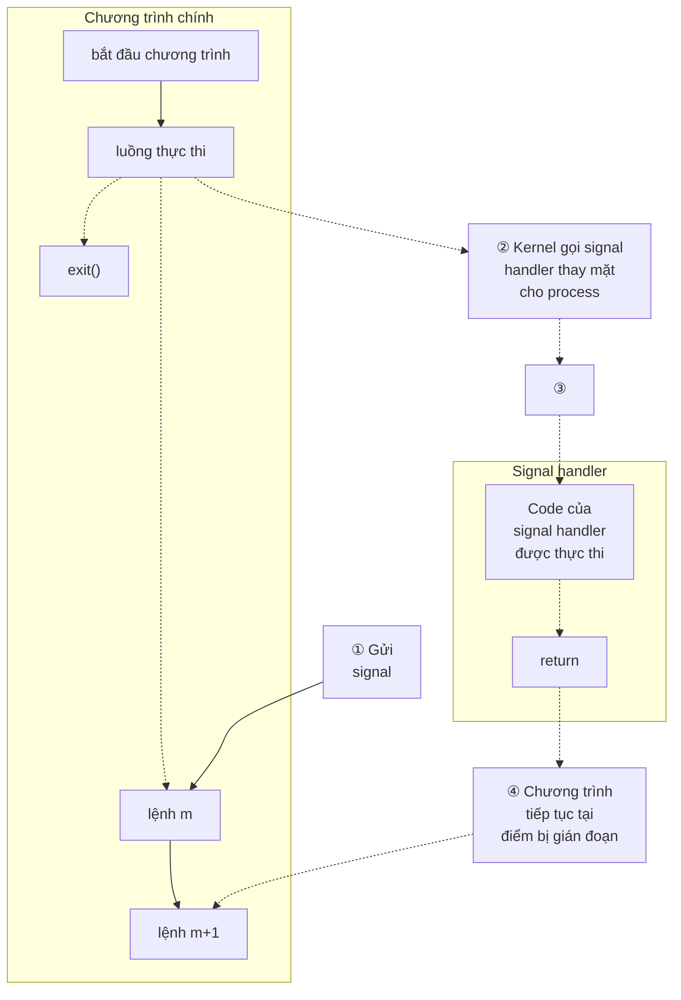

## Chương 20
# **SIGNALS: CÁC KHÁI NIỆM CƠ BẢN**

Chương này và hai chương tiếp theo thảo luận về signal. Mặc dù các khái niệm cơ bản khá đơn giản, nhưng nội dung thảo luận khá dài vì có nhiều chi tiết cần đề cập. Chương này bao gồm các chủ đề sau:

-  các loại signal khác nhau và mục đích sử dụng của chúng;
-  các tình huống mà kernel có thể sinh ra một signal cho một process, và các system call mà một process có thể sử dụng để gửi signal đến một process khác;
-  cách một process phản ứng với signal theo mặc định, và các phương thức mà process có thể thay đổi phản ứng của nó đối với một signal, đặc biệt thông qua việc sử dụng signal handler — một hàm do lập trình viên định nghĩa được tự động gọi khi nhận được signal;
-  việc sử dụng signal mask của process để block signal, và khái niệm liên quan về pending signal; và
-  cách một process có thể tạm dừng thực thi và chờ signal được gửi đến.

### **20.1 Khái niệm và Tổng quan**

Signal là một thông báo gửi đến process rằng một sự kiện nào đó đã xảy ra. Signal đôi khi được gọi là software interrupt. Signal tương tự như hardware interrupt ở chỗ chúng làm gián đoạn luồng thực thi thông thường của chương trình; trong hầu hết các trường hợp, không thể dự đoán chính xác thời điểm signal sẽ đến.

Một process có thể (nếu có quyền phù hợp) gửi signal đến một process khác. Trong trường hợp này, signal có thể được sử dụng như một kỹ thuật đồng bộ hóa, hoặc thậm chí như một dạng interprocess communication (IPC) nguyên thủy. Một process cũng có thể gửi signal cho chính mình. Tuy nhiên, nguồn phổ biến nhất của nhiều signal được gửi đến một process là kernel. Các loại sự kiện khiến kernel sinh ra signal cho một process bao gồm:

-  Một hardware exception đã xảy ra, nghĩa là phần cứng phát hiện ra một điều kiện lỗi và thông báo cho kernel, sau đó kernel gửi signal tương ứng đến process liên quan. Ví dụ về hardware exception bao gồm: thực thi một lệnh machine-language không hợp lệ, chia cho 0, hoặc truy cập vào vùng bộ nhớ không thể truy cập.
-  Người dùng gõ một trong các ký tự đặc biệt trên terminal để sinh ra signal. Các ký tự này bao gồm ký tự interrupt (thường là Control-C) và ký tự suspend (thường là Control-Z).
-  Một software event đã xảy ra. Ví dụ: dữ liệu đầu vào sẵn có trên một file descriptor, cửa sổ terminal bị thay đổi kích thước, một timer hết hạn, process vượt quá giới hạn CPU time, hoặc một child của process này đã kết thúc.

Mỗi signal được định nghĩa là một số nguyên duy nhất (nhỏ), bắt đầu từ 1 theo thứ tự tuần tự. Các số nguyên này được định nghĩa trong `<signal.h>` với các tên ký hiệu có dạng `SIGxxxx`. Vì số thực tế được sử dụng cho mỗi signal thay đổi tùy theo từng triển khai, nên các tên ký hiệu này luôn được sử dụng trong chương trình. Ví dụ, khi người dùng gõ ký tự interrupt, `SIGINT` (signal số 2) được gửi đến process.

Signal được phân thành hai loại lớn. Loại đầu tiên là các signal truyền thống hay tiêu chuẩn, được kernel sử dụng để thông báo cho process về các sự kiện. Trên Linux, các signal tiêu chuẩn được đánh số từ 1 đến 31. Chúng ta sẽ mô tả các signal tiêu chuẩn trong chương này. Loại signal kia là các realtime signal, với những điểm khác biệt so với signal tiêu chuẩn được mô tả trong Phần 22.8.

Một signal được gọi là được sinh ra bởi một sự kiện nào đó. Sau khi được sinh ra, signal sẽ được gửi đến process, sau đó process thực hiện một số hành động để phản ứng. Giữa thời điểm nó được sinh ra và thời điểm nó được gửi đến, signal được gọi là đang pending.

Thông thường, một pending signal được gửi đến process ngay khi process đó được lên lịch chạy tiếp theo, hoặc ngay lập tức nếu process đang chạy (ví dụ, nếu process tự gửi signal cho mình). Tuy nhiên, đôi khi chúng ta cần đảm bảo rằng một đoạn code không bị gián đoạn bởi việc gửi signal. Để làm điều này, chúng ta có thể thêm signal vào signal mask của process — một tập hợp các signal mà việc gửi đến hiện đang bị block. Nếu một signal được sinh ra trong khi nó đang bị block, nó vẫn ở trạng thái pending cho đến khi được unblock (xóa khỏi signal mask). Nhiều system call cho phép process thêm và xóa signal khỏi signal mask của nó.

Khi nhận được signal, process thực hiện một trong các hành động mặc định sau, tùy thuộc vào signal:

-  Signal bị bỏ qua; tức là, nó bị kernel loại bỏ và không có tác động gì đến process. (Process thậm chí không biết nó đã xảy ra.)
-  Process bị kết thúc (killed). Đây đôi khi được gọi là kết thúc process bất thường, trái ngược với kết thúc process bình thường xảy ra khi process kết thúc bằng cách sử dụng `exit()`.
-  Một file core dump được tạo ra, và process bị kết thúc. File core dump chứa ảnh của virtual memory của process, có thể được tải vào debugger để kiểm tra trạng thái của process tại thời điểm nó kết thúc.
-  Process bị dừng lại — việc thực thi process bị tạm dừng.
-  Việc thực thi process được tiếp tục sau khi đã bị dừng trước đó.

Thay vì chấp nhận hành động mặc định cho một signal cụ thể, chương trình có thể thay đổi hành động xảy ra khi signal được gửi đến. Điều này được gọi là thiết lập disposition của signal. Chương trình có thể thiết lập một trong các disposition sau cho một signal:

-  Hành động mặc định sẽ xảy ra. Điều này hữu ích để hoàn tác tác động của một lần gọi trước đó đến `signal()` đã thay đổi disposition của signal sang giá trị khác với mặc định.
-  Signal bị bỏ qua. Điều này hữu ích cho signal mà hành động mặc định là kết thúc process.
-  Một signal handler được thực thi.

Signal handler là một hàm, do lập trình viên viết, thực hiện các nhiệm vụ phù hợp để phản ứng với việc gửi signal đến. Ví dụ, shell có handler cho signal `SIGINT` (được sinh ra bởi ký tự interrupt, Control-C) khiến nó dừng những gì đang làm và trả lại quyền điều khiển cho vòng lặp đầu vào chính, để người dùng một lần nữa thấy dấu nhắc shell. Việc thông báo cho kernel rằng một hàm handler nên được gọi thường được gọi là cài đặt hoặc thiết lập signal handler. Khi signal handler được gọi để phản ứng với việc gửi signal đến, chúng ta nói rằng signal đã được xử lý hoặc, đồng nghĩa, đã bị bắt.

Lưu ý rằng không thể thiết lập disposition của signal để kết thúc hoặc dump core (trừ khi đây là disposition mặc định của signal). Cách gần nhất chúng ta có thể làm là cài đặt handler cho signal sau đó gọi `exit()` hoặc `abort()`. Hàm `abort()` (Phần 21.2.2) sinh ra signal `SIGABRT` cho process, khiến nó dump core và kết thúc.

> File `/proc/PID/status` dành riêng cho Linux chứa nhiều trường bit-mask có thể được kiểm tra để xác định cách process xử lý signal. Các bit mask được hiển thị dưới dạng số thập lục phân, với bit ít quan trọng nhất đại diện cho signal 1, bit tiếp theo bên trái đại diện cho signal 2, v.v. Các trường này là `SigPnd` (pending signal theo từng thread), `ShdPnd` (pending signal toàn process; từ Linux 2.6), `SigBlk` (blocked signal), `SigIgn` (ignored signal), và `SigCgt` (caught signal). (Sự khác biệt giữa trường `SigPnd` và `ShdPnd` sẽ rõ ràng khi chúng ta mô tả cách xử lý signal trong các process đa luồng ở Phần 33.2.) Thông tin tương tự cũng có thể được lấy bằng cách sử dụng nhiều tùy chọn khác nhau của lệnh `ps(1)`.

Signal xuất hiện trong các triển khai UNIX rất sớm, nhưng đã trải qua một số thay đổi đáng kể kể từ khi ra đời. Trong các triển khai ban đầu, signal có thể bị mất (tức là, không được gửi đến process đích) trong một số trường hợp nhất định. Hơn nữa, mặc dù đã cung cấp các phương tiện để block việc gửi signal khi thực thi code quan trọng, nhưng trong một số trường hợp, việc blocking không đáng tin cậy. Những vấn đề này đã được khắc phục trong 4.2BSD, cung cấp cái gọi là reliable signal. (Một đổi mới khác của BSD là bổ sung thêm signal để hỗ trợ shell job control, được mô tả trong Phần 34.7.)

System V cũng đã thêm ngữ nghĩa đáng tin cậy vào signal, nhưng sử dụng mô hình không tương thích với BSD. Những điểm không tương thích này chỉ được giải quyết khi tiêu chuẩn POSIX.1-1990 ra đời, tiêu chuẩn này đã áp dụng một đặc tả cho reliable signal chủ yếu dựa trên mô hình BSD.

Chúng ta xem xét chi tiết về reliable và unreliable signal trong Phần 22.7, và mô tả ngắn gọn về các API signal cũ hơn của BSD và System V trong Phần 22.13.

# **20.2 Các Loại Signal và Hành Động Mặc Định**

Trước đó, chúng ta đã đề cập rằng các signal tiêu chuẩn được đánh số từ 1 đến 31 trên Linux. Tuy nhiên, trang manual `signal(7)` của Linux liệt kê hơn 31 tên signal. Số dư tên có thể được giải thích bằng nhiều cách. Một số tên chỉ đơn giản là từ đồng nghĩa cho các tên khác, và được định nghĩa để tương thích nguồn với các triển khai UNIX khác. Các tên khác được định nghĩa nhưng không sử dụng. Danh sách sau đây mô tả các signal khác nhau:

### SIGABRT

Một process được gửi signal này khi nó gọi hàm `abort()` (Phần 21.2.2). Theo mặc định, signal này kết thúc process với một core dump. Điều này đạt được mục đích dự định của lệnh gọi `abort()`: tạo ra core dump để debug.

### SIGALRM

Kernel sinh ra signal này khi hết hạn một real-time timer được thiết lập bởi lệnh gọi `alarm()` hoặc `setitimer()`. Real-time timer là timer đếm theo thời gian thực (tức là, khái niệm thời gian trôi qua của con người). Để biết thêm chi tiết, xem Phần 23.1.

### SIGBUS

Signal này ("bus error") được sinh ra để chỉ một số loại lỗi truy cập bộ nhớ nhất định. Một lỗi như vậy có thể xảy ra khi sử dụng memory mapping được tạo bằng `mmap()`, nếu chúng ta cố gắng truy cập vào địa chỉ nằm ngoài phạm vi của file được memory-mapped bên dưới, như được mô tả trong Phần 49.4.3.

### SIGCHLD

Signal này được gửi (bởi kernel) đến parent process khi một trong các child của nó kết thúc (bằng cách gọi `exit()` hoặc do bị kill bởi một signal). Nó cũng có thể được gửi đến process khi một trong các child của nó bị dừng hoặc tiếp tục bởi một signal. Chúng ta xem xét `SIGCHLD` chi tiết trong Phần 26.3.

SIGCLD

Đây là từ đồng nghĩa với `SIGCHLD`.

SIGCONT

Khi được gửi đến một process đã dừng, signal này khiến process tiếp tục (tức là, được lên lịch chạy vào một thời điểm nào đó sau đó). Khi được nhận bởi process hiện không bị dừng, signal này theo mặc định bị bỏ qua. Process có thể bắt signal này để thực hiện một số hành động khi nó tiếp tục. Signal này được đề cập chi tiết hơn trong Phần 22.2 và 34.7.

SIGEMT

Trong các hệ thống UNIX nói chung, signal này được sử dụng để chỉ một lỗi phần cứng phụ thuộc vào triển khai. Trên Linux, signal này chỉ được sử dụng trong triển khai Sun SPARC. Hậu tố EMT xuất phát từ emulator trap, một gợi nhớ của trình biên dịch hợp ngữ trên máy Digital PDP-11.

SIGFPE

Signal này được sinh ra cho một số loại lỗi số học nhất định, chẳng hạn như chia cho 0. Hậu tố FPE là viết tắt của floating-point exception, mặc dù signal này cũng có thể được sinh ra cho các lỗi số học nguyên. Chi tiết chính xác về thời điểm signal này được sinh ra phụ thuộc vào kiến trúc phần cứng và cài đặt của các thanh ghi điều khiển CPU. Ví dụ, trên x86-32, chia số nguyên cho 0 luôn sinh ra `SIGFPE`, nhưng việc xử lý chia dấu phẩy động cho 0 phụ thuộc vào việc ngoại lệ `FE_DIVBYZERO` có được kích hoạt hay không. Nếu ngoại lệ này được kích hoạt (sử dụng `feenableexcept()`), thì chia dấu phẩy động cho 0 sinh ra `SIGFPE`; ngược lại, nó trả về kết quả theo tiêu chuẩn IEEE cho các toán hạng (biểu diễn dấu phẩy động của vô cực). Xem trang manual `fenv(3)` và `<fenv.h>` để biết thêm thông tin.

SIGHUP

Khi kết nối terminal bị ngắt (hangup), signal này được gửi đến controlling process của terminal. Chúng ta mô tả khái niệm về controlling process và các trường hợp khác nhau mà `SIGHUP` được gửi trong Phần 34.6. Mục đích thứ hai của `SIGHUP` là với các daemon (ví dụ: `init`, `httpd`, và `inetd`). Nhiều daemon được thiết kế để phản ứng với việc nhận `SIGHUP` bằng cách tự khởi tạo lại và đọc lại file cấu hình của chúng. Quản trị hệ thống kích hoạt các hành động này bằng cách gửi `SIGHUP` thủ công đến daemon, bằng cách sử dụng lệnh `kill` rõ ràng hoặc bằng cách thực thi một chương trình hoặc script thực hiện điều tương tự.

SIGILL

Signal này được gửi đến process nếu nó cố gắng thực thi một lệnh machine-language không hợp lệ (tức là, được hình thành không đúng cách).

SIGINFO

Trên Linux, tên signal này là từ đồng nghĩa với `SIGPWR`. Trên các hệ thống BSD, signal `SIGINFO`, được sinh ra bằng cách gõ Control-T, được sử dụng để lấy thông tin trạng thái về foreground process group.

SIGINT

Khi người dùng gõ ký tự terminal interrupt (thường là Control-C), terminal driver gửi signal này đến foreground process group. Hành động mặc định cho signal này là kết thúc process.

SIGIO

Sử dụng system call `fcntl()`, có thể sắp xếp để signal này được sinh ra khi một I/O event (ví dụ: dữ liệu đầu vào sẵn có) xảy ra trên một số loại file descriptor nhất định đang mở, chẳng hạn như các file descriptor dành cho terminal và socket. Tính năng này được mô tả thêm trong Phần 63.3.

SIGIOT

Trên Linux, đây là từ đồng nghĩa với `SIGABRT`. Trên một số triển khai UNIX khác, signal này chỉ ra một lỗi phần cứng được định nghĩa bởi triển khai.

SIGKILL

Đây là signal kill chắc chắn. Nó không thể bị block, bỏ qua, hoặc bắt bởi handler, và do đó luôn kết thúc process.

SIGLOST

Tên signal này tồn tại trên Linux, nhưng không được sử dụng. Trên một số triển khai UNIX khác, NFS client gửi signal này đến các process cục bộ đang giữ lock nếu NFS client không thể lấy lại các lock do các process đó nắm giữ sau khi phục hồi NFS server từ xa bị crash. (Tính năng này không được chuẩn hóa trong các đặc tả NFS.)

SIGPIPE

Signal này được sinh ra khi một process cố gắng ghi vào pipe, FIFO, hoặc socket mà không có process đọc tương ứng. Điều này thường xảy ra vì process đọc đã đóng file descriptor của nó cho kênh IPC. Xem Phần 44.2 để biết thêm chi tiết.

SIGPOLL

Signal này, xuất phát từ System V, là từ đồng nghĩa với `SIGIO` trên Linux.

SIGPROF

Kernel sinh ra signal này khi hết hạn profiling timer được thiết lập bởi lệnh gọi `setitimer()` (Phần 23.1). Profiling timer là timer đếm thời gian CPU được process sử dụng. Không giống như virtual timer (xem `SIGVTALRM` bên dưới), profiling timer đếm thời gian CPU được sử dụng cả trong user mode và kernel mode.

SIGPWR

Đây là signal báo mất điện. Trên các hệ thống có nguồn điện dự phòng liên tục (UPS), có thể thiết lập một daemon process theo dõi mức pin dự phòng trong trường hợp mất điện. Nếu pin sắp hết (sau một thời gian mất điện kéo dài), thì monitoring process gửi `SIGPWR` đến process `init`, nó diễn giải signal này như một yêu cầu tắt hệ thống một cách nhanh chóng và có trật tự.

### SIGQUIT

Khi người dùng gõ ký tự quit (thường là Control-\) trên bàn phím, signal này được gửi đến foreground process group. Theo mặc định, signal này kết thúc process và khiến nó tạo ra core dump, sau đó có thể được sử dụng để debug. Sử dụng `SIGQUIT` theo cách này hữu ích với chương trình bị kẹt trong vòng lặp vô hạn hoặc không phản ứng theo cách khác. Bằng cách gõ Control-\ rồi tải core dump kết quả bằng debugger `gdb` và sử dụng lệnh `backtrace` để lấy stack trace, chúng ta có thể tìm ra phần code của chương trình đang thực thi. ([Matloff, 2008] mô tả cách sử dụng `gdb`.)

### SIGSEGV

Signal rất phổ biến này được sinh ra khi chương trình thực hiện tham chiếu bộ nhớ không hợp lệ. Tham chiếu bộ nhớ có thể không hợp lệ vì page được tham chiếu không tồn tại (ví dụ: nó nằm trong vùng không được ánh xạ đâu đó giữa heap và stack), process cố gắng cập nhật vị trí trong bộ nhớ chỉ đọc (ví dụ: text segment của chương trình hoặc vùng mapped memory được đánh dấu là chỉ đọc), hoặc process cố gắng truy cập một phần kernel memory trong khi đang chạy ở user mode (Phần 2.1). Trong C, các sự kiện này thường xảy ra do dereference một pointer chứa địa chỉ xấu (ví dụ: pointer chưa được khởi tạo) hoặc truyền đối số không hợp lệ trong lệnh gọi hàm. Tên của signal này xuất phát từ thuật ngữ segmentation violation.

### SIGSTKFLT

Được ghi lại trong `signal(7)` là "stack fault on coprocessor", signal này được định nghĩa nhưng không được sử dụng trên Linux.

### SIGSTOP

Đây là signal stop chắc chắn. Nó không thể bị block, bỏ qua, hoặc bắt bởi handler; do đó, nó luôn dừng process.

### SIGSYS

Signal này được sinh ra nếu process thực hiện một system call "xấu". Điều này có nghĩa là process đã thực thi một lệnh được hiểu là system call trap, nhưng số system call liên quan không hợp lệ (tham khảo Phần 3.1).

### SIGTERM

Đây là signal tiêu chuẩn được sử dụng để kết thúc process và là signal mặc định được gửi bởi lệnh `kill` và `killall`. Đôi khi người dùng gửi rõ ràng signal `SIGKILL` đến process bằng `kill –KILL` hoặc `kill –9`. Tuy nhiên, đây thường là sai lầm. Một ứng dụng được thiết kế tốt sẽ có handler cho `SIGTERM` khiến ứng dụng kết thúc một cách duyên dáng, dọn dẹp các file tạm thời và giải phóng các tài nguyên khác trước đó. Kill một process bằng `SIGKILL` bỏ qua handler `SIGTERM`. Do đó, chúng ta nên luôn thử kết thúc process bằng `SIGTERM` trước, và dành `SIGKILL` như biện pháp cuối cùng để kill các process bỏ chạy không phản ứng với `SIGTERM`.

### SIGTRAP

Signal này được sử dụng để triển khai debugger breakpoint và system call tracing, như được thực hiện bởi `strace(1)` (Phụ lục A). Xem trang manual `ptrace(2)` để biết thêm thông tin.

### SIGTSTP

Đây là signal dừng job-control, được gửi để dừng foreground process group khi người dùng gõ ký tự suspend (thường là Control-Z) trên bàn phím. Chương 34 mô tả chi tiết về process group (job) và job control, cũng như chi tiết về thời điểm và cách chương trình có thể cần xử lý signal này. Tên của signal này xuất phát từ "terminal stop."

### SIGTTIN

Khi chạy dưới job-control shell, terminal driver gửi signal này đến background process group khi nó cố gắng `read()` từ terminal. Signal này theo mặc định dừng process.

### SIGTTOU

Signal này phục vụ mục đích tương tự như `SIGTTIN`, nhưng dành cho đầu ra terminal của các background job. Khi chạy dưới job-control shell, nếu tùy chọn `TOSTOP` (terminal output stop) đã được kích hoạt cho terminal (có thể thông qua lệnh `stty tostop`), terminal driver gửi `SIGTTOU` đến background process group khi nó cố gắng `write()` ra terminal (xem Phần 34.7.1). Signal này theo mặc định dừng process.

### SIGUNUSED

Như tên ngụ ý, signal này không được sử dụng. Trên Linux 2.4 và các phiên bản sau, tên signal này đồng nghĩa với `SIGSYS` trên nhiều kiến trúc. Nói cách khác, số signal này không còn được sử dụng nữa trên những kiến trúc đó, mặc dù tên signal vẫn giữ để tương thích ngược.

### SIGURG

Signal này được gửi đến process để chỉ sự hiện diện của dữ liệu out-of-band (còn gọi là urgent) trên socket (Phần 61.13.1).

### SIGUSR1

Signal này và `SIGUSR2` có sẵn cho các mục đích do lập trình viên định nghĩa. Kernel không bao giờ sinh ra các signal này cho process. Các process có thể sử dụng các signal này để thông báo cho nhau về các sự kiện hoặc đồng bộ với nhau. Trong các triển khai UNIX ban đầu, đây là hai signal duy nhất có thể được sử dụng tự do trong các ứng dụng. (Thực ra, các process có thể gửi bất kỳ signal nào cho nhau, nhưng điều này có khả năng gây nhầm lẫn nếu kernel cũng sinh ra một trong các signal đó cho process.) Các triển khai UNIX hiện đại cung cấp một tập hợp lớn các realtime signal cũng có sẵn cho các mục đích do lập trình viên định nghĩa (Phần 22.8).

### SIGUSR2

Xem mô tả của `SIGUSR1`.

### SIGVTALRM

Kernel sinh ra signal này khi hết hạn một virtual timer được thiết lập bởi lệnh gọi `setitimer()` (Phần 23.1). Virtual timer là timer đếm thời gian CPU ở user mode được process sử dụng.

### SIGWINCH

Trong môi trường cửa sổ, signal này được gửi đến foreground process group khi kích thước cửa sổ terminal thay đổi (do người dùng thay đổi thủ công hoặc do chương trình thay đổi thông qua lệnh gọi `ioctl()`, như được mô tả trong Phần 62.9). Bằng cách cài đặt handler cho signal này, các chương trình như `vi` và `less` có thể biết để vẽ lại đầu ra của chúng sau khi kích thước cửa sổ thay đổi.

### SIGXCPU

Signal này được gửi đến process khi nó vượt quá giới hạn tài nguyên thời gian CPU (`RLIMIT_CPU`, được mô tả trong Phần 36.3).

### SIGXFSZ

Signal này được gửi đến process nếu nó cố gắng (sử dụng `write()` hoặc `truncate()`) tăng kích thước file vượt quá giới hạn tài nguyên kích thước file của process (`RLIMIT_FSIZE`, được mô tả trong Phần 36.3).

Bảng 20-1 tóm tắt nhiều thông tin về signal trên Linux. Lưu ý các điểm sau về bảng này:

-  Cột số signal cho thấy số được gán cho signal này trên các kiến trúc phần cứng khác nhau. Ngoại trừ khi được chỉ ra khác, signal có cùng số trên tất cả các kiến trúc. Sự khác biệt về số signal theo kiến trúc được chỉ ra trong ngoặc đơn, và xảy ra trên các kiến trúc Sun SPARC và SPARC64 (S), HP/Compaq/Digital Alpha (A), MIPS (M), và HP PA-RISC (P). Trong cột này, undef chỉ ra rằng ký hiệu không được định nghĩa trên các kiến trúc được chỉ ra.
-  Cột SUSv3 chỉ ra liệu signal có được chuẩn hóa trong SUSv3 hay không.
-  Cột Default chỉ ra hành động mặc định của signal: term có nghĩa là signal kết thúc process, core có nghĩa là process tạo ra file core dump và kết thúc, ignore có nghĩa là signal bị bỏ qua, stop có nghĩa là signal dừng process, và cont có nghĩa là signal tiếp tục process đã dừng.

Một số signal được liệt kê trước đó không được hiển thị trong Bảng 20-1: `SIGCLD` (từ đồng nghĩa với `SIGCHLD`), `SIGINFO` (không sử dụng), `SIGIOT` (từ đồng nghĩa với `SIGABRT`), `SIGLOST` (không sử dụng), và `SIGUNUSED` (từ đồng nghĩa với `SIGSYS` trên nhiều kiến trúc).

**Bảng 20-1:** Các signal trên Linux

| Tên       | Số signal              | Mô tả                            | SUSv3 | Mặc định |
|-----------|------------------------|----------------------------------|-------|---------|
| SIGABRT   | 6                      | Hủy process                    | •     | core    |
| SIGALRM   | 14                     | Real-time timer hết hạn<br>•     |       | term    |
| SIGBUS    | 7 (SAMP=10)            | Lỗi truy cập bộ nhớ<br>•         |       | core    |
| SIGCHLD   | 17 (SA=20, MP=18)      | •<br>Child kết thúc hoặc bị dừng |       | ignore  |
| SIGCONT   | 18 (SA=19, M=25, P=26) | Tiếp tục nếu đã dừng<br>•         |       | cont    |
| SIGEMT    | undef (SAMP=7)         | Lỗi phần cứng                   |       | term    |
| SIGFPE    | 8                      | •<br>Ngoại lệ số học            |       | core    |
| SIGHUP    | 1                      | Ngắt kết nối<br>•                      |       | term    |
| SIGILL    | 4                      | Lệnh không hợp lệ<br>•         |       | core    |
| SIGINT    | 2                      | •<br>Terminal interrupt          |       | term    |
| SIGIO /   | 29 (SA=23, MP=22)      | I/O có thể thực hiện            | •     | term    |
| SIGPOLL   |                        |                                  |       |         |
| SIGKILL   | 9                      | Kill chắc chắn                        | •     | term    |
| SIGPIPE   | 13                     | Pipe bị vỡ                   | •     | term    |
| SIGPROF   | 27 (M=29, P=21)        | Profiling timer hết hạn         | •     | term    |
| SIGPWR    | 30 (SA=29, MP=19)      | Sắp mất điện             |       | term    |
| SIGQUIT   | 3                      | Terminal quit                    | •     | core    |
| SIGSEGV   | 11                     | Tham chiếu bộ nhớ không hợp lệ        | •     | core    |
| SIGSTKFLT | 16 (SAM=undef, P=36)   | Lỗi stack trên coprocessor       |       | term    |
| SIGSTOP   | 19 (SA=17, M=23, P=24) | Stop chắc chắn<br>•                   |       | stop    |
| SIGSYS    | 31 (SAMP=12)           | System call không hợp lệ              | •     | core    |
| SIGTERM   | 15                     | Kết thúc process                | •     | term    |
| SIGTRAP   | 5                      | Trap trace/breakpoint            | •     | core    |
| SIGTSTP   | 20 (SA=18, M=24, P=25) | Terminal stop                    | •     | stop    |
| SIGTTIN   | 21 (M=26, P=27)        | Terminal đọc từ BG            | •     | stop    |
| SIGTTOU   | 22 (M=27, P=28)        | Terminal ghi từ BG           | •     | stop    |
| SIGURG    | 23 (SA=16, M=21, P=29) | Dữ liệu urgent trên socket            | •     | ignore  |
| SIGUSR1   | 10 (SA=30, MP=16)      | Signal do người dùng định nghĩa 1            | •     | term    |
| SIGUSR2   | 12 (SA=31, MP=17)      | Signal do người dùng định nghĩa 2            | •     | term    |
| SIGVTALRM | 26 (M=28, P=20)        | Virtual timer hết hạn            | •     | term    |
| SIGWINCH  | 28 (M=20, P=23)        | Kích thước cửa sổ terminal thay đổi      |       | ignore  |
| SIGXCPU   | 24 (M=30, P=33)        | Vượt quá giới hạn thời gian CPU          | •     | core    |
| SIGXFSZ   | 25 (M=31, P=34)        | Vượt quá giới hạn kích thước file         | •     | core    |

Lưu ý các điểm sau liên quan đến hành vi mặc định được hiển thị cho một số signal nhất định trong Bảng 20-1:

-  Trên Linux 2.2, hành động mặc định cho các signal `SIGXCPU`, `SIGXFSZ`, `SIGSYS`, và `SIGBUS` là kết thúc process mà không tạo ra core dump. Từ kernel 2.4 trở đi, Linux tuân theo các yêu cầu của SUSv3, với các signal này gây ra kết thúc với core dump. Trên một số triển khai UNIX khác, `SIGXCPU` và `SIGXFSZ` được xử lý theo cách tương tự như trên Linux 2.2.
-  `SIGPWR` thường bị bỏ qua theo mặc định trên các triển khai UNIX khác có nó.
-  `SIGIO` bị bỏ qua theo mặc định trên một số triển khai UNIX (đặc biệt là các dẫn xuất BSD).
-  Mặc dù không được chỉ định bởi bất kỳ tiêu chuẩn nào, `SIGEMT` xuất hiện trên hầu hết các triển khai UNIX. Tuy nhiên, signal này thường dẫn đến kết thúc với core dump trên các triển khai khác.
-  Trong SUSv1, hành động mặc định cho `SIGURG` được chỉ định là kết thúc process, và đây là mặc định trong một số triển khai UNIX cũ hơn. SUSv2 đã áp dụng đặc tả hiện tại (ignore).

# **20.3 Thay Đổi Disposition của Signal: signal()**

Các hệ thống UNIX cung cấp hai cách để thay đổi disposition của signal: `signal()` và `sigaction()`. System call `signal()`, được mô tả trong phần này, là API gốc để thiết lập disposition của signal, và nó cung cấp giao diện đơn giản hơn `sigaction()`. Mặt khác, `sigaction()` cung cấp chức năng không có sẵn với `signal()`. Hơn nữa, có những biến thể trong hành vi của `signal()` giữa các triển khai UNIX (Phần 22.7), có nghĩa là nó không bao giờ nên được sử dụng để thiết lập signal handler trong các chương trình portable. Do những vấn đề về tính portable này, `sigaction()` là API được ưu tiên (mạnh mẽ) để thiết lập signal handler. Sau khi giải thích việc sử dụng `sigaction()` trong Phần 20.13, chúng ta sẽ luôn sử dụng lệnh gọi đó khi thiết lập signal handler trong các chương trình ví dụ của chúng ta.

> Mặc dù được ghi lại trong phần 2 của trang manual Linux, `signal()` thực ra được triển khai trong glibc như một library function được xây dựng trên system call `sigaction()`.

```
#include <signal.h>
void ( *signal(int sig, void (*handler)(int)) ) (int);
              Returns previous signal disposition on success, or SIG_ERR on error
```

Function prototype cho `signal()` cần được giải mã một chút. Đối số đầu tiên, `sig`, xác định signal có disposition mà chúng ta muốn thay đổi. Đối số thứ hai, `handler`, là địa chỉ của hàm nên được gọi khi signal này được gửi đến. Hàm này không trả về gì (`void`) và nhận một đối số nguyên. Do đó, một signal handler có dạng chung sau:

```
void
handler(int sig)
{
 /* Code for the handler */
}
```

Chúng ta mô tả mục đích của đối số `sig` cho hàm handler trong Phần 20.4. Giá trị trả về của `signal()` là disposition trước đó của signal. Giống như đối số `handler`, đây là pointer đến hàm không trả về gì và nhận một đối số nguyên. Nói cách khác, chúng ta có thể viết code như sau để tạm thời thiết lập handler cho signal, và sau đó đặt lại disposition của signal về giá trị trước đó:

```
void (*oldHandler)(int);
oldHandler = signal(SIGINT, newHandler);
if (oldHandler == SIG_ERR)
 errExit("signal");
/* Do something else here. During this time, if SIGINT is
 delivered, newHandler will be used to handle the signal. */
if (signal(SIGINT, oldHandler) == SIG_ERR)
 errExit("signal");
```

Không thể sử dụng `signal()` để lấy disposition hiện tại của signal mà không đồng thời thay đổi disposition đó. Để làm điều đó, chúng ta phải sử dụng `sigaction()`.

Chúng ta có thể làm cho prototype cho `signal()` dễ hiểu hơn nhiều bằng cách sử dụng định nghĩa kiểu sau cho pointer đến hàm signal handler:

```
typedef void (*sighandler_t)(int);
```

Điều này cho phép chúng ta viết lại prototype cho `signal()` như sau:

```
sighandler_t signal(int sig, sighandler_t handler);
```

Nếu feature test macro `_GNU_SOURCE` được định nghĩa, thì glibc hiển thị kiểu dữ liệu `sighandler_t` không chuẩn trong file header `<signal.h>`.

Thay vì chỉ định địa chỉ của hàm làm đối số `handler` của `signal()`, chúng ta có thể chỉ định một trong các giá trị sau:

SIG_DFL

Đặt lại disposition của signal về mặc định của nó (Bảng 20-1). Điều này hữu ích để hoàn tác tác động của lệnh gọi trước đó đến `signal()` đã thay đổi disposition cho signal.

SIG_IGN

Bỏ qua signal. Nếu signal được sinh ra cho process này, kernel sẽ loại bỏ nó một cách lặng lẽ. Process thậm chí không biết signal đó đã xảy ra.

Một lệnh gọi thành công đến `signal()` trả về disposition trước đó của signal, có thể là địa chỉ của hàm handler đã được cài đặt trước đó, hoặc một trong các hằng số `SIG_DFL` hoặc `SIG_IGN`. Khi lỗi, `signal()` trả về giá trị `SIG_ERR`.

# **20.4 Giới Thiệu về Signal Handler**

Signal handler (còn gọi là signal catcher) là hàm được gọi khi signal được chỉ định được gửi đến process. Chúng ta mô tả các nguyên tắc cơ bản của signal handler trong phần này, và sau đó đi vào chi tiết trong Chương 21.

Việc gọi signal handler có thể làm gián đoạn luồng chương trình chính tại bất kỳ thời điểm nào; kernel gọi handler thay mặt cho process, và khi handler trả về, việc thực thi chương trình tiếp tục tại điểm mà handler đã làm gián đoạn. Chuỗi này được minh họa trong Hình 20-1.



**Hình 20-1:** Gửi signal và thực thi handler

Mặc dù signal handler có thể làm hầu hết mọi thứ, chúng nhìn chung nên được thiết kế để đơn giản nhất có thể. Chúng ta sẽ mở rộng điểm này trong Phần 21.1.

**Listing 20-1:** Cài đặt handler cho SIGINT

```
––––––––––––––––––––––––––––––––––––––––––––––––––––––––––– signals/ouch.c
#include <signal.h>
#include "tlpi_hdr.h"
static void
sigHandler(int sig)
{
 printf("Ouch!\n"); /* UNSAFE (see Section 21.1.2) */
}
int
main(int argc, char *argv[])
{
 int j;
 if (signal(SIGINT, sigHandler) == SIG_ERR)
 errExit("signal");
 for (j = 0; ; j++) {
 printf("%d\n", j);
 sleep(3); /* Loop slowly... */
 }
}
––––––––––––––––––––––––––––––––––––––––––––––––––––––––––– signals/ouch.c
```

Listing 20-1 (ở trang 399) cho thấy một ví dụ đơn giản về hàm signal handler và chương trình chính thiết lập nó như là handler cho signal `SIGINT`. (Terminal driver sinh ra signal này khi chúng ta gõ ký tự terminal interrupt, thường là Control-C.) Handler chỉ đơn giản in một thông báo và trả về.

Chương trình chính liên tục lặp. Trên mỗi lần lặp, chương trình tăng một bộ đếm có giá trị in ra, sau đó chương trình ngủ trong vài giây. (Để ngủ theo cách này, chúng ta sử dụng hàm `sleep()`, hàm này tạm dừng việc thực thi của hàm gọi trong số giây được chỉ định. Chúng ta mô tả hàm này trong Phần 23.4.1.)

Khi chúng ta chạy chương trình trong Listing 20-1, chúng ta thấy như sau:

```
$ ./ouch
0 Main program loops, displaying successive integers
Type Control-C
Ouch! Signal handler is executed, and returns
1 Control has returned to main program
2
Type Control-C again
Ouch!
3
Type Control-\ (the terminal quit character)
Quit (core dumped)
```

Khi kernel gọi signal handler, nó truyền số của signal đã gây ra việc gọi như một đối số nguyên đến handler. (Đây là đối số `sig` trong handler của Listing 20-1). Nếu signal handler chỉ bắt một loại signal, thì đối số này có ít tác dụng. Tuy nhiên, chúng ta có thể thiết lập cùng một handler để bắt các loại signal khác nhau và sử dụng đối số này để xác định signal nào đã gây ra việc gọi handler.

Điều này được minh họa trong Listing 20-2, một chương trình thiết lập cùng một handler cho `SIGINT` và `SIGQUIT`. (`SIGQUIT` được sinh ra bởi terminal driver khi chúng ta gõ ký tự terminal quit, thường là Control-\.) Code của handler phân biệt hai signal bằng cách kiểm tra đối số `sig`, và thực hiện các hành động khác nhau cho mỗi signal. Trong hàm `main()`, chúng ta sử dụng `pause()` (được mô tả trong Phần 20.14) để block process cho đến khi signal được bắt.

Log phiên shell sau đây minh họa việc sử dụng chương trình này:

```
$ ./intquit
Type Control-C
Caught SIGINT (1)
Type Control-C again
Caught SIGINT (2)
and again
Caught SIGINT (3)
Type Control-\
Caught SIGQUIT - that's all folks!
```

Trong Listing 20-1 và Listing 20-2, chúng ta sử dụng `printf()` để hiển thị thông báo từ signal handler. Vì những lý do chúng ta thảo luận trong Phần 21.1.2, các ứng dụng thực tế thường không bao giờ gọi các hàm stdio từ bên trong signal handler. Tuy nhiên, trong nhiều chương trình ví dụ, chúng ta vẫn sẽ gọi `printf()` từ signal handler như một cách đơn giản để xem khi nào handler được gọi.

**Listing 20-2:** Thiết lập cùng một handler cho hai signal khác nhau

```
––––––––––––––––––––––––––––––––––––––––––––––––––––––––– signals/intquit.c
#include <signal.h>
#include "tlpi_hdr.h"
static void
sigHandler(int sig)
{
 static int count = 0;
 /* UNSAFE: This handler uses non-async-signal-safe functions
 (printf(), exit(); see Section 21.1.2) */
 if (sig == SIGINT) {
 count++;
 printf("Caught SIGINT (%d)\n", count);
 return; /* Resume execution at point of interruption */
 }
 /* Must be SIGQUIT - print a message and terminate the process */
 printf("Caught SIGQUIT - that's all folks!\n");
 exit(EXIT_SUCCESS);
}
int
main(int argc, char *argv[])
{
 /* Establish same handler for SIGINT and SIGQUIT */
 if (signal(SIGINT, sigHandler) == SIG_ERR)
 errExit("signal");
 if (signal(SIGQUIT, sigHandler) == SIG_ERR)
 errExit("signal");
 for (;;) /* Loop forever, waiting for signals */
 pause(); /* Block until a signal is caught */
}
––––––––––––––––––––––––––––––––––––––––––––––––––––––––– signals/intquit.c
```

# **20.5 Gửi Signal: kill()**

Một process có thể gửi signal đến process khác bằng cách sử dụng system call `kill()`, tương tự như lệnh shell `kill`. (Thuật ngữ kill được chọn vì hành động mặc định của hầu hết các signal có sẵn trên các triển khai UNIX ban đầu là kết thúc process.)

```
#include <signal.h>
int kill(pid_t pid, int sig);
                                             Returns 0 on success, or –1 on error
```

Đối số `pid` xác định một hoặc nhiều process mà signal được chỉ định bởi `sig` sẽ được gửi đến. Bốn trường hợp khác nhau xác định cách `pid` được diễn giải:

-  Nếu `pid` lớn hơn 0, signal được gửi đến process có process ID được chỉ định bởi `pid`.
-  Nếu `pid` bằng 0, signal được gửi đến mọi process trong cùng process group với process gọi, bao gồm cả process gọi. (SUSv3 nêu rằng signal nên được gửi đến tất cả các process trong cùng process group, ngoại trừ "một tập hợp không xác định các system process" và thêm cùng điều kiện đó vào mỗi trường hợp còn lại.)
-  Nếu `pid` nhỏ hơn –1, signal được gửi đến tất cả các process trong process group có ID bằng giá trị tuyệt đối của `pid`. Gửi signal đến tất cả các process trong một process group đặc biệt hữu ích trong shell job control (Phần 34.7).
-  Nếu `pid` bằng –1, signal được gửi đến mọi process mà process gọi có quyền gửi signal, ngoại trừ `init` (process ID 1) và process gọi. Nếu một privileged process thực hiện lệnh gọi này, thì tất cả các process trên hệ thống sẽ nhận signal, ngoại trừ hai process này. Vì những lý do hiển nhiên, các signal được gửi theo cách này đôi khi được gọi là broadcast signal. (SUSv3 không yêu cầu process gọi bị loại trừ khỏi việc nhận signal; Linux tuân theo ngữ nghĩa BSD trong vấn đề này.)

Nếu không có process nào khớp với `pid` được chỉ định, `kill()` thất bại và đặt `errno` thành `ESRCH` ("No such process").

Một process cần có quyền phù hợp để có thể gửi signal đến process khác. Các quy tắc quyền như sau:

-  Một privileged process (`CAP_KILL`) có thể gửi signal đến bất kỳ process nào.
-  Process `init` (process ID 1), chạy với user và group của root, là trường hợp đặc biệt. Nó chỉ có thể nhận các signal mà nó đã cài đặt handler. Điều này ngăn quản trị hệ thống vô tình kill `init`, yếu tố cơ bản cho hoạt động của hệ thống.
-  Một unprivileged process có thể gửi signal đến process khác nếu real hoặc effective user ID của process gửi khớp với real user ID hoặc saved set-user-ID của process nhận, như được hiển thị trong Hình 20-2. Quy tắc này cho phép người dùng gửi signal đến các set-user-ID program mà họ đã khởi động, bất kể cài đặt hiện tại của effective user ID của process đích. Việc loại trừ effective user ID của process đích khỏi kiểm tra phục vụ mục đích bổ sung: nó ngăn một người dùng gửi signal đến process của người dùng khác đang chạy set-user-ID program thuộc về người dùng đang cố gửi signal. (SUSv3 quy định các quy tắc được hiển thị trong Hình 20-2, nhưng Linux tuân theo các quy tắc hơi khác trong các phiên bản kernel trước 2.0, như được mô tả trong trang manual `kill(2)`.)

 Signal `SIGCONT` được xử lý đặc biệt. Một unprivileged process có thể gửi signal này đến bất kỳ process nào khác trong cùng session, bất kể kiểm tra user ID. Quy tắc này cho phép job-control shell khởi động lại các stopped job (process group), ngay cả khi các process trong job đã thay đổi user ID của chúng (tức là, chúng là privileged process đã sử dụng các system call được mô tả trong Phần 9.7 để thay đổi thông tin xác thực của chúng).

```text
Process gửi              Process nhận
┌─────────────────────┐      ┌─────────────────────┐
│   real user ID      │─────>│   real user ID      │
├─────────────────────┤  ┌──>├─────────────────────┤
│ effective user ID   │──┤   │ effective user ID   │
├─────────────────────┤  └──>├─────────────────────┤
│ saved set-user-ID   │─────>│ saved set-user-ID   │
└─────────────────────┘      └─────────────────────┘

        chỉ ra rằng nếu các ID khớp,
───────> thì người gửi có quyền
        gửi signal đến người nhận
```

**Hình 20-2:** Quyền yêu cầu cho unprivileged process để gửi signal

Nếu process không có quyền gửi signal đến `pid` được yêu cầu, thì `kill()` thất bại, đặt `errno` thành `EPERM`. Khi `pid` chỉ định một tập hợp các process (tức là, `pid` âm), `kill()` thành công nếu ít nhất một trong số chúng có thể nhận signal.

Chúng ta minh họa việc sử dụng `kill()` trong Listing 20-3.

# **20.6 Kiểm Tra Sự Tồn Tại của Process**

System call `kill()` có thể phục vụ một mục đích khác. Nếu đối số `sig` được chỉ định là 0 (cái gọi là null signal), thì không có signal nào được gửi. Thay vào đó, `kill()` chỉ thực hiện kiểm tra lỗi để xem process có thể nhận signal hay không. Nói cách khác, điều này có nghĩa là chúng ta có thể sử dụng null signal để kiểm tra xem process có process ID cụ thể có tồn tại hay không. Nếu gửi null signal thất bại với lỗi `ESRCH`, thì chúng ta biết process không tồn tại. Nếu lệnh gọi thất bại với lỗi `EPERM` (có nghĩa là process tồn tại, nhưng chúng ta không có quyền gửi signal đến nó) hoặc thành công (có nghĩa là chúng ta có quyền gửi signal đến process), thì chúng ta biết process tồn tại.

Xác minh sự tồn tại của một process ID cụ thể không đảm bảo rằng một chương trình cụ thể vẫn đang chạy. Vì kernel tái chế process ID khi process được sinh ra và chết, cùng một process ID có thể, theo thời gian, tham chiếu đến một process khác. Hơn nữa, một process ID cụ thể có thể tồn tại, nhưng là zombie (tức là, một process đã chết, nhưng parent của nó chưa thực hiện `wait()` để lấy trạng thái kết thúc của nó, như được mô tả trong Phần 26.2).

Nhiều kỹ thuật khác cũng có thể được sử dụng để kiểm tra xem một process cụ thể có đang chạy hay không, bao gồm:

-  Các system call `wait()`: Các lệnh gọi này được mô tả trong Chương 26. Chúng chỉ có thể được sử dụng nếu process được giám sát là child của caller.
-  Semaphore và exclusive file lock: Nếu process đang được giám sát liên tục giữ semaphore hoặc file lock, thì, nếu chúng ta có thể lấy semaphore hoặc lock, chúng ta biết process đã kết thúc. Chúng ta mô tả semaphore trong Chương 47 và 53 và file lock trong Chương 55.

-  Các kênh IPC như pipe và FIFO: Chúng ta thiết lập process được giám sát sao cho nó giữ file descriptor mở để ghi trên kênh miễn là nó còn sống. Trong khi đó, monitoring process giữ mở một read descriptor cho kênh, và nó biết process được giám sát đã kết thúc khi đầu ghi của kênh bị đóng (vì nó thấy end-of-file). Monitoring process có thể xác định điều này bằng cách đọc từ file descriptor của nó hoặc bằng cách giám sát descriptor bằng một trong các kỹ thuật được mô tả trong Chương 63.
-  Giao diện `/proc/PID`: Ví dụ, nếu process có process ID 12345 tồn tại, thì thư mục `/proc/12345` sẽ tồn tại, và chúng ta có thể kiểm tra điều này bằng lệnh gọi như `stat()`.

Tất cả các kỹ thuật này, ngoại trừ kỹ thuật cuối, không bị ảnh hưởng bởi việc tái chế process ID. Listing 20-3 minh họa việc sử dụng `kill()`. Chương trình này nhận hai đối số command-line, một số signal và một process ID, và sử dụng `kill()` để gửi signal đến process được chỉ định. Nếu signal 0 (null signal) được chỉ định, thì chương trình báo cáo về sự tồn tại của process đích.

# **20.7 Các Cách Khác Để Gửi Signal: raise() và killpg()**

Đôi khi, process cần tự gửi signal cho mình. (Chúng ta thấy một ví dụ về điều này trong Phần 34.7.3.) Hàm `raise()` thực hiện nhiệm vụ này.

```
#include <signal.h>
int raise(int sig);
                                      Returns 0 on success, or nonzero on error
```

Trong chương trình đơn luồng, lệnh gọi `raise()` tương đương với lệnh gọi sau đến `kill()`:

```
kill(getpid(), sig);
```

Trên hệ thống hỗ trợ thread, `raise(sig)` được triển khai như:

```
pthread_kill(pthread_self(), sig)
```

Chúng ta mô tả hàm `pthread_kill()` trong Phần 33.2.3, nhưng hiện tại chỉ cần nói rằng việc triển khai này có nghĩa là signal sẽ được gửi đến thread cụ thể đã gọi `raise()`. Ngược lại, lệnh gọi `kill(getpid(), sig)` gửi signal đến process gọi, và signal đó có thể được gửi đến bất kỳ thread nào trong process.

> Hàm `raise()` bắt nguồn từ C89. Các tiêu chuẩn C không đề cập đến các chi tiết hệ điều hành như process ID, nhưng `raise()` có thể được chỉ định trong tiêu chuẩn C vì nó không yêu cầu tham chiếu đến process ID.

Khi một process tự gửi signal bằng `raise()` (hoặc `kill()`), signal được gửi đến ngay lập tức (tức là, trước khi `raise()` trả về cho caller).

Lưu ý rằng `raise()` trả về giá trị khác 0 (không nhất thiết là –1) khi lỗi. Lỗi duy nhất có thể xảy ra với `raise()` là `EINVAL`, vì `sig` không hợp lệ. Do đó, khi chúng ta chỉ định một trong các hằng số `SIGxxxx`, chúng ta không kiểm tra trạng thái trả về của hàm này.

```
––––––––––––––––––––––––––––––––––––––––––––––––––––––––––signals/t_kill.c
#include <signal.h>
#include "tlpi_hdr.h"
int
main(int argc, char *argv[])
{
 int s, sig;
 if (argc != 3 || strcmp(argv[1], "--help") == 0)
 usageErr("%s sig-num pid\n", argv[0]);
 sig = getInt(argv[2], 0, "sig-num");
 s = kill(getLong(argv[1], 0, "pid"), sig);
 if (sig != 0) {
 if (s == -1)
 errExit("kill");
 } else { /* Null signal: process existence check */
 if (s == 0) {
 printf("Process exists and we can send it a signal\n");
 } else {
 if (errno == EPERM)
 printf("Process exists, but we don't have "
 "permission to send it a signal\n");
 else if (errno == ESRCH)
 printf("Process does not exist\n");
 else
 errExit("kill");
 }
 }
 exit(EXIT_SUCCESS);
}
––––––––––––––––––––––––––––––––––––––––––––––––––––––––––signals/t_kill.c
```

Hàm `killpg()` gửi signal đến tất cả các thành viên của một process group.

```
#include <signal.h>
int killpg(pid_t pgrp, int sig);
                                             Returns 0 on success, or –1 on error
```

Một lệnh gọi `killpg()` tương đương với lệnh gọi sau đến `kill()`:

```
kill(-pgrp, sig);
```

Nếu `pgrp` được chỉ định là 0, thì signal được gửi đến tất cả các process trong cùng process group với caller. SUSv3 để điểm này không được chỉ định, nhưng hầu hết các triển khai UNIX diễn giải trường hợp này theo cách tương tự như Linux.

# **20.8 Hiển Thị Mô Tả Signal**

Mỗi signal có một mô tả có thể in kèm theo. Các mô tả này được liệt kê trong mảng `sys_siglist`. Ví dụ, chúng ta có thể tham chiếu `sys_siglist[SIGPIPE]` để lấy mô tả cho `SIGPIPE` (broken pipe). Tuy nhiên, thay vì sử dụng trực tiếp mảng `sys_siglist`, hàm `strsignal()` là lựa chọn tốt hơn.

```
#define _BSD_SOURCE
#include <signal.h>
extern const char *const sys_siglist[];
#define _GNU_SOURCE
#include <string.h>
char *strsignal(int sig);
                                      Returns pointer to signal description string
```

Hàm `strsignal()` thực hiện kiểm tra giới hạn trên đối số `sig`, và sau đó trả về pointer đến mô tả có thể in của signal, hoặc pointer đến chuỗi lỗi nếu số signal không hợp lệ. (Trên một số triển khai UNIX khác, `strsignal()` trả về `NULL` nếu `sig` không hợp lệ.)

Ngoài việc kiểm tra giới hạn, một lợi thế khác của `strsignal()` so với việc sử dụng trực tiếp `sys_siglist` là `strsignal()` nhạy cảm với locale (Phần 10.4), do đó mô tả signal sẽ được hiển thị bằng ngôn ngữ địa phương.

Một ví dụ sử dụng `strsignal()` được hiển thị trong Listing 20-4.

Hàm `psignal()` hiển thị (trên standard error) chuỗi được cho trong đối số `msg`, theo sau là dấu hai chấm, và sau đó là mô tả signal tương ứng với `sig`. Giống như `strsignal()`, `psignal()` nhạy cảm với locale.

```
#include <signal.h>
void psignal(int sig, const char *msg);
```

Mặc dù `psignal()`, `strsignal()`, và `sys_siglist` không được chuẩn hóa như một phần của SUSv3, chúng vẫn có sẵn trên nhiều triển khai UNIX. (SUSv4 thêm đặc tả cho `psignal()` và `strsignal()`.)

# **20.9 Signal Set**

Nhiều system call liên quan đến signal cần có khả năng biểu diễn một nhóm các signal khác nhau. Ví dụ, `sigaction()` và `sigprocmask()` cho phép chương trình chỉ định một nhóm signal bị block bởi process, trong khi `sigpending()` trả về một nhóm signal hiện đang pending cho process. (Chúng ta mô tả các system call này một lúc sau.)

Nhiều signal được biểu diễn bằng cấu trúc dữ liệu gọi là signal set, được cung cấp bởi kiểu dữ liệu hệ thống `sigset_t`. SUSv3 chỉ định một loạt các hàm để thao tác signal set, và chúng ta mô tả các hàm này.

> Trên Linux, cũng như trên hầu hết các triển khai UNIX, kiểu dữ liệu `sigset_t` là một bit mask. Tuy nhiên, SUSv3 không yêu cầu điều này. Signal set có thể được biểu diễn bằng cách sử dụng một loại cấu trúc khác. SUSv3 chỉ yêu cầu kiểu `sigset_t` có thể gán được. Do đó, nó phải được triển khai bằng cách sử dụng một kiểu scalar (ví dụ: số nguyên) hoặc cấu trúc C (có thể chứa mảng số nguyên).

Hàm `sigemptyset()` khởi tạo signal set không chứa thành viên nào. Hàm `sigfillset()` khởi tạo set chứa tất cả signal (bao gồm tất cả realtime signal).

```
#include <signal.h>
int sigemptyset(sigset_t *set);
int sigfillset(sigset_t *set);
                                          Both return 0 on success, or –1 on error
```

Một trong `sigemptyset()` hoặc `sigaddset()` phải được sử dụng để khởi tạo signal set. Điều này là vì C không khởi tạo các biến tự động, và việc khởi tạo các biến static về 0 không thể được dựa vào một cách portable như là chỉ ra signal set rỗng, vì signal set có thể được triển khai bằng cách sử dụng các cấu trúc khác ngoài bit mask. (Vì lý do tương tự, không đúng khi sử dụng `memset(3)` để zero nội dung của signal set nhằm đánh dấu nó là rỗng.)

Sau khi khởi tạo, các signal riêng lẻ có thể được thêm vào set bằng `sigaddset()` và được xóa bằng `sigdelset()`.

```
#include <signal.h>
int sigaddset(sigset_t *set, int sig);
int sigdelset(sigset_t *set, int sig);
                                          Both return 0 on success, or –1 on error
```

Đối với cả `sigaddset()` và `sigdelset()`, đối số `sig` là số signal. Hàm `sigismember()` được sử dụng để kiểm tra thành viên của set.

```
#include <signal.h>
int sigismember(const sigset_t *set, int sig);
                                    Returns 1 if sig is a member of set, otherwise 0
```

Hàm `sigismember()` trả về 1 (true) nếu `sig` là thành viên của `set`, và 0 (false) nếu ngược lại.

GNU C library triển khai ba hàm không chuẩn thực hiện các nhiệm vụ bổ sung cho các hàm signal set tiêu chuẩn vừa mô tả.

```
#define _GNU_SOURCE
#include <signal.h>
int sigandset(sigset_t *set, sigset_t *left, sigset_t *right);
int sigorset(sigset_t *dest, sigset_t *left, sigset_t *right);
                                          Both return 0 on success, or –1 on error
int sigisemptyset(const sigset_t *set);
                                              Returns 1 if sig is empty, otherwise 0
```

Các hàm này thực hiện các nhiệm vụ sau:

-  `sigandset()` đặt giao của tập `left` và `right` vào tập `dest`;
-  `sigorset()` đặt hợp của tập `left` và `right` vào tập `dest`; và
-  `sigisemptyset()` trả về true nếu `set` không chứa signal nào.

### **Chương trình ví dụ**

Sử dụng các hàm được mô tả trong phần này, chúng ta có thể viết các hàm được hiển thị trong Listing 20-4, mà chúng ta sử dụng trong nhiều chương trình sau này. Hàm đầu tiên, `printSigset()`, hiển thị các signal là thành viên của signal set được chỉ định. Hàm này sử dụng hằng số `NSIG`, được định nghĩa trong `<signal.h>` để lớn hơn số signal cao nhất một. Chúng ta sử dụng `NSIG` làm giới hạn trên trong vòng lặp kiểm tra tất cả số signal để tìm thành viên của set.

> Mặc dù `NSIG` không được chỉ định trong SUSv3, nó được định nghĩa trên hầu hết các triển khai UNIX. Tuy nhiên, có thể cần sử dụng các tùy chọn compiler dành riêng cho triển khai để làm cho nó hiển thị. Ví dụ, trên Linux, chúng ta phải định nghĩa một trong các feature test macro `_BSD_SOURCE`, `_SVID_SOURCE`, hoặc `_GNU_SOURCE`.

Các hàm `printSigMask()` và `printPendingSigs()` sử dụng `printSigset()` để hiển thị, tương ứng, signal mask của process và tập hợp các signal hiện đang pending. Các hàm `printSigMask()` và `printPendingSigs()` sử dụng các system call `sigprocmask()` và `sigpending()`, tương ứng. Chúng ta mô tả các system call `sigprocmask()` và `sigpending()` trong Phần 20.10 và 20.11.

**Listing 20-4:** Các hàm để hiển thị signal set

```
––––––––––––––––––––––––––––––––––––––––––––––––– signals/signal_functions.c
#define _GNU_SOURCE
#include <string.h>
#include <signal.h>
#include "signal_functions.h" /* Declares functions defined here */
#include "tlpi_hdr.h"
/* NOTE: All of the following functions employ fprintf(), which
 is not async-signal-safe (see Section 21.1.2). As such, these
```

```
 functions are also not async-signal-safe (i.e., beware of
 indiscriminately calling them from signal handlers). */
void /* Print list of signals within a signal set */
printSigset(FILE *of, const char *prefix, const sigset_t *sigset)
{
 int sig, cnt;
 cnt = 0;
 for (sig = 1; sig < NSIG; sig++) {
 if (sigismember(sigset, sig)) {
 cnt++;
 fprintf(of, "%s%d (%s)\n", prefix, sig, strsignal(sig));
 }
 }
 if (cnt == 0)
 fprintf(of, "%s<empty signal set>\n", prefix);
}
int /* Print mask of blocked signals for this process */
printSigMask(FILE *of, const char *msg)
{
 sigset_t currMask;
 if (msg != NULL)
 fprintf(of, "%s", msg);
 if (sigprocmask(SIG_BLOCK, NULL, &currMask) == -1)
 return -1;
 printSigset(of, "\t\t", &currMask);
 return 0;
}
int /* Print signals currently pending for this process */
printPendingSigs(FILE *of, const char *msg)
{
 sigset_t pendingSigs;
 if (msg != NULL)
 fprintf(of, "%s", msg);
 if (sigpending(&pendingSigs) == -1)
 return -1;
 printSigset(of, "\t\t", &pendingSigs);
 return 0;
}
––––––––––––––––––––––––––––––––––––––––––––––––– signals/signal_functions.c
```

# **20.10 Signal Mask (Block Việc Gửi Signal)**

Đối với mỗi process, kernel duy trì một signal mask — một tập hợp các signal mà việc gửi đến process hiện đang bị block. Nếu một signal đang bị block được gửi đến process, việc gửi signal đó bị trì hoãn cho đến khi nó được unblock bằng cách được xóa khỏi signal mask của process. (Trong Phần 33.2.1, chúng ta sẽ thấy rằng signal mask thực ra là một thuộc tính per-thread, và mỗi thread trong process đa luồng có thể độc lập kiểm tra và sửa đổi signal mask của nó bằng hàm `pthread_sigmask()`.)

Một signal có thể được thêm vào signal mask theo các cách sau:

-  Khi signal handler được gọi, signal đã gây ra việc gọi đó có thể được tự động thêm vào signal mask. Việc điều này xảy ra hay không phụ thuộc vào các flag được sử dụng khi handler được thiết lập bằng `sigaction()`.
-  Khi signal handler được thiết lập bằng `sigaction()`, có thể chỉ định một tập hợp bổ sung các signal bị block khi handler được gọi.
-  System call `sigprocmask()` có thể được sử dụng bất kỳ lúc nào để thêm signal vào, và xóa signal khỏi, signal mask.

Chúng ta trì hoãn thảo luận về hai trường hợp đầu tiên cho đến khi chúng ta kiểm tra `sigaction()` trong Phần 20.13, và thảo luận `sigprocmask()` bây giờ.

```
#include <signal.h>
int sigprocmask(int how, const sigset_t *set, sigset_t *oldset);
                                             Returns 0 on success, or –1 on error
```

Chúng ta có thể sử dụng `sigprocmask()` để thay đổi signal mask của process, để lấy mask hiện có, hoặc cả hai. Đối số `how` xác định các thay đổi mà `sigprocmask()` thực hiện đối với signal mask:

### SIG_BLOCK

Các signal được chỉ định trong signal set được trỏ bởi `set` được thêm vào signal mask. Nói cách khác, signal mask được đặt thành hợp của giá trị hiện tại và `set`.

### SIG_UNBLOCK

Các signal trong signal set được trỏ bởi `set` được xóa khỏi signal mask. Việc unblock một signal hiện không bị block không gây ra lỗi.

#### SIG_SETMASK

Signal set được trỏ bởi `set` được gán cho signal mask.

Trong mỗi trường hợp, nếu đối số `oldset` không phải `NULL`, nó trỏ đến buffer `sigset_t` được sử dụng để trả về signal mask trước đó.

Nếu chúng ta muốn lấy signal mask mà không thay đổi nó, thì chúng ta có thể chỉ định `NULL` cho đối số `set`, trong trường hợp đó đối số `how` bị bỏ qua.

Để tạm thời ngăn việc gửi một signal, chúng ta có thể sử dụng chuỗi lệnh gọi được hiển thị trong Listing 20-5 để block signal, và sau đó unblock nó bằng cách đặt lại signal mask về trạng thái trước đó.

**Listing 20-5:** Tạm thời block việc gửi một signal

```
 sigset_t blockSet, prevMask;
 /* Initialize a signal set to contain SIGINT */
 sigemptyset(&blockSet);
 sigaddset(&blockSet, SIGINT);
 /* Block SIGINT, save previous signal mask */
 if (sigprocmask(SIG_BLOCK, &blockSet, &prevMask) == -1)
 errExit("sigprocmask1");
 /* ... Code that should not be interrupted by SIGINT ... */
 /* Restore previous signal mask, unblocking SIGINT */
 if (sigprocmask(SIG_SETMASK, &prevMask, NULL) == -1)
 errExit("sigprocmask2");
```

SUSv3 chỉ định rằng nếu bất kỳ pending signal nào được unblock bởi lệnh gọi `sigprocmask()`, thì ít nhất một trong những signal đó sẽ được gửi đến trước khi lệnh gọi trả về. Nói cách khác, nếu chúng ta unblock một pending signal, nó được gửi đến process ngay lập tức.

Các nỗ lực block `SIGKILL` và `SIGSTOP` bị âm thầm bỏ qua. Nếu chúng ta cố gắng block các signal này, `sigprocmask()` không thực hiện yêu cầu cũng không tạo ra lỗi. Điều này có nghĩa là chúng ta có thể sử dụng code sau để block tất cả signal ngoại trừ `SIGKILL` và `SIGSTOP`:

```
sigfillset(&blockSet);
if (sigprocmask(SIG_BLOCK, &blockSet, NULL) == -1)
 errExit("sigprocmask");
```

# **20.11 Pending Signal**

Nếu process nhận được signal mà nó hiện đang block, signal đó được thêm vào tập pending signal của process. Khi (và nếu) signal sau đó được unblock, nó sẽ được gửi đến process. Để xác định signal nào đang pending cho process, chúng ta có thể gọi `sigpending()`.

```
#include <signal.h>
int sigpending(sigset_t *set);
                                             Returns 0 on success, or –1 on error
```

System call `sigpending()` trả về tập hợp các signal đang pending cho process gọi trong cấu trúc `sigset_t` được trỏ bởi `set`. Sau đó chúng ta có thể kiểm tra `set` bằng hàm `sigismember()` được mô tả trong Phần 20.9.

Nếu chúng ta thay đổi disposition của một pending signal, thì, khi signal sau đó được unblock, nó được xử lý theo disposition mới của nó. Mặc dù không thường được sử dụng, một ứng dụng của kỹ thuật này là ngăn việc gửi một pending signal bằng cách đặt disposition của nó thành `SIG_IGN`, hoặc `SIG_DFL` nếu hành động mặc định cho signal là ignore. Kết quả là, signal được xóa khỏi tập pending signal của process và do đó không được gửi đến.

# **20.12 Signal Không Được Xếp Hàng**

Tập hợp pending signal chỉ là một mask; nó chỉ ra liệu signal có xảy ra hay không, nhưng không cho biết bao nhiêu lần nó xảy ra. Nói cách khác, nếu cùng một signal được sinh ra nhiều lần trong khi nó bị block, thì nó được ghi lại trong tập pending signal, và sau đó chỉ được gửi đến một lần. (Một trong những điểm khác biệt giữa signal tiêu chuẩn và realtime signal là realtime signal được xếp hàng, như được thảo luận trong Phần 22.8.)

Listing 20-6 và Listing 20-7 hiển thị hai chương trình có thể được sử dụng để quan sát rằng signal không được xếp hàng. Chương trình trong Listing 20-6 nhận tối đa bốn đối số command-line, như sau:

### \$ **./sig_sender** *PID num-sigs sig-num [sig-num-2]*

Đối số đầu tiên là process ID của process mà chương trình nên gửi signal đến. Đối số thứ hai chỉ định số signal được gửi đến process đích. Đối số thứ ba chỉ định số signal sẽ được gửi đến process đích. Nếu số signal được cung cấp làm đối số thứ tư, thì chương trình gửi một phiên bản của signal đó sau khi gửi các signal được chỉ định bởi các đối số trước đó. Trong ví dụ phiên shell bên dưới, chúng ta sử dụng đối số cuối này để gửi signal `SIGINT` đến process đích; mục đích gửi signal này sẽ rõ ràng trong giây lát.

**Listing 20-6:** Gửi nhiều signal

```
–––––––––––––––––––––––––––––––––––––––––––––––––––––– signals/sig_sender.c
#include <signal.h>
#include "tlpi_hdr.h"
int
main(int argc, char *argv[])
{
 int numSigs, sig, j;
 pid_t pid;
 if (argc < 4 || strcmp(argv[1], "--help") == 0)
 usageErr("%s pid num-sigs sig-num [sig-num-2]\n", argv[0]);
```

```
 pid = getLong(argv[1], 0, "PID");
 numSigs = getInt(argv[2], GN_GT_0, "num-sigs");
 sig = getInt(argv[3], 0, "sig-num");
 /* Send signals to receiver */
 printf("%s: sending signal %d to process %ld %d times\n",
 argv[0], sig, (long) pid, numSigs);
 for (j = 0; j < numSigs; j++)
 if (kill(pid, sig) == -1)
 errExit("kill");
 /* If a fourth command-line argument was specified, send that signal */
 if (argc > 4)
 if (kill(pid, getInt(argv[4], 0, "sig-num-2")) == -1)
 errExit("kill");
 printf("%s: exiting\n", argv[0]);
 exit(EXIT_SUCCESS);
}
–––––––––––––––––––––––––––––––––––––––––––––––––––––– signals/sig_sender.c
```

Chương trình được hiển thị trong Listing 20-7 được thiết kế để bắt và báo cáo thống kê về signal được gửi bởi chương trình trong Listing 20-6. Chương trình này thực hiện các bước sau:

-  Chương trình thiết lập một handler để bắt tất cả signal. (Không thể bắt `SIGKILL` và `SIGSTOP`, nhưng chúng ta bỏ qua lỗi xảy ra khi cố gắng thiết lập handler cho các signal này.) Đối với hầu hết các loại signal, handler chỉ đơn giản đếm signal bằng mảng. Nếu `SIGINT` được nhận, handler đặt cờ (`gotSigint`) khiến chương trình thoát khỏi vòng lặp chính (vòng lặp while được mô tả bên dưới). (Chúng ta giải thích việc sử dụng qualifier `volatile` và kiểu dữ liệu `sig_atomic_t` được sử dụng để khai báo biến `gotSigint` trong Phần 21.1.3.)
-  Nếu đối số command-line được cung cấp cho chương trình, thì chương trình block tất cả signal trong số giây được chỉ định bởi đối số đó, và sau đó, trước khi unblock các signal, hiển thị tập hợp các pending signal. Điều này cho phép chúng ta gửi signal đến process trước khi nó bắt đầu bước sau.
-  Chương trình thực thi một vòng lặp while tiêu thụ thời gian CPU cho đến khi `gotSigint` được đặt. (Phần 20.14 và 22.9 mô tả việc sử dụng `pause()` và `sigsuspend()`, đây là các cách tiêu thụ CPU ít hơn để chờ đợi signal đến.)
-  Sau khi thoát khỏi vòng lặp while, chương trình hiển thị số lượng của tất cả signal nhận được.

Chúng ta đầu tiên sử dụng hai chương trình này để minh họa rằng một signal bị block chỉ được gửi đến một lần, dù nó được sinh ra bao nhiêu lần. Chúng ta làm điều này bằng cách chỉ định khoảng thời gian sleep cho receiver và gửi tất cả signal trước khi khoảng thời gian sleep hoàn thành.

```
$ ./sig_receiver 15 & Receiver blocks signals for 15 secs
[1] 5368
./sig_receiver: PID is 5368
./sig_receiver: sleeping for 15 seconds
```

```
$ ./sig_sender 5368 1000000 10 2 Send SIGUSR1 signals, plus a SIGINT
./sig_sender: sending signal 10 to process 5368 1000000 times
./sig_sender: exiting
./sig_receiver: pending signals are:
 2 (Interrupt)
 10 (User defined signal 1)
./sig_receiver: signal 10 caught 1 time
[1]+ Done ./sig_receiver 15
```

Các đối số command-line cho chương trình gửi chỉ định các signal `SIGUSR1` và `SIGINT`, lần lượt là signal 10 và 2 trên Linux/x86.

Từ đầu ra trên, chúng ta có thể thấy rằng dù một triệu signal được gửi, chỉ có một signal được gửi đến receiver.

Ngay cả khi một process không block signal, nó có thể nhận ít signal hơn số được gửi đến. Điều này có thể xảy ra nếu các signal được gửi quá nhanh đến mức chúng đến trước khi process nhận có cơ hội được kernel lên lịch thực thi, với kết quả là nhiều signal được ghi lại chỉ một lần trong tập pending signal của process. Nếu chúng ta thực thi chương trình trong Listing 20-7 không có đối số command-line (để nó không block signal và sleep), chúng ta thấy như sau:

```
$ ./sig_receiver &
[1] 5393
./sig_receiver: PID is 5393
$ ./sig_sender 5393 1000000 10 2
./sig_sender: sending signal 10 to process 5393 1000000 times
./sig_sender: exiting
./sig_receiver: signal 10 caught 52 times
[1]+ Done ./sig_receiver
```

Trong một triệu signal được gửi, chỉ 52 được process nhận bắt. (Số chính xác các signal được bắt sẽ thay đổi tùy thuộc vào những thất thường của quyết định được đưa ra bởi thuật toán lên lịch kernel.) Lý do cho điều này là mỗi lần chương trình gửi được lên lịch chạy, nó gửi nhiều signal đến receiver. Tuy nhiên, chỉ một trong những signal này được đánh dấu là pending và sau đó được gửi khi receiver có cơ hội chạy.

**Listing 20-7:** Bắt và đếm signal

```
––––––––––––––––––––––––––––––––––––––––––––––––––––– signals/sig_receiver.c
  #define _GNU_SOURCE
  #include <signal.h>
  #include "signal_functions.h" /* Declaration of printSigset() */
  #include "tlpi_hdr.h"
  static int sigCnt[NSIG]; /* Counts deliveries of each signal */
  static volatile sig_atomic_t gotSigint = 0;
   /* Set nonzero if SIGINT is delivered */
  static void
q handler(int sig)
  {
```

```
 if (sig == SIGINT)
   gotSigint = 1;
   else
   sigCnt[sig]++;
  }
  int
  main(int argc, char *argv[])
  {
   int n, numSecs;
   sigset_t pendingMask, blockingMask, emptyMask;
   printf("%s: PID is %ld\n", argv[0], (long) getpid());
w for (n = 1; n < NSIG; n++) /* Same handler for all signals */
   (void) signal(n, handler); /* Ignore errors */
   /* If a sleep time was specified, temporarily block all signals,
   sleep (while another process sends us signals), and then
   display the mask of pending signals and unblock all signals */
e if (argc > 1) {
   numSecs = getInt(argv[1], GN_GT_0, NULL);
   sigfillset(&blockingMask);
   if (sigprocmask(SIG_SETMASK, &blockingMask, NULL) == -1)
   errExit("sigprocmask");
   printf("%s: sleeping for %d seconds\n", argv[0], numSecs);
   sleep(numSecs);
   if (sigpending(&pendingMask) == -1)
   errExit("sigpending");
   printf("%s: pending signals are: \n", argv[0]);
   printSigset(stdout, "\t\t", &pendingMask);
   sigemptyset(&emptyMask); /* Unblock all signals */
   if (sigprocmask(SIG_SETMASK, &emptyMask, NULL) == -1)
   errExit("sigprocmask");
   }
r while (!gotSigint) /* Loop until SIGINT caught */
   continue;
t for (n = 1; n < NSIG; n++) /* Display number of signals received */
   if (sigCnt[n] != 0)
   printf("%s: signal %d caught %d time%s\n", argv[0], n,
   sigCnt[n], (sigCnt[n] == 1) ? "" : "s");
   exit(EXIT_SUCCESS);
  }
  –––––––––––––––––––––––––––––––––––––––––––––––––––– signals/sig_receiver.c
```

# **20.13 Thay Đổi Disposition của Signal: sigaction()**

System call `sigaction()` là một giải pháp thay thế cho `signal()` để thiết lập disposition của signal. Mặc dù `sigaction()` phức tạp hơn một chút để sử dụng so với `signal()`, nhưng nó cung cấp sự linh hoạt lớn hơn. Đặc biệt, `sigaction()` cho phép chúng ta lấy disposition của signal mà không thay đổi nó, và thiết lập các thuộc tính khác nhau kiểm soát chính xác điều gì xảy ra khi signal handler được gọi. Ngoài ra, như chúng ta sẽ mở rộng trong Phần 22.7, `sigaction()` có tính portable hơn `signal()` khi thiết lập signal handler.

```
#include <signal.h>
int sigaction(int sig, const struct sigaction *act, struct sigaction *oldact);
                                             Returns 0 on success, or –1 on error
```

Đối số `sig` xác định signal có disposition mà chúng ta muốn lấy hoặc thay đổi. Đối số này có thể là bất kỳ signal nào ngoại trừ `SIGKILL` hoặc `SIGSTOP`.

Đối số `act` là pointer đến cấu trúc chỉ định disposition mới cho signal. Nếu chúng ta chỉ quan tâm đến việc tìm kiếm disposition hiện tại của signal, thì chúng ta có thể chỉ định `NULL` cho đối số này. Đối số `oldact` là pointer đến cấu trúc cùng loại, và được sử dụng để trả về thông tin về disposition trước đó của signal. Nếu chúng ta không quan tâm đến thông tin này, thì chúng ta có thể chỉ định `NULL` cho đối số này. Các cấu trúc được trỏ bởi `act` và `oldact` có kiểu sau:

```
struct sigaction {
 void (*sa_handler)(int); /* Address of handler */
 sigset_t sa_mask; /* Signals blocked during handler
 invocation */
 int sa_flags; /* Flags controlling handler invocation */
 void (*sa_restorer)(void); /* Not for application use */
};
```

Cấu trúc `sigaction` thực ra phức tạp hơn một chút so với những gì được hiển thị ở đây. Chúng ta xem xét các chi tiết thêm trong Phần 21.4.

Trường `sa_handler` tương ứng với đối số `handler` được cho `signal()`. Nó chỉ định địa chỉ của signal handler, hoặc một trong các hằng số `SIG_IGN` hoặc `SIG_DFL`. Các trường `sa_mask` và `sa_flags`, mà chúng ta thảo luận trong giây lát, chỉ được diễn giải nếu `sa_handler` là địa chỉ của signal handler — tức là, giá trị khác với `SIG_IGN` hoặc `SIG_DFL`. Trường còn lại, `sa_restorer`, không được dùng trong các ứng dụng (và không được chỉ định bởi SUSv3).

> Trường `sa_restorer` được sử dụng nội bộ để đảm bảo rằng khi hoàn thành signal handler, một lệnh gọi được thực hiện đến system call chuyên dụng `sigreturn()`, khôi phục execution context của process để nó có thể tiếp tục thực thi tại điểm bị gián đoạn bởi signal handler. Ví dụ về cách sử dụng này có thể tìm thấy trong file glibc `sysdeps/unix/sysv/linux/i386/sigaction.c`.

Trường `sa_mask` định nghĩa một tập hợp các signal bị block trong suốt quá trình gọi handler được định nghĩa bởi `sa_handler`. Khi signal handler được gọi, bất kỳ signal nào trong tập hợp này hiện không thuộc signal mask của process đều được tự động thêm vào mask trước khi handler được gọi. Các signal này vẫn trong signal mask của process cho đến khi signal handler trả về, lúc đó chúng được tự động xóa. Trường `sa_mask` cho phép chúng ta chỉ định một tập hợp các signal không được phép gián đoạn việc thực thi handler này. Ngoài ra, signal đã gây ra việc gọi handler được tự động thêm vào signal mask của process. Điều này có nghĩa là signal handler sẽ không tự đệ quy gián đoạn chính nó nếu phiên bản thứ hai của cùng signal đến trong khi handler đang thực thi. Vì các signal bị block không được xếp hàng, nếu bất kỳ signal nào trong số này được sinh ra nhiều lần trong quá trình thực thi handler, chúng (sau đó) chỉ được gửi đến một lần.

Trường `sa_flags` là một bit mask chỉ định các tùy chọn khác nhau kiểm soát cách signal được xử lý. Các bit sau có thể được ORed (`|`) lại với nhau trong trường này:

### SA_NOCLDSTOP

Nếu `sig` là `SIGCHLD`, không sinh ra signal này khi child process bị dừng hoặc tiếp tục do nhận signal. Tham khảo Phần 26.3.2.

### SA_NOCLDWAIT

(từ Linux 2.6) Nếu `sig` là `SIGCHLD`, không biến các child thành zombie khi chúng kết thúc. Để biết thêm chi tiết, xem Phần 26.3.3.

### SA_NODEFER

Khi signal này được bắt, không tự động thêm nó vào signal mask của process trong khi handler đang thực thi. Tên `SA_NOMASK` được cung cấp như một từ đồng nghĩa lịch sử cho `SA_NODEFER`, nhưng tên sau được ưu tiên vì nó được chuẩn hóa trong SUSv3.

### SA_ONSTACK

Gọi handler cho signal này bằng cách sử dụng alternate stack được cài đặt bởi `sigaltstack()`. Tham khảo Phần 21.3.

### SA_RESETHAND

Khi signal này được bắt, đặt lại disposition của nó về mặc định (tức là, `SIG_DFL`) trước khi gọi handler. (Theo mặc định, signal handler vẫn được thiết lập cho đến khi nó được gỡ bỏ rõ ràng bởi một lệnh gọi tiếp theo đến `sigaction()`.) Tên `SA_ONESHOT` được cung cấp như một từ đồng nghĩa lịch sử cho `SA_RESETHAND`, nhưng tên sau được ưu tiên vì nó được chuẩn hóa trong SUSv3.

### SA_RESTART

Tự động khởi động lại các system call bị gián đoạn bởi signal handler này. Xem Phần 21.5.

### SA_SIGINFO

Gọi signal handler với các đối số bổ sung cung cấp thêm thông tin về signal. Chúng ta mô tả flag này trong Phần 21.4.

### Tất cả các tùy chọn trên đều được chỉ định trong SUSv3.

Một ví dụ sử dụng `sigaction()` được hiển thị trong Listing 21-1.

# **20.14 Chờ Signal: pause()**

Gọi `pause()` tạm dừng việc thực thi của process cho đến khi lệnh gọi bị gián đoạn bởi signal handler (hoặc cho đến khi một unhandled signal kết thúc process).

```
#include <unistd.h>
int pause(void);
                                          Always returns –1 with errno set to EINTR
```

Khi một signal được xử lý, `pause()` bị gián đoạn và luôn trả về –1 với `errno` được đặt thành `EINTR`. (Chúng ta nói thêm về lỗi `EINTR` trong Phần 21.5.)

Một ví dụ sử dụng `pause()` được cung cấp trong Listing 20-2.

Trong Phần 22.9, 22.10, và 22.11, chúng ta xem xét nhiều cách khác mà chương trình có thể tạm dừng thực thi trong khi chờ signal.

# **20.15 Tóm Tắt**

Signal là thông báo rằng một loại sự kiện nào đó đã xảy ra, và có thể được gửi đến process bởi kernel, bởi một process khác, hoặc bởi chính nó. Có một loạt các loại signal tiêu chuẩn, mỗi loại có số và mục đích duy nhất.

Việc gửi signal thường bất đồng bộ, có nghĩa là điểm mà signal gián đoạn việc thực thi process là không thể dự đoán. Trong một số trường hợp (ví dụ: hardware-generated signal), signal được gửi đến đồng bộ, có nghĩa là việc gửi xảy ra theo cách có thể dự đoán và có thể tái tạo tại một điểm nhất định trong quá trình thực thi chương trình.

Theo mặc định, signal hoặc bị bỏ qua, kết thúc process (có hoặc không có core dump), dừng process đang chạy, hoặc khởi động lại process đã dừng. Hành động mặc định cụ thể phụ thuộc vào loại signal. Ngoài ra, chương trình có thể sử dụng `signal()` hoặc `sigaction()` để rõ ràng bỏ qua signal hoặc thiết lập hàm signal handler do lập trình viên định nghĩa được gọi khi signal được gửi đến. Vì lý do tính portable, tốt nhất là thiết lập signal handler bằng `sigaction()`.

Một process (với quyền phù hợp) có thể gửi signal đến process khác bằng `kill()`. Gửi null signal (0) là cách xác định xem một process ID cụ thể có đang sử dụng hay không.

Mỗi process có một signal mask, là tập hợp các signal mà việc gửi đến hiện đang bị block. Các signal có thể được thêm vào và xóa khỏi signal mask bằng `sigprocmask()`.

Nếu signal được nhận trong khi nó bị block, thì nó vẫn ở trạng thái pending cho đến khi được unblock. Các signal tiêu chuẩn không thể được xếp hàng; tức là, một signal chỉ có thể được đánh dấu là pending (và do đó sau đó được gửi đến) một lần. Một process có thể sử dụng system call `sigpending()` để lấy signal set (cấu trúc dữ liệu được sử dụng để biểu diễn nhiều signal khác nhau) xác định các signal pending của nó.

System call `sigaction()` cung cấp nhiều kiểm soát và linh hoạt hơn `signal()` khi thiết lập disposition của signal. Đầu tiên, chúng ta có thể chỉ định một tập hợp các signal bổ sung bị block khi handler được gọi. Ngoài ra, các flag khác nhau có thể được sử dụng để kiểm soát các hành động xảy ra khi signal handler được gọi. Ví dụ, có các flag chọn ngữ nghĩa signal không đáng tin cậy cũ hơn (không block signal gây ra việc gọi handler, và đặt lại disposition của signal về mặc định trước khi handler được gọi).

Sử dụng `pause()`, process có thể tạm dừng thực thi cho đến khi signal đến.

### **Thông tin thêm**

[Bovet & Cesati, 2005] và [Maxwell, 1999] cung cấp nền tảng về triển khai signal trong Linux. [Goodheart & Cox, 1994] chi tiết việc triển khai signal trên System V Release 4. Tài liệu hướng dẫn GNU C library (có sẵn trực tuyến tại http://www.gnu.org/) chứa mô tả mở rộng về signal.

# **20.16 Bài Tập**

- **20-1.** Như đã lưu ý trong Phần 20.3, `sigaction()` có tính portable hơn `signal()` để thiết lập signal handler. Thay thế việc sử dụng `signal()` bằng `sigaction()` trong chương trình trong Listing 20-7 (`sig_receiver.c`).
- **20-2.** Viết chương trình cho thấy rằng khi disposition của pending signal được thay đổi thành `SIG_IGN`, chương trình không bao giờ thấy (bắt) signal.
- **20-3.** Viết các chương trình để xác minh tác động của các flag `SA_RESETHAND` và `SA_NODEFER` khi thiết lập signal handler với `sigaction()`.
- **20-4.** Triển khai `siginterrupt()` bằng `sigaction()`.
