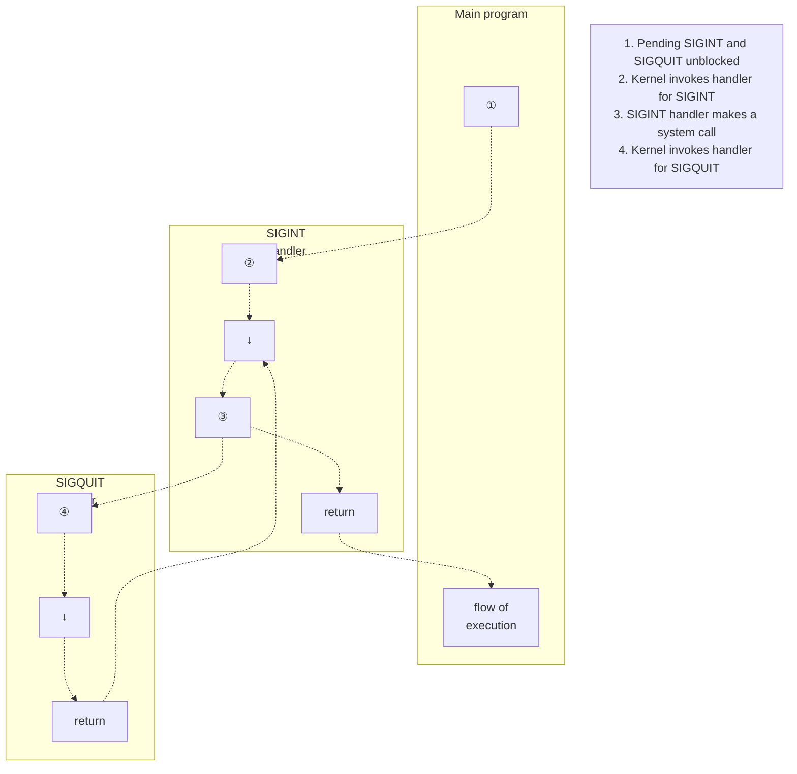

## Chương 22
# **SIGNALS: CÁC TÍNH NĂNG NÂNG CAO**

Chương này hoàn thành phần thảo luận về signal mà chúng ta đã bắt đầu ở Chương 20, đề cập một số chủ đề nâng cao hơn, bao gồm:

-  các file core dump;
-  các trường hợp đặc biệt liên quan đến việc gửi, disposition và xử lý signal;
-  tạo signal đồng bộ và bất đồng bộ;
-  khi nào và theo thứ tự nào signal được gửi;
-  gián đoạn system call bởi signal handler, và cách tự động khởi động lại các system call bị ngắt;
-  realtime signal;
-  việc sử dụng `sigsuspend()` để đặt process signal mask và chờ signal đến;
-  việc sử dụng `sigwaitinfo()` (và `sigtimedwait()`) để đồng bộ chờ signal đến;
-  việc sử dụng `signalfd()` để nhận signal qua file descriptor; và
-  các BSD và System V signal API cũ hơn.

## **22.1 Các File Core Dump**

Một số signal khiến process tạo core dump và kết thúc (Bảng 20-1, trang 396). Core dump là file chứa image bộ nhớ của process tại thời điểm nó kết thúc. (Thuật ngữ "core" bắt nguồn từ công nghệ bộ nhớ cũ.) Image bộ nhớ này có thể được nạp vào debugger để kiểm tra trạng thái của code và dữ liệu chương trình tại thời điểm signal đến.

Một cách để khiến chương trình tạo ra core dump là nhấn ký tự quit (thường là Control-\), điều này tạo ra signal `SIGQUIT`:

```
$ ulimit -c unlimited Explained in main text
$ sleep 30
Type Control-\
Quit (core dumped)
$ ls -l core Shows core dump file for sleep(1)
-rw------- 1 mtk users 57344 Nov 30 13:39 core
```

Trong ví dụ này, thông báo `Quit (core dumped)` được in bởi shell, nhận biết rằng child của nó (process đang chạy sleep) bị kill bởi `SIGQUIT` và đã tạo core dump.

File core dump được tạo trong thư mục làm việc của process, với tên `core`. Đây là vị trí và tên mặc định cho file core dump; sau đây chúng ta giải thích cách các giá trị mặc định này có thể được thay đổi.

> Nhiều implementation cung cấp công cụ (ví dụ: `gcore` trên FreeBSD và Solaris) để lấy core dump của process đang chạy. Chức năng tương tự có sẵn trên Linux bằng cách gắn vào process đang chạy bằng gdb rồi sử dụng lệnh `gcore`.

#### **Các trường hợp file core dump không được tạo ra**

Core dump không được tạo trong các trường hợp sau:

-  Process không có quyền ghi file core dump. Điều này có thể xảy ra vì process không có quyền ghi vào thư mục nơi file core dump sẽ được tạo, hoặc vì file có cùng tên đã tồn tại và hoặc không thể ghi được hoặc không phải là file thông thường (ví dụ: là thư mục hoặc symbolic link).
-  Một file thông thường có cùng tên đã tồn tại và có thể ghi, nhưng có nhiều hơn một liên kết cứng (hard link) đến file.
-  Thư mục nơi file core dump sẽ được tạo không tồn tại.
-  Giới hạn tài nguyên của process về kích thước file core dump được đặt thành 0. Giới hạn này, `RLIMIT_CORE`, được thảo luận chi tiết hơn trong Mục 36.3. Trong ví dụ trên, chúng ta đã sử dụng lệnh `ulimit` (hoặc `limit` trong C shell) để đảm bảo không có giới hạn về kích thước file core.
-  Giới hạn tài nguyên của process về kích thước file mà process có thể tạo ra được đặt thành 0. Chúng ta mô tả giới hạn này, `RLIMIT_FSIZE`, trong Mục 36.3.
-  File thực thi nhị phân mà process đang thực thi không có quyền đọc được bật. Điều này ngăn người dùng sử dụng core dump để lấy bản sao code của chương trình mà họ nếu không sẽ không thể đọc được.

-  File system nơi thư mục làm việc hiện tại nằm trên đó được gắn kết chỉ đọc, đã đầy, hoặc đã hết i-node. Hoặc người dùng đã đạt đến giới hạn quota của họ trên file system.
-  Các chương trình set-user-ID (set-group-ID) được thực thi bởi người dùng không phải file owner (group owner) không tạo core dump. Điều này ngăn người dùng độc hại dump bộ nhớ của chương trình bảo mật và kiểm tra nó để tìm thông tin nhạy cảm như mật khẩu.

Sử dụng thao tác `PR_SET_DUMPABLE` của Linux-specific system call `prctl()`, chúng ta có thể đặt dumpable flag cho process, để khi chương trình set-user-ID (set-group-ID) được chạy bởi người dùng không phải owner (group owner), có thể tạo ra core dump. Thao tác `PR_SET_DUMPABLE` có sẵn từ Linux 2.4 trở đi. Xem trang manual `prctl(2)` để biết thêm chi tiết. Ngoài ra, từ kernel 2.6.13, file Linux-specific `/proc/sys/fs/suid_dumpable` cung cấp kiểm soát trên toàn hệ thống về việc các process set-user-ID và set-group-ID có tạo core dump hay không. Để biết chi tiết, xem trang manual `proc(5)`.

Từ kernel 2.6.23, Linux-specific `/proc/PID/coredump_filter` có thể được sử dụng trên cơ sở per-process để xác định loại memory mapping nào được ghi vào file core dump. (Chúng ta giải thích memory mapping trong Chương 49.) Giá trị trong file này là mask của bốn bit tương ứng với bốn loại memory mapping: private anonymous mapping, private file mapping, shared anonymous mapping, và shared file mapping. Giá trị mặc định của file cung cấp hành vi Linux truyền thống: chỉ private anonymous và shared anonymous mapping được dump. Xem trang manual `core(5)` để biết thêm chi tiết.

#### **Đặt tên file core dump: /proc/sys/kernel/core\_pattern**

Bắt đầu từ Linux 2.6, chuỗi format chứa trong file Linux-specific `/proc/sys/kernel/core_pattern` kiểm soát việc đặt tên tất cả các file core dump được tạo ra trên hệ thống. Theo mặc định, file này chứa chuỗi `core`. Người dùng có đặc quyền có thể định nghĩa file này để bao gồm bất kỳ format specifier nào được hiển thị trong Bảng 22-1. Các format specifier này được thay thế bằng giá trị được chỉ ra trong cột bên phải của bảng. Ngoài ra, chuỗi có thể bao gồm dấu gạch chéo (/). Nói cách khác, chúng ta có thể kiểm soát không chỉ tên của file core mà còn cả thư mục (tuyệt đối hoặc tương đối) nơi nó được tạo. Sau khi tất cả các format specifier đã được thay thế, chuỗi pathname kết quả bị cắt ngắn xuống tối đa 128 ký tự (64 ký tự trước Linux 2.6.19).

Từ kernel 2.6.19, Linux hỗ trợ thêm cú pháp trong file `core_pattern`. Nếu file này chứa chuỗi bắt đầu bằng ký hiệu pipe (`|`), thì các ký tự còn lại trong file được diễn giải là một chương trình — với các đối số tùy chọn có thể bao gồm các specifier `%` được hiển thị trong Bảng 22-1 — sẽ được thực thi khi process tạo core dump. Core dump được ghi vào stdin của chương trình đó thay vì vào file. Xem trang manual `core(5)` để biết thêm chi tiết.

> Một số implementation UNIX khác cung cấp các cơ sở tương tự như `core_pattern`. Ví dụ, trong các derivative BSD, tên chương trình được thêm vào tên file, do đó là `core.progname`. Solaris cung cấp công cụ (`coreadm`) cho phép người dùng chọn tên file và thư mục nơi file core dump được đặt.

**Bảng 22-1:** Format specifier cho `/proc/sys/kernel/core_pattern`

| Specifier | Được thay thế bằng                                              |
|-----------|----------------------------------------------------------------|
| %c        | Giới hạn tài nguyên mềm về kích thước file core (byte; từ Linux 2.6.24) |
| %e        | Tên file thực thi (không có tiền tố đường dẫn)                 |
| %g        | Real group ID của process đang dump                            |
| %h        | Tên hệ thống host                                              |
| %p        | Process ID của process đang dump                               |
| %s        | Số hiệu signal đã kết thúc process                             |
| %t        | Thời gian dump, tính bằng giây từ Epoch                        |
| %u        | Real user ID của process đang dump                             |
| %%        | Ký tự % đơn                                                    |

## <span id="page-29-0"></span>**22.2 Các Trường Hợp Đặc Biệt về Gửi, Disposition và Xử Lý**

Đối với một số signal, các quy tắc đặc biệt áp dụng liên quan đến việc gửi, disposition và xử lý, như được mô tả trong phần này.

#### **SIGKILL và SIGSTOP**

Không thể thay đổi hành động mặc định của `SIGKILL`, luôn kết thúc process, và `SIGSTOP`, luôn dừng process. Cả `signal()` và `sigaction()` đều trả về lỗi khi cố gắng thay đổi disposition của các signal này. Hai signal này cũng không thể bị block. Đây là quyết định thiết kế có chủ ý. Việc không cho phép thay đổi hành động mặc định của các signal này có nghĩa là chúng luôn có thể được sử dụng để kill hoặc dừng process bị treo.

#### **SIGCONT và stop signal**

Như đã lưu ý trước đó, signal `SIGCONT` được sử dụng để tiếp tục process đã bị dừng trước đó bởi một trong các stop signal (`SIGSTOP`, `SIGTSTP`, `SIGTTIN`, và `SIGTTOU`). Do mục đích đặc biệt của chúng, trong một số trường hợp kernel xử lý các signal này khác với các signal khác.

Nếu process hiện đang dừng, việc đến của signal `SIGCONT` luôn khiến process tiếp tục, ngay cả khi process hiện đang block hoặc ignore `SIGCONT`. Tính năng này cần thiết vì nếu không, sẽ không thể tiếp tục các process đã dừng như vậy. (Nếu process đã dừng đang block `SIGCONT` và đã thiết lập handler cho `SIGCONT`, thì, sau khi process được tiếp tục, handler chỉ được gọi khi `SIGCONT` sau đó được unblock.)

> Nếu bất kỳ signal nào khác được gửi đến process đã dừng, signal đó không thực sự được gửi cho process cho đến khi nó được tiếp tục thông qua việc nhận signal `SIGCONT`. Một ngoại lệ là `SIGKILL`, luôn kill process — ngay cả process đang dừng.

Bất cứ khi nào `SIGCONT` được gửi cho process, bất kỳ stop signal đang pending nào cho process đều bị loại bỏ (tức là process không bao giờ nhận chúng). Ngược lại, nếu bất kỳ stop signal nào được gửi cho process, thì bất kỳ signal `SIGCONT` đang pending nào đều tự động bị loại bỏ. Các bước này được thực hiện để ngăn hành động của signal `SIGCONT` bị hoàn tác sau đó bởi stop signal thực sự được gửi trước đó, và ngược lại.

#### **Không thay đổi disposition của terminal-generated signal đã bị ignore**

Nếu, tại thời điểm nó được exec, chương trình thấy rằng disposition của terminal-generated signal đã được đặt thành `SIG_IGN` (ignore), thì thông thường chương trình không nên cố gắng thay đổi disposition của signal. Đây không phải là quy tắc được hệ thống thực thi, mà là quy ước nên được tuân theo khi viết ứng dụng. Chúng ta giải thích lý do cho điều này trong Mục 34.7.3. Các signal mà quy ước này liên quan là `SIGHUP`, `SIGINT`, `SIGQUIT`, `SIGTTIN`, `SIGTTOU`, và `SIGTSTP`.

# **22.3 Trạng Thái Sleep Có Thể Và Không Thể Bị Ngắt Của Process**

Chúng ta cần thêm một điều vào câu phát biểu trước đó rằng `SIGKILL` và `SIGSTOP` luôn hành động ngay lập tức trên process. Vào các thời điểm khác nhau, kernel có thể đưa process vào trạng thái sleep, và có hai trạng thái sleep được phân biệt:

-  `TASK_INTERRUPTIBLE`: Process đang chờ một sự kiện nào đó. Ví dụ, nó đang chờ đầu vào terminal, dữ liệu được ghi vào pipe đang trống, hoặc giá trị của System V semaphore được tăng lên. Process có thể ở trong trạng thái này trong khoảng thời gian tùy ý. Nếu signal được tạo cho process ở trạng thái này, thì thao tác bị ngắt và process được đánh thức bởi việc gửi signal. Khi được liệt kê bởi `ps(1)`, các process ở trạng thái `TASK_INTERRUPTIBLE` được đánh dấu bằng chữ `S` trong trường `STAT` (trạng thái process).
-  `TASK_UNINTERRUPTIBLE`: Process đang chờ các lớp sự kiện đặc biệt nhất định, chẳng hạn như hoàn thành I/O đĩa. Nếu signal được tạo cho process ở trạng thái này, thì signal không được gửi cho đến khi process thoát khỏi trạng thái này. Các process ở trạng thái `TASK_UNINTERRUPTIBLE` được `ps(1)` liệt kê với chữ `D` trong trường `STAT`.

Vì process thường chỉ dành những khoảng thời gian rất ngắn ở trạng thái `TASK_UNINTERRUPTIBLE`, thực tế là signal chỉ được gửi khi process rời khỏi trạng thái này là vô hình. Tuy nhiên, trong các trường hợp hiếm gặp, process có thể bị treo ở trạng thái này, có thể do lỗi phần cứng, vấn đề NFS, hoặc lỗi kernel. Trong các trường hợp như vậy, `SIGKILL` sẽ không kết thúc process bị treo. Nếu vấn đề cơ bản không thể giải quyết bằng cách khác, thì chúng ta phải khởi động lại hệ thống để loại bỏ process.

Các trạng thái `TASK_INTERRUPTIBLE` và `TASK_UNINTERRUPTIBLE` có mặt trên hầu hết các implementation UNIX. Bắt đầu từ kernel 2.6.25, Linux thêm trạng thái thứ ba để giải quyết vấn đề process bị treo vừa mô tả:

 `TASK_KILLABLE`: Trạng thái này giống như `TASK_UNINTERRUPTIBLE`, nhưng đánh thức process nếu nhận được signal tử vong (tức là signal sẽ kill process). Bằng cách chuyển đổi các phần liên quan của code kernel để sử dụng trạng thái này, nhiều tình huống mà process bị treo đòi hỏi restart hệ thống có thể được tránh. Thay vào đó, process có thể được kill bằng cách gửi cho nó signal tử vong. Phần code kernel đầu tiên được chuyển đổi để sử dụng `TASK_KILLABLE` là NFS.

## <span id="page-31-2"></span>**22.4 Hardware-Generated Signal**

<span id="page-31-0"></span>`SIGBUS`, `SIGFPE`, `SIGILL`, và `SIGSEGV` có thể được tạo ra như hệ quả của hardware exception hoặc, ít thường xuyên hơn, bằng cách được gửi bởi `kill()`. Trong trường hợp hardware exception, SUSv3 chỉ định rằng hành vi của process là không xác định nếu nó return từ handler của signal, hoặc nếu nó ignore hoặc block signal. Lý do là như sau:

-  Return từ signal handler: Giả sử một lệnh machine-language tạo ra một trong các signal này và signal handler do đó được gọi. Khi return bình thường từ handler, chương trình cố gắng tiếp tục thực thi tại điểm bị ngắt. Nhưng đây chính là lệnh đã tạo ra signal ngay từ đầu, vì vậy signal được tạo ra thêm một lần nữa. Hệ quả thường là chương trình rơi vào vòng lặp vô hạn, liên tục gọi signal handler.
-  Ignore signal: Việc ignore hardware-generated signal ít có ý nghĩa, vì không rõ chương trình nên tiếp tục thực thi như thế nào sau, chẳng hạn, một arithmetic exception. Khi một trong các signal này được tạo ra như hệ quả của hardware exception, Linux buộc gửi nó, ngay cả khi chương trình đã yêu cầu ignore signal.
-  Block signal: Như trường hợp trước, việc block hardware-generated signal ít có ý nghĩa, vì không rõ chương trình nên tiếp tục thực thi như thế nào. Trên Linux 2.4 và trước đó, kernel đơn giản là ignore các nỗ lực block hardware-generated signal; signal vẫn được gửi cho process, và sau đó kết thúc process hoặc bị bắt bởi signal handler, nếu đã được thiết lập. Bắt đầu từ Linux 2.6, nếu signal bị block, thì process luôn bị kill ngay lập tức bởi signal đó, ngay cả khi process đã cài đặt handler cho signal. (Lý do cho sự thay đổi của Linux 2.6 trong việc xử lý hardware-generated signal bị block là hành vi của Linux 2.4 che giấu lỗi và có thể gây deadlock trong các chương trình threaded.)

Chương trình `signals/demo_SIGFPE.c` trong bản phân phối mã nguồn của cuốn sách này có thể được sử dụng để minh họa kết quả của việc ignore hoặc block `SIGFPE` hoặc bắt signal với handler thực hiện return bình thường.

Cách đúng để xử lý hardware-generated signal là chấp nhận hành động mặc định của chúng (kết thúc process) hoặc viết handler không thực hiện return bình thường. Ngoài việc return bình thường, handler có thể hoàn thành thực thi bằng cách gọi `_exit()` để kết thúc process hoặc gọi `siglongjmp()` (Mục [21.2.1](#page-8-1)) để đảm bảo quyền điều khiển đi đến một điểm trong chương trình không phải lệnh đã tạo ra signal.

## <span id="page-31-2"></span>**22.5 Tạo Signal Đồng Bộ và Bất Đồng Bộ**

Chúng ta đã thấy rằng một process thường không thể dự đoán khi nào nó sẽ nhận được signal. Bây giờ chúng ta cần bổ sung thêm nhận xét này bằng cách phân biệt giữa tạo signal đồng bộ và bất đồng bộ.

Mô hình chúng ta đã ngầm xem xét cho đến nay là tạo signal bất đồng bộ, trong đó signal được gửi bởi process khác hoặc được tạo ra bởi kernel cho sự kiện xảy ra độc lập với quá trình thực thi của process (ví dụ: người dùng nhấn ký tự ngắt hoặc child của process này kết thúc). Đối với signal được tạo ra theo cách bất đồng bộ, câu phát biểu trước đó rằng process không thể dự đoán khi nào signal sẽ được gửi là đúng.

Tuy nhiên, trong một số trường hợp, signal được tạo ra trong khi bản thân process đang thực thi. Chúng ta đã thấy hai ví dụ về điều này:

-  Các hardware-generated signal (`SIGBUS`, `SIGFPE`, `SIGILL`, `SIGSEGV`, và `SIGEMT`) được mô tả trong Mục [22.4](#page-31-1) được tạo ra như hệ quả của việc thực thi một lệnh machine-language cụ thể dẫn đến hardware exception.
-  Process có thể sử dụng `raise()`, `kill()`, hoặc `killpg()` để gửi signal cho chính nó.

Trong các trường hợp này, việc tạo signal là đồng bộ — signal được gửi ngay lập tức (trừ khi nó bị block, nhưng xem Mục [22.4](#page-31-1) để thảo luận về điều gì xảy ra khi block hardware-generated signal). Nói cách khác, câu phát biểu trước đó về tính không thể đoán trước của việc gửi signal không áp dụng. Đối với signal được tạo ra đồng bộ, việc gửi là có thể dự đoán và tái tạo được.

Lưu ý rằng tính đồng bộ là thuộc tính của cách signal được tạo ra, chứ không phải của bản thân signal. Tất cả signal đều có thể được tạo ra đồng bộ (ví dụ: khi process gửi cho mình signal bằng `kill()`) hoặc bất đồng bộ (ví dụ: khi signal được gửi bởi process khác bằng `kill()`).

## **22.6 Thời Điểm và Thứ Tự Gửi Signal**

Là chủ đề đầu tiên của phần này, chúng ta xem xét chính xác khi nào signal đang pending được gửi. Sau đó, chúng ta xem xét điều gì xảy ra nếu nhiều signal blocked đang pending đồng thời được unblock.

#### **Khi nào signal được gửi?**

Như đã lưu ý trong Mục [22.5](#page-31-2), signal được tạo ra đồng bộ được gửi ngay lập tức. Ví dụ, hardware exception kích hoạt signal ngay lập tức, và khi process gửi cho mình signal bằng `raise()`, signal được gửi trước khi lời gọi `raise()` return.

Khi signal được tạo ra bất đồng bộ, có thể có độ trễ (nhỏ) trong khi signal đang pending giữa thời điểm nó được tạo ra và thời điểm nó thực sự được gửi, ngay cả khi chúng ta không block signal. Lý do là kernel chỉ gửi signal đang pending cho process tại lần chuyển tiếp tiếp theo từ kernel mode sang user mode trong khi thực thi process đó. Trong thực tế, điều này có nghĩa signal được gửi tại một trong những thời điểm sau:

-  khi process được lên lịch lại sau khi trước đó hết thời gian (tức là khi bắt đầu một time slice); hoặc
-  khi hoàn thành system call (việc gửi signal có thể khiến blocking system call hoàn thành sớm).

#### **Thứ tự gửi nhiều signal được unblock**

Nếu process có nhiều signal đang pending được unblock bằng cách sử dụng `sigprocmask()`, thì tất cả các signal này được gửi ngay lập tức cho process.

Theo cách hiện được triển khai, Linux kernel gửi các signal theo thứ tự tăng dần. Ví dụ, nếu các signal `SIGINT` đang pending (signal 2) và `SIGQUIT` (signal 3) đều được unblock đồng thời, thì signal `SIGINT` sẽ được gửi trước `SIGQUIT`, bất kể thứ tự hai signal được tạo ra.

Tuy nhiên, chúng ta không thể dựa vào (standard) signal được gửi theo bất kỳ thứ tự cụ thể nào, vì SUSv3 nói rằng thứ tự gửi nhiều signal phụ thuộc vào implementation. (Câu phát biểu này chỉ áp dụng cho standard signal. Như chúng ta sẽ thấy trong Mục [22.8,](#page-35-0) các tiêu chuẩn chi phối realtime signal cung cấp đảm bảo về thứ tự gửi nhiều realtime signal được unblock.)

Khi nhiều signal được unblock đang chờ gửi, nếu có sự chuyển đổi giữa kernel mode và user mode xảy ra trong quá trình thực thi signal handler, thì việc thực thi handler đó sẽ bị ngắt bởi việc gọi signal handler thứ hai (và cứ thế tiếp tục), như được hiển thị trong [Hình 22-1.](#page-33-0)



<span id="page-33-0"></span>**Hình 22-1:** Gửi nhiều signal được unblock

# **22.7 Triển Khai và Tính Di Động của signal()**

Trong phần này, chúng ta chỉ ra cách triển khai `signal()` bằng cách sử dụng `sigaction()`. Việc triển khai khá đơn giản, nhưng cần tính đến thực tế là, theo lịch sử và trên các implementation UNIX khác nhau, `signal()` có ngữ nghĩa khác nhau. Đặc biệt, các implementation signal ban đầu là không đáng tin cậy, nghĩa là:

 Khi vào signal handler, disposition của signal được đặt lại về mặc định của nó. (Điều này tương ứng với flag `SA_RESETHAND` được mô tả trong Mục 20.13.) Để handler được gọi lại cho lần gửi tiếp theo của cùng signal, lập trình viên cần thực hiện lời gọi `signal()` từ bên trong handler để thiết lập lại handler một cách rõ ràng. Vấn đề trong tình huống này là có một khoảng thời gian ngắn giữa việc vào signal handler và tái thiết lập handler, trong khoảng thời gian đó, nếu signal đến lần thứ hai, nó sẽ được xử lý theo disposition mặc định của nó.

 Việc gửi các lần xuất hiện tiếp theo của signal không bị block trong quá trình thực thi signal handler. (Điều này tương ứng với flag `SA_NODEFER` được mô tả trong Mục 20.13.) Điều này có nghĩa là nếu signal được gửi lại khi handler vẫn đang thực thi, thì handler sẽ được gọi đệ quy. Với một luồng signal đủ nhanh, các lần gọi đệ quy kết quả của handler có thể làm tràn stack.

Cũng như không đáng tin cậy, các implementation UNIX ban đầu không cung cấp tự động khởi động lại system call (tức là hành vi được mô tả cho flag `SA_RESTART` trong Mục [21.5](#page-21-0)).

Triển khai signal BSD 4.2BSD đáng tin cậy đã khắc phục những hạn chế này, và một số implementation UNIX khác đã làm theo. Tuy nhiên, ngữ nghĩa cũ hơn vẫn còn tồn tại ngày nay trong implementation System V của `signal()`, và ngay cả các tiêu chuẩn hiện đại như SUSv3 và C99 cũng cố ý không chỉ định các khía cạnh này của `signal()`.

Kết hợp các thông tin trên, chúng ta triển khai `signal()` như được hiển thị trong [Listing 22-1.](#page-34-0) Theo mặc định, implementation này cung cấp ngữ nghĩa signal hiện đại. Nếu được biên dịch với `–DOLD_SIGNAL`, thì nó cung cấp ngữ nghĩa signal không đáng tin cậy trước đó và không bật tự động khởi động lại system call.

<span id="page-34-0"></span>**Listing 22-1:** Một implementation của `signal()`

```
––––––––––––––––––––––––––––––––––––––––––––––––––––––––––signals/signal.c
#include <signal.h>
typedef void (*sighandler_t)(int);
sighandler_t
signal(int sig, sighandler_t handler)
{
 struct sigaction newDisp, prevDisp;
 newDisp.sa_handler = handler;
 sigemptyset(&newDisp.sa_mask);
#ifdef OLD_SIGNAL
 newDisp.sa_flags = SA_RESETHAND | SA_NODEFER;
#else
 newDisp.sa_flags = SA_RESTART;
#endif
 if (sigaction(sig, &newDisp, &prevDisp) == -1)
 return SIG_ERR;
 else
 return prevDisp.sa_handler;
}
––––––––––––––––––––––––––––––––––––––––––––––––––––––––––signals/signal.c
```

### **Một số chi tiết về glibc**

Triển khai của thư viện glibc về library function `signal()` đã thay đổi theo thời gian. Trong các phiên bản mới hơn của thư viện (glibc 2 và sau đó), ngữ nghĩa hiện đại được cung cấp theo mặc định. Trong các phiên bản cũ hơn của thư viện, ngữ nghĩa không đáng tin cậy (tương thích System V) trước đó được cung cấp.

> Linux kernel chứa một implementation của `signal()` như một system call. Implementation này cung cấp ngữ nghĩa cũ, không đáng tin cậy. Tuy nhiên, glibc bỏ qua system call này bằng cách cung cấp library function `signal()` gọi `sigaction()`.

Nếu chúng ta muốn lấy ngữ nghĩa signal không đáng tin cậy với các phiên bản glibc hiện đại, chúng ta có thể thay thế rõ ràng các lời gọi `signal()` của mình bằng lời gọi đến function `sysv_signal()` (không chuẩn).

```
#define _GNU_SOURCE
#include <signal.h>
void ( *sysv_signal(int sig, void (*handler)(int)) ) (int);
              Returns previous signal disposition on success, or SIG_ERR on error
```

Function `sysv_signal()` nhận các đối số giống như `signal()`.

Nếu feature test macro `_BSD_SOURCE` không được định nghĩa khi biên dịch chương trình, glibc ngầm định nghĩa lại tất cả các lời gọi `signal()` thành lời gọi `sysv_signal()`, có nghĩa là `signal()` có ngữ nghĩa không đáng tin cậy. Theo mặc định, `_BSD_SOURCE` được định nghĩa, nhưng nó bị vô hiệu hóa (trừ khi cũng được định nghĩa rõ ràng) nếu các feature test macro khác như `_SVID_SOURCE` hoặc `_XOPEN_SOURCE` được định nghĩa khi biên dịch chương trình.

### **sigaction() là API ưu tiên để thiết lập signal handler**

Do các vấn đề tính di động giữa System V và BSD (và glibc cũ và gần đây) được mô tả ở trên, nên luôn sử dụng `sigaction()`, thay vì `signal()`, để thiết lập signal handler. Chúng ta tuân theo thực hành này trong phần còn lại của cuốn sách này. (Một cách khác là viết phiên bản riêng của `signal()`, có thể tương tự như [Listing 22-1,](#page-34-0) chỉ định chính xác các flag chúng ta yêu cầu, và sử dụng phiên bản đó với các ứng dụng của chúng ta.) Tuy nhiên, lưu ý rằng việc sử dụng `signal()` để đặt disposition của signal thành `SIG_IGN` hoặc `SIG_DFL` là di động (và ngắn gọn hơn), và chúng ta thường sử dụng `signal()` cho mục đích đó.

## <span id="page-35-0"></span>**22.8 Realtime Signal**

Realtime signal được định nghĩa trong POSIX.1b để khắc phục một số hạn chế của standard signal. Chúng có các ưu điểm sau so với standard signal:

-  Realtime signal cung cấp phạm vi signal tăng lên có thể được sử dụng cho các mục đích do ứng dụng định nghĩa. Chỉ có hai standard signal được tự do sử dụng cho các mục đích do ứng dụng định nghĩa: `SIGUSR1` và `SIGUSR2`.
-  Realtime signal được xếp hàng. Nếu nhiều trường hợp của realtime signal được gửi đến process, thì signal được gửi nhiều lần. Ngược lại, nếu chúng ta gửi thêm các trường hợp của standard signal đang pending cho process, signal đó chỉ được gửi một lần.

-  Khi gửi realtime signal, có thể chỉ định dữ liệu (giá trị số nguyên hoặc pointer) đi kèm với signal. Signal handler trong process nhận có thể truy xuất dữ liệu này.
-  Thứ tự gửi các realtime signal khác nhau được đảm bảo. Nếu nhiều realtime signal khác nhau đang pending, thì signal có số thấp nhất được gửi trước. Nói cách khác, signal được ưu tiên hóa, với signal có số thấp hơn có độ ưu tiên cao hơn. Khi nhiều signal cùng loại được xếp hàng, chúng được gửi — cùng với dữ liệu đi kèm — theo thứ tự chúng được gửi.

SUSv3 yêu cầu implementation cung cấp tối thiểu `_POSIX_RTSIG_MAX` (định nghĩa là 8) realtime signal khác nhau. Linux kernel định nghĩa 32 realtime signal khác nhau, được đánh số từ 32 đến 63. File header `<signal.h>` định nghĩa hằng số `RTSIG_MAX` để chỉ ra số lượng realtime signal có sẵn, và các hằng số `SIGRTMIN` và `SIGRTMAX` để chỉ ra số realtime signal có sẵn thấp nhất và cao nhất.

> Trên các hệ thống sử dụng threading implementation LinuxThreads, `SIGRTMIN` được định nghĩa là 35 (thay vì 32) để tính đến thực tế là LinuxThreads sử dụng nội bộ ba realtime signal đầu tiên. Trên các hệ thống sử dụng NPTL threading implementation, `SIGRTMIN` được định nghĩa là 34 để tính đến thực tế là NPTL sử dụng nội bộ hai realtime signal đầu tiên.

Realtime signal không được xác định riêng lẻ bằng các hằng số khác nhau theo cách của standard signal. Tuy nhiên, ứng dụng không nên hard-code giá trị số nguyên cho chúng, vì phạm vi được sử dụng cho realtime signal khác nhau giữa các implementation UNIX. Thay vào đó, số realtime signal có thể được tham chiếu bằng cách thêm một giá trị vào `SIGRTMIN`; ví dụ, biểu thức `(SIGRTMIN + 1)` tham chiếu đến realtime signal thứ hai.

Lưu ý rằng SUSv3 không yêu cầu `SIGRTMAX` và `SIGRTMIN` là các giá trị số nguyên đơn giản. Chúng có thể được định nghĩa là các function (như chúng là trên Linux). Điều này có nghĩa là chúng ta không thể viết code cho preprocessor như sau:

```
#if SIGRTMIN+100 > SIGRTMAX /* WRONG! */
#error "Not enough realtime signals"
#endif
```

Thay vào đó, chúng ta phải thực hiện kiểm tra tương đương tại runtime.

#### **Giới hạn số lượng realtime signal được xếp hàng**

Xếp hàng realtime signal (với dữ liệu liên quan) đòi hỏi kernel phải duy trì các data structure liệt kê các signal được xếp hàng cho mỗi process. Vì các data structure này tiêu tốn bộ nhớ kernel, kernel đặt giới hạn về số lượng realtime signal có thể được xếp hàng.

SUSv3 cho phép implementation đặt giới hạn trên về số lượng realtime signal (của tất cả các loại) có thể được xếp hàng cho process, và yêu cầu giới hạn này ít nhất là `_POSIX_SIGQUEUE_MAX` (định nghĩa là 32). Implementation có thể định nghĩa hằng số `SIGQUEUE_MAX` để chỉ ra số lượng realtime signal mà nó cho phép được xếp hàng. Nó cũng có thể cung cấp thông tin này thông qua lời gọi sau:

```
lim = sysconf(_SC_SIGQUEUE_MAX);
```

Trên Linux, lời gọi này trả về –1. Lý do là Linux sử dụng một mô hình khác để giới hạn số lượng realtime signal có thể được xếp hàng cho process. Trong các phiên bản Linux đến và bao gồm 2.6.7, kernel áp đặt giới hạn trên toàn hệ thống về tổng số realtime signal có thể được xếp hàng cho tất cả các process. Giới hạn này có thể được xem và (với đặc quyền) thay đổi thông qua file Linux-specific `/proc/sys/kernel/rtsig-max`. Giá trị mặc định trong file này là 1024. Số lượng realtime signal hiện được xếp hàng có thể được tìm thấy trong file Linux-specific `/proc/sys/kernel/rtsig-nr`.

Bắt đầu từ Linux 2.6.8, mô hình này được thay đổi và các giao diện `/proc` đã đề cập bị xóa. Theo mô hình mới, giới hạn tài nguyên mềm `RLIMIT_SIGPENDING` định nghĩa giới hạn về số lượng signal có thể được xếp hàng cho tất cả các process thuộc sở hữu của real user ID cụ thể. Chúng ta mô tả giới hạn này thêm trong Mục 36.3.

#### **Sử dụng realtime signal**

Để một cặp process gửi và nhận realtime signal, SUSv3 yêu cầu những điều sau:

 Process gửi gửi signal cộng với dữ liệu đi kèm của nó bằng cách sử dụng system call `sigqueue()`.

> Realtime signal cũng có thể được gửi bằng cách sử dụng `kill()`, `killpg()`, và `raise()`. Tuy nhiên, SUSv3 để lại như là phụ thuộc vào implementation việc liệu realtime signal được gửi bằng các giao diện này có được xếp hàng hay không. Trên Linux, các giao diện này có xếp hàng realtime signal, nhưng trên nhiều implementation UNIX khác, chúng không làm vậy.

 Process nhận thiết lập handler cho signal bằng lời gọi `sigaction()` chỉ định flag `SA_SIGINFO`. Điều này khiến signal handler được gọi với các đối số bổ sung, một trong số đó bao gồm dữ liệu đi kèm với realtime signal.

> Trên Linux, có thể xếp hàng realtime signal ngay cả khi process nhận không chỉ định flag `SA_SIGINFO` khi thiết lập signal handler (mặc dù sau đó không thể lấy dữ liệu liên quan đến signal trong trường hợp này). Tuy nhiên, SUSv3 không yêu cầu các implementation đảm bảo hành vi này, vì vậy chúng ta không thể dựa vào nó một cách di động.

## **22.8.1 Gửi Realtime Signal**

<span id="page-37-0"></span>System call `sigqueue()` gửi realtime signal được chỉ định bởi `sig` cho process được chỉ định bởi `pid`.

```
#define _POSIX_C_SOURCE 199309
#include <signal.h>
int sigqueue(pid_t pid, int sig, const union sigval value);
                                             Returns 0 on success, or –1 on error
```

Các quyền tương tự được yêu cầu để gửi signal bằng `sigqueue()` như được yêu cầu với `kill()` (xem Mục 20.5). Null signal (tức là signal 0) có thể được gửi, với ý nghĩa tương tự như với `kill()`. (Không giống như `kill()`, chúng ta không thể sử dụng `sigqueue()` để gửi signal đến toàn bộ process group bằng cách chỉ định giá trị âm trong `pid`.)

```
–––––––––––––––––––––––––––––––––––––––––––––––––––––– signals/t_sigqueue.c
#define _POSIX_C_SOURCE 199309
#include <signal.h>
#include "tlpi_hdr.h"
int
main(int argc, char *argv[])
{
 int sig, numSigs, j, sigData;
 union sigval sv;
 if (argc < 4 || strcmp(argv[1], "--help") == 0)
 usageErr("%s pid sig-num data [num-sigs]\n", argv[0]);
 /* Display our PID and UID, so that they can be compared with the
 corresponding fields of the siginfo_t argument supplied to the
 handler in the receiving process */
 printf("%s: PID is %ld, UID is %ld\n", argv[0],
 (long) getpid(), (long) getuid());
 sig = getInt(argv[2], 0, "sig-num");
 sigData = getInt(argv[3], GN_ANY_BASE, "data");
 numSigs = (argc > 4) ? getInt(argv[4], GN_GT_0, "num-sigs") : 1;
 for (j = 0; j < numSigs; j++) {
 sv.sival_int = sigData + j;
 if (sigqueue(getLong(argv[1], 0, "pid"), sig, sv) == -1)
 errExit("sigqueue %d", j);
 }
 exit(EXIT_SUCCESS);
}
–––––––––––––––––––––––––––––––––––––––––––––––––––––– signals/t_sigqueue.c
```

Đối số `value` chỉ định dữ liệu đi kèm với signal. Đối số này có dạng sau:

```
union sigval {
 int sival_int; /* Integer value for accompanying data */
 void *sival_ptr; /* Pointer value for accompanying data */
};
```

Việc diễn giải đối số này phụ thuộc vào ứng dụng, cũng như việc chọn đặt trường `sival_int` hay `sival_ptr` của union. Trường `sival_ptr` hiếm khi hữu ích với `sigqueue()`, vì giá trị pointer có ích trong một process hiếm khi có nghĩa trong process khác. Tuy nhiên, trường này hữu ích trong các function khác sử dụng union `sigval`, như chúng ta sẽ thấy khi xem xét POSIX timer trong Mục 23.6 và POSIX message queue notification trong Mục 52.6.

> Một số implementation UNIX, bao gồm Linux, định nghĩa kiểu dữ liệu `sigval_t` như là từ đồng nghĩa cho `union sigval`. Tuy nhiên, kiểu này không được chỉ định trong SUSv3 và không có sẵn trên một số implementation. Các ứng dụng di động nên tránh sử dụng nó.

Lời gọi `sigqueue()` có thể thất bại nếu đạt đến giới hạn về số lượng signal được xếp hàng. Trong trường hợp này, `errno` được đặt thành `EAGAIN`, chỉ ra rằng chúng ta cần gửi lại signal (vào thời điểm sau khi một số signal đang được xếp hàng hiện tại đã được gửi).

Ví dụ về việc sử dụng `sigqueue()` được cung cấp trong [Listing 22-2](#page-38-0) (trang [459\)](#page-38-0). Chương trình này nhận tối đa bốn đối số, trong đó ba đối số đầu là bắt buộc: số hiệu signal, target process ID, và giá trị số nguyên để đi kèm với realtime signal. Nếu cần gửi nhiều hơn một trường hợp của signal được chỉ định, đối số tùy chọn thứ tư chỉ định số lượng trường hợp; trong trường hợp này, giá trị dữ liệu số nguyên đi kèm được tăng lên một cho mỗi signal kế tiếp. Chúng ta minh họa việc sử dụng chương trình này trong Mục [22.8.2.](#page-39-0)

## <span id="page-39-0"></span>**22.8.2 Xử Lý Realtime Signal**

Chúng ta có thể xử lý realtime signal giống như standard signal, bằng cách sử dụng signal handler bình thường (một đối số). Ngoài ra, chúng ta có thể xử lý realtime signal bằng cách sử dụng signal handler ba đối số được thiết lập bằng flag `SA_SIGINFO` (Mục [21.4](#page-16-0)). Đây là ví dụ về việc sử dụng `SA_SIGINFO` để thiết lập handler cho realtime signal thứ sáu:

```
struct sigaction act;
sigemptyset(&act.sa_mask);
act.sa_sigaction = handler;
act.sa_flags = SA_RESTART | SA_SIGINFO;
if (sigaction(SIGRTMIN + 5, &act, NULL) == -1)
 errExit("sigaction");
```

Khi chúng ta sử dụng flag `SA_SIGINFO`, đối số thứ hai được truyền cho signal handler là structure `siginfo_t` chứa thêm thông tin về realtime signal. Chúng ta đã mô tả structure này chi tiết trong Mục [21.4](#page-16-0). Đối với realtime signal, các trường sau được đặt trong structure `siginfo_t`:

-  Trường `si_signo` có cùng giá trị với giá trị được truyền trong đối số đầu tiên của signal handler.
-  Trường `si_code` chỉ ra nguồn gốc của signal, và chứa một trong các giá trị được hiển thị trong [Bảng 21-2](#page-20-0) (trang [441](#page-20-0)). Đối với realtime signal được gửi qua `sigqueue()`, trường này luôn có giá trị `SI_QUEUE`.
-  Trường `si_value` chứa dữ liệu được chỉ định trong đối số `value` (union `sigval`) bởi process gửi signal bằng `sigqueue()`. Như đã lưu ý, việc diễn giải dữ liệu này phụ thuộc vào ứng dụng. (Trường `si_value` không chứa thông tin hợp lệ nếu signal được gửi bằng `kill()`.)
-  Các trường `si_pid` và `si_uid` chứa, tương ứng, process ID và real user ID của process gửi signal.

[Listing 22-3](#page-41-1) cung cấp ví dụ về xử lý realtime signal. Chương trình này bắt signal và hiển thị các trường khác nhau từ structure `siginfo_t` được truyền cho signal handler. Chương trình nhận hai đối số dòng lệnh số nguyên tùy chọn. Nếu đối số đầu tiên được cung cấp, chương trình chính block tất cả signal, rồi sleep trong số giây được chỉ định bởi đối số này. Trong thời gian này, chúng ta có thể xếp hàng nhiều realtime signal cho process và quan sát điều gì xảy ra khi các signal được unblock. Đối số thứ hai chỉ định số giây signal handler nên sleep trước khi return. Chỉ định giá trị khác không (mặc định là 1 giây) hữu ích để làm chậm chương trình để chúng ta có thể dễ dàng thấy điều gì đang xảy ra khi nhiều signal được xử lý.

Chúng ta có thể sử dụng chương trình trong [Listing 22-3,](#page-41-1) cùng với chương trình trong [Listing 22-2](#page-38-0) (t\_sigqueue.c) để khám phá hành vi của realtime signal, như được hiển thị trong nhật ký shell session sau:

```
$ ./catch_rtsigs 60 &
[1] 12842
$ ./catch_rtsigs: PID is 12842 Shell prompt mixed with program output
./catch_rtsigs: signals blocked - sleeping 60 seconds
Press Enter to see next shell prompt
$ ./t_sigqueue 12842 54 100 3 Send signal three times
./t_sigqueue: PID is 12843, UID is 1000
$ ./t_sigqueue 12842 43 200
./t_sigqueue: PID is 12844, UID is 1000
$ ./t_sigqueue 12842 40 300
./t_sigqueue: PID is 12845, UID is 1000
```

Cuối cùng, chương trình `catch_rtsigs` hoàn thành quá trình sleep và hiển thị các thông báo khi signal handler bắt các signal khác nhau. (Chúng ta thấy shell prompt lẫn với dòng tiếp theo của đầu ra chương trình vì chương trình `catch_rtsigs` đang ghi đầu ra từ background.) Đầu tiên chúng ta quan sát thấy rằng realtime signal được gửi theo thứ tự signal có số thấp nhất trước, và structure `siginfo_t` được truyền cho handler bao gồm process ID và user ID của process đã gửi signal:

```
$ ./catch_rtsigs: sleep complete
caught signal 40
 si_signo=40, si_code=-1 (SI_QUEUE), si_value=300
 si_pid=12845, si_uid=1000
caught signal 43
 si_signo=43, si_code=-1 (SI_QUEUE), si_value=200
 si_pid=12844, si_uid=1000
```

Đầu ra còn lại được tạo ra bởi ba trường hợp của cùng realtime signal. Nhìn vào các giá trị `si_value`, chúng ta có thể thấy rằng các signal này được gửi theo thứ tự chúng được gửi đi:

```
caught signal 54
 si_signo=54, si_code=-1 (SI_QUEUE), si_value=100
 si_pid=12843, si_uid=1000
caught signal 54
 si_signo=54, si_code=-1 (SI_QUEUE), si_value=101
 si_pid=12843, si_uid=1000
caught signal 54
 si_signo=54, si_code=-1 (SI_QUEUE), si_value=102
 si_pid=12843, si_uid=1000
```

Chúng ta tiếp tục bằng cách sử dụng lệnh `kill` của shell để gửi signal cho chương trình `catch_rtsigs`. Như trước, chúng ta thấy rằng structure `siginfo_t` nhận được bởi handler bao gồm process ID và user ID của process gửi, nhưng trong trường hợp này, giá trị `si_code` là `SI_USER`:

```
Press Enter to see next shell prompt
$ echo $$ Display PID of shell
12780
$ kill -40 12842 Uses kill(2) to send a signal
$ caught signal 40
 si_signo=40, si_code=0 (SI_USER), si_value=0
 si_pid=12780, si_uid=1000 PID is that of the shell
Press Enter to see next shell prompt
$ kill 12842 Kill catch_rtsigs by sending SIGTERM
Caught 6 signals
Press Enter to see notification from shell about terminated background job
[1]+ Done ./catch_rtsigs 60
```

<span id="page-41-1"></span><span id="page-41-0"></span>**Listing 22-3:** Xử lý realtime signal

```
––––––––––––––––––––––––––––––––––––––––––––––––––––– signals/catch_rtsigs.c
#define _GNU_SOURCE
#include <string.h>
#include <signal.h>
#include "tlpi_hdr.h"
static volatile int handlerSleepTime;
static volatile int sigCnt = 0; /* Number of signals received */
static volatile int allDone = 0;
static void /* Handler for signals established using SA_SIGINFO */
siginfoHandler(int sig, siginfo_t *si, void *ucontext)
{
 /* UNSAFE: This handler uses non-async-signal-safe functions
 (printf()); see Section 21.1.2) */
 /* SIGINT or SIGTERM can be used to terminate program */
 if (sig == SIGINT || sig == SIGTERM) {
 allDone = 1;
 return;
 }
 sigCnt++;
 printf("caught signal %d\n", sig);
 printf(" si_signo=%d, si_code=%d (%s), ", si->si_signo, si->si_code,
 (si->si_code == SI_USER) ? "SI_USER" :
 (si->si_code == SI_QUEUE) ? "SI_QUEUE" : "other");
 printf("si_value=%d\n", si->si_value.sival_int);
 printf(" si_pid=%ld, si_uid=%ld\n", (long) si->si_pid, (long) si->si_uid);
 sleep(handlerSleepTime);
}
```

```
int
main(int argc, char *argv[])
{
 struct sigaction sa;
 int sig;
 sigset_t prevMask, blockMask;
 if (argc > 1 && strcmp(argv[1], "--help") == 0)
 usageErr("%s [block-time [handler-sleep-time]]\n", argv[0]);
 printf("%s: PID is %ld\n", argv[0], (long) getpid());
 handlerSleepTime = (argc > 2) ?
 getInt(argv[2], GN_NONNEG, "handler-sleep-time") : 1;
 /* Establish handler for most signals. During execution of the handler,
 mask all other signals to prevent handlers recursively interrupting
 each other (which would make the output hard to read). */
 sa.sa_sigaction = siginfoHandler;
 sa.sa_flags = SA_SIGINFO;
 sigfillset(&sa.sa_mask);
 for (sig = 1; sig < NSIG; sig++)
 if (sig != SIGTSTP && sig != SIGQUIT)
 sigaction(sig, &sa, NULL);
 /* Optionally block signals and sleep, allowing signals to be
 sent to us before they are unblocked and handled */
 if (argc > 1) {
 sigfillset(&blockMask);
 sigdelset(&blockMask, SIGINT);
 sigdelset(&blockMask, SIGTERM);
 if (sigprocmask(SIG_SETMASK, &blockMask, &prevMask) == -1)
 errExit("sigprocmask");
 printf("%s: signals blocked - sleeping %s seconds\n", argv[0], argv[1]);
 sleep(getInt(argv[1], GN_GT_0, "block-time"));
 printf("%s: sleep complete\n", argv[0]);
 if (sigprocmask(SIG_SETMASK, &prevMask, NULL) == -1)
 errExit("sigprocmask");
 }
 while (!allDone) /* Wait for incoming signals */
 pause();
}
–––––––––––––––––––––––––––––––––––––––––––––––––––– signals/catch_rtsigs.c
```

## <span id="page-43-1"></span>**22.9 Chờ Signal Bằng Mask: sigsuspend()**

Trước khi giải thích `sigsuspend()` làm gì, trước tiên chúng ta mô tả tình huống mà chúng ta cần sử dụng nó. Hãy xem xét kịch bản sau đôi khi gặp phải khi lập trình với signal:

- 1. Chúng ta tạm thời block signal để handler của signal không ngắt quá trình thực thi của một số đoạn code quan trọng.
- 2. Chúng ta unblock signal, và sau đó tạm dừng thực thi cho đến khi signal được gửi.

Để thực hiện điều này, chúng ta có thể thử sử dụng code như được hiển thị trong [Listing 22-4.](#page-43-0)

<span id="page-43-0"></span>**Listing 22-4:** Unblock và chờ signal không đúng cách

```
 sigset_t prevMask, intMask;
 struct sigaction sa;
 sigemptyset(&intMask);
 sigaddset(&intMask, SIGINT);
 sigemptyset(&sa.sa_mask);
 sa.sa_flags = 0;
 sa.sa_handler = handler;
 if (sigaction(SIGINT, &sa, NULL) == -1)
 errExit("sigaction");
 /* Block SIGINT prior to executing critical section. (At this
 point we assume that SIGINT is not already blocked.) */
 if (sigprocmask(SIG_BLOCK, &intMask, &prevMask) == -1)
 errExit("sigprocmask - SIG_BLOCK");
 /* Critical section: do some work here that must not be
 interrupted by the SIGINT handler */
 /* End of critical section - restore old mask to unblock SIGINT */
 if (sigprocmask(SIG_SETMASK, &prevMask, NULL) == -1)
 errExit("sigprocmask - SIG_SETMASK");
 /* BUG: what if SIGINT arrives now... */
 pause(); /* Wait for SIGINT */
```

Có một vấn đề với code trong Listing 22-4. Giả sử signal `SIGINT` được gửi sau khi thực thi `sigprocmask()` thứ hai, nhưng trước lời gọi `pause()`. (Signal thực sự có thể đã được tạo ra bất cứ lúc nào trong quá trình thực thi critical section, và sau đó chỉ được gửi khi nó được unblock.) Việc gửi signal `SIGINT` sẽ khiến handler được gọi, và sau khi handler return và chương trình chính tiếp tục, lời gọi `pause()` sẽ block cho đến khi trường hợp thứ hai của `SIGINT` được gửi. Điều này đánh bại mục đích của code, là unblock `SIGINT` rồi chờ lần xuất hiện đầu tiên của nó.

Ngay cả khi khả năng `SIGINT` được tạo ra giữa thời điểm bắt đầu critical section (tức là lời gọi `sigprocmask()` đầu tiên) và lời gọi `pause()` là nhỏ, điều này vẫn tạo thành một lỗi trong code trên. Lỗi phụ thuộc vào thời gian này là ví dụ về race condition (Mục 5.1). Thông thường, race condition xảy ra khi hai process hoặc thread chia sẻ tài nguyên chung. Tuy nhiên, trong trường hợp này, chương trình chính đang chạy đua với signal handler của chính nó.

Để tránh vấn đề này, chúng ta cần một phương tiện để atomically unblock signal và tạm dừng process. Đó là mục đích của system call `sigsuspend()`.

```
#include <signal.h>
int sigsuspend(const sigset_t *mask);
                                     (Normally) returns –1 with errno set to EINTR
```

System call `sigsuspend()` thay thế process signal mask bằng signal set được trỏ đến bởi `mask`, và sau đó tạm dừng thực thi của process cho đến khi signal được bắt và handler của nó return. Sau khi handler return, `sigsuspend()` khôi phục process signal mask về giá trị trước khi gọi.

Gọi `sigsuspend()` tương đương với atomically thực hiện các thao tác này:

```
sigprocmask(SIG_SETMASK, &mask, &prevMask); /* Assign new mask */
pause();
sigprocmask(SIG_SETMASK, &prevMask, NULL); /* Restore old mask */
```

Mặc dù việc khôi phục signal mask cũ (tức là bước cuối cùng trong chuỗi trên) ban đầu có vẻ bất tiện, nhưng điều đó là cần thiết để tránh race condition trong các tình huống chúng ta cần chờ signal nhiều lần. Trong các tình huống như vậy, các signal phải vẫn bị block ngoại trừ trong các lời gọi `sigsuspend()`. Nếu chúng ta sau đó cần unblock các signal bị block trước lời gọi `sigsuspend()`, chúng ta có thể sử dụng thêm một lời gọi `sigprocmask()`.

Khi `sigsuspend()` bị ngắt bởi việc gửi signal, nó trả về –1, với `errno` được đặt thành `EINTR`. Nếu `mask` không trỏ đến địa chỉ hợp lệ, `sigsuspend()` thất bại với lỗi `EFAULT`.

#### **Chương trình ví dụ**

[Listing 22-5](#page-45-1) minh họa việc sử dụng `sigsuspend()`. Chương trình này thực hiện các bước sau:

-  Hiển thị giá trị ban đầu của process signal mask bằng cách sử dụng function `printSigMask()` (Listing 20-4, trang 408) q.
-  Block `SIGINT` và `SIGQUIT`, và lưu process signal mask ban đầu w.
-  Thiết lập cùng một handler cho cả `SIGINT` và `SIGQUIT` e. Handler này hiển thị thông báo, và, nếu nó được gọi qua việc gửi `SIGQUIT`, đặt biến global `gotSigquit`.

-  Lặp cho đến khi `gotSigquit` được đặt r. Mỗi lần lặp thực hiện các bước sau:
  - Hiển thị giá trị hiện tại của signal mask bằng cách sử dụng function `printSigMask()`.
  - Mô phỏng critical section bằng cách thực thi vòng lặp CPU busy trong vài giây.
  - Hiển thị mask của signal đang pending bằng cách sử dụng function `printPendingSigs()` (Listing 20-4).
  - Sử dụng `sigsuspend()` để unblock `SIGINT` và `SIGQUIT` và chờ signal (nếu chưa có signal đang pending).
-  Sử dụng `sigprocmask()` để khôi phục process signal mask về trạng thái ban đầu t, rồi hiển thị signal mask bằng `printSigMask()` y.

<span id="page-45-1"></span><span id="page-45-0"></span>**Listing 22-5:** Sử dụng `sigsuspend()`

```
–––––––––––––––––––––––––––––––––––––––––––––––––––– signals/t_sigsuspend.c
  #define _GNU_SOURCE /* Get strsignal() declaration from <string.h> */
  #include <string.h>
  #include <signal.h>
  #include <time.h>
  #include "signal_functions.h" /* Declarations of printSigMask()
   and printPendingSigs() */
  #include "tlpi_hdr.h"
  static volatile sig_atomic_t gotSigquit = 0;
  static void
  handler(int sig)
  {
   printf("Caught signal %d (%s)\n", sig, strsignal(sig));
   /* UNSAFE (see Section 21.1.2) */
   if (sig == SIGQUIT)
   gotSigquit = 1;
  }
  int
  main(int argc, char *argv[])
  {
   int loopNum;
   time_t startTime;
   sigset_t origMask, blockMask;
   struct sigaction sa;
q printSigMask(stdout, "Initial signal mask is:\n");
   sigemptyset(&blockMask);
   sigaddset(&blockMask, SIGINT);
   sigaddset(&blockMask, SIGQUIT);
w if (sigprocmask(SIG_BLOCK, &blockMask, &origMask) == -1)
   errExit("sigprocmask - SIG_BLOCK");
   sigemptyset(&sa.sa_mask);
   sa.sa_flags = 0;
   sa.sa_handler = handler;
```

```
e if (sigaction(SIGINT, &sa, NULL) == -1)
   errExit("sigaction");
   if (sigaction(SIGQUIT, &sa, NULL) == -1)
   errExit("sigaction");
r for (loopNum = 1; !gotSigquit; loopNum++) {
   printf("=== LOOP %d\n", loopNum);
   /* Simulate a critical section by delaying a few seconds */
   printSigMask(stdout, "Starting critical section, signal mask is:\n");
   for (startTime = time(NULL); time(NULL) < startTime + 4; )
   continue; /* Run for a few seconds elapsed time */
   printPendingSigs(stdout,
   "Before sigsuspend() - pending signals:\n");
   if (sigsuspend(&origMask) == -1 && errno != EINTR)
   errExit("sigsuspend");
   }
t if (sigprocmask(SIG_SETMASK, &origMask, NULL) == -1)
   errExit("sigprocmask - SIG_SETMASK");
y printSigMask(stdout, "=== Exited loop\nRestored signal mask to:\n");
   /* Do other processing... */
   exit(EXIT_SUCCESS);
  }
  –––––––––––––––––––––––––––––––––––––––––––––––––––– signals/t_sigsuspend.c
```

Nhật ký shell session sau đây hiển thị ví dụ về những gì chúng ta thấy khi chạy chương trình trong Listing 22-5:

```
$ ./t_sigsuspend
Initial signal mask is:
 <empty signal set>
=== LOOP 1
Starting critical section, signal mask is:
 2 (Interrupt)
 3 (Quit)
Type Control-C; SIGINT is generated, but remains pending because it is blocked
Before sigsuspend() - pending signals:
 2 (Interrupt)
Caught signal 2 (Interrupt) sigsuspend() is called, signals are unblocked
```

Dòng đầu ra cuối cùng xuất hiện khi chương trình gọi `sigsuspend()`, điều này khiến `SIGINT` được unblock. Tại thời điểm đó, signal handler được gọi và hiển thị dòng đầu ra đó.

Chương trình chính tiếp tục vòng lặp của nó:

```
=== LOOP 2
Starting critical section, signal mask is:
 2 (Interrupt)
 3 (Quit)
Type Control-\ to generate SIGQUIT
Before sigsuspend() - pending signals:
 3 (Quit)
Caught signal 3 (Quit) sigsuspend() is called, signals are unblocked
=== Exited loop Signal handler set gotSigquit
Restored signal mask to:
 <empty signal set>
```

Lần này, chúng ta nhấn Control-\, điều này khiến signal handler đặt flag `gotSigquit`, từ đó khiến chương trình chính kết thúc vòng lặp của nó.

# <span id="page-47-0"></span>**22.10 Chờ Signal Đồng Bộ**

Trong Mục [22.9](#page-43-1), chúng ta đã thấy cách sử dụng signal handler cộng với `sigsuspend()` để tạm dừng thực thi của process cho đến khi signal được gửi. Tuy nhiên, nhu cầu viết signal handler và xử lý sự phức tạp của việc gửi bất đồng bộ làm cho cách tiếp cận này cồng kềnh đối với một số ứng dụng. Thay vào đó, chúng ta có thể sử dụng system call `sigwaitinfo()` để đồng bộ chấp nhận signal.

```
#define _POSIX_C_SOURCE 199309
#include <signal.h>
int sigwaitinfo(const sigset_t *set, siginfo_t *info);
                  Returns number of delivered signal on success, or –1 on error
```

System call `sigwaitinfo()` tạm dừng thực thi của process cho đến khi một trong các signal trong signal set được trỏ đến bởi `set` được gửi. Nếu một trong các signal trong `set` đang pending tại thời điểm gọi, `sigwaitinfo()` trả về ngay lập tức. Signal được gửi bị xóa khỏi danh sách signal đang pending của process, và số hiệu signal được trả về như là kết quả của function. Nếu đối số `info` không phải là `NULL`, thì nó trỏ đến structure `siginfo_t` được khởi tạo để chứa thông tin giống như được cung cấp cho signal handler nhận đối số `siginfo_t` (Mục [21.4](#page-16-0)).

Thứ tự gửi và đặc điểm xếp hàng của signal được chấp nhận bởi `sigwaitinfo()` giống như đối với signal bị bắt bởi signal handler; tức là, standard signal không được xếp hàng, và realtime signal được xếp hàng và gửi theo thứ tự số signal thấp nhất trước.

Ngoài việc tiết kiệm cho chúng ta công sức viết signal handler, việc chờ signal bằng `sigwaitinfo()` nhanh hơn một chút so với kết hợp signal handler cộng với `sigsuspend()` (xem Bài tập [22-3.\)](#page-57-0).

Thông thường có ý nghĩa khi sử dụng `sigwaitinfo()` chỉ kết hợp với việc block tập hợp các signal mà chúng ta quan tâm muốn chờ. (Chúng ta có thể lấy signal đang pending với `sigwaitinfo()` ngay cả khi signal đó bị block.) Nếu chúng ta không làm điều này và signal đến trước lần gọi đầu tiên hoặc giữa các lần gọi tiếp theo đến `sigwaitinfo()`, thì signal sẽ được xử lý theo disposition hiện tại của nó.

Ví dụ về việc sử dụng `sigwaitinfo()` được hiển thị trong [Listing 22-6.](#page-49-0) Chương trình này trước tiên block tất cả signal, rồi delay trong số giây được chỉ định trong đối số dòng lệnh tùy chọn của nó. Điều này cho phép gửi signal đến chương trình trước `sigwaitinfo()`. Sau đó chương trình liên tục lặp bằng cách sử dụng `sigwaitinfo()` để chấp nhận signal đến, cho đến khi nhận được `SIGINT` hoặc `SIGTERM`.

Nhật ký shell session sau đây minh họa việc sử dụng chương trình trong Listing 22-6. Chúng ta chạy chương trình trong background, chỉ định rằng nó nên delay 60 giây trước khi gọi `sigwaitinfo()`, rồi gửi cho nó hai signal:

```
$ ./t_sigwaitinfo 60 &
./t_sigwaitinfo: PID is 3837
./t_sigwaitinfo: signals blocked
./t_sigwaitinfo: about to delay 60 seconds
[1] 3837
$ ./t_sigqueue 3837 43 100 Send signal 43
./t_sigqueue: PID is 3839, UID is 1000
$ ./t_sigqueue 3837 42 200 Send signal 42
./t_sigqueue: PID is 3840, UID is 1000
```

Cuối cùng, chương trình hoàn thành khoảng thời gian sleep của nó, và vòng lặp `sigwaitinfo()` chấp nhận các signal được xếp hàng. (Chúng ta thấy shell prompt lẫn với dòng tiếp theo của đầu ra chương trình vì chương trình `t_sigwaitinfo` đang ghi đầu ra từ background.) Như với realtime signal bị bắt bằng handler, chúng ta thấy rằng signal được gửi theo thứ tự số thấp nhất trước, và structure `siginfo_t` được truyền cho signal handler cho phép chúng ta lấy process ID và user ID của process gửi:

```
$ ./t_sigwaitinfo: finished delay
got signal: 42
 si_signo=42, si_code=-1 (SI_QUEUE), si_value=200
 si_pid=3840, si_uid=1000
got signal: 43
 si_signo=43, si_code=-1 (SI_QUEUE), si_value=100
 si_pid=3839, si_uid=1000
```

Chúng ta tiếp tục, sử dụng lệnh `kill` của shell để gửi signal cho process. Lần này, chúng ta thấy rằng trường `si_code` được đặt thành `SI_USER` (thay vì `SI_QUEUE`):

```
Press Enter to see next shell prompt
$ echo $$ Display PID of shell
3744
$ kill -USR1 3837 Shell sends SIGUSR1 using kill()
$ got signal: 10 Delivery of SIGUSR1
 si_signo=10, si_code=0 (SI_USER), si_value=100
 si_pid=3744, si_uid=1000 3744 is PID of shell
Press Enter to see next shell prompt
$ kill %1 Terminate program with SIGTERM
$
Press Enter to see notification of background job termination
[1]+ Done ./t_sigwaitinfo 60
```

Trong đầu ra cho signal `SIGUSR1` được chấp nhận, chúng ta thấy rằng trường `si_value` có giá trị 100. Đây là giá trị mà trường được khởi tạo bởi signal trước đó được gửi bằng `sigqueue()`. Chúng ta đã lưu ý trước đó rằng trường `si_value` chỉ chứa thông tin hợp lệ cho signal được gửi bằng `sigqueue()`.

<span id="page-49-0"></span>**Listing 22-6:** Đồng bộ chờ signal với `sigwaitinfo()`

––––––––––––––––––––––––––––––––––––––––––––––––––– **signals/t\_sigwaitinfo.c** #define \_GNU\_SOURCE #include <string.h> #include <signal.h> #include <time.h> #include "tlpi\_hdr.h" int main(int argc, char \*argv[]) { int sig; siginfo\_t si; sigset\_t allSigs; if (argc > 1 && strcmp(argv[1], "--help") == 0) usageErr("%s [delay-secs]\n", argv[0]); printf("%s: PID is %ld\n", argv[0], (long) getpid()); /\* Block all signals (except SIGKILL and SIGSTOP) \*/ sigfillset(&allSigs); if (sigprocmask(SIG\_SETMASK, &allSigs, NULL) == -1) errExit("sigprocmask"); printf("%s: signals blocked\n", argv[0]); if (argc > 1) { /\* Delay so that signals can be sent to us \*/ printf("%s: about to delay %s seconds\n", argv[0], argv[1]); sleep(getInt(argv[1], GN\_GT\_0, "delay-secs")); printf("%s: finished delay\n", argv[0]); } for (;;) { /\* Fetch signals until SIGINT (^C) or SIGTERM \*/ sig = sigwaitinfo(&allSigs, &si); if (sig == -1) errExit("sigwaitinfo"); if (sig == SIGINT || sig == SIGTERM) exit(EXIT\_SUCCESS); printf("got signal: %d (%s)\n", sig, strsignal(sig)); printf(" si\_signo=%d, si\_code=%d (%s), si\_value=%d\n", si.si\_signo, si.si\_code, (si.si\_code == SI\_USER) ? "SI\_USER" : (si.si\_code == SI\_QUEUE) ? "SI\_QUEUE" : "other",

si.si\_value.sival\_int);

```
 printf(" si_pid=%ld, si_uid=%ld\n",
 (long) si.si_pid, (long) si.si_uid);
 }
}
––––––––––––––––––––––––––––––––––––––––––––––––––– signals/t_sigwaitinfo.c
```

System call `sigtimedwait()` là biến thể của `sigwaitinfo()`. Sự khác biệt duy nhất là `sigtimedwait()` cho phép chúng ta chỉ định giới hạn thời gian cho việc chờ.

```
#define _POSIX_C_SOURCE 199309
#include <signal.h>
int sigtimedwait(const sigset_t *set, siginfo_t *info,
 const struct timespec *timeout);
                               Returns number of delivered signal on success,
                                             or –1 on error or timeout (EAGAIN)
```

Đối số `timeout` chỉ định thời gian tối đa mà `sigtimedwait()` nên chờ signal. Nó là pointer đến structure có kiểu sau:

```
struct timespec {
 time_t tv_sec; /* Seconds ('time_t' is an integer type) */
 long tv_nsec; /* Nanoseconds */
};
```

Các trường của structure `timespec` được điền để chỉ định số giây và nanosecond tối đa mà `sigtimedwait()` nên chờ. Chỉ định cả hai trường của structure là 0 tạo ra timeout ngay lập tức — tức là kiểm tra poll để xem bất kỳ signal nào trong tập hợp được chỉ định có đang pending hay không. Nếu lời gọi timeout mà không có signal được gửi, `sigtimedwait()` thất bại với lỗi `EAGAIN`.

Nếu đối số `timeout` được chỉ định là `NULL`, thì `sigtimedwait()` hoàn toàn tương đương với `sigwaitinfo()`. SUSv3 để lại ý nghĩa của `NULL` timeout không được chỉ định, và một số implementation UNIX thay vào đó diễn giải điều này là yêu cầu poll trả về ngay lập tức.

# **22.11 Lấy Signal Qua File Descriptor**

Bắt đầu từ kernel 2.6.22, Linux cung cấp system call (không chuẩn) `signalfd()`, tạo ra file descriptor đặc biệt mà các signal được hướng đến caller có thể được đọc. Cơ chế `signalfd` cung cấp một phương án thay thế cho việc sử dụng `sigwaitinfo()` để đồng bộ chấp nhận signal.

```
#include <sys/signalfd.h>
int signalfd(int fd, const sigset_t *mask, int flags);
                                Returns file descriptor on success, or –1 on error
```

Đối số `mask` là signal set chỉ định các signal mà chúng ta muốn có thể đọc qua signalfd file descriptor. Như với `sigwaitinfo()`, chúng ta cũng nên block tất cả các signal trong `mask` bằng cách sử dụng `sigprocmask()`, để các signal không được xử lý theo disposition mặc định của chúng trước khi chúng ta có cơ hội đọc chúng.

Nếu `fd` được chỉ định là –1, thì `signalfd()` tạo ra một file descriptor mới có thể được sử dụng để đọc các signal trong `mask`; nếu không, nó sửa đổi mask liên quan đến `fd`, phải là file descriptor được tạo bởi lời gọi trước đó đến `signalfd()`.

Trong implementation ban đầu, đối số `flags` được dành cho sử dụng trong tương lai và phải được chỉ định là 0. Tuy nhiên, từ Linux 2.6.27, hai flag được hỗ trợ:

#### SFD\_CLOEXEC

Đặt close-on-exec flag (`FD_CLOEXEC`) cho file descriptor mới. Flag này hữu ích vì các lý do tương tự như flag `O_CLOEXEC` của `open()` được mô tả trong Mục 4.3.1.

#### SFD\_NONBLOCK

Đặt flag `O_NONBLOCK` trên open file description cơ bản, để các lần đọc trong tương lai sẽ là nonblocking. Điều này tiết kiệm các lời gọi bổ sung đến `fcntl()` để đạt được kết quả tương tự.

Sau khi tạo file descriptor, chúng ta có thể đọc signal từ nó bằng cách sử dụng `read()`. Buffer được cung cấp cho `read()` phải đủ lớn để giữ ít nhất một structure `signalfd_siginfo`, được định nghĩa như sau trong `<sys/signalfd.h>`:

```
struct signalfd_siginfo {
 uint32_t ssi_signo; /* Signal number */
 int32_t ssi_errno; /* Error number (generally unused) */
 int32_t ssi_code; /* Signal code */
 uint32_t ssi_pid; /* Process ID of sending process */
 uint32_t ssi_uid; /* Real user ID of sender */
 int32_t ssi_fd; /* File descriptor (SIGPOLL/SIGIO) */
 uint32_t ssi_tid; /* Kernel timer ID (POSIX timers) */
 uint32_t ssi_band; /* Band event (SIGPOLL/SIGIO) */
 uint32_t ssi_tid; /* (Kernel-internal) timer ID (POSIX timers) */
 uint32_t ssi_overrun; /* Overrun count (POSIX timers) */
 uint32_t ssi_trapno; /* Trap number */
 int32_t ssi_status; /* Exit status or signal (SIGCHLD) */
 int32_t ssi_int; /* Integer sent by sigqueue() */
 uint64_t ssi_ptr; /* Pointer sent by sigqueue() */
 uint64_t ssi_utime; /* User CPU time (SIGCHLD) */
 uint64_t ssi_stime; /* System CPU time (SIGCHLD) */
 uint64_t ssi_addr; /* Address that generated signal
 (hardware-generated signals only) */
};
```

Các trường trong structure này trả về thông tin giống như các trường có tên tương tự trong structure `siginfo_t` truyền thống (Mục [21.4\)](#page-16-0).

Mỗi lời gọi `read()` trả về nhiều structure `signalfd_siginfo` nhất có thể với số lượng signal đang pending và phù hợp với buffer được cung cấp. Nếu không có signal nào đang pending tại thời điểm gọi, thì `read()` block cho đến khi signal đến. Chúng ta cũng có thể sử dụng thao tác `F_SETFL` của `fcntl()` (Mục 5.3) để đặt flag `O_NONBLOCK` cho file descriptor, để các lần đọc là nonblocking và sẽ thất bại với lỗi `EAGAIN` nếu không có signal nào đang pending.

Khi signal được đọc từ signalfd file descriptor, nó bị tiêu thụ và không còn là pending đối với process.

<span id="page-52-0"></span>**Listing 22-7:** Sử dụng `signalfd()` để đọc signal

```
–––––––––––––––––––––––––––––––––––––––––––––––––– signals/signalfd_sigval.c
#include <sys/signalfd.h>
#include <signal.h>
#include "tlpi_hdr.h"
int
main(int argc, char *argv[])
{
 sigset_t mask;
 int sfd, j;
 struct signalfd_siginfo fdsi;
 ssize_t s;
 if (argc < 2 || strcmp(argv[1], "--help") == 0)
 usageErr("%s sig-num...\n", argv[0]);
 printf("%s: PID = %ld\n", argv[0], (long) getpid());
 sigemptyset(&mask);
 for (j = 1; j < argc; j++)
 sigaddset(&mask, atoi(argv[j]));
 if (sigprocmask(SIG_BLOCK, &mask, NULL) == -1)
 errExit("sigprocmask");
 sfd = signalfd(-1, &mask, 0);
 if (sfd == -1)
 errExit("signalfd");
 for (;;) {
 s = read(sfd, &fdsi, sizeof(struct signalfd_siginfo));
 if (s != sizeof(struct signalfd_siginfo))
 errExit("read");
 printf("%s: got signal %d", argv[0], fdsi.ssi_signo);
 if (fdsi.ssi_code == SI_QUEUE) {
 printf("; ssi_pid = %d; ", fdsi.ssi_pid);
 printf("ssi_int = %d", fdsi.ssi_int);
 }
 printf("\n");
 }
}
```

–––––––––––––––––––––––––––––––––––––––––––––––––– **signals/signalfd\_sigval.c**

Signalfd file descriptor có thể được theo dõi cùng với các descriptor khác bằng cách sử dụng `select()`, `poll()`, và epoll (được mô tả trong Chương 63). Trong số các cách sử dụng khác, tính năng này cung cấp một phương án thay thế cho self-pipe trick được mô tả trong Mục 63.5.2. Nếu signal đang pending, thì các kỹ thuật này chỉ ra file descriptor là có thể đọc được.

Khi chúng ta không còn cần signalfd file descriptor, chúng ta nên đóng nó, để giải phóng các tài nguyên kernel liên quan.

[Listing 22-7](#page-52-0) (ở trang [473](#page-52-0)) minh họa việc sử dụng `signalfd()`. Chương trình này tạo mask của các số hiệu signal được chỉ định trong các đối số dòng lệnh của nó, block các signal đó, rồi tạo signalfd file descriptor để đọc các signal đó. Sau đó nó lặp, đọc signal từ file descriptor và hiển thị một số thông tin từ structure `signalfd_siginfo` được trả về. Trong shell session sau, chúng ta chạy chương trình trong Listing 22-7 trong background và gửi cho nó realtime signal với dữ liệu đi kèm bằng cách sử dụng chương trình trong [Listing 22-2](#page-38-0) (t\_sigqueue.c):

```
$ ./signalfd_sigval 44 &
./signalfd_sigval: PID = 6267
[1] 6267
$ ./t_sigqueue 6267 44 123 Send signal 44 with data 123 to PID 6267
./t_sigqueue: PID is 6269, UID is 1000
./signalfd_sigval: got signal 44; ssi_pid=6269; ssi_int=123
$ kill %1 Kill program running in background
```

# **22.12 Giao Tiếp Liên Process Với Signal**

Từ một góc nhìn, chúng ta có thể coi signal là một dạng interprocess communication (IPC). Tuy nhiên, signal gặp phải một số hạn chế như cơ chế IPC. Đầu tiên, so với các phương pháp IPC khác mà chúng ta xem xét trong các chương sau, lập trình với signal cồng kềnh và khó khăn. Lý do là như sau:

-  Tính bất đồng bộ của signal có nghĩa là chúng ta phải đối mặt với nhiều vấn đề khác nhau, bao gồm yêu cầu reentrancy, race condition, và xử lý đúng biến global từ signal handler. (Hầu hết các vấn đề này không xảy ra nếu chúng ta sử dụng `sigwaitinfo()` hoặc `signalfd()` để đồng bộ lấy signal.)
-  Standard signal không được xếp hàng. Ngay cả đối với realtime signal, có giới hạn trên về số lượng signal có thể được xếp hàng. Điều này có nghĩa là để tránh mất thông tin, process nhận signal phải có phương pháp thông báo cho bên gửi rằng nó sẵn sàng nhận signal khác. Phương pháp rõ ràng nhất để làm điều này là bên nhận gửi signal đến bên gửi.

Vấn đề thêm là signal chỉ mang lượng thông tin hạn chế: số hiệu signal, và trong trường hợp realtime signal, một word (số nguyên hoặc pointer) dữ liệu bổ sung. Băng thông thấp này làm cho signal chậm hơn so với các phương pháp IPC khác như pipe.

Hệ quả của các hạn chế trên, signal hiếm khi được sử dụng cho IPC.

## **22.13 Các Signal API Cũ Hơn (System V và BSD)**

Phần thảo luận về signal của chúng ta đã tập trung vào POSIX signal API. Bây giờ chúng ta nhìn ngắn gọn vào các API lịch sử được cung cấp bởi System V và BSD. Mặc dù tất cả các ứng dụng mới nên sử dụng POSIX API, chúng ta có thể gặp các API lỗi thời này khi porting (thường là các ứng dụng cũ hơn) từ các implementation UNIX khác. Vì Linux (như nhiều implementation UNIX khác) cung cấp các API tương thích System V và BSD, thường tất cả những gì cần thiết để port các chương trình sử dụng các API cũ hơn này là biên dịch lại chúng trên Linux.

#### **System V signal API**

Như đã lưu ý trước đó, một điểm khác biệt quan trọng trong System V signal API là khi handler được thiết lập với `signal()`, chúng ta nhận được ngữ nghĩa signal cũ hơn, không đáng tin cậy. Điều này có nghĩa là signal không được thêm vào process signal mask, disposition của signal được đặt lại về mặc định khi handler được gọi, và system call không được tự động khởi động lại.

Dưới đây, chúng ta mô tả ngắn gọn các function trong System V signal API. Các trang manual cung cấp đầy đủ chi tiết. SUSv3 chỉ định tất cả các function này, nhưng lưu ý rằng các tương đương POSIX hiện đại được ưa thích. SUSv4 đánh dấu các function này là lỗi thời.

```
#define _XOPEN_SOURCE 500
#include <signal.h>
void (*sigset(int sig, void (*handler)(int)))(int);
                   On success: returns the previous disposition of sig, or SIG_HOLD
                             if sig was previously blocked; on error –1 is returned
```

Để thiết lập signal handler với ngữ nghĩa đáng tin cậy, System V cung cấp lời gọi `sigset()` (với prototype tương tự như `signal()`). Như với `signal()`, đối số `handler` cho `sigset()` có thể được chỉ định là `SIG_IGN`, `SIG_DFL`, hoặc địa chỉ của signal handler. Ngoài ra, nó có thể được chỉ định là `SIG_HOLD`, để thêm signal vào process signal mask trong khi để disposition của signal không thay đổi.

Nếu `handler` được chỉ định là bất cứ thứ gì khác `SIG_HOLD`, `sig` bị xóa khỏi process signal mask (tức là nếu `sig` bị block, nó được unblock).

```
#define _XOPEN_SOURCE 500
#include <signal.h>
int sighold(int sig);
int sigrelse(int sig);
int sigignore(int sig);
                                            All return 0 on success, or –1 on error
int sigpause(int sig);
                                           Always returns –1 with errno set to EINTR
```

Function `sighold()` thêm signal vào process signal mask. Function `sigrelse()` xóa signal khỏi signal mask. Function `sigignore()` đặt disposition của signal thành ignore. Function `sigpause()` tương tự như `sigsuspend()`, nhưng chỉ xóa một signal khỏi process signal mask trước khi tạm dừng process cho đến khi có signal đến.

#### **BSD signal API**

POSIX signal API chủ yếu dựa trên 4.2BSD API, vì vậy các BSD function chủ yếu là tương đương trực tiếp của các function trong POSIX.

Như với các function trong System V signal API được mô tả ở trên, chúng ta trình bày prototype của các function trong BSD signal API, và giải thích ngắn gọn hoạt động của mỗi function. Một lần nữa, các trang manual cung cấp đầy đủ chi tiết.

```
#define _BSD_SOURCE
#include <signal.h>
int sigvec(int sig, struct sigvec *vec, struct sigvec *ovec);
                                             Returns 0 on success, or –1 on error
```

Function `sigvec()` tương tự như `sigaction()`. Các đối số `vec` và `ovec` là các pointer đến structure có kiểu sau:

```
struct sigvec {
 void (*sv_handler)();
 int sv_mask;
 int sv_flags;
};
```

Các trường của structure `sigvec` tương ứng chặt chẽ với các trường của structure `sigaction`. Sự khác biệt đáng chú ý đầu tiên là trường `sv_mask` (tương tự như `sa_mask`) là số nguyên thay vì `sigset_t`, điều này có nghĩa là, trên kiến trúc 32-bit, có tối đa 31 signal khác nhau. Sự khác biệt khác là việc sử dụng flag `SV_INTERRUPT` trong trường `sv_flags` (tương tự như `sa_flags`). Vì khởi động lại system call là mặc định trên 4.2BSD, flag này được sử dụng để chỉ định rằng các slow system call nên bị ngắt bởi signal handler. (Điều này tương phản với POSIX API, nơi chúng ta phải chỉ định rõ ràng `SA_RESTART` để bật khởi động lại system call khi thiết lập signal handler với `sigaction()`.)

```
#define _BSD_SOURCE
#include <signal.h>
int sigblock(int mask);
int sigsetmask(int mask);
                                                Both return previous signal mask
int sigpause(int sigmask);
                                          Always returns –1 with errno set to EINTR
int sigmask(sig);
                                         Returns signal mask value with bit sig set
```

Function `sigblock()` thêm một tập hợp signal vào process signal mask. Nó tương tự như thao tác `SIG_BLOCK` của `sigprocmask()`. Lời gọi `sigsetmask()` chỉ định giá trị tuyệt đối cho signal mask. Nó tương tự như thao tác `SIG_SETMASK` của `sigprocmask()`.

Function `sigpause()` tương tự như `sigsuspend()`. Lưu ý rằng function này được định nghĩa với các chữ ký gọi khác nhau trong System V và BSD API. Thư viện GNU C cung cấp phiên bản System V theo mặc định, trừ khi chúng ta chỉ định feature test macro `_BSD_SOURCE` khi biên dịch chương trình.

Macro `sigmask()` chuyển số hiệu signal thành giá trị mask 32-bit tương ứng. Các bit mask như vậy có thể được OR với nhau để tạo tập hợp signal, như trong ví dụ sau:

```
sigblock(sigmask(SIGINT) | sigmask(SIGQUIT));
```

## **22.14 Tóm Tắt**

Một số signal khiến process tạo core dump và kết thúc. File này chứa thông tin có thể được sử dụng bởi debugger để kiểm tra trạng thái của process tại thời điểm nó kết thúc. Theo mặc định, file core dump được đặt tên là `core`, nhưng Linux cung cấp file `/proc/sys/kernel/core_pattern` để kiểm soát việc đặt tên cho file core dump.

Signal có thể được tạo ra bất đồng bộ hoặc đồng bộ. Tạo bất đồng bộ xảy ra khi signal được gửi cho process bởi kernel hoặc bởi process khác. Process không thể dự đoán chính xác khi nào signal được tạo bất đồng bộ sẽ được gửi. (Chúng ta lưu ý rằng signal bất đồng bộ thường được gửi khi process nhận chuyển từ kernel mode sang user mode tiếp theo.) Tạo đồng bộ xảy ra khi bản thân process thực thi code trực tiếp tạo ra signal — ví dụ, bằng cách thực thi lệnh gây ra hardware exception hoặc bằng cách gọi `raise()`. Việc gửi signal được tạo ra đồng bộ là có thể dự đoán chính xác (nó xảy ra ngay lập tức).

Realtime signal là bổ sung POSIX vào mô hình signal gốc, và khác với standard signal ở chỗ chúng được xếp hàng, có thứ tự gửi được chỉ định, và có thể được gửi với một phần dữ liệu đi kèm. Realtime signal được thiết kế để sử dụng cho các mục đích do ứng dụng định nghĩa. Realtime signal được gửi bằng system call `sigqueue()`, và một đối số bổ sung (structure `siginfo_t`) được cung cấp cho signal handler để nó có thể lấy dữ liệu đi kèm signal, cũng như process ID và real user ID của process gửi.

System call `sigsuspend()` cho phép chương trình atomically sửa đổi process signal mask và tạm dừng thực thi cho đến khi signal đến. Tính atomic của `sigsuspend()` là cần thiết để tránh race condition khi unblock signal và sau đó tạm dừng thực thi cho đến khi signal đó đến.

Chúng ta có thể sử dụng `sigwaitinfo()` và `sigtimedwait()` để đồng bộ chờ signal. Điều này giúp chúng ta tiết kiệm công sức thiết kế và viết signal handler, điều có thể không cần thiết nếu mục tiêu duy nhất của chúng ta là chờ việc gửi signal.

Như `sigwaitinfo()` và `sigtimedwait()`, Linux-specific system call `signalfd()` có thể được sử dụng để đồng bộ chờ signal. Tính năng nổi bật của giao diện này là signal có thể được đọc qua file descriptor. File descriptor này cũng có thể được theo dõi bằng cách sử dụng `select()`, `poll()`, và epoll.

Mặc dù signal có thể được coi là phương pháp IPC, nhiều yếu tố làm cho chúng thường không phù hợp cho mục đích này, bao gồm bản chất bất đồng bộ của chúng, thực tế là chúng không được xếp hàng, và băng thông thấp của chúng. Thường xuyên hơn, signal được sử dụng như phương pháp đồng bộ hóa process và cho nhiều mục đích khác (ví dụ: thông báo sự kiện, job control, và hết hạn timer).

Mặc dù các khái niệm signal cơ bản là đơn giản, phần thảo luận của chúng ta đã kéo dài qua ba chương, vì có nhiều chi tiết cần đề cập. Signal đóng vai trò quan trọng trong nhiều phần của system call API, và chúng ta sẽ xem lại việc sử dụng chúng trong nhiều chương sau. Ngoài ra, nhiều signal-related function đặc thù cho thread (ví dụ: `pthread_kill()` và `pthread_sigmask()`), và chúng ta hoãn thảo luận về các function này đến Mục 33.2.

#### **Tài liệu tham khảo thêm**

Xem các nguồn được liệt kê trong Mục 20.15.

## **22.15 Bài Tập**

- **22-1.** Mục [22.2](#page-29-0) lưu ý rằng nếu process đã dừng mà đã thiết lập handler cho và blocked `SIGCONT` sau đó được tiếp tục như hệ quả của việc nhận `SIGCONT`, thì handler chỉ được gọi khi `SIGCONT` được unblock. Viết chương trình để xác minh điều này. Nhớ lại rằng process có thể bị dừng bằng cách nhấn ký tự tạm dừng terminal (thường là Control-Z) và có thể được gửi signal `SIGCONT` bằng lệnh `kill –CONT` (hoặc ngầm định, bằng cách sử dụng lệnh `fg` của shell).
- **22-2.** Nếu cả realtime và standard signal đều đang pending cho process, SUSv3 để lại không được chỉ định cái nào được gửi trước. Viết chương trình hiển thị những gì Linux làm trong trường hợp này. (Chương trình thiết lập handler cho tất cả signal, block signal trong một khoảng thời gian để bạn có thể gửi nhiều signal cho nó, rồi unblock tất cả signal.)
- <span id="page-57-0"></span>**22-3.** Mục [22.10](#page-47-0) nêu rằng chấp nhận signal bằng `sigwaitinfo()` nhanh hơn việc sử dụng signal handler cộng với `sigsuspend()`. Chương trình `signals/sig_speed_sigsuspend.c`, được cung cấp trong bản phân phối mã nguồn của cuốn sách này, sử dụng `sigsuspend()` để luân phiên gửi signal qua lại giữa process cha và process con. Đo thời gian hoạt động của chương trình này để trao đổi một triệu signal giữa hai process. (Số lượng signal cần trao đổi được cung cấp như đối số dòng lệnh cho chương trình.) Tạo phiên bản sửa đổi của chương trình thay vào đó sử dụng `sigwaitinfo()`, và đo thời gian phiên bản đó. Sự khác biệt tốc độ giữa hai chương trình là bao nhiêu?
- **22-4.** Hãy tự cài đặt các function System V `sigset()`, `sighold()`, `sigrelse()`, `sigignore()`, và `sigpause()` bằng cách sử dụng POSIX signal API.
