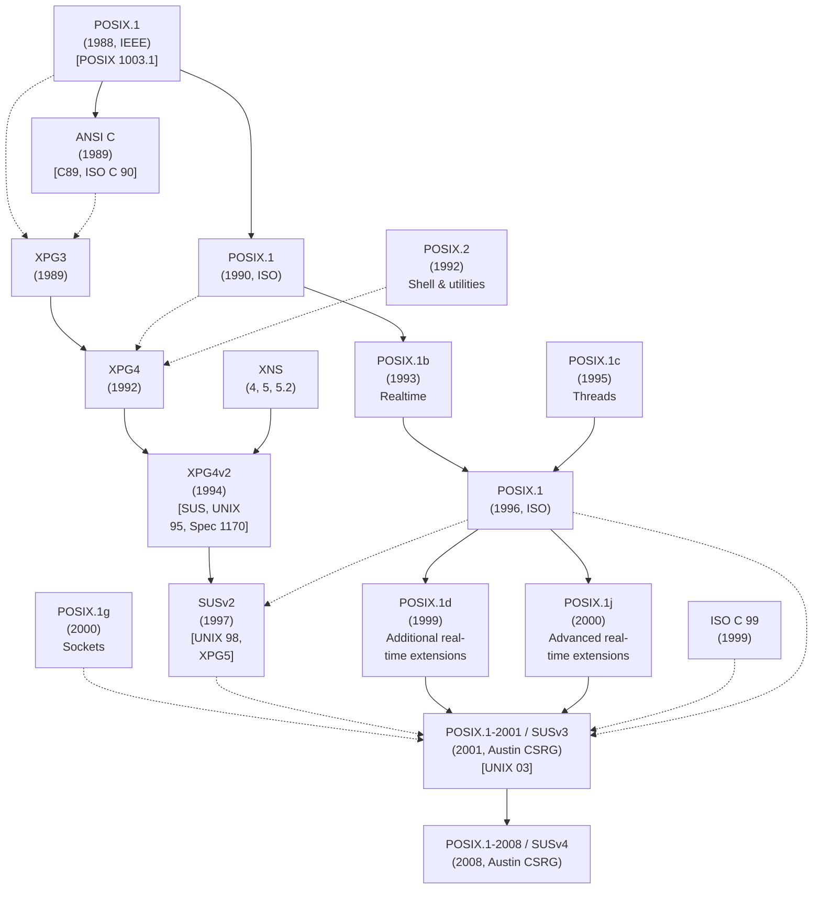

## Chương 1
# **LỊCH SỬ VÀ CÁC TIÊU CHUẨN**

Linux là thành viên của họ hệ điều hành UNIX. Xét theo góc độ máy tính, UNIX có lịch sử lâu dài. Phần đầu của chương này cung cấp một phác thảo ngắn gọn về lịch sử đó. Chúng ta bắt đầu với mô tả về nguồn gốc của hệ thống UNIX và ngôn ngữ lập trình C, sau đó xem xét hai dòng chính dẫn đến hệ thống Linux như ngày nay: dự án GNU và sự phát triển của Linux kernel.

Một trong những đặc điểm đáng chú ý của hệ thống UNIX là quá trình phát triển của nó không được kiểm soát bởi một nhà cung cấp hay tổ chức duy nhất. Thay vào đó, nhiều nhóm — cả thương mại lẫn phi thương mại — đã đóng góp vào sự phát triển của nó. Lịch sử này dẫn đến nhiều tính năng sáng tạo được thêm vào UNIX, nhưng cũng có hệ quả tiêu cực là các phiên bản cài đặt UNIX phân kỳ theo thời gian, khiến việc viết ứng dụng hoạt động trên mọi phiên bản UNIX ngày càng khó khăn. Điều này dẫn đến nỗ lực chuẩn hóa các phiên bản UNIX, mà chúng ta sẽ thảo luận trong phần thứ hai của chương này.

> Có hai định nghĩa về thuật ngữ UNIX đang được sử dụng phổ biến. Một trong số đó chỉ các hệ điều hành đã vượt qua các bài kiểm tra conformance chính thức cho Single UNIX Specification và do đó được The Open Group (chủ sở hữu nhãn hiệu UNIX) chính thức công nhận quyền sử dụng tên "UNIX". Tại thời điểm viết sách, không có phiên bản UNIX miễn phí nào (ví dụ: Linux và FreeBSD) đạt được nhãn hiệu này.

Ý nghĩa phổ biến khác của thuật ngữ UNIX chỉ các hệ thống trông và hoạt động giống các hệ thống UNIX cổ điển (tức là UNIX gốc của Bell Laboratories và các nhánh phát triển chính sau này: System V và BSD). Theo định nghĩa này, Linux thường được xem là hệ thống UNIX (cũng như các BSD hiện đại). Mặc dù chúng ta chú ý kỹ đến Single UNIX Specification trong cuốn sách này, chúng ta sẽ theo định nghĩa thứ hai của UNIX, và thường sẽ nói những điều như "Linux, cũng như các phiên bản UNIX khác. . . ."

# **1.1 Lịch Sử Ngắn Gọn Về UNIX và C**

Phiên bản UNIX đầu tiên được phát triển vào năm 1969 (cùng năm Linus Torvalds được sinh ra) bởi Ken Thompson tại Bell Laboratories, một bộ phận của tập đoàn điện thoại AT&T. Nó được viết bằng ngôn ngữ assembly cho máy tính mini Digital PDP-7. Tên UNIX là một cách chơi chữ từ MULTICS (Multiplexed Information and Computing Service), tên của một dự án hệ điều hành trước đó mà AT&T đã hợp tác với Massachusetts Institute of Technology (MIT) và General Electric. (AT&T lúc đó đã rút khỏi dự án vì thất vọng khi dự án ban đầu không phát triển thành một hệ thống có giá trị kinh tế.) Thompson đã lấy một số ý tưởng cho hệ điều hành mới của mình từ MULTICS, bao gồm file system dạng cây, một chương trình riêng để phiên dịch các lệnh (shell), và khái niệm file là các stream byte không có cấu trúc.

Vào năm 1970, UNIX được viết lại bằng ngôn ngữ assembly cho máy tính mini Digital PDP-11 mới được mua, một máy mới và mạnh mẽ vào thời điểm đó. Dấu vết của di sản PDP-11 này có thể tìm thấy trong nhiều tên vẫn còn được dùng trên hầu hết các phiên bản UNIX, bao gồm cả Linux.

Không lâu sau đó, Dennis Ritchie, một đồng nghiệp của Thompson tại Bell Laboratories và là người cộng tác sớm trong dự án UNIX, đã thiết kế và cài đặt ngôn ngữ lập trình C. Đây là một quá trình tiến hóa; C tiếp nối một ngôn ngữ thông dịch trước đó, B. B ban đầu được cài đặt bởi Thompson và lấy nhiều ý tưởng từ một ngôn ngữ lập trình còn trước đó nữa có tên BCPL. Đến năm 1973, C đã hoàn thiện đến mức UNIX kernel có thể được viết lại gần như hoàn toàn bằng ngôn ngữ mới này. UNIX do đó trở thành một trong những hệ điều hành đầu tiên được viết bằng ngôn ngữ bậc cao, một thực tế đã giúp việc chuyển sang các kiến trúc phần cứng khác trở nên khả thi.

Lịch sử ra đời của C giải thích tại sao nó, và ngôn ngữ kế thừa C++, được sử dụng rộng rãi như ngôn ngữ lập trình hệ thống ngày nay. Các ngôn ngữ được dùng rộng rãi trước đó được thiết kế với các mục đích khác: FORTRAN cho các tác vụ toán học của kỹ sư và nhà khoa học; COBOL cho các hệ thống thương mại xử lý các stream dữ liệu hướng bản ghi. C lấp đầy một thị phần còn trống, và không giống FORTRAN hay COBOL (được thiết kế bởi các ủy ban lớn), thiết kế của C nảy sinh từ ý tưởng và nhu cầu của một vài cá nhân làm việc hướng tới một mục tiêu duy nhất: phát triển một ngôn ngữ bậc cao để cài đặt UNIX kernel và các phần mềm liên quan. Giống như chính hệ điều hành UNIX, C được thiết kế bởi các lập trình viên chuyên nghiệp cho chính họ sử dụng. Ngôn ngữ kết quả nhỏ gọn, hiệu quả, mạnh mẽ, súc tích, mô-đun, thực dụng và nhất quán trong thiết kế.

#### **UNIX Phiên bản Một đến Sáu**

Từ năm 1969 đến 1979, UNIX trải qua nhiều lần phát hành, được gọi là các edition. Về cơ bản, các lần phát hành này là các snapshot của phiên bản đang phát triển tại AT&T. [Salus, 1994] ghi lại các ngày sau đây cho sáu edition đầu tiên của UNIX:

- First Edition, tháng 11 năm 1971: Lúc này, UNIX đang chạy trên PDP-11 và đã có compiler FORTRAN và các phiên bản của nhiều chương trình vẫn được dùng ngày nay, bao gồm ar, cat, chmod, chown, cp, dc, ed, find, ln, ls, mail, mkdir, mv, rm, sh, su và who.
- Second Edition, tháng 6 năm 1972: Lúc này, UNIX đã được cài đặt trên mười máy trong AT&T.
- Third Edition, tháng 2 năm 1973: Edition này bao gồm một C compiler và phiên bản đầu tiên của pipe.
- Fourth Edition, tháng 11 năm 1973: Đây là phiên bản đầu tiên gần như được viết hoàn toàn bằng C.
- Fifth Edition, tháng 6 năm 1974: Lúc này, UNIX đã được cài đặt trên hơn 50 hệ thống.
- Sixth Edition, tháng 5 năm 1975: Đây là edition đầu tiên được sử dụng rộng rãi bên ngoài AT&T.

Qua giai đoạn các lần phát hành này, việc sử dụng và danh tiếng của UNIX bắt đầu lan rộng, trước tiên trong AT&T, rồi ra ngoài. Một đóng góp quan trọng cho nhận thức ngày càng tăng này là việc xuất bản một bài báo về UNIX trên tạp chí được đọc rộng rãi Communications of the ACM ([Ritchie & Thompson, 1974]).

Vào thời điểm đó, AT&T giữ độc quyền được chính phủ chấp thuận trên hệ thống điện thoại Mỹ. Các điều khoản trong thỏa thuận của AT&T với chính phủ Mỹ ngăn cản nó bán phần mềm, có nghĩa là nó không thể bán UNIX như một sản phẩm. Thay vào đó, bắt đầu từ năm 1974 với Fifth Edition và đặc biệt là Sixth Edition, AT&T cấp phép UNIX cho các trường đại học với phí phân phối danh nghĩa. Các bản phân phối cho đại học bao gồm tài liệu và source code của kernel (khoảng 10.000 dòng vào thời điểm đó).

Việc AT&T phát hành UNIX vào các trường đại học đã đóng góp lớn vào sự phổ biến và sử dụng hệ điều hành này, và đến năm 1977, UNIX đang chạy tại khoảng 500 địa điểm, bao gồm 125 trường đại học ở Mỹ và một số quốc gia khác. UNIX cung cấp cho các trường đại học một hệ điều hành multiuser tương tác vừa rẻ vừa mạnh mẽ, vào thời điểm mà các hệ điều hành thương mại rất đắt tiền. Nó cũng cung cấp cho các khoa khoa học máy tính đại học source code của một hệ điều hành thực sự, mà họ có thể sửa đổi và cung cấp cho sinh viên để học hỏi và thử nghiệm. Một số sinh viên này, được trang bị kiến thức UNIX, trở thành các nhà truyền bá UNIX. Những người khác tiến lên thành lập hoặc tham gia vào vô số công ty startup bán các workstation máy tính giá rẻ chạy hệ điều hành UNIX dễ dàng được chuyển sang.

### **Sự ra đời của BSD và System V**

Tháng 1 năm 1979 chứng kiến sự ra đời của Seventh Edition UNIX, cải thiện độ tin cậy của hệ thống và cung cấp một file system được nâng cao. Phiên bản này cũng chứa một số công cụ mới, bao gồm awk, make, sed, tar, uucp, Bourne shell và một compiler FORTRAN 77. Việc phát hành Seventh Edition cũng quan trọng bởi vì, từ điểm này, UNIX phân nhánh thành hai biến thể quan trọng: BSD và System V, mà nguồn gốc của chúng chúng ta mô tả ngắn gọn dưới đây.

Thompson đã dành năm học 1975/1976 là giáo sư thỉnh giảng tại University of California tại Berkeley, trường đại học mà ông đã tốt nghiệp. Ở đó, ông làm việc với một số sinh viên sau đại học, thêm nhiều tính năng mới vào UNIX. (Một trong số những sinh viên này, Bill Joy, sau đó đã cùng thành lập Sun Microsystems, một trong những công ty đầu tiên trên thị trường UNIX workstation.) Theo thời gian, nhiều công cụ và tính năng mới được phát triển tại Berkeley, bao gồm C shell, trình soạn thảo vi, một file system được cải tiến (Berkeley Fast File System), sendmail, một Pascal compiler và quản lý virtual memory trên kiến trúc Digital VAX mới.

Dưới tên Berkeley Software Distribution (BSD), phiên bản UNIX này, bao gồm source code của nó, đã được phân phối rộng rãi. Bản phân phối đầy đủ đầu tiên là 3BSD vào tháng 12 năm 1979. (Các bản phát hành trước đó từ Berkeley — BSD và 2BSD là các bản phân phối các công cụ mới được tạo ra tại Berkeley, chứ không phải các bản phân phối UNIX đầy đủ.)

Năm 1983, Computer Systems Research Group tại University of California tại Berkeley phát hành 4.2BSD. Bản phát hành này quan trọng vì nó chứa một phiên bản cài đặt TCP/IP đầy đủ, bao gồm sockets application programming interface (API) và nhiều công cụ networking. 4.2BSD và phiên bản tiền nhiệm 4.1BSD trở nên được phân phối rộng rãi trong các trường đại học trên thế giới. Chúng cũng là cơ sở cho SunOS (phát hành lần đầu năm 1983), biến thể UNIX được Sun bán. Các bản phát hành BSD đáng chú ý khác là 4.3BSD năm 1986 và bản phát hành cuối cùng, 4.4BSD, năm 1993.

> Những lần port UNIX sang phần cứng khác ngoài PDP-11 đầu tiên xảy ra trong năm 1977 và 1978, khi Dennis Ritchie và Steve Johnson port nó sang Interdata 8/32 và Richard Miller tại University of Wollongong ở Úc đồng thời port nó sang Interdata 7/32. Port Berkeley Digital VAX dựa trên một port trước đó (1978) bởi John Reiser và Tom London, được gọi là 32V.

Trong khi đó, luật chống độc quyền của Mỹ buộc chia tách AT&T (các thủ tục pháp lý bắt đầu vào giữa những năm 1970, và sự chia tách có hiệu lực vào năm 1982), với hệ quả là vì không còn giữ độc quyền trên hệ thống điện thoại nữa, công ty được phép tiếp thị UNIX. Điều này dẫn đến việc phát hành System III vào năm 1981. System III được sản xuất bởi UNIX Support Group (USG) của AT&T. Bản phát hành đầu tiên của System V theo sau vào năm 1983, và một loạt các bản phát hành dẫn đến System V Release 4 (SVR4) cuối cùng vào năm 1989, lúc đó System V đã tích hợp nhiều tính năng từ BSD, bao gồm các tiện ích networking. System V được cấp phép cho nhiều nhà cung cấp thương mại khác nhau, những người đã sử dụng nó làm cơ sở cho các phiên bản UNIX của mình.

# **1.2 Lịch Sử Ngắn Gọn Về Linux**

Thuật ngữ Linux thường được dùng để chỉ toàn bộ hệ điều hành tương tự UNIX mà Linux kernel là một phần. Tuy nhiên, đây là một cách gọi không chính xác, vì nhiều thành phần quan trọng trong một bản phân phối Linux thương mại điển hình thực ra có nguồn gốc từ một dự án có trước sự ra đời của Linux vài năm.

## **1.2.1 Dự án GNU**

Vào năm 1984, Richard Stallman, một lập trình viên tài năng xuất chúng đã làm việc tại MIT, bắt đầu thực hiện việc tạo ra một phiên bản UNIX "tự do". Quan điểm của Stallman là về mặt đạo đức, và "tự do" được định nghĩa theo nghĩa pháp lý, chứ không phải nghĩa tài chính. Tuy nhiên, sự tự do pháp lý mà Stallman mô tả mang theo hệ quả ngầm là phần mềm như hệ điều hành sẽ có sẵn với giá không đáng kể hoặc miễn phí.

Stallman phản đối các hạn chế pháp lý đặt ra trên các hệ điều hành độc quyền của các nhà cung cấp máy tính. Những hạn chế này có nghĩa là người mua phần mềm máy tính nói chung không thể thấy source code của phần mềm mà họ đang mua, và họ chắc chắn không thể sao chép, thay đổi hay phân phối lại nó.

Để đáp lại, Stallman khởi động dự án GNU (một từ viết tắt đệ quy cho "GNU's not UNIX") để phát triển một hệ thống tương tự UNIX hoàn chỉnh, miễn phí, bao gồm kernel và tất cả các gói phần mềm liên quan, và khuyến khích người khác tham gia. Năm 1985, Stallman thành lập Free Software Foundation (FSF), một tổ chức phi lợi nhuận để hỗ trợ dự án GNU cũng như sự phát triển của phần mềm tự do nói chung.

> Khi dự án GNU được khởi động, BSD không tự do theo nghĩa mà Stallman muốn nói. Việc sử dụng BSD vẫn yêu cầu giấy phép từ AT&T, và người dùng không thể tự do sửa đổi và phân phối lại code AT&T vốn là một phần của BSD.

Một trong những kết quả quan trọng của dự án GNU là sự phát triển của GNU General Public License (GPL), hiện thân pháp lý của khái niệm phần mềm tự do của Stallman. Phần lớn phần mềm trong một bản phân phối Linux, bao gồm cả kernel, được cấp phép theo GPL. Phần mềm được cấp phép theo GPL phải được cung cấp ở dạng source code, và phải được phân phối lại tự do theo các điều khoản của GPL.

Dự án GNU ban đầu không tạo ra một UNIX kernel hoạt động được, nhưng đã tạo ra nhiều chương trình khác. Trong số các chương trình nổi tiếng hơn được tạo ra bởi dự án GNU có trình soạn thảo văn bản Emacs, GCC (ban đầu là GNU C compiler, nhưng hiện nay được đổi tên thành GNU compiler collection), bash shell và glibc (thư viện C của GNU).

Vào đầu những năm 1990, dự án GNU đã tạo ra một hệ thống gần như hoàn chỉnh, ngoại trừ một thành phần quan trọng: một UNIX kernel hoạt động được. Dự án GNU đã bắt đầu làm việc trên một thiết kế kernel đầy tham vọng, được gọi là GNU/HURD, dựa trên Mach microkernel. Tuy nhiên, HURD còn lâu mới ở dạng có thể phát hành.

> Vì một phần đáng kể code chương trình tạo nên những gì thường được gọi là hệ thống Linux thực ra có nguồn gốc từ dự án GNU, Stallman thích dùng thuật ngữ GNU/Linux để chỉ toàn bộ hệ thống. Câu hỏi về tên gọi (Linux hay GNU/Linux) là nguồn gốc của một số cuộc tranh luận trong cộng đồng phần mềm tự do.

#### **1.2.2 Linux Kernel**

Năm 1991, Linus Torvalds, một sinh viên người Phần Lan tại University of Helsinki, được truyền cảm hứng để viết một hệ điều hành cho PC Intel 80386 của mình. Trong quá trình học, Torvalds đã tiếp xúc với Minix, một UNIX kernel nhỏ tương tự được phát triển vào giữa những năm 1980 bởi Andrew Tanenbaum, một giáo sư đại học ở Hà Lan.

Vì vậy, Torvalds bắt đầu một dự án tạo ra một UNIX kernel hiệu quả, đầy đủ tính năng để chạy trên 386. Trong vài tháng, Torvalds đã phát triển một kernel cơ bản cho phép ông biên dịch và chạy nhiều chương trình GNU. Sau đó, vào ngày 5 tháng 10 năm 1991, Torvalds yêu cầu sự giúp đỡ của các lập trình viên khác, đưa ra thông báo nổi tiếng về phiên bản 0.02 của kernel trong nhóm tin tức Usenet comp.os.minix.

Theo truyền thống lâu đời của việc đặt tên cho các UNIX clone kết thúc bằng chữ X, kernel này cuối cùng được đặt tên là Linux. Ban đầu, Linux được đặt dưới một giấy phép hạn chế hơn, nhưng Torvalds sớm phát hành nó theo GNU GPL.

Lời kêu gọi hỗ trợ đã có hiệu quả. Các lập trình viên khác gia nhập Torvalds trong việc phát triển Linux, thêm các tính năng khác nhau như file system được cải thiện, hỗ trợ networking, device driver và hỗ trợ multiprocessor. Đến tháng 3 năm 1994, các nhà phát triển có thể phát hành phiên bản 1.0. Linux 1.2 xuất hiện vào tháng 3 năm 1995, Linux 2.0 vào tháng 6 năm 1996, Linux 2.2 vào tháng 1 năm 1999, và Linux 2.4 vào tháng 1 năm 2001. Linux 2.6 được phát hành vào tháng 12 năm 2003.

# **1.3 Chuẩn Hóa**

Vào cuối những năm 1980, sự đa dạng rộng rãi của các phiên bản UNIX sẵn có cũng có những nhược điểm. Một số phiên bản UNIX dựa trên BSD, một số dựa trên System V, và một số lấy tính năng từ cả hai biến thể. Hơn nữa, mỗi nhà cung cấp thương mại đã thêm các tính năng riêng vào phiên bản cài đặt của mình. Hệ quả là việc di chuyển phần mềm và nhân lực từ phiên bản UNIX này sang phiên bản khác ngày càng trở nên khó khăn hơn. Tình trạng này tạo ra áp lực mạnh mẽ để chuẩn hóa ngôn ngữ lập trình C và hệ thống UNIX, để các ứng dụng có thể dễ dàng được port từ hệ thống này sang hệ thống khác.

# **1.3.1 Ngôn Ngữ Lập Trình C**

Vào đầu những năm 1980, C đã tồn tại được mười năm và được cài đặt trên nhiều hệ thống UNIX khác nhau và các hệ điều hành khác. Những khác biệt nhỏ đã nảy sinh giữa các phiên bản cài đặt khác nhau. Những yếu tố này tạo ra nỗ lực chuẩn hóa C đạt đỉnh điểm vào năm 1989 với việc phê duyệt tiêu chuẩn C của American National Standards Institute (ANSI) (X3.159-1989), sau đó được ISO (International Standards Organization) chấp nhận vào năm 1990 (ISO/IEC 9899:1990). Phiên bản C này thường được biết đến là C89 hoặc ISO C90.

Một bản sửa đổi của tiêu chuẩn C được ISO chấp nhận vào năm 1999 (ISO/IEC 9899:1999). Tiêu chuẩn này thường được gọi là C99, và bao gồm nhiều thay đổi cho ngôn ngữ và thư viện chuẩn của nó, bao gồm kiểu dữ liệu `long long` và Boolean, comments theo kiểu C++ (`//`), restricted pointer, và mảng có độ dài biến.

## **1.3.2 Các Tiêu Chuẩn POSIX Đầu Tiên**

Thuật ngữ POSIX (viết tắt của Portable Operating System Interface) chỉ một nhóm tiêu chuẩn được phát triển dưới sự bảo trợ của Institute of Electrical and Electronic Engineers (IEEE). Mục tiêu của các tiêu chuẩn PASC là thúc đẩy tính di động của ứng dụng ở cấp độ source code.

POSIX.1 trở thành tiêu chuẩn IEEE vào năm 1988 và, với các sửa đổi nhỏ, được chấp nhận là tiêu chuẩn ISO vào năm 1990 (ISO/IEC 9945-1:1990).

POSIX.1 ghi lại một API cho một tập dịch vụ nên được cung cấp cho một chương trình bởi một hệ điều hành conformant. POSIX.1 dựa trên UNIX system call và C library function API, nhưng không yêu cầu bất kỳ phiên bản cài đặt cụ thể nào phải được liên kết với interface này. Điều này có nghĩa là interface có thể được cài đặt bởi bất kỳ hệ điều hành nào.

Một tiêu chuẩn liên quan, POSIX.2 (1992, ISO/IEC 9945-2:1993), chuẩn hóa shell và nhiều tiện ích UNIX khác nhau.

## **1.3.4 SUSv3 và POSIX.1-2001**

Bắt đầu từ năm 1999, IEEE, The Open Group và ISO/IEC Joint Technical Committee 1 đã hợp tác trong Austin Common Standards Revision Group (CSRG) với mục tiêu sửa đổi và hợp nhất các tiêu chuẩn POSIX và Single UNIX Specification. Kết quả là việc phê duyệt POSIX 1003.1-2001, còn được gọi là POSIX.1-2001, vào tháng 12 năm 2001.

POSIX 1003.1-2001 thay thế SUSv2, POSIX.1, POSIX.2 và nhiều tiêu chuẩn POSIX trước đó. Tiêu chuẩn này còn được biết đến là Single UNIX Specification Version 3, và chúng ta thường gọi nó là SUSv3.

Đặc điểm cơ sở SUSv3 bao gồm khoảng 3700 trang, chia thành bốn phần sau:

- Base Definitions (XBD): Phần này chứa các định nghĩa, thuật ngữ, khái niệm và đặc điểm kỹ thuật của nội dung các header file. Tổng cộng 84 đặc điểm kỹ thuật header file được cung cấp.
- System Interfaces (XSH): Phần này bắt đầu với nhiều thông tin nền hữu ích. Phần lớn của nó bao gồm đặc điểm kỹ thuật của nhiều hàm khác nhau. Tổng cộng 1123 system interface được bao gồm trong phần này.
- Shell and Utilities (XCU): Phần này chỉ định hoạt động của shell và nhiều lệnh UNIX khác nhau.
- Rationale (XRAT): Phần này bao gồm văn bản thông tin và lý do liên quan đến các phần trước.

## **1.3.5 SUSv4 và POSIX.1-2008**

Vào năm 2008, Austin group hoàn thành một bản sửa đổi của POSIX.1 và Single UNIX Specification kết hợp. Chúng ta gọi bản sửa đổi này là SUSv4.

Các thay đổi trong SUSv4 ít toàn diện hơn những thay đổi xảy ra cho SUSv3. Một số hàm được chỉ định là tùy chọn trong SUSv3 trở thành bắt buộc trong SUSv4. Một số hàm trong SUSv3 được đánh dấu là lỗi thời trong SUSv4, bao gồm `asctime()`, `ctime()`, `ftw()`, `gettimeofday()`, `getitimer()`, `setitimer()` và `siginterrupt()`.

## **1.3.6 Dòng Thời Gian Các Tiêu Chuẩn UNIX**

Hình 1-1 tóm tắt mối quan hệ giữa các tiêu chuẩn khác nhau được mô tả trong các mục trước và đặt các tiêu chuẩn theo thứ tự thời gian.

**Hình 1-1:** Mối quan hệ giữa các tiêu chuẩn UNIX và C khác nhau

## **1.3.7 Các Tiêu Chuẩn Cài Đặt**

Ngoài các tiêu chuẩn do các nhóm độc lập hoặc nhiều bên sản xuất, đôi khi người ta tham khảo hai tiêu chuẩn cài đặt được định nghĩa bởi bản phát hành BSD cuối cùng (4.4BSD) và System V Release 4 (SVR4) của AT&T. Tiêu chuẩn cài đặt sau được chính thức hóa bởi việc AT&T công bố System V Interface Definition (SVID).

#### **1.3.8 Linux, Các Tiêu Chuẩn và Linux Standard Base**

Nhìn chung, sự phát triển Linux (tức là kernel, glibc và công cụ) hướng đến việc tuân thủ các tiêu chuẩn UNIX khác nhau, đặc biệt là POSIX và Single UNIX Specification. Tuy nhiên, tại thời điểm viết sách, không có bản phân phối Linux nào được The Open Group nhãn hiệu là "UNIX".

Linux Standard Base (LSB) là một nỗ lực để đảm bảo khả năng tương thích giữa các bản phân phối Linux khác nhau. LSB phát triển và thúc đẩy một tập tiêu chuẩn cho các hệ thống Linux với mục tiêu đảm bảo rằng các ứng dụng binary có thể chạy trên bất kỳ hệ thống LSB-conformant nào.

# **1.4 Tóm Tắt**

Hệ thống UNIX lần đầu tiên được cài đặt vào năm 1969 trên máy tính mini Digital PDP-7 bởi Ken Thompson tại Bell Laboratories (một phần của AT&T). Hệ điều hành lấy nhiều ý tưởng từ hệ thống MULTICS trước đó. Đến năm 1973, UNIX đã được chuyển sang máy tính mini PDP-11 và viết lại bằng C, một ngôn ngữ lập trình được thiết kế và cài đặt tại Bell Laboratories bởi Dennis Ritchie. AT&T phân phối hệ thống hoàn chỉnh cho các trường đại học với giá danh nghĩa, điều này giúp UNIX trở nên phổ biến trong giới học thuật.

University of California tại Berkeley đóng vai trò quan trọng trong sự phát triển của hệ thống UNIX, tạo ra bản phân phối BSD của riêng mình. Trong khi đó, sự chia tách độc quyền AT&T cho phép công ty bán hệ thống UNIX, dẫn đến biến thể lớn khác của UNIX là System V.

Hai dòng khác nhau dẫn đến sự phát triển của (GNU/) Linux. Một là dự án GNU của Richard Stallman, đã tạo ra một phiên bản UNIX có thể phân phối tự do gần như hoàn chỉnh. Phần còn thiếu là một kernel hoạt động được. Năm 1991, Linus Torvalds tạo ra một UNIX kernel hoạt động được cho kiến trúc Intel x86-32. Torvalds mời các lập trình viên khác tham gia cải thiện kernel, và theo thời gian, Linux đã được mở rộng và port sang nhiều kiến trúc phần cứng.

Các vấn đề về tính di động phát sinh từ sự biến thể trong các phiên bản cài đặt UNIX và C đã tạo ra áp lực mạnh mẽ để chuẩn hóa. C được chuẩn hóa vào năm 1989 (C89) và một tiêu chuẩn sửa đổi được tạo ra vào năm 1999 (C99). Nỗ lực chuẩn hóa đầu tiên cho interface hệ điều hành tạo ra POSIX.1, được phê duyệt là tiêu chuẩn IEEE vào năm 1988. Năm 2001, tiêu chuẩn kết hợp POSIX 1003.1-2001 và SUSv3 được phê duyệt. Năm 2008, bản sửa đổi ít toàn diện hơn của tiêu chuẩn được hoàn thành, tạo ra tiêu chuẩn kết hợp POSIX 1003.1-2008 và SUSv4.

#### **Tài liệu tham khảo thêm**

Thông tin thêm về lịch sử và các tiêu chuẩn UNIX có thể tìm thấy trong [Ritchie, 1984], [McKusick et al., 1996], [McKusick & Neville-Neil, 2005], [Libes & Ressler, 1989], [Garfinkel et al., 2003], [Stevens & Rago, 2005], [Stevens, 1999], [Quartermann & Wilhelm, 1993], [Goodheart & Cox, 1994], và [McKusick, 1999].
