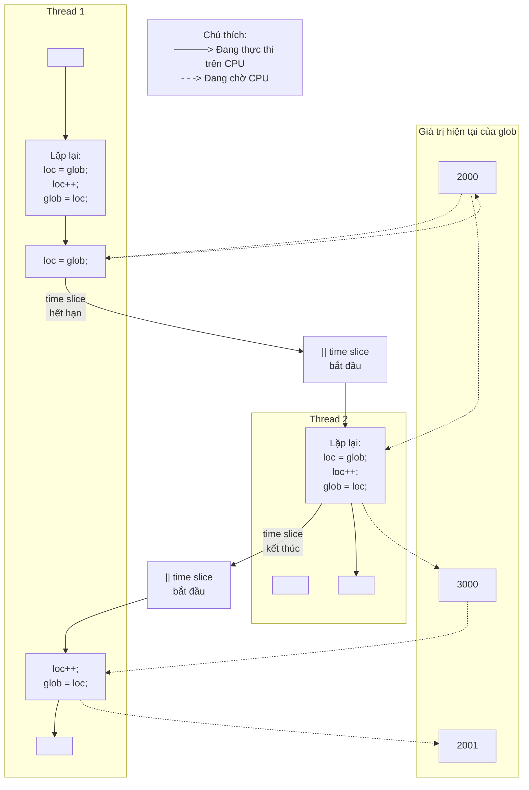

## Chương 30
# <span id="page-14-0"></span>**THREADS: ĐỒNG BỘ HÓA THREAD**

Trong chương này, chúng ta mô tả hai công cụ mà các thread có thể sử dụng để đồng bộ hóa hành động của chúng: mutex và condition variable. Mutex cho phép các thread đồng bộ hóa việc sử dụng tài nguyên chia sẻ, ví dụ như một thread không cố gắng truy cập một biến chia sẻ cùng lúc với thread khác đang sửa đổi nó. Condition variable thực hiện một nhiệm vụ bổ sung: chúng cho phép các thread thông báo cho nhau rằng một biến chia sẻ (hoặc tài nguyên chia sẻ khác) đã thay đổi trạng thái.

## **30.1 Bảo vệ Truy cập vào Biến Chia sẻ: Mutex**

<span id="page-14-1"></span>Một trong những ưu điểm chính của thread là chúng có thể chia sẻ thông tin thông qua các biến global. Tuy nhiên, việc chia sẻ dễ dàng này đi kèm với một chi phí: chúng ta phải cẩn thận rằng nhiều thread không cố gắng sửa đổi cùng một biến cùng lúc, hoặc một thread không cố gắng đọc giá trị của một biến trong khi thread khác đang sửa đổi nó. Thuật ngữ critical section được sử dụng để chỉ một đoạn code truy cập một tài nguyên chia sẻ và việc thực thi của nó phải là atomic; tức là, việc thực thi của nó không nên bị gián đoạn bởi một thread khác cũng đồng thời truy cập cùng tài nguyên chia sẻ.

Listing 30-1 cung cấp một ví dụ đơn giản về loại vấn đề có thể xảy ra khi tài nguyên chia sẻ không được truy cập theo cách atomic. Chương trình này tạo hai thread, mỗi thread thực thi cùng một hàm. Hàm thực thi một vòng lặp liên tục tăng một biến global `glob`, bằng cách sao chép `glob` vào biến cục bộ `loc`, tăng `loc`, và sao chép `loc` trở lại vào `glob`. (Vì `loc` là một biến automatic được phân bổ trên stack per-thread, mỗi thread có bản sao riêng của biến này.) Số lần lặp của vòng lặp được xác định bởi đối số dòng lệnh được cung cấp cho chương trình, hoặc bởi giá trị mặc định, nếu không có đối số nào được cung cấp.

**Listing 30-1:** Tăng không chính xác một biến global từ hai thread

```
––––––––––––––––––––––––––––––––––––––––––––––––––––– threads/thread_incr.c
#include <pthread.h>
#include "tlpi_hdr.h"
static int glob = 0;
static void * /* Loop 'arg' times incrementing 'glob' */
threadFunc(void *arg)
{
 int loops = *((int *) arg);
 int loc, j;
 for (j = 0; j < loops; j++) {
 loc = glob;
 loc++;
 glob = loc;
 }
 return NULL;
}
int
main(int argc, char *argv[])
{
 pthread_t t1, t2;
 int loops, s;
 loops = (argc > 1) ? getInt(argv[1], GN_GT_0, "num-loops") : 10000000;
 s = pthread_create(&t1, NULL, threadFunc, &loops);
 if (s != 0)
 errExitEN(s, "pthread_create");
 s = pthread_create(&t2, NULL, threadFunc, &loops);
 if (s != 0)
 errExitEN(s, "pthread_create");
 s = pthread_join(t1, NULL);
 if (s != 0)
 errExitEN(s, "pthread_join");
 s = pthread_join(t2, NULL);
 if (s != 0)
 errExitEN(s, "pthread_join");
 printf("glob = %d\n", glob);
 exit(EXIT_SUCCESS);
}
––––––––––––––––––––––––––––––––––––––––––––––––––––– threads/thread_incr.c
```



**Hình 30-1:** Hai thread tăng một biến global mà không đồng bộ hóa

Khi chúng ta chạy chương trình trong Listing 30-1 với việc chỉ định mỗi thread nên tăng biến 1000 lần, mọi thứ có vẻ ổn:

```
$ ./thread_incr 1000
glob = 2000
```

Tuy nhiên, điều có thể đã xảy ra ở đây là thread đầu tiên hoàn thành tất cả công việc của nó và kết thúc trước khi thread thứ hai thậm chí bắt đầu. Khi chúng ta yêu cầu cả hai thread làm nhiều công việc hơn nhiều, chúng ta thấy một kết quả khá khác:

```
$ ./thread_incr 10000000
glob = 16517656
```

Cuối cùng của chuỗi này, giá trị của `glob` phải là 20 triệu. Vấn đề ở đây xuất phát từ các chuỗi thực thi như sau (xem thêm Hình 30-1 ở trên):

- 1. Thread 1 lấy giá trị hiện tại của `glob` vào biến cục bộ `loc`. Giả sử giá trị hiện tại của `glob` là 2000.
- 2. Time slice của scheduler cho thread 1 hết hạn, và thread 2 bắt đầu thực thi.
- 3. Thread 2 thực hiện nhiều vòng lặp trong đó nó lấy giá trị hiện tại của `glob` vào biến cục bộ `loc`, tăng `loc`, và gán kết quả cho `glob`. Trong vòng lặp đầu tiên trong số này, giá trị được lấy từ `glob` sẽ là 2000. Giả sử khi time slice cho thread 2 hết hạn, `glob` đã được tăng lên 3000.

4. Thread 1 nhận một time slice khác và tiếp tục thực thi từ nơi nó dừng lại. Trước đó (bước 1) đã sao chép giá trị của `glob` (2000) vào `loc`, bây giờ nó tăng `loc` và gán kết quả (2001) cho `glob`. Tại thời điểm này, hiệu ứng của các thao tác tăng được thực hiện bởi thread 2 bị mất.

Nếu chúng ta chạy chương trình trong Listing 30-1 nhiều lần với cùng đối số dòng lệnh, chúng ta thấy rằng giá trị in ra của `glob` dao động mạnh:

```
$ ./thread_incr 10000000
glob = 10880429
$ ./thread_incr 10000000
glob = 13493953
```

Hành vi không xác định này là hệ quả của những thất thường trong các quyết định lên lịch CPU của kernel. Trong các chương trình phức tạp, hành vi không xác định này có nghĩa là các lỗi như vậy có thể chỉ xảy ra hiếm khi, khó tái tạo, và do đó khó tìm.

Có vẻ như chúng ta có thể loại bỏ vấn đề bằng cách thay thế ba câu lệnh bên trong vòng lặp `for` trong hàm `threadFunc()` trong Listing 30-1 bằng một câu lệnh duy nhất:

```
glob++; /* or: ++glob; */
```

Tuy nhiên, trên nhiều kiến trúc phần cứng (ví dụ: kiến trúc RISC), trình biên dịch vẫn cần chuyển đổi câu lệnh duy nhất này thành mã máy mà các bước tương đương với ba câu lệnh bên trong vòng lặp trong `threadFunc()`. Nói cách khác, mặc dù vẻ ngoài đơn giản của nó, ngay cả toán tử tăng C cũng có thể không phải là atomic, và nó có thể thể hiện hành vi mà chúng ta đã mô tả ở trên.

Để tránh các vấn đề có thể xảy ra khi các thread cố gắng cập nhật một biến chia sẻ, chúng ta phải sử dụng một mutex (viết tắt của mutual exclusion) để đảm bảo rằng chỉ có một thread tại một thời điểm có thể truy cập biến. Nói chung hơn, mutex có thể được sử dụng để đảm bảo truy cập atomic vào bất kỳ tài nguyên chia sẻ nào, nhưng bảo vệ các biến chia sẻ là cách sử dụng phổ biến nhất.

Một mutex có hai trạng thái: locked và unlocked. Tại bất kỳ thời điểm nào, nhiều nhất một thread có thể giữ khóa trên một mutex. Cố gắng lock một mutex đã bị lock sẽ block hoặc thất bại với một lỗi, tùy thuộc vào phương pháp được sử dụng để đặt khóa.

Khi một thread lock một mutex, nó trở thành owner của mutex đó. Chỉ mutex owner mới có thể unlock mutex. Thuộc tính sở hữu này cải thiện cấu trúc của code sử dụng mutex và cũng cho phép một số tối ưu hóa trong việc triển khai mutex. Vì thuộc tính sở hữu này, các thuật ngữ acquire và release đôi khi được sử dụng đồng nghĩa với lock và unlock.

Nói chung, chúng ta sử dụng một mutex khác nhau cho mỗi tài nguyên chia sẻ (có thể bao gồm nhiều biến liên quan), và mỗi thread sử dụng giao thức sau để truy cập tài nguyên:

-  lock mutex cho tài nguyên chia sẻ;
-  truy cập tài nguyên chia sẻ; và
-  unlock mutex.

Nếu nhiều thread cố gắng thực thi khối code này (một critical section), thực tế là chỉ một thread có thể giữ mutex (các thread khác vẫn bị block) có nghĩa là chỉ một thread tại một thời điểm có thể vào khối, như minh họa trong [Hình 30-2.](#page-18-0)

```text
Thread A                         Thread B

lock mutex M
     │
     ▼
access shared resource         lock mutex M
     │                              │
     │                            blocks
     ▼                              │
unlock mutex M ─ ─ ─ ─ ─ ─ ─ ─ ─ ─ -┼─> unblocks, lock granted
     │                              │
     │                              ▼
                           access shared resource
                                    │
                                    ▼
                             unlock mutex M
                                    │
                                    ▼
```

<span id="page-18-0"></span>**Hình 30-2:** Sử dụng mutex để bảo vệ một critical section

Cuối cùng, lưu ý rằng mutex locking là advisory (tư vấn), chứ không phải mandatory (bắt buộc). Điều này có nghĩa là một thread được tự do bỏ qua việc sử dụng mutex và chỉ cần truy cập các biến chia sẻ tương ứng. Để xử lý an toàn các biến chia sẻ, tất cả các thread phải hợp tác trong việc sử dụng mutex, tuân thủ các quy tắc locking mà nó thực thi.

## **30.1.1 Mutex được Phân bổ Tĩnh**

Một mutex có thể được phân bổ như một biến tĩnh hoặc được tạo động tại runtime (ví dụ: trong một khối bộ nhớ được phân bổ qua `malloc()`). Tạo mutex động phức tạp hơn một chút, và chúng ta trì hoãn việc thảo luận về nó đến Mục [30.1.5.](#page-22-0)

Một mutex là một biến kiểu `pthread_mutex_t`. Trước khi có thể sử dụng, một mutex phải luôn được khởi tạo. Đối với một mutex được phân bổ tĩnh, chúng ta có thể làm điều này bằng cách gán cho nó giá trị `PTHREAD_MUTEX_INITIALIZER`, như trong ví dụ sau:

```
pthread_mutex_t mtx = PTHREAD_MUTEX_INITIALIZER;
```

Theo SUSv3, áp dụng các thao tác mà chúng ta mô tả trong phần còn lại của mục này cho một bản sao của mutex tạo ra các kết quả không xác định. Các thao tác mutex phải luôn được thực hiện chỉ trên mutex gốc đã được khởi tạo tĩnh bằng `PTHREAD_MUTEX_INITIALIZER` hoặc được khởi tạo động bằng `pthread_mutex_init()` (được mô tả trong Mục [30.1.5\)](#page-22-0).

## **30.1.2 Lock và Unlock Mutex**

Sau khi khởi tạo, một mutex ở trạng thái unlocked. Để lock và unlock một mutex, chúng ta sử dụng các hàm `pthread_mutex_lock()` và `pthread_mutex_unlock()`.

```
#include <pthread.h>
int pthread_mutex_lock(pthread_mutex_t *mutex);
int pthread_mutex_unlock(pthread_mutex_t *mutex);
                  Both return 0 on success, or a positive error number on error
```

Để lock một mutex, chúng ta chỉ định mutex trong một lệnh gọi `pthread_mutex_lock()`. Nếu mutex hiện tại unlocked, lệnh gọi này lock mutex và trả về ngay lập tức. Nếu mutex hiện tại bị locked bởi một thread khác, thì `pthread_mutex_lock()` block cho đến khi mutex được unlock, tại thời điểm đó nó lock mutex và trả về.

Nếu thread đang gọi đã lock mutex được đưa vào `pthread_mutex_lock()`, thì, đối với loại mutex mặc định, một trong hai khả năng được xác định bởi triển khai có thể xảy ra: thread bị deadlock, block khi cố gắng lock một mutex mà nó đã sở hữu, hoặc lệnh gọi thất bại, trả về lỗi `EDEADLK`. Trên Linux, thread bị deadlock theo mặc định. (Chúng ta mô tả một số hành vi có thể khác khi chúng ta xem xét các loại mutex trong Mục [30.1.7.](#page-23-0))

Hàm `pthread_mutex_unlock()` unlock một mutex trước đó đã được lock bởi thread đang gọi. Việc unlock một mutex hiện tại không bị lock, hoặc unlock một mutex bị lock bởi thread khác là lỗi.

Nếu có nhiều hơn một thread khác đang chờ acquire mutex được unlock bởi lệnh gọi `pthread_mutex_unlock()`, thì không xác định thread nào sẽ thành công trong việc acquire nó.

## **Chương trình ví dụ**

[Listing 30-2](#page-19-0) là phiên bản sửa đổi của chương trình trong Listing 30-1. Nó sử dụng mutex để bảo vệ truy cập vào biến global `glob`. Khi chúng ta chạy chương trình này với dòng lệnh tương tự với dòng lệnh đã dùng trước đó, chúng ta thấy rằng `glob` luôn được tăng một cách đáng tin cậy:

```
$ ./thread_incr_mutex 10000000
glob = 20000000
```

<span id="page-19-0"></span>**Listing 30-2:** Sử dụng mutex để bảo vệ truy cập vào một biến global

```
–––––––––––––––––––––––––––––––––––––––––––––––– threads/thread_incr_mutex.c
#include <pthread.h>
#include "tlpi_hdr.h"
static int glob = 0;
static pthread_mutex_t mtx = PTHREAD_MUTEX_INITIALIZER;
static void * /* Loop 'arg' times incrementing 'glob' */
threadFunc(void *arg)
{
 int loops = *((int *) arg);
 int loc, j, s;
 for (j = 0; j < loops; j++) {
 s = pthread_mutex_lock(&mtx);
 if (s != 0)
 errExitEN(s, "pthread_mutex_lock");
```

```
 loc = glob;
 loc++;
 glob = loc;
 s = pthread_mutex_unlock(&mtx);
 if (s != 0)
 errExitEN(s, "pthread_mutex_unlock");
 }
 return NULL;
}
int
main(int argc, char *argv[])
{
 pthread_t t1, t2;
 int loops, s;
 loops = (argc > 1) ? getInt(argv[1], GN_GT_0, "num-loops") : 10000000;
 s = pthread_create(&t1, NULL, threadFunc, &loops);
 if (s != 0)
 errExitEN(s, "pthread_create");
 s = pthread_create(&t2, NULL, threadFunc, &loops);
 if (s != 0)
 errExitEN(s, "pthread_create");
 s = pthread_join(t1, NULL);
 if (s != 0)
 errExitEN(s, "pthread_join");
 s = pthread_join(t2, NULL);
 if (s != 0)
 errExitEN(s, "pthread_join");
 printf("glob = %d\n", glob);
 exit(EXIT_SUCCESS);
}
```

–––––––––––––––––––––––––––––––––––––––––––––––– **threads/thread\_incr\_mutex.c**

## **`pthread_mutex_trylock()` và `pthread_mutex_timedlock()`**

API Pthreads cung cấp hai biến thể của hàm `pthread_mutex_lock()`: `pthread_mutex_trylock()` và `pthread_mutex_timedlock()`. (Xem các trang manual để biết nguyên mẫu của các hàm này.)

Hàm `pthread_mutex_trylock()` giống như `pthread_mutex_lock()`, ngoại trừ nếu mutex hiện tại bị locked, `pthread_mutex_trylock()` thất bại, trả về lỗi `EBUSY`.

Hàm `pthread_mutex_timedlock()` giống như `pthread_mutex_lock()`, ngoại trừ caller có thể chỉ định một đối số bổ sung, `abstime`, đặt giới hạn về thời gian thread sẽ ngủ khi chờ acquire mutex. Nếu khoảng thời gian được chỉ định bởi đối số `abstime` của nó hết hạn mà caller chưa trở thành owner của mutex, `pthread_mutex_timedlock()` trả về lỗi `ETIMEDOUT`.

Các hàm `pthread_mutex_trylock()` và `pthread_mutex_timedlock()` được sử dụng ít thường xuyên hơn nhiều so với `pthread_mutex_lock()`. Trong hầu hết các ứng dụng được thiết kế tốt, một thread chỉ nên giữ mutex trong một thời gian ngắn, để các thread khác không bị ngăn chặn thực thi song song. Điều này đảm bảo rằng các thread khác bị block trên mutex sẽ sớm được cấp khóa trên mutex. Một thread sử dụng `pthread_mutex_trylock()` để định kỳ poll mutex để xem nó có thể bị lock không có nguy cơ bị đói tài nguyên (starved) truy cập vào mutex trong khi các thread khác đang xếp hàng được liên tục cấp quyền truy cập vào mutex thông qua `pthread_mutex_lock()`.

## **30.1.3 Hiệu suất của Mutex**

Chi phí sử dụng mutex là bao nhiêu? Chúng ta đã trình bày hai phiên bản khác nhau của một chương trình tăng một biến chia sẻ: một phiên bản không có mutex (Listing 30-1) và một phiên bản có mutex ([Listing 30-2](#page-19-0)). Khi chúng ta chạy hai chương trình này trên hệ thống x86-32 chạy Linux 2.6.31 (với NPTL), chúng ta thấy rằng phiên bản không có mutex cần tổng cộng 0,35 giây để thực thi 10 triệu vòng lặp trong mỗi thread (và tạo ra kết quả sai), trong khi phiên bản với mutex cần 3,1 giây.

Thoạt đầu, điều này có vẻ tốn kém. Nhưng, hãy xem xét vòng lặp chính được thực thi bởi phiên bản không sử dụng mutex (Listing 30-1). Trong phiên bản đó, hàm `threadFunc()` thực thi một vòng lặp `for` tăng một biến điều khiển vòng lặp, so sánh biến đó với một biến khác, thực hiện hai phép gán và một thao tác tăng khác, sau đó nhảy trở lại đầu vòng lặp. Phiên bản sử dụng mutex ([Listing 30-2](#page-19-0)) thực hiện các bước tương tự, và lock và unlock mutex mỗi vòng lặp. Nói cách khác, chi phí lock và unlock mutex ít hơn mười lần so với chi phí của các thao tác mà chúng ta liệt kê cho chương trình đầu tiên. Điều này tương đối rẻ. Hơn nữa, trong trường hợp thông thường, một thread sẽ dành nhiều thời gian hơn để làm công việc khác, và thực hiện tương đối ít thao tác lock và unlock mutex hơn, vì vậy tác động hiệu suất của việc sử dụng mutex không đáng kể trong hầu hết các ứng dụng.

Để đặt điều này vào góc độ rộng hơn, chạy một số chương trình kiểm tra đơn giản trên cùng hệ thống cho thấy 20 triệu vòng lặp lock và unlock một vùng file bằng `fcntl()` (Mục 55.3) cần 44 giây, và 20 triệu vòng lặp tăng và giảm một System V semaphore (Chương 47) cần 28 giây. Vấn đề với file lock và semaphore là chúng luôn yêu cầu một system call cho các thao tác lock và unlock, và mỗi system call có một chi phí nhỏ nhưng đáng kể (Mục 3.1). Ngược lại, mutex được triển khai bằng các thao tác ngôn ngữ máy atomic (được thực hiện trên các vị trí bộ nhớ hiển thị với tất cả các thread) và chỉ yêu cầu system call trong trường hợp có tranh chấp lock.

> Trên Linux, mutex được triển khai bằng futex (từ viết tắt xuất phát từ fast user space mutex), và tranh chấp lock được xử lý bằng system call `futex()`. Chúng ta không mô tả futex trong cuốn sách này (chúng không dành cho việc sử dụng trực tiếp trong các ứng dụng user-space), nhưng chi tiết có thể được tìm thấy trong [Drepper, 2004 (a)], cũng mô tả cách mutex được triển khai bằng futex. [Franke et al., 2002] là một bài báo (hiện đã lỗi thời) được viết bởi các nhà phát triển của futex, mô tả triển khai futex ban đầu và xem xét các cải tiến hiệu suất thu được từ futex.

## **30.1.4 Deadlock của Mutex**

Đôi khi, một thread cần đồng thời truy cập hai hoặc nhiều tài nguyên chia sẻ khác nhau, mỗi tài nguyên được quản lý bởi một mutex riêng biệt. Khi có nhiều hơn một thread lock cùng tập hợp mutex, tình huống deadlock có thể xảy ra. [Hình 30-3](#page-22-1) cho thấy một ví dụ về deadlock trong đó mỗi thread thành công lock một mutex, và sau đó cố gắng lock mutex mà thread kia đã lock. Cả hai thread sẽ vẫn bị block vô thời hạn.

| Thread A                       | Thread B                       |
|--------------------------------|--------------------------------|
| 1. `pthread_mutex_lock(mutex1)`; | 1. `pthread_mutex_lock(mutex2)`; |
| 2. `pthread_mutex_lock(mutex2)`; | 2. `pthread_mutex_lock(mutex1)`; |
| blocks                         | blocks                         |

<span id="page-22-1"></span>**Hình 30-3:** Deadlock khi hai thread lock hai mutex

Cách đơn giản nhất để tránh deadlock như vậy là định nghĩa một thứ bậc mutex. Khi các thread có thể lock cùng tập hợp mutex, chúng phải luôn lock chúng theo cùng một thứ tự. Ví dụ, trong kịch bản trong [Hình 30-3,](#page-22-1) deadlock có thể được tránh nếu hai thread luôn lock mutex theo thứ tự `mutex1` tiếp theo là `mutex2`. Đôi khi, có một thứ bậc mutex hiển nhiên về mặt logic. Tuy nhiên, ngay cả khi không có, có thể có thể nghĩ ra một thứ bậc tùy ý mà tất cả các thread nên tuân theo.

Một chiến lược thay thế được sử dụng ít thường xuyên hơn là "thử, và sau đó rút lui". Trong chiến lược này, một thread lock mutex đầu tiên bằng `pthread_mutex_lock()`, sau đó lock các mutex còn lại bằng `pthread_mutex_trylock()`. Nếu bất kỳ lệnh gọi `pthread_mutex_trylock()` nào thất bại (với `EBUSY`), thì thread giải phóng tất cả mutex, và sau đó thử lại, có thể sau một khoảng thời gian trễ. Cách tiếp cận này kém hiệu quả hơn thứ bậc lock, vì có thể cần nhiều lần lặp. Mặt khác, nó có thể linh hoạt hơn, vì nó không đòi hỏi một thứ bậc mutex cứng nhắc. Một ví dụ về chiến lược này được hiển thị trong [Butenhof, 1996].

## <span id="page-22-0"></span>**30.1.5 Khởi tạo Động một Mutex**

Giá trị khởi tạo tĩnh `PTHREAD_MUTEX_INITIALIZER` chỉ có thể được sử dụng để khởi tạo một mutex được phân bổ tĩnh với các thuộc tính mặc định. Trong tất cả các trường hợp khác, chúng ta phải khởi tạo mutex động bằng `pthread_mutex_init()`.

```
#include <pthread.h>
int pthread_mutex_init(pthread_mutex_t *mutex, const pthread_mutexattr_t *attr);
                      Returns 0 on success, or a positive error number on error
```

Đối số `mutex` xác định mutex cần được khởi tạo. Đối số `attr` là một pointer đến đối tượng `pthread_mutexattr_t` đã được khởi tạo trước đó để định nghĩa các thuộc tính cho mutex. (Chúng ta sẽ nói thêm về các thuộc tính mutex trong mục tiếp theo.) Nếu `attr` được chỉ định là NULL, thì mutex được gán các thuộc tính mặc định khác nhau.

SUSv3 chỉ định rằng việc khởi tạo một mutex đã được khởi tạo dẫn đến hành vi không xác định; chúng ta không nên làm điều này.

Trong số các trường hợp mà chúng ta phải sử dụng `pthread_mutex_init()` thay vì một bộ khởi tạo tĩnh là:

-  Mutex được phân bổ động trên heap. Ví dụ, giả sử chúng ta tạo một danh sách liên kết được phân bổ động của các cấu trúc, và mỗi cấu trúc trong danh sách bao gồm một trường `pthread_mutex_t` giữ một mutex được sử dụng để bảo vệ truy cập vào cấu trúc đó.
-  Mutex là một biến automatic được phân bổ trên stack.
-  Chúng ta muốn khởi tạo một mutex được phân bổ tĩnh với các thuộc tính khác với mặc định.

Khi một mutex được phân bổ automatically hoặc dynamically không còn cần thiết, nó nên được hủy bằng `pthread_mutex_destroy()`. (Không cần gọi `pthread_mutex_destroy()` trên một mutex được khởi tạo tĩnh bằng `PTHREAD_MUTEX_INITIALIZER`.)

```
#include <pthread.h>
int pthread_mutex_destroy(pthread_mutex_t *mutex);
                      Returns 0 on success, or a positive error number on error
```

Việc hủy một mutex chỉ an toàn khi nó ở trạng thái unlocked, và không có thread nào sẽ cố gắng lock nó sau đó. Nếu mutex nằm trong một vùng bộ nhớ được phân bổ động, thì nó nên được hủy trước khi giải phóng vùng bộ nhớ đó. Một mutex được phân bổ automatically nên được hủy trước khi hàm host của nó trả về.

Một mutex đã được hủy với `pthread_mutex_destroy()` có thể được khởi tạo lại bằng `pthread_mutex_init()`.

## **30.1.6 Thuộc tính Mutex**

Như đã lưu ý trước đó, đối số `attr` của `pthread_mutex_init()` có thể được sử dụng để chỉ định đối tượng `pthread_mutexattr_t` định nghĩa các thuộc tính của một mutex. Các hàm Pthreads khác nhau có thể được sử dụng để khởi tạo và truy xuất các thuộc tính trong đối tượng `pthread_mutexattr_t`. Chúng ta sẽ không đi vào tất cả chi tiết của các thuộc tính mutex hoặc hiển thị nguyên mẫu của các hàm khác nhau có thể được sử dụng để khởi tạo các thuộc tính trong đối tượng `pthread_mutexattr_t`. Tuy nhiên, chúng ta sẽ mô tả một trong các thuộc tính có thể được đặt cho một mutex: loại của nó.

## <span id="page-23-0"></span>**30.1.7 Loại Mutex**

Trong các trang trước, chúng ta đã đưa ra một số câu lệnh về hành vi của mutex:

-  Một thread duy nhất không thể lock cùng một mutex hai lần.
-  Một thread không thể unlock một mutex mà nó hiện không sở hữu (tức là nó chưa lock).
-  Một thread không thể unlock một mutex hiện tại không bị lock.

Chính xác điều gì xảy ra trong mỗi trường hợp này phụ thuộc vào loại mutex. SUSv3 định nghĩa các loại mutex sau:

#### `PTHREAD_MUTEX_NORMAL`

Phát hiện deadlock (tự gây ra) không được cung cấp cho loại mutex này. Nếu một thread cố gắng lock một mutex mà nó đã lock, thì deadlock xảy ra. Unlock một mutex không bị lock hoặc bị lock bởi thread khác tạo ra kết quả không xác định. (Trên Linux, cả hai thao tác này đều thành công cho loại mutex này.)

#### `PTHREAD_MUTEX_ERRORCHECK`

Kiểm tra lỗi được thực hiện trên tất cả các thao tác. Cả ba kịch bản ở trên đều khiến hàm Pthreads liên quan trả về một lỗi. Loại mutex này thường chậm hơn một mutex bình thường, nhưng có thể hữu ích như một công cụ gỡ lỗi để khám phá nơi ứng dụng vi phạm các quy tắc về cách sử dụng mutex.

#### `PTHREAD_MUTEX_RECURSIVE`

Một recursive mutex duy trì khái niệm về số lần lock. Khi một thread lần đầu acquire mutex, số lần lock được đặt thành 1. Mỗi thao tác lock tiếp theo bởi cùng thread tăng số lần lock, và mỗi thao tác unlock giảm số lần lock. Mutex được giải phóng (tức là được làm sẵn có cho các thread khác acquire) chỉ khi số lần lock về 0. Unlock một mutex chưa bị lock thất bại, cũng như unlock một mutex hiện đang bị lock bởi thread khác.

Triển khai threading Linux cung cấp các bộ khởi tạo tĩnh không chuẩn cho mỗi loại mutex ở trên (ví dụ: `PTHREAD_RECURSIVE_MUTEX_INITIALIZER_NP`), để không cần sử dụng `pthread_mutex_init()` để khởi tạo các loại mutex này cho mutex được phân bổ tĩnh. Tuy nhiên, các ứng dụng di động nên tránh sử dụng các bộ khởi tạo này.

Ngoài các loại mutex ở trên, SUSv3 định nghĩa loại `PTHREAD_MUTEX_DEFAULT`, là loại mutex mặc định nếu chúng ta sử dụng `PTHREAD_MUTEX_INITIALIZER` hoặc chỉ định `attr` là NULL trong lệnh gọi `pthread_mutex_init()`. Hành vi của loại mutex này được cố ý không xác định trong cả ba kịch bản được mô tả ở đầu mục này, điều này cho phép linh hoạt tối đa cho việc triển khai hiệu quả mutex. Trên Linux, mutex `PTHREAD_MUTEX_DEFAULT` hoạt động như mutex `PTHREAD_MUTEX_NORMAL`.

Code được hiển thị trong [Listing 30-3](#page-24-0) minh họa cách đặt loại của một mutex, trong trường hợp này để tạo một error-checking mutex.

#### <span id="page-24-0"></span>**Listing 30-3:** Đặt loại mutex

```
 pthread_mutex_t mtx;
 pthread_mutexattr_t mtxAttr;
 int s, type;
 s = pthread_mutexattr_init(&mtxAttr);
 if (s != 0)
 errExitEN(s, "pthread_mutexattr_init");
```

```
 s = pthread_mutexattr_settype(&mtxAttr, PTHREAD_MUTEX_ERRORCHECK);
 if (s != 0)
 errExitEN(s, "pthread_mutexattr_settype");
 s = pthread_mutex_init(mtx, &mtxAttr);
 if (s != 0)
 errExitEN(s, "pthread_mutex_init");
 s = pthread_mutexattr_destroy(&mtxAttr); /* No longer needed */
 if (s != 0)
 errExitEN(s, "pthread_mutexattr_destroy");
```

# **30.2 Thông báo Thay đổi Trạng thái: Condition Variable**

Một mutex ngăn nhiều thread truy cập một biến chia sẻ cùng lúc. Một condition variable cho phép một thread thông báo cho các thread khác về các thay đổi trong trạng thái của một biến chia sẻ (hoặc tài nguyên chia sẻ khác) và cho phép các thread khác chờ (block) thông báo như vậy.

Một ví dụ đơn giản không sử dụng condition variable phục vụ để minh họa tại sao chúng hữu ích. Giả sử chúng ta có một số thread sản xuất một số "đơn vị kết quả" được tiêu thụ bởi main thread, và chúng ta sử dụng một biến được bảo vệ bởi mutex `avail`, để đại diện cho số đơn vị đã sản xuất đang chờ tiêu thụ:

```
static pthread_mutex_t mtx = PTHREAD_MUTEX_INITIALIZER;
static int avail = 0;
```

Các đoạn code được hiển thị trong mục này có thể được tìm thấy trong file `threads/prod_no_condvar.c` trong phân phối mã nguồn của cuốn sách này.

Trong các thread producer, chúng ta có code như sau:

```
/* Code to produce a unit omitted */
s = pthread_mutex_lock(&mtx);
if (s != 0)
 errExitEN(s, "pthread_mutex_lock");
avail++; /* Let consumer know another unit is available */
s = pthread_mutex_unlock(&mtx);
if (s != 0)
 errExitEN(s, "pthread_mutex_unlock");
```

Và trong main thread (consumer), chúng ta có thể sử dụng code sau:

```
for (;;) {
 s = pthread_mutex_lock(&mtx);
 if (s != 0)
 errExitEN(s, "pthread_mutex_lock");
```

```
 while (avail > 0) { /* Consume all available units */
 /* Do something with produced unit */
 avail--;
 }
 s = pthread_mutex_unlock(&mtx);
 if (s != 0)
 errExitEN(s, "pthread_mutex_unlock");
}
```

Code trên hoạt động, nhưng lãng phí thời gian CPU, vì main thread liên tục lặp lại, kiểm tra trạng thái của biến `avail`. Một condition variable khắc phục vấn đề này. Nó cho phép một thread ngủ (chờ) cho đến khi thread khác thông báo (signal) cho nó rằng nó phải làm gì đó (tức là một số "điều kiện" đã phát sinh mà thread đang ngủ phải phản hồi).

Một condition variable luôn được sử dụng kết hợp với một mutex. Mutex cung cấp mutual exclusion để truy cập biến chia sẻ, trong khi condition variable được sử dụng để signal các thay đổi trong trạng thái của biến. (Việc sử dụng thuật ngữ signal ở đây không liên quan gì đến signal được mô tả trong Chương 20 đến 22; thay vào đó, nó được sử dụng theo nghĩa indicate.)

## **30.2.1 Condition Variable được Phân bổ Tĩnh**

Như với mutex, condition variable có thể được phân bổ tĩnh hoặc động. Chúng ta trì hoãn thảo luận về condition variable được phân bổ động đến Mục [30.2.5,](#page-34-0) và xem xét condition variable được phân bổ tĩnh ở đây.

Một condition variable có kiểu `pthread_cond_t`. Như với mutex, một condition variable phải được khởi tạo trước khi sử dụng. Đối với một condition variable được phân bổ tĩnh, điều này được thực hiện bằng cách gán cho nó giá trị `PTHREAD_COND_INITIALIZER`, như trong ví dụ sau:

```
pthread_cond_t cond = PTHREAD_COND_INITIALIZER;
```

Theo SUSv3, áp dụng các thao tác mà chúng ta mô tả trong phần còn lại của mục này cho một bản sao của condition variable tạo ra các kết quả không xác định. Các thao tác phải luôn được thực hiện chỉ trên condition variable gốc đã được khởi tạo tĩnh bằng `PTHREAD_COND_INITIALIZER` hoặc được khởi tạo động bằng `pthread_cond_init()` (được mô tả trong Mục [30.2.5](#page-34-0)).

## **30.2.2 Signal và Chờ trên Condition Variable**

Các thao tác condition variable chính là signal và wait. Thao tác signal là thông báo cho một hoặc nhiều thread đang chờ rằng trạng thái của một biến chia sẻ đã thay đổi. Thao tác wait là phương tiện block cho đến khi thông báo như vậy được nhận.

Các hàm `pthread_cond_signal()` và `pthread_cond_broadcast()` đều signal condition variable được chỉ định bởi `cond`. Hàm `pthread_cond_wait()` block một thread cho đến khi condition variable `cond` được signal.

```
#include <pthread.h>
int pthread_cond_signal(pthread_cond_t *cond);
int pthread_cond_broadcast(pthread_cond_t *cond);
int pthread_cond_wait(pthread_cond_t *cond, pthread_mutex_t *mutex);
                    All return 0 on success, or a positive error number on error
```

Sự khác biệt giữa `pthread_cond_signal()` và `pthread_cond_broadcast()` nằm ở điều gì xảy ra nếu nhiều thread đang block trong `pthread_cond_wait()`. Với `pthread_cond_signal()`, chúng ta chỉ được đảm bảo rằng ít nhất một trong các thread bị block được đánh thức; với `pthread_cond_broadcast()`, tất cả các thread bị block đều được đánh thức.

Sử dụng `pthread_cond_broadcast()` luôn tạo ra kết quả chính xác (vì tất cả các thread nên được lập trình để xử lý các lần đánh thức dư thừa và giả), nhưng `pthread_cond_signal()` có thể hiệu quả hơn. Tuy nhiên, `pthread_cond_signal()` chỉ nên được sử dụng nếu chỉ một trong các thread đang chờ cần được đánh thức để xử lý thay đổi trong trạng thái của biến chia sẻ, và không quan trọng thread nào trong các thread đang chờ được đánh thức. Kịch bản này thường áp dụng khi tất cả các thread đang chờ được thiết kế để thực hiện cùng một tác vụ. Với những giả định này, `pthread_cond_signal()` có thể hiệu quả hơn `pthread_cond_broadcast()`, vì nó tránh khả năng sau:

- 1. Tất cả các thread đang chờ được đánh thức.
- 2. Một thread được lên lịch đầu tiên. Thread này kiểm tra trạng thái của biến chia sẻ (dưới sự bảo vệ của mutex liên kết) và thấy rằng có công việc cần làm. Thread thực hiện công việc cần thiết, thay đổi trạng thái của biến chia sẻ để chỉ ra rằng công việc đã được thực hiện, và unlock mutex liên kết.
- 3. Mỗi thread còn lại lần lượt lock mutex và kiểm tra trạng thái của biến chia sẻ. Tuy nhiên, vì thay đổi được thực hiện bởi thread đầu tiên, các thread này thấy rằng không có công việc cần làm, và do đó unlock mutex và quay trở lại ngủ (tức là gọi `pthread_cond_wait()` thêm một lần nữa).

Ngược lại, `pthread_cond_broadcast()` xử lý trường hợp mà các thread đang chờ được thiết kế để thực hiện các tác vụ khác nhau (trong trường hợp này chúng có thể có các predicate khác nhau liên kết với condition variable).

Một condition variable không giữ thông tin trạng thái. Nó chỉ là một cơ chế để truyền thông tin về trạng thái của ứng dụng. Nếu không có thread nào đang chờ trên condition variable vào thời điểm nó được signal, thì signal bị mất. Một thread sau đó chờ trên condition variable sẽ chỉ unblock khi biến được signal thêm một lần nữa.

Hàm `pthread_cond_timedwait()` giống như `pthread_cond_wait()`, ngoại trừ đối số `abstime` chỉ định giới hạn trên về thời gian thread sẽ ngủ khi chờ condition variable được signal.

```
#include <pthread.h>
int pthread_cond_timedwait(pthread_cond_t *cond, pthread_mutex_t *mutex,
 const struct timespec *abstime);
                   Returns 0 on success, or a positive error number on error
```

Đối số `abstime` là một cấu trúc `timespec` (Mục 23.4.2) chỉ định một thời gian tuyệt đối được biểu thị bằng giây và nano giây kể từ Epoch (Mục 10.1). Nếu khoảng thời gian được chỉ định bởi `abstime` hết hạn mà không có condition variable được signal, thì `pthread_cond_timedwait()` trả về lỗi `ETIMEDOUT`.

### **Sử dụng condition variable trong ví dụ producer-consumer**

Hãy sửa đổi ví dụ trước của chúng ta để sử dụng condition variable. Các khai báo biến global và mutex và condition variable liên kết của chúng ta như sau:

```
static pthread_mutex_t mtx = PTHREAD_MUTEX_INITIALIZER;
static pthread_cond_t cond = PTHREAD_COND_INITIALIZER;
static int avail = 0;
```

Các đoạn code được hiển thị trong mục này có thể được tìm thấy trong file `threads/prod_condvar.c` trong phân phối mã nguồn của cuốn sách này.

Code trong các thread producer giống như trước, ngoại trừ chúng ta thêm một lệnh gọi `pthread_cond_signal()`:

```
s = pthread_mutex_lock(&mtx);
if (s != 0)
 errExitEN(s, "pthread_mutex_lock");
avail++; /* Let consumer know another unit is available */
s = pthread_mutex_unlock(&mtx);
if (s != 0)
 errExitEN(s, "pthread_mutex_unlock");
s = pthread_cond_signal(&cond); /* Wake sleeping consumer */
if (s != 0)
 errExitEN(s, "pthread_cond_signal");
```

Trước khi xem xét code của consumer, chúng ta cần giải thích `pthread_cond_wait()` chi tiết hơn. Chúng ta đã lưu ý trước đó rằng một condition variable luôn có mutex liên kết. Cả hai đối tượng này đều được truyền làm đối số cho `pthread_cond_wait()`, thực hiện các bước sau:

-  unlock mutex được chỉ định bởi `mutex`;
-  block thread đang gọi cho đến khi thread khác signal condition variable `cond`; và
-  lock lại `mutex`.

Hàm `pthread_cond_wait()` được thiết kế để thực hiện các bước này vì, thông thường, chúng ta truy cập một biến chia sẻ theo cách sau:

```
s = pthread_mutex_lock(&mtx);
if (s != 0)
 errExitEN(s, "pthread_mutex_lock");
while (/* Check that shared variable is not in state we want */)
 pthread_cond_wait(&cond, &mtx);
/* Now shared variable is in desired state; do some work */
s = pthread_mutex_unlock(&mtx);
if (s != 0)
 errExitEN(s, "pthread_mutex_unlock");
```

(Chúng ta giải thích tại sao lệnh gọi `pthread_cond_wait()` được đặt trong vòng lặp `while` thay vì câu lệnh `if` trong mục tiếp theo.)

Trong code trên, cả hai lần truy cập vào biến chia sẻ đều phải được bảo vệ bởi mutex vì những lý do mà chúng ta đã giải thích trước đó. Nói cách khác, có một sự liên kết tự nhiên của mutex với condition variable:

- 1. Thread lock mutex để chuẩn bị kiểm tra trạng thái của biến chia sẻ.
- 2. Trạng thái của biến chia sẻ được kiểm tra.
- 3. Nếu biến chia sẻ không ở trạng thái mong muốn, thì thread phải unlock mutex (để các thread khác có thể truy cập biến chia sẻ) trước khi nó ngủ trên condition variable.
- 4. Khi thread được đánh thức lại vì condition variable đã được signal, mutex phải được lock lại, vì thông thường thread sau đó ngay lập tức truy cập biến chia sẻ.

Hàm `pthread_cond_wait()` tự động thực hiện việc unlock và lock mutex cần thiết trong hai bước cuối trong số này. Trong bước thứ ba, việc giải phóng mutex và block trên condition variable được thực hiện theo cách atomic. Nói cách khác, không thể cho thread khác acquire mutex và signal condition variable trước khi thread gọi `pthread_cond_wait()` đã block trên condition variable.

> Có một hệ quả từ quan sát rằng có một mối quan hệ tự nhiên giữa condition variable và mutex: tất cả các thread đồng thời chờ trên một condition variable cụ thể phải chỉ định cùng một mutex trong các lệnh gọi `pthread_cond_wait()` (hoặc `pthread_cond_timedwait()`) của chúng. Thực tế là lệnh gọi `pthread_cond_wait()` liên kết động một condition variable với một mutex duy nhất trong suốt thời gian lệnh gọi. SUSv3 lưu ý rằng kết quả của việc sử dụng nhiều hơn một mutex cho các lệnh gọi `pthread_cond_wait()` đồng thời trên cùng condition variable là không xác định.

Kết hợp các chi tiết trên, chúng ta bây giờ có thể sửa đổi main thread (consumer) để sử dụng `pthread_cond_wait()`, như sau:

```
for (;;) {
 s = pthread_mutex_lock(&mtx);
 if (s != 0)
 errExitEN(s, "pthread_mutex_lock");
 while (avail == 0) { /* Wait for something to consume */
 s = pthread_cond_wait(&cond, &mtx);
 if (s != 0)
 errExitEN(s, "pthread_cond_wait");
 }
 while (avail > 0) { /* Consume all available units */
 /* Do something with produced unit */
 avail--;
 }
 s = pthread_mutex_unlock(&mtx);
   if (s != 0)
 errExitEN(s, "pthread_mutex_unlock");
   /* Perhaps do other work here that doesn't require mutex lock */
}
```

Chúng ta kết thúc với một quan sát cuối cùng về việc sử dụng `pthread_cond_signal()` (và `pthread_cond_broadcast()`). Trong code producer được hiển thị trước đó, chúng ta gọi `pthread_mutex_unlock()`, và sau đó gọi `pthread_cond_signal()`; tức là, chúng ta trước tiên unlock mutex liên kết với biến chia sẻ, và sau đó signal condition variable tương ứng. Chúng ta có thể đảo ngược hai bước này; SUSv3 cho phép chúng được thực hiện theo thứ tự nào.

> [Butenhof, 1996] chỉ ra rằng, trên một số triển khai, việc unlock mutex và sau đó signal condition variable có thể mang lại hiệu suất tốt hơn so với thực hiện các bước này theo thứ tự ngược lại. Nếu mutex chỉ được unlock sau khi condition variable được signal, thread thực hiện `pthread_cond_wait()` có thể thức dậy trong khi mutex vẫn bị locked, và sau đó ngay lập tức quay trở lại ngủ khi nó thấy mutex bị locked. Điều này dẫn đến hai context switch thừa. Một số triển khai loại bỏ vấn đề này bằng cách sử dụng một kỹ thuật gọi là wait morphing, di chuyển thread được signal từ hàng đợi chờ condition variable sang hàng đợi chờ mutex mà không thực hiện context switch nếu mutex bị locked.

## **30.2.3 Kiểm tra Predicate của Condition Variable**

<span id="page-30-0"></span>Mỗi condition variable có một predicate liên kết liên quan đến một hoặc nhiều biến chia sẻ. Ví dụ, trong đoạn code trong mục trước, predicate liên kết với `cond` là `(avail == 0)`. Đoạn code này minh họa một nguyên tắc thiết kế chung: lệnh gọi `pthread_cond_wait()` phải được điều khiển bởi một vòng lặp `while` thay vì một câu lệnh `if`. Điều này là vì, khi trở về từ `pthread_cond_wait()`, không có đảm bảo nào về trạng thái của predicate; do đó, chúng ta nên kiểm tra lại predicate ngay lập tức và tiếp tục ngủ nếu nó không ở trạng thái mong muốn.

Chúng ta không thể đưa ra bất kỳ giả định nào về trạng thái của predicate khi trả về từ `pthread_cond_wait()`, vì những lý do sau:

-  Các thread khác có thể được đánh thức trước. Có thể một số thread đang chờ để acquire mutex liên kết với condition variable. Ngay cả khi thread signal mutex đặt predicate vào trạng thái mong muốn, vẫn có thể một thread khác acquire mutex trước và thay đổi trạng thái của biến chia sẻ liên kết, và do đó thay đổi trạng thái của predicate.
-  Thiết kế cho các predicate "lỏng lẻo" có thể đơn giản hơn. Đôi khi, dễ dàng hơn để thiết kế các ứng dụng dựa trên condition variable chỉ ra khả năng thay vì chắc chắn. Nói cách khác, signal một condition variable sẽ có nghĩa là "có thể có gì đó" để thread được signal làm, thay vì "có gì đó" cần làm. Sử dụng cách tiếp cận này, condition variable có thể được signal dựa trên các xấp xỉ của trạng thái predicate, và thread được signal có thể xác định xem thực sự có gì đó cần làm hay không bằng cách kiểm tra lại predicate.
-  Các spurious wake-up có thể xảy ra. Trên một số triển khai, một thread chờ trên condition variable có thể được đánh thức ngay cả khi không có thread khác thực sự signal condition variable. Các spurious wake-up như vậy là hệ quả hiếm gặp của các kỹ thuật cần thiết để triển khai hiệu quả trên một số hệ thống đa bộ xử lý, và được SUSv3 cho phép rõ ràng.

## **30.2.4 Chương trình Ví dụ: Join với Bất kỳ Thread nào đã Kết thúc**

<span id="page-31-0"></span>Chúng ta đã lưu ý trước đó rằng `pthread_join()` chỉ có thể được sử dụng để join với một thread cụ thể. Nó không cung cấp cơ chế để join với bất kỳ thread nào đã kết thúc. Chúng ta bây giờ cho thấy cách một condition variable có thể được sử dụng để vượt qua hạn chế này.

Chương trình trong [Listing 30-4](#page-32-0) tạo một thread cho mỗi đối số dòng lệnh của nó. Mỗi thread ngủ trong số giây được chỉ định trong đối số dòng lệnh tương ứng và sau đó kết thúc. Khoảng thời gian ngủ là phương tiện mô phỏng ý tưởng về một thread thực hiện công việc trong một khoảng thời gian.

Chương trình duy trì một tập hợp biến global ghi lại thông tin về tất cả các thread đã được tạo. Đối với mỗi thread, một phần tử trong mảng `thread` global ghi lại ID của thread (trường `tid`) và trạng thái hiện tại của nó (trường `state`). Trường `state` có một trong các giá trị sau: `TS_ALIVE`, nghĩa là thread vẫn sống; `TS_TERMINATED`, nghĩa là thread đã kết thúc nhưng chưa được join; hoặc `TS_JOINED`, nghĩa là thread đã kết thúc và đã được join.

Khi mỗi thread kết thúc, nó gán giá trị `TS_TERMINATED` cho trường `state` cho phần tử của nó trong mảng thread, tăng bộ đếm global của các thread đã kết thúc nhưng chưa được join (`numUnjoined`), và signal condition variable `threadDied`.

Main thread sử dụng một vòng lặp liên tục chờ trên condition variable `threadDied`. Bất cứ khi nào `threadDied` được signal và có các thread đã kết thúc chưa được join, main thread quét mảng thread, tìm kiếm các phần tử có `state` được đặt thành `TS_TERMINATED`. Đối với mỗi thread ở trạng thái này, `pthread_join()` được gọi bằng cách sử dụng trường `tid` tương ứng từ mảng thread, và sau đó `state` được đặt thành `TS_JOINED`. Vòng lặp chính kết thúc khi tất cả các thread được tạo bởi main thread đã chết—tức là khi biến global `numLive` là 0.

Phiên shell sau đây minh họa việc sử dụng chương trình trong Listing 30-4:

```
$ ./thread_multijoin 1 1 2 3 3 Create 5 threads
Thread 0 terminating
Thread 1 terminating
Reaped thread 0 (numLive=4)
Reaped thread 1 (numLive=3)
Thread 2 terminating
Reaped thread 2 (numLive=2)
Thread 3 terminating
Thread 4 terminating
Reaped thread 3 (numLive=1)
Reaped thread 4 (numLive=0)
```

Cuối cùng, lưu ý rằng mặc dù các thread trong chương trình ví dụ được tạo như joinable và được thu hồi ngay khi kết thúc bằng cách sử dụng `pthread_join()`, chúng ta không cần sử dụng cách tiếp cận này để biết về việc kết thúc thread. Chúng ta có thể đã làm cho các thread detached, loại bỏ việc sử dụng `pthread_join()`, và chỉ sử dụng mảng thread (và các biến global liên kết) như phương tiện ghi lại sự kết thúc của mỗi thread.

<span id="page-32-0"></span>**Listing 30-4:** Một main thread có thể join với bất kỳ thread nào đã kết thúc

```
–––––––––––––––––––––––––––––––––––––––––––––––––threads/thread_multijoin.c
#include <pthread.h>
#include "tlpi_hdr.h"
static pthread_cond_t threadDied = PTHREAD_COND_INITIALIZER;
static pthread_mutex_t threadMutex = PTHREAD_MUTEX_INITIALIZER;
 /* Protects all of the following global variables */
static int totThreads = 0; /* Total number of threads created */
static int numLive = 0; /* Total number of threads still alive or
 terminated but not yet joined */
static int numUnjoined = 0; /* Number of terminated threads that
 have not yet been joined */
enum tstate { /* Thread states */
 TS_ALIVE, /* Thread is alive */
 TS_TERMINATED, /* Thread terminated, not yet joined */
 TS_JOINED /* Thread terminated, and joined */
};
static struct { /* Info about each thread */
 pthread_t tid; /* ID of this thread */
 enum tstate state; /* Thread state (TS_* constants above) */
 int sleepTime; /* Number seconds to live before terminating */
} *thread;
static void * /* Start function for thread */
threadFunc(void *arg)
{
 int idx = *((int *) arg);
 int s;
```

```
 sleep(thread[idx].sleepTime); /* Simulate doing some work */
 printf("Thread %d terminating\n", idx);
 s = pthread_mutex_lock(&threadMutex);
 if (s != 0)
 errExitEN(s, "pthread_mutex_lock");
 numUnjoined++;
 thread[idx].state = TS_TERMINATED;
 s = pthread_mutex_unlock(&threadMutex);
 if (s != 0)
 errExitEN(s, "pthread_mutex_unlock");
 s = pthread_cond_signal(&threadDied);
 if (s != 0)
 errExitEN(s, "pthread_cond_signal");
 return NULL;
}
int
main(int argc, char *argv[])
{
 int s, idx;
 if (argc < 2 || strcmp(argv[1], "--help") == 0)
 usageErr("%s nsecs...\n", argv[0]);
 thread = calloc(argc - 1, sizeof(*thread));
 if (thread == NULL)
 errExit("calloc");
 /* Create all threads */
 for (idx = 0; idx < argc - 1; idx++) {
 thread[idx].sleepTime = getInt(argv[idx + 1], GN_NONNEG, NULL);
 thread[idx].state = TS_ALIVE;
 s = pthread_create(&thread[idx].tid, NULL, threadFunc, &idx);
 if (s != 0)
 errExitEN(s, "pthread_create");
 }
 totThreads = argc - 1;
 numLive = totThreads;
 /* Join with terminated threads */
 while (numLive > 0) {
 s = pthread_mutex_lock(&threadMutex);
 if (s != 0)
 errExitEN(s, "pthread_mutex_lock");
```

```
 while (numUnjoined == 0) {
 s = pthread_cond_wait(&threadDied, &threadMutex);
 if (s != 0)
 errExitEN(s, "pthread_cond_wait");
 }
 for (idx = 0; idx < totThreads; idx++) {
 if (thread[idx].state == TS_TERMINATED){
 s = pthread_join(thread[idx].tid, NULL);
 if (s != 0)
 errExitEN(s, "pthread_join");
 thread[idx].state = TS_JOINED;
 numLive--;
 numUnjoined--;
 printf("Reaped thread %d (numLive=%d)\n", idx, numLive);
 }
 }
 s = pthread_mutex_unlock(&threadMutex);
 if (s != 0)
 errExitEN(s, "pthread_mutex_unlock");
 }
 exit(EXIT_SUCCESS);
}
–––––––––––––––––––––––––––––––––––––––––––––––––threads/thread_multijoin.c
```

## <span id="page-34-0"></span>**30.2.5 Condition Variable được Phân bổ Động**

Hàm `pthread_cond_init()` được sử dụng để khởi tạo động một condition variable. Các trường hợp chúng ta cần sử dụng `pthread_cond_init()` tương tự như những trường hợp cần `pthread_mutex_init()` để khởi tạo động một mutex (Mục [30.1.5\)](#page-22-0); tức là, chúng ta phải sử dụng `pthread_cond_init()` để khởi tạo condition variable được phân bổ automatically và dynamically, và để khởi tạo condition variable được phân bổ tĩnh với các thuộc tính khác với mặc định.

```
#include <pthread.h>
int pthread_cond_init(pthread_cond_t *cond, const pthread_condattr_t *attr);
                      Returns 0 on success, or a positive error number on error
```

Đối số `cond` xác định condition variable cần được khởi tạo. Như với mutex, chúng ta có thể chỉ định đối số `attr` đã được khởi tạo trước đó để xác định các thuộc tính cho condition variable. Các hàm Pthreads khác nhau có thể được sử dụng để khởi tạo các thuộc tính trong đối tượng `pthread_condattr_t` được trỏ bởi `attr`. Nếu `attr` là NULL, một tập hợp thuộc tính mặc định được gán cho condition variable.

SUSv3 chỉ định rằng việc khởi tạo một condition variable đã được khởi tạo dẫn đến hành vi không xác định; chúng ta không nên làm điều này.

Khi một condition variable được phân bổ automatically hoặc dynamically không còn cần thiết, thì nó nên được hủy bằng `pthread_cond_destroy()`. Không cần gọi `pthread_cond_destroy()` trên condition variable được khởi tạo tĩnh bằng `PTHREAD_COND_INITIALIZER`.

```
#include <pthread.h>
int pthread_cond_destroy(pthread_cond_t *cond);
                      Returns 0 on success, or a positive error number on error
```

Việc hủy một condition variable chỉ an toàn khi không có thread nào đang chờ trên nó. Nếu condition variable nằm trong một vùng bộ nhớ được phân bổ động, thì nó nên được hủy trước khi giải phóng vùng bộ nhớ đó. Một condition variable được phân bổ automatically nên được hủy trước khi hàm host của nó trả về.

Một condition variable đã được hủy với `pthread_cond_destroy()` có thể được khởi tạo lại bằng `pthread_cond_init()`.

## **30.3 Tóm tắt**

Sự chia sẻ lớn hơn mà các thread cung cấp đi kèm với một chi phí. Các ứng dụng đa luồng phải sử dụng các primitive synchronization như mutex và condition variable để phối hợp truy cập vào các biến chia sẻ. Một mutex cung cấp quyền truy cập độc quyền vào một biến chia sẻ. Một condition variable cho phép một hoặc nhiều thread chờ thông báo rằng một số thread khác đã thay đổi trạng thái của một biến chia sẻ.

#### **Thông tin thêm**

Tham khảo các nguồn thông tin thêm được liệt kê trong Mục [29.10.](#page-12-0)

## **30.4 Bài tập**

**30-1.** Sửa đổi chương trình trong Listing 30-1 (thread\_incr.c) để mỗi vòng lặp trong hàm start của thread xuất ra giá trị hiện tại của `glob` và một số định danh duy nhất xác định thread. Định danh duy nhất cho thread có thể được chỉ định làm đối số cho lệnh gọi `pthread_create()` được sử dụng để tạo thread. Đối với chương trình này, điều đó sẽ yêu cầu thay đổi đối số của hàm start của thread thành một pointer đến một cấu trúc chứa định danh duy nhất và giá trị giới hạn vòng lặp. Chạy chương trình, chuyển hướng đầu ra sang một file, và sau đó kiểm tra file để xem điều gì xảy ra với `glob` khi kernel scheduler luân phiên thực thi giữa hai thread.

**30-2.** Triển khai một tập hợp các hàm thread-safe cập nhật và tìm kiếm một cây nhị phân không cân bằng. Thư viện này nên bao gồm các hàm (với các mục đích rõ ràng) có dạng sau:

```
initialize(tree);
add(tree, char *key, void *value);
delete(tree, char *key)
Boolean lookup(char *key, void **value)
```

Trong các nguyên mẫu trên, `tree` là một cấu trúc trỏ đến gốc của cây (bạn cần định nghĩa một cấu trúc phù hợp cho mục đích này). Mỗi phần tử của cây giữ một cặp key-value. Bạn cũng cần định nghĩa cấu trúc cho mỗi phần tử để bao gồm một mutex bảo vệ phần tử đó để chỉ có một thread tại một thời điểm có thể truy cập nó. Các hàm `initialize()`, `add()`, và `lookup()` tương đối đơn giản để triển khai. Thao tác `delete()` đòi hỏi nhiều nỗ lực hơn.

> Loại bỏ nhu cầu duy trì một cây cân bằng đơn giản hóa đáng kể các yêu cầu locking của triển khai, nhưng mang theo nguy cơ rằng các mẫu đầu vào nhất định sẽ dẫn đến một cây hoạt động kém. Duy trì một cây cân bằng đòi hỏi di chuyển các nút giữa các cây con trong các thao tác `add()` và `delete()`, điều này đòi hỏi các chiến lược locking phức tạp hơn nhiều.
