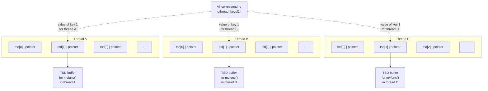

## Chương 31
# **THREADS: THREAD SAFETY VÀ LƯU TRỮ RIÊNG THEO THREAD**

Chương này mở rộng thảo luận về POSIX threads API, cung cấp mô tả về các hàm thread-safe và khởi tạo một lần (one-time initialization). Chúng ta cũng thảo luận cách sử dụng thread-specific data hoặc thread-local storage để biến một hàm hiện có thành thread-safe mà không cần thay đổi giao diện của hàm đó.

## **31.1 Thread Safety (và Reentrancy xem lại)**

Một hàm được gọi là thread-safe nếu nó có thể được gọi đồng thời bởi nhiều thread một cách an toàn; nói ngược lại, nếu một hàm không phải thread-safe, thì chúng ta không thể gọi nó từ một thread trong khi nó đang được thực thi trong một thread khác. Ví dụ, hàm sau (tương tự đoạn code chúng ta đã xem trong Phần 30.1) không phải thread-safe:

```
static int glob = 0;
static void
incr(int loops)
{
 int loc, j;
```

```
 for (j = 0; j < loops; j++) {
 loc = glob;
 loc++;
 glob = loc;
 }
}
```

Nếu nhiều thread gọi hàm này đồng thời, giá trị cuối cùng trong `glob` sẽ không thể đoán trước. Hàm này minh họa lý do điển hình khiến một hàm không phải thread-safe: nó sử dụng các biến global hoặc static được chia sẻ bởi tất cả các thread.

Có nhiều phương pháp để làm cho một hàm trở thành thread-safe. Một cách là gắn một mutex với hàm (hoặc có thể với tất cả các hàm trong một library, nếu chúng dùng chung các biến global), khóa mutex đó khi hàm được gọi, và mở khóa khi hàm trả về. Cách tiếp cận này có ưu điểm là đơn giản. Mặt khác, nó có nghĩa là chỉ một thread có thể thực thi hàm tại một thời điểm — ta nói rằng quyền truy cập vào hàm bị tuần tự hóa (serialized). Nếu các thread dành một lượng thời gian đáng kể để thực thi hàm này, thì việc tuần tự hóa này dẫn đến mất tính đồng thời (concurrency), vì các thread của chương trình không còn có thể thực thi song song nữa.

Một giải pháp tinh vi hơn là gắn mutex với một biến dùng chung. Sau đó chúng ta xác định những phần nào của hàm là critical section truy cập biến dùng chung, và chỉ acquire và release mutex trong quá trình thực thi các critical section đó. Điều này cho phép nhiều thread thực thi hàm cùng một lúc và hoạt động song song, trừ khi có nhiều hơn một thread cần thực thi một critical section.

### **Các hàm không phải thread-safe**

Để thuận tiện cho việc phát triển ứng dụng đa thread, tất cả các hàm được chỉ định trong SUSv3 đều phải được triển khai theo cách thread-safe, ngoại trừ những hàm được liệt kê trong Bảng 31-1. (Nhiều hàm trong số này không được thảo luận trong cuốn sách này.) Ngoài các hàm được liệt kê trong Bảng 31-1, SUSv3 còn chỉ định như sau:

-  Các hàm `ctermid()` và `tmpnam()` không cần phải thread-safe nếu được truyền đối số NULL.
-  Các hàm `wcrtomb()` và `wcsrtombs()` không cần phải thread-safe nếu đối số cuối cùng của chúng (`ps`) là NULL.

SUSv4 sửa đổi danh sách các hàm trong Bảng 31-1 như sau:

-  Các hàm `ecvt()`, `fcvt()`, `gcvt()`, `gethostbyname()`, và `gethostbyaddr()` bị loại bỏ, vì chúng đã được xóa khỏi tiêu chuẩn.
-  Các hàm `strsignal()` và `system()` được thêm vào. Hàm `system()` không phải reentrant vì những thao tác mà nó phải thực hiện với signal disposition có hiệu lực trên toàn process.

Các tiêu chuẩn không cấm một triển khai làm cho các hàm trong Bảng 31-1 trở thành thread-safe. Tuy nhiên, ngay cả khi một số hàm này là thread-safe trên một số triển khai, một ứng dụng portable không thể dựa vào điều này trên tất cả các triển khai.

**Bảng 31-1:** Các hàm mà SUSv3 không yêu cầu phải thread-safe

| `asctime()`      | `fcvt()`             | `getpwnam()`      | `nl_langinfo()`      |
|----------------|--------------------|-----------------|--------------------|
| `basename()`     | `ftw()`              | `getpwuid()`      | `ptsname()`          |
| `catgets()`      | `gcvt()`             | `getservbyname()` | `putc_unlocked()`    |
| `crypt()`        | `getc_unlocked()`    | `getservbyport()` | `putchar_unlocked()` |
| `ctime()`        | `getchar_unlocked()` | `getservent()`    | `putenv()`           |
| `dbm_clearerr()` | `getdate()`          | `getutxent()`     | `pututxline()`       |
| `dbm_close()`    | `getenv()`           | `getutxid()`      | `rand()`             |
| `dbm_delete()`   | `getgrent()`         | `getutxline()`    | `readdir()`          |
| `dbm_error()`    | `getgrgid()`         | `gmtime()`        | `setenv()`           |
| `dbm_fetch()`    | `getgrnam()`         | `hcreate()`       | `setgrent()`         |
| `dbm_firstkey()` | `gethostbyaddr()`    | `hdestroy()`      | `setkey()`           |
| `dbm_nextkey()`  | `gethostbyname()`    | `hsearch()`       | `setpwent()`         |
| `dbm_open()`     | `gethostent()`       | `inet_ntoa()`     | `setutxent()`        |
| `dbm_store()`    | `getlogin()`         | `l64a()`          | `strerror()`         |
| `dirname()`      | `getnetbyaddr()`     | `lgamma()`        | `strtok()`           |
| `dlerror()`      | `getnetbyname()`     | `lgammaf()`       | `ttyname()`          |
| `drand48()`      | `getnetent()`        | `lgammal()`       | `unsetenv()`         |
| `ecvt()`         | `getopt()`           | `localeconv()`    | `wcstombs()`         |
| `encrypt()`      | `getprotobyname()`   | `localtime()`     | `wctomb()`           |
| `endgrent()`     | `getprotobynumber()` | `lrand48()`       |                    |
| `endpwent()`     | `getprotoent()`      | `mrand48()`       |                    |
| `endutxent()`    | `getpwent()`         | `nftw()`          |                    |

### **Các hàm reentrant và nonreentrant**

Mặc dù việc sử dụng critical section để triển khai thread safety là một cải tiến đáng kể so với việc dùng mutex cho từng hàm, nhưng nó vẫn còn kém hiệu quả vì có chi phí cho việc khóa và mở khóa mutex. Một hàm reentrant đạt được thread safety mà không cần dùng mutex. Nó làm điều này bằng cách tránh sử dụng các biến global và static. Bất kỳ thông tin nào phải được trả về cho người gọi, hoặc cần được duy trì giữa các lần gọi hàm, đều được lưu trữ trong các buffer do người gọi cấp phát. (Chúng ta lần đầu gặp reentrancy khi thảo luận về việc xử lý các biến global trong signal handler ở Phần 21.1.2.) Tuy nhiên, không phải tất cả các hàm đều có thể trở thành reentrant. Những lý do thông thường là:

-  Do bản chất của chúng, một số hàm phải truy cập các cấu trúc dữ liệu global. Các hàm trong malloc library là ví dụ điển hình. Những hàm này duy trì một danh sách liên kết global các khối tự do trên heap. Các hàm của malloc library được làm thread-safe thông qua việc sử dụng mutex.
-  Một số hàm (được định nghĩa trước khi thread ra đời) có giao diện theo định nghĩa là nonreentrant, vì chúng trả về con trỏ đến vùng nhớ được cấp phát tĩnh bởi hàm, hoặc chúng sử dụng vùng nhớ static để duy trì thông tin giữa các lần gọi liên tiếp đến cùng một hàm (hoặc một hàm liên quan). Hầu hết các hàm trong Bảng 31-1 đều thuộc loại này. Ví dụ, hàm `asctime()` (Phần 10.2.3) trả về con trỏ đến một buffer được cấp phát tĩnh chứa chuỗi ngày-giờ.

Đối với một số hàm có giao diện nonreentrant, SUSv3 chỉ định các hàm tương đương reentrant với tên kết thúc bằng hậu tố `_r`. Những hàm này yêu cầu người gọi cấp phát một buffer có địa chỉ được truyền vào hàm và dùng để trả về kết quả. Điều này cho phép thread gọi dùng một biến local (trên stack) cho buffer kết quả của hàm. Vì mục đích này, SUSv3 chỉ định `asctime_r()`, `ctime_r()`, `getgrgid_r()`, `getgrnam_r()`, `getlogin_r()`, `getpwnam_r()`, `getpwuid_r()`, `gmtime_r()`, `localtime_r()`, `rand_r()`, `readdir_r()`, `strerror_r()`, `strtok_r()`, và `ttyname_r()`.

> Một số triển khai cũng cung cấp thêm các hàm tương đương reentrant của các hàm nonreentrant truyền thống khác. Ví dụ, glibc cung cấp `crypt_r()`, `gethostbyname_r()`, `getservbyname_r()`, `getutent_r()`, `getutid_r()`, `getutline_r()`, và `ptsname_r()`. Tuy nhiên, một ứng dụng portable không thể dựa vào sự hiện diện của những hàm này trên các triển khai khác. Trong một số trường hợp, SUSv3 không chỉ định các hàm tương đương reentrant này vì đã tồn tại các giải pháp thay thế cho các hàm truyền thống vừa tốt hơn vừa reentrant. Ví dụ, `getaddrinfo()` là giải pháp thay thế hiện đại, reentrant cho `gethostbyname()` và `getservbyname()`.

## **31.2 Khởi tạo Một Lần (One-Time Initialization)**

Đôi khi, một ứng dụng đa thread cần đảm bảo rằng một hành động khởi tạo nào đó chỉ xảy ra một lần, bất kể có bao nhiêu thread được tạo ra. Ví dụ, một mutex có thể cần được khởi tạo với các thuộc tính đặc biệt bằng `pthread_mutex_init()`, và việc khởi tạo đó chỉ được xảy ra một lần. Nếu chúng ta tạo các thread từ chương trình chính (main program), thì điều này thường dễ thực hiện — chúng ta thực hiện khởi tạo trước khi tạo bất kỳ thread nào phụ thuộc vào việc khởi tạo đó. Tuy nhiên, trong một hàm library, điều này là không thể, vì chương trình gọi có thể tạo các thread trước lần gọi đầu tiên đến hàm library. Do đó, hàm library cần một phương pháp để thực hiện khởi tạo lần đầu tiên nó được gọi từ bất kỳ thread nào.

Một hàm library có thể thực hiện khởi tạo một lần bằng cách sử dụng hàm `pthread_once()`.

```
#include <pthread.h>
int pthread_once(pthread_once_t *once_control, void (*init)(void));
                      Returns 0 on success, or a positive error number on error
```

Hàm `pthread_once()` sử dụng trạng thái của đối số `once_control` để đảm bảo rằng hàm do người gọi định nghĩa được trỏ đến bởi `init` chỉ được gọi một lần, bất kể `pthread_once()` được gọi bao nhiêu lần hoặc từ bao nhiêu thread khác nhau.

Hàm `init` được gọi mà không có đối số nào, và do đó có dạng sau:

```
void
init(void)
{
 /* Function body */
}
```

Đối số `once_control` là con trỏ đến một biến phải được khởi tạo tĩnh với giá trị `PTHREAD_ONCE_INIT`:

```
pthread_once_t once_var = PTHREAD_ONCE_INIT;
```

Lần gọi đầu tiên đến `pthread_once()` với con trỏ đến một biến `pthread_once_t` cụ thể sẽ sửa đổi giá trị của biến được trỏ đến bởi `once_control` để các lần gọi `pthread_once()` tiếp theo không gọi `init` nữa.

Một cách sử dụng phổ biến của `pthread_once()` là kết hợp với thread-specific data, được mô tả tiếp theo.

> Lý do chính cho sự tồn tại của `pthread_once()` là trong các phiên bản Pthreads đầu tiên, không thể khởi tạo tĩnh một mutex. Thay vào đó, phải sử dụng `pthread_mutex_init()` ([Butenhof, 1996]). Với việc bổ sung sau này các mutex được cấp phát tĩnh, một hàm library có thể thực hiện khởi tạo một lần bằng cách sử dụng mutex được cấp phát tĩnh và một biến Boolean tĩnh. Tuy nhiên, `pthread_once()` vẫn được giữ lại như một tiện ích.

## **31.3 Thread-Specific Data**

Cách hiệu quả nhất để làm cho một hàm trở thành thread-safe là làm cho nó reentrant. Tất cả các hàm library mới nên được triển khai theo cách này. Tuy nhiên, đối với một hàm library nonreentrant hiện có (có thể được thiết kế trước khi việc sử dụng thread trở nên phổ biến), cách tiếp cận này thường đòi hỏi phải thay đổi giao diện của hàm, nghĩa là phải sửa đổi tất cả các chương trình sử dụng hàm đó.

Thread-specific data là một kỹ thuật để làm cho một hàm library nonreentrant hiện có trở thành thread-safe mà không thay đổi giao diện của nó. Một hàm sử dụng thread-specific data có thể kém hiệu quả hơn một chút so với hàm reentrant, nhưng cho phép chúng ta giữ nguyên các chương trình gọi hàm đó mà không cần thay đổi.

Thread-specific data cho phép một hàm duy trì một bản sao riêng của một biến cho mỗi thread gọi hàm đó, như minh họa trong Hình 31-1. Thread-specific data có tính persistent; biến của mỗi thread tiếp tục tồn tại giữa các lần gọi hàm của thread đó. Điều này cho phép hàm duy trì thông tin theo từng thread giữa các lần gọi hàm, và cho phép hàm truyền các buffer kết quả riêng biệt (nếu cần) cho mỗi thread gọi.

```text
 ┌──────────┐        ┌─────────────────┐
 │ Thread A │───────>│   TSD buffer    │
 └──────────┘        │  for myfunc()   │
                     │   in thread A   │
                     └─────────────────┘

 ┌──────────┐        ┌─────────────────┐
 │ Thread B │───────>│   TSD buffer    │
 └──────────┘        │  for myfunc()   │
                     │   in thread B   │
                     └─────────────────┘

 ┌──────────┐        ┌─────────────────┐
 │ Thread C │───────>│   TSD buffer    │
 └──────────┘        │  for myfunc()   │
                     │   in thread C   │
                     └─────────────────┘
```

**Hình 31-1:** Thread-specific data (TSD) cung cấp vùng lưu trữ riêng theo thread cho một hàm

## **31.3.1 Thread-Specific Data từ Góc Nhìn của Hàm Library**

Để hiểu cách sử dụng thread-specific data API, chúng ta cần xem xét mọi thứ từ góc nhìn của một hàm library sử dụng thread-specific data:

-  Hàm phải cấp phát một khối vùng nhớ riêng biệt cho mỗi thread gọi hàm. Khối này cần được cấp phát một lần, lần đầu tiên thread gọi hàm.
-  Ở mỗi lần gọi tiếp theo từ cùng một thread, hàm cần có khả năng lấy địa chỉ của khối vùng nhớ đã được cấp phát lần đầu tiên thread này gọi hàm. Hàm không thể duy trì con trỏ đến khối trong một biến tự động (automatic variable), vì các biến tự động biến mất khi hàm trả về; cũng không thể lưu con trỏ trong một biến static, vì chỉ có một thể hiện của mỗi biến static tồn tại trong process. Pthreads API cung cấp các hàm để xử lý tác vụ này.
-  Các hàm khác nhau (độc lập nhau) có thể mỗi hàm cần thread-specific data riêng. Mỗi hàm cần một phương pháp để xác định thread-specific data của nó (một key), khác biệt với thread-specific data được sử dụng bởi các hàm khác.
-  Hàm không có quyền kiểm soát trực tiếp những gì xảy ra khi thread kết thúc. Khi thread kết thúc, nó có thể đang thực thi code bên ngoài hàm. Tuy nhiên, phải có một cơ chế (destructor) để đảm bảo rằng khối vùng nhớ được cấp phát cho thread này được tự động giải phóng khi thread kết thúc. Nếu không làm điều này, thì có thể xảy ra rò rỉ bộ nhớ (memory leak) khi các thread liên tục được tạo ra, gọi hàm, rồi kết thúc.

## **31.3.2 Tổng Quan về Thread-Specific Data API**

Các bước chung mà một hàm library thực hiện để sử dụng thread-specific data như sau:

- 1. Hàm tạo một key, là phương tiện để phân biệt thread-specific data item được sử dụng bởi hàm này với các thread-specific data item được sử dụng bởi các hàm khác. Key được tạo bằng cách gọi hàm `pthread_key_create()`. Việc tạo key chỉ cần thực hiện một lần, khi thread đầu tiên gọi hàm. Vì mục đích này, `pthread_once()` được sử dụng. Việc tạo key không cấp phát bất kỳ khối thread-specific data nào.
- 2. Lời gọi `pthread_key_create()` phục vụ một mục đích thứ hai: nó cho phép người gọi chỉ định địa chỉ của hàm destructor do lập trình viên định nghĩa, được dùng để giải phóng mỗi khối vùng nhớ được cấp phát cho key này (xem bước tiếp theo). Khi một thread có thread-specific data kết thúc, Pthreads API tự động gọi destructor, truyền cho nó một con trỏ đến khối dữ liệu của thread này.
- 3. Hàm cấp phát một khối thread-specific data cho mỗi thread mà nó được gọi từ đó. Điều này được thực hiện bằng `malloc()` (hoặc một hàm tương tự). Việc cấp phát này được thực hiện một lần cho mỗi thread, lần đầu tiên thread gọi hàm.
- 4. Để lưu con trỏ đến vùng nhớ được cấp phát ở bước trước, hàm sử dụng hai hàm Pthreads: `pthread_setspecific()` và `pthread_getspecific()`. Một lời gọi `pthread_setspecific()` là một yêu cầu đến triển khai Pthreads rằng:

"hãy lưu con trỏ này, ghi nhận rằng nó được liên kết với một key cụ thể (key dành cho hàm này) và một thread cụ thể (thread đang gọi)." Gọi `pthread_getspecific()` thực hiện tác vụ bổ sung, trả về con trỏ đã được liên kết trước đó với một key đã cho cho thread đang gọi. Nếu không có con trỏ nào được liên kết trước đó với một key và thread cụ thể, thì `pthread_getspecific()` trả về NULL. Đây là cách một hàm có thể xác định rằng nó đang được gọi lần đầu tiên bởi thread này, và do đó phải cấp phát khối vùng nhớ cho thread.

## **31.3.3 Chi Tiết về Thread-Specific Data API**

Trong phần này, chúng ta cung cấp chi tiết về từng hàm được đề cập trong phần trước, và làm rõ hoạt động của thread-specific data bằng cách mô tả cách nó thường được triển khai. Phần tiếp theo cho thấy cách sử dụng thread-specific data để viết một triển khai thread-safe của hàm `strerror()` trong thư viện C chuẩn.

Gọi `pthread_key_create()` tạo một key thread-specific data mới được trả về cho người gọi trong buffer được trỏ đến bởi `key`.

```
#include <pthread.h>
int pthread_key_create(pthread_key_t *key, void (*destructor)(void *));
                      Returns 0 on success, or a positive error number on error
```

Vì key được trả về được sử dụng bởi tất cả các thread trong process, `key` nên trỏ đến một biến global.

Đối số `destructor` trỏ đến một hàm do lập trình viên định nghĩa có dạng sau:

```
void
dest(void *value)
{
 /* Release storage pointed to by 'value' */
}
```

Khi một thread có giá trị non-NULL được liên kết với `key` kết thúc, hàm destructor được Pthreads API tự động gọi và được truyền giá trị đó làm đối số. Giá trị được truyền thường là con trỏ đến khối thread-specific data của thread này cho key này. Nếu không cần destructor, thì `destructor` có thể được chỉ định là NULL.

> Nếu một thread có nhiều khối thread-specific data, thì thứ tự gọi các destructor là không xác định. Các hàm destructor nên được thiết kế để hoạt động độc lập với nhau.

Xem xét triển khai của thread-specific data giúp chúng ta hiểu cách nó được sử dụng. Một triển khai điển hình (NPTL là điển hình) bao gồm các mảng sau:

 một mảng global (tức là trên toàn process) chứa thông tin về các key thread-specific data; và

 một tập hợp các mảng theo từng thread, mỗi mảng chứa các con trỏ đến tất cả các khối thread-specific data được cấp phát cho một thread cụ thể (tức là mảng này chứa các con trỏ được lưu bởi các lời gọi `pthread_setspecific()`).

Trong triển khai này, giá trị `pthread_key_t` được trả về bởi `pthread_key_create()` đơn giản là một chỉ số vào mảng global, mà chúng ta gọi là `pthread_keys`, có dạng như trong Hình 31-2. Mỗi phần tử của mảng này là một struct chứa hai trường. Trường đầu tiên cho biết phần tử mảng này có đang được sử dụng không (tức là đã được cấp phát bởi một lời gọi `pthread_key_create()` trước đó). Trường thứ hai được dùng để lưu trữ con trỏ đến hàm destructor cho các khối thread-specific data của key này (tức là đây là bản sao của đối số `destructor` cho `pthread_key_create()`).

```text
pthread_keys[0]  ┌──────────────────┐
                 │   "in use" flag  │
                 ├──────────────────┤
                 │destructor pointer│
                 ├──────────────────┤
pthread_keys[1]  │   "in use" flag  │
                 ├──────────────────┤
                 │destructor pointer│
                 ├──────────────────┤
pthread_keys[2]  │   "in use" flag  │
                 ├──────────────────┤
                 │destructor pointer│
                 ├──────────────────┤
                 │       ...        │
                 └──────────────────┘
```

**Hình 31-2:** Triển khai các key thread-specific data

Hàm `pthread_setspecific()` yêu cầu Pthreads API lưu một bản sao của `value` trong một cấu trúc dữ liệu liên kết nó với thread đang gọi và với `key`, một key được trả về bởi một lời gọi `pthread_key_create()` trước đó. Hàm `pthread_getspecific()` thực hiện thao tác ngược lại, trả về giá trị đã được liên kết trước đó với key đã cho cho thread này.

```
#include <pthread.h>
int pthread_setspecific(pthread_key_t key, const void *value);
                       Returns 0 on success, or a positive error number on error
void *pthread_getspecific(pthread_key_t key);
          Returns pointer, or NULL if no thread-specific data isassociated with key
```

Đối số `value` được truyền cho `pthread_setspecific()` thường là con trỏ đến một khối vùng nhớ đã được cấp phát trước đó bởi người gọi. Con trỏ này sẽ được truyền như đối số cho hàm destructor của key này khi thread kết thúc.

> Đối số `value` không nhất thiết phải là con trỏ đến một khối vùng nhớ. Nó có thể là một giá trị scalar có thể được gán (với một phép cast) vào `void *`. Trong trường hợp này, lời gọi `pthread_key_create()` trước đó sẽ chỉ định `destructor` là NULL.

Hình 31-3 cho thấy một triển khai điển hình của cấu trúc dữ liệu được dùng để lưu `value`. Trong sơ đồ này, chúng ta giả định rằng `pthread_keys[1]` được cấp phát cho một hàm có tên `myfunc()`. Đối với mỗi thread, Pthreads API duy trì một mảng các con trỏ đến các khối thread-specific data. Các phần tử của mỗi mảng thread-specific này có sự tương ứng một-một với các phần tử của mảng `pthread_keys` global trong Hình 31-2. Hàm `pthread_setspecific()` đặt phần tử tương ứng với `key` trong mảng của thread đang gọi.



**Hình 31-3:** Cấu trúc dữ liệu dùng để triển khai các con trỏ thread-specific data (TSD)

Khi một thread được tạo lần đầu, tất cả các con trỏ thread-specific data của nó được khởi tạo là NULL. Điều này có nghĩa là khi hàm library của chúng ta được gọi bởi một thread lần đầu tiên, nó phải bắt đầu bằng cách sử dụng `pthread_getspecific()` để kiểm tra xem thread đã có giá trị được liên kết với `key` chưa. Nếu chưa, thì hàm cấp phát một khối vùng nhớ và lưu con trỏ đến khối đó bằng `pthread_setspecific()`. Chúng ta trình bày ví dụ về điều này trong triển khai thread-safe của `strerror()` ở phần tiếp theo.

## **31.3.4 Sử Dụng Thread-Specific Data API**

Khi chúng ta lần đầu mô tả hàm `strerror()` chuẩn trong Phần 3.4, chúng ta đã lưu ý rằng nó có thể trả về con trỏ đến một chuỗi được cấp phát tĩnh như kết quả hàm. Điều này có nghĩa là `strerror()` có thể không phải thread-safe. Trong vài trang tiếp theo, chúng ta sẽ xem xét một triển khai `strerror()` không phải thread-safe, và sau đó chỉ ra cách thread-specific data có thể được dùng để làm cho hàm này trở thành thread-safe.

Trên nhiều triển khai UNIX, bao gồm Linux, hàm `strerror()` được cung cấp bởi thư viện C chuẩn là thread-safe. Tuy nhiên, chúng ta vẫn dùng ví dụ về `strerror()`, vì SUSv3 không yêu cầu hàm này phải thread-safe, và triển khai của nó cung cấp một ví dụ đơn giản về việc sử dụng thread-specific data.

Listing 31-1 cho thấy một triển khai đơn giản không phải thread-safe của `strerror()`. Hàm này sử dụng một cặp biến global được định nghĩa bởi glibc: `_sys_errlist` là một mảng các con trỏ đến các chuỗi tương ứng với các số lỗi trong `errno` (chẳng hạn, `_sys_errlist[EINVAL]` trỏ đến chuỗi Invalid operation), và `_sys_nerr` chỉ định số phần tử trong `_sys_errlist`.

**Listing 31-1:** Một triển khai `strerror()` không phải thread-safe

```
–––––––––––––––––––––––––––––––––––––––––––––––––––––––– threads/strerror.c
#define _GNU_SOURCE /* Get '_sys_nerr' and '_sys_errlist'
 declarations from <stdio.h> */
#include <stdio.h>
#include <string.h> /* Get declaration of strerror() */
#define MAX_ERROR_LEN 256 /* Maximum length of string
 returned by strerror() */
static char buf[MAX_ERROR_LEN]; /* Statically allocated return buffer */
char *
strerror(int err)
{
 if (err < 0 || err >= _sys_nerr || _sys_errlist[err] == NULL) {
 snprintf(buf, MAX_ERROR_LEN, "Unknown error %d", err);
 } else {
 strncpy(buf, _sys_errlist[err], MAX_ERROR_LEN - 1);
 buf[MAX_ERROR_LEN - 1] = '\0'; /* Ensure null termination */
 }
 return buf;
}
–––––––––––––––––––––––––––––––––––––––––––––––––––––––– threads/strerror.c
```

Chúng ta có thể sử dụng chương trình trong Listing 31-2 để minh họa hệ quả của việc triển khai `strerror()` trong Listing 31-1 không phải thread-safe. Chương trình này gọi `strerror()` từ hai thread khác nhau, nhưng chỉ hiển thị giá trị được trả về sau khi cả hai thread đều đã gọi `strerror()`. Mặc dù mỗi thread chỉ định một giá trị khác nhau (EINVAL và EPERM) làm đối số cho `strerror()`, đây là những gì chúng ta thấy khi biên dịch và liên kết chương trình này với phiên bản `strerror()` trong Listing 31-1:

```
$ ./strerror_test
```

```
Main thread has called strerror()
Other thread about to call strerror()
Other thread: str (0x804a7c0) = Operation not permitted
Main thread: str (0x804a7c0) = Operation not permitted
```

Cả hai thread đều hiển thị chuỗi errno tương ứng với EPERM, vì lời gọi `strerror()` của thread thứ hai (trong `threadFunc`) đã ghi đè buffer mà lời gọi `strerror()` trong main thread đã ghi. Xem xét kết quả đầu ra cho thấy biến local `str` trong hai thread trỏ đến cùng một địa chỉ bộ nhớ.

**Listing 31-2:** Gọi `strerror()` từ hai thread khác nhau

```
––––––––––––––––––––––––––––––––––––––––––––––––––– threads/strerror_test.c
#include <stdio.h>
#include <string.h> /* Get declaration of strerror() */
#include <pthread.h>
#include "tlpi_hdr.h"
static void *
threadFunc(void *arg)
{
 char *str;
 printf("Other thread about to call strerror()\n");
 str = strerror(EPERM);
 printf("Other thread: str (%p) = %s\n", str, str);
 return NULL;
}
int
main(int argc, char *argv[])
{
 pthread_t t;
 int s;
 char *str;
 str = strerror(EINVAL);
 printf("Main thread has called strerror()\n");
 s = pthread_create(&t, NULL, threadFunc, NULL);
 if (s != 0)
 errExitEN(s, "pthread_create");
 s = pthread_join(t, NULL);
 if (s != 0)
 errExitEN(s, "pthread_join");
 printf("Main thread: str (%p) = %s\n", str, str);
 exit(EXIT_SUCCESS);
}
––––––––––––––––––––––––––––––––––––––––––––––––––– threads/strerror_test.c
```

Listing 31-3 cho thấy một triển khai lại của `strerror()` sử dụng thread-specific data để đảm bảo thread safety.

Bước đầu tiên mà `strerror()` được sửa đổi thực hiện là gọi `pthread_once()` r để đảm bảo rằng lần gọi đầu tiên của hàm này (từ bất kỳ thread nào) sẽ gọi `createKey()` w. Hàm `createKey()` gọi `pthread_key_create()` để cấp phát một key thread-specific data được lưu trong biến global `strerrorKey` e. Lời gọi `pthread_key_create()` cũng ghi lại địa chỉ của hàm destructor q sẽ được dùng để giải phóng các buffer thread-specific tương ứng với key này.

Hàm `strerror()` sau đó gọi `pthread_getspecific()` t để lấy địa chỉ của buffer riêng của thread này tương ứng với `strerrorKey`. Nếu `pthread_getspecific()` trả về NULL, thì thread này đang gọi `strerror()` lần đầu tiên, và vì vậy hàm cấp phát một buffer mới bằng `malloc()` y, và lưu địa chỉ của buffer bằng `pthread_setspecific()` u. Nếu lời gọi `pthread_getspecific()` trả về giá trị non-NULL, thì con trỏ đó tham chiếu đến một buffer hiện có đã được cấp phát khi thread này trước đó đã gọi `strerror()`.

Phần còn lại của triển khai `strerror()` này tương tự triển khai mà chúng ta đã trình bày trước đó, với sự khác biệt là `buf` là địa chỉ của một buffer thread-specific data, thay vì một biến static.

**Listing 31-3:** Một triển khai thread-safe của `strerror()` sử dụng thread-specific data

```
–––––––––––––––––––––––––––––––––––––––––––––––––––– threads/strerror_tsd.c
  #define _GNU_SOURCE /* Get '_sys_nerr' and '_sys_errlist'
   declarations from <stdio.h> */
  #include <stdio.h>
  #include <string.h> /* Get declaration of strerror() */
  #include <pthread.h>
  #include "tlpi_hdr.h"
  static pthread_once_t once = PTHREAD_ONCE_INIT;
  static pthread_key_t strerrorKey;
  #define MAX_ERROR_LEN 256 /* Maximum length of string in per-thread
   buffer returned by strerror() */
  static void /* Free thread-specific data buffer */
q destructor(void *buf)
  {
   free(buf);
  }
  static void /* One-time key creation function */
w createKey(void)
  {
   int s;
   /* Allocate a unique thread-specific data key and save the address
   of the destructor for thread-specific data buffers */
e s = pthread_key_create(&strerrorKey, destructor);
   if (s != 0)
   errExitEN(s, "pthread_key_create");
  }
```

```
char *
  strerror(int err)
  {
   int s;
   char *buf;
   /* Make first caller allocate key for thread-specific data */
r s = pthread_once(&once, createKey);
   if (s != 0)
   errExitEN(s, "pthread_once");
t buf = pthread_getspecific(strerrorKey);
   if (buf == NULL) { /* If first call from this thread, allocate
   buffer for thread, and save its location */
y buf = malloc(MAX_ERROR_LEN);
   if (buf == NULL)
   errExit("malloc");
u s = pthread_setspecific(strerrorKey, buf);
   if (s != 0)
   errExitEN(s, "pthread_setspecific");
   }
   if (err < 0 || err >= _sys_nerr || _sys_errlist[err] == NULL) {
   snprintf(buf, MAX_ERROR_LEN, "Unknown error %d", err);
   } else {
   strncpy(buf, _sys_errlist[err], MAX_ERROR_LEN - 1);
   buf[MAX_ERROR_LEN - 1] = '\0'; /* Ensure null termination */
   }
   return buf;
  }
  –––––––––––––––––––––––––––––––––––––––––––––––––––– threads/strerror_tsd.c
```

Nếu chúng ta biên dịch và liên kết chương trình kiểm tra của mình (Listing 31-2) với phiên bản mới của `strerror()` (Listing 31-3) để tạo một file thực thi `strerror_test_tsd`, thì chúng ta thấy các kết quả sau khi chạy chương trình:

```
$ ./strerror_test_tsd
Main thread has called strerror()
```

```
Other thread about to call strerror()
Other thread: str (0x804b158) = Operation not permitted
Main thread: str (0x804b008) = Invalid argument
```

Từ kết quả này, chúng ta thấy rằng phiên bản mới của `strerror()` là thread-safe. Chúng ta cũng thấy rằng địa chỉ được trỏ đến bởi biến local `str` trong hai thread là khác nhau.

## **31.3.5 Giới Hạn Triển Khai Thread-Specific Data**

Như đã được gợi ý bởi mô tả về cách thread-specific data thường được triển khai, một triển khai có thể cần áp đặt giới hạn về số lượng key thread-specific data mà nó hỗ trợ. SUSv3 yêu cầu một triển khai hỗ trợ ít nhất 128 (`_POSIX_THREAD_KEYS_MAX`) key. Một ứng dụng có thể xác định số key mà một triển khai thực sự hỗ trợ thông qua định nghĩa của `PTHREAD_KEYS_MAX` (định nghĩa trong `<limits.h>`) hoặc bằng cách gọi `sysconf(_SC_THREAD_KEYS_MAX)`. Linux hỗ trợ tối đa 1024 key.

Ngay cả 128 key cũng nên là quá đủ cho hầu hết các ứng dụng. Điều này là vì mỗi hàm library chỉ nên sử dụng một số lượng nhỏ key — thường chỉ một. Nếu một hàm cần nhiều giá trị thread-specific data, chúng thường có thể được đặt trong một struct duy nhất chỉ có một key thread-specific data liên kết.

## **31.4 Thread-Local Storage**

Giống như thread-specific data, thread-local storage cung cấp vùng lưu trữ persistent theo từng thread. Tính năng này không phải tiêu chuẩn, nhưng nó được cung cấp ở dạng giống nhau hoặc tương tự trên nhiều triển khai UNIX khác (ví dụ: Solaris và FreeBSD).

Ưu điểm chính của thread-local storage là nó đơn giản hơn nhiều so với thread-specific data. Để tạo một biến thread-local, chúng ta chỉ cần thêm specifier `__thread` vào khai báo của một biến global hoặc static:

```
static __thread buf[MAX_ERROR_LEN];
```

Mỗi thread có bản sao riêng của các biến được khai báo với specifier này. Các biến trong thread-local storage của một thread tồn tại cho đến khi thread kết thúc, lúc đó vùng nhớ được tự động giải phóng.

Lưu ý các điểm sau về khai báo và sử dụng biến thread-local:

-  Từ khóa `__thread` phải đứng ngay sau từ khóa `static` hoặc `extern`, nếu một trong hai được chỉ định trong khai báo biến.
-  Khai báo của một biến thread-local có thể bao gồm một bộ khởi tạo (initializer), theo cách tương tự như khai báo biến global hoặc static thông thường.
-  Toán tử địa chỉ C (`&`) có thể được dùng để lấy địa chỉ của một biến thread-local.

Thread-local storage yêu cầu sự hỗ trợ từ kernel (được cung cấp trong Linux 2.6), triển khai Pthreads (được cung cấp trong NPTL), và trình biên dịch C (được cung cấp trên x86-32 với gcc 3.3 trở lên).

Listing 31-4 cho thấy một triển khai thread-safe của `strerror()` sử dụng thread-local storage. Nếu chúng ta biên dịch và liên kết chương trình kiểm tra của mình (Listing 31-2) với phiên bản `strerror()` này để tạo file thực thi `strerror_test_tls`, thì chúng ta thấy các kết quả sau khi chạy chương trình:

```
$ ./strerror_test_tls
```

```
Main thread has called strerror()
Other thread about to call strerror()
Other thread: str (0x40376ab0) = Operation not permitted
Main thread: str (0x40175080) = Invalid argument
```

**Listing 31-4:** Một triển khai thread-safe của `strerror()` sử dụng thread-local storage

```
–––––––––––––––––––––––––––––––––––––––––––––––––––– threads/strerror_tls.c
#define _GNU_SOURCE /* Get '_sys_nerr' and '_sys_errlist'
 declarations from <stdio.h> */
#include <stdio.h>
#include <string.h> /* Get declaration of strerror() */
#include <pthread.h>
#define MAX_ERROR_LEN 256 /* Maximum length of string in per-thread
 buffer returned by strerror() */
static __thread char buf[MAX_ERROR_LEN];
 /* Thread-local return buffer */
char *
strerror(int err)
{
 if (err < 0 || err >= _sys_nerr || _sys_errlist[err] == NULL) {
 snprintf(buf, MAX_ERROR_LEN, "Unknown error %d", err);
 } else {
 strncpy(buf, _sys_errlist[err], MAX_ERROR_LEN - 1);
 buf[MAX_ERROR_LEN - 1] = '\0'; /* Ensure null termination */
 }
 return buf;
}
––––––––––––––––––––––––––––––––––––––––––––––––––––– threads/strerror_tls.c
```

## **31.5 Tóm Tắt**

Một hàm được gọi là thread-safe nếu nó có thể được gọi an toàn từ nhiều thread cùng một lúc. Lý do thông thường khiến một hàm không phải thread-safe là nó sử dụng các biến global hoặc static. Một cách để làm cho một hàm không thread-safe trở nên an toàn trong ứng dụng đa thread là bảo vệ tất cả các lời gọi đến hàm bằng một mutex lock. Cách tiếp cận này gặp phải vấn đề là nó giảm tính đồng thời (concurrency), vì chỉ có một thread có thể ở trong hàm tại bất kỳ thời điểm nào. Một cách tiếp cận cho phép đồng thời cao hơn là thêm mutex lock xung quanh chỉ những phần của hàm thao tác các biến dùng chung (các critical section).

Mutex có thể được dùng để làm cho hầu hết các hàm trở thành thread-safe, nhưng chúng mang lại hình phạt về hiệu năng vì có chi phí cho việc khóa và mở khóa mutex. Bằng cách tránh sử dụng các biến global và static, một hàm reentrant đạt được thread-safety mà không cần mutex.

Hầu hết các hàm được chỉ định trong SUSv3 đều phải là thread-safe. SUSv3 cũng liệt kê một tập nhỏ các hàm không bắt buộc phải thread-safe. Thông thường, đây là các hàm sử dụng vùng nhớ static để trả về thông tin cho người gọi hoặc để duy trì thông tin giữa các lần gọi liên tiếp. Theo định nghĩa, những hàm như vậy không phải reentrant, và mutex không thể được dùng để làm cho chúng thread-safe. Chúng ta đã xem xét hai kỹ thuật lập trình gần như tương đương — thread-specific data và thread-local storage — có thể được dùng để làm cho một hàm không an toàn trở thành thread-safe mà không cần thay đổi giao diện của nó. Cả hai kỹ thuật này đều cho phép một hàm cấp phát vùng lưu trữ persistent, theo từng thread.

## **Tài Liệu Tham Khảo Thêm**

Tham khảo các nguồn thông tin thêm được liệt kê trong Phần 29.10.

# **31.6 Bài Tập**

- **31-1.** Triển khai một hàm, `one_time_init(control, init)`, thực hiện tương đương với `pthread_once()`. Đối số `control` nên là con trỏ đến một struct được cấp phát tĩnh chứa một biến Boolean và một mutex. Biến Boolean cho biết liệu hàm `init` đã được gọi chưa, và mutex kiểm soát quyền truy cập vào biến đó. Để giữ cho việc triển khai đơn giản, bạn có thể bỏ qua các khả năng như `init()` thất bại hoặc bị hủy khi được gọi lần đầu từ một thread (tức là không cần nghĩ ra một cơ chế mà theo đó, nếu sự kiện như vậy xảy ra, thread tiếp theo gọi `one_time_init()` sẽ thử lại lời gọi đến `init()`).
- **31-2.** Sử dụng thread-specific data để viết các phiên bản thread-safe của `dirname()` và `basename()` (Phần 18.14).
